{0}------------------------------------------------

# IMS Master List of Contents

| Chapter No. | Title                                                 | Issue Date    | Revision No |
| ----------- | ----------------------------------------------------- | ------------- | ----------- |
|             | IMS Master List of Contents                           | 1st July 2014 | 0           |
|             | Register Of Manual Holders(Office + Fleet)            | 1st July 2014 | 0           |
| IMS 00      | IMS Reading Record                                    | 1st July 2014 | 0           |
|             | Revision Control                                      | 1st July 2014 | 0           |
|             | Cross Reference Matrix - IMS-ISM-ISO-OHSAS            | 1st July 2014 | 0           |
| IMS 01      | Company IMS and Policies                              | 1st July 2014 | 0           |
| IMS 02      | Responsibility & Authority                            | 1st July 2014 | 0           |
| IMS 03      | HSEQA Regime                                          | 1st July 2014 | 0           |
| IMS 04      | Personnel Safety and Occupational Health              | 1st July 2014 | 0           |
| IMS 05      | Personnel Resources, Shore based and Seagoing         | 1st July 2014 | 0           |
| IMS 06      | Personnel Training, Shipboard and Shore based         | 1st July 2014 | 0           |
| IMS 07      | Accident/Incident/Near Miss Reporting & Investigation | 1st July 2014 | 0           |
| IMS 08      | Environmental Protection and Pollution Prevention     | 1st July 2014 | 0           |
| IMS 09      | Office and Vessel Audits                              | 1st July 2014 | 0           |
| IMS 10      | Document and Data Control                             | 1st July 2014 | 0           |
| IMS 11A     | Reporting and Communication                           | 1st July 2014 | 0           |
| IMS 11B     | Procurement of Goods and Services                     | 1st July 2014 | 0           |
| IMS 12      | Planned Maintenance System                            | 1st July 2014 | 0           |
| IMS 14      | Bridge Procedures                                     | 1st July 2014 | 0           |
| IMS 15      | Deck Procedures                                       | 1st July 2014 | 0           |
| IMS 16      | Offshore Operations                                   | 1st July 2014 | 0           |
| IMS 17      | Engine Room Procedures                                | 1st July 2014 | 0           |
| IMS 18      | Emergency Response Procedures                         | 1st July 2014 | 0           |

{1}------------------------------------------------

|                                 | IMS 00 - Register of Manual Holders (Office + Fleet) | Issue Status  | 2nd Edition, Rev 0 |
| ------------------------------- | ---------------------------------------------------- | ------------- | ------------------ |
| INTEGRATED MANAGEMENT SYSTEM |                                                      | Issue Date    | 1st July 2014      |
|                                 |                                                      | Issued by     | DPA                |
|                                 |                                                      | Authorised By | Director PFS       |

# Register of Manual Holders (Office + Fleet)

RESPONSIBILITY: The DPA is responsible for the content and control of this manual.

ISSUE STATUS: The issue status of this manual is the issue status appearing on the front of this manual. The issue status of a page of this Manual is stated at the top right hand side of each page.

DISTRIBUTION: number and be assigned to an individual. Distribution is maintained and controlled by the DPA in liaison with Director, SR MARINE Fleet Services.

# Register of Manual Holders (Office)

| Manual No. | Holder's Title                                                          | IMS Manual Issue Date | Authorisation          | Controlled/ Uncontrolled |
| ------------- | ----------------------------------------------------------------------- | ------------------------ | ---------------------- | --------------------------- |
| 1 (Master) | DPA- HSEQA Dept                                                         | 1st July 2014            | DPA                    | CONTROLLED                  |
| 2             | Director PFS                                                            | 1st July 2014            | ----------\*---------- | ----------\*----------      |
| 3             | General Manager, Crewing                                                | 1st July 2014            | ----------\*---------- | ----------\*----------      |
| 4             | General Manager, Technical                                              | 1st July 2014            | ----------\*---------- | ----------\*----------      |
| 5             | Senior Manager, Purchasing                                              | 1st July 2014            | ----------\*---------- | ----------\*----------      |
| 6             | General Manager, OSV Division                                           | 1st July 2014            | ----------\*---------- | ----------\*----------      |
| 7             | Operations Manager, T & I, Offshore Accommodation (Shallow Division) | 1st July 2014            | ----------\*---------- | ----------\*----------      |
| 8             | Senior Operations Manager, SR MARINE Terasea (T & I, Deepwater)      | 1st July 2014            | ----------\*---------- | ----------\*----------      |
| 9             | General Manager, New Building                                           | 1st July 2014            | ----------\*---------- | ----------\*----------      |

{2}------------------------------------------------

|                             | Issue Status  | 2nd Edition, Rev 0 |
| --------------------------- | ------------- | ------------------ |
| IMS 00 - IMS Reading Record | Issue Date    | 1st July 2014      |
|                             | Issued by     | DPA                |
|                             | Authorised By | Director PFS       |

# IMS Reading Record

All seagoing and shore-based personnel are required to 'Familiarise' themselves with all aspects of this HSEQ Integrated Management System Manual. In this respect, all seagoing personnel shall read and understand this manual within one month of joining the vessel and shore based personnel within one month of joining the Company.

| Rank | Name | Date joined | Date read (within 30 days) | Signature |
| ---- | ---- | ----------- | ----------------------------- | --------- |
|      |      |             |                               |           |
|      |      |             |                               |           |
|      |      |             |                               |           |
|      |      |             |                               |           |
|      |      |             |                               |           |
|      |      |             |                               |           |
|      |      |             |                               |           |
|      |      |             |                               |           |
|      |      |             |                               |           |
|      |      |             |                               |           |
|      |      |             |                               |           |
|      |      |             |                               |           |
|      |      |             |                               |           |
|      |      |             |                               |           |
|      |      |             |                               |           |
|      |      |             |                               |           |
|      |      |             |                               |           |
|      |      |             |                               |           |
|      |      |             |                               |           |
|      |      |             |                               |           |
|      |      |             |                               |           |
|      |      |             |                               |           |
|      |      |             |                               |           |
|      |      |             |                               |           |
|      |      |             |                               |           |
|      |      |             |                               |           |
|      |      |             |                               |           |
|      |      |             |                               |           |
|      |      |             |                               |           |

{3}------------------------------------------------

( )

| IMS 00 – Register of Manual Holders (Office + Fleet) | Issue Status  | 2nd Edition, Rev 0 |
| ---------------------------------------------------- | ------------- | ------------------ |
|                                                      | Issue Date    | 1st July 2014      |
|                                                      | Issued by     | DPA                |
|                                                      | Authorised By | Director PFS       |

# Register of Manual Holders (Fleet)

|     | SR MARINE Terasea (T&I Deepwater) Division | IMS Manual Issue Date | Authorisation      | Controlled/ Uncontrolled |
| --- | ------------------------------------------ | --------------------- | ------------------ | ------------------------ |
| 1   | Salvanguard                                | 1st July 2014         | DPA                | CONTROLLED x 2           |
| 2   | Salviscount                                | --------\*--------    | --------\*-------- | --------\*--------       |
| 3   | Salveritas                                 | --------\*--------    | --------\*-------- | --------\*--------       |
| 4   | Salviceroy                                 | --------\*--------    | --------\*-------- | --------\*--------       |
| 5   | Salvigilant                                | --------\*--------    | --------\*-------- | --------\*--------       |
| 6   | Terasea Falcon                             | --------\*--------    | --------\*-------- | --------\*--------       |
| 7   | Terasea Hawk                               | --------\*--------    | --------\*-------- | --------\*--------       |
| 8   | Terasea Eagle                              | --------\*--------    | --------\*-------- | --------\*--------       |
| 9   | Terasea Osprey                             | --------\*--------    | --------\*-------- | --------\*--------       |

|     | OSV Division          | IMS Manual Issue Date | Authorisation | Controlled/ Uncontrolled |
| --- | --------------------- | ------------------------ | ------------- | --------------------------- |
| 1   | SR MARINE Viking      | ---- \* ----             | ---- \* ----  | ---- \* ----                |
| 2   | SR MARINE Vibrant     | ---- \* ----             | ---- \* ----  | ---- \* ----                |
| 3   | SR MARINE Venture     | ---- \* ----             | ---- \* ----  | ---- \* ----                |
| 4   | SR MARINE Virtue      | ---- \* ----             | ---- \* ----  | ---- \* ----                |
| 5   | SR MARINE Constant    | ---- \* ----             | ---- \* ----  | ---- \* ----                |
| 6   | SR MARINE Conquest    | ---- \* ----             | ---- \* ----  | ---- \* ----                |
| 7   | SR MARINE Champion    | ---- \* ----             | ---- \* ----  | ---- \* ----                |
| 8   | SR MARINE Commander   | ---- \* ----             | ---- \* ----  | ---- \* ----                |
| 9   | SR MARINE Courage     | ---- \* ----             | ---- \* ----  | ---- \* ----                |
| 10  | SR MARINE Concorde    | ---- \* ----             | ---- \* ----  | ---- \* ----                |
| 11  | SR MARINE Resolve     | ---- \* ----             | ---- \* ----  | ---- \* ----                |
| 12  | SR MARINE Skua        | ---- \* ----             | ---- \* ----  | ---- \* ----                |
| 13  | SR MARINE Shearwater  | ---- \* ----             | ---- \* ----  | ---- \* ----                |
| 14  | SR MARINE Sandpiper   | ---- \* ----             | ---- \* ----  | ---- \* ----                |
| 15  | SR MARINE Fulmar      | ---- \* ----             | ---- \* ----  | ---- \* ----                |
| 16  | SR MARINE Pelican     | ---- \* ----             | ---- \* ----  | ---- \* ----                |
| 17  | SR MARINE Persistence | ---- \* ----             | ---- \* ----  | ---- \* ----                |
| 18  | SR MARINE Radiant     | ---- \* ----             | ---- \* ----  | ---- \* ----                |

|     | T&I and Offshore Accommodation Division (Shallow water) | IMS Manual ssue Date                                                                                                                                                        | Authorisation                                                                                                                                                                  | Controlled/ Uncontrolled                                                                                                                                                      |
| --- | ---------------------------------------------------------- | ------------------------------------------------------------------------------------------------------------------------------------------------------------------------------ | ------------------------------------------------------------------------------------------------------------------------------------------------------------------------------ | -------------------------------------------------------------------------------------------------------------------------------------------------------------------------------- |
|     | SR MARINE Mulia                                            | ------------------- -----------------                                                                                                                                       | ------------------------------------------------------------------------------------------------------------------------------------------------------------------------------ | - Hone Tanner                                                                                                                                                                    |
| 2   | Maritime Mesra                                             | A . A . A                                                                                                                                                                      | ------------------------------------------------------------------------------------------------------------------------------------------------------------------------------ |                                                                                                                                                                                  |
| 3   | SR MARINE Achiever                                         |                                                                                                                                                                                | ------------------------------------------------------------------------------------------------------------------------------------------------------------------------------ |                                                                                                                                                                                  |
| 4   | SR MARINE Assistor                                         |                                                                                                                                                                                | ------------------------------------                                                                                                                                           | ------------------------------------------------------------------------------------------------------------------------------------------------------------------------------   |
| 5   | SR MARINE Pahlawan                                         | ------------------------------------------------------------------------------------------------------------------------------------------------------------------------------ | \***\* \*\***                                                                                                                                                                  |                                                                                                                                                                                  |
| 6   | SR MARINE Panglima                                         |                                                                                                                                                                                |                                                                                                                                                                                |                                                                                                                                                                                  |
|     | Salvalour                                                  |                                                                                                                                                                                | WANT THEA                                                                                                                                                                      | **************************************************************************************\*\*************************************************************************************** |

{4}------------------------------------------------

1 0

|                                                      | Issue Status  | 2nd Edition, Rev 0 |
| ---------------------------------------------------- | ------------- | ------------------ |
| IMS 00 - Register of Manual Holders (Office + Fleet) | Issue Date    | 1st July 2014      |
|                                                      | Issued by     | DPA                |
|                                                      | Authorised By | Director PFS       |

| 8   | Salvaree         |                           | -----------                                                                                                                                                                          | \* ------------------------------------------------------------------------------------------------------------------------------------------------------------------------------ | な ------------------------------------------------------------------------------------------------------------------------------------------------------------------------------ |
| --- | ---------------- | ------------------------- | ------------------------------------------------------------------------------------------------------------------------------------------------------------------------------------ | ------------------------------------------------------------------------------------------------------------------------------------------------------------------------------------ | ------------------------------------------------------------------------------------------------------------------------------------------------------------------------------------ |
| 9   | PW Reliance      |                           | \* ------------------------------------------------------------------------------------------------------------------------------------------------------------------------------ | \* ------------------------------------------------------------------------------------------------------------------------------------------------------------------------------ | \* 17 -------------------------------------------------------------------------------------------------                                                                           |
| 10  | PW Resource      |                           | ----- \* -----                                                                                                                                                                       | \* States Street                                                                                                                                                                  | \*                                                                                                                                                                                   |
| 11  | SR MARINE Bangka |                           | な was and any with and and and an                                                                                                                                                | ---- \* ----                                                                                                                                                                         | ANGE KAVILG                                                                                                                                                                          |
| 12  | PAC Bintan       |                           | \* tales with themale                                                                                                                                                             | \* and and and and and and and many                                                                                                                                               | ----------                                                                                                                                                                           |
| 13  | PW Natuna        | (Non-ISM Vessel)          | -----------                                                                                                                                                                          | 大 ------------------------------------------------------------------------------------------------------------------------------------------------------------------------------ | ------------                                                                                                                                                                         |
| 14  | Maritime Putri   | (>500 GRT Non-ISM Vessel) | ----- \*----                                                                                                                                                                         | ---- ----                                                                                                                                                                            | \*                                                                                                                                                                                   |
| 15  | Maritime Putra   | (>500 GRT Non-ISM Vessel) | -----\*-----                                                                                                                                                                         | \* ---------------------------------                                                                                                                                              | ----- \* -----                                                                                                                                                                       |
| 16  | Maritime Ratna   | (>500 GRT Non-ISM Vessel) | _ --- _ -----                                                                                                                                                                        | ★ to and de per de com on                                                                                                                                                         | **\*\*\***                                                                                                                                                                           |
| 17  | Maritime Ratu    | (>500 GRT Non-ISM Vessel) | HARA K                                                                                                                                                                               | ---- \*----                                                                                                                                                                          | \*                                                                                                                                                                                   |
| 18  | Maritime Raja    | (>500 GRT Non-ISM Vessel) | --------                                                                                                                                                                             | \*\*                                                                                                                                                                                 | ---- \* ----                                                                                                                                                                         |
| 19  | Greenville 126   | (>500 GRT Non-ISM Vessel) | **************************************************************************************\*\***************************************************************************************     | ----------                                                                                                                                                                           | **************************************************************************************\*\***************************************************************************************     |
| 20  | Greenville 168   | (>500 GRT Non-ISM Vessel) | HAND X -----                                                                                                                                                                         | **\*\*\*\***                                                                                                                                                                         | ----- \* ----                                                                                                                                                                        |
| 21  | Tenaga Maju      | (>500 GRT Non-ISM Vessel) | ---- \* ----                                                                                                                                                                         |                                                                                                                                                                                      | ---------                                                                                                                                                                            |
| 22  | Tango 7          | (>500 GRT Non-ISM Vessel) | ---- \* ----                                                                                                                                                                         | ----\*----                                                                                                                                                                           | \* ------------------------------------                                                                                                                                           |

UNCONTROLLED COPY

{5}------------------------------------------------

|                                      |                                                                         |                   |                                                                            | IMS-00                        |                                                                                                                             | Issue Status  | 2nd Edition, Rev 0                                                                                       |
| ------------------------------------ | ----------------------------------------------------------------------- | ----------------- | -------------------------------------------------------------------------- | ----------------------------- | --------------------------------------------------------------------------------------------------------------------------- | ------------- | -------------------------------------------------------------------------------------------------------- |
|                                      | INTEGRATED                                                              |                   |                                                                            |                               |                                                                                                                             | Issue Date    | 1st July 2014                                                                                            |
|                                      | MANAGEMENT SYSTEM                                                       |                   | ross Reference Matrix-IMS, ISM Code, ISO 9001, 14001 and OHSAS 11          |                               |                                                                                                                             | Issued by     | DPA                                                                                                      |
|                                      |                                                                         |                   |                                                                            |                               |                                                                                                                             | Authorised By | Director PFS                                                                                             |
|                                      | OHSAS 18001:2007                                                        |                   |                                                                            |                               |                                                                                                                             |               |                                                                                                          |
|                                      | Introduction                                                            |                   | ISO 14001:2004                                                             |                               | ISO 9001:2008                                                                                                               |               | ISM Code                                                                                                 |
|                                      |                                                                         |                   | Introduction                                                               | 0 0.1 0.2 0.3 0.4 | Introduction General Process approach Relationship with ISO 9004 Compatibility with other management systems |               | General                                                                                                  |
| 1 Scope                           |                                                                         |                   | Scope                                                                      | 1                             | Scope General Application                                                                                                   | 1.2           | Objectives                                                                                               |
|                                      |                                                                         |                   |                                                                            | 1.1 1.2                    |                                                                                                                             | 1.3           | Applications                                                                                             |
| 2                                    | Normative references                                                    | 2                 | Normative references                                                       | 2                             | Normative reference                                                                                                         |               |                                                                                                          |
| 3                                    | Terms and definitions                                                   | 3                 | Terms and definitions                                                      | 3                             | Terms and definitions                                                                                                       | 1.1           | Definitions                                                                                              |
| 4                                    | OH&S management system elements (title only)                         | 4                 | Environmental management system requirements (title only)            | 4                             | Quality management system (title only)                                                                                   |               |                                                                                                          |
| 4.1                                  | General requirements                                                    | 4.1               | General requirements                                                       | 4.1                           | General requirements Responsibility, authority and communication Responsibility and authority                         | 1.4           | Functional requirements for a safety management system                                                |
| IMS 01 3.0                           | Scope & IMS System Structure                                            | IMS 01 3.0        | Scope & IMS System Structure                                            | IMS 01 2.1.4 IMS 01 3.0    | Scope & IMS System Structure Exclusion from ISO 9001                                                                     | IMS 01 3.0    | Scope & IMS System Structure                                                                             |
| 4.2                                  | OH&S policy                                                             | 4.2               | Environmental policy                                                       | 5.3                           | Management commitment Quality policy Continual improvement                                                            | 1.4.1 2    | A safety and environment policy Safety and Environmental Protection Policy                         |
| IMS 01                               | The company HSEQA Policies                                              | IMS 01            | The company HSEQA Policies                                              | IMS 01                        | The company HSEQA Policies                                                                                                  | IMS 01        | The company HSEQA Policies                                                                               |
| 4.3                                  | Planning (title only)                                                   | 4.3               | Planning (title only)                                                      | 5.4                           | Planning (title only)                                                                                                       |               |                                                                                                          |
| 4.3.1                                | Hazard identification, risk assessment and determining controls      | 4.3.1             | Environmental aspects                                                      | 5.2                           | Customer focus Determination of requirements related to the product                                                      |               |                                                                                                          |
| IMS 03-4 IMS 03-9 IMS 04 - 3.1 | Risk Assessment Management of Change (MOC) Health Risk Assessment | IMS 08- 4 & App A | Environmental Aspects and Signifcant environmental impact evaluation | 7.2.1 7.2.2                | Review of requirements related to the product                                                                            |               |                                                                                                          |
| 4.3.2                                | Legal and other requirements                                            | 4.3.2             | Legal and other requirements                                               | 5.2                           | Customer focus Determination of requirements related to the product                                                      | 1.4.1         | Instruction and procedures ...in compliance with relevant international and flag state legislation |
|                                      |                                                                         |                   |                                                                            | 7.2.1                         |                                                                                                                             | 6.4           | All personnel understand rules, regulations, codes and guidelines                                     |

Page 1 of 6

{6}------------------------------------------------

| Issue Status Issue Date Issued by Authorised By | Company IMS and policies IMS 01                                                                         |                                                                                                                 |                                                                    |                                                     | Company Responsibilities & Authority Designated Person(s) Master's Responsibility & Authority Resources & Personnel 3 4 5 6     | Responsibility & Authority IMS 02 | Resources & Personnel General 6                                    | Personnel Training Shipboard & Shore Based Personnel Resources - Shorebased and Seagoing IMS 06 IMS 05                                                     |                                                                    |                                                                                                                                     |                                       |
| -------------------------------------------------------- | ---------------------------------------------------------------------------------------------------------- | --------------------------------------------------------------------------------------------------------------- | ------------------------------------------------------------------ | --------------------------------------------------- | ---------------------------------------------------------------------------------------------------------------------------------------------------- | ------------------------------------ | ------------------------------------------------------------------------ | ---------------------------------------------------------------------------------------------------------------------------------------------------------------------- | ------------------------------------------------------------------ | ----------------------------------------------------------------------------------------------------------------------------------- | ------------------------------------- |
|                                                          |                                                                                                            | Quality objectives Quality management system planning Continual improvement 5.4.1 5.4.2 8.5.1 |                                                                    | Product realization (title only) 7               | Management commitment Responsibility and authority Management representative Provision of resources Infrastructure 5.1 5.5.1 5.5.2 | Responsibility & Authority IMS 02 | (Human resources) General Competence, awareness and training 6.2.1 | Personnel Training Shipboard & Shore Based Personnel Resources - Shorebased and Seagoing IMS 06 IMS 05                                                     | Internal communication Customer communication 5.5.3 7.2.3 | Reporting and Communication IMS 11-A                                                                                             | (Documentation requirements) 4.2.1 |
|                                                          | IMS11-B                                                                                                    | Objectives, targets and programme(s) 5.4.1 5.4.2 8.5.1                                              |                                                                    |                                                     | Resources, roles, responsibility and authority 5.1 5.5.1 5.5.2 6.1 6.3                                                             | Responsibility & Authority IMS 02 | Competence, training and awareness 6.2.1 6.2.2                  | Personnel Training Shipboard & Shore Based Personnel Resources Shorebased and Seagoing Environmental Awareness Training IMS 06 IMS 05 IMS 08   | Communication 5.5.3 7.2.3                                    | Reporting and Communication IMS 11-A                                                                                          | Documentation 4.2.1                |
|                                                          | Register of legal and other requirements IMS 10 - App B Records of Ship Certificates                 | Objectives, targets and programme(s) 4.3.3                                                                | Environmental Objectives, targets and programmes IMS 08 AppB | Implementation and operation (title only) 4.4 | Resources, roles, responsibility and authority 4.4.1                                                                                           | Responsibility & Authority IMS 02 | Competence, training and awareness 4.4.2                           | Personnel Training Shipboard & Shore Based Personnel Resources - Shorebased and Seagoing Environmental Awareness Training IMS 06 IMS 05 IMS 08 | Communication 4.4.3                                             | Reporting and Communication HSE Meetings, Measurement & Monitoring Tool Box Talk IMS 11-A IMS 03 - 2.3 IMS 03 - 3 | Documentation 4.4.4                |
|                                                          | Register of legal and other requirements IMS01-6.0                                                   | Objectives and programme(s) 4.3.3                                                                            | OHSAS Objectives and targets IMS 08                             | Implementation and operation (title only) 4.4 | Resources, roles, responsibility, accountability and authority 4.4.1                                                                           | Responsibility & Authority IMS 02 | Competence, training and awareness 4.4.2                              | Personnel Training Shipboard & Shore Based Personnel Resources - Shorebased and Seagoing IMS 06 IMS 05                                                  | Communication, participation and consultation 4.4.3          | Reporting and Communication HSE Meetings, Tool Box Talk & Monitoring IMS 11-A IMS 03 - 2.3 IMS 03 - 3             | Documentation 4.4.4                |
|                                                          | Register of legal and other requirements Records of Ship Certificates IMS01-6.0 IMS 10 - App B | Objectives and programme(s) 4.3.3 IMS 04                                                                  | OHSAS Objectives and targets IMS 04 AppG                     | Implementation and operation (title only) 4.4 | Resources, roles, responsibility, accountability and authority 4.4.1                                                                           | Responsibility & Authority IMS 02 | Competence, training and awareness 4.4.2                              | Personnel Training Shipboard & Shore Based Personnel Resources - Shorebased and Seagoing IMS 06 IMS 05 IMS 08                                        | Communication, participation and consultation 4.4.3          | Reporting and Communication HSE Meetings, Tool Box Talk & Monitoring IMS 11-A IMS 03 - 2.3 IMS 03 - 3             | Documentation 4.4.4                |

2016

{7}------------------------------------------------

|                                              |        |                                                                   | IMS-00 |                           | Issue Status                                                                                                   | 2nd Edition, Rev 0                             |
| -------------------------------------------- | ------ | ----------------------------------------------------------------- | ------ | ------------------------- | -------------------------------------------------------------------------------------------------------------- | ---------------------------------------------- |
|                                              |        | Cross Reference Matrix-IMS, ISM Code, ISO 9001, 14001 and OHSAS 1 |        |                           | Issue Date                                                                                                     | 1st July 2014                                  |
| SR MARINE INTEGRATED MANAGEMENT SYSTEM |        |                                                                   |        |                           | Issued by                                                                                                      | DPA                                            |
|                                              |        |                                                                   |        |                           | Authorised By                                                                                                  | Director PFS                                   |
|                                              | IMS 10 | Document and Data Control                                         | IMS 10 | Document and Data Control | IMS 10                                                                                                         | Document and Data Control                      |
|                                              | 4.4.6  | Operational control                                               |        | 7.1                       | Planning of product realization Customer-related processes                                                  | 7 Shipboard Operations                      |
|                                              |        |                                                                   |        |                           | Determination of requirements related to the product                                                        |                                                |
|                                              |        |                                                                   |        | 7.2                       | Review of requirements related to the product                                                               | 10 Maintenance of the ship and equipment |
|                                              |        |                                                                   |        | 7.2.1                     | Design and development planning                                                                                | 1.4.2 Intruction and procedures             |
|                                              |        |                                                                   |        | 7.2.2                     | Design and development                                                                                         |                                                |
|                                              |        |                                                                   |        | 7.3.1                     | Design and development inputs                                                                               |                                                |
|                                              |        |                                                                   |        | 7.3.2                     | Design and development outputs                                                                                 |                                                |
|                                              |        |                                                                   |        | 7.3.3                     | Design and development review                                                                                  |                                                |
|                                              |        |                                                                   |        | 7.3.4                     | Design and development                                                                                         |                                                |
|                                              |        |                                                                   |        | 7.3.5                     | verification                                                                                                   |                                                |
|                                              |        |                                                                   |        | 7.3.6                     | Design and development validation                                                                              |                                                |
|                                              |        |                                                                   |        | 7.3.7                     | Control of design and development changes Purchasing process                                                |                                                |
|                                              |        |                                                                   |        | 7.4.1                     | Purchasing information Verification of purchased product                                                    |                                                |
|                                              |        |                                                                   |        | 7.4.2                     | Production and service provision                                                                            |                                                |
|                                              |        |                                                                   |        | 7.4.3                     | Control of production and service provision Validation of processes for production and service provision |                                                |
|                                              |        |                                                                   |        | 7.5                       | Preservation of product                                                                                        |                                                |
|                                              |        |                                                                   |        | 7.5.1                     |                                                                                                                |                                                |
|                                              |        |                                                                   |        | 7.5.2                     |                                                                                                                |                                                |

{8}------------------------------------------------

|                           | C-SR MARINE INTEGRATED MANAGEMENT SYSTEM                                                    |                      | IMS-00 ross Reference Matrix-IMS, ISM Code, ISO 9001, 14001 and OHSAS 1    |                                                                             |                                                                                           | Issue Status               | 2nd Edition, Rev 0                                                                  |               |                    |
| ------------------------- | ------------------------------------------------------------------------------------------------- | -------------------- | ----------------------------------------------------------------------------- | --------------------------------------------------------------------------- | ----------------------------------------------------------------------------------------- | -------------------------- | ----------------------------------------------------------------------------------- | ------------- | ------------------ |
|                           |                                                                                                   |                      |                                                                               |                                                                             |                                                                                           | Issue Date                 | 1st July 2014                                                                       |               |                    |
|                           |                                                                                                   |                      |                                                                               |                                                                             |                                                                                           | Issued by                  | DPA                                                                                 |               |                    |
|                           |                                                                                                   |                      |                                                                               |                                                                             |                                                                                           | Authorised By              | Director PFS                                                                        |               |                    |
| IMS 03 - 5                | Permit to Work (PTW) Personnel Safety and Occupational Health                               | IMS17-2              | Standing orders/Night orders Bilge alarms                                  | IMS 11B                                                                     | Procurement of goods & services                                                           | IMS 03 - 5                 | Permit to Work (PTW) Personnel Safety and Occupational Health                 |               |                    |
| IMS 04 - 2                | Procedure - PPE Control & handling of Hazardous Substances                                  | IMS17-7 IMS17-8   | Bunkering Procedures Fuel oil transfer onboard Oil record book          |                                                                             |                                                                                           | IMS 04 - 2                 | Procedure - PPE Control & handling of Hazardous Substances                    |               |                    |
| IMS 04 -5                 | Manual Handling Techniques General Health and Wellbeing Hygiene                             | IMS17-10 IMS17-12 | Marine fuel supher record book Lub oil & Hyd. oil quality monitoring |                                                                             |                                                                                           | IMS 04 -5                  | Manual Handling Techniques General Health and Wellbeing Hygiene               |               |                    |
| IMS 04 - 9 IMS 04 - 10 | Pest - Control & Prevention Slips, Trips and Fall                                              |                      | Garbage Management Plan                                                       |                                                                             |                                                                                           | IMS 04 - 8 IMS 04 - 9   | Pest - Control & Prevention Slips, Trips and Fall                                |               |                    |
| IMS 04 - 11               | Guideline on use of portable electrical equipment                                              |                      | Ballast Water Management Plan (BWMP)                                       |                                                                             |                                                                                           | IMS 04 - 10 IMS 04 - 11 | Guideline on use of portable electrical equipment                                |               |                    |
| IMS 04 - 12               | Procedure for control of drugs and alcohol Planned Maintenance System                       |                      | SEEMP                                                                         |                                                                             |                                                                                           | IMS 04 - 12                | Procedure for control of drugs and alcohol Planned Maintenance System         |               |                    |
| IMS 12                    | Offhsore Operations Engineroom Procedures                                                      |                      | SMPEP/SOPEP                                                                   |                                                                             |                                                                                           | IMS 12                     | Offhsore Operations Engineroom Procedures                                        |               |                    |
| IMS 16                    | Bridge Procedures                                                                                 |                      |                                                                               |                                                                             |                                                                                           | IMS 16                     | Bridge Procedures                                                                   |               |                    |
| IMS 17 IMS 14          | Appedix A - Passage Plan Appendix A1 Passage Plan Checklist                                    |                      |                                                                               |                                                                             |                                                                                           | IMS 17 IMS 14           | Appedix A - Passage Plan Appendix A1 Passage Plan Checklist                      |               |                    |
|                           | Appendix A2 Waypoint List Appendix B Bridge Pre-Arrival Checklist                           |                      |                                                                               |                                                                             |                                                                                           | IMS 14                     | Appendix A2 Waypoint List Appendix B Bridge Pre-Arrival Checklist             |               |                    |
| IMS 14                    | Appendix C Pre-Sailing Checklist Appendix D Navigation audit checklist                         |                      |                                                                               |                                                                             |                                                                                           | IMS 14                     | Appendix C Pre-Sailing Checklist Appendix D Navigation audit checklist           |               |                    |
| IMS 14                    | Appendix E - Pilot Card Appendix E1 Pilot Exchange Form                                        |                      | UNCONTROLLED COPY                                                             |                                                                             |                                                                                           | IMS 14                     | Appendix E - Pilot Card Appendix E1 Pilot Exchange Form                          |               |                    |
| IMS 14                    | Appendix F - Bridge Watch Handover Checklist                                                   |                      |                                                                               |                                                                             |                                                                                           | IMS 14                     | Appendix F - Bridge Watch Handover Checklist                                     |               |                    |
| IMS 14                    | Appendix G Familiarization with bridge equipment                                               |                      |                                                                               |                                                                             |                                                                                           | IMS 14                     | Appendix G Familiarization with bridge equipment                                 |               |                    |
| IMS 14                    | Appendix H - Heavy Weather Preparation & Heavy Weather                                         |                      |                                                                               |                                                                             |                                                                                           | IMS 14                     | Appendix H - Heavy Weather Preparation & Heavy Weather                           |               |                    |
| IMS 14                    | Appendix I Navigation in Restricted Navigation Checklist                                       |                      |                                                                               |                                                                             |                                                                                           | IMS 14                     | Appendix I Navigation in Restricted Navigation Checklist                         |               |                    |
| IMS 14                    | Appendix J Preparation for Anchoring Visibility Checklist                                      |                      |                                                                               |                                                                             |                                                                                           | IMS 14                     | Appendix J Preparation for Anchoring Visibility Checklist                        |               |                    |
| IMS 14                    | Appendix K Bridge Checklist - Vessel Checklist at Anchor                                    |                      |                                                                               |                                                                             |                                                                                           | IMS 14                     | Appendix K Bridge Checklist - Vessel Checklist at Anchor                      |               |                    |
|                           |                                                                                                   |                      |                                                                               |                                                                             |                                                                                           | IMS 14                     |                                                                                     |               |                    |
|                           |                                                                                                   |                      |                                                                               |                                                                             |                                                                                           | IMS 14                     |                                                                                     |               |                    |
| 4.4.7                     | Emergency preparedness and response                                                            | 4.4.7                | Emergency preparedness and response                                        | 8.3                                                                         | Control of nonconforming product                                                          | 8                          | Emergency Preparedness                                                              |               |                    |
|                           |                                                                                                   |                      |                                                                               |                                                                             |                                                                                           | 1.4.5                      | Procedures for Emergency                                                            |               |                    |
|                           |                                                                                                   |                      |                                                                               | IMS-00 Cross Reference Matrix-IMS, ISM Code, ISO 9001, 14001 and OHSAS 1 |                                                                                           |                            |                                                                                     | Issue Status  | 2nd Edition, Rev 0 |
|                           | C-SR MARINE INTEGRATED MANAGEMENT SYSTEM                                                    |                      |                                                                               |                                                                             |                                                                                           |                            | Issue Date                                                                          | 1st July 2014 |                    |
|                           |                                                                                                   |                      |                                                                               |                                                                             |                                                                                           |                            | Issued by                                                                           | DPA           |                    |
|                           |                                                                                                   |                      |                                                                               |                                                                             |                                                                                           |                            | Authorised By                                                                       | Director PFS  |                    |
| IMS 04 - 6                | Fire Precautions                                                                                  | IMS 04 - 6           | Fire Precautions                                                              |                                                                             |                                                                                           | IMS 04 - 6                 | Fire Precautions                                                                    |               |                    |
| IMS 06 - 7                | Shipboard Drills and Training                                                                     | IMS 06 - 7           | Shipboard Drills and Training                                                 |                                                                             |                                                                                           | IMS 06 - 7                 | Shipboard Drills and Training                                                       |               |                    |
| IMS 03 - 8                | Muster Points / Muster List & Appendix L.M & N                                                 | IMS 03 - 8           | Muster Points / Muster List & Appendix L.M & N                             |                                                                             |                                                                                           | IMS 03 - 8                 | Muster Points / Muster List & Appendix L,M & N                                   |               |                    |
| IMS 11- 4                 | Emergency Communications                                                                          | IMS 11- 4            | Emergency Communications                                                      |                                                                             |                                                                                           | IMS 11- 4                  | Emergency Communications                                                            |               |                    |
| IMS 18                    | Emergency Response Plan                                                                           | IMS 18               | Emergency Response Plan                                                       |                                                                             |                                                                                           | IMS 18                     | Emergency Response Plan                                                             |               |                    |
|                           |                                                                                                   |                      |                                                                               |                                                                             |                                                                                           |                            |                                                                                     |               |                    |
| 4.5                       | Checking (title only)                                                                             | 4.5                  | Checking (title only)                                                         | 8                                                                           | Measurement, analysis and improvement (title only)                                     |                            |                                                                                     |               |                    |
| 4.5.1                     | Performance measurement and monitoring                                                         | 4.5.1                | Monitoring and measurement                                                    | 7.6                                                                         | Control of monitoring and measuring devices (Measurement, analysis and improvement) |                            |                                                                                     |               |                    |
|                           |                                                                                                   |                      |                                                                               | 8.1                                                                         | General                                                                                   |                            |                                                                                     |               |                    |
|                           |                                                                                                   |                      |                                                                               | 8.2.3                                                                       | Monitoring and measurement of processes                                                |                            |                                                                                     |               |                    |
|                           |                                                                                                   |                      |                                                                               | 8.2.4                                                                       | Monitoring and measurement of product                                                  |                            |                                                                                     |               |                    |
|                           |                                                                                                   |                      |                                                                               | 8.4                                                                         | Analysis of data                                                                          |                            |                                                                                     |               |                    |
| IMS 11B - AppB         | Evaluation of suppliers/ subcontractors/service providers                                      | IMS 08 Appendix A | Environmental Performace Report Summary                                    | IMS 12-11                                                                   | Equipment Calibration Log                                                                 |                            |                                                                                     |               |                    |
| IMS12 2.3                 | Vessel Maintenance Report                                                                         | IMS 03 - 13          | Safety Statistics & Trending                                                  | IMS 11B - AppB                                                              | Evaluation of suppliers/ subcontractors/service providers                              |                            |                                                                                     |               |                    |
| IMS 03 - 11               | Behaviour Based Safety (BBS)                                                                      | IMS 11A AppA         | On-hire / Off hire Deleivery statement                                     | IMS12 2.3                                                                   | Vessel Maintenance Report                                                                 |                            |                                                                                     |               |                    |
| IMS 03 - 12               | Hazardous Observations (Hazobs)                                                                   | IMS 12- 11           | Equipment Calibration Log                                                     | IMS 03 - 11                                                                 | Behaviour Based Safety (BBS)                                                              |                            |                                                                                     |               |                    |
| IMS 03 - 13               | Safety Statistics & Trending                                                                      |                      |                                                                               | IMS 03 - 12                                                                 | Hazardous Observations (Hazobs)                                                           |                            |                                                                                     |               |                    |
| IMS 11A - App A        | On-hire / Off hire Delivery statement                                                             |                      |                                                                               | IMS 03 - 13                                                                 | Safety Statistics & Trending                                                              |                            |                                                                                     |               |                    |
| IMS12-11                  | Equipment Calibration Log                                                                         |                      |                                                                               | IMS 11A - App A                                                          | On-hire / Off hire Delivery statement                                                     |                            |                                                                                     |               |                    |
|                           |                                                                                                   |                      |                                                                               |                                                                             |                                                                                           |                            |                                                                                     |               |                    |
| 4.5.2                     | Evaluation of compliance                                                                          | 4.5.2                | Evaluation of compliance                                                      |                                                                             |                                                                                           |                            |                                                                                     |               |                    |
| IMS01                     | Register of legal and other requirements                                                       | IMS01                | Register of legal and other requirements                                   |                                                                             |                                                                                           |                            |                                                                                     |               |                    |
| IMS 04                    | OHSAS objectives and targets                                                                      | IMS 04               | Environmental objectives and targets                                       |                                                                             |                                                                                           |                            |                                                                                     |               |                    |
| 4.5.3                     | Incident investigation, nonconformity, corrective action and preventive action (title only) |                      |                                                                               |                                                                             |                                                                                           | 9                          | Reports and Analysis of non- conformities, Accidents and Hazardous Occurences |               |                    |
| 4.5.3.1                   | Incident investigation                                                                            |                      |                                                                               |                                                                             |                                                                                           | 9                          | Reports and Analysis of non- conformities, Accidents and Hazardous Occurences |               |                    |
| 4.5.3.2                   | Nonconformity, corrective and preventive action                                                | 4.5.3                | Nonconformity, corrective action and preventive action                     | 8.3                                                                         | Control of nonconforming product                                                          | 9                          | Reports and Analysis of non- conformities, Accidents and Hazardous Occurences |               |                    |
|                           |                                                                                                   |                      |                                                                               | 8.4 Page 5 of 6                                                          | Analysis of data Corrective action Preventive action                                   | 1.4.4                      | Reporting accidents and non- conformities                                        |               |                    |

{9}------------------------------------------------

{10}------------------------------------------------

{11}------------------------------------------------

# CONTENTS

- 1. COMPANY CORE VALUES AND VISION
- 2. PURPOSE
- 3. SCOPE & IMS SYSTEM STRUCTURE

#### 4. RESPONSIBILITY

Company Responsibilities and Authority 4.1

#### 5. PROCEDURE

- 5.1. Background to the ISM Code and the Company IMS
- 5.2. Definitions
- 5.3. Objectives and Application
- The Company Health, Safety, Environment, Quality and other Policies 5.4.
- 5.5. Shipboard Operations
- Risk Assessment 5.6.
- 5.7. Emergency Preparedness
- Emergency Drills 5.8.
- 5.9. Reports and Analysis of Non-Conformities, Accidents & Hazardous Occurrences
- 5.10. Maintenance of the Ship and Equipment
- 5.11. Documentation
- 5.12. Company Verification, Review and Evaluation
- 5.13. Certification

#### 6. REGISTER OF LEGAL AND OTHER REQUIREMENTS

# 7. INTERACTION BETWEEN THE QUALITY MANAGEMENT PROCESSES

# APPENDICES

- Policy 1 Health, Safety and Environmental Policy
- Policy 2 Drug and Alcohol Policy
- Policy 3 Smoking Policy
- Policy 4 Stop Work Policy
- Policy 5 Navigation Policy
- Policy 6 Security Policy
- Policy 7 Quality Policy
- Policy 8 Dynamic Positioning Operations Policy

{12}------------------------------------------------

#### 1 .. Company Core Values and Vision

# Teamwork

- · Promote the "ONE TEAM" culture to meet our shared vision and mission.
- · Appreciate the contribution of each member of our Team, Ashore and Afloat,

# Integrity

- · Honour our commitments and deliver on promises.
- · Be sincere and honest in all our actions.

# Accountability

- · Be accountable for our actions and inaction.
- · Be proactive if it is to be, it is up to me.

# Health, Safety, Quality & Environment

- · Dedicate ourselves towards continuous improvement in operational and safety excellence
- · Our goal is to keep our people and the environments in which they work, safe and healthy
- · Be responsible citizens care for our planet and ensure no environmental damage

# Market Focus

- · Listen to and focus on the needs of our clients.
- · Be alert to market forces re-shaping the business landscape and be ready for challenges ahead.
- · Be passionate about what we do and have fun finding better ways to solve problems.

# Vision

We aspire to be the best-in-class service provider, and our client's partner of choice. We are reputed for our reliability, professionalism, integrity and operational excellence.

{13}------------------------------------------------

#### 2. PURPOSE

The purpose of this system is to ensure that SR MARINE Fleet Services Pte. Ltd. (PFS - the Company) maintains control of activities through the operation of a formalised and documented Health, Safety, Environment and Quality Management System.

This procedure describes how and where the Company Integrated Management System (IMS) Manual addresses the requirements of the ISO 9001 standard, the ISO 14001 standard and the OHSAS 18001 standard.

This procedure is designed to assist auditors to identify where the requirements of the various Codes and Standards are addressed in the Company IMS.

# 3. SCOPE & IMS SYSTEM STRUCTURE

The product that PFS provides is ship management services for its Principal(s)

This IMS addresses the health, safety, environmental and occupational health aspects of all PFS shore-based and shipboard ship management activities, specifically the HSEQA, Crewing, Technical and Purchasing Management functions of the Company. The IMS is applicable to the main PFS in Singapore.

- 3.1 The IMS gives details of activities and systems at all levels of PFS Ship management activities,
- 3.2 The format of the IMS procedures is generally as follows.
  - PURPOSE a.
  - SCOPE b.
  - RESPONSIBILITY C.
  - d. PROCEDURE
- 3.3 The Company IMS is designed to ensure all operations meet the owner and charterer needs and expectations and in so doing, ensure the ships are safely operated. The Company has implemented an Integrated Management System which complies with the requirements of:
  - ISM & ISPS Code a.
  - b. ISO 9001, ISO 14001, OHSAS 18001
- 3.4 The working language of the Company is English and the IMS consists of the following documents :
  - a. IMS Manual
  - b. MLC Crewing Manual
  - Win SDS Planned Maintenance System (PMS) c.
  - ರ New Build Procedures
  - Shipboard Manuals (SOPEP/SMPEP, SSP, SEEMP, GMP and ship specific manuals) e.
- 3.5 Exclusions from ISO 9001:2008

The following element from ISO 9001:2008 standard is not applicable for the activities of PFS:

Element 7.3 Design and development: Since the Company's uses pre-designed products for its existing business.

{14}------------------------------------------------

Issue Status

#### 36 Outsourced Processes:

PFS does not out source any office processes.

#### 4 RESPONSIBILITY

The overall responsibility for the administration of the Company IMS is that of the Director, SR MARINE FLEET SERVICES PTE. LTD. (PFS) with the Designated Personal Ashore (DPA), MR and HSEQA Department responsible for the day to day maintenance of the system. All staff bear individual responsibility for the quality of their work and this is adequately defined in Policies, Procedures and Instructions.

#### 4.1 Company Responsibilities and Authority

In order to develop, implement and maintain the IMS, all conditions, responsibilities, authority, inter-relation and communication between key personnel ashore and onboard who perform duties which affect health, safety and the environment have been clearly defined in IMS 02.

The company is committed to provide and ensure the availability of resources essential to establish, implement, maintain and improve the environmental, health, quality and safety management system ashore and on board the fleet. Resources include human resources and specialised skills, organisational infrastructure, technology and financial resources.

Activities of shore & sea personnel which affect the IMS are verified during inspections, tests & operational checks by qualified and experienced personnel.

Activities affecting the IMS are also verified during Internal / External Audits. The IMS is revised and its control is maintained by the DPA and HSEQA Department.

Audits are usually conducted using check lists and such audits are assigned to suitably trained personnel. Audits will include verification of inspections, tests and operational checks of the vessels and equipment prior to departing port, at sea, before entering port or closing land, in port and emergency drills, IMS audits and reviews.

#### 5 PROCEDURE

5.1 Background to the ISM Code and the Company IMS

> The purpose of the ISM Code is to provide an international standard for the safe management and operations of vessels and for pollution prevention.

> The corner stone of good safety management is commitment from the top Management. In matters of safety and pollution prevention it is the commitment, competence, attitudes and motivation of individuals at all levels that determines the end result.

#### 5.2 Definitions

- 5.2.1 "International Safety Management (ISM) Code" means the International Management Code for the Safe Operation of vessels and for Pollution Prevention as adopted by the Assembly, as may be amended by the Organisation.
- 5.2.2 "Company" means SR MARINE FLEET SERVICES PTE. LTD (PFS). Having the responsibility for the management of the vessels including all the duties and responsibility imposed by the Code.
- 5.2.3 "Administration" means the Government of the State whose flag the vessel is entitled to fly.

{15}------------------------------------------------

#### 5.3 Objectives and Application

- 5.3.1 The objectives of the Company are to ensure:-
  - 'a. Establishment of adequate safeguards against all reasonable expected and identified risks so as to best protect health, the environment and property.
  - Compliance with mandatory rules and regulations; ﻒ
  - Observation of applicable codes, guidelines and standards by IMO and other maritime C. organisations, Administrations and Classification Societies;
  - Continuous improvement of safety management skills of personnel ashore and aboard
    ships, and the preparation for handling emergencies, both safety and environment related;
  - Safe practices in ship operation and a safe working environment. e.
  - f. Monitoring and continual improvement of the IMS.
  - Monitor and improve upon Customer satisfaction level. రూ
  - h. Enhancing environmental performance of the Company.
  - Continuously improve upon the quality of services provided through the establishment, i. implementation, monitoring and achievement of measurable quality improvement objectives.

#### 5.3.2 Application

The functional elements of the Company IMS are :-

- Health, Safety, Environment and Quality Policies; a.
- Operational instructions and procedures to ensure safe operation of vessels and protection of the environment in compliance with relevant international and Flag State legislation and Industry Standards;
- Defined levels of authority and lines of communication between and amongst shore and C. shipboard personnel;
- Procedures for reporting accidents and non-conformities with the provisions of this code; ర
- e. Procedures to prepare for and respond to emergency situations;
- Procedures for internal audits and management reviews. f.

# 5.4 The Company Health, Safety, Environment, Quality and other Policies

- 5.4.1 The Company's Health, Safety, Environment, Quality and other Policies appear in this IMS Manual and are also prominently displayed throughout the Company premises and on board the vessels
- 5.4.2 The Management recognises the necessity and responsibility to minimise the impact of its operations upon the environment and in this respect has propagated an environmental policy and established environmental objectives as follows:
  - To achieve "Zero Pollution Incidents" on our vessels. a.
  - To understand and protect the environment. b.

The Management environmental policy and objectives embraces and endorses the concept of protection and continuous well-being of the environment.

5.4.3 Compliance with these policies is mandatory for all personnel ashore and onboard.

{16}------------------------------------------------

- 5.4.4 The documentation covering the Company IMS is all in English, which is the working language of the Company in Singapore. For PFS operations in other countries, this system will be translated accordingly.
- 5.4.5 The Company ensures that all shore and vessel personnel are sufficiently proficient in English to carry out their duties safely. English is the official working language ashore and on board SR MARINE Fleet Vessel's.
- 5.4.6 The company's manuals and instructions structure are as following:
  - Level 1: a)
    - 1. Integrated Management System (IMS) Manual
  - Level 2: b)
    - Emergency Response Manual 1.
    - 2. Crewing Procedure Manual
    - ల్ల Crewing Manual (MLC)
    - 4. Divisional Operation Manuals
    - 5. DP Management Manual
    - 6. DP Operation Manual
  - c) Level 3:
    - 1. Circulars
    - 2 Notices
    - 3. HSE alerts
    - ব Posters
- 5.5 Shipboard Operations
- 5.5.1 Vessel operations that may affect safety and the environment are carried out under controlled conditions. Such controlled conditions have been identified and defined in the IMS Manual.
  - a . Instructions defining tasks to be performed and the manner in which they are performed where the absence of such instructions would adversely affect safety and pollution of the environment.
  - b. The Company has identified certain "special" vessel operations where errors may become apparent only after they have created hazardous situations or when accidents have occurred.
- 5.5.2 Critical Vessel Operations

Critical operations have been identified by the Company where human error may immediately cause a significant accident or hazardous situation which could present a great threat to personnel, the vessel and the environment.

5.6 Risk Assessment

> Risk Assessments are carried out for all planned vessel activities prior to the commencement of the Charter. This is to ensure that all hazards relating to the operational activities that the vessel will be tasked with are properly assessed and mitigating steps taken, thereby ensuring the risks to personnel, vessels and equipment are minimised.

{17}------------------------------------------------

| Issue Status  | 2nd Edition, Rev 0 |
| ------------- | ------------------ |
| Issue Date    | 1st July 2014      |
| Issued by     | DPA                |
| Authorised By | Director PFS       |

#### 5.7 Emergency Preparedness

The Company's IMS has been documented to include arrangements necessary to ensure the Company is prepared at all times to respond effectively to hazardous situations accidents or emergencies involving its vessels and or the environment.

The Company Emergency Response Plan has been developed and implemented to provide instruction and guidance to the Master and to shore based personnel on how best to deal with certain incidents.

#### 5.8 Emergency Drills

The Company has issued instructions to the Master to carry out emergency drills at least as frequently as specified by the respective Flag Administration of the object of emergency drills is to develop and maintain a well trained, confident and efficient team onboard to deal with emergencies.

Emergency drills (including non-statutory drills) are carried out onboard under the direction of the Master and are recorded in the deck log book. A record of statutory emergency drills is maintained by the Master in the Official Log Book.

The Master has ultimate responsibility for deciding the frequency of drills and this will depend upon his assessment of the effectiveness, confidence and motivation of his crew,

The Emergency Response Plan is exercised at least annually. Records & findings of such drills are discussed between the Director, PFS, the GM HSEQA/DPA and any non-conformances raised are corrected.

Verification records of shore emergency drills are retained and are reviewed for effectiveness. The GM HSEQA will report on the overall effectiveness of the IMS at Management Review meetings.

# 5.9 Reports and Analysis of Accidents, Incidents, Near-Misses and Non-Conformities

All accidents, incidents, near-misses and non-conformities relating to the Company IMS are reported in accordance with this IMS Manual.

On receipt of these reports, the GM HSEQA/DPA will ensure the reports and any suggested modifications and improvements to the IMS are reviewed to determine any appropriate corrective and preventive action.

# 5.10 Maintenance of the Ship and Equipment

The Company have established procedures to ensure the vessels are maintained in conformity with provisions of the relevant regulations and where necessary, additional requirements as identified by the Company.

The Company has identified equipment and technical systems where sudden failure may result in hazardous situations, which cover regular tests of such equipment and technical systems.

#### 5.11 Documentation

To ensure the IMS is effectively maintained and controlled, the Company has established a procedure for the control of documentation under the responsibility of the HSEQA Department.

{18}------------------------------------------------

| Image: SR MARINE logo INTEGRATED MANAGEMENT SYSTEM | IMS 01 – Company IMS and Policies | Issue Status  | 2nd Edition, Rev 0 |
| -------------------------------------------------------- | --------------------------------- | ------------- | ------------------ |
|                                                          |                                   | Issue Date    | 1st July 2014      |
|                                                          |                                   | Issued by     | DPA                |
|                                                          |                                   | Authorised By | Director PFS       |

# 5.12 Company Verification, Review and Evaluation

The Company IMS is verified, reviewed and evaluated on a regular basis through Internal Audits.

The purpose of these Internal Audits is to determine whether the defined and documented systems adequately represent the Standards set by the Company and that all systems are operating properly throughout the Company.

The Management Review meeting is held regularly to ensure the IMS is effective, suitable and continuity is maintained. The Management Review enables comprehensive evaluations of defined agendas.

#### Certification 5.13

The Master keeps a copy of the Company Document of Compliance (DOC) and the original Vessel Safety Management Certificate (SMC) together with all other National and International Trading Certification and ensures they are immediately available for inspections by Port State Control or other such authorities.

The Company keeps the original of all DOC's and copies of all vessel SMC's.

The Company also keep the originals of all Quality, Environmental and Occupational Health Certification, with copies provided as required to other Departments / Vessels.

# 6 REGISTER OF LEGAL AND OTHER REQUIREMENT

- 6.1 The DPA/MR maintains a register of legal and other requirement to ensure that company and all its vessels are operated and maintained in compliance with Local, Flag and all other applicable rules and regulation including any other mandatory requirements. Other requirements from charterer, customer and authority that may affect the HSEQA management system shall be forwarded to DPA/MR for further review and necessary compliance.
- 6.2 The Master and all departments shall ensure compliance with the Legal and Other Requirements Register.
- 6.3 DPA/MR or appointed person shall check following websites at least every month for any changes in legal requirements:
  - a) www.imo.org
  - b) www.mpa.gov.sg
  - C) www.egazette.com.sg
  - d) www.nea.gov.sg
  - e) www.wshc.sq
  - Panama www.segumar.com f)
  - g) Cyprus www.shipping.gov.cy
  - h) Cayman Island www.cishipping.com
  - i) Liberia www.liscr.com
  - j) Other applicable and relevant website
- 6.4 The technical department shall update DPA/MR of any changes to classification rules.
- 6.5 The register shall be reviewed for assured compliance every year.
- 6.6 The verification of compliance shall be carried out every year during internal audits.
- 6.7 The review of changes, further development and compliance shall be discussed during the management review meeting.

{19}------------------------------------------------

# 7.0 Interaction between the Quality Management Processes

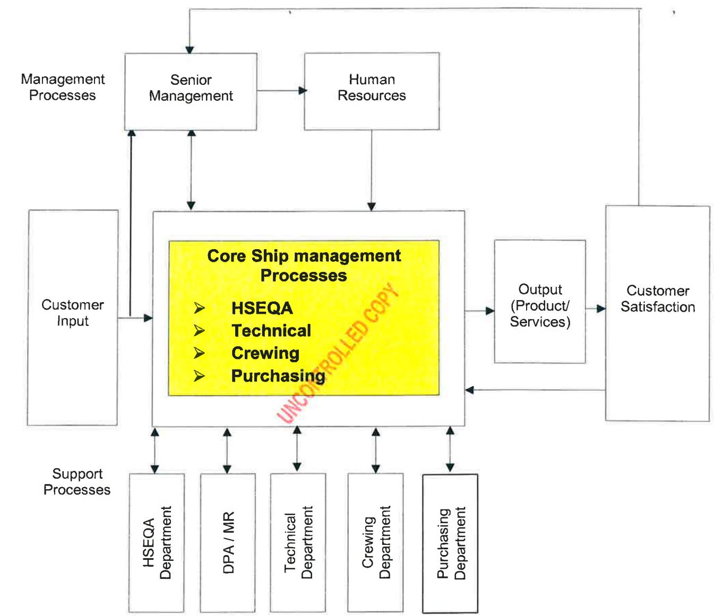

{20}------------------------------------------------

ర్

(J

{21}------------------------------------------------

| Image: SR MARINE INTEGRATED MANAGEMENT SYSTEM | IMS 01 – Company IMS and Policies | Issue Status  | 2nd Edition, Rev 0 |
| --------------------------------------------------- | --------------------------------- | ------------- | ------------------ |
|                                                     |                                   | Issue Date    | 1st July 2014      |
|                                                     |                                   | Issued by     | DPA                |
|                                                     |                                   | Authorised By | Director PFS       |

# HEALTH, SAFETY AND ENVIRONMENTAL POLICY

The Company Management recognises the necessity and responsibility, not only to provide competent personnel and well-maintained vessels, but also to promote amongst people working for or on behalf of the company a high standard of safety, health and hygiene and environmental awareness and commitment. It is the Company Management's belief that such awareness and commitment which includes pro-active attitudes towards HSE issues, must start and transcend from the most senior management level downwards through the whole spectrum of the organisation, including shipboard and shore based personnel.

In formulating the HSE Policy, the Company Management has identified clearly the objectives and commitment that are required.

The main objectives of the HSE Policy are appended below which are applicable to all people working for or on behalf of the company.

To promote safety, hygiene and health and environmental awareness and culture

To provide a safe, healthy and environmentally friendly working environment

To prevent injury, ill health and related losses and aim for zero Lost Time Incidents (LTI's)

To prevent loss of, or damage to property

To identify vessel, personnel and environmental hazards and mitigate risks

To provide proper training and supervision for all staff

To identify and assess health hazards and mitigate risks

To develop and implement HSE Management procedures

To continuously maintain, review and improve upon the HSEQ IMS and HSE performance

To prevent pollution and to set objectives and targets to reduce environmental impact

To achieve "Zero Pollution Incidents" on our vessels

To ensure full compliance with the requirements of all mandatory rules and regulations

To ensure compliance with applicable codes, guidelines and standards recommended by the IMO, ILO,

Flag State and local Legislation, Classification Societies and Maritime Industry.

The Company Management has therefore endorsed a comprehensive HSEQ Integrated Management System Manual (IMS) that clearly identifies in detail the procedures and measures required to achieve these objectives. The IMS Manual also stresses the importance of giving a high priority and compliance to clients own rules, regulations and standards.

This IMS Manual will be kept under constant revised accordingly in line with newichanged regulations, Company initiatives and to meet or exceed Client expectations.

Auli

Signed:

Date:

SIM HEE PING Director, SR MARINE Fleet Services 1st July 2014

{22}------------------------------------------------

| C-SR MARINE INTEGRATED MANAGEMENT SYSTEM | IMS 01 - Company IMS and Policies | Issue Status  | 2nd Edition, Rev 0 |
| ---------------------------------------------- | --------------------------------- | ------------- | ------------------ |
|                                                |                                   | Issue Date    | 1st July 2014      |
|                                                |                                   | Issued by     | DPA                |
|                                                |                                   | Authorised By | Director PFS       |

# DRUG AND ALCOHOL POLICY

The Company's Drug and Alcohol Abuse Policy applies to all personnel who may work ashore, sail on, or visit the Company's vessels and embraces the principles set forth in the Oil Companies International Marine Forum (OCIMF) "Guideline for the control of drugs and alcohol aboard ships".

The Company recognises that alcohol, illicit, prescription and other drugs, and controlled substances can cause impairment and affect an individual's performance, safety and productivity. The Company is committed to a workplace that is free from impairment induced by any substance, which includes but is not limited to drugs and alcohol.

# The Company has Zero Tolerance Policy towards the use of Drug and Alcohol.

To achieve this, the Company commits to:-

- · Comply with all applicable statutory legislations, standards and any other requirements to which the Company subscribes.
- · Prohibiting the consumption, soliciting or possession of illicit substances, and the consumption or soliciting of alcohol in the workplace.
- · Prohibiting any personnel, whether shore-based or seagoing, from bringing alcohol or illicit drugs on board Company vessels.
- · Ensuring compliance with this policy which may include but is not limited to drug and alcohol testing of seagoing and/an shore-based staff during pre-employment, periodical medical assessments, post-incident testing, for cause, random or blanket testing.
- · Ensuring that all prescription medication that may impact on an individual's ability to perform required duties must be declared to the relevant Supervisor.
- · Ensuring that it does not employ any persons who are users of or have a recent record of the use of illegal drugs or have abused the use of prescribed drugs.
- · The Company reserves the right to initiate disciplinary action as necessary for any violation of this policy.

Signed:
SIM HEE PING

Signed:

Date:

SIM HEE PING Director, SR MARINE Fleet Services 1st July 2014

Page 1 of 1

{23}------------------------------------------------

| SR MARINE INTEGRATED MANAGEMENT SYSTEM | IMS 01 - Company IMS and Policies | Issue Status  | 2nd Edition, Rev 0 |
| -------------------------------------------- | --------------------------------- | ------------- | ------------------ |
|                                              |                                   | Issue Date    | 1st July 2014      |
|                                              |                                   | Issued by     | DPA                |
|                                              |                                   | Authorised By | Director PFS       |

# SMOKING POLICY

Smoking on board Company vessels is permitted in designated smoking areas (as designated by the Master), except under the circumstances as mentioned below.

The Master should also, in consideration of non-smokers, ensure that there is no smoking outside of the designated smoking areas.

There is no smoking allowed during operations where there is a hazard of fire or explosion, such as:

- · Receiving or transferring fuel, oil, or other volatile liquids.
- · Handling any type of flammable materials: in or around paint lockers.
- · During emergency drills.
- · When moored or mooring alongside docks, piers, rig platforms or other installations where smoking is prohibited.
- · Any circumstance where there is a risk of fire.
- · Where local Policies, Procedures or Working Practices prohibit smoking.
- · When the vessel is within a 500 metre safety zone

The Master is also responsible for implementing and upholding this policy, although all other Officers and Crew Members share in this responsibility.

Anli

Signed:

SIM HEE PING Director, SR MARINE Fleet Services 1st July 2014

Date:

{24}------------------------------------------------

| Issue Status  | 2nd Edition, Rev 0 |
| ------------- | ------------------ |
| Issue Date    | 1st July 2014      |
| Issued by     | DPA                |
| Authorised By | Director PFS       |

"STOP WORK" POLICY

# "STOP WORK" POLICY

Everyone has the Authority, Responsibility and Duty to

# STOP®THE WORK

If there is any doubt about the safety of the personnel, environment or operation

Signed: SIM HEE PING

Date:

Director, SR MARINE Fleet Services 1st July 2014

Page 1 of 1

{25}------------------------------------------------

| SR MARINE INTEGRATED MANAGEMENT SYSTEM | IMS 01 – Company IMS and Policies | Issue Status  | 2nd Edition, Rev 0 |
| -------------------------------------------- | --------------------------------- | ------------- | ------------------ |
|                                              |                                   | Issue Date    | 1st July 2014      |
|                                              |                                   | Issued by     | DPA                |
|                                              |                                   | Authorised By | Director PFS       |

# NAVIGATION POLICY

The Company Management recognises the necessity and responsibility, not only to provide competent personnel and well-maintained vessels, but also to promote amongst its employees, a high standard for navigation safety, awareness and commitment. It is the Company Management's belief that such awareness and commitment which includes pro-active attitudes towards Navigation matters, must start and transcend from the Company management through the Master of the Bridge Watch Keeping Team.

In formulating the Navigation Policy, the Company Management has identified clearly the objectives and commitment that are required.

The main objectives of the Navigation Policy are appended below which are applicable to all Bridge Watch keeping team members in our fleet.

At all times when the vessel is at sea or at anchor, the Bridge Watch must be under the control of a responsible, licensed Officer of the Watch (OOW).

The Master or OOW must not leave the Bridge unless properly relieved:

- a) in periods of restricted visibility
- when there is heavy traffic in the vicinfly of the vessel b)
- while underway in restricted waters, inside 500m zone or DP mode c)
- during heavy weather conditions d)
- when entering or leaving port, docking, undocking, shifting the vessel, entering or leaving e) e the 500m zone, when the vessel is in DP mode
- during Ship to Ship Manoeuvring f)
- when embarking or disembarking a Pilot or Mooring Master g)
- when anchoring or weighing anchor, mooring operations h)
- during helicopter operations on the vessel i)
- at any other time when the Master judges conditions to be a potential threat to the i) vessel's safety

The Company Management has therefore endorsed complete and comprehensive procedures that clearly identify in detail the procedures and measures required to achieve the above objectives. The procedures also stress the importance of giving a high priority to and compliance with clients own navigation safety rules, regulations and standards, where applicable.

These procedures will be kept under constant revised accordingly in line with new/changed requlations, initiatives and to meet or exceed Client expectations.

Signed:

Date:

SIM HEE PING Director, SR MARINE Fleet Services 18t July 2014

{26}------------------------------------------------

| Image: SR MARINE INTEGRATED MANAGEMENT SYSTEM | IMS 01 – Company IMS and Policies | Issue Status  | 2nd Edition, Rev 0 |
| --------------------------------------------- | --------------------------------- | ------------- | ------------------ |
|                                               |                                   | Issue Date    | 1st July 2014      |
|                                               |                                   | Issued by     | DPA                |
|                                               |                                   | Authorised By | Director PFS       |

# SECURITY POLICY

The Company Management recognises the necessity and responsibility to, as far as is reasonably practicable, provide a secure working environment for its employees.

It is the Company Management's belief that such awareness and commitment which includes pro-active attitudes towards Security issues, must start and transcend from the most senior management level downwards through the whole spectrum of the organisation.

In formulating this Security Policy, the Company Management has developed and implemented appropriate Shipboard Security Plans and a Port Facility Security Plan in order to ensure compliance with the requirements of the ISPS Code.

For vessels that are not required to comply with the requirements of the ISPS Code, security related procedures and instructions are developed and implemented accordingly.

Project specific security procedures may also be developed and implemented as may be required by the Project opedity boomy prever to address security concerns relating to that particular Project.

All such security procedures must remain confidential and only their requirements made available to the appropriate personnel in order to ensure their compliance.

UNCONTROLLED COPY

Signed:

Date:

SIM HEE PING Director, SR MARINE Fleet Services 1st July 2014

{27}------------------------------------------------

| Image: SR MARINE INTEGRATED MANAGEMENT SYSTEM | IMS 01 – Company IMS and Policies | Issue Status  | 2nd Edition, Rev 0 |
| --------------------------------------------------- | --------------------------------- | ------------- | ------------------ |
|                                                     |                                   | Issue Date    | 1st July 2014      |
|                                                     |                                   | Issued by     | DPA                |
|                                                     |                                   | Authorised By | Director PFS       |

# QUALITY POLICY

The Company's mission is to provide quality service levels that meet or exceed expectations,

The Company is totally committed to achieving the highest management standards in compliance with its quality management procedures.

There is a constant drive to satisfy requirements, whilst always being mindful of responsibilities to Principals, shareholders, employees and the community.

This involves the active participation, endeavour and ideas of all employees with the aim of continually improving the effectiveness of the Quality Management System.

These high standards are achieved by operating a quality system that meets or exceeds the These "high "standards" are "achibrou" by "Spending Standard ISO 9001:2008.

As part of its efforts to ensure continual improvement in the quality of services provided, the Company establishes, implements, monitors and achieves measurable quality improvement establishes, "Implements" and "achevo" and" accordingly to ensure continual improvement.

Compliance with this policy, procedures and work instructions is mandatory and binding upon all Compliance will this policy, procedures and sibility of everyone working for and on behalf of SR MARINE Fleet Services Pte. Ltd.

The satisfaction of our Principals and the good repulation of the Company are directly dependent on this working philosophy.

Signed:

Date:

SIM HEE PING Director, SR MARINE Fleet Services 1st July 2014

Page 1 of 1

{28}------------------------------------------------

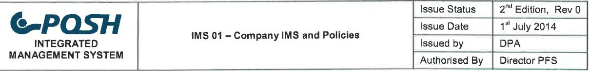

# DYNAMIC POSITIONING OPERATIONS POLICY

In compliance with IMO Guidelines and to develop procedures and best practice to an achievable international standard for all vessels operating in any class of DP, as defined by IMO Circular 645, within or outside a 500 metre zone, the company management recognises the necessity and responsibility to provide :

- · Industry Standard DP equipment,
- · Industry Standard Operating requirements and guidelines,
- · Industry Standard and Classification Society test and Documentation system.

for vessels fitted with Dynamic Positioning systems to mitigate the risk to personnel, the Vessel, other vessels or structures, sub-sea installations and the environment while performing operations under Dynamic Positioning control.

The Company endeavors to promote among its Dynamic Positioning Operators a high standard of Safety, Awareness and commitment to ensure that the key personnel involved in DP operations, DP system maintenance and repair are competent, well trained and have appropriate certification.

Signed:

Date:

SIM HEE PING UNCONTROLLED CO
Kuli
Director, SR MARINE Fleet Services
1st July 2014

Date:

{29}------------------------------------------------

# CONTENTS

## 1. COMPLIANCE, REVIEW & IMPROVEMENT OF THE HSEQ INTEGRATED MANAGEMENT SYSTEM

- 1.1. Purpose
- 1.2. Scope
- 1.3. Procedure
- 1.4. Compliance
- 1.5. Verification. Resources and Trained Personnel

#### SHOREBASED MANAGEMENT & ORGANISATION 2.

- Director PFS 21
- 2.2. GM Group HSEQA
- Manager HSEQA Designated Person Ashore (DPA)/MR & Alternate Designated 2.3. Person Ashore (ADPA)
- 2.3.1. Management Representative
- 2.4. Assistant Manager / Marine Superintendents
- Administrator/Executive, HSEQA 2.5
- 2.6. Company Organisation SR MARINE Fleet Services Pte. Ltd.
- General Manager Technical Services 2.7.
- 2.8. Manager - Technical Services
- 2.9 Technical Superintendents
- 2.10 Technical Assistants
- 2.11 General Manager - Crewing
- 2.12 Manager Crewing
- 2.13 Crewing Assistants
- 2.14 Senior Manager - Purchasing
- 2.15 Manager - Purchasing
- 2.16 Purchaser
- 2.17 General Manager, Project (New Building)
- 2.18 Manager, Project (New Building)
- 2.19 Site Manager / Site Superintendent (New Building)
- 2.20 SR MARINE Semco
- 2.21 Shore-Staff handover (Leave/Travel)

#### SHIPBOARD MANAGEMENT & ORGANISATION 3.

- 3.1. Shipboard Management
- 3.2. Shipboard Organisation

#### SHIPBOARD JOB RESPONSIBILITIES 4.

- 4.1. Master
- 4.2. Chief Officer
- 4.3. Second Officer

{30}------------------------------------------------

| Issue Status  | 2nd Edition, Rev 0 |
| ------------- | ------------------ |
| Issue Date    | 1st July 2014      |
| Issued by     | DPA                |
| Authorised By | Director PFS       |

- 4.4. Third Officer (if applicable)
- 4.5. GMDSS Watchkeeping Duties for Officer of the Watch (OOW)
- 4.6. Ship Safety Officer
- 4.7. Medical Officer (where applicable)
- 4.8. Shipboard Security Officer (SSO)
- 4.9. Alternate Shipboard Security Officer (ASSO)
- 4.10. Dynamic Positioning Officer (DPO)
- 4.11. Bosun
- 4.12. Deck Ratings (A.B's & Seaman)
- 4.13. Crane Operator (>10 tonnes) / Rigger
- 4.14. Helicopter Landing Officer (HLO)
- 4.15. Chief Engineer
- 4.16. Second Engineer
- 4.17. Third / Fourth Engineer (if applicable)
- 4.18. Engine Room Rating
- 4.19. Electrician (if applicable)
- 4.20 Chief Cook
- 4.21 Deck and Engine Cadets
- 4.22 Handover
- 4.22.1 Masters and Officers
- 4.22.2 Ratings
- 4.22.3 Familiarisation of DPO's with DP Systems during Handovers/Takeovers
- 4.23 Shipboard Appraisal
- 5. SHORT SERVICE EMPLOYEES

#### 6. NON-CREW MEMBERS ONBOARD

6.1. General

#### 7. PROJECT HSE RESPONSIBILITIES

- 7.1 Project Vessel Masters
- 7.2 Positioning Masters (where applicable)
- 7.3 Other SR MARINE Employees and Subcontractors
- 7.4 Additional Masters
- 8. MANAGEMENT REVIEW
- 9. MANAGEMENT VISIT

{31}------------------------------------------------

# Appendices

- A Master's Review of IMS
- B Office Management Review Meeting Agenda - Minutes
- C Master Handover - Takeover Checklist
- D Chief Officer Handover - Takeover Checklist
- E Second Officer Handover - Takeover Checklist
- F Chief Engineer Handover - Takeover Checklist
- G Second Engineer Handover - Takeover Checklist
- H Third Engineer Handover - Takeover Checklist
- Electrician Handover Takeover Checklist -
- J Shipboard Appraisal Form
- K Masters Appraisal Form
- L Chief Engineer Appraisal Form
- M Customer Feedback Form
- N Customer Complaints / Compliments Register
- O Shore Staff Handover Checklist (Leave/Travel)
- Management Visit Report P

{32}------------------------------------------------

| Issue Status  | 2nd Edition, Rev 0 |
| ------------- | ------------------ |
| Issue Date    | 1st July 2014      |
| Issued by     | DPA                |
| Authorised By | Director PFS       |

# 1. COMPLIANCE, REVIEW & IMPROVEMENT OF THE HSEQ INTEGRATED MANAGEMENT SYSTEM (IMS)

#### 1.1 Purpose

The SR MARINE FLEET SERVICES PTE LTD. (PFS) HSEQ Integrated Management System sets the Company health, safety, environmental and quality objectives and includes a safety management structure which identifies key personnel, ensures adequate resources are available and regularly reviews the effectiveness and suitability of the system.

PFS provides Crewing, Technical, Purchasing and HSEQA services to SR MARINE SEMCO (Customer / Principal), who commercially operate the SR MARINE Group fleet of vessels.

#### 1.2 Scope

This procedure covers management responsibilities and the general organisation of the Company, as required by the ISM Code and applicable standards.

All personnel should be aware that this manual is designed for the Health, Safety, Environmental and Quality Management of the company, ship and crew in conformance with the requirements of the ISM Code, Environmental Standards, Occupational Health Standards and Quality management standards.

#### 1.3 Procedure

- a) Safety and Environment Policy, a Quality Policy and other policies which address the goals of the organisation and demonstrate the Company's commitment to its objectives.
- ﮯ These Policies are signed by the Director, PFS and are included in this IMS Manual and posted in the office and onboard all vessels for the information, awareness and compliance of all employees.
- The overall purpose of this HSEQ Integrated Management System is to ensure the c) provision of marine services that continuously meet or exceed required standards and expectations.
- ರು The continued relevance of these Policies is reviewed at Management Review Meetings and Fleet HSE Meetings to ensure they remain appropriate to objectives and that all other policies are compatible.
- The Company's policy commitments are also made known to Suppliers and Sub-contractors e) as appropriate.
- Training and familiarisation is provided to new and existing staff which explains the f) Company's commitment to the health, safety, environment and quality objectives.
- To ensure that adequately trained resources are maintained, all staff are given training and g) the details are recorded accordingly.
- h) Customer requirements, feedback and complaints :
  - i. Customer Requirements: The PFS resources and abilities to deliver the required ship management services are continuously assessed and reviewed by the Director PFS and by the individual Heads of Departments.

{33}------------------------------------------------

| Issue Status  | 2nd Edition, Rev 0 |
| ------------- | ------------------ |
| Issue Date    | 1st July 2014      |
| Issued by     | DPA                |
| Authorised By | Director PFS       |

- Customer Feedback and Complaints: There is continuous interaction between 11 .. . . the Customer and PFS through meetings, communications etc., at which any complaints or feedback is usually expressed. The Customer may also use the Customer Feedback form (see Appendix O) and any complaints or compliments are recorded in the Customer Complaints / Compliments Register (see Appendix P).
- Corrective action is taken to address complaints and/or negative feedback and iii. preventative action is implemented to prevent re-occurrence.
- iv. Results of the Customer complaints, Customer feedback and corrective / preventative action are discussed at the MRM, as well as action taken towards continual improvement of the IMS and related processes.

#### 1.4 Compliance

- a) Activities of all shore based and seagoing personnel, with special regard to compliance with the IMS, are regularly verified through Internal Audits and inspections. In addition, all activities are audited from time to time by external auditors, surveyors and inspectors to ensure that all requirements are followed and to issue the required certification.
- b) Management visits and Technical Inspections are also carried out on the vessel and crew to ensure a high standard of operational efficiency, the ship is being properly maintained and to promote teamwork between the ship's personnel and the Company Management.
- c) All personnel are encouraged to make suggestions for improvement of the IMS,
- Masters must ensure that the IMS is reviewed at least once every six months (in April d) and October), and reported accordingly to the HSEQA Department. Any record of review shall be included in the vessel HSE meeting minutes.
- e) However, Masters are encouraged to review the system as frequently as they may consider necessary, involve the rest of the crew in this review and report accordingly to the HSEQA Department. Masters may wish to consider carrying out such reviews as part of the ship's monthly HSE Meetings, whereby a Chapter or Section of a manual can be selected, read out and reviewed accordingly. At subsequent monthly HSE Meetings a different Chapter or Section can be selected, thereby forming a continuous review of the various manuals. A review of the manual should also be carried out post Incidents, Accidents and near misses if it is evident that amending a procedure will reduce or eliminate reoccurrence
- f) Masters should also note that such reviews should not be limited to the IMS Manual only. There are a number of other systems in place on board Company vessels that should be considered (where applicable) as part of the safe management of the vessel including, but not limited to :
  - · SOLAS Safety Training Manual and additional fire fighting manual (which the ship should amend to be ship-specific).
  - · Procedures and Arrangements Manual (where provided relates to the safe management of cargo operations).
  - Vessel Operations Manual. .
  - Ship Security Plan. .
  - SOPEP/SMPEP Manuals. .
  - SEEMP Manual. .
  - · Ballast Water Management Plan (BWMP).

{34}------------------------------------------------

| Issue Status  | 2nd Edition, Rev 0 |
| ------------- | ------------------ |
| Issue Date    | 1st July 2014      |
| Issued by     | DPA                |
| Authorised By | Director PFS       |

- · Ship stability booklet and Damage control plan.
- . Ship Plans/Drawings.
- Machinery and Equipment Instruction Manuals including Class approved Stability . Booklet and Cargo Securing Manual.
- g) by the HSEQA Department :
  - i. Compliance with applicable statutory, legal and other requirements.
  - ii. Compliance with other requirements to which the Company subscribes.
- h) of internal audits, monitoring of marine circulars and notices issued by IMO, Flag State, Classification Society, controlled documents, records, reviews and interviews.
- i) compliance.

#### 1.5 Verification, Resources and Trained Personnel.

- a) The Company identifies resources for verifying the services provided are in accordance with objectives.
- b) Verification activities are defined which cover all aspects of the Company services. Such verification is defined in the respective process control procedures in the relevant Procedures.
- c) Verification performed by the Administration, in accordance with International and Flag State requirements, is used by the Company / Customers / Charterers as an integral part of inspection and test of vessels and equipment.
- d) onboard vessels to ensure all vessels are able to obtain statutory Flag and Class certification approval as required.

#### SHORE BASED MANAGEMENT AND ORGANISATION 2.

#### 2 1 Director PFS

- 2.1.1 Responsible to the CEO for the administration, planning, overall direction and conduct of PFS Ship Management activities.
- 2.1.2 Specific Responsibility and Authority :
  - a) Coordinating of all PFS ship management activities.
  - b) Policies and initiating directives for the company, identify the relevant department managers responsible for assisting the MR in meeting the objectives.
  - c) To ensure environmental, health, quality and safety targets at relevant functions and levels of the company are well documented.

{35}------------------------------------------------

- Establish annual goals and objectives and to motivate the marine, base and office staff to d) meet them. The objectives and targets are measurable where practicable and consistent with the company HSE policy.
- Approve resources and personnel necessary for the effective implementation of the vi e) company's Health, Safety, Environmental and Ship Management activities.
- Implement and review Ship Management activities and contracts associated with these f) activities.
- g) includes a review of the company HSEQ Integrated Management System objectives and targets, which will eventually be utilised in setting targets for the next year.

#### 2.2 GM Group HSEQA

Specific Roles and Responsibilities:

- Responsible for setting up SR MARINE Group HSEQ policies and reports to CEO. a)
- b) Continual improvement of the Group HSEQ Management Systems.
- c) Primary link at Project level between Charterers and SR MARINE Group with regard to HSEQ matters.
- Monitor OVMSA updates and other Charterers audits. d)
- Participate in Charterers project meetings and HAZID workshop e)
- Incident investigation and implementation of follow up actions in conjunction with HSE f) f = f = f = f = f = f = f = f = f = f = f = and other departments.
- HSE input for tenders and pre-qualifications ପି)
- h) Group MR for ISO 9001

# 2.3 Manager- HSEQA, Designated Person Ashore (DPA) / Management Representative (MR) & Alternate Designated Person Ashore (ADPA)

In accordance with the requirements of the ISM Code, the Company has appointed a Designated Person Ashore (DPA) and an Alternate Designated Person Ashore (ADPA).

The Manager HSEQA is the Designated Person Ashore (DPA), reporting to the Director PFS and responsible for the Health, Safety and Environmental Management of the Company Fleet. He is also the MR for ensuring the effective implementation (establishing, monitoring of ISO9001/ISO14001/OHSAS18001.

The DPA may also be appointed the Chairman of the Fleet HSE Committee.

Specific Roles and Responsibilities:

a) Ensuring that the Company HSEQ Integrated Management System (IMS) is established implemented and maintained at all PFS locations and in accordance with the requirements of the International Safety Management Code (ISM Code) and the Company Policies.

{36}------------------------------------------------

| Issue Status  | 2nd Edition, Rev 0 |
| ------------- | ------------------ |
| Issue Date    | 1st July 2014      |
| Issued by     | DPA                |
| Authorised By | Director PFS       |

- Liaising with external parties on matters concerning establishment, approval and timely b) auditing of the IMS in line with applicable codes, standards and industry quidelines.
- c) Ensuring the safety and pollution prevention aspects of Company Fleet operations are addressed and controlled with adequate resources and support given to the vessels from Management ashore.
- d) Providing the essential link between the vessels and Senior Management ashore to ensure the Company's Health, Safety, Environmental and other Policies are effective.
- Organising and scheduling Internal and External ISM/ISPS Audits. e)
- Initiating investigations on Near Miss / Incidents / Accidents/Injuries in the fleet. f)
- Responding to emergency shipboard situations. a)
- h) Establishing and monitoring programmes for shipboard training, emergency drills and exercises
- i) Exercising control over the Company IMS and other related documents.
- j) Liaising with external parties on matters relating to the Company IMS.
- k) requirements.
- Reporting to and liaising with the appropriate Flag State as may be necessary, ﮯ
- m) Ensuring compliance with other requirements to which the company subscribes,

The Company has also appointed Alternate DPAs (ADPA) and has allocated them a number of Company fleet vessels to carry out the ADPA roles and responsibilities on a day to day basis,

# 2.3.1 Management Representative (Manager HSEQA)

The MR reports to the Director PFS on the performance of the IMS with regard to Quality, Environmental and Occupational Health issues in accordance with the relevant standards. His role ensures that processes needed for these Management Systems are well established, implemented and maintained at all PFS locations.

The specific responsibilities of the MR include but are not limited to:

- a) The approval and issue of system management documents and records and the effective disposal of obsolete documents.
- b) thereof.
- c) processes from time to time and ensuring they are readily available for reference.
- d) Liaising with external parties on matters concerning the establishment, approval and timely auditing of the Management Systems to the applicable standard or industry requirements.
- e) Provide input to the Director PFS for continual improvement of the Company Management Systems.

{37}------------------------------------------------

| Issue Status  | 2nd Edition, Rev 0 |
| ------------- | ------------------ |
| Issue Date    | 1st July 2014      |
| Issued by     | DPA                |
| Authorised By | Director PFS       |

- f) Conduct of management review meetings to ensure that the management systems are reviewed with agendas circulated in advance.
- g) Compile and distribute the environmental, health, quality and safety objectives to the respective HOD, vessel masters and base manager as applicable. Establishing the means and time frame by which they are to be achieved.

# 2.4 Assistant Manager / Marine Superintendents HSEQA

- Deputising for and assisting the Manager, HSEQA. a)
- b) Monitoring vessel compliance with safety and environmental protection procedures and requirements.
- c) Liaising with the SR MARINE Semco and PFS departments with regard to arranging for external audits as required on Company vessels and ensuring follow-up and investigation of NCR's and follow-up of Observations raised.
- d) Liaising with the SR MARINE Semco and PFS departments with regard to arranging for and conducting internal audits and ensuring follow-up and investigation of NCR's and follow-up of Observations issued.
- e) Conducting IMS related shipboard training as appropriate, as part of vessel audits,
- f) Investigating and reporting on accidents and near-misses on Company vessels and disseminating lessons learned.
- Conducting sea staff pre-joining vessel briefing. a)
- Maintaining the shore-based Technical Library and ordering publications as required. h)
- i) Keeping Internal Audit Checklists updated
- Arranging for approvals of new submissions / amendments / etc. for SOPEP, SSP and other j) manuals related to the safe management of the Company vessels.
- k) Assisting DPA in ensuring Safety, Pollution and Security related exercises (including ship/shore exercises) are carried out on Company vessels and properly recorded.
- ﮯ Disseminating information and lessons learnt after exercises.

#### Administrator/executive HSEQA 25

- a) Inspection, internal and external audit reports.
- Conduct sea staff pre-joining vessel briefing in absence of the vessel in charge. b)
- c) Assist HSE Manager/Assistant Manager/Superintendents as and when required.
- d) Raise purchasing orders and liaise with Finance on payments.

{38}------------------------------------------------

IMS 02 --RESPONSIBILITY & AUTHORITY

| Issue Status  | 2nd Edition, Rev 0 |
| ------------- | ------------------ |
| Issue Date    | 1st July 2014      |
| Issued by     | DPA                |
| Authorised By | Director PFS       |

# Company Organisation - SR MARINE Fleet Services Pte Ltd: 2.6

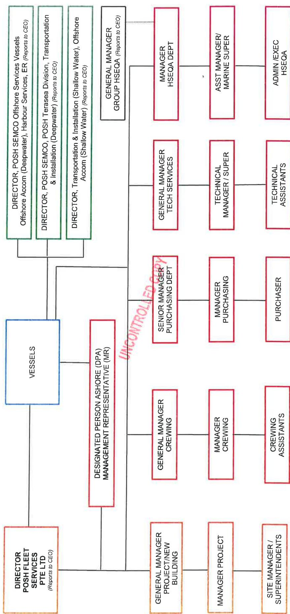

Page 10 of 35

---

{39}------------------------------------------------

#### 2.7 General Manager - Technical Services

Responsible to the Director, PFS for the following: -

- a) a) a To be responsible for the technical services required by respective fleets managed by PFS, ensuring that all the vessels comply with Statutory, Class and other International Maritime governing requirements.
  - b) Ensuring that any damage or defects that affect the seaworthiness of the vessel are reported immediately to the appropriate Classification Society, Flag State and to the GM HSEQA Department
  - c)
  - d) Liaising with other departments within PFS to ensure that safety, efficiency and effectiveness of PFS as a whole are maximized.
  - Keeping the Director, PFS informed of all matters of significance and seeking his approval e) whenever necessary
  - f) Responsible for communicating the management objectives and targets to their staff
  - g) Shall ensure that personnel performing task for the company or on behalf of the company (vendors, suppliers, contractors, repairers, temporary staff) that have a potential to cause a significant environmental impact as identified by the company are competent on the basis of appropriate education, training or experience and maintain all the associated records.

#### 2.8 Manager, Technical Services

Responsible to General Manager, Technical Services for the following .-

- Maintenance of vessels and operation of assigned TS Department within approved budget. e)
- Ensuring efficient maintenance and operation of vessels machinery to minimise breakdown f) f f f f f f f and ensure vessel safety.
- Ensuring vessels compliance with Class and Statutory Survey requirements. g)
- Ensuring that technical inspections are carried out as appropriate throughout the fleet. h)
- i) Ensuring adequate spares/stores are allocated to vessels.
- يج Advise upon and resolve vessel maintenance problems.
- k) Appointing Superintendents to carry out random surveys of fuel remaining on board vessels.

#### 2.9 Technical Superintendents

Responsible to GM and Manager, Technical Services for the following:-

- a)
- b) rectified within a reasonable time.

{40}------------------------------------------------

- Ensuring that any damage or defects that affect the seaworthiness of the vessel are c) reported immediately to the appropriate Classification Society, Flag State and to the GM HSEQA Department
- d) carried out on all defects so that effective action can be implemented to prevent recurrence
- e) e Monitoring the technical certification of the vessel and ensuring validity.
- Ensuring that all technical surveys are arranged (with Classification Society and/or Flag f) State as appropriate) and carried out by the due dates. Note that for some Flag States (e.g. Cayman Islands, Mexico) surveys related to safety and pollution prevention must be carried out by Flag State Surveyors, not Class Surveyors.
- Ensuring adequate spares are available onboard. g)
- h) Requisition approval and ordering of spare parts.
- i) Dealing with technical inquiries with regard to their assigned vessels.
- Implementing any technical modifications or changes that may be required. ﮯ
- k) Carrying out a detailed technical inspection of each vessel at least once a year, at intervals not less than eight months and not more than twelve months. In the event a technical inspection cannot be completed as scheduled due to inaccessibility of the vessel, the inspection (subject to a Deferment Application being approved by the Tech GM-IMS 09 Appendix D) must be carried out as soon as the vessel can be accessed.
- I) Such exceptional circumstances may include unexpected delays to the vessel caused by Charterer's requirements, the vessel being continuously at sea when the normal schedule of Technical Inspection becomes due, the vessel port stay being at too short notice, the vessel's port stay being too short for a proper technical inspection to be carried out, or the unavailability of transportation (helicopters, crew boats, etc.) to enable the Technical Superintendent to get to the vessel's location.
- m) Monitoring oil sample analysis and ensure copies of reports sent to vessels.
- n) Monitoring fuel consumption and carrying out random fuel surveys on vessels.
- o) Ensuring that the quality of potable water is monitored and that analysis and testing is carried out.
- p) Preparing docking quotes in liaison with Masters and Chief Engineers,
- Arranging for and implementing all maintenance and repair work that cannot be carried a) out by the ship's crew.
- r) Ensuring that at all times the vessel remains seaworthy and all equipment is functioning the correctly.

#### 2 10 Technical Assistants

a) Responsible to the Technical Superintendents and assisting as required,

{41}------------------------------------------------

#### 2.11 General Manager, Crewing

Responsible to the Director, PFS for the following:

- Ensuring that vessels are manned to MLC, Regulatory and Flag State requirements. a)
- b) Implementing policies affecting sea staff.
- C) Maintaining labour-management relations.
- d) Hiring, deploying, appraising and terminating the employment of sea staff.
- e) Assessing and appointing crewing agents.
- f) Managing crew training
- g) Responsible for communicating the management objectives and targets to their staff

#### 2.12 Manager, Crewing

Responsible to the General Manager, Crewing for the following:

- Handling all personnel matters relating to PFS seagoing personnel. a)
- b) Ensuring the vessels are manned with qualified, medically fit and suitably experienced seafarers in accordance with the relevant national and international manning requirements and MI C.
- Keeping appropriate records of qualifications, medical fitness, training, service, performance c) and ability. 19
- Ensuring Senior Officers are allowed reasonable handover periods (where practicable) to d) ensure appropriate familiarisation with the vessel.
- Ensuring seafarers are sufficiently proficient in English to carry out their duties safely. e)
- f) All new joining Masters and Chief Engineers in the fleet will be briefed in the office by Crewing Department, HSEQA Department, and Technical Department prior signing on the vessel.
- g) Handling of administrative matters relating to the premises occupied by PFS.

#### 2.13 Crewing Assistants

a) Responsible to the Manager, Crewing and assisting as required.

# 2.14 Senior Manager, Purchasing

Responsible to the Director, PFS for the following:

- a) Manage the purchasing support to vessel operation that requires purchasing of stores and spares.
- b) Approve and award contracts to suppliers for stores, spares, lubricants, paints, gases and chemicals.
- c) Set, implement and monitor the department ISO Quality Improvement Objectives.

{42}------------------------------------------------

d) Shall ensure that personnel performing task for the company or on behalf of the company (vendors, suppliers, contractors, temporary staff) that have a potential to cause a significant environmental impact as identified by the company are competent on the basis of appropriate education, training or experience and maintain all the associated records.

#### 2.15 Manager, Purchasing

Reports to the Senior Purchasing Manager and is responsible for purchasing support to vessel operations.

- Research sources of supply, prices and delivery periods and negotiating the best a) possible terms.
- b) Assess, select and propose contracts to suppliers for stores, spares, lubricants, paints, gases and chemicals.
- Review purchases for lubricants. c)
- d) In charge of sales of scrap (on ad hoc basis and yearly tender).
- e) Assessment of new suppliers.
- f) Monitor and re-evaluation performance of approved suppliers

#### 2 16 Purchaser

Reports to the purchasing manager and is responsible for purchasing support to vessel operations

- a) In charge of purchases required by yessel allocate to him/her.
- Investigate sources of supply and terms and conditions. b)
- Manage purchasing function through purchasing system. c)
- d) Monitor, tracking and confirm receiving of purchase order onboard vessel.
- Arrange checks on quality of suppliers' products. e)

#### 2.17 General Manager, Project (New-Building)

Reports to the Director, PFS for the following:-

- Responsible for the management of all the New building vessels under construction a)
- b) Oversee the interface between New-Building Department and the Various Divisions.
- c) Coordinate the interface between the New building department and PFS department

# 2.18 Manager, Project (New-Building)

Reports to General Manager, New-building for the following:-

a) Superintendents

{43}------------------------------------------------

- b) Provide regular updates on the new vessels' construction schedule with the assistance of Site Manager/NB Superintendent
- c) Ensure vessels under constructions are in compliance with requirements,
- d) Work closely with shipyards, design houses, PFS and operational divisions on NB design development.

# 2.19 Site Manager / Site Superintendent (New-Building)

a) Responsible to Project Manager and assist as required.

#### 2.20 SR MARINE Semco

a) SR MARINE Semco is responsible for the commercial operation of the vessels under their charge.

# 2.21 Shore-based Staff Handover during Leave/Travel

- a) To ensure full continuity of operations, shore-based staff assigned with specific duties/vessels (e.g. Superintendents, Assistant Managers, Managers and General Managers) when planning for leave and/or business travel, shall make a detailed handover report in the format given in IMS02 Appendix-Q.
- b) Leave or travel plans must be approved by the Department head and proper back-up arrangements shall be made.
- c) Contact information of back-up shall be disseminated to all relevant parties,

{44}------------------------------------------------

#### 3 SHIPBOARD MANAGEMENT & ORGANISATION

- 3.1 Shipboard Management
  - The management of the Company's vessels is based upon each ship being self-sufficient , a) and operating as a separate cost centre.
  - b) The management of each ship is the responsibility of her Master and Officers. The Master reports directly to the Company Management and, if appropriate, to the Designated Person Ashore/HSEQA Department on HSE matters.
  - c) Any HSE related matters must be immediately drawn to the attention of the Master in order that the matter can be properly and immediately addressed. The Ship's HSE Committee should also be made aware of such matters, so that they can be discussed at the ship's monthly HSE Meetings.
  - d) The Chief Officer is the designated Safety Officer, except on vessels that have a dedicated Safety Officer specifically assigned
  - e) Where the vessel is required to comply with the ISPS Code, the vessel shall have a qualified Shipboard Security Officer (SSO) whose duties will be as described in the vessel's Shipboard Security Plan. The SSO shall normally be the Chief Officer except where he does not hold a valid SSO Certificate, in which case the Master will be designated as the SSO.
  - f) Where the vessel is equipped and operated as a Dynamic Positioning (DP) Vessel, the vessel shall have one or more qualified Dynamic Positioning Operator (DPO) whose duties will be as described in the vessel's Dynamic Positioning Operating Procedure.
  - g) The contact details for the DPA/ADPA and CSO/ACSO must be clearly displayed on the bridge and in common areas.
  - h) All personnel onboard are responsible for ensuring their personal certification remains valid throughout their period onboard and that they have their original certificates with them at all times. The Master is to ensure that all personnel on board have the appropriate valid originals of their certification with them.
  - Every Company vessel will also appoint an Environmental Officer, who will usually be i) the Chief Engineer.
  - Every Company vessel will also appoint a Medical Officer, as required by the Company D MLC Crewing Manual.

{45}------------------------------------------------

#### 3.2 Shipboard Organisation

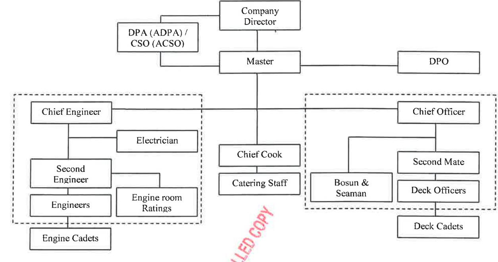

Note 1: The dotted boxes (above) indicated Bridge and Engine Room Watch Keepers.

Note 2: The Master may also keep a bridge watch as required.

Note 3: The Onboard Organisation structure may vary slightly from ship to ship.

- Further to the above, details of responsibilities and duties of the Master and Heads of i. Department are contained in this Manual. In this regard, the Chief Officer is the Master's deputy and takes command in the event that the Master becomes incapacitated.
- It is essential that all persons on board are able to properly carry out their duties. It is ii .. therefore necessary for the Master and Heads of Department to carefully arrange appropriate rosters to ensure that no member of the vessel's crew becomes excessively fatigued. The Master must ensure a proper rest periods are provided in accordance with STCW '95 and the ILO Maritime Labour Convention (MLC).

{46}------------------------------------------------

#### র্যা SHIPBOARD JOB RESPONSIBILITIES

#### 4.1 Master

- a) The Master is responsible for the routine operational management of the ship and for reporting accordingly to the Company Operational Management.
- b) For matters relating to safety and pollution prevention, the Master is responsible for reporting directly to the HSEQA Department (copied to the Company Operational Management) and to the DPA on safety and pollution prevention items that are of particular concern.
- The Master is the Owner's Representative on board the vessel. In this capacity, he has c) full authority and total charge over the vessel. Guidelines and this manual are placed on board to assist in ensuring a safe and efficient ship. The ultimate responsibility rests with the Master. The DPA (or ADPA) is available at anytime for consultation and advice. The Master reports and is responsible directly to the Company Senior Management.
- d) The Master's overall responsibilities include:

The overriding authority and responsibility to make decisions with respect to safety of the vessel, safety of the crew and protection of the environment and to request the Company for assistance as and when required.

- e) The safety of his crew and the safe operation of his vessel whilst at the same time responsible for protecting the Company commercial interests,
- Encouraging and developing a good and effective "Safety Culture" on board, f)
- Implementing the Health, Safety and Environmental Policies and all other Company g) policies and motivating the crew in the observance of those policies.
- h) Verifying that all specified Company rules and regulations are being observed and complied with.
- i) Ensuring that all ship's personnel are fully aware of and conversant with their duties and responsibilities onboard, including their security duties as required by the SSP. Master is the appointed ALT SSO, he shall take over duties of SSO in absence of Chief Officer.
- () activities are carried out in a safe and environmentally friendly manner.
- Encouraging all the ship's personnel to at all times be alert to safety issues, keep their k) mind on the safety aspects of the job in hand and to watch out for their own safety and for the safety of their shipmates.
- I) Ensure that the IMS is reviewed at least once every six months (in April and October), and reported accordingly to the HSEQA Department. Any record of review shall be included in the vessel HSE meeting minutes.
- m) Ensuring to monitor the vessel in attaining the environmental, health, quality and safety objective of the company in the monthly HSEQA meeting on board
- n) Ensuring the safekeeping, maintenance, issuing and recording of controlled drugs and other items from the ship's medical equipment and the safe disposal of expired drugs.

{47}------------------------------------------------

- o) Ensuring that at all times the vessel is safely navigated with due regard to navigational hazards (as listed in the Bridge Procedures) and other vessel traffic.
- Ensuring the BBS system is working effectively on board, including ensuring reports are p) compiled and submitted monthly to the HSEQA Department.
- This IMS manual does not in any way detract from the authority and responsibility of the a) Master.
- Standing Orders and Night Orders should be issued by the Master to augment and r) complement the requirements of this IMS Manual and for the safe operation of the vessel. Such Standing/Night Orders must be fully understood by the Deck Officers and signed and dated by the Master and the Deck Officers.
- s) The discipline of the vessel: Ensure that Risk Assessments and Toolbox Talks are carried out for all tasks as appropriate (including routine tasks) and the Permit to Work (PTW) System is fully complied with.
- t) ensure that stability calculations are carried out, the vessel has adequate margins of stability for the voyage and the cargo is safe, correctly stowed and secured.
- Ensure that all hatches, cofferdam accesses and steering gear accesses are closed and u) battened down. The vessel's full watertight integrity is to be maintained at all times, particularly during heavy weather conditions, when towing, anchoring handling and any other offshore operations.
- v) are complied with. 19
- w) Carry out Charterers requests relating to loading, routing, standby service, anchor handling, towing and other such duties within the operating capabilities of the vessel.
- Ensure maximum co-operation and goodwill between the ship's personnel and the x) x Charterer's employees to always meet or exceed Charterer's expectations. By the Master, Officers and Crew's efforts, the Charterer should be completely satisfied.
- Take part in the watch keeping whilst underway where operational requirements dictate. y)
- On any occasion where navigation and/or manoeuvring is restricted (such as Z) approaching a rig/platform or entering/leaving harbour), he is to take charge of navigation and manoeuvring. In this connection the Master is never to delegate the manoeuvring or responsibility for the vessel to a pilot, whose role is only advisory.
- aa) Ensure that the ship's log, Official Log Book and other records are accurately kept and that the reports required by the Company and Charterer are dispatched on time.
- bb) Ensuring that any "Non-Conformances", "Observations" and Defects are analysed to establish the Root Cause and corrected with preventative/improvement actions to prevent re-occurrence.
- cc) Any deficiencies in the system should be brought to the attention of the DPA/HSEQA Department as soon as possible. Suggested changes or modifications to the system should be advised to the DPA/HSEQA Department using the Document Change Request forms provided.

{48}------------------------------------------------

- dd) Supervise the Requisition and/or purchase of provisions.
- ee) Ensuring that arrangements are made with suitably licensed and approved shore-based disposal Contractors to only dispose of waste/garbage in properly licensed facilities and that a disposal receipt is received from that Contractor.
- ff) Ensuring that any deficiencies that affect the seaworthiness of the vessel or the safety of navigation have been advised to Class and Flag State and that Port Authorities are also informed prior to port entry.

#### 4.2 Chief Officer

The Chief Officer is to assist the Master in all work involving the loading, watch keeping and maintenance of the vessel. The Chief Officer is the Master's deputy and he will assume Command if the master is incapacitated. He is specifically responsible to the Master for the following: -

- a) Control of and personal involvement with all operations carried out on deck.
- ﻣ The maintenance and overall appearance of the ship outside and in, with the exception of the machinery spaces. It is the Chief Officer's responsibility to ensure the vessel is painted and maintained in the Company colours.
- c) The running of the Deck Department including the daily allocation of work duties to the other Deck Department Personnel and ensuring that all work is carried out in an efficient and seamanlike manner.
- d) Through his junior officers and dedicated Safety officer (where applicable), all aspects of the ship's fire, safety, security and emergency equipment (LSA / FFE). This is to include regular maintenance and training of ship's staff in the use and deployment of all fire, safety, security and emergency equipment.
- e) The Chief Officer is to act as the Safety Officer and the Shipboard Security Officer.
- f) The inventory, requisition and upkeep of all deck stores, bearing in mind at all times the budgetary constraints imposed on the vessel.
- Watch keeping as directed by the Master. g)
- h) Mooring operations when designated.
- ﯿ Through consultation with the Chief Engineer, ensuring that all enclosed / confined spaces, restricted areas (as per SSP), tank air vents and filling pipes throughout the vessel are clearly marked and identified.
- Responsible to the Master for the overall cleanliness and good condition of the vessel's D accommodation.
- k) The maintenance of Log Books, Sounding Books, Cargo Space records, Lifting Equipment (including Cargo Gear) records and Towing Equipment records.
- Ensuring that the Garbage Management Plan is fully complied with and the garbage ﮯ record book is fully maintained complete with waste disposal receipts.
- m) Ensuring that all pollution prevention measures are in place and spill response equipment is maintained.

{49}------------------------------------------------

| Issue Status  | 2nd Edition, Rev 0 |
| ------------- | ------------------ |
| Issue Date    | 1st July 2014      |
| Issued by     | DPA                |
| Authorised By | Director PFS       |

- Ensuring the proper training and conducting of drills and exercises are carried out and n) officially documented as per SOLAS, ISM Code and ISPS Code requirements and in reference to the Company's Drill and Training Schedule.
- o) >> The sounding of tanks, cofferdams and bilges throughout the vessel at least once per day and the upkeep of the Sounding Records.
- The watertight integrity of the vessel. p)
- Ensuring that the vessel has adequate stock of PPE on board and that all personnel 이 wear proper PPE at all times.

#### 4.3 Second Officer

The Second Officer is responsible to the Officer for routine duties but directly to the Master for the Navigation of the vessel. His duties include:

- Keeping a safe navigation watch at sea. a)
- b) The maintenance and correction of all charts and nautical publications carried by the ship. All navigation data is prepared for the safe navigation of the ship in the form of a fully complete Passage Plan. This includes, but is not limited to courses to steer, tidal information, navigational warnings, weather forecasts and any other information that may be relevant to the safe navigation of the ship.
- c) Ensuring all charts are the most up to date available, are correctly filed in the appropriate folio and the old charts are suitably disposed of or stored away from the Bridge. He is also to ensure that the charts for the next voyage and the likely trading areas of the vessel are on board and corrected up to the latest Notices to Mariners / Navigation warnings.
- In the event the ship has not received Notices to Mariners for more than four weeks, the d) Second Officer must advise the Master immediately who will then inform the Operations Department, copied to the DPA/HSEQA Department.
- e) In the event of any failure of the Chart and Publications management and corrections system, the Second Officer is to inform the Master who will immediately inform the Company.
- f) That a list of all charts and nautical publications held onboard is made and kept up to date. To advise the Master when new charts and publications are required and to monitor the supply of Notices to Mariners or updates via other systems (where applicable). To inform the Master if Notices to Mariners or other updates fail to arrive as scheduled and report any deficiencies in the updating system.
- The planning of passages and ensuring that the Master authorises all routes and g) passages prior to sailing.
- Regularly establishing the vessels position by GPS, visual or celestial navigation. h)
- The maintenance of all navigational aids, gyro, radar, GPS, magnetic compass, sounding ﯿ lead, Morse light, ALDIS lamp, flags, navigation lights (main and emergency) and any other navigational equipment carried onboard. The Second Officer is responsible for all this equipment being in good working order and for ensuring the required numbers of each item are on board with appropriate spares as stipulated in the "safety equipment" and "safety radio" surveys.
- Ensuring GMDSS and other communication equipment is in working condition. j)

{50}------------------------------------------------

| Issue Status  | 2nd Edition, Rev 0 |
| ------------- | ------------------ |
| Issue Date    | 1st July 2014      |
| Issued by     | DPA                |
| Authorised By | Director PFS       |

- k) Carry out all duties requested by the Chief Officer to ensure the vessel is maintained to the highest standards.
- Assisting the Chief Officer with the supervision and organisation of activities when the ۽ vessel is in port.
- m) Responsible for maintaining the vessel's medical stores to the required levels (except where the ship has a dedicated Medical Officer onboard). The medical locker is to be kept secured and the Ship Captain's Medical Guide is to be readily available. Any injury or illness case that is beyond the scope of treatment onboard must be immediately referred to the nearest source of medical advice.
- n) Ensuring that Muster Lists are maintained up to date in accordance with statutory requirements. Muster Lists to include the names of all personnel on board, not just the designation or rank.
- o) Mooring operations when designated.
- p) the maintenance and upkeep of the ship's fire, safety and security equipment.

#### 4.4 Third Officer (if applicable)

- a) Responsible directly to the Chief Officer for cargo and deck operations and to the Master for assigned Bridge operations. Duties include: -
- b) The keeping of a safe navigation watch when the vessel is at sea.
- In port assistance to the Chief and Second Officers with the supervision and organisation c) of activities.
- d) Assisting the Chief Officer in the maintenance and upkeep of the ship's fire, safety and security equipment.

# 4.5 GMDSS Watch keeping Duties for Officer of the Watch (OOW)

Responsible to the Master for :-

- a) Master immediately if any messages of concern are received.
- c) Logbook, this must be counter-signed every day by the Master.

#### 4.6 Ship Safety Officer

On Company Accommodation vessels a dedicated Ship Safety Officer may be appointed whose duties are as follows (In all cases Chief Officer shall be in charge of LSA and FFE equipments and will monitor and guide Safety officer):

- a)
- Ensuring all safety equipment is positioned according to the ships approved Fire Safety ﻣ Plan and ensuring the Fire Safety Plan is posted, legible and up to date.
- c) Ensuring that an updated crew list is always kept with the externally mounted Fire Safety Plans.

{51}------------------------------------------------

- d) Ensuring all life rafts and associated equipment are maintained in good condition and to the standards required by SOLAS.
- Ensuring that expiry and renewal dates are noted, logged and acted upon when due. e)
  - Ensuring that fire extinguishers are maintained, tested and kept charged at all times. 1)
  - Responsible for updating the Emergency Muster List as per SOLAS requirements. a)
  - Conducting HSE familiarisations for ship's crew, contractor and rig personnel, etc. h)
  - Ensuring the BBS system is working effectively on board, including compiling and i) submitting of reports.
  - i) Ensuring Risk Assessments, JSA's, PTW's and Toolbox talks are carried out.

#### 4.7 Medical Officer (where applicable)

- a) The Medical Officer must be suitably qualified and will be responsible for all Medical functions on board.
- The Medical Officer reports to the Master accordingly. b)
- c) The Medical Officer is also responsible for maintaining all Medical supplies and equipment on board and keeping records accordingly.
- d) Medical supplies must be maintained "in-date" and expired items must be properly disposed of accordingly The Medical Officer is also responsible for ordering replacement stock.
- e) If the ship has a dedicated Hospital or Clinic, the Medical Officer is responsible for the operation and maintenance of the Hospital or Clinic.

# 4.8 Shipboard Security Officer (SSO)

- a) Security Plan.
- b)

#### 4.9 Alternate Shipboard Security Officer (ASSO)

a) The Masters is the designated Alternate SSO.

# 4.10 Dynamic Positioning Operator (DPO)

a) Dynamic Positioning Operating Procedure.

#### 4.11 Bosun

Responsible to the Master through the Chief Officer for:

- a) Maintenance of all deck machinery and lifting gear.
- b) Securing of cargo against shifting.

{52}------------------------------------------------

| Issue Status  | 2nd Edition, Rev 0 |
| ------------- | ------------------ |
| Issue Date    | 1st July 2014      |
| Issued by     | DPA                |
| Authorised By | Director PFS       |

- C) The operation of anchors, windlasses and tugger winches.
- d) The efficient working routine of the Deck ratings.
- The cleanliness of the vessel and ensuring that all items including deck and paint stores e) are properly stored at all times.
- f) The maintenance of mooring ropes and wires, all other cordage, running gear, towing gear, lifting wires/equipment, ropes and Cargo securing equipment and assisting the Chief Officer in maintaining records accordingly.
- g) The maintenance of steelwork and paintwork including all types of tank onboard.
- h) In liaison with the Chief Officer, maintaining an adequate supply of paint and deck stores,
- i) Operating the ship's workboat(s) and rescue boat(s) as required when designated as Coxswain or Boat's Crew by the Master (appropriate training, qualification and certification is required to be held in order to be the Coxswain).
- j) Operating the ship's cranes (<10 tonnes) as required and when designated as crane driver by the Master. (Appropriate training, qualification and certification are required to be held in order to be the crane operator).

# 4.12 Deck Ratings (A.B's. & Seaman)

Responsible directly to the Bosun for :-

- a) Cleanliness and general hygiene of the vessel.
- Maintenance of mooring ropes and wires, cordage, rigging and running gear under the b) direction of the Bosun.
- Maintenance of steelwork and paintwork including all types of tank on board. c) c
- d) Maintaining sea watches as lookouts or helmsmen as and when required.
- e) Assisting with mooring and unmooring the vessel as directed.
- f) Assisting with deck operations as directed by the Bosun.
- Assisting with cargo operations as directed by the Bosun. g)
- h) Assisting with operations in port.
- Assisting with the operation of winches and cranes as required. ﯿﮯ
- Handling of stores / garbage as directed. ﮯ
- The cleanliness of their accommodation, toilets and mess rooms. k)
- Maintaining gangway / fire patrol watches / security patrol when in port. =
- m) Operating the ship's workboat(s) & rescue boat(s) as required when designated as Coxswain or Boat's Crew by the Master (appropriate training, qualification & certification is required to be held in order to be the Coxswain).

{53}------------------------------------------------

| Issue Status  | 2nd Edition, Rev 0 |
| ------------- | ------------------ |
| Issue Date    | 1st July 2014      |
| Issued by     | DPA                |
| Authorised By | Director PFS       |

n) driver by the Master. (Appropriate training, qualification is required to be held in order to be the crane operator).

# 4.13 Crane Operator (>10 tonnes) / Rigger

- a) For operating cranes of greater than 10 tonnes lifting capacity, a dedicated operator is provided. The operator must have undergone the appropriate training and be certificated by a competent authority.
- b) When not required the crane, the crane driver and riggers may be utilised for other work as required by the Master.
- c) When the crane is in use, riggers must be available for handling the loads to be lifted / received. Such riggers must have undergone the appropriate training and be certificated by a competent authority.

# 4.14 Helicopter Landing Officer (HLO)

- a) appropriate training and be certificated by a competent authority.
- b) When not required to attend the Helideck the HLO may be utilised for other roles as required by the Master.

#### 4.15 Chief Engineer

The Chief Engineer is in overall charge of delegating the engine room watches at sea and is responsible to the Master for all the onboard machinery, both mechanical and electrical when at sea, on standby and in harbour. His responsibilities are as follows: -

- a) The operation and maintenance of all machinery, including auxiliaries, pumps, alternators and deck machinery.
- b) Ensuring ship specific operational procedures for all "critical" equipment are established and implemented on board.
- c) Standing Orders should be issued by the Chief Engineer to augment and complement the requirements of this IMS Manual and for the safe operation of the vessel.
- Such Standing/Night Orders must be fully understood by the Engine room Officers and d) signed and dated by the Chief Engineer and the Engine room Officers.
- e) The maintenance of all machinery as per the Company's Planned Maintenance System (PMS) and classification requirements.
- Responsible for monitoring the consumption and supply of oil, lubes, engine stores and f) maintaining sufficient bunkers, water and other essential engine related stores and consumables and maintaining records accordingly.
- g) appropriate records including those required under MARPOL (including the Marine Fuel Sulphur Record Book and Oil Record Book).
- h) Responsible for maintaining a spares inventory and requisitioning spares and engine room consumables as required.

{54}------------------------------------------------

| Issue Status  | 2nd Edition, Rev 0 |
| ------------- | ------------------ |
| Issue Date    | 1st July 2014      |
| Issued by     | DPA                |
| Authorised By | Director PFS       |

- i) Assisting the Company with the preparation of dry-docking specifications, and with the supervision of repairs and structural alterations.
- Implementation of the Company's Planned Maintenance System and defect forms and forwarding to the assigned Company Technical Superintendent as per procedures.
- k) relevant Technical Superintendent as may be necessary and keeping the HSEQA Department informed accordingly through the ship's HSE Monthly Report.
- Ensuring that a Root Cause Analysis is carried out on all defects so that effective action can be implemented to prevent recurrence.
- m) The control of all engine and ship's structure related plans and instruction manuals and ensuring all are kept up date, properly filed and organised so as to be readily available. Superseded plans and manuals should be discarded.
- n) Responsible for maintaining the engine room log and, together with the Master, prepare the Master's log, paying particular attention to the end of month requirements.
- o) Where appropriate, assigning the Duty Engineer to pump fresh water, bulk and oil and operate the required machinery for loading and discharging of same.
- p) Where appropriate, maintain and record the quantity of Fuel oil which is delivered to/received from offshore installations. A
- q) Ensure all Hull, Machinery and other equipment surveys are carried out in accordance with the requirements of the Classification Society and/or Flag State.
- Fulfilling the role of Environmental Officer as per these procedures, r) =
- Allocate work duties to ther engineers and ensure all work is carried out in an ട) efficient and workmanlike fashion.
- t) The regular inspection of the machinery on-board. The Chief Engineer is to sign the Engine Room Log Book to show that the inspections have been undertaken.
- u) The testing of all emergency stand-by machinery and recording such tests in the Engine Room Log Book.
- Maintain the machinery spaces in a clean and safe condition. v)
- Ensure all fire fighting and monitoring equipment in the machinery spaces is maintained w) in good working order.
- x) Ensuring that personnel are familiar with the operation of emergency equipment.
- Operating anchor handling and towing winches as and when assigned by the Master. v)
- z) Supervision and training of Engineer Cadets as and when assigned to the vessel.
- aa)

{55}------------------------------------------------

#### 4.16 Second Engineer

The Second Engineer is directly responsible to the Chief Engineer and his duties include the following:

- a) As the Chief Engineers deputy, he will act on his behalf in his absence, or in case of his incapacity.
- Maintains a daily work record of all maintenance and work carried out in the machinery b) spaces.
- Responsible to the Chief Engineer for the daily movements of all fuel, lubricating and C) hydraulic oils and fresh water.
- d) To carry out and allocate all maintenance of machinery as instructed by the Chief Engineer to the respective engineers and ratings.
- The cleanliness of the engine room spaces. e)
- The safekeeping of an engine room watch as directed by the Chief Engineer, f)
- Operating anchor handling and towing winches as and when assigned by the Chief g) Engineer.
- The day to day running of all plant and machinery. h)
- The testing of all emergency stand-by machinery and recording such tests in the Engine ﯿ Room Log Book as directed by the Chief Engineer.
- j) Ensuring that all personnel on board are aware of how to operate emergency stand-by equipment.
- k) Conduct fuel and lubricating oil quantities measurements, sample storage and arranging for analysis with the assigned Company Technical Superintendent as and when required.
- Assisting the Chief Engineer with bunkering and transfer of bunkers. I)
- Monitoring cooling water efficiency and regularly analysing the system. m)
- The general condition and maintenance of steering gear, air conditioning etc. n)

# 4.17 Third / Fourth Engineer (if applicable)

Any additional Engineer onboard is responsible to the Chief Engineer. Duties may include the following: -

- a) Responsible for the maintenance of machinery and equipment as delegated and carying out maintenance work under the direction of the Chief Engineer.
- Maintaining an engine room watch as directed by the Chief Engineer. b)
- Maintain an inventory of all spare gear and consumables. c)

{56}------------------------------------------------

#### 4.18 Engine Room Rating

Responsible to the Second Engineer for :-

- a) General Engine room cleanliness of paintwork, plates, ladders, handrails and bilges.
- If employed as watch keepers, responsible to the respective engineer of the watch for ﮯ monitoring machinery, and/or general cleanliness as required.
- c) If employed on a day work basis, responsible for maintenance, painting and general cleanliness of the engine room and other machinery spaces.

# 4.19 Electrician (if applicable)

Responsible to the Second Engineer for :-

- a) The safe operation, maintenance, testing and record-keeping of all electrical equipment on board.
- b) The maintenance, testing and erection of signal lights, including Canal Searchlights and lights on vessels under tow.
- Ensuring that Lockout/Tagout PTW Procedures (see IMS 03) are adhered to when work c) is being carried out on electrical equipment.
- On-load and Off-load Daily tests of GMDSS batteries. d)
- e) Maintenance and testing of all other ship's batteries, including keeping of records.
- Note: If the ship does not have an Electrician, the abovementioned responsibilities are assigned to the Second Engineer

#### 4.20 Chief Cook

The Chief Cook is responsible to the Master for the cooking and general duties. These include the following: -

- a) Providing regular meals of an acceptable standard at the designated times.
- b) Ensure that all activities carried out by the galley staff, particularly in the galley itself, are done with due regard to safety. Beware of hot, sharp, liquid and other items that could present a hazard, particularity in adverse weather conditions.
- c) Ensuring that galley staff are suitably qualified for tasks assigned, including Food Handling Certification. Non-certificated personnel must not be assigned food handling tasks.
- Ensuring that all personnel working in the galley are issued with and are using the d) appropriate PPE.
- e) Ensuring that when carrying out food preparation that involves cutting or chopping foodstuffs, the personnel use cut-resistant gloves.
- f) Ensuring a high standard of cleanliness is maintained in the galley, storerooms, coolrooms and freezers, mess rooms, cabins, toilets and communal areas, and the Master's cabin (when required).

{57}------------------------------------------------

- Providing the Master with lists of domestic stores remaining and an up to date list of g) stores required.
- h) Supervising the handling of stores received to ensure that a satisfactory standard is supplied. Advising if a change of supplier is recommended, and that the most cost-effective items are ordered and received.
- ﮯ Ensuring that, as far as possible, provision stores are unpacked before being brought into the galley or storerooms in order to minimise the possibility of pest infestation.
- Ensuring that all galley garbage is hygienically stored and disposed of as per Garbage = Management Plan.
- Assist Chief Officer in implementation of the vessel's Garbage Management Plan as per k) MARPOL requirements.
- Liaising with the Master and Chief Officer with regard to the proper segregation and = disposal of garbage in line with MARPOL requirements and the vessel's Garbage Management Plan.

#### 4.21 Deck and Engine Cadets

- a) the guidance of the Master, Officers and Crew.
- b) They may be assigned tasks (supervised or unsupervised, depending on their level of competency) but at no time should they be assigned responsibility for such tasks,

#### 4.22 HANDOVER

- a) The Master is responsible for ensuring a proper handing and taking over between the outgoing and the incoming officers.
- b) To ensure full continuity of operations on-board the vessel and that the safety of all personnel, the vessel and the environment is protected, all personnel joining the vessel must familiarise themselves with all aspects of their responsibilities, the vessels emergency procedures and the equipment or machinery they will be operating.

# 4.22.1 Masters and Officers

- Prior to a Master or Officer being relieved, a handover shall be provided to the incoming o a) Master or Officer giving full and detailed information.
- b) within 14 days and send the checklist to head office if any discrepancies are sighted.
- c) When the incoming Officer joins the vessel he must report to the Master will inform the Officer's Head of Department (if applicable) and the outgoing Officer.
- The 'Handover Checklist' shall be used as the basis for the handing over of d) responsibilities. All relevant details including safety and pollution prevention requirements and any Company documentation shall also be handed over. The incoming Officer must also ensure that he is familiar with the requirements of the IMS.
- e) The relevant Head of Department or the Master shall ensure that the handover is conducted satisfactorily and that sufficient time is given to both Officers. Both Officers should sign the Handover Checklist acknowledging the proper transfer of responsibilities.

{58}------------------------------------------------

| Issue Status  | 2nd Edition, Rev 0 |
| ------------- | ------------------ |
| Issue Date    | 1st July 2014      |
| Issued by     | DPA                |
| Authorised By | Director PFS       |

Original copies of the Handover Checklist shall be retained by the officers, duplicate copies must be kept onboard in the ship's file and a copy must be forwarded to Head Office

- f) In addition to the checklists mentioned above, a detailed narrative must also be produced, detailing the following :
  - Vessel Technical Matters
  - Vessel Operational Matters
  - Information relevant to the Company IMS and / or Charterer's HSE Management requirements
  - Internal Audits
  - External Audits
  - Non-Conformance Reports
  - Corrective Action Reports
  - NCR's requiring Closing Out (Auditor verification of corrective action taken)
- g) or Electrician being relieved and by the relieving Master, Officer, Engineer or Electrician.
- Copies of all Narratives and Handover Checklist must be forwarded to the HSEQA Dept. h)
- i) Only when the Master, the Head of Department (if applicable), and both the incoming and outgoing Officer are satisfied with the handover shall the Master allow the outgoing Officer to leave the vessel.
- )) When a Master that is new to the Company has been appointed, he must be familiarised with the IMS as well as the overall operation of the Vessel itself. Normally the Company will arrange for the new Master to have an extended handover from the Master being relieved, and both Masters may sail on the Vessel simultaneously. However, where this is not possible, the new Master will receive his initial familiarisation at the Company office (including familiarisation with the Company IMS) and will be expected to further familiarise himself immediately upon joining the Vessel.
- k) The Master and the relevant Head of Department shall ensure that the incoming Officer is given the utmost assistance and that he is monitored carefully in the early stages. The Master shall ensure that the 'training requirements' of the newly appointed Officer are identified by himself or the relevant head of Department. Such training may be carried out on-board. Brief records of such training shall be made, filed on board and copies provided to the HSEQA Dept.
- 1. The Master may initiate an emergency drill at any time to ascertain the standard of familiarisation.

# 4.22.2 Ratings

- Ratings joining the vessel shall report to their Head of Department and the Master. a)
- ﻘ The Master and Head of Department must ascertain from the Rating his relevant experience in his position and on the type of vessel he is joining.
- The Head of Department shall determine if further training is required. Any training is c) identified shall be carried out during the initial stages of the Ratings period on-board. Records shall be kept of the training which shall be filed on board, and copies provided to the HSEQA Dept.

{59}------------------------------------------------

| Issue Status  | 2nd Edition, Rev 0 |
| ------------- | ------------------ |
| Issue Date    | 1st July 2014      |
| Issued by     | DPA                |
| Authorised By | Director PFS       |

# 4.22.3 Familiarisation of DPO's with DP Systems during Handovers/Takeovers

When a Dynamic Positioning Officer is signing-on to a vessel that is fitted with a DP system with which he/she is not familiar, the following procedures must be applied :

- The Masters must ensure that the DP familiarisation is carried out during crew change. a)
- The signing-off DPO is to conduct a familiarisation on the DP system to the signing-on b) DPO so as to ensure that he/she is totally familiar with the DP system.
- Ample time must be given to carry out this familiarisation to ensure a proper handing c) over.
- Vessel's specific DP characteristics must be conveyed to the signing-on DPO so that d) he/she is fully appraised with the DP system onboard.
- e) In the event of unavoidable circumstances where the off-signing DPO is not able to perform the familiarisation, the familiarisation process will be performed by other DPO's onboard.
- f) The familiarisation must be recorded in the deck log book and in the handing & taking over statement.

#### 4.23 Shipboard Appraisal

- a) Master shall complete the Appendix J Shipboard Appraisal Form when:
  - · Master signs off the vessel, for all crew members on board
  - · When the crew member signs off the vessel
- b) to five criteria:

| Overall Ability        | Quality of work performed is far above average                        | 5   |
| ------------------------- | --------------------------------------------------------------------- | --- |
|                           | Consistently produces quality of work above average                   | 4   |
|                           | Quality of work is acceptable, room for improvement                   | 3   |
|                           | Needs improvement in quality of work to meet acceptable standards     | 2   |
|                           | Quality of work below acceptable standards                            | 1   |
| Safety Awareness       | Sets an excellent example of safety awareness                         | 5   |
|                           | Sets a good example of safety awareness                               | 4   |
|                           | Satisfactory safety awareness                                         | 3   |
|                           | Low safety awareness                                                  | 2   |
|                           | Unsatisfactory                                                        | 1   |
| Ability to Communicate | Written work exceptionally clear, congenial, concise and well set out | 5   |
|                           | Writes and Speaks clearly and concise to the point                    | 4   |
|                           | Writes and speaks well                                                | 3   |
|                           | Written work not set up properly                                      | 2   |
|                           | Unable to write and speak effectively                                 | 1   |
| Ability to understand  | Gets at once to the root of the subject                               | 5   |
|                           | Shows a ready appreciation of any subject                             | 4   |
|                           | Usually grasps the subject correctly                                  | 3   |
|                           | Takes time to understand the subject                                  | 2   |
|                           | Very often misses the point of the subject                            | 1   |

{60}------------------------------------------------

| Issue Status  | 2nd Edition, Rev 0 |
| ------------- | ------------------ |
| Issue Date    | 1st July 2014      |
| Issued by     | DPA                |
| Authorised By | Director PFS       |

|          | Highly Sober, responsible and independent       | 5   |
| -------- | ----------------------------------------------- | --- |
|          | Sober and Responsible in most situations        | 4   |
| Sobriety | Sober and accepts responsibility when directed  | 3   |
|          | Requires close supervision and needs to be told | 2   |
|          | Poor Sobriety and avoids responsibility         | 1   |

- c) shall determine if any further training or awareness is required in the following areas, but not limited to below which would help the appraise improve his performance or behavior
  - · Improvement in relationships with fellow crew members on board
  - · Improvement in punctuality and self discipline
  - Taking Initiative .
  - . Decision making
  - . Organization of his work
  - · Supervision / leadership qualities (applicable for Senior Officers)
  - · Receptiveness to behavior changes (applicable for junior officers)
  - Reaction under pressure
  - Job Knowledge
  - Work Output
  - Overall professional quality / ability
- d) forms are sent to the vessel crewing manager.
- e)

# Short Service Employees (SSE)

- a) Short Service Employees means inexperienced Ship's Personnel that are new to the Company or new to the ship.
- b) Personnel (particularly Senior Officers) that are new to the Company and are joining the ship for the first time should, as far as possible, be given a briefing by the Company with regard to the Company Philosophy, Policies, IMS, Culture and operating methods.
- c) This briefing should be recorded by the Crewing Department in the Personnel Files.
- Inexperienced Personnel joining the Ship should, in addition to the normal on-board d) familiarisation, be given close supervision and mentoring for at least three months to ensure they can "learn their trade" in a way that ensures their safety and the safety of the ship and crew.
- e) The "mentor" should ensure that the new personnel are within their capabilities and are designed to enhance their development as a useful and effective member of the crew.

{61}------------------------------------------------

| Issue Status  | 2nd Edition, Rev 0 |
| ------------- | ------------------ |
| Issue Date    | 1st July 2014      |
| Issued by     | DPA                |
| Authorised By | Director PFS       |

Such inexperienced personnel should wear some form of identification (such as safety helmets of a different colour) that readily identifies them from the rest of the crew.

#### 6 Non-Crew Members Onboard

#### 6.1 General

The Master is responsible for ensuring all personnel joining/visiting the ship are apprised of the Company policies, given a safety briefing and visitor card and advised that they must comply in full with the Company IMS.

Such personnel may include but not be limited to:

- Supernumeraries
- Charterer's personnel 0
- Auditors / Surveyors .
- o Owner's Representative
- Contractors 0
- Visitors 0
- Personnel attached on board
- a) The safety briefing must include emergency signals, muster points, emergency duties and basic emergency procedures.
- b) Regardless of practicalities of work or economics, safety will not be compromised. All personnel onboard SR MARINE vessels will abide by SR MARINE safety standards including the wearing of appropriate PPE.
- c) Other than in emergency/rescue situations, under no circumstances will the total number of personnel onboard the vessel exceed the maximum permitted under Flag State (Life Saving Appliances - LSA) & International Regulations.
- d) to SPS Code requirements) will the number of non-crew members on board exceed 12 passengers, as per SOLAS requirements.

#### 7 PROJECT HSE RESPONSIBILITIES

#### 7.1 Project Vessel Masters

- a) their vessels as established by their Flag State and Company safety regime.
- b) The Company must ensure that Masters are made aware of and comply with the requirements of the Project procedure. Masters are responsible for the implementation of these requirements on board their vessels.

# 7.2 Positioning Masters (where applicable)

a) Positioning Masters are responsible for all marine operations pertaining to the vessel being positioned and for the implementation of the Project procedures during positioning operations.

#### 7.3 Other SR MARINE Employees and Subcontractors

a) actions do not jeopardise the safety of themselves and/or others, and that all safety and environmental procedures, regulations and guidelines are adhered to.

{62}------------------------------------------------

| Issue Status  | 2nd Edition, Rev 0 |
| ------------- | ------------------ |
| Issue Date    | 1st July 2014      |
| Issued by     | DPA                |
| Authorised By | Director PFS       |

#### 7.4 Additional Masters

a) operational workload. Such additional Masters will be designated tasks and responsibilities accordingly, but the responsibilities of the Master remain as described in Section 4 of this procedure.

#### 8 MANAGEMENT REVIEW

- 8.1 The Company IMS is reviewed every year with an agenda circulated in advance. The meeting is chaired by the Director, PFS, (or deputy) and is attended by all available Departmental Heads and minutes are taken to ensure continuing suitability, adequacy and effectiveness of the management system.
- 8.2 The management review shall include assessing opportunities for improvement and the need for changes to the company's environmental, health, quality and safety management system including the HSE policy, objectives and targets.
- 8.3 Deputies may attend the Management Review meeting as approved by the Director, PFS and meeting schedules may be rearranged to ensure adequate attendance.
- 8.4 The agenda for the meeting will follow a standard formatias list in Appendix B and is expanded as appropriate. Supporting documentation is prepared and circulated in advance by HSEQA Department.
- 8.5 A Management Review Meeting must also be held after any significant accident or vessel detention to review and correct any deficiencies in the IMS.
- 8.6 In addition to the Management Review Meetings, the following meetings are held in the office and on board Company vessels :
  - a) all Company vessels is reviewed and discussed. The minutes of such meetings (including action items and lessons learned) are disseminated throughout the Company fleet.
  - b) Monthly HSE Meetings are held on all Company vessels at which the safety and pollution prevention performance of the vessel is reviewed and discussed. The minutes of such meetings are retained on board are sent to the Company HSEQA Department.
  - c) Weekly Operational Meetings are held by each of the SR MARINE Semco Operational Divisions which are attended by the appropriate PFS personnel. Such meetings address and discuss the operational and planned activities of the Company vessels.
- 8.8 The output from management reviews shall include any actions related to possible changes to the environmental, health, safety and quality management system, policy, objectives and targets which will be consistent with the management commitment to continual improvement.

#### 9 MANAGEMENT VISITS

- From time to time, Company Personnel (Superintendents/Managers etc) shall visit vessels for the 9.1 purpose of establishing and maintaining communication between vessel and shore management, reviewing the safe management, operational, welfare and technical aspects of the vessel.
- 9.2 The visiting management personnel should generally discuss the performance of the ship with the Master, Officer and Crew and note the effectiveness or otherwise of the implementation of the IMS on board. In addition, an assessment of the "safety culture" on board should be made.

{63}------------------------------------------------

| Issue Status  | 2nd Edition, Rev 0 |
| ------------- | ------------------ |
| Issue Date    | 1st July 2014      |
| Issued by     | DPA                |
| Authorised By | Director PFS       |

- 9.3 The management visit should, include an HSE meeting on board, attended by all (except watch keepers) including the visiting management personnel. Such an extra-ordinary HSE meeting may use the same format agenda as for the normal monthly Shipboard HSE meetings.
- 9.4 The visiting management personnel may also consider requesting the Master to hold an emergency drill during the management visit.
- 9.5 A record of the management visit should be made in the ship's HSE meeting minutes.
- 9.6 A Management visit report shall be prepared as per Appendix post visit and record shall be maintained on board and in office.

UNCONTROLLED COPY

{64}------------------------------------------------

.

C

{65}------------------------------------------------

| C-SR MARINE INTEGRATED MANAGEMENT SYSTEM                                                                                                                                |     | IMS 02 - APPENDIX A MASTER'S REVIEW OF INTEGRATED MANAGEMENT SYSTEM                                                                                                                                                                                                                                                                                                                                                                                                                                                          |                                                                                       | Issue Status                           | 2nd Edition, Rev 0 |
| ----------------------------------------------------------------------------------------------------------------------------------------------------------------------------- | --- | ------------------------------------------------------------------------------------------------------------------------------------------------------------------------------------------------------------------------------------------------------------------------------------------------------------------------------------------------------------------------------------------------------------------------------------------------------------------------------------------------------------------------------- | ------------------------------------------------------------------------------------- | -------------------------------------- | ------------------ |
|                                                                                                                                                                               |     |                                                                                                                                                                                                                                                                                                                                                                                                                                                                                                                                 |                                                                                       | Issue Date                             | 1st July 2014      |
|                                                                                                                                                                               |     |                                                                                                                                                                                                                                                                                                                                                                                                                                                                                                                                 |                                                                                       | Issued by                              | DPA                |
|                                                                                                                                                                               |     |                                                                                                                                                                                                                                                                                                                                                                                                                                                                                                                                 |                                                                                       | Authorised By                          | Director PFS       |
| The Master must ensure that the Integrated Management                                                                                                                         |     | System (IMS) is reviewed at least once every six months (in April and October), and reported accordingly to the HSEQA Department. However, Masters are encouraged to review the system as frequently as they may consider necessary. The review of manual should also be carried out post Incidents / Accidents / Near-Misses if it is evident that an amendment to a procedure or procedures will reduce or eliminate recurrence. A record of all reviews shall also be maintained in the ship's HSE meeting minutes. |                                                                                       |                                        |                    |
| Vessel :                                                                                                                                                                      |     |                                                                                                                                                                                                                                                                                                                                                                                                                                                                                                                                 |                                                                                       | Date:                                  |                    |
| Criteria / Agenda                                                                                                                                                             |     |                                                                                                                                                                                                                                                                                                                                                                                                                                                                                                                                 |                                                                                       | Master's Name/Sign: Review/Comments |                    |
| a) Effectiveness of IMS - Feedback and positive reporting on the IMS documentation (Procedures, Forms & Check Lists)                                                 |     |                                                                                                                                                                                                                                                                                                                                                                                                                                                                                                                                 |                                                                                       |                                        |                    |
| b) Penetration of IMS & Company Policies (Health, Safety, Environmental, Quality & other policies )                                                                  |     |                                                                                                                                                                                                                                                                                                                                                                                                                                                                                                                                 |                                                                                       |                                        |                    |
| c) Understanding of IMS by crewmembers. Steps taken/required for improvement. Officer's/Crew feedback on the IMS procedures, forms and/or check lists & solutions |     |                                                                                                                                                                                                                                                                                                                                                                                                                                                                                                                                 |                                                                                       |                                        |                    |
| d) Effectiveness of the HSSE Committee meetings & Master's weekly inspections                                                                                           |     |                                                                                                                                                                                                                                                                                                                                                                                                                                                                                                                                 |                                                                                       |                                        |                    |
| e) Standard of Training & emergency preparedness of crewmembers and steps taken to improve it.                                                                          |     |                                                                                                                                                                                                                                                                                                                                                                                                                                                                                                                                 |                                                                                       |                                        |                    |
| f) General morale of officers & crew in effectively implementing Company's policies and procedures.                                                                     |     |                                                                                                                                                                                                                                                                                                                                                                                                                                                                                                                                 |                                                                                       |                                        |                    |
| g) The condition of "Occupational Health and Hygiene" on board :                                                                                                           |     |                                                                                                                                                                                                                                                                                                                                                                                                                                                                                                                                 |                                                                                       |                                        |                    |
| h) Any other issues Health, Safety & Environment related issues                                                                                                            |     |                                                                                                                                                                                                                                                                                                                                                                                                                                                                                                                                 |                                                                                       |                                        |                    |
|                                                                                                                                                                               |     |                                                                                                                                                                                                                                                                                                                                                                                                                                                                                                                                 |                                                                                       |                                        |                    |
| Any changes required?                                                                                                                                                         |     |                                                                                                                                                                                                                                                                                                                                                                                                                                                                                                                                 | Yes/No If Yes, Change Request Form shall be forwarded with this review to HSE dept |                                        |                    |

{66}------------------------------------------------

# IMS 02 – APPENDIX B

| Issue Status  | 2 nd Edition, Rev 0 |
| ------------- | ------------------------------ |
| Issue Date    | 1 st July 2014      |
| Issued by     | DPA                            |
| Authorised By | Director PES                   |

| Date:      |     |
| ---------- | --- |
| Venue:     |     |
| Chairman:  |     |
| Secretary: |     |
| Members:   |     |

|                                                                                                                                                   | Agenda Item                                                                     |        |        |                 | Action By : |
| ------------------------------------------------------------------------------------------------------------------------------------------------- | ------------------------------------------------------------------------------- | ------ | ------ | --------------- | ----------- |
|                                                                                                                                                   | 1) Review minutes of previous meeting and progress on actions carried forward : |        |        |                 |             |
| 2) Review of internal audits and external audits completed versus internal audits and external audits planned:                                    |                                                                                 |        |        |                 |             |
|                                                                                                                                                   | a. Vessels                                                                      |        |        |                 |             |
|                                                                                                                                                   | b. Office                                                                       |        |        |                 |             |
| 3) Review of Company policies, Objectives and HSEQA Performance of the organisation and the extend to which objectives and targets have been met; |                                                                                 |        |        |                 |             |
| a. KPIs:                                                                                                                                          |                                                                                 |        |        |                 |             |
|                                                                                                                                                   | KPI                                                                             | Target | Actual | Achieved/Status |             |
|                                                                                                                                                   |                                                                                 |        |        |                 |             |
|                                                                                                                                                   |                                                                                 |        |        |                 |             |
|                                                                                                                                                   |                                                                                 |        |        |                 |             |
|                                                                                                                                                   |                                                                                 |        |        |                 |             |
|                                                                                                                                                   |                                                                                 |        |        |                 |             |
|                                                                                                                                                   |                                                                                 |        |        |                 |             |
|                                                                                                                                                   | b. Poor performance:                                                            |        |        |                 |             |
|                                                                                                                                                   | C. Noteworthy achievements:                                                     |        |        |                 |             |

{67}------------------------------------------------

| 4) Review of evaluation of compliance, the results of participation and consultation, the extent to which objectives have been met :- |     |
| ------------------------------------------------------------------------------------------------------------------------------------- | --- |
| 5) Review of Customer Complaints and Customer Feedback :                                                                              |     |
| 6) Review of Communications Received from External Sources regarding HSEQA matters and the Relevant Responses :                       |     |
| 7) Review of Summaries of Non-Conformances, NC Investigations and Observations :                                                      |     |
| 8) Review of Accidents, Incidents and Near-Miss Reports and Investigations :                                                          |     |
| 9) Review of Corrective and Preventive Actions taken since Previous Meeting :                                                         |     |
| 10) Review and Analysis of Technical Defect/Damage Reports received during period, if any                                             |     |
| 11) Review and analysis of Crew selection and recruitment process, if any.                                                            |     |

{68}------------------------------------------------

| 12) Review of Suppliers and Sub-Contractors Performances :                                                                                                              |     |
| ----------------------------------------------------------------------------------------------------------------------------------------------------------------------- | --- |
| 13) Review of Training (for Office and Ship Staff) and Identification of Training Needs :                                                                               |     |
| a. HSEQA Department                                                                                                                                                     |     |
| b. Technical                                                                                                                                                            |     |
| C. Crewing                                                                                                                                                              |     |
| d. Purchasing                                                                                                                                                           |     |
| e. Ship's Staff                                                                                                                                                         |     |
| 14) Review of Staffing and Responsibilities relating to the operation of the Company IMS :                                                                              |     |
| 15) Review of the Company IMS to ensure it remains in line with the requirements of ISM Code, IMO, Flag State requirements and the applicable ISO and OHSAS Standards : |     |
| 16) Review of the latest ISM Code, the applicable ISO and OHSAS Standards, legal and other industry requirements :                                                      |     |
| 17) Review of Management of Change (MOC):                                                                                                                               |     |

{69}------------------------------------------------

MANAGEMENT REVIEW AGENDA / MIINUTES

| 18) Suggestions for improvement of implementation of the IMS onboard and ashore:                                            |     |
| --------------------------------------------------------------------------------------------------------------------------- | --- |
|                                                                                                                             |     |
| 19) Summary of Management Review                                                                                            |     |
| A Summary of the review will be recorded and maintained in the Management Review records which shall include the following: |     |
| - Improvement of the effectiveness of the IMS and its processes.                                                            |     |
| - Resource needs.                                                                                                           |     |
| 20) AOB                                                                                                                     |     |
|                                                                                                                             |     |
| Date/Name/Sign( GM HSEQA)                                                                                                   |     |

{70}------------------------------------------------

# IMS 02 - APPENDIX C

MASTER HANDOVER / TAKEOVER CHECKLIST

| Issue Status  | 2nd Edition, Rev 0 |
| ------------- | ------------------ |
| Issue Date    | 1st July 2014      |
| Issued by     | DPA                |
| Authorised By | Director PFS       |

1. When completed, this checklist is to be sent to HSEQA, Operations, Crewing and Technical Departments.

2. Attach certificate list/defect summary & imprest statement with this checklist.

3. When completed, this checklist, Corsent to HSEQA, Operations, Crewing and Technical Deparments.
4. Attach certificate list/defect summary & impres tatement will tem

| Vessel:   | Date:   |
| --------- | ------- |
| --------- | ------- |

s

Insert Y/No/NA in status column as applicable

|     | Trading Certificates                      | Status | Remarks                 | Status (cross check within 14 days) |
| --- | ----------------------------------------- | ------ | ----------------------- | ----------------------------------------- |
| 1   | Sighted all original certificates         |        |                         |                                           |
| 2   | All original CSR available                |        | Total no of CSR:        |                                           |
| 3   | Updated Certificate list attached         |        |                         |                                           |
| 4   | Any upcoming certificate renewal          |        |                         |                                           |
| 5   | Update on Surveys/last annual:            |        | Quarterly class listing |                                           |
| 6   | Upcoming surveys/docking                  |        |                         |                                           |
|     | Cargo Handling Equipment Certificates     | Status | Remarks                 | Status(cross check within 14 days)  |
| 1   | Towing Wire                               |        |                         |                                           |
| 2   | Spare Towing Wire                         |        |                         |                                           |
| 3   | Anchor Handling Wire                      |        |                         |                                           |
| 4   | Tugger Wire Port/Starboard                |        |                         |                                           |
| 6   | Capstan Wire Port/stbd                    |        |                         |                                           |
| 7   | Swivel                                    |        |                         |                                           |
| 8   | Towing & Lifting Gear Register            |        |                         |                                           |
| 9   | Towing & Lifting Gear maintenance record  |        |                         |                                           |
| 10  | Salvage Equipment Inventory & test record |        |                         |                                           |
| 11  | Deck crane wire & block certificate       |        |                         |                                           |
|     | Manuals & Drawings                        | Status | Remarks                 | Status(cross check within 14 days)  |
| 1   | IMS- update on amendments                 |        |                         |                                           |
| 2   | SOLAS Training Manual                     |        | Ship Specific:          |                                           |
| 3   | SOPEP                                     |        | Class Approved:         |                                           |
| 4   | SMPEP                                     |        | Class Approved:         |                                           |
| 5   | Ship Security Plan (SSP)                  |        | Class Approved:         |                                           |
| 6   | Cargo Securing Manual (CSM)               |        | Class Approved:         |                                           |
| 7   | Trim and Stability Booklet                |        | Class Approved:         |                                           |
| 8   | Damage stability Booklet                  |        | Class Approved:         |                                           |
| 9   | Ship's Drawing (Full Set)                 |        |                         |                                           |
| 10  | Official Log book(updated)                |        |                         |                                           |
| 11  | Fire & safety Plan                        |        | Class Approved:         |                                           |
| 12  | P & A Manual                              |        |                         |                                           |
| 13  | FMEA Record                               |        |                         |                                           |
| 14  | DP Operational Manual                     |        |                         |                                           |
| 15  | Oil Record Book                           |        |                         |                                           |
| 16  | Cargo Record Book                         |        |                         |                                           |
| 17  | Ballast Water Management Plan             |        | Class Approved:         |                                           |
| 18  | GMDSS Log                                 |        |                         |                                           |
| 19  | Master's Night Order book                 |        |                         |                                           |
| 20  | ISPS Log(crew/visitor)                    |        |                         |                                           |
| 21  | Garbage record book                       |        |                         |                                           |
| 22  | Marine Sulphur Record Book                |        |                         |                                           |
| 23  | Compass Error Log                         |        |                         |                                           |
|     | Bridge Equipment                          | Status | Remarks                 | Status(cross check within 14 days)  |
| 1   | FBB / Satcom                              |        |                         |                                           |
| 2   | LRIT                                      |        |                         |                                           |
| 3   | Inmarsat C                                |        |                         |                                           |
| 4   | VHF / DSC / GMDSS Console                 |        |                         |                                           |
| 5   | Binocular ( )                             |        |                         |                                           |
| 6   | Sextant ( )                               |        |                         |                                           |
| 7   | Gyro Compass                              |        |                         |                                           |
| 8   | Auto Pilot                                |        |                         |                                           |
| 9   | Magnetic Compass                          |        |                         |                                           |
| 10  | Radars ( ) nos.                           |        |                         |                                           |
| 11  | DGPS( ) nos                               |        |                         |                                           |
| 12  | Veripos ( ) nos / Laptop / computer       |        |                         |                                           |
| 13  | Cyscan / laptop / reflector ( ) nos       |        |                         |                                           |
| 14  | Weather Fax                               |        |                         |                                           |
| 18  | Echo Sounder                              |        |                         |                                           |
| 19  | Doppler Log                               |        |                         |                                           |
| 20  | EPIRB ( ) nos                             |        |                         |                                           |
| 21  | SART ( ) nos                              |        |                         |                                           |
| 22  | GMDSS Portable VHF ( ) nos.               |        |                         |                                           |
| 23  | AIS                                       |        |                         |                                           |
| 24  | SSAS                                      |        | Model:                  |                                           |
| 25  | Public Address System                     |        |                         |                                           |
| 26  | Whistle                                   |        |                         |                                           |
| 27  | Steering Gear & emergency Steering        |        |                         |                                           |
| 28  | Maneuvering Controls fwd station          |        |                         |                                           |
| 29  | Maneuvering Controls aft station          |        |                         |                                           |
| 30  | DP system & Joy Stick                     |        | DP Class:               |                                           |
| 31  | DP Independent Joy Stick ( ) nos          |        |                         |                                           |
| 32  | SVDR                                      |        |                         |                                           |
| 33  | Electronic Chart System                   |        |                         |                                           |
| 34  | Iridium                                   |        |                         |                                           |
|     | Deck Equipments                           | Status | Remarks                 | Status (cross check within 14 days) |
| 1   | Towing Winch                              |        |                         |                                           |
| 2   | Anchor handling Winch                     |        |                         |                                           |
| 3   | Anchor Windlass                           |        |                         |                                           |
| 4   | Spare Winches                             |        |                         |                                           |
| 5   | Tugger Winches                            |        |                         |                                           |
| 6   | Capstan                                   |        |                         |                                           |
| 7   | Shark Jaw / Karm Fork / Wire Lifter       |        |                         |                                           |

{71}------------------------------------------------

..............................................................................................................................................................................

# IMS 02 – APPENDIX C

MASTER HANDOVER / TAKEOVER CHECKLIST

| Issue Status  | 2nd Edition, Rev 0 |
| ------------- | ------------------ |
| Issue Date    | 1st July 2014      |
| Issued by     | DPA                |
| Authorised By | Director PFS       |

{72}------------------------------------------------

# IMS 02 – APPENDIX C

Issue Status 2nd Edition, Rev 0 Issue Date 1st July 2014 Issued by DPA Authorised By Director PFS

| MASTER HANDOVER / TAKEOVER CHECKLIST |     |
| ------------------------------------ | --- |
|                                      |     |

| 9   | Deck Cranes ( ) nos                                                             |        |                |                                          |
| --- | ------------------------------------------------------------------------------- | ------ | -------------- | ---------------------------------------- |
| 10  | Stern Roller                                                                    |        |                |                                          |
| 11  | Towing and Anchor Handling Loose Gear                                           |        |                |                                          |
| 12  | Cargo handling hoses & coupling                                                 |        |                |                                          |
| 13  | Emergency stop working for winches                                              |        | Last tested:   |                                          |
| 14  | Emergency release working for winches                                           |        | Last Tested:   |                                          |
| 15  | Emergency release for jaw/fork/pins                                             |        | Last Tested:   |                                          |
| 16  | FIFI Monitor                                                                    |        | Last Tested:   |                                          |
| 17  | CCTV Camera                                                                     |        |                |                                          |
| 18  | Walkie Talkie ( ) nos                                                           |        |                |                                          |
| 19  | Digital Camera                                                                  |        |                |                                          |
| 20  | Hand Phone                                                                      |        |                |                                          |
| 21  | Pilot ladder p / s including man rope                                           |        |                |                                          |
|     | Misc                                                                            | Status | Remarks        | Status(cross check within 14 days) |
| 1   | Charts & Publication corrected                                                  |        | NM Week No ( ) |                                          |
| 2   | LLA/FFA Equipment                                                               |        |                |                                          |
| 5   | Account Statement(Imprest Fund)                                                 |        |                |                                          |
| 6   | Defect List & Outstanding Defects                                               |        | Deck & Engine  |                                          |
| 7   | Charterer's Procedure & Instruction                                             |        |                |                                          |
| 8   | Company's Procedure & Instructions                                              |        |                |                                          |
| 9   | Crew Change & Assessment Reports                                                |        |                |                                          |
| 10  | Stores & Spares pending                                                         |        |                |                                          |
| 11  | Drills & Training conducted(ISM/ISPS)                                           |        |                |                                          |
| 12  | Last Internal Audit (ISM/ISPS)                                                  |        |                |                                          |
| 13  | Outstanding Internal Audit NCN                                                  |        |                |                                          |
| 14  | Upcoming Internal Audit                                                         |        |                |                                          |
| 15  | Last External Audit                                                             |        |                |                                          |
| 16  | Outstanding External Audit NCN                                                  |        |                |                                          |
| 17  | Upcoming External Audit                                                         |        |                |                                          |
| 18  | Last OVID Inspection                                                            |        | Date:          |                                          |
| 19  | OVID outstanding Observation                                                    |        | Total no:      |                                          |
| 20  | Recent Company Circulars                                                        |        |                |                                          |
|     | Outgoing Master's Remarks                                                       |        |                |                                          |
|     | Voyage Planning / Security Threats / Weather Conditions :                       |        |                |                                          |
|     |                                                                                 |        |                |                                          |
|     | Vessel Performance / Breakdowns / Failures / Difficulties Faced :               |        |                |                                          |
|     |                                                                                 |        |                |                                          |
|     |                                                                                 |        |                |                                          |
|     | Vessel's Condition (Hull / Accommodation / Deck / Equipment / Spares Pending) : |        |                |                                          |
|     |                                                                                 |        |                |                                          |
|     |                                                                                 |        |                |                                          |
|     | Vessel's Condition (Engine Room & Machinery / Spares Pending) :                 |        |                |                                          |

{73}------------------------------------------------

# Upcoming Audits / Surveys / Certificate Renewals :

# Location of Documents on Computer (Files / Forms / Reports / Records) :

| Remaining On Board                                               | Fuel Oil (Litres); Lub Oil (Litres): | Fresh Water (m3): | Sludge (m3): Max Capacity: |
| ------------------------------------------------------------------- | --------------------------------------- | -------------------- | ----------------------------- |
| Vessel's Sustainability: How long can the following last (in days): |                                         |                      |                               |

ability: How long can the following last (in days) :

| Fuel:   |     |
| ------- | --- |
| ------- | --  |

Fresh water:

Provisions:

Handing Over Master's Additional Notes:

**UNCONTROLLED COPY**

Handing Over Master's Name & Signature

Taking Over Master's Comments (if any) : C

Taking over Master's Name & Signature

{74}------------------------------------------------

Vessel:

Date:

The outgoing Chief Officer should prepare (in consultation with the Master to ensure accuracy) and sign this Checklist in advance of handing over duties to his relief. Copies of all relevant Inventories / Checklists should be attached and these together with this Checklist should be referred to during the familiarisation and handover to the relieving Chief Officer. Any comments by the relieving Chief Officer should be made in the spaces provided and when satisfied he should sign and date the checklist. A copy of the Checklist and supporting narrative notes are to be kept onboard.

| BRIDGE                                                                            | YES / NO / NA | REMARKS |
| --------------------------------------------------------------------------------- | ------------- | ------- |
| Are there any defects in the Bridge Equipment?                                    |               |         |
| Main and Emergency Steering                                                       |               |         |
| Gyro Compass and Repeaters                                                        |               |         |
| Magnetic Compass                                                                  |               |         |
| Automatic Pilot                                                                   |               |         |
| Echo Sounder                                                                      |               |         |
| GPS                                                                               |               |         |
| Radars                                                                            |               |         |
| Bridge Radio Equipment                                                            |               |         |
| Is Bridge Equipment Inventory up to date?                                         |               |         |
| Is copy of Bridge Equipment Inventory attached?                                   |               |         |
| DECK EQUIPMENT                                                                    | YES / NO / NA | REMARKS |
| Is the Deck Machinery operating satisfactorily? (Insert N/A if not applicable) |               |         |
| Towing Winches / Spooling Gear                                                    |               |         |
| Anchor Handling Winch                                                             |               |         |
| Capstans                                                                          |               |         |
| Tugger Winches                                                                    |               |         |
| Mooring Winches / Windlass                                                        |               |         |
| Gob Winch                                                                         |               |         |
| Rope / Pennant Winch                                                              |               |         |
| Crane(s)                                                                          |               |         |
| Shark's Jaw                                                                       |               |         |
| Dolly Pins                                                                        |               |         |

| TOWING EQUIPMENT                                           | YES / NO / NA | REMARKS |
| ---------------------------------------------------------- | ------------- | ------- |
| Is all the towing equipment in good serviceable condition? |               |         |
| Is towing equipment inventory correct and up to date?      |               |         |
| Is towing equipment inventory attached?                    |               |         |

| SALVAGE EQUIPMENT                                       | YES / NO / NA | REMARKS |
| ------------------------------------------------------- | ------------- | ------- |
| Is all salvage equipment in good serviceable condition? |               |         |
| Is salvage equipment inventory correct and up to date?  |               |         |
| Is salvage equipment inventory attached?                |               |         |
| Date of last salvage equipment test report              |               |         |

{75}------------------------------------------------

-

| DIVING EQUIPMENT                                       | YES / NO / NA | REMARKS |
| ------------------------------------------------------ | ------------- | ------- |
| Is all diving equipment in good serviceable condition? |               |         |
| Is compressor operating efficiently?                   |               |         |
| Is diving equipment inventory correct and up to date?  |               |         |
| Is diving equipment inventory attached?                |               |         |
| Date of last hydrostatic test of diving bottles        |               |         |

| PLANNED MAINTENANCE SYSTEM                           | YES / NO / NA | REMARKS |
| ---------------------------------------------------- | ------------- | ------- |
| Is the vessel planned maintenance system up to date? |               |         |

| DUTIES AND FAMILIARISATION                                                                                                                      | YES / NO / NA | REMARKS |
| ----------------------------------------------------------------------------------------------------------------------------------------------- | ------------- | ------- |
| Has the incoming C/O been fully appraised of his Duties on board?                                                                               |               |         |
| Has the incoming C/O been appraised of all safety & emergency procedures in accordance with the Company's crew familiarisation checklist? |               |         |
| Is a copy of the Company's crew familiarisation checklist attached?                                                                             |               |         |
| Is the incoming C/O appraised of the IMS Manual and any amendments to it?                                                                    |               |         |

# OUTSTANDING REQUISITIONS

Other Remarks:

| Outgoing C/O Name/Sign | Incoming C/O Name/Sign |
| ---------------------- | ---------------------- |
|                        |                        |
|                        |                        |
|                        |                        |
|                        |                        |
|                        |                        |

{76}------------------------------------------------

| 
  
INTEGRATED
 
MANAGEMENT SYSTEM
 
 | 
IMS 02 – APPENDIX E
 
SECOND OFFICER HANDOVER / TAKEOVER
   |
| ----------------------------------------------------------------------------------------------------- | ---------------------------------------------------------------------- |
| --------------------------------------------------------------------------------------------------    | ---------------------------------------------------------------------- |

Vessel:

Date:

The outgoing Second Officer should prepare (in consultation with the Master to ensure accuracy) and sign this Checklist in advance of handing over duties to his relief. Copies of all relevant Inventories / Checklists should be attached and these together with this Checklist should be referred to during the familiarisation and handover to the relieving Second Officer. Any comments by the relieving Second Officer should be made in the spaces provided and when satisfied he should sign and date the checklist. A copy of the Checklist and supporting narrative notes are to be kept onboard.

| BRIDGE                                                                                    | YES / NO / NA | REMARKS |
| ----------------------------------------------------------------------------------------- | ------------- | ------- |
| Are there any defects in the Bridge Equipment?                                            |               |         |
| Main and Emergency Steering                                                               |               |         |
| Gyro Compass and Repeaters                                                                |               |         |
| Magnetic Compass                                                                          |               |         |
| Automatic Pilot                                                                           |               |         |
| Echo Sounder                                                                              |               |         |
| GPS                                                                                       |               |         |
| Radars                                                                                    |               |         |
| Bridge Radio Equipment                                                                    |               |         |
| AIS                                                                                       |               |         |
| If Yes to any of the above equipment, what actions have been taken to rectify the defect? |               |         |
|                                                                                           |               |         |
|                                                                                           |               |         |
|                                                                                           |               |         |
| Is Bridge Equipment Inventory up to date?                                                 |               |         |
| Is copy of Bridge Equipment Inventory attached?                                           |               |         |

| CHARTS & PUBLICATIONS                           |     |
| ----------------------------------------------- | --- |
| Last Notices to Mariners received               |     |
| Edition / Date of NTM                           |     |
| Is Chart Correction / Inventory Log up to date? |     |
| Are all Charts corrected up to date?            |     |
| Are all Lists of Lights corrected up to date?   |     |
| Are all A.L.R.S. corrected up to date?          |     |

{77}------------------------------------------------

|                                                                     | Issue Status  | 2nd Edition, Rev 0 |
| ------------------------------------------------------------------- | ------------- | ------------------ |
| IMS 02 – APPENDIX E SECOND OFFICER HANDOVER / TAKEOVER CHECKLIST | Issue Date    | 1st July 2014      |
|                                                                     | Issued by     | DPA                |
|                                                                     | Authorised By | Director PFS       |

| Are all current Annual Publications on board? |     |
| --------------------------------------------- | --- |
| Is the ChartCo system working?                |     |

| L.S.A.                                                                                |     |     |
| ------------------------------------------------------------------------------------- | --- | --- |
| Next LSA Survey due?                                                                  |     |     |
| Are all LSA in good order and complying with vessel safety equipment lists and plans? |     |     |
| If no give details of deficiency and actions taken to rectify :                       |     |     |

| MEDICAL                                                                                     |     |     |
| ------------------------------------------------------------------------------------------- | --- | --- |
| Is vessel equipped in accordance with the relevant Medical Scale?                           |     |     |
| Is the Hospital in good order with all equipment Medicines etc. in date & correctly stowed? |     |     |
| Is the Medical Stores Inventory up to date?                                                 |     |     |
| Is a copy of the Medical Stores Inventory attached?                                         |     |     |
| Date of last "Order on a Druggist"                                                          |     |     |

| DUTIES AND FAMILIARISATION                                                                                                                |     |     |
| ----------------------------------------------------------------------------------------------------------------------------------------- | --- | --- |
| Has the incoming 2/O been fully appraised of his Duties on board?                                                                         |     |     |
| Has the incoming 2/O been appraised of all safety & emergency procedures in accordance with the Company's crew familiarisation checklist? |     |     |
| Is a copy of the Company's crew familiarisation checklist attached?                                                                       |     |     |
| Is the incoming 2/O appraised of the IMS Manual and any amendments to it?                                                                 |     |     |

# Outstanding Requisition:

{78}------------------------------------------------

| SH     | IMS 02 – APPENDIX E                          | Issue Status  | 2nd Edition, Rev 0 |
| ------ | -------------------------------------------- | ------------- | ------------------ |
| TED    | SECOND OFFICER HANDOVER / TAKEOVER CHECKLIST | Issue Date    | 1st July 2014      |
| SYSTEM |                                              | Issued by     | DPA                |
|        |                                              | Authorised By | Director PFS       |

# Other Remarks:

Outgoing 2/0 Name / Sign: Incoming 2/0 Name / Sign:

{79}------------------------------------------------

|                                              | Issue Status  | 2nd Edition, Rev C |
| -------------------------------------------- | ------------- | ------------------ |
| IMS 02 – APPENDIX F                          | Issue Date    | 1st July 2014      |
| CHIEF ENGINEER HANDOVER / TAKEOVER CHECKLIST | Issued by     | DPA                |
|                                              | Authorised By | Director PFS       |

# Vessel:

Date:

The outgoing Chief Engineer should prepare (in consultation with the Master to ensure accuracy) and sign this Checklist in advance of handing over duties to his relief. Copies of all relevant Inventories / Checklists should be attached and these together with this Checklist should be referred to during the familiarisation and handover to the relieving Chief Engineer. Any comments by the Engineer should be made in the spaces provided and when satisfied he should sign and date the checklist. A copy must be forwarded to Head Office.

| DETAILS                                                                                                                                           | YES / NO / NA | REMARKS |
| ------------------------------------------------------------------------------------------------------------------------------------------------- | ------------- | ------- |
| Are all Ship's Manuals, Drawings etc. in good order?                                                                                              |               |         |
| Are essential spare parts for Main and Auxiliary Engines in good condition and adequate for any emergency?                                     |               |         |
| Are spares for other machinery items that are essential for the running of Main Engines in good condition and adequate for the next job / voyage? |               |         |
| Are special tools and measuring instruments in good condition?                                                                                    |               |         |
| Are fuels, lube. oils water and stores adequate for the next job / Voyage?                                                                     |               |         |

Indicate the condition of machinery (enter N/A or add other items as appropriate)

|                           | Satisfactory | Defective | Remarks |
| ------------------------- | ------------ | --------- | ------- |
| Main Engine 1             |              |           |         |
| Main Engine 2             |              |           |         |
| Main Engine 3             |              |           |         |
| Main Engine 4             |              |           |         |
| Auxiliary Engine 1        |              |           |         |
| Auxiliary Engine 2        |              |           |         |
| Auxiliary Engine 3        |              |           |         |
| Auxiliary Engine 4        |              |           |         |
| Emergency Generator       |              |           |         |
| Emergency Fire Pump       |              |           |         |
| Emergency Air Compressor  |              |           |         |
| Oily Water Separator      |              |           |         |
| Emergency Lighting        |              |           |         |
| Emergency Batteries       |              |           |         |
| Emergency Bilge Valve     |              |           |         |
| Radio Batteries           |              |           |         |
| Engine Control Batteries  |              |           |         |
| Fire Dampers / Flaps      |              |           |         |
| Watertight Doors          |              |           |         |
| Emergency Switchboard     |              |           |         |
| Main Switchboard          |              |           |         |
| Towing / AH Winches       |              |           |         |
| Shark Jaw                 |              |           |         |
| Windlass                  |              |           |         |
| Tugger Winches            |              |           |         |
| Capstan                   |              |           |         |
| Rope Storage Reels        |              |           |         |
| Air Conditioning Units    |              |           |         |
| Domestic Fridge System    |              |           |         |
| Central Heating System    |              |           |         |
| Hot Domestic Water System |              |           |         |

{80}------------------------------------------------

|                                | Satisfactory |      | Defective |      | Remarks |
| ------------------------------ | ------------ | ---- | --------- | ---- | ------- |
| Sewage System                  |              |      |           |      |         |
| F.O. Transfer System           |              |      |           |      |         |
| Bilge & Ballast System         |              |      |           |      |         |
| Potable Water System           |              |      |           |      |         |
| Lub. Oil System                |              |      |           |      |         |
| Raw Water System               |              |      |           |      |         |
| Compressed Air System          |              |      |           |      |         |
| Bulk System                    |              |      |           |      |         |
| Steering System                |              |      |           |      |         |
| Fire Detection System          |              |      |           |      |         |
| Firefighting Flooding System   |              |      |           |      |         |
|                                | Pump         |      | Motor     |      |         |
|                                | Sat.         | Def. | Sat.      | Def. |         |
| S.W Pump No. 1                 |              |      |           |      |         |
| S.W Pump No. 2                 |              |      |           |      |         |
| S.W Pump No. 3                 |              |      |           |      |         |
| S.W Pump No. 4                 |              |      |           |      |         |
| F.W. Circ. Pump No. 1          |              |      |           |      |         |
| F.W. Circ. Pump No. 2          |              |      |           |      |         |
| F.W. Circ. Pump No. 3          |              |      |           |      |         |
| M.E. Lub. Oil Pump No. 1       |              |      |           |      |         |
| M.E. Lub. Oil Pump No. 2       |              |      |           |      |         |
| M.E. Lub. Oil Pump No. 3       |              |      |           |      |         |
| M.E. Lub. Oil Pump No. 4       |              |      |           |      |         |
| F.O Booster Pump No. 1         |              |      |           |      |         |
| F.O Booster Pump No. 2         |              |      |           |      |         |
| F.O Transfer Pump              |              |      |           |      |         |
| F.O Discharge Pump             |              |      |           |      |         |
| Bilge & Ballast Pump           |              |      |           |      |         |
| Raw Water Pump                 |              |      |           |      |         |
| Potable Water Pump             |              |      |           |      |         |
| Sewage Discharge Pump No. 1    |              |      |           |      |         |
| Sewage Discharge Pump No. 2    |              |      |           |      |         |
| Harbour S.W. Pump              |              |      |           |      |         |
| Harbour F.W. Pump              |              |      |           |      |         |
| Auxiliary Bilge Pump           |              |      |           |      |         |
| Towing / AH Winches            |              |      |           |      |         |
| M.E. PreHeating Pump No.1      |              |      |           |      |         |
| M.E. PreHeating Pump No.2      |              |      |           |      |         |
| CPP Hydraulic Oil Pump No. 1   |              |      |           |      |         |
| CPP Hydraulic Oil Pump No. 2   |              |      |           |      |         |
| CPP Hydraulic Oil Pump No. 3   |              |      |           |      |         |
| CPP Hydraulic Oil Pump No. 4   |              |      |           |      |         |
| Steering Pump No. 1            |              |      |           |      |         |
| Steering Pump No. 2            |              |      |           |      |         |
| Mudpump No. 1                  |              |      |           |      |         |
| Mudpump No. 2                  |              |      |           |      |         |
| Rudder Greasing Pump           |              |      |           |      |         |
| Main Gear Stby L.O. Pump No. 1 |              |      |           |      |         |
| Main Gear Stby L.O. Pump No. 2 |              |      |           |      |         |
| Deck Wash / Fire Pump          |              |      |           |      |         |
| Spooling Gear Hyd. Pump No. 1  |              |      |           |      |         |
| Spooling Gear Hyd. Pump No. 2  |              |      |           |      |         |
| Fire Monitor Hyd. Pump No. 1   |              |      |           |      |         |
| Fire Monitor Hyd. Pump No. 2   |              |      |           |      |         |

{81}------------------------------------------------

| Issue Status  | 2 nd Edition, Rev 0 |
| ------------- | ------------------------------ |
| Issue Date    | 1 st July 2014      |
| Issued by     | DPA                            |
| Authorised By | Director PFS                   |

IMS 02 - APPENDIX F

CHIEF ENGINEER HANDOVER / TAKEOVER CHECKLIST

TEM

| Is all the Salvage Equipment in good serviceable condition?                                       |     |
| ------------------------------------------------------------------------------------------------- | --- |
| Date of last Salvage Equipment test                                                               |     |
| Have details of all outstanding requisitions been handed over?                                    |     |
| Have details / checklists of all repairs by Shore Contractors / Engineroom Crew been handed over? |     |
| Is the Oil Record Book up to date?                                                                |     |
| Are all PMS returns updated?                                                                      |     |
| Are all pending Surveys noted?                                                                    |     |
| Quantities of Fuel / Lubricants on board (M³):                                                    |     |

| HFO                   |     | HSD |     | L.O. 3000 SAE 40      |     | L.O. 1000 SAE 40 |     |
| --------------------- | --- | --- | --- | --------------------- | --- | ---------------- | --- |
| RANDO HDZ 68 GEAR OIL |     |     |     | RANDO HDZ 32 GEAR OIL |     |                  |     |

| Has a full list of the contents of each tank been handed over, indicating m 3 , Tonnes, Specific Gravity and Sounding? |     |     |     |
| --------------------------------------------------------------------------------------------------------------------------------- | --- | --- | --- |
| Has the incoming C/Eng. been fully appraised of all his duties?                                                                   |     |     |     |
| Has the incoming C/Eng. been appraised of all safety Procedures in accordance with the Company's Crew Familiarisation Checklist?  |     |     |     |
| Copy of Crew Familiarisation Checklist attached?                                                                                  |     |     |     |
| Has the incoming C/Eng. been appraised of the IMS Manual and any amendments to it?                                                |     |     |     |

# Other Remarks:

| Outgoing C/E Name / Sign: |     |
| ------------------------- | --- |
| Incoming C/E Name / Sign: |     |

{82}------------------------------------------------

Outgoing 2/E Sign / Name

## IMS 02 - APPENDIX G SECOND ENGINEER HANDOVER / TAKEOVER CHECKLIST

| Issue Status  | 2nd Edition, Rev 0 |
| ------------- | ------------------ |
| Issue Date    | 1st July 2014      |
| Issued by     | DPA                |
| Authorised By | Director PFS       |

# Vessel:

Date:

The outgoing Second Engineer should prepare (in consultation with the C/Eng. to ensure accuracy) and sign this Checklist in advance of handing over duties to his relief. Copies of all relevant Inventories / Checklists should be attached and these together with this Checklist should be referred to during the familiarisation, and handover to the relieving Second Engineer. Any comments by the relieving Second Engineer should be made in the spaces provided and when satisfied he should sign and date the checklist. A copy must be retained onboard.

|                                                                                                                                         | YES / NO / NA | REMARKS |
| --------------------------------------------------------------------------------------------------------------------------------------- | ------------- | ------- |
| Are there any defects in any of the following machinery?                                                                                |               |         |
| Lub. Oil Purifiers                                                                                                                      |               |         |
| HFO Purifiers                                                                                                                           |               |         |
| Air Compressors                                                                                                                         |               |         |
| Water Maker                                                                                                                             |               |         |
| Deck Cranes                                                                                                                             |               |         |
| Main Engines                                                                                                                            |               |         |
| Are all tools including special tools in good order and in good condition?                                                           |               |         |
| Are spare parts adequate and properly labelled?                                                                                         |               |         |
| Are there any outstanding requisitions?                                                                                                 |               |         |
|                                                                                                                                         | YES / NO / NA | REMARKS |
| Has the incoming 2nd Eng. been fully apprised of all his duties?                                                                        |               |         |
| Has the incoming 2nd Eng. been apprised of all Safety Procedures in accordance with the Company's Crew Familiarisation Checklist? |               |         |
| Copy of Crew Familiarisation Checklist attached?                                                                                        |               |         |
| Has the incoming 2nd Eng. been apprised of the IMS Manual and any amendments to it?                                                  |               |         |

| Other Remarks: |     |
| -------------- | --- |
|                |     |
|                |     |
|                |     |
|                |     |

Incoming 2/E Sign Name

{83}------------------------------------------------

# IMS 02 - APPENDIX H THIRD ENGINEER HANDOVER / TAKEOVER CHEC

| Issue Status  | 2nd Edition, Rev 0 |
| ------------- | ------------------ |
| Issue Date    | 1st July 2014      |
| Issued by     | DPA                |
| Authorised By | Director PFS       |

CKLIST# Vessel:

Date:

The outgoing Third Engineer should prepare (in consultation with the C/Eng. to ensure accuracy) and sign this Checklist in advance of handing over duties to his relief. Copies of all relevant Inventories / Checklists should be attached together with this Checklist and this should be referred to during the familiarisation and handover to the relieving Second Engineer. Any comments by the relieving Third Engineer should be made in the spaces provided and when satisfied he should sign and date the checklist. A copy must be retained onboard.

|                                                                               | YES / NO / NA | REMARKS |
| ----------------------------------------------------------------------------- | ------------- | ------- |
| Are there any defects in any of the machinery?                                |               |         |
| Are all tools including special tools in good order and in good condition? |               |         |
| Are spare parts adequate and properly labelled?                               |               |         |
| Are there any outstanding requisitions?                                       |               |         |

|                                                                                                                                                     | YES / NO / NA | REMARKS |
| --------------------------------------------------------------------------------------------------------------------------------------------------- | ------------- | ------- |
| Has the incoming 3 rd Eng. been fully apprised of all his duties?                                                                        |               |         |
| Has the incoming 3 rd Eng. been apprised of all Safety Procedures in accordance with the Company's Crew Familiarisation Checklist? |               |         |
| Copy of Crew Familiarisation Checklist attached?                                                                                                    |               |         |
| Has the incoming 3 rd Eng. been apprised of the IMS Manual and any amendments to it?                                                  |               |         |

| Other Remarks:   |     |
| ---------------- | --- |
| ---------------- | --  |

| Outgoing 3/E Sign / Date |     |
| ------------------------ | --- |
| Incoming 3/E Sign / Date |     |

{84}------------------------------------------------

# IMS 02 - APPENDIX I

ELECTRICIAN HANDOVER / TAKEOVER CHECKLIST

| Issue Status  | 2nd Edition, Rev 0 |
| ------------- | ------------------ |
| Issue Date    | 1st July 2014      |
| Issued by     | DPA                |
| Authorised By | Director PFS       |

# Vessel:

Date:

The outgoing Electrician should prepare (in consultation with the C/Eng. to ensure accuracy) and sign this Checklist in advance of handing over duties to his relief. Copies of all relevant Inventories / Checklists should be attached and these together with this Checklist should be referred to during the familjarisation and handover to the relieving Electrician. Any comments by the relieving Electrician should be made in the spaces provided and when satisfied he should sign and date the checklist. A copy must be retained onboard.

|                                                                                                                                         | YES / NO / NA | REMARKS |
| --------------------------------------------------------------------------------------------------------------------------------------- | ------------- | ------- |
| Any defects in the Engine Room Electrical Equipment. ?                                                                                  |               |         |
| Are there any defects in the Deck Electrical Equipment?                                                                                 |               |         |
|                                                                                                                                         | YES / NO / NA | REMARKS |
| Have all electric motors received insulation resistance checks?                                                                         |               |         |
| Is the electric motors insulation resistance checklist attached?                                                                        |               |         |
| Has a checklist of the condition of all batteries been attached?                                                                        |               |         |
| Date of Last Emergency Generator test                                                                                                   |               |         |
| Date of Last Salvage Generator test                                                                                                     |               |         |
| Has the incoming Electrician been fully apprised of all his duties?                                                                     |               |         |
| Has the incoming Electrician been apprised of all Safety Procedures in accordance with the Company's Crew Familiarisation Checklist? |               |         |
| Copy of Crew Familiarisation Checklist attached?                                                                                        |               |         |
| Has the incoming Electrician been apprised of the IMS Manual and any amendments to it?                                               |               |         |

Other Remarks:

| Outgoing EE Name / Sign |     |
| ----------------------- | --- |
| Incoming EE Name / Sign |     |

{85}------------------------------------------------

| Issue Status  | 2nd Edition, Rev 0 |
| ------------- | ------------------ |
| Issue Date    | 1st July 2014      |
| Issued by     | DPA                |
| Authorised By | Director PFS       |

This form shall be completed for all personnel and forwarded to head office. Any training requirements identified shall be carried out onboard "if possible" and records maintained. Shore training requirement to be noted on this form for the attention of crewing dept.

| Name/Rank:   |     | Vessel:   |     | Date:   |     |
| ------------ | --- | --------- | --- | ------- | --- |
| ------------ | --  | --------- | --  | ------- | --  |

| Appraisal Subject                            | Rating (1-5)        | Comments |
| -------------------------------------------- | ------------------- | -------- |
| Overall Ability                              | 5 = High 1 = Low |          |
| Safety Awareness                             | 5 = High 1 = Low |          |
| Ability to Communicate On Board              | 5 = High 1 = Low |          |
| Ability to Understand Relevant Documentation | 5 = High 1 = Low |          |
| Sobriety                                     | 5 = High 1 = Low |          |

Training Requirements/ Suggest subjects / areas where to Appraisee would benefit from further training :

UNCOTROLLED COPY

Appraiser's Additional Comments

Appraisee's Comments

| Appraiser's Name/sign   |     | Appraisee's Name/sign   |     |
| ----------------------- | --- | ----------------------- | --- |
| ----------------------- | --  | ----------------------- | --  |

{86}------------------------------------------------

| Issue Status  | 2nd Edition, Rev 0 |
| ------------- | ------------------ |
| Issue Date    | 1st July 2014      |
| Issued by     | DPA                |
| Authorised By | Director PFS       |

To be completed for Master by the Operations and Technical Superintendent.

| Name:   |     | Vessel:   | Date:   |
| ------- | --- | --------- | ------- |
| ------- | --  | --------- | ------- |

| Appraisal Subject                        | Rating (1-5) | Comments |
| ---------------------------------------- | ------------ | -------- |
| Overall Ability                          | 5 = High     |          |
|                                          | 1 = Low      |          |
| Safety Management                        | 5 = High     |          |
|                                          | 1 = Low      |          |
| Navigation                               | 5 = High     |          |
|                                          | 1 = Low      |          |
| Cargo Operation                          | 5 = High     |          |
|                                          | 1 = Low      |          |
| Personnel Management                     | 5 = High     |          |
|                                          | 1 = Low      |          |
| Statutory/Class knowledge                | 5 = High     |          |
|                                          | 1 = Low      |          |
| Knowledge of manual/circular             | 5 = High     |          |
|                                          | 1 = Low      |          |
| Co-operation extended to Operation Supt. | 5 = High     |          |
|                                          | 1 = Low      |          |
| Co-operation extended to Technical Supt. | 5 = High     |          |
|                                          | 1 = Low      |          |
| Sobriety                                 | 5 = High     |          |
|                                          | 1 = Low      |          |

UNCONTROLLED COPYTraining Requirements/ Suggest subjects / areas where to Appraisee would benefit from further training :

Appraiser's Additional Comments

Appraiser's Name/Sign Appraiser's Name/Sign (OPERATION DEPT) (TECHNICAL DEPT

{87}------------------------------------------------

Name

#### 2nd Edition, Rev 0 Issue Status IMS 02 - APPENDIX L Issue Date 1st July 2014 Issued by DPA CHIEF ENGINEER APPRAISAL FORM Authorised By Director PFS

I Date

To be completed for Chief Engineer by the

1. Master - On completion of one month after CE's joining (In all cases Master and CE must have sailed together for minimum 30 days)

Vegadi

2. Technical Superintendent ( Upon completion of contract and when Master has done the appraisal)

| Name:                                    |          |            | Vessel:  |     | Date: |     |
| ---------------------------------------- | -------- | ---------- | -------- | --- | ----- | --- |
| Appraisal Subject                        | Master   | Tech Super | Comments |     |       |     |
| Overall Ability                          | 5 = High | 5 = High   |          |     |       |     |
|                                          | 1 = Low  | 1 = Low    |          |     |       |     |
| Safety Management                        | 5 = High | 5 = High   |          |     |       |     |
|                                          | 1 = Low  | 1 = Low    |          |     |       |     |
| Cargo Operation                          | 5 = High | 5 = High   |          |     |       |     |
|                                          | 1 = Low  | 1 = Low    |          |     |       |     |
| Practical knowledge                      | 5 = High | 5 = High   |          |     |       |     |
|                                          | 1 = Low  | 1 = Low    |          |     |       |     |
| Technical knowledge                      | NA       | 5 = High   |          |     |       |     |
|                                          |          | 1 = Low    |          |     |       |     |
| Personnel Management                     | 5 = High | 5 = High   |          |     |       |     |
|                                          | 1 = Low  | 1 = Low    |          |     |       |     |
| Statutory/Class knowledge                | 5 = High | 5 = High   |          |     |       |     |
|                                          | 1 = Low  | 1 = Low    |          |     |       |     |
| Knowledge of manual/circular             | 5 = High | 5 = High   |          |     |       |     |
|                                          | 1 = Low  | 1 = Low    |          |     |       |     |
| Co-operation extended to Technical Supt. | 5 = High | 5 = High   |          |     |       |     |
|                                          | 1 = Low  | 1 = Low    |          |     |       |     |
| Sobriety                                 | 5 = High | 5 = High   |          |     |       |     |
|                                          | 1 = Low  | 1 = Low    |          |     |       |     |

Training Requirements! Suggest subjects / areas where to Appraisee would benefit from further training :

Appraiser's Additional Comments

| Appraiser/Name/Sign   |     |
| --------------------- | --- |
| Tech Super/ Name/Sign |     |

{88}------------------------------------------------

# IMS 02 - APPENDIX M CUSTOMER FEEDBACK FORM

| Issue Status  | 2nd Edition, Rev 0 |
| ------------- | ------------------ |
| Issue Date    | 1st July 2014      |
| Issued by     | DPA                |
| Authorised By | Director PFS       |

| No. | Date | Customer | Feedback | Action Taken |
| --- | ---- | -------- | -------- | ------------ |
|     |      |          |          |              |
|     |      |          |          |              |
|     |      |          |          |              |
|     |      |          |          |              |
|     |      |          |          |              |
|     |      |          |          |              |
|     |      |          |          |              |
|     |      |          |          |              |
|     |      |          |          |              |
|     |      |          |          |              |
|     |      |          |          |              |
|     |      |          |          |              |
|     |      |          |          |              |
|     |      |          |          |              |
|     |      |          |          |              |
|     |      |          |          |              |
|     |      |          |          |              |
|     |      |          |          |              |
|     |      |          |          |              |
|     |      |          |          |              |
|     |      |          |          |              |
|     |      |          |          |              |
|     |      |          |          |              |
|     |      |          |          |              |
|     |      |          |          |              |
|     |      |          |          |              |
|     |      |          |          |              |
|     |      |          |          |              |

{89}------------------------------------------------

| No.                                                           | Date               | Complaint / Compliment | Possible Cause | Action Taken | Completion Date |     |     |     |     |     |     |     |     |     |     |
| ------------------------------------------------------------- | ------------------ | ---------------------- | -------------- | ------------ | --------------- | --- | --- | --- | --- | --- | --- | --- | --- | --- | --- |
| IMS 02 APPENDIX N CUSTOMER COMPLAINTS/COMPLIMENTS REGISTER |                    |                        |                |              |                 |     |     |     |     |     |     |     |     |     |     |
| Issue Status                                                  | 2nd Edition, Rev 0 |                        |                |              |                 |     |     |     |     |     |     |     |     |     |     |
| Issue Date                                                    | 1st July 2014      |                        |                |              |                 |     |     |     |     |     |     |     |     |     |     |
| Issued By                                                     | DPA                |                        |                |              |                 |     |     |     |     |     |     |     |     |     |     |
| Authorised By                                                 | Director PFS       |                        |                |              |                 |     |     |     |     |     |     |     |     |     |     |

-

3

{90}------------------------------------------------

| Division:                                                                                           | Department:               |
| --------------------------------------------------------------------------------------------------- | ------------------------- |
|                                                                                                     | Head of Department:       |
| Name of Staff:                                                                                      | Duration of leave/travel: |
| Designation:                                                                                        | From:                     |
| Reporting Manager:                                                                                  | To:                       |
| Vessels/Department Allocated:                                                                       | Back-up:                  |
| a) Urgent Matters (which require immediate attention):                                              |                           |
| b) On-going Projects/Issues:                                                                        |                           |
| c) Follow up items (Audits/Inspections/Surveys/requisitions/stores/spares/repairs/crew relief etc): |                           |
| Additional Information:                                                                             |                           |

{91}------------------------------------------------

| Issue Status  | 1st Edition, Rev 0 |
| ------------- | ------------------ |
| Issue Date    | 1st July 2014      |
| Issued by     | DPA                |
| Authorised By | Director PFS       |

| Vessel:                |     |
| ---------------------- | --- |
| Port:                  |     |
| Date:                  |     |
| Management Rep's Name: |     |
| Designation:           |     |
| Dept:                  |     |
| Master:                |     |
| Chief Engineer:        |     |

| No  | Topics                                                                                          | Remarks |
| --- | ----------------------------------------------------------------------------------------------- | ------- |
| 1   | Meeting and briefing of all available crew( HSE Meeting)                                        |         |
| 2   | Briefing of company goals/policies and expectations                                             |         |
| 3   | Effectiveness of Safety Management System                                                       |         |
| 4   | Safety Culture/Safe working practices including Permit to Work                                  |         |
| 5   | Review of tool box talk, RA and PTW system                                                      |         |
| 6   | BBS/Hazobs company policy and charterer's requirement including Quality of BBS/Hazobs raised |         |
| 7   | Incidents/Accidents on vessel and fleet                                                         |         |
| 8   | Recognition and reward of Goal Zero( Monthly BBS awards etc)                                    |         |
| 9   | Briefing on Charterer's requirement                                                             |         |
| 10  | Safety alert updates by Charterer (learning from incidents)                                     |         |
| 11  | Status of OVID/charterer's inspection finding and rectification                                 |         |
| 12  | Defects on board and actions taken for rectification                                            |         |
| 13  | Status of drill and training                                                                    |         |
| 14  | Any training or drill conducted                                                                 |         |
| 15  | Maintenance progress and overdue PMS                                                            |         |
| 16  | Critical equipment maintenance and overdue items/spares                                         |         |
| 17  | Inspection of accommodation internal/external                                                   |         |
| 18  | Inspection of deck/hull                                                                         |         |
| 19  | Inspection of engine room                                                                       |         |
| 20  | Feedback from ship staff                                                                        |         |
| 21  | Other items discussed                                                                           |         |

{92}------------------------------------------------

| Issue Status  | 1st Edition, Rev 0 |
| ------------- | ------------------ |
| Issue Date    | 1st July 2014      |
| Issued by     | DPA                |
| Authorised By | Director PFS       |

| Photos |                   |
| ------ | ----------------- |
|        |                   |
|        | UNCONTROLLED COPY |
|        |                   |

{93}------------------------------------------------

# CONTENTS

#### 1 INTRODUCTION

#### 2. HEALTH, SAFETY AND ENVIRONMENTAL OPERATIONAL CONTROLS

- Application 2.1.
- 2.2. Procedure
- 2.3. Vessel HSE Committee
- 2.4. Vessel HSE Meeting
- 2.5. Duties of Vessel HSE Committee
- 2.6. Fleet HSE Meeting (Office Based)
- 3. TOOLBOX TALK

#### 4. RISK ASSESSMENT

- 4.1. Application
- 4.2. Risk Assessment Methodology
- Risk Assessment for Permit To Work (PTW) Processes 4.3.
- 4.4. Review and Reporting of Risk Assessment, Hazard Identification and Controls
- Generic Risk Assessments 4.5.
- Risk Assessment Flow Chart 4.6

#### 5. PERMIT TO WORK (PTW)

- Operations Requiring a PTV 5.1.
- PTW Checklists 5.2.
- 5.3. PTW Principles
- 5.4. PTW Audit and Monitoring Process
- 5.5. Enclosed Space Safe Practice
- 5.6. Enclosed Space Safe Entry Policy
- 5.7. Entering an Enclosed Space Adjacent to Loaded / Ballasted Tanks
- 5.8. Enclosed Space Safe Entry Procedure
- 5.9. Enclosed Space Atmosphere Testing
- 5.10. Enclosed Space Atmospheric Testing Equipment
- 5.11. Enclosed Space Ventilation Procedure
- 5.12. Enclosed Space Isolation Procedure
- 5.13. Enclosed Space Standby / Rescue
- 5.14. Guarding of Openings

#### 6. HOT WORK

- Prohibition of Hot Work 6.1.
- 6.2. Authority and Responsibility
- 6.3. Hot Work - Working Safely
- Hot Work Fire Watch / Fire Precautions 6.4.
- 6.5. Hot Work In Port / At Anchore / Alongside

{94}------------------------------------------------

| Image: SR MARINE logo INTEGRATED MANAGEMENT SYSTEM | IMS 03 - HSEQA REGIME | Issue Status  | 2nd Edition, Rev 0 |
| -------------------------------------------------------- | --------------------- | ------------- | ------------------ |
|                                                          |                       | Issue Date    | 1st July 2014      |
|                                                          |                       | Issued by     | DPA                |
|                                                          |                       | Authorised By | Director PFS       |

- 6.6. Hot Work - Inside Machinery Spaces
- 6.7 Hot Work - Inside Enclosed Spaces
- Provision of Flashback Arrestor and Gas Regulator 6.8
- 6.9 Welding and Burning Equipment
- 6.10 Precautions to be taken during Electric Arc Welding
- 7. WORKING AT HEIGHTS
- 8. LOCK OUT / TAG OUT
- MANAGEMENT OF CHANGE 9.
- 10. BEHAVIOUR BASED SAFETY (BBS)
- HAZARDOUS OBSERVATIONS (HAZOBS) 11.
- SAFETY STATISTICS & TRENDING 12.
- HSE PLAN AND BRIDGING DOCUMENT 13.
- 14. HSE MONITORING PLAN

# Appendices

- A Risk Assessment Worksheet
- A1 Risk Assessment Matrix
- B Tool Box Talk
- Hot Work Permit C
- D Enclosed Space Entry Permit
- Electrical Work Permit E
- Working at Height / Over side Permit F
- ு Mechanical / Electrical Lock Out / Tag Out Permit
- H Diving Work Permit
- -Other Permit
- J Management of Change Form
- J1 Change Impact Assessment Checklist
- J2 MOC Process Flow Chart
- J3 MOC Log
- K Behaviour Based Safety (BBS) Form
- ட PTW Register

{95}------------------------------------------------

| SR MARINE INTEGRATED MANAGEMENT SYSTEM | IMS 03 - HSEQA REGIME | Issue Status  | 2nd Edition, Rev 0 |
| -------------------------------------------- | --------------------- | ------------- | ------------------ |
|                                              |                       | Issue Date    | 1st July 2014      |
|                                              |                       | Issued by     | DPA                |
|                                              |                       | Authorised By | Director PFS       |

#### 1. INTRODUCTION

- 1.1 -The HSEQA regime as expressed in this manual is intended to ensure the safe operation of all Company vessels, to assess and minimise the health impact upon personnel of all activities and to assist in obtaining, so far as is practicable, a uniform standard of safety performance which, becomes immediately recognisable as that of SR MARINE Group of Companies.
- 1.2 The Masters and Crew are expected and encouraged to use their experience, discretion and initiative in managing the Company's assets, always bearing in mind the best interests of the Company, its Clients and the Safe Management of all operations. This Integrated Health, Safety, Environment and Quality Management System Manual (IMS) has been issued for the guidance and information of the Master and crew.
- 1.3. The Master is at all times solely accountable for the efficient and safe management of his crew, his ship and all her equipment. Operational requirements are never to override any aspect of safety.
- 1.4. The Master and his Heads of Department are encouraged to issue their own standing orders and/or working procedures relating to specific operation(s) to augment and complement the Company's Health, Safety and Environmental Management System.

# 2 HEALTH, SAFETY AND ENVIRONMENTAL OPERATIONAL CONTROLS

11

#### 2.1 APPLICATION

2.1.1 The Company identifies hazards and plans operations and work activities accordingly, including the implementation of the necessary controls to manage health, safety and environmental risks in line with the Company Policies and objectives.

#### PROCEDURE 22

- 2.2.1 The operations and work activities are planned in order that they are carried out under controlled and specified conditions by :
  - a. Providing fleet vessels with the risk assessment and hazard identification templates for selected operations and work activities that possess significant health, safety and environmental risks.
  - Stipulating the operating criteria under which operations can be safely carried out.
  - c. Establishing, maintaining and implementing procedures relating to services used by the Company and communicating these procedures and requirements to suppliers and contractors.
- 2.2.2 The output of this planning and procedures are documented in the Company's manuals.

#### 2.3 Vessel HSE Committee:

The Vessel HSE Committee is the forum on board the Vessel for discussing matters relating to occupational health & safety, Environment and welfare. The committee has the means to take effective action in all matters discussed. In absence of dedicated safety officer, Chief Officer will carry out the duties and responsibilities. The Vessel HSE Committee must include at least following members:

- Master 1)
- 2. Chief Officer and/or Safety Officer (Chairman of HSE Committee)
- 3. Chief Engineer
- 4. Bosun
- Cook 5)
- 6. Any other elected member

{96}------------------------------------------------

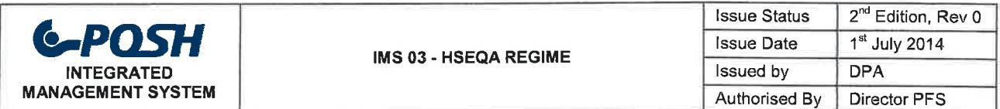

#### 2.4 Vessel HSE Meeting:

All Company Vessels hold a monthly HSE Meeting at which Health, Safety and Environmental issues are raised and discussed. Such issues should relate to the operation of the ship itself and, if appropriate, to other operations in which the ship is involved.

All Available personnel should attend the HSE meeting other than watch keepers.

The meeting should normally be held towards the end of the calendar month and the agenda should follow the standard format as provided by the HSEQA Department, as revised and amended from time to time. The reporting format includes the following:

- . HSE Meeting Minutes
- Safety Statistics .
- BBS Observations / HAZOBS Summary .
- Man Hours Report
- Crew Certification Matrix
- Defects Summary
- Random alcohol test records
- Drill matrix

#### Duties of Vessel HSE Committee: 2.5

- a) If any urgent matters should arise relating to Health, Safety, Environmental matters, BBS Observations issues and/or Hazardous Observations, these should be dealt with immediately, including holding an incident specific safety meeting immediately after a serious accident or incident
- b) Make representations and recommendations to the company on matters affecting the occupational health & safety, and welfare of the Seafarer.
- c) Ensure the company's occupational health and safety policy and to make recommendations for improvements.
- Discuss Fleet HSE meeting minutes, various circulars and 3rd party alerts sent by office d) and highlight actions to be taken to improve safety culture and to comply with regulatory requirements.
- e) When the HSE Meeting is completed, the minutes should be prepared and then sent to the HSEQA Department along with the other HSE related reports by the 5th day of every calendar month.

#### 2.6 Fleet HSE Meeting (Office based):

- a) In the Office, there is also a monthly 'Fleet HSE Meeting' at which all the vessel HSE Meetings and other HSE related reports from the Fleet are reviewed and discussed.
- b) Any issues of particular importance are highlighted for the attention of all vessels, and this may include items that have come to the attention of the HSEQA Department that may have originated from outside the Company.
- c) Minutes of the Office Fleet HSE Meeting (complete with any "action items" and attachments) is sent to all Company vessels

{97}------------------------------------------------

| SR MARINE INTEGRATED MANAGEMENT SYSTEM | IMS 03 - HSEQA REGIME | Issue Status  | 2nd Edition, Rev 0 |
| -------------------------------------------- | --------------------- | ------------- | ------------------ |
|                                              |                       | Issue Date    | 1st July 2014      |
|                                              |                       | Issued by     | DPA                |
|                                              |                       | Authorised By | Director PFS       |

#### 3 TOOLBOX TALK

- Toolbox Talks should be considered as a job briefing and is a forum for the supervisor and/or 3.1 person in charge of a job to ensure that the personnel carrying out the work fully understand the job requirements and they are reminded of the hazards involved, the procedures to be used and the precautions to be taken, as identified in the risk assessment.
- 3.2 A Toolbox Talk should be conducted prior to every task, irrespective of whether it is routine or non-routine and the Form in Appendix of this procedure is to be completed and retained on board.
- 3.3 Toolbox Talks shall be carried out on daily basis by the Master/Chief Officer & Chief/Second Engineer while delegating daily jobs to deck & engine room staff.
- 3.4 include all personnel that will be involved in the work and be of sufficient length and detail to ensure the objectives of the Toolbox Talk are met.
- 3.5 When the job scope changes or when there are new jobs added during the day, a fresh Tool box meeting should be carried out to cover all associated hazards

#### ਹ RISK ASSESMENT

#### 4.1 APPLICATION

- 4.1.1 During the course of various work activities performed on board the vessel, sea staff may be exposed to different types of hazards. All such hazardous situations possess a certain level or degree of risk.
- 4.1.2 In addition to potential safety and/or health hazards, some operational activities may also be potentially hazardous to the environment or to equipment/assets resulting in downtime and charter impact. These hazards must therefore be identified and risk assessed and control measures implemented.
- 4.1.3 The ability to identify and describe a hazard correctly and accurately is of utmost importance. If there is more than one possible cause of a hazardous occurrence at the work site, then all the hazards shall be clearly identification of hazards enables proper evaluation of existing controls and mitigating or preventive measures.
- 4.1.4 For each identified hazard the associated risks with regard to Health & Safety, Operations, Environmental and Charter Impact must be assessed.

#### RISK ASSESSMENT METHODOLOGY 4.2

- 4.2.1 Risk is the potential that a chosen action or activity (including the choice of inaction) will lead to a loss (an undesirable outcome).
- 4.2.2 Risk Assessment is a process of identifying the hazard, evaluating the risk considering the effectiveness of existing controls and deciding whether or not the risk is acceptable.
- 4.2.3 Generic Risk Assessment is the risk assessment which is a process followed by the shore management for the operational requirements of a specific project or charter, permit to work system.
- 4.2.4 Ship Specific Risk Assessment is a process carried out by ship staff on board the vessel, records of which are maintained on board.
- 4.2.5 A Hazard is a situation that poses a level of threat to life, health, property, or the environment.

{98}------------------------------------------------

| Image: SR MARINE INTEGRATED MANAGEMENT SYSTEM | IMS 03 - HSEQA REGIME | Issue Status  | 2nd Edition, Rev 0 |
| --------------------------------------------------- | --------------------- | ------------- | ------------------ |
|                                                     |                       | Issue Date    | 1st July 2014      |
|                                                     |                       | Issued by     | DPA                |
|                                                     |                       | Authorised By | Director PFS       |

- 4.2.6 Risk assessment addresses two elements, Probability (Likelihood) and Severity (Harmfulness).
- 4.2.7 Risk Assessment must be conducted for the work activity as a whole taking into account each sub activity, thereby ensuring the risk assessment participants focus objectively on specific tasks.
- 4.2.8 If two or more activities are to be carried out simultaneously (SIMOPS), when carrying out the risk assessments for each activity consideration must be given as to how each of the activities may present a hazard to or have an impact upon the other activities.
- 4.2.9 The use of the risk assessment technique affords the ability to categorise risk by severity or degree of seriousness. It provides the tools and the mechanism with which to categorise from "Low Risk" through to "High Risk", thus enabling focus on finding ways and means to eliminate or reduce the risk to "As Low As Reasonably Practicable" (ALARP).
- 4.2.10 ALARP is a level of risk that is acceptable by the management having regard to its legal obligations to safety of life, health and the environment.
- 4.2.11 A summary of the existing hazards, risks and control measures is to be carried out for any planned work activity to determine if existing controls to reduce the risk are in place and are adequate, which will determine its initial risk. If, because of the circumstances, significant additional hazards and risks for the planned work activity are identified that are not addressed by the existing control measures, then additional control measures are to be introduced to reduce the risk to ALARP level. Control measures should not be such which generate new hazards.
- 4.2.12 List of possible Hazards/Aspect (for guidance purpose and not limited to):
  - Safety
    - · Not following procedures
    - · Cutting corners and short-cuts
    - · Incapable staff
    - Oily deck/surface
    - · Rolling & Pitching
    - · Tools slipping & falling from a height
    - · Improper use/defective PPE
    - · Un-guarded moving machinery
    - · Faulty Gas detector
    - · Improper ventilation of tanks or enclosed spaces.
    - · Safety devices & cutouts not functioning
    - · Exposure to hot pipes in the machinery spaces
    - · Failure of fridge / deep freeze alarm
    - · Use of uncertified/damaged wire ropes & slings
  - · Health, Hygiene, Biological.
    - · Oxygen deficiency
      - . Inadequate period of rest.
      - Fatigue
      - Mental stress
      - · Psychological reasons
      - · Poor insulation leading to electric shock
      - · Sub-standard wiring
      - · Exposure to excessive heat / sun radiation.
      - · Exposure of skin & body to chemicals & acids.
      - · Exposure to excessive noise levels.
    - · Presence of H2S and other toxic gases.
    - · Crew infected by communicable disease
    - · Exposure to hazardous wastes
    - · Generation of Vibration & Noise

{99}------------------------------------------------

- · Environmental
  - · Over-flow of oil from air pipe
  - · Spillage of oil on deck during transfer operations
  - · Waste / Garbage generation in excess of storage capacity.
  - · Failure of OWS sensor & alarm mechanism.
  - · Generation of oily sludge & waste.
  - · Generation of SO2 beyond the acceptable limits.
  - · Generation of wastes from cleaning compounds used for dish washing
  - · Generation of dirty carbon waste.
- · Quality, Business & Reputation
  - · Non compliance of charter party requirements
  - · Loss in Customer satisfaction level
- Assets
  - · Navigating in piracy prone region
- 4.2.13 Each of the identified hazards is to be considered from the aspect of Probability and Severity of its occurrence to determine its Consequence. The Probability and Severity elements are assessed separately, taking into consideration the existing controls or preventive measures.
- 4.2.14 Hazards should be identified and risks assessed with regard to their potential for causing risk to health/safety, operations, environment and charter Impact. For each identified hazard, the associated risks under each category have to be assessed, i.e.: Health & safety, operations, environmental, and charter impact. Use additional pages of the Risk Assessment Worksheet for each additional identified hazard for the job that is to be done.
- 4.2.15 List of possible Consequences/Impact (for guidance purpose and not limited to) :
  - · Human Injury/ Illness
  - Loss of life
  - Fire/Explosion
  - · Water/Air/Land pollution.
  - · Resource depletion and/or wastage
  - · Pollution of water from NLS.
  - · Damage to ship's structure.
  - · Damage to shore structure.
  - · Damage to Company's reputation
  - · Customer satisfaction or Loss of business

{100}------------------------------------------------

4.2.16 The table below should be used as reference for likelihood of harm:

| Definition             | Likelihood with standard control measures in place                                                                                                                                        | Likelihood with proposed additional control measures                                                                                                                                                           |
| ---------------------- | -------------------------------------------------------------------------------------------------------------------------------------------------------------------------------------------- | ----------------------------------------------------------------------------------------------------------------------------------------------------------------------------------------------------------------- |
| 1. Very Unlikely | Never occurred in the industry: According to the RA team experience, such an event has never occurred in Off- Shore industry                                                        | Could occur under a freak combination of factors: Applied control measures exceed in size, strength and duration required to prevent hazard release; and have always been effective                |
| 2. Unlikely         | Occurred in the industry: This type of event has been recorded at least once in the industry but never in SR MARINE Fleet.                                                          | May occur in exceptional circumstances: Applied control measures exceed in size, strength and duration required to prevent hazard release: and have demonstrated their effectiveness in most cases |
| 3. Possible         | Occurred in SR MARINE: Occurred in SR MARINE Fleet but never in the type of vessel under analysis (or occurred several time in the industry even if never occurred in SR MARINE) | Could occur at some time: Applied control measures are moderate and have worked most of the times, but failure could still occur                                                                         |
| 4. Likely           | Occurred once in similar SR MARINE vessels: There is evidence of one event at least in similar SR MARINE vessels                                                                    | No extraordinary factors to occur: Applied control measures are moderate but possibly insufficient to prevent release by itself                                                                          |
| 5. Very Likely   | Occurred several times in similar facility: Occurrence is highly probable for the specific event                                                                                    | Almost certain to happen: Applied control measures are of weak capacity providing only marginal overall effect                                                                                           |

4.2.17 By referring to the matrix provided (see Appendix), the consequence of each element of hazard is determined and a risk category is assigned to each of the identified hazards.

| 1-4   | Low Risk    | May be acceptable; however, review hazards/controls to assess if risk can be reduced further.                                                                                                                                                                                                                       |
| ----- | -------------- | ---------------------------------------------------------------------------------------------------------------------------------------------------------------------------------------------------------------------------------------------------------------------------------------------------------------------- |
| 5-12  | Medium Risk | The job must not proceed until it has been redefined or additional control measures put in place to reduce risk to Low. The RA shall be sent to HSEQA/office for review/approval. On approval the job to be carried out under supervision of 2 senior officers.                                               |
| 15-25 | High Risk   | Stop work. The job must not proceed until it has been redefined or additional control measures put in place to reduce risk to Medium or Low. The RA shall be sent to HSEQA/office for review/approval. On approval the job to be carried out under supervision of Master and CE. (Significant Hazard/Aspect). |

4.2.18 Depending on the risk category, steps must be taken to mitigate the risk to a level deemed to be acceptable, to bring the residual risk to green zone (between1-4) for safe operations. The steps to be taken must be assigned to appropriate individuals/personnel as "Action Items" and followed up by the Master / person in charge until they have been fully implemented.

{101}------------------------------------------------

# 4 2.19 Risk Reduction Method

The accepted method of risk reduction strategy takes the following proposals in descending order of preference:

- a) Elimination: Total risk elimination is the ideal solution. In most cases this is impractical but could be possible by re-configuring the work in a different way
- b) Substitution: Substitution of the work or process with a less hazardous one is a very good method of risk reduction. It may be particularly applied to the use of hazardous substances. Inevitably there will be a cost consideration to be taken into account.
- d) Engineering Controls: Introduction of engineering controls such as sound proofing, machinery guards, or exhaust ventilation to remove vapours and dust particles are very acceptable reduction methods.
- e) Administrative Controls: Administrative controls are changes to the way people work. Examples of administrative controls include procedure changes, employee training, and installation of signs and warning labels. Administrative controls do not remove hazards, but limit or prevent people's exposure to the hazards, such as cargo operation during day time during rough weather and strong current.
- f) Personal Protective Equipment: All personnel must adhere to PPE policy and shall wear adequate PPE suitable for the nature of work being carried out. Additional PPE requirement based on RA should be discussed during Tool Box meeting. PPE is the least effective means of controlling hazards because of the high potential for damage to render PPE ineffective, Additionally, some PPE, such as BA sets, increase physiological effort to complete a task,

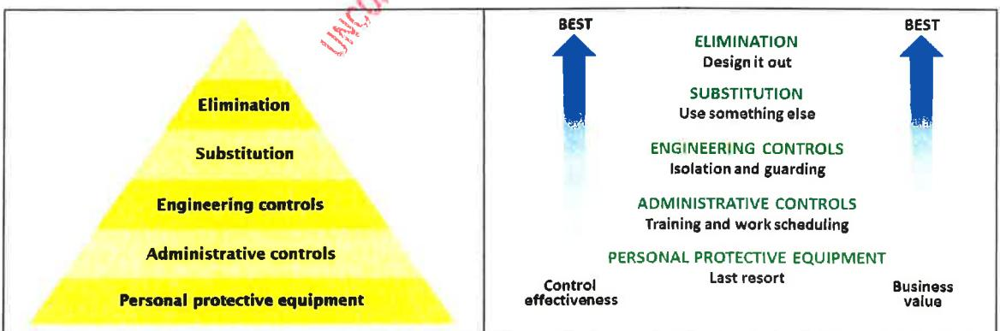

- 4.2.20 If it is not possible to reduce the risks to an acceptable level, the work should not be started or continued (STOP Work Policy) and the Company Management consulted.
- 4.2.21 Risk Assessment is qualitative in nature but can be further strengthened using quantitative information such as accident / injury statistics and other historical information.
- 4.2.22 Significant risks are risks which affect legal compliance or those risks which have a residual risk of "Very High" shall be termed as significant. The aspects / impacts associated with these risks shall also be termed as significant.
- 4.2.23 For Charters, it may be necessary to carry out a "Project Risk Assessment", which is intended to be a careful examination of what, in the nature of the planned operations, could put personnel, the vessel, equipment, the environment or the Project itself at risk. Such risks must include any potential health risks upon personnel as well as physical risks. Project Risk Assessments normally involve the operations personnel and ship's personnel and highlight whether enough precautions have been taken or more should be done to ensure the Project can he carried out at minimal risk

{102}------------------------------------------------

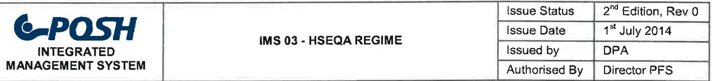

- 4.2.24 A TOOLBOX TALK has to be carried out as part of all risk assessments and the staff involved must participate with a positive frame of mind towards risk reduction (Appendix B).
- 4.2.25 Whenever there is a deviation from original plan, a new Toolbox Talk and a review of the risk assessment has to be carried out thoroughly until it is safe to resume the operation, (see Management of Change and Appendix J). The risk assessment for a change in plan due to any unforeseen circumstances should be incorporated while carrying out a toolbox talk prior to the recommencement of the operation.

# 4.3 RISK ASSESSMENT FOR PERMIT TO WORK (PTW) PROCESSES

- 4.3.1 Risk Assessment becomes an integral part of all Permits to Work processes on board as outlined below. All risk assessments must be performed or carried out prior to any work activities as deemed appropriate by the Master or person in charge of the work activity.
- 4.3.2 Permit to work processes for which risk assessment shall be carried out are but not limited to:
  - a. Hot work activity on board.
  - Entry into enclosed spaces. b.
  - Electrical work that involves maintenance work on any electrical equipment or electrically C. powered system.
  - d. Working aloft or working over side.
  - Lock out / Tag out permits for work that requires control of all equipments having e. mechanical, stored pressure, chemical or electrical energy dormant within the system,
  - f. Underwater diving near to or under own vessel.
  - For any other activity on board the vessel which in the opinion of the Master or Chief g. Engineer possess health and safety risk to personnel, safety of vessel and/or to the environment.
  - For any other work activity defined in a management of change plan. ﮯ
  - For work activities carried out in offshore locations, dry docks or when the vessel is ﻨﺘ undergoing repairs being carried out by 3rd party contractors.
- 4.3.3 All records of risk assessment shall be maintained on board a period of 2 years. In case of any incident, accident or near miss, details of the risk assessment prior to the work activity being performed may need to be sighted by the investigator, flag or port state inspectors, Charter's representative, Technical Superintendents, internal and external auditors to verify that appropriate risk assessments were carried out prior to conduct of the work activity.

# 4.4 REVIEW AND REPORTING OF RISK ASSESSMENT, HAZARD IDENTIFICATION & CONTROLS

- 4.4.1 All risk assessments performed, hazards identified and any controls introduced over and above the existing procedures shall be discussed, highlighted, reviewed and recorded as part of the monthly HSE meeting on board the vessel.
- 4.4.2 Any feedback and suggestion requiring change in procedures or additional control to miligate hazards shall be communicated to HSE dept.

#### GENERIC RISK ASSESSMENTS 4.5

- 4.5.1 Generic risk assessments provided by the management to fleet vessels have been carried out assuming the following conditions:
  - moderate wind force 4 not exceeding 16 knots a.
  - ﻒ moderate sea state, swell height 2m

{103}------------------------------------------------

| Image: SR MARINE Logo INTEGRATED MANAGEMENT SYSTEM | IMS 03 - HSEQA REGIME | Issue Status  | 2nd Edition, Rev 0 |
| -------------------------------------------------------- | --------------------- | ------------- | ------------------ |
|                                                          |                       | Issue Date    | 1st July 2014      |
|                                                          |                       | Issued by     | DPA                |
|                                                          |                       | Authorised By | Director PFS       |

- 4.5.2 The Master / Chief Engineer shall review the generic risk assessment provided for the task and carry out ship specific risk assessment should they identify additional hazards and shall prepare considering the following, which shall be:
  - based on the vessel type, type of operation and current location of the vessel a.
  - b. vessel characteristics
  - experience of officers / crew on board the vessel and C.
  - prevailing and expected weather conditions ರ

#### 4.6 Risk Assessment Flow Chart

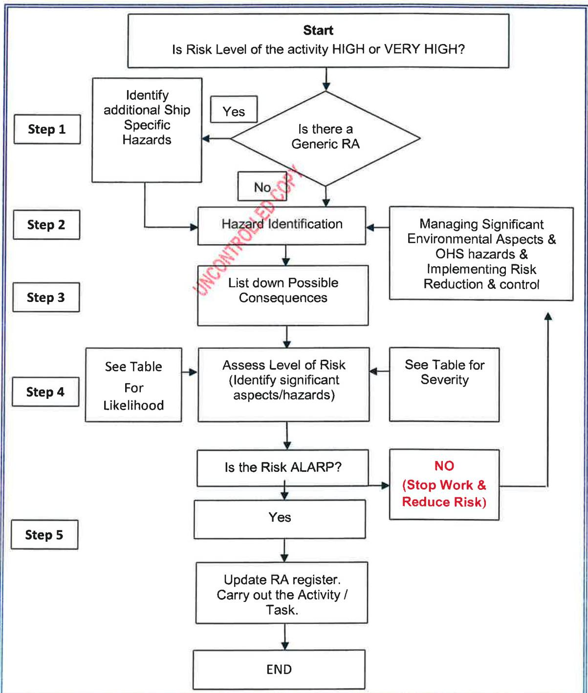

{104}------------------------------------------------

#### 5.0 PERMIT TO WORK (PTW)

#### 5.1 OPERATIONS REQUIRING A PTW

There are a number of operations onboard which involve an element of obvious risk:

- Hot Work any work involving the use of Welding equipment, Flame a. Cutting/Welding/Brazing equipment, Abrasive Grinders/Cutters/Brushes, Drilling equipment or any other equipment which uses open flames or generates heat or sparks that could be a source of ignition.
- Enclosed Space Entry full or partial entry of any personnel into any enclosed space. ﻔ
- Electrical Work - maintenance work on any item of electrical equipment or electrically powered system.
- Working at Height / Over side any type of work more than 2 metres above the deck ರ. and/or any type of above - water work outboard of the ship's side.
- e. Mechanical / Electrical Lockout / Tag out work any work that requires control of all electrical, mechanical or chemical energy.
- Diving Work any work involving diving near to or under the vessel. f.

C

g. Others - any other type of work that may have hazards and therefore risks to personnel in doing the work.

#### PTW CHECKLISTS 5.2

The PTW system consists of an organised and pre-defined checklist (see Appendices). A PTW does not in itself make the job safe, but contributes to a safe working environment.

#### 53 PTW PRINCIPLES

In using a PTW, the following principles apply:

- The PTW should include the completion of a Risk Assessment (JSA) &Toolbox Talk. a.
- The PTW should be as relevant and accurate as possible. It should state the locations ﺿ and details of the work to be done, the nature and results of any preliminary tests undertaken, the measures undertaken to make the job safe and safeguards that need to be taken during the operation.
- The PTW should specify the period of its validity (which should not exceed 12 hours) and C. any time limits applicable to the work, which it authorises.
- d. Only the work specified on the PTW should be undertaken.
- e. Before signing the PTW, the authorising officer should ensure that all measures specified as necessary have in fact been taken.
- f. If work is to be carried out that has a particularly high risk (such as hot work in identified hazardous areas), then the Master must seek Management approval for the PTW.
- If there is any doubt as to whether the job should proceed or not, the Master should g. consult and seek Management approval from the relevant Technical Superintendent, copied to the HSEQA Department. Examples of jobs that may require Management approval may include but not be limited to the following :
  - Planned Hot Work in a hazardous area, such as in a fuel tank. 1.
  - Work being carried out on critical machinery. ii.

{105}------------------------------------------------

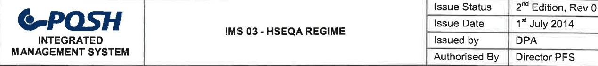

- iii .. Working at height or over side in rough weather.
- iv. Maintenance on overboard valves or suctions.
- V. Enclosed space entry
- The authorising officer retains the responsibility for the work until he has either cancelled ﮯ the PTW or formally transferred it to another authorised person who should be made fully conversant with the situation. Anyone who takes over, either as a matter of routine or in an emergency, from the authorising officer should sign the PTW to indicate transfer of full responsibility.
- . The person-in-charge or person responsible for carrying out the specific work should countersign the PTW to indicate his understanding of the safety precautions to be observed
- Upon completion of the work, the job site must be returned to its normal condition and j. the Job Completion section of the PTW signed off accordingly.
- When the vessel is internally audited, checks to ensure compliance with the PTW k. Systems will be included
- l. When an approved contractor (eg. during drydock) is carrying out work which requires PTW and does not involve any of ship staff and if the contractors are using their own format of PTW checklist, then the ship staff does not have to make a separate PTW for the same task.

# 5.4 PTW AUDIT AND MONITORING PROCESS

- a Active monitoring of the Permit-to-Work system provides essential feedback on performance before an accident, ill health or an incident. It involves checking compliance with performance standards and the achievement of specific objectives.
- b. The responsibility for monitoring rests with Master/OlM although the authority to monitor will be delegated to head of departments and/or the safety officer.
- c. A PTW system audit shall be carried out during regular internal audit and vessel inspection by shore management, all PTW checklists, tool box talk and associated risk assessments should be closely checked.
- d. During the process of PTW, the Master and Safety Officer of the vessel shall also conduct checks and audit on the effective implementation of the PTW process.
- e. In addition, Master and Safety Officer shall ensure that PTW process has been closed as per the checklist.
- f. PTW audit process and results found during audit including any gaps and non conformities shall be discussed during monthly HSE meeting.

# 5.5 ENCLOSED SPACE SAFE PRACTICE

- 5.5.1 Enclosed Space means a space that has any of the following characteristics :
  - a. Where ready access or egress for removal of disabled persons or equipment is difficult due to the location, limited size of the openings for entry and exit.
  - b. Where existing natural ventilation is insufficient to remove dangerous air concentrations and / or oxygen deficiency may exist or develop.
  - Where a space is not designed for continuous worker occupancy. ்.

{106}------------------------------------------------

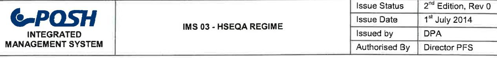

- 5.5.2 Spaces on board that are designated as enclosed spaces include but are not limited to
  - Cargo Tanks a.
  - Ballast Tanks b.
  - C Double bottom tanks
  - Cofferdams d.
  - e. Void Spaces
  - f. Chain Lockers
  - Fuel oil, Lube oil, sewage tanks g.
  - Any other space considered to be confined h.
- 5.5.3 The Master shall be the Responsible Person for all entries into an enclosed space. The Chief Officer and Chief Engineer respectively shall be deemed to be the Competent Person to make an assessment of the likelihood of a dangerous atmosphere being present or subsequently arising in the space.
- 5.5.4 It must be remembered that enclosed spaces that have not been opened for a long time may have an oxygen deficient atmosphere in them (due to steel oxidisation) and must be considered as hazardous, even if they have not previously contained hazardous materials.
- 5.5.5 Entry into an enclosed space has a greater likelihood of causing fatalities, severe injuries and illness than any other type of work on board the vessel
- 5.5.6 The key hazards associated with enclosed spaces are:
  - Loss of consciousness from asphyxiation arising from gas, fumes, vapour or lack of a. oxygen.
  - Serious risk of fire or explosion. b.
  - Loss of consciousness arising from an increase in body temperature. C.
  - Drowning arising from increased water level. d.
  - Inability to reach a breathable atmosphere due to entrapment. e.
- 5.5.7 Crews will have to enter into enclosed spaces that are difficult to access in the course of routine inspections or maintenance. There may be physical constraints due to small or narrow openings and the space itself maybe cramped, all of which may reduce mobility and must be taken into consideration.
- 5.5.8 Due to the (usually) unlit nature of enclosed space, ideally no entry to the space must be made by personnel who suffer from claustrophobia, panic or anxiety attacks.

# 5.6 ENCLOSED SPACE - SAFE ENTRY POLICY

- 5.6.1 I is the company policy to ensure that any entry into enclosed space shall be made only if :
  - a. An enclosed space entry permit to work has been authorised and issued by the Master and that it is considered safe to do so.
  - b. Personnel entering the space will remain inside only as long as it is necessary to carry out the work. Under no circumstances shall personnel stay inside for a period exceeding 08 hours, as mandated by the permit to work.
- 5.6.2 The Master is fully responsible to ensure that the enclosed space is safe to enter,
- 5.6.3 Any personnel on board have the right to refuse entry into an unsafe enclosed space,
- 5.6.4 No personnel shall enter the enclosed space until all safety requirements have been met.

{107}------------------------------------------------

| C-SR MARINE INTEGRATED MANAGEMENT SYSTEM | IMS 03 - HSEQA REGIME | Issue Status  | 2nd Edition, Rev 0 |
| ---------------------------------------------- | --------------------- | ------------- | ------------------ |
|                                                |                       | Issue Date    | 1st July 2014      |
|                                                |                       | Issued by     | DPA                |
|                                                |                       | Authorised By | Director PFS       |

- 5.6.5 No personnel shall enter the space that requires the use of respirator or gas mask.
  - · Do not enter a space alone!
  - · If in doubt, do not enter!
  - · No inspection is worth risking your life or health!
- 5.6.6 It is mandatory that shore management approval must be sought by the Master from the operations manager or DPA/Alt DPA or Technical Superintendent prior entering an enclosed space.

The Master shall ensure that he has documented approval on board prior to proceeding with any of the above works inside the enclosed space.

- 5.6.7 Based on various Code Of Practice for Safe working in confined space, there are physical and psychological stresses associated with work in a confined space and the Master should ensure that its staff intending to work in confined space are certified physically and medically fit preferably and not to assign any staff with following medical condition:
  - history of fits, blackouts or fainting attacks a...
  - heart disease or heart disorder b.
  - chronic airway diseases i.e. as asthma, bronchitis, or shortness of breath on exertion C.
  - ದ deafness
  - Meniere's disease or disease involving giddiness or loss of balance e.
  - f. claustrophobia or other mental disorder
  - neurological and Musculo-Skeletal Disorder such as back pain or joint trouble that would g. limit mobility in confined spaces
  - h. condition that limit movement in confined space such as gross obesity, pregnancy and physical handicap
  - i. metabolic diseases
  - i. serious defect in eyesight
  - k. any other disease or condition that may affect or endanger the person's safety and health while working in confined space(i.e. significant hypertension)

# 5.7 ENTERING AN ENCLOSED SPACE ADJACENT TO LOADED / BALLASTED TANKS

- 5.7.1 Personnel in charge and/or entering enclosed spaces must be fully aware and briefed about the contents of the adjacent tanks. Enclosed spaces adjacent to cargo tanks (such as cofferdams, void spaces and double bottom tanks) may contain accumulated residues from previous cargoes.
- 5.7.2 Personnel must be aware of toxicants produced by work, hydro blasting, painting, sand blasting, etc.) in the area of an adjacent space can enter and accumulate in the enclosed space.
- 5.7.3 Vessels must maintain records of all cargo, ballast, fuel and any oils carried on board to ascertain the nature and history of the enclosed space to be entered.

# 5.8 ENCLOSED SPACE - SAFE ENTRY PROCEDURE

- 5.8.1 Prior to any entry into enclosed space on board, the Master shall ensure that a permit to work for enclosed spaces available in Appendix of this section is duly completed and understood by all personnel involved in the entry.
- 5.8.2 Guidelines and principles for issuing of permit to work are detailed in section 5 of this chapter,

{108}------------------------------------------------

| SR MARINE INTEGRATED MANAGEMENT SYSTEM | IMS 03 - HSEQA REGIME | Issue Status  | 2nd Edition, Rev 0 |
| -------------------------------------------- | --------------------- | ------------- | ------------------ |
|                                              |                       | Issue Date    | 1st July 2014      |
|                                              |                       | Issued by     | DPA                |
|                                              |                       | Authorised By | Director PFS       |

- 5.8.3 All the hazards associated with the entry must be identified and all the risks associated must be thoroughly assessed.
- 5.8.4 In order to identify the hazards and assess the risks, the history of contents of the enclosed space and adjacent spaces must be known and briefed to all personnel entering the space.
- 5.8.5 It is Master's responsibility to ensure that the history of contents in the enclosed space and adjacent spaces are available on board.

# 5.9 ENCLOSED SPACE - ATMOSPHERE TESTING

- 5.9.1 Initial testing of the atmosphere should be carried out by the Chief Officer or the Chief Engineer who shall verify and determine whether the space is safe for personnel entry and work to be carried out and state whether any special conditions are to be observed.
- 5.9.2 Ventilation should be stopped for at least 10 minutes before any tests are conducted and ventilation should not be restarted until all the tests are completed.
- 5.9.3 The testing should be carried out in the following preferential order:
  - a. Oxygen deficient or enriched atmosphere
  - b. Flammable atmosphere
  - Toxic atmosphere when considered necessary, in case of hot work, painting etc C.
- 5.9.4 For entry purposes, the following limit values shall be used at all times, though it is recommended that LEL/H2S and CO level should be zero as far as practicable :

| Oxygen                                                        | 20.8% (min 20/max 21%)                                |
| ------------------------------------------------------------- | ----------------------------------------------------- |
| Lower Flammable Limit (LFL) or Lower Explosive Limit (LEL) | < 1 %                                                 |
| For Toxic atmosphere :                                        |                                                       |
| Hydrogen Sulphide (H2S) Carbon Monoxide                    | < 5 ppm (8 hrs exposure) < 25 ppm (8 hrs exposure) |

# 5.10 ENCLOSED SPACE - ATMOSPHERIC TESTING EQUIPMENT

- 5.10.1 Atmospheric testing instruments shall be calibrated at least once annually or as frequently as required by the manufacturer's instruction manual.
- 5.10.2 Atmospheric testing instruments must be visibly inspected for damage, batteries (where fitted) checked and the instrument "zeroed" (where possible) prior to use. If there is any doubt about the serviceability of the atmospheric testing instrument it should not be used, withdrawn from use and labelled "Defective - Not to be used".
- 5.10.3 Atmospheric testing instruments shall be provided with sufficient length of hose to reach the bottom of the space from the measuring point.
- 5.10.4 As a rule for measurement purposes the following shall be adhered to:
  - a. If the equipment is fitted with a manual hand rubber pump for drawing in atmospheric samples, then at least 4 squeezes of the hand pump are required for each metre length of the sampling hose.
  - b. If battery driven pumps are used for measurement, approximately 10 seconds for each metre of the sampling hose should be sufficient.

{109}------------------------------------------------

| Image: SR MARINE INTEGRATED MANAGEMENT SYSTEM | IMS 03 - HSEQA REGIME | Issue Status | 2nd Edition, Rev 0 |
| --------------------------------------------------- | --------------------- | ------------ | ------------------ |
|                                                     |                       |              | Issue Date         |
|                                                     |                       |              | Issued by          |
|                                                     |                       |              | Authorised By      |

c. For toxic gas measurement, the sampling gas should have sufficient time to pass through the sampling hose.

# 5.11 ENGLOSED SPACE - VENTILATION PROCEDURE

- 5.11.1 Ventilation of the enclosed space must be continuous where possible because in many enclosed spaces the hazardous atmosphere will form again when the ventilation flow is stopped. All openings are to be opened up for ventilation including the emergency exits (if provided).
- 5.11.1 De-ballasting a tank does not guarantee a safe atmosphere and testing of the atmosphere is still required.
- 5.11.2 A common method of ventilation requires a large hose, one end attached to a fan (positioned in an area where the air is 100% fresh) and the other lowered into a manhole or opening. For example, a manhole would have ventilating hose run to the bottom of the enclosed space (see figure) to dilute or displace all harmful gases or vapours.

# Schematic Principles for Ventilation:

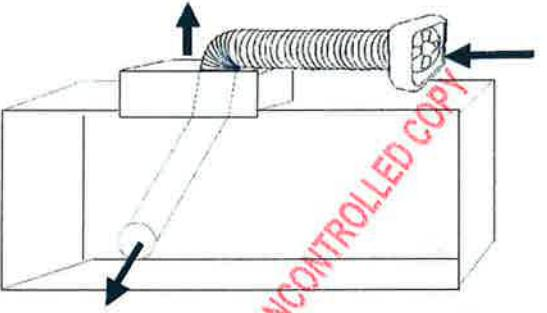

# 5.12 ENCLOSED SPACE - ISOLATION PROCEDURE

- 5.12.1 The Master, Chief Officer and Chief Engineer shall evaluate the need for isolation of the enclosed space from service before any decision on personnel entry is made.
- 5.12.2 No personnel entry is to be made at all inside any cargo, ballast or fuel tank if ballast, cargo or fuel is to be transferred into or out of any tank on board, including the tank to be entered.
- 5.12.3 No cargo, ballasting or fuelling operations are to be carried out if personnel entry is to be made into any cargo, ballast or fuel tanks.
- 5.12.4 Isolation of a confined space is a process where the space is removed from service by one or more of the following methods:
  - Locking Out: Electrical sources preferably disconnected by using switches remote from a. the equipment.
  - b. Blanking, Securing Valves: Cargo, ballast, fuel and hydraulic lines passing through the enclosed space should be isolated by closing valves or blanked off. An alternative to pipe blanking would be to remove a section of the line.
  - Disconnecting: Mechanical linkages on shaft driven linkages (if any present in the C. enclosed space) must be disconnected and tagged.
  - ପ୍ରଦାସ ପର୍ Securing: Mechanical moving parts within the enclosed space must be secured with latches, chains, chocks, blocks or other suitable devices.
  - i. Notice boards: Appropriate notices, clearly specifying which enclosed spaces and requirements agreed upon must be clearly displayed on bridge and Engine room.

{110}------------------------------------------------

# Examples of Blanking, Locking and Securing of Equipment:

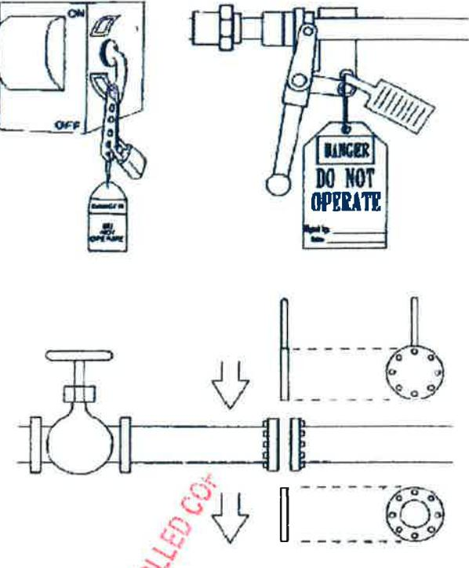

# 5.13 ENCLOSED SPACE - STANDBY / RESCUE

- 5.13.1 A standby person should be assigned to remain on the outside of the enclosed space at all times and be in constant contact (visual or two-way voice communication) with the personnel inside the enclosed space. The routine communication interval with the personnel inside the enclosed space shall not exceed 15 minutes.
- 5.13.2 The standby person shall abide by the following instructions:
  - a. Must not perform any other duties other than to serve as standby and should know who is to be notified in case of emergency.
  - b. permission of the Responsible or Competent person as per 5.5.3
  - c. should not leave the post even after help has arrived, as he/she is the key communication link on board
  - d.
- 5.13.3 In event of rescue, the standby person must be trained to follow established emergency procedures and use appropriate equipment and techniques.
- 5.13.4 Emergency and evacuation procedures should be agreed and understood by all the personnel involved, Rescue should be well planned and plans for drills and training for rescue from enclosed spaces must be carried out frequently as per the Company Drills and Training Matrices.

{111}------------------------------------------------

| Image: SR MARINE INTEGRATED MANAGEMENT SYSTEM | IMS 03 - HSEQA REGIME | Issue Status  | 2nd Edition, Rev 0 |
| --------------------------------------------------- | --------------------- | ------------- | ------------------ |
|                                                     |                       | Issue Date    | 1st July 2014      |
|                                                     |                       | Issued by     | DPA                |
|                                                     |                       | Authorised By | Director PFS       |

5.13.5 In case of any emergency, minimum safety equipment kept at the entrance of enclosed space should be as following but not limited to:

- 2 BA sets with life line
- Intrinsically safe flash light
- One EEBD
- Stretcher with messenger rope
- First aid kit
- Portable oxygen resuscitator .

#### GUARDING OF OPENINGS 5.14

- 5.14.1 Any opening, open hatchway or dangerous edge into, through or over which a person may fall shall be fitted with secure guards or fencing of adequate size and construction. Any hatchway open for the purposes of handling cargo or stores through which a person may fall should be closed as soon as those operations cease.
- 5.14.2 The guardrails or fencing should be free from sharp edges and should be properly maintained. Where necessary, locking devices, and suitable stops or toe-boards should be provided. Each course of rails should be kept substantially horizontal and taut throughout their length.
- 5.14.3 Where there is a risk of persons falling in excess of 1.5 metres or into the sea, guardrails or fencing should consist of an upper rail at a height of 1 metre, an intermediate rail at 0.5 metre spacing from top rail.

#### 6.0 HOT WORK

# Hot Work should only be considered if there is no other practical alternative means of carrying out repairs on board.

Hot Work carried out on board fleet vessels is controlled by the Permit to Work (PTW) system (as per Section 5 of this chapter) irrespective of location.

#### 6.1 PROHIBITION OF HOT WORK

Hot Work is strictly prohibited when vessel is performing any of the following operations:

- ത് Anchor handling, except if operational requirement or emergency repairs
- b. IMDG/NLX Cargo handling & operations
- C. Bunkering
- ರ Tank cleaning or Gas freeing
- e. Within 500 mtr zone of any installation
- f. Any other situation where hot work may possess danger to vessel and surrounding

#### 62 AUTHORITY AND RESPONSIBLITY

The overall authority whether the use of Hot Work is justified rests with the Master in consultation with the shore management and he must delegate the responsible officer (Chief Engineer) to approve and complete the PTW before any hot work can commence.

- 6.2.1 Only one Hot Work operation should be performed at any given time on board the vessel.
- 6.2.2 A thorough risk assessment should be carried out to identify the hazards and assess the risks involved. This process of risk assessment should ensure that the protective and

{112}------------------------------------------------

| Image: SR MARINE logo INTEGRATED MANAGEMENT SYSTEM | IMS 03 - HSEQA REGIME | Issue Status  | 2nd Edition, Rev 0 |
| -------------------------------------------------------- | --------------------- | ------------- | ------------------ |
|                                                          |                       | Issue Date    | 1st July 2014      |
|                                                          |                       | Issued by     | DPA                |
|                                                          |                       | Authorised By | Director PFS       |

precautionary measures taken will reduce the risk associated to allow the task to be carried out safely.

- 6.2.3 The Chief Officer or Chief Engineer will be the designated person to ensure that all safety requirements as assessed during the risk assessment and discussed during the toolbox meeting are followed.
- 6.2.4 A Hot Work permit should be issued before the work is to commence. In the event of a delay to the start of work all safety requirements should be rechecked and recorded before work actually commences.
- 6.2.5 If the conditions under which the permit has been issued should change, the Hot Work must stop immediately. The permit should be withdrawn or cancelled until all conditions and safety precautions have been checked and reinstated to allow the new permit to be issued.
- 6.2.6 The work area should be carefully prepared and isolated, adequately and continuously ventilated and the frequency of atmospheric testing inside the enclosed space while the work is being carried out must be not more than 30 minutes or more frequently if required.

#### HOT WORK - WORKING SAFELY 6.3

- 6.3.1 Only personnel certificated or qualified as Fitters / Welders as per their national certification standards shall be deemed appropriate to carry out hot work on board company vessels. Remember that hot work includes grinding, disc cutting and wirebrushing.
- 6.3.2 Oxygen and Acetylene gas cylinders must be stored upright in their designated compartments. If such space is not provided then the cylinders shall be stored upright and with a minimum distance of at least 6m between them, and stored well clear of oil or flammable materials such as paints or chemicals.
- 6.3.3 Oxygen and Acetylene cylinders must at all times be secured upright and with a non flammable means to prevent them from being knocked over or damaged, regardless whether they are full or empty. Rope or cordage shall not be used for securing the cylinders.
- 6.3.4 Prior to use, the oxy / acetylene equipment must be thoroughly inspected (particularly the hoses, torch and nozzles) to ensure it is safe to use. If there is any doubt about the serviceability of the equipment, it should not be used, withdrawn from use and labelled "Defective - Not to be used".
- 6.3.5 Cylinder valves must be kept closed at all times except when the cylinder is in active use. The cylinder valve must be opened slowly with valve pointing away from the personnel opening it.
- 6.3.6 Cylinders are required to be lifted or transferred using an approved basket or trolley,
- 6.3.7 Flashback arrestors must be installed at the discharge of the regulators.
- 6.3.8 Keep caps in place when cylinders are not in use or empty.
- 6.3.9 Care should be taken to avoid cylinders (particularly acetylene cylinders) striking against or being struck by other objects.
- 6.3.10 Cylinders must never be rolled across the deck from one place to another.

{113}------------------------------------------------

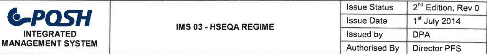

#### HOT WORK - FIRE WATCH / FIRE PRECAUTIONS 64

- 6.4.1 Adequate fire fighting equipment must be prepared, laid out and be ready for immediate use. Fire safety precautions and fire extinguishing measures to be adopted for the task must be reviewed prior to commencement.
- 6.4.2 Fire watch procedures must be established for the area of hot work and for adjacent spaces where the transfer of heat or accidental damage might create a hazard (example is damage to hydraulic lines and electrical cables). The fire watch must continue throughout the duration of the hot work.
- 6.4.3 As far as possible, all flammable materials must be removed from the space/area where hot work is to be carried and from adjacent spaces / areas. Where it is not possible to remove such materials, some form of non-flammable shielding (such as a fire blanket) must be put in place to shield the flammable materials from direct exposure to the hot work.
- 6.4.4 The fire watch should monitor the work and take action in case of ignition of residues or paint coatings. Effective means of containing and extinguishing sparks and molten slag must be established.
- 6.4.5 Isolation of the work area and fire safety precautions should be continued until the completion of Hot Work.

#### 65 HOT WORK - IN PORT / AT ANCHOR / ALONGSIDE

- 6.5.1 If hot work is planned to take place in port, it must only be taken with the permission of SR MARINE Management.
- 6.5.2 SR MARINE vessels when in an anchorage or alongside any berth must ensure that hot work is only permitted in accordance with prevailing national or international regulations, port and base requirements and after all necessary port approvals have been obtained. The copy of approval should be attached with hot work permit.

# 6.6 HOT WORK - INSIDE MACHINERY SPACES

- 6.6.1 Permission must be sought from shore management prior to commencement of any Hot Work inside a machinery space within close proximity of bunker or any other tanks containing flammable cargo.
- 6.6.2 Hot Work inside a machinery space is only to be considered if essential for safety reasons or for the immediate operational capability of the vessel and that such repair cannot be deferred until the vessel's next planned visit to a repair yard.
- 6.6.3 Hot Work inside the machinery space when associated with fuel tanks and fuel pipelines must take into account the possible presence of hydrocarbon vapours in the atmosphere and the existence of potential ignition sources.
- 6.6.4 Hot Work is strictly prohibited on bulkheads of bunker tanks or within 1 metre of such bulkheads without gas freeing and proper authorisation.

# 6.7 HOT WORK - INSIDE ENCLOSED SPACES

- 6.7.1 Hot Work inside designated enclosed spaces (as defined in 5.5.2 of this chapter) is strictly prohibited without the permission of shore management.
- 6.7.2 Hot Work inside enclosed spaces is only to be considered essential for safety reasons or for the immediate operational capability of the vessel and that such repair cannot be deferred until the vessel's next planned visit to a repair yard.

{114}------------------------------------------------

- 6.7.3 Hot work inside enclosed spaces must strictly follow the guidelines provided in section 5.5-5.13 and 5.14-5.17 of this chapter, the space has been made safe, proved to be safe and all permissions from shore authorities and management have been obtained.
- 6.7.4 Hot Work inside the enclosed space when associated with fuel tanks and fuel pipelines must take into account the possible presence of hydrocarbon vapours in the atmosphere and the existence of potential ignition sources.

# 6.8 PROVISION OF FLASHBACK ARRESTOR AND GAS REGULATOR.

- 6.8.1 Where any hot work involving oxygen and acetylene gas is carried out on board, the Chief Officer / Chief Engineer are to ensure that the equipment is provided with the following safety devices prior to commencement of hot work :
  - a. the manufacturer's instructions to prevent the back flow of gas.
  - b. A flashback arrestor to stop flashback shall be fitted in line with manufacturer's instructions between oxygen and acetylene outlet and the pressure regulator outlet of each gas cylinder on the supply line.
- 6.8.2 Should a back fire or back flow occur, the recommended first action will be to close the oxygen valve on the blow pipe followed by closing the acetylene gas at the blow pipe so as to prevent internal burning.

# 6.9 WELDING AND BURNING EQUIPMENT

- 6.9.1 Welding and other equipment used for Hot Work must be carefully inspected before each occasion of use to ensure that it is in good condition. Where required it must be correctly earthed, special attention must be paid to the following:
  - Electrical supply connections are made in gas free space. a.
  - Existing supply wiring is adequate to carry the electrical current demand without ﻓ overloading or excessive heating.
  - Insulation of flexible electrical cables is in good condition. c.
  - The cable route to the work site is the safest possible, only passing over gas free ರ or inerted spaces.
  - The earthing connection and the earth return cable leads directly back to the e. welding machine. The ship structure must not be used as an earth return.
- 6.9.2 If there is any doubt about the serviceability of the equipment, it should not be used, withdrawn from use and labelled "Defective - Not to be used".

# 6.10 Precautions to be Taken During Electric-Arc Welding

- a) The welding operator should wear the protective clothing specified earlier but should additionally wear non-conducting safety footwear. Clothing should be kept as dry as possible as some protection against electric shock. It is particularly important that gloves should be dry because wet leather is a good conductor.
- b) be alert to the risk of accidental shock to the welder, ready to cut off power instantly, raise the alarm and apply artificial respiration without delay. The desirability of a second assistant should be considered if the work is to be carried out in difficult conditions.
- c) Where persons other than the operator are likely to be exposed to harmful radiation or sparks from electric arc welding, they should be protected by screens or other effective means.

{115}------------------------------------------------

| SR MARINE INTEGRATED MANAGEMENT SYSTEM |                       | Issue Status  | 2nd Edition, Rev 0 |
| -------------------------------------------- | --------------------- | ------------- | ------------------ |
|                                              | IMS 03 - HSEQA REGIME | Issue Date    | 1st July 2014      |
|                                              |                       | Issued by     | DPA                |
|                                              |                       | Authorised By | Director PFS       |

- d) or is likely to make contact in the course of ordinary movements, protection should be provided by dry insulating mats or boards.
- e) There are increased risks of electric shock to the operator if welding is done in hot or humid conditions; body sweat and damp clothing greatly reduce body resistance. Under such conditions, the operation should be deferred until such time as an adequate level of safety can be achieved.
- f) In no circumstances should a welder work while standing in water or with any part of his body immersed.
- g) The electrode holder should be isolated from the current supply before a used electrode is removed and before a new electrode is inserted. This precaution is necessary because some electrode coatings have extremely low resistance. Even a flux coating which is normally insulating can become damp from sweating hands and thus potentially dangerous. When the welding operation is completed or temporarily suspended, the electrode should be removed from the holder.
- h) Hot electrode ends should be ejected into a suitable container; they should not be handled with bare hands. Spare electrodes should be kept dry in their container until required for use.

#### 6.10.1 Protective Clothing

- a) Protective clothing and equipment complying with the relevant BS specifications should be worn by the operator and as appropriate by those working with him to protect them from particles of hot metal and slag and from accidental burns and their eyes and skin from ultra-violet and heat radiation.
- The operator should normally wear: b)
  - welding helmet with suitably coloured transparent eye piece. Eye goggles or a hand-held shield may be suitable alternatives in appropriate circumstances;
  - leather working gloves;
  - leather apron (in appropriate circumstances);
  - long-sleeved natural fibre boiler suit or other approved protective clothing.
- c) Clothing should be free of grease and oil and other flammable substances

# 6.10.2 Precautions Against Fire or Explosion

- a) Before welding, flame-cutting or other hot work is begun, a check should be made that there are no combustible solids, liquids or gases, at, below or adjacent to the area of the work, which might be ignited by heat or sparks from the work.
- b) Welding or other hot work should never be undertaken on surfaces covered with grease. oil or other flammable or combustible substances.
- c) When welding is to be done in the vicinity of open hatches, suitable screens should be erected to prevent sparks dropping down hatchways or ventilators. Where necessary, combustible materials should be moved to a safe distance before commencing operations.
- d) Openings through which sparks may fall should be closed where practicable.
- Welding or other hot work must be suitably screened from the production platform e) alongside to avoid the naked flame or arc triggering ultra-violet alarms on the platform.

{116}------------------------------------------------

| Issue Status  | 2nd Edition, Rev 0 |
| ------------- | ------------------ |
| Issue Date    | 1st July 2014      |
| Issued by     | DPA                |
| Authorised By | Director PFS       |

- Where work is being done close to or at bulkheads, decks or deck-heads, the remote sides of the divisions should be checked for materials and substances which may ignite. and for cables, pipelines or other services which may be affected by the heat.
- Fuel tanks or other tanks or spaces that have contained flammable substances should be ଦି certified as being free of flammable gases before any repair work is commenced. The testing should include, as appropriate, the testing of adjacent spaces, void spaces, etc. Further tests should be carried out at regular intervals and before hot work is recommenced following any suspension of the work. Welding and flame-cutting operations should be properly supervised and kept under regular observation. Suitable fire extinquishers should be kept at hand ready for use during the operation. A person with a suitable extinguisher should also be stationed to keep watch on areas not visible to the welder which may be affected.
- h) appropriate frequent checks should be made for at least two hours after cessation of the work.

#### 6.10.3 Welding

Hazards from electric welding are greatly reduced from that of gas. Indeed these may be restricted to four categories:

- radiation
- electrocution
- fume
- housekeeping

#### 6.10.4 Radiation

- a) Radiation, as a result of ultra-violet rays in the welding arc (arc eye) can be extremely painful and may result even from short exposure to the arc. Generally it develops a few hours after exposure and manifests itself as sore gritty eyes, pain from bright lights and headache. Usually last in the region of 24 hours with no long term effects.
- b) Prevention may be directly to the welder by the use of suitable visor, but for others may take the form of a screen to prevent flash. Due consideration should also be given to the light that may be reflected from surrounding surfaces and walls.
- c) Also consider removal of slag when chipping welds to prevent penetration of the eye by chipped material, the slag will probably be extremely hot.

#### 6.10.5 Electrocution

- a) This is an ever present risk when using any form of electrically energised plant/equipment, and can be greatly reduced by the taking of some fundamental precautionary measures:
  - Correctly earth all plant/equipment and work and ensure all insulation is in good condition.
  - Ensure work area is dry, free from sharp objects and generally in a clean condition.
  - Switch off power when plant/equipment is not in use.
  - All plant/equipment must be regularly inspected and maintained.
  - Repairs, servicing, maintenance must only be carried out by qualified persons.
  - Avoid dragging cables across areas where damage may occur from exposed edges.
  - Ensure personnel are aware of procedure in cases of emergency (electric shock).
  - Ensure mains isolation switches are local to the plant operation.
  - Ensure electrodes are maintained in a good condition with sound insulating material.

{117}------------------------------------------------

| Issue Status  | 2nd Edition, Rev 0 |
| ------------- | ------------------ |
| Issue Date    | 1st July 2014      |
| Issued by     | DPA                |
| Authorised By | Director PFS       |

#### 6.10.6 Fume

- a) Fume is generally caused as a result of the work piece being welded and the silicon based coatings in the welding electrodes. Symptoms will generally manifest themselves in the form of severe headache, shivering, aching in the joints and a high temperature with overall feeling similar to a bad bout of influenza.
- This is generally referred to as metal fume fever. It can be prevented by either local ﻣﻦ ﺍﻟﻤﺴﺎﻋﺔ ﺍﻟﻤﺘﺤﺪﺓ ﺍﻟﻤﺘﺤﺪﺓ ﺍﻟﻤﺘﺤﺪﺓ ﺍﻟﻤﺘﺤﺪﺓ ﺍﻟﻤﺘﺤﺪﺓ ﺍﻟﻤﺘﺤﺪﺓ ﺍﻟﻤﺘﺤﺪﺓ ﺍﻟﻤﺘﺤﺪﺓ ﺍﻟﻤﺘﺤﺪﺓ ﺍﻟﻤﺘﺤﺪﺓ ﺍﻟﻤﺘﺤﺪﺓ ﺍﻟﻤﺘﺤﺪﺓ ﺍﻟﻤﺘﺤﺪﺓ ﺍﻟﻤﺘﺤﺪﺓ ﺍﻟﻤﺘﺤﺪﺓ ﺍﻟﻤﺘﺤﺪﺓ ﺍﻟﻤﺘﺤﺪﺓ ﺍﻟﻤﺘﺤﺪﺓ ﺍﻟﻤﺘﺤﺪﺓ ﺍﻟﻤﺘﺤﺪﺓ ventilation, either in the overall workplace or more specifically at the point of the weld.
- c) Some forms of exposure can be particularly serious, especially when welding such materials as lead, cadmium or similar and can even in some cases be fatal. These unsatisfactory work practices must be avoided at all costs, or be provided with suitable and/or improved local exhaust ventilation.

#### 6.10.7 Housekeeping

Housekeeping is important at all work site locations, but is of particular importance where electric arc welding plant is in use. Some points of consideration may be:

- Avoid excessive runs of trailing leads which as well as posing a tripping hazard may in addition be crushed by plant/equipment landing on it or similarly damaged by sharp objects being dropped on to the cables.
- Where work occurs over open mesh floors the positioning of a fire proof blanket or timber cover deck will prevent the fall of hot or other materials to a lower level. This is particularly important in the case of electrodes.
- Ensure the provision at the work-site of suitable fire fighting equipment.
- Ensure welding sets where sited are in such a position that they do not obstruct access ways or impede passage of persons along emergency escape routes.
- Ensure all plant is isolated when not in use.
- Where necessary place warning notices advising of the works that are in progress.

#### 7.0 Working at Heights

- 7.1 Whenever working at heights cannot be eliminated, a task risk assessment shall be completed;
  - · Before the commencement of work.
  - · At any time the scope of work changes.
  - · At any time the potential risk increases the likelihood for a fall,
- 7.2 When an employee works at elevations of 2 metres or more, he or she shall wear fall restraint/arrest equipment.
- 7.3 Working at heights shall not proceed unless the control of risks associated with working at heights considers:
  - Permanent access to the worksite or area .
  - Dropped objects.
  - Personnel who are exposed to a fall.
  - · Provision and use of temporary structures that comply with recognised national standards.
  - · Provision and use of working at heights equipment that complies with recognised national standards.
  - · Environmental conditions that influence working conditions.
  - · Employee competency in the use of the fall restraint/arrest equipment.

{118}------------------------------------------------

- Whether employees are medically fit for working at heights.
- · Selection of supporting structures (e.g., roofs, anchorage/tie-off points).
- 7.4 A competent person shall inspect the following before work starts:
  - Work platforms. .
  - . Temporary access equipment, including:
    - Scaffolds.
    - Portable elevated work platforms.
    - Suspended work cages.
    - Ladders.
  - 7.5 Inspection shall verify compliance with the following:
    - Applicable approved design standards.
    - Manufacturers' specifications. ●
  - Personal fall restraint/arrest equipment shall: 7.6
    - Be fit for purpose.
    - Undergo a pre-use inspection by a competent person.
    - · Be subject to a documented inspection program based on one or both of the following:
      - Industry standards.
      - Manufacturer recommendations.
  - 7.7 at all times when the work method requires employees to detach and re-attach at height.
  - 7.8 When the use of personal restraint/fall arrest equired for a lone person working at heights, he or she shall be constantly monitored by a designated person so that the alarm can be immediately raised if either of the following occurs:
    - Employee falls.
    - Employee requires assistance. .
  - 7.9 Approved methods of rescue for employees using personal fall restraint/arrest equipment shall include plans for the rapid retrieval of an individual in the event of a fall to avoid suspension trauma.

#### 8 LOCK OUT / TAG OUT

- 8.1 The Master or Chief Engineer (as applicable for the task) is responsible for ensuring that Lockout / Tag-out procedures are followed. The qualified Officer in charge of the task is responsible to ensure the procedure is implemented.
- 8.2 Before permitting work to begin, the Officer in charge of the task must :
  - a. Advice the Master or Chief Engineer as applicable when maintenance or servicing is required on any machinery or equipment that must be shut down and locked / tagged out to undertake the maintenance repairs.

{119}------------------------------------------------

| Image: SR MARINE INTEGRATED MANAGEMENT SYSTEM | IMS 03 - HSEQA REGIME | Issue Status  | 2nd Edition, Rev 0 |
| --------------------------------------------------- | --------------------- | ------------- | ------------------ |
|                                                     |                       | Issue Date    | 1st July 2014      |
|                                                     |                       | Issued by     | DPA                |
|                                                     |                       | Authorised By | Director PFS       |

- Identify the source, type and amount of energy used by the machine or equipment. ﻒ
- The hazards posed by this energy and the means to control it must be fully understood, C. G
- 8.3 , The Officer in charge of the task must follow the following,steps:
  - If the machine or equipment is running, it must be stopped or shut down using the normal a. stopping mechanism.
  - b. Isolate the machine or equipment from the energy source.
  - C. Lock the energy isolating device.
  - d. Attach a relevant sign (tag) to the locked-out energy isolating device as well as to any remote control device. This is called "tag-out".
  - e. Take care when Tags are attached to isolated equipment and remote control panels, especially in the engine control room and bridge or wherever space is limited as hands may be cut on sharp edges or objects.
  - Any stored or residual energy should be controlled, dissipated or restrained using f. methods such as grounding, bleeding off, purging, blocking, repositioning etc),
  - Ensure the machine or equipment is fully isolated from the energy source. g.
  - Check that no personnel are near-by then check isolation by using the normal starting h. buttons / switches to make sure that the machine is "dead" from this control and cannot be started.
  - i. The machine or equipment is properly locked and / or tagged out and work can commence safely.
  - To prevent any inadvertent start up on completion of the maintenance or servicing it is vitally important to ensure that the operating control / button / switch (including any remote operating controls) are returned to the "stop / off / neutral" position after verifying isolation of the machine or equipment.
- 8.4 On Completion of the service or maintenance:
  - Clear the area of any non-essential items and personnel. a.
  - ﻘ Ensure the repairs or maintenance has been effective.
  - c. Remove the lock-out and tag-out devices, check once more that all personnel are clear from the area and restart the machine or equipment.
  - d. Tags used onboard should be a standard type showing applicable and clear information such as: Do Not Operate / Do Not Use / Do Not Start / Do Not Open. Tags should be immediately available on the bridge and in the engine control room.
  - e. Lock-out, tag-out and re-energising equipment (electrical current or fluid flow) activities should be documented in the deck or engine log-books as applicable.

{120}------------------------------------------------

| Issue Status  | 2nd Edition, Rev 0 |
| ------------- | ------------------ |
| Issue Date    | 1st July 2014      |
| Issued by     | DPA                |
| Authorised By | Director PFS       |

#### 9 MANAGEMENT OF CHANGE (MOC)

#### 9.1 Purpose

Change is an event or issue where there is a transition from one situation or state to a different one, it may be temporary or permanent substitution, alteration, replacement (not in kind), modification by addition or deletion or organisation, personnel, critical equipment, applicable codes, operating limits, procedures, emergency response equipment from the present configuration whether they are planned or in event of emergency. It can be any planned or enforced change, temporary or permanent, in people, plant and/or process for operational activities. All steps shall be taken to guard against unforeseen hazard and mitigate the risks that could result from poor management of change.

The principle of Management of Change is that approval for any change must be given by the right authority and only after a systematic process to examine the impact and management of any associated risks.

It is appreciated that the application of this Procedure will vary widely depending on the nature of the Change and associated risks. Office Management who review and approve Changes have a responsibility for deciding the depth to which this Procedure needs to be followed to manage the Change, based on the guidance provided in this Procedure, and ensuring that all elements are covered.

#### 92 Responsibility

- a. The overall responsibility for managing the changes affecting various activities in office and Vessels lie with the Director PFS.
- b. The DPA/MR is responsible for monitoring the changes affecting the office.
- c. The respective department Manager is responsible for carrying out the MOC process in the office and, where necessary, changes affecting vessel.
- d. The Master is responsible for monitoring the changes affecting the vessel.
- e. Each and every employee of the company has the responsibility to become aware of the Management of change and actively participate in the process.

#### 9.3 Terminology

Change: Changes are modifications, additions, or substitutions for any aspect within the organization that are outside the company's present specifications and procedures.

Initiator: Person proposing change, it can be anybody within the company or vessel. The initiator works with the change owner to prepare the supporting documentation required by the MOC.

Change Owner: Office Manager/Superintendent/Master and or CE with responsibility in the area where the change is proposed and who works with the initiator in preparing the change form request. If the initiator is a shipboard officer or above, then the initiator and change owner are one and the same.

Approver: A member of office management who reviews the initial change to confirm the need for change and validate the preliminary impact assessment and the implementation plan. If the change has major impacts and it is particularly complex, the approver is strongly advised to request further detailed risk assessment.

MOC: Acronym for "Management of Change". It is also used to refer to a proposed change that is going through the management of change process.

{121}------------------------------------------------

| SR MARINE INTEGRATED MANAGEMENT SYSTEM | IMS 03 - HSEQA REGIME | Issue Status  | 2nd Edition, Rev 0 |
| -------------------------------------------- | --------------------- | ------------- | ------------------ |
|                                              |                       | Issue Date    | 1st July 2014      |
|                                              |                       | Issued by     | DPA                |
|                                              |                       | Authorised By | Director PFS       |

MOC Form: The MOC form is essentially the record for each change. The form is essential to allow the necessary information to be gathered and recorded efficiently and effectively.

MOC Log: The MOC log functions like a summary register of all changes onboard and in the office. The information contained in the log can show at a glance which changes are open, which are about to expire, and which are late and where actions need to be taken. The MOC log can be paper-based or electronic (Refer to appendix J3).

Onboard MOC Record: Master shall maintain a record of all the MOC forms and current status of each change. His/her job is to verify that changes are completed in a timely manner and updated and closed out as required.

Shore-side MOC Record: The HSE Manager shall be the shore-side MOC coordinator and will track MOC program performance, including the status of MOCs and MOC actions, and undertakes audits of MOC programs fleet wide and in office.

Replacement-in-kind: When an item, process, or person meets the existing specified criteria for the item it is replacing, it is typically not considered a change, but a replacement-in-kind.

# 9.4 Types of Change (including but not limited to the below-listed)

- a. Organisational
  - Addition of New vessels in the fleet / change of flag
  - New post created in office
  - Opening of new branch office
  - Recruitment of new crew manning agent
  - Changes in office organization structure
- b. Human
  - Change of key personnel in office (ex-Managers / MR / DPA)
  - Re assignment of key personnel on board (Master / CE)
  - Change of tech super in midst of dry docking
- C. Engineering
  - Installation of new equipment/system in ships (ex- Radascan)
  - Major Modification to existing ships or original design of equipment
  - Failure/Changes to critical equipment or software
  - Replacement of equipment / material not of same kind
- ಗ ರ Operational
  - Change in Charterer's requirements / instructions / Job scope
  - Unforeseen problems or conditions/situational requirements
  - Other activities unexpectedly affecting the task or operation (Machinery Failure)
- Temporary Change e.
  - Replacement of section of a pipe with different material
  - Deactivation/disabling of emergency system for work to be carried out (example : CO2 or Foam Smothering System)
  - Testing / calibration / repair or replacement that requires disabling of safety / critical systems
  - Installing temporary piping, clamps, connections, utility connections, hoses .

{122}------------------------------------------------

| Issue Status  | 2nd Edition, Rev 0 |
| ------------- | ------------------ |
| Issue Date    | 1st July 2014      |
| Issued by     | DPA                |
| Authorised By | Director PFS       |

- Temporary change in routing (example : passage plan)
- Temporary operation with specific safeguards bypassed or inoperative
- Temporary change to security arrangements (changes in security level)
- f " Emergency Change
  - Correction of a deficiency that could cause an immediate threat to safety of the ship or personnel / environment (example : repairing a defect on critical item)
  - Action taken to prevent imminent environmental release
  - Impending external threats that could result in a loss of cargo, such as natural . disasters, security threats etc.

# 9.5 Changes where an MOC process is not required

Addressing all possible types of changes with the MOC program will undeniably reduce the overall effectiveness of the system without adding significant benefit. Therefore, types of changes typically not governed by the MOC program include the following:

- a. Replacement in kind; a replacement-in-kind is a change wherein an item, process, or person meets the specified criteria for the item it is replacing, if such criteria exist. This may take the form of an identical replacement, or an alternative that is specifically designed within specifications criteria and therefore will not adversely affect the function of the system. An MOC programme should disregard changes that constitute a replacement-in-kind and focus on evaluating proposed temporary or permanent changes that are outside of the existing specified criteria. It is true that even a replacement obtained from the same manufacturer may have small differences from the original item it is replacing. The manufacturer may have utilized upgraded machinery, employed slightly different materials of construction, or may have stored the equipment at different environmental conditions. However, these physical changes may be considered minor component modifications that fall within the tolerable range of existing documented specifications. The limited risk of replacement-in-kind can be controlled outside the MOC program using other tools such as purchase requisition processes, checklists, safe work practices, etc.
- Changes that the company chooses to control via other management process; b. such as ·
  - Routine personnel changes (crew rotation) controlled by operating procedures, safe work practices, training, etc. If the Master or Chief Engineer is re-joining the same vessel or sister vessel and or if they are on back to back rotation, MOC will not be required.
  - Routine in-service changes where the operating procedures provide appropriate guidelines for the change, and the operating procedures have been adequately reviewed prior to becoming effective.
- Domestic activities (janitorial, food, beverage, laundry, housekeeping, etc.) C.
- d. Document changes as governed by IMS Manual, Chapter 10

#### MOC Process 9.6

The MOC process establishes control measures to achieve a systematic approach and is in stages covering the following key elements:

# Step 1: Identify: (Appraise and Select)

{123}------------------------------------------------

| Image: SR MARINE Logo INTEGRATED MANAGEMENT SYSTEM | IMS 03 - HSEQA REGIME | Issue Status  | 2nd Edition, Rev 0 |
| -------------------------------------------------------- | --------------------- | ------------- | ------------------ |
|                                                          |                       | Issue Date    | 1st July 2014      |
|                                                          |                       | Issued by     | DPA                |
|                                                          |                       | Authorised By | Director PFS       |

The proposed change is identified by the person initiating the change, is the change a replacement in kind. i.e. a like-for-like replacement / repair, or where the activity is routine and already covered maintenance or operating procedures? If YES, the MOC process is not necessary, if NO, continue to follow this Procedure. The scope and requirements of the change are identified, including identifying the approval Authority. Requirements must be established and everyone who will need to be consulted about the change identified.

Once it is decided that the change is a type that needs to be managed within the MOC program, the next task is to brainstorm the potential impacts associated with the change is normally proposed because it is advantageous. However, a change that is not properly evaluated can also bring negative impacts that outweigh its benefits. The ultimate goal of an MOC program is to control the change process to minimize or eliminate any detrimental impact on safety, property, heath and the environment, as well as quality, security, or any other aspect of interest to the company.

The preliminary impact assessment is very important in an MOC program, and it should appropriately identify all potential impacts associated with the change. Hazard identification and Risk management is essential to secure completeness in the preliminary impact assessment. A useful tool to help the Initial Reviewers complete the preliminary impact assessment is a checklist, as well as prompts and guidance built into the MOC Form. A MOC form and preliminary impacts checklist can be found in Appendix J and Appendix J1, respectively,

# Step 2: Review: (Consultation with Management, Stakeholders and Subject Matter Experts)

Once the impacts are assessed during appraisal, the review step involves presentation of the initial analysis to the designated approval authority. Before a change can be implemented, the approver should review and concur with the basis for the change, confirm that the preliminary impact assessment did not identify significant concerns warranting cancellation of the proposed change, and provide agreement with the implementation plan. If the approver has a concern regarding the outcome of the Initial Review, one of several alternatives can be chosen:

- · The Initial Review is repeated but with a focused objective to provide substantial input in addressing the concerns raised by the approver, or
- · The change is rejected, and the MOC form is considered 'closed' and retained for future reference.
- · A more detailed form of risk assessment is requested to be developed and the resulting implementation plan approved before the change may be executed, as described in Step 3.

The implementation plan describes how the change will be executed and identifies specific actions, time limits, and responsibilities for addressing any HSEQ issue or any negative impact prior to the change being implemented. Typical action items in an implementation plan would be to determine the specific controls to mitigate risks associated with the change, the types of notification needed, training, documentation, etc.

An implementation plan shall not only indicate the actions needed for the execution of the change, but also assign responsibility for each action and identify a timeline for the actions to be completed.

# Step 3: Detailed Risk Assessment of Risks and Identification of Mitigating Actions)

In order to ensure the identification and implementation of suitable controls for the hazards associated with proposed changes, a Risk Assessment (see Section 4 and Appendices A and A1 of this procedure, IMS 03) must be carried out (where appropriate), mitigating steps identified and action items assigned. This Risk Assessment must also address the potential or actual impact on other persons, areas or activities that may be affected by the change.

When the preliminary impact assessment identifies that the change has potential for major consequences, or the complexity of the change warrants it, then a greater degree of scrutiny is required to assess the potential risks. In these cases, the approver must require a thorough and comprehensive risk assessment/mitigation.

{124}------------------------------------------------

One of the main differences between the preliminary impact assessment and the detailed risk assessment is the number of people involved. The detailed risk assessment should be carried out by a team including subject matter experts from various disciplines as necessary.

# Step 4: Approval: (Authority for Approving Change)

The results of the initial impact analysis must be confirmed and validated by the approver. In order to adequately perform the technical review, it is critical that the approver be competent in the field or domain where the change is occurring. For instance, a non-engineering shore-based manager typically has not acquired the necessary competencies to solely provide acceptance for a structural change. Such a change is typically reviewed for approval by an appropriately qualified engineer or naval architect.

If the approver does not concur with the outcome of the assessments and the proposed implementation plan, he or she can reject the change and close out the MOC or ask for the detailed Risk Assessment to be revisited.

| Impact                                                             | Organisational        | Human                     | Engineering        | Operation             |
| ------------------------------------------------------------------ | --------------------- | ------------------------- | ------------------ | --------------------- |
| Low Risk (as per RA evaluation) Low cost impact <5000 USD       | Head of Department | HR/Crewing Manager     | Tech Super         | Ops Super /Manager |
| Medium Risk(as per RA evaluation) Medium Cost Impact <10000 USD | Head of Department | HR Manager /Crewing GM | Tech Manager/GM | Ops HOD               |
| High Risk (as per RA evaluation) High Cost Impact >10000 USD    | Director              | Director                  | Director           | Director              |

# Note: All ship initiated MOC proposals shall be approved by shore based management.

# Step 5: Implementation: (Developing the MOC Plan with actions and implementing the Change)

The MOC Plan is developed, which includes mitigating actions identified from the hazard identification, risk assessment and technical review. The implementation step is about executing the change and implementation plan. It also includes updating the documentation to reflect the change, communicating the change, and training personnel on the change.

# Step 6: Verification and Closeout: (Documenting the Change process, reviewing the Change and sharing lessons learned, closing out the Change)

Ensure that the change and all actions in the MOC Plan have been completed, i.e. the MOC has been performed as intended with any actions identified during the process being addressed and closed.

Once any change is implemented, it is good practice to revisit it in the short-term to assess effectiveness. It may be difficult to finish the update to documentation before the needed change is executed. This verification step will check that the follow-on work was performed prior to closing out the MOC.

Therefore, some of the questions to be answered during this verification step are as follows:

- · Are the changes meeting their intended functions?
- · Are the actions from the implementation plan being complied with and meeting the intended function?
- · Have the temporary changes expired? If so, can the system revert to its original state? If the answer is "no", proceed to convert to a permanent change, restarting the MOC review process.

{125}------------------------------------------------

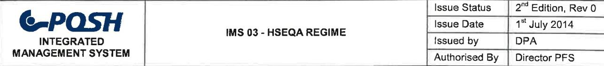

#### 9.7 Temporary Changes

A temporary change is one that is intended to exist for a short and predetermined period of time. It is recognised that temporary changes, the duration of which could span several days or weeks, may be required. Where these are necessary, the time-frame for which a temporary change remains valid shall be specified as part of the risk assessment and must be documented on the MOC Plan and be communicated to everyone involved. The maximum length of time permitted for a temporary change shall not exceed six months, or until the next dry dock period.

The time-frame definition on the MOC Plan shall also specify when the risk assessment must be re-validated to ensure it remains fit for purpose for the temporary change. This control over time-frame and risk review is important to avoid the temporary change inadvertently becoming a permanent one.

If a decision is reached that a temporary change should become permanent then the change must be re-evaluated and documented in accordance with this Procedure. Temporary changes must have a specified time limit to ensure they are returned to the original system condition or that further steps in managing the change are addressed (i.e., converting the temporary change into a permanent change).

All temporary changes must be reviewed before the expiry date to verify that:

- · The system was returned to its original condition, or ...
- · Conversion was initiated to make the temporary change a permanent part of the system (new MOC required), or ...
- · The period for validity of the temporary change was extended. Note : Extending the validity of temporary change should not routinely be allowed; only in exceptional circumstances. Such an extension requires careful consideration and documentation in the MOC form, which includes as a minimum, re-validating the impact or risk assessment, and proper approvals.

{126}------------------------------------------------

# Temporary Change Flowchart

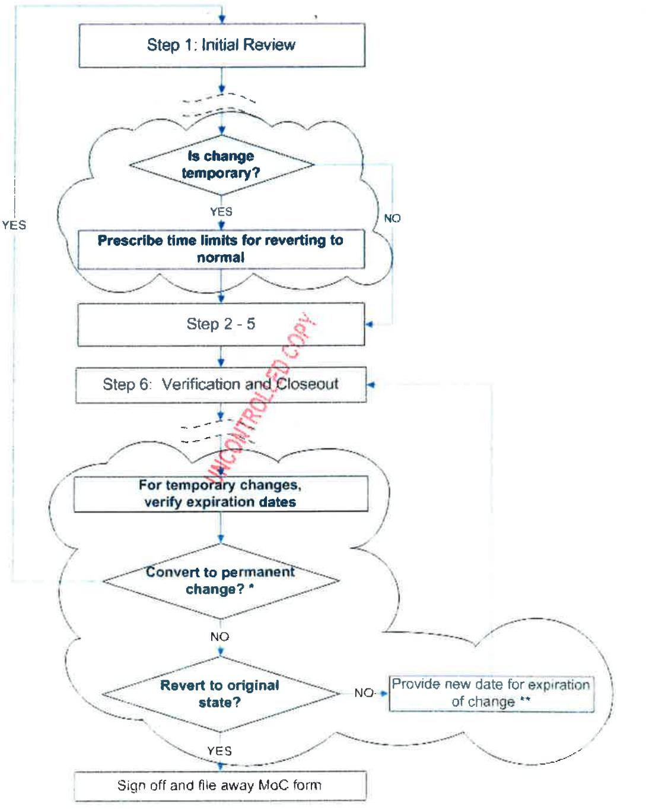

{127}------------------------------------------------

|     | IMS 03 - HSEQA REGIME | Issue Status  | 2nd Edition, Rev 0 |
| --- | --------------------- | ------------- | ------------------ |
|     |                       | Issue Date    | 1st July 2014      |
|     |                       | Issued by     | DPA                |
|     |                       | Authorised By | Director PFS       |

9.8 Emergency Changes: Where change is required in emergency situations, the person-in-charge for the area concerned must ensure that risks associated with the emergency change are assessed and that authorisation to make the emergency change is obtained. Change requests which need to be implemented within 24 hrs shall be categorised as emergency change. During emergency change request, the review should include as much of the normal process as possible. Later on, the complete change process shall be completed as soon as possible.

An emergency change is a change that must be performed in a true emergency. Generally, the situation is such that action is required quickly, and the persons required to provide approvals may not be available to meet the requirements of the written MOC process. In these "emergency" situations, safety could be jeopardized by waiting for completion of the formal MOC process. In an emergency situation, the change should be reviewed to the best of the staff's abilities. This emergency MOC process should involve a risk assessment using any and all available resources and time to evaluate the risks involved with the change and it may be verbal, rather than written (however where possible a record should be maintained- log or email). The focus should be on the immediate risks only. The verbal implementation plan should also be developed and carried out by relevant personnel, with approval from the highest ranking personnel available with domain expertise.

At first opportunity after the emergency has been controlled, the change must be fully evaluated and documented using the MOC procedure. The reviews will dictate if the change should be:

- · Reversed to continue operations as in the pre-emergency status or
- · Converted to a temporary or permanent change.

Bearing in mind the limited time and resources in the midst of an emergency, the output from the retrospective MOC process review can also propose a different change to address the problems that caused or resulted from the emergency.

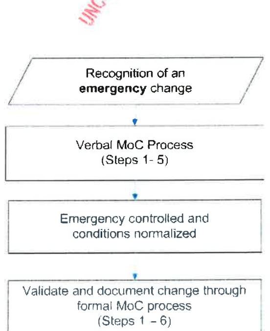

{128}------------------------------------------------

#### 10 BEHAVIOUR BASED SAFETY (BBS)

- 10.1 BBS (sometimes referred to in the Offshore Industry as Unsafe Acts) relates to the behaviour of people and is an observation and intervention process intended for all individuals to visibly and personally demonstrate care and concern for the safety of others. All observed unsafe acts (at , risk behaviours) and unsafe conditions are addressed and corrected immediately.
- 10.2 If a person (observer) notices somebody (observed person or "OP") doing something unsafe or working in an unsafe way, then the observer should immediately advise the OP to stop what they are doing, in order to prevent an accident or incident. The observer should then explain to the OP why it was an unsafe practice and suggest a better and/or safer way of working or carrying out the task. The OP should then record the intervention on a BBS Observation Card.
- 10.3 BBS is not intended to blame or victimise personnel for unsafe acts, hence there is no requirement to name names (NO NAME, NO BLAME). On the contrary, it is intended encourage all to look out for one another's safety and promote open reporting of unsafe acts so that everyone will benefit from the lessons learned.
- 10.4 Personnel are encouraged to submit at least one BBS observation per month using the form provided in Appendix K. The BBS observation must be genuine and reflect real occurrences onboard. A seemingly large number of BBS observations should not be thought of as a bad reflection upon the safety culture onboard the vessel. On the contrary, it reflects the safety consciousness onboard and shows that safety matters are being effectively addressed.
- 10.5 During the monthly shipboard HSE meeting, the HSE Chairman will discuss all the BBS observations and review the content. He will also use this opportunity to encourage a positive safety culture onboard. The summary of BBS observations is to be submitted to the HSEQA Dept along with the Minutes of the Shipboard HSE Meeting.

# 11 HAZARDOUS OBSERVATIONS (HAZOBS)

- 11.1 Hazardous Observations (HAZOBS sometimes referred to in the Offshore Industry as "Unsafe Conditions") relates to the condition of the ship itself and/or its equipment and is a system for the reporting of unsafe conditions related directly to safety.
- 11.2 As with BBS, personnel are encouraged to immediately report any HAZOB to the Master or Chief Engineer who will, at the end of the month, summarise and report them to the HSEQA Dept., as well as raise a defect to the appropriate Technical Superintendent.
- 11.3 I It should be borne in mind that the HAZOBS system is not intended for reporting technical defects onboard the vessel, unless the defect directly affects the safety of personnel onboard. Non safety related defects are to be reported using a Defect Form (refer to Company PMS) to the vessel's Technical Superintendent for rectification, and summarised in the ship's monthly HSE Report.

#### SAFETY STATISTICS & TRENDING 12

- 12.1 The HSEQA Dept records, analyses, and tracks all reported NCR's, accidentlincident & near misses, BBS Observations and HAZOBS in order to ensure continuous tracking and timely feedback between the Company and the vessels. Appropriate recommendations and follow up actions can be effectively implemented in an effort to continuously improve upon the Safe Operating of the Company Fleet.
- 12.2 Vessel Masters are also required to monitor NCR's, accidentlincident & near misses, BBS Observations and HAZOBS to ensure corrective action taken is effective and measures are implemented to prevent recurrence.
- 12.3 The records are consolidated on a monthly basis by the HSEQA Department and are discussed during the monthly Fleet HSE meeting. Important or significant findings are addressed with

{129}------------------------------------------------

| Image: C-SR MARINE INTEGRATED MANAGEMENT SYSTEM | IMS 03 - HSEQA REGIME | Issue Status  | 2nd Edition, Rev 0 |
| ----------------------------------------------------- | --------------------- | ------------- | ------------------ |
|                                                       |                       | Issue Date    | 1st July 2014      |
|                                                       |                       | Issued by     | DPA                |
|                                                       |                       | Authorised By | Director PFS       |

conclusions and recommendations/requirements disseminated to the Fleet via the minutes of the meeting.

12.4 Using the records, comparisons may be made on a month-by-month, bi-annual and year-to-date basis in order to analyse trends and highlight improvements or deficiencies.

#### 13 HSE PLAN AND BRIDGING DOCUMENT

- 13.1 This HSE Bridging Document is an interface document specifically developed to define the processes to be adopted and implemented by SR MARINE in controlling and safely managing an operation in line with charterer's objectives and expectations. The document defines the relationship between SR MARINE and Charterer in executing the scope of work in the operational area as defined in the scope of work.
- 13.2 Additionally, the HSE Bridging Document is developed to assist in identifying and managing the operational hazards/risks and put in place the necessary controls and/or safeguards for the parties / work group interfaces, thereby ensuring that the operational aspects of the work are not HSE compromised through minimising the impact of an incident.
- 13.3 The aim of this HSE Bridging Document is to convey emergency incident communication and response guidelines, in order to ensure that safe and reliable performance requirements are met. The HSE Bridging Document bridges the Charter's documents covering the handling of incidents and the SR MARINE HSEQ Integrated Management System (IMS) and other documents as developed and implemented by SR MARINE

The purposes prescribed herein are as follows:

- · To enable achievement of the highest possible standards in the areas of health, safety and environment management and compliance;
- To ensure that key responsibilities are clearly defined and understood;
- To ensure that all communication links are clearly defined and understood;
- To ensure that emergency response plans have been established and are understood by all parties;
- To ensure that all personnel are fully aware of the HSE requirements for any given situation and that they are clearly defined, understood, implemented and followed.
- 13.4 The HSE plan identifies the existing policies, plans and procedures already in place to cover HSE objectives by SR MARINE. It also identifies HSE issues that have been addressed previously as well as the HSE issues addressed in the current charterer and during the actual execution of the project. This plan should be used in conjunction with the SR MARINE HSEQ Integrated Management System (IMS) Manual.

#### 14 HSE MONITORING PLAN

The company has developed a HSE monitoring plan, which indentifies various aspects of company HSE management. The HSE monitoring plan, is maintained, monitored and tracked by HSE Department for its effective implementation.

{130}------------------------------------------------

S

{131}------------------------------------------------

|         |                               |                                              |     |               |     |                                                  |     |                                                 | Issue Status  | 2nd Edition, Rev 0 |     |
| ------- | ----------------------------- | -------------------------------------------- | --- | ------------- | --- | ------------------------------------------------ | --- | ----------------------------------------------- | ------------- | ------------------ | --- |
|         |                               | SR MARINE INTEGRATED MANAGEMENT SYSTEM |     |               |     | IMS 03 - APPENDIX A RISK ASSESSMENT WORKSHEET |     |                                                 | Issue Date    | 1st July 2014      |     |
|         |                               |                                              |     |               |     |                                                  |     |                                                 | Issued by     | DPA                |     |
|         |                               |                                              |     |               |     |                                                  |     |                                                 | Authorised By | Director PFS       |     |
| Vessel: |                               | Date:                                        |     | In Charge:    |     | Tool Box Talk Ref no:                            |     | PTW Ref no:                                     |               | RA Ref: RA/xx/yyyy |     |
|         | Location/Operation/Process:   |                                              |     | Team Members: |     |                                                  |     | PPE:                                            |               |                    |     |
|         | Prepared by (Name/Rank/Sign): |                                              |     |               |     |                                                  |     | Verified by Office or Master or CE (Name/Sign): |               |                    |     |

| No. | Activity | Hazard/ Aspect | Potential Consequence / Impact | Existing Control Measures | Initial Risk | Additional Control Measures | Residual Risk | Responsible Staff |
| --- | -------- | -------------- | --------------------------------- | ------------------------- | ------------ | --------------------------- | ---------------- | -------------------- |
| 1   |          |                |                                   |                           |              |                             |                  |                      |
| 2   |          |                |                                   |                           |              |                             |                  |                      |
| 3   |          |                |                                   |                           |              |                             |                  |                      |
| 4   |          |                |                                   |                           |              |                             |                  |                      |

UNCONTROLLED COPY15-25: High Risk

C: Charter Impact

E: Environmental

O: Operational

H: Health & Safety

1-4: Low Risk

5-12: Medium Risk

{132}------------------------------------------------

|                                                                                    |                                                                                                                                                       |                                                                                                                                                                                                                                                                                      | IMS 03 - APPENDIX A1 RISK ASSESSMENT MATRIX                             |                                                                        |                                        | Issue Status                   |                                 | 2nd Edition, Rev 0                       |     |
| ---------------------------------------------------------------------------------- | ----------------------------------------------------------------------------------------------------------------------------------------------------- | ------------------------------------------------------------------------------------------------------------------------------------------------------------------------------------------------------------------------------------------------------------------------------------ | -------------------------------------------------------------------------- | ---------------------------------------------------------------------- | -------------------------------------- | ------------------------------ | ------------------------------- | ---------------------------------------- | --- |
|                                                                                    |                                                                                                                                                       |                                                                                                                                                                                                                                                                                      |                                                                            |                                                                        |                                        | Issue Date                     |                                 | 1st July 2014                            |     |
|                                                                                    |                                                                                                                                                       |                                                                                                                                                                                                                                                                                      |                                                                            |                                                                        |                                        | Issued by                      |                                 | DPA                                      |     |
|                                                                                    |                                                                                                                                                       |                                                                                                                                                                                                                                                                                      |                                                                            |                                                                        |                                        | Authorised By                  |                                 | Director PFS                             |     |
|                                                                                    |                                                                                                                                                       |                                                                                                                                                                                                                                                                                      |                                                                            |                                                                        |                                        |                                |                                 |                                          |     |
|                                                                                    |                                                                                                                                                       | SEVERITY / CONSEQUENCE                                                                                                                                                                                                                                                               |                                                                            |                                                                        |                                        | PROBABILITY                    |                                 |                                          |     |
| Health Safety Hygiene                                                        | Operations Asset Damage (Downtime/Repair)                                                                                                       | Environmental Pollution: Land/Air/Water/Noise Resource: Fuel/Water/Material                                                                                                                                                                                                    | Customer/ Charter/ Project Impact                                    | (1) Very Unlikely but possible under extreme circumstances | (2) Unlikely but could happen | (3) Possible but unusual | (4) Likely not surprising | (5) Very Likely almost no doubt |     |
| (1) Slight Mild sickness Injury requiring First aid                       | (1) Slight Impact to own vessel / facility/ resources                                                                                           | (1)Slight Pollution contained with no external response required                                                                                                                                                                                                               | (1) Slight Less than 1 day time loss                                 |                                                                        |                                        |                                |                                 | 5b                                       |     |
| (2) Minor Sickness or Injury requiring Med treatment ( No LTI / RWC)   | (2) Minor Impact to own vessel/ facility/resources / other asset.                                                                            | (2) Minor Pollution not fully contained with no external response required Minor Resource depletion/waste Negligible harm to environment                                                                                                                                 | (2) Minor More than 1 day but less than 1 week loss of time       |                                                                        |                                        | 6b                             | 8b                              | 10b                                      |     |
| (3)Medium Severe Sickness or Injury requiring Hospitalisation (LTI) | (3) Medium Significant Impact to own vessel/ facility/ resources / other asset. Requiring future repairs                                  | (3) Medium Pollution not contained and requires external response Medium resource depletion/waste Short term environmental impact Possible media attention                                                                                                            | (3) Medium More than 1 week but less than 1 month loss of time    |                                                                        | 6a                                     | 9                              | 12b                             | 15b                                      |     |
| (4)High Severe Sickness Injury Disability (LTI)                     | (4) High Major damage to own vessel/ facility/ resources / other asset. Vessel Unseaworthy Requiring immediate repairs              | (4) High Pollution not contained and requires major response High resource depletion/waste Medium term environmental impact Major media attention                                                                                                                     | (4) High More than 1 month but less than 6 months loss of time |                                                                        |                                        | 8a                             | 12a                             | 16                                       | 20b |
| (5)Very High Life threatening Sickness Injury Fatality (LTI)        | (5) Very High Very extensive damage to own vessel/ facility/ resources /other asset. Vessel unseaworthy Requiring immediate repairs | (5) Very High Pollution spread extensively and requires multi tiered response Very High resource depletion/waste Long term environmental impact Major media attention and corporate impact                                                                         | (5) Very High 6 months or greater loss of time                    |                                                                        | 5a                                     | 10a                            | 15a                             | 20a                                      | 25  |
|                                                                                    | Low Risk                                                                                                                                              | May be acceptable; however, review hazards/controls to assess if risk can be reduced further.                                                                                                                                                                                        |                                                                            |                                                                        |                                        |                                |                                 |                                          |     |
| 5-12                                                                               | Medium Risk                                                                                                                                           | The job must not proceed until it has been redefined or additional control measures put in place to reduce risk to Low. The RA shall be sent to HSEQA/office for review/approval. On approval the job to be carried out under supervision of two senior officers.                 |                                                                            |                                                                        |                                        |                                |                                 |                                          |     |
| 15-25                                                                              | High Risk                                                                                                                                             | Stop Work! The job must not proceed until it has been redefined or additional control measures put in place to reduce risk to Medium or Low. The RA shall be sent to HSEQA/office for review/approval. On approval the job to be carried out under supervision of Master and C/E. |                                                                            |                                                                        |                                        |                                |                                 |                                          |     |
|                                                                                    |                                                                                                                                                       |                                                                                                                                                                                                                                                                                      |                                                                            |                                                                        |                                        |                                |                                 |                                          |     |

Page 1

{133}------------------------------------------------

# IMS 03 – APPENDIX B

TOOL BOX TALK

| Issue Status  | 2nd Edition, Rev 0 |
| ------------- | ------------------ |
| Issue Date    | 1st July 2014      |
| Issued by     | DPA                |
| Authorised By | Director PFS       |

A Toolbox Talk should be conducted prior to every task, whether it is routine or non routine.

| VESSEL :   |     | DATE:   |     | REF No:   |     |
| ---------- | --- | ------- | --- | --------- | --- |
| ---------- | --  | ------- | --  | --------- | --  |

|     | WORK ACTIVITY |     |     | WORK LOCATION(S) |     |
| --- | ------------- | --- | --- | ---------------- | --- |
| 1.  |               |     |     |                  |     |
| 2.  |               |     |     |                  |     |
| 3.  |               |     |     |                  |     |
| 4.  |               |     |     |                  |     |
| 5.  |               |     |     |                  |     |

PERSONS ATTENDING BRIEFING

| NAME/COMPANY | SIGN | NAME/COMPANY | SIGN |
| ------------ | ---- | ------------ | ---- |
|              |      |              |      |
|              |      |              |      |
|              |      |              |      |
|              |      |              |      |
|              |      |              |      |
|              |      |              |      |
|              |      |              |      |

| PPE:   |     |
| ------ | --- |
| ------ | --  |

Tools and Equipments to be used:

Hazards identified and preventive actions discussed:

Any recent circular or safety alert on similar issues to be highlighted:

| Risk Assessment (if any) Ref no: |     |
| -------------------------------- | --- |
| Permit To Work (if any) Ref no:  |     |
| Additional Remark:               |     |

| Prepared by: Name & Signature:   |     | Verified by: Master/Chief Engineer:   |
| ----------------------------------- | --- | ---------------------------------------- |
| ----------------------------------- | --  | ---------------------------------------- |

{134}------------------------------------------------

# IMS 03 - APPENDIX C HOT WORK PERMIT

Issue Status 2nd Edition, Rev 0 Issue Date 1st July 2014 DPA Issued by Authorised By Director PFS

|     | Any work involving the use of Welding equipment, Flame Cutting/Welding/Brazing equipment, Abrasive Grinders/Cutters/Brushes, Drilling equipment or any other equipment which uses open flames or generates heat or sparks that could be a source of ignition. | Ref no: KYYYYY                                                                                                                                                                     |            |           |            |     |     |
| --- | ---------------------------------------------------------------------------------------------------------------------------------------------------------------------------------------------------------------------------------------------------------------- | ---------------------------------------------------------------------------------------------------------------------------------------------------------------------------------- | ---------- | --------- | ---------- | --- | --- |
|     | Hot Work Location :                                                                                                                                                                                                                                              | Permit Validity (Max. 12 hours) :                                                                                                                                                  |            |           |            |     |     |
|     | PPE Required for this job :                                                                                                                                                                                                                                      | From (Date) : ********\_******** To ********\_********                                                                                                                             |            |           |            |     |     |
|     |                                                                                                                                                                                                                                                                  | From (Time) : ********\_******** To ********\_********                                                                                                                             |            |           |            |     |     |
|     | Hot Work Description :                                                                                                                                                                                                                                           | 1. If there is any change in conditions or in the hot work itself, stop hot work & issue a new Permit. 2. Issue a new Permit if hot work is stopped for more than six hours. |            |           |            |     |     |
|     | Person In Charge (Print & Sign):                                                                                                                                                                                                                                 | Personnel detailed to carry out the hot work :                                                                                                                                     |            |           |            |     |     |
|     | <b>HOT WORK PRECAUTIONS</b>                                                                                                                                                                                                                                      |                                                                                                                                                                                    | <b>Yes</b> | <b>No</b> | <b>NA</b>  |     |     |
| 1.  | A Tool Box Talk and Risk assessment must be carried out and insert reference no. Toolbox ref no:                                                                                                                                                                 |                                                                                                                                                                                    |            |           | RA ref no: |     |     |
| 2.  | Is hot work necessary to achieve the task?                                                                                                                                                                                                                       |                                                                                                                                                                                    |            |           |            |     |     |
| 3.  | Hot work will not take place during ballasting, tank cleaning, venting or bunker operations.                                                                                                                                                                     |                                                                                                                                                                                    |            |           |            |     |     |
| 4.  | Will vessel still have full fire fighting capability while hot work is in progress?                                                                                                                                                                              |                                                                                                                                                                                    |            |           |            |     |     |
| 5.  | Have Bridge and Engine room Watch keepers been notified when hot work is to begin?                                                                                                                                                                               |                                                                                                                                                                                    |            |           |            |     |     |
| 6.  | Has approval been given by adjacent Terminal, Installation, Facility, Port/Govt. Authority?                                                                                                                                                                      |                                                                                                                                                                                    |            |           |            |     |     |
| 7.  | Have all other personnel that may be affected by the hot work been informed?                                                                                                                                                                                     |                                                                                                                                                                                    |            |           |            |     |     |
| 8.  | Has atmosphere in space where hot work is to be done been tested free of flammable vapours?                                                                                                                                                                      |                                                                                                                                                                                    |            |           |            |     |     |
| 9.  | Has atmosphere in space where hot work is to be done has been tested Safe for Workers (20.8% Oxygen)?                                                                                                                                                            |                                                                                                                                                                                    |            |           |            |     |     |
| 10. | Is the space where hot work is to be done adequately ventilated?                                                                                                                                                                                                 |                                                                                                                                                                                    |            |           |            |     |     |
| 11. | Have objects on which hot work is to be done been cleared of all flammable material?                                                                                                                                                                             |                                                                                                                                                                                    |            |           |            |     |     |
| 12. | Have surrounding and adjacent areas been cleared of all flammable material?                                                                                                                                                                                      |                                                                                                                                                                                    |            |           |            |     |     |
| 13. | Is safety equipment, machinery and surrounding areas protected from heat damage?                                                                                                                                                                                 |                                                                                                                                                                                    |            |           |            |     |     |
| 14. | Is work shielded to contain sparks?                                                                                                                                                                                                                              |                                                                                                                                                                                    |            |           |            |     |     |
| 15. | Is Hydraulic or other piping containing combustible liquid depressurised and isolated? LOTO ref no:                                                                                                                                                              |                                                                                                                                                                                    |            |           |            |     |     |
| 16. | Is equipment to be used to do the job inspected / tested and found to be in good working condition?                                                                                                                                                              |                                                                                                                                                                                    |            |           |            |     |     |
| 17. | Is the Fire pump running with fire hoses lead out and connected hydrants and ready for use?                                                                                                                                                                      |                                                                                                                                                                                    |            |           |            |     |     |
| 18. | Is the hot work one metre or more away from direct heat transfer to pipes or tanks containing bunkers, lube oil, hydraulic oil or other flammable or combustible liquid?                                                                                      |                                                                                                                                                                                    |            |           |            |     |     |
| 19. | Is a Fire watch established on site and, if on a bulkhead, also in the adjacent space with adequate fire fighting equipment laid out ready for use?                                                                                                              |                                                                                                                                                                                    |            |           |            |     |     |
| 20. | Are there no flammable or hazardous materials (e.g., paint, cleaning solvent, etc.) in use in the hot work space(s) or within three metres of the hot work sites on open deck areas?                                                                             |                                                                                                                                                                                    |            |           |            |     |     |
| 21. | Has Charterer / Operations Manager / Technical Superintendent been informed of the hot work?                                                                                                                                                                     |                                                                                                                                                                                    |            |           |            |     |     |
| 22. | Is head office approval required for this work to be carried out? If (√) Y, attach approval.                                                                                                                                                                     |                                                                                                                                                                                    |            |           |            |     |     |
| 23. | Is the person in charge in attendance throughout the hot work?                                                                                                                                                                                                   |                                                                                                                                                                                    |            |           |            |     |     |
|     | If any of the above have been checked (√) N, explain why :                                                                                                                                                                                                       |                                                                                                                                                                                    |            |           |            |     |     |
|     | <b>PERSON RESPONSIBLE FOR SAFETY</b>                                                                                                                                                                                                                             | <b>MASTER</b>                                                                                                                                                                      |            |           |            |     |     |
|     | Name/Rank/Sign/Date                                                                                                                                                                                                                                              | Name/Rank/Sign/Date                                                                                                                                                                |            |           |            |     |     |
|     | <b>JOB COMPLETION</b>                                                                                                                                                                                                                                            |                                                                                                                                                                                    |            |           |            |     |     |
|     | Confirm work is finished and all persons, materials & equipment removed & worksite returned to normal. Any equipment that has been isolated (particularly fire fighting/detection equipment) has been reinstated.                                             |                                                                                                                                                                                    |            |           |            |     |     |
|     | Name/Rank/Sign/Date                                                                                                                                                                                                                                              | Name/Rank/Sign/Date                                                                                                                                                                |            |           |            |     |     |

{135}------------------------------------------------

| C-SR MARINE       | IMS 03 - APPENDIX D         |     |
| ----------------- | --------------------------- | --- |
| INTEGRATED        | ENCLOSED SPACE ENTRY PERMIT |     |
| MANAGEMENT SYSTEM |                             |     |

| Issue Status  | 2nd Edition, Rev 0 |
| ------------- | ------------------ |
| Issue Date    | 1st July 2014      |
| Issued by     | DPA                |
| Authorised By | Director PFS       |

This permit is to be issued for filt any enclosed space (e.g. tanks, void sqaces, holde et). friver is anv change in onditions of failurs of failurs, issue a new Permit.

| Vessel Name:                                  |                  |     |     |       |
| --------------------------------------------- | ---------------- | --- | --- | ----- |
| Location/Name of Enclosed Space:              |                  |     |     |       |
| Purpose/Reason for Entry:                     |                  |     |     |       |
| This Permit is valid 2 (Max 8 hrs) |                  |     |     |       |
|                                               | Ref No(No/Year): |     |     |       |
| From:                                         | hrs Date:        | To: | hrs | Date: |

|                                    | (To be checked by the Master or Competent Person)                                                                                                                                                                 |           |
| ---------------------------------- | ----------------------------------------------------------------------------------------------------------------------------------------------------------------------------------------------------------------- | --------- |
| Section 1 - Pre Entry Preparations |                                                                                                                                                                                                                   |           |
| No                                 | Description                                                                                                                                                                                                       | Yes/No/NA |
| 1                                  | Has Tool box talk and Risk Assessment been carried out for the entry and work to be carried out?(Ref No                                                                                                           |           |
| 2                                  | Has space been segregated by blanking off or isolating all connecting pipelines & valves (LOTO Ref No.                                                                                                            |           |
| 3                                  | Has the space been cleaned? (If applicable)                                                                                                                                                                       |           |
| 4                                  | Has the space been thoroughly ventilated?                                                                                                                                                                         |           |
| 5                                  | Pre entry atmosphere tests 4 &amp; 5 . Oxygen: %vol (20-21%) 9 Hydrocarbon: %LEL(<1%) H2S: ppm (<5 ppm) CO: ppm(<25 ppm) Other Gases:                                        |           |
| 6                                  | Have arrangements been made for frequent atmosphere checks to be made while the space is occupied and after work breaks?( 30 min or less)                                                                         |           |
| 7                                  | Have arrangements been made for the space to be continuously ventilated throughout the period of occupation and during work breaks?                                                                               |           |
| 8                                  | Are access/entry point and illumination adequate?                                                                                                                                                                 |           |
| 9                                  | Is first aid, rescue and resuscitation equipment available for immediate use by the entrance space?                                                                                                               |           |
| 10                                 | Has an Attendant been designated to stand by the entrance to the space?                                                                                                                                           |           |
| 11                                 | Officer of the Watch (bridge, engine room) advised of the planned Entry?                                                                                                                                          |           |
| 12                                 | Has a system of communication between the person at the entrance (Attendant) and those entering the space been agreed & tested? What is the agreed interval of reporting?( not more than 15 minutes) Interval: |           |
| 13                                 | Has atmosphere monitoring equipment been tested and calibrated                                                                                                                                                    |           |
| 14                                 | Are emergency and evacuation procedures established and understood?                                                                                                                                               |           |
| 15                                 | Is there a system for recording who is in the space?                                                                                                                                                              |           |
| 16                                 | Is all equipment to be used of approved type, in good working condition and inspected prior to entry?                                                                                                             |           |
| 17                                 | At least TWO personnel are detailed to carry out the enclosed space entry?                                                                                                                                        |           |
| 18                                 | Has environmental factor in enclosed space accounted for, i.e hot/cold/high humidity which may effect person working inside                                                                                       |           |
| 19                                 | Has health guidelines as per IMS procedures taken into account (IMS 03/Section 5.6)                                                                                                                               |           |
| 20                                 | Have staff being briefed on ladder safety procedures while climbing up and down the ladder                                                                                                                        |           |
| 21                                 | Head Office permission shall be taken for all enclosed space entry, attach entry permission email                                                                                                                 |           |

|     | Section 2 - Pre-Entry Checks (To be completed by the team leader & persons entering the enclosed space)                                |           |      |      |     |             |           |      |        |
| --- | -------------------------------------------------------------------------------------------------------------------------------------- | --------- | ---- | ---- | --- | ----------- | --------- | ---- | ------ |
| No  | Description                                                                                                                            |           |      |      |     |             |           |      | Yes/No |
| 1   | I have received instructions or permission from the master or nominated responsible person to enter the enclosed space                 |           |      |      |     |             |           |      |        |
| 2   | Section 1 of this permit has been completely filled?                                                                                   |           |      |      |     |             |           |      |        |
| 3   | I am aware the space must be vacated immediately in the event of ventilation failure or if atmosphere tests change from safe criteria? |           |      |      |     |             |           |      |        |
| 4   | I have agreed the communication procedure, reporting interval, emergency and evacuation procedures                                     |           |      |      |     |             |           |      |        |
| 5   | Confirmation from all persons entering the enclosed space                                                                              |           |      |      |     |             |           |      |        |
|     | Name & Rank                                                                                                                            | Signature | Date | Time |     | Name & Rank | Signature | Date | Time   |
| 1   |                                                                                                                                        |           |      |      | 5   |             |           |      |        |
| 2   |                                                                                                                                        |           |      |      | 6   |             |           |      |        |
| 3   |                                                                                                                                        |           |      |      | 7   |             |           |      |        |
| 4   |                                                                                                                                        |           |      |      | 8   |             |           |      |        |

| To be signed by: (after completion of section 1 and 2) | Name / Rank | Signature | Date | Time |
| --------------------------------------------------------- | ----------- | --------- | ---- | ---- |
| Responsible Person (or Master)                            |             |           |      |      |
| Authorised Team Leader¹                                   |             |           |      |      |
| Attendant Supervising Entry ¹ 1,7              |             |           |      |      |
| C/O or CE or Competent person                             |             |           |      |      |

{136}------------------------------------------------

Section 3 - Record of Personnel Entering Enclosed

(Authorized team leader is to be marked with circle i.e. "O" on the serial number below)

|     | Name & Rank | Time IN | Time OUT |     | Name & Rank | Time IN | Time OUT |
| --- | ----------- | ------- | -------- | --- | ----------- | ------- | -------- |
| 1   |             |         |          | 9   |             |         |          |
| 2   |             |         |          | 10  |             |         |          |
| 3   |             |         |          | 11  |             |         |          |
| 4   |             |         |          | 12  |             |         |          |
| 5   |             |         |          | 13  |             |         |          |
| 6   |             |         |          | 14  |             |         |          |
| 7   |             |         |          | 15  |             |         |          |
| 8   |             |         |          | 16  |             |         |          |

# Section 4 - Periodical Record®

(Every 30 min or less, check and record Oxygen (O2) contents [Vcl. %], Hydrocarbon (HC) contents [LEL %] and Toxic Gas . Test shall also be done prior entering again after a break

| Time | 02 (Vol %) | HC (LEL %) | Toxic Gas 6 |     |                 |                                                                                                                                                                                | o         | HC                                                 | Toxic Gas 6                                                                                                                                                                    |                                          |                                                                                                                                                                                |     |
| ---- | ------------- | ------------- | ----------- | --- | --------------- | ------------------------------------------------------------------------------------------------------------------------------------------------------------------------------ | --------- | -------------------------------------------------- | ------------------------------------------------------------------------------------------------------------------------------------------------------------------------------ | ---------------------------------------- | ------------------------------------------------------------------------------------------------------------------------------------------------------------------------------ | --- |
|      |               |               | H2S         | CO  |                 | Time                                                                                                                                                                           | (Vol %)   | (LEL %)                                            |                                                                                                                                                                                | H2S CO CO                                |                                                                                                                                                                                |     |
|      |               |               |             |     |                 |                                                                                                                                                                                |           |                                                    |                                                                                                                                                                                |                                          |                                                                                                                                                                                |     |
|      |               |               |             |     |                 |                                                                                                                                                                                |           | A market the state of the results of the county of |                                                                                                                                                                                |                                          |                                                                                                                                                                                |     |
|      |               |               |             |     |                 | ------------------------------------------------------------------------------------------------------------------------------------------------------------------------------ |           |                                                    |                                                                                                                                                                                |                                          |                                                                                                                                                                                |     |
|      |               |               |             |     |                 |                                                                                                                                                                                |           |                                                    |                                                                                                                                                                                |                                          |                                                                                                                                                                                |     |
|      | 10-10         |               |             |     | ﺍﻟﻤﺴﺘﻮﻯ ﺍﻟﻤﺴﺎﺣﺔ |                                                                                                                                                                                | 0.0 10000 |                                                    | ------------------------------------------------------------------------------------------------------------------------------------------------------------------------------ |                                          |                                                                                                                                                                                |     |
|      |               |               |             |     |                 |                                                                                                                                                                                |           | i                                                  |                                                                                                                                                                                | - Recommend By Frances Books Books Books | ------------------------------------------------------------------------------------------------------------------------------------------------------------------------------ |     |
|      |               |               |             |     |                 |                                                                                                                                                                                |           |                                                    |                                                                                                                                                                                |                                          |                                                                                                                                                                                |     |
|      |               |               |             |     |                 |                                                                                                                                                                                |           |                                                    |                                                                                                                                                                                |                                          |                                                                                                                                                                                |     |
|      |               | -             |             |     |                 | ------------------------------------------------------------------------------------------------------------------------------------------------------------------------------ |           |                                                    |                                                                                                                                                                                |                                          |                                                                                                                                                                                |     |
| ri   |               |               |             |     |                 |                                                                                                                                                                                |           |                                                    |                                                                                                                                                                                |                                          |                                                                                                                                                                                |     |
|      |               |               |             |     |                 |                                                                                                                                                                                |           |                                                    |                                                                                                                                                                                |                                          |                                                                                                                                                                                |     |

| Section 5 - Completion and withdrawal of permit7 The work has been completed and all persons have evacuated the Enclosed Space. The Enclosed space has been secured and permit has been withdrawn. |             |           |      |      |
| ----------------------------------------------------------------------------------------------------------------------------------------------------------------------------------------------------- | ----------- | --------- | ---- | ---- |
| To be signed by:                                                                                                                                                                                      | Name / Rank | Signature | Date | Time |
| Responsible Person (or Master)                                                                                                                                                                        |             |           |      |      |
| Authorised Team Leader1                                                                                                                                                                               |             |           |      |      |
| Attendant Supervising Entry1,7                                                                                                                                                                        |             |           |      |      |
| C/O or CE or Competent person                                                                                                                                                                         |             |           |      |      |

# THIS PERMIT IS RENDERED INVALID SHOULD VENTILATION OF THE SPACE STOP OR IF ANY OF THE CONDITIONS NOTED IN THIS PERMIT CHANGE

#### Notes:

- 1 Attendant supervising entry shall not be part of team entering enclosed space.
- 2 The Entry permit shall contain a clear indication as to its maximum period of validity which, in any event, shall not exceed 08 hrs.
- 3 After any internuption or break in the work, before allowing any person to enter the enclosed space, the test of atmosphere shall be carried out as persedion 1 of the permi
- 4 In order to obtain a representative cross-section of the samples should be taken from several depths and through as many openings as possible, Ventilation should be stopped for about 10 minutes before the pre-entry atmosphere tests are taken.
- 5 Measurement and record of O2, HC and toxic gas shall be conducted every 30 min or less.
- 6 Frequency of test for specific toxic contanine, hydrogen sulphide, caron monoride etc, shall be determined depending on the nature, concentration etc. (ef. MSDS) of the previous contents of the space. Additional sheet for Section 4 shall be attached, if required.
- 7 The Attendant supervising entry or duy officer or duy engineer shall maintan a running record of the enclosed space and shall verify that all the persons have vacaled the space before calling of the job of enclosed space. Only personnel listed in section-2 of this permit are authorised to enter the enclosed space.
- 8 All persons entering the space should sign. Authorised Team Leader should also affix signature if entering space
- 9 Oxygen should be between 20% to 21% by volume (steady reading)

{137}------------------------------------------------

# IMS 03 - APPENDIX E

ELECTRICAL WORK PERMIT

| Issue Status  | 2nd Edition, Rev 0 |
| ------------- | ------------------ |
| Issue Date    | 1st July 2014      |
| Issued by     | DPA                |
| Authorised By | Director PFS       |

.

| Maintenance work on any item of electrical equipment (subject to C/E or 2/E discretion) or electrically powered system | Ref No:                                                                                                              |
| ---------------------------------------------------------------------------------------------------------------------- | -------------------------------------------------------------------------------------------------------------------- |
| Work Location:                                                                                                         |                                                                                                                      |
| Permit Validity (Max. 12 hours):                                                                                       |                                                                                                                      |
| From (Date):                                                                                                           | To                                                                                                                   |
| From (Time):                                                                                                           | To                                                                                                                   |
| Reason for electrical work:                                                                                            | 1. If there is any change in conditions or in the electrical work itself, stop electrical work & issue a new Permit. |
| PPE Required for this job:                                                                                             | 2. Issue a new Permit if electrical work is stopped for more than six hours.                                         |
| Person In Charge (Print & Sign):                                                                                       | Personnel detailed to carry out the electrical work :                                                                |

ELECTRICAL WORK PRECAUTIONS

| 1. A Tool Box Talk and Risk assessment must be carried out and insert reference no. Tool box ref no:  | RA ref no: |
| ----------------------------------------------------------------------------------------------------- | ---------- |
| 2. Does the electrical work to be done have other safety implications? (example : need to go up mast) | Y N NA     |
| 3. Has the Master and/or the Chief Engineer and other relevant personnel been informed?               | Y N NA     |
| 4. Have Bridge & Engine room Watch keepers been notified?                                             | Y N NA     |
| 5. Will the shutting down of the electrical equipment affect other equipment/operations/activities?   | Y N NA     |
| 6. Has the electrical equipment/system to be worked on been electrically isolated?                    | Y N NA     |
| 7. Is it ensured that the electrical equipment/system cannot possibly be switched on accidentally?    | Y N NA     |
| 8. Is the electrical equipment/system to be worked on locked out / tagged out? LOTO ref no:           | Y N NA     |
| 9. Is the electrical equipment/system electrically de-energised, including batteries/capacitors etc.? | Y N NA     |
| 10. Has other related equipment been depressurised (example: Electric Compressors, Pumps, etc.)?      | Y N NA     |
| 11. If appropriate, has the working location been barricaded?                                         | Y N NA     |
| 12. Are Emergency Procedures clearly understood by all personnel involved?                            | Y N NA     |
| 13. Is Emergency Equipment available if appropriate?                                                  | Y N NA     |
| 14. Is all equipment to be used approved type, inspected & tested & found to be in good condition?    | Y N NA     |
| 15. If the worksite is to be left unattended, is there a warning sign available?                      | Y N NA     |
| 16. Is the working area clear of obstructions with safe access?                                       | Y N NA     |
| 17. Is head office approval required for this work to be carried out? If (v) Y, attach approval.      | Y N NA     |
| 18. Is the person in charge in attendance?                                                            | Y N NA     |
| If any of the above have been checked (V) N, explain why:                                             |            |

PERSON RESPONSIBLE FOR SAFETY

MASTER/Chief engineer

| Name   | Sign   | Date   | Name   | Sign   | Date   |
| ------ | ------ | ------ | ------ | ------ | ------ |
| ------ | ------ | ------ | ------ | ------ | ------ |

JOB COMPLETION

The work is completed, all persons, materials & equipment removed & worksite returned to normal

Any equipment that has been isolated (particularly fire fighting / fire detection equipment) must be immediately reinstated on job completion

| Name   | Sign   | Date   | Name   | Sign   | Date   |
| ------ | ------ | ------ | ------ | ------ | ------ |
| ------ | ------ | ------ | ------ | ------ | ------ |

{138}------------------------------------------------

# IMS 03 - APPENDIX F HEIGHT / OVERSIDE WORK PERMIT

| Issue Status  | 2nd Edition, Rev 0 |
| ------------- | ------------------ |
| Issue Date    | 1st July 2014      |
| Issued by     | DPA                |
| Authorised By | Director PFS       |

| Working at Heights : Any type of work more than 2 metres above the deck Overside work : Any type of above water work outboard of the ship's side                                                                                              |                                                                                                                          |      |               |      |      |            |     |     | Ref no: |
| ------------------------------------------------------------------------------------------------------------------------------------------------------------------------------------------------------------------------------------------------ | ------------------------------------------------------------------------------------------------------------------------ | ---- | ------------- | ---- | ---- | ---------- | --- | --- | ------- |
| Work Location :                                                                                                                                                                                                                                  | Permit Validity (Max. 12 hours) :                                                                                        |      |               |      |      |            |     |     |         |
|                                                                                                                                                                                                                                                  |                                                                                                                          |      | From (Date) : |      | To   |            |     |     |         |
|                                                                                                                                                                                                                                                  |                                                                                                                          |      | From (Time) : |      | To   |            |     |     |         |
| Reason for work :                                                                                                                                                                                                                                | 1. If there is any change in conditions or in the work itself, stop work & issue a new Permit.                           |      |               |      |      |            |     |     |         |
| PPE Required for this job :                                                                                                                                                                                                                      | 2. Issue a new Permit if work is stopped for more than six hours.                                                        |      |               |      |      |            |     |     |         |
| Person In Charge (Print & Sign):                                                                                                                                                                                                                 | Personnel detailed to carry out the work :                                                                               |      |               |      |      |            |     |     |         |
| WORKING AT HEIGHTS / OVERSIDE WORK PRECAUTIONS                                                                                                                                                                                                   |                                                                                                                          |      |               |      |      |            |     |     |         |
|                                                                                                                                                                                                                                                  | 1. A Tool Box Talk and Risk assessment must be carried out and insert reference no. Tool box ref no:                     |      |               |      |      | RA ref no: |     |     |         |
|                                                                                                                                                                                                                                                  | 2. For this type of work a safety harness MUST be used                                                                   |      |               |      |      | Y          | N   | NA  |         |
|                                                                                                                                                                                                                                                  | 3. Is the safety harness of approved type, inspected & tested & found to be in good condition?                           |      |               |      |      | Y          | N   | NA  |         |
|                                                                                                                                                                                                                                                  | 4. Is the safety harness being properly worn by the user?                                                                |      |               |      |      | Y          | N   | NA  |         |
|                                                                                                                                                                                                                                                  | 5. Is there a suitable strongpoint to attach the safety harness line to?                                                 |      |               |      |      | Y          | N   | NA  |         |
|                                                                                                                                                                                                                                                  | 6. Does the work to be done have other safety implications (example: electrical work at masthead)?                       |      |               |      |      | Y          | N   | NA  |         |
|                                                                                                                                                                                                                                                  | 7. Are weather conditions suitable for doing the work (example: rain causing a ladder to be slippery)?                   |      |               |      |      | Y          | N   | NA  |         |
|                                                                                                                                                                                                                                                  | 8. Has the Master and/or the Chief Engineer and other relevant personnel been informed?                                  |      |               |      |      | Y          | N   | NA  |         |
| 9. Have Bridge and/or Engineroom Watchkeepers been notified?                                                                                                                                                                                     |                                                                                                                          |      |               |      |      | Y          | N   | NA  |         |
| 10. Will other equipment/operations/activities be affected?                                                                                                                                                                                      |                                                                                                                          |      |               |      |      | Y          | N   | NA  |         |
| 11. Is suitable equipment available as a working platform (examples : staging, ladders)?                                                                                                                                                         |                                                                                                                          |      |               |      |      | Y          | N   | NA  |         |
| 12. Is all equipment to be used approved type, inspected & tested & found to be in good condition?                                                                                                                                               |                                                                                                                          |      |               |      |      | Y          | N   | NA  |         |
| 13. Is the working platform equipment properly rigged and securely made fast?                                                                                                                                                                    |                                                                                                                          |      |               |      |      | Y          | N   | NA  |         |
| 14. Is the working area clear of obstructions with safe access?                                                                                                                                                                                  |                                                                                                                          |      |               |      |      | Y          | N   | NA  |         |
| 15. Do personnel have suitable equipment for carrying hand tools (example : tool pouch)?                                                                                                                                                         |                                                                                                                          |      |               |      |      | Y          | N   | NA  |         |
| 16. Personnel are not overloaded with equipment to carry?                                                                                                                                                                                        |                                                                                                                          |      |               |      |      | Y          | N   | NA  |         |
| 17. Is there an adequate and safe means of passing items to personnel (example : toolbag on a rope)?                                                                                                                                             |                                                                                                                          |      |               |      |      | Y          | N   | NA  |         |
|                                                                                                                                                                                                                                                  | 18. For overside work, are personnel wearing lifejackets & lifesaving appliances available?                              |      |               |      |      | Y          | N   | NA  |         |
|                                                                                                                                                                                                                                                  | 19. For working at heights, no other personnel are standing underneath the working location?                             |      |               |      |      | Y          | N   | NA  |         |
|                                                                                                                                                                                                                                                  | 20. Are Emergency Procedures clearly understood by all personnel involved?                                               |      |               |      |      | Y          | N   | NA  |         |
| 21. Is Emergency Equipment available?                                                                                                                                                                                                            |                                                                                                                          |      |               |      |      | Y          | N   | NA  |         |
|                                                                                                                                                                                                                                                  | 22. Is head office approval required for this work to be carried out? If (√) Y, attach approval.                         |      |               |      |      | Y          | N   | NA  |         |
| 23. Is the person in charge in attendance?                                                                                                                                                                                                       |                                                                                                                          |      |               |      |      | Y          | N   | NA  |         |
|                                                                                                                                                                                                                                                  | 24. Is any equipment required to be isolated? LOTO ref no: If any of the above have been checked (√) N, explain why : |      |               |      |      | Y          | N   | NA  |         |
| PERSON RESPONSIBLE FOR SAFETY                                                                                                                                                                                                                    |                                                                                                                          |      | MASTER        |      |      |            |     |     |         |
| Name/Rank                                                                                                                                                                                                                                        | Sign                                                                                                                     | Date | Name          | Sign | Date |            |     |     |         |
| JOB COMPLETION                                                                                                                                                                                                                                   |                                                                                                                          |      |               |      |      |            |     |     |         |
| The work is completed, all persons, materials & equipment removed & worksite returned to normal Any equipment that has been isolated (particularly fire fighting / fire detection equipment) must be immediately reinstated on job completion |                                                                                                                          |      |               |      |      |            |     |     |         |
| Name/Rank                                                                                                                                                                                                                                        | Sign                                                                                                                     | Date | Name          | Sign | Date |            |     |     |         |

{139}------------------------------------------------

# IMS 03 - APPENDIX G

MECHANICAL / ELECTRICAL LOCKOUT / TAGOUT (LOTO)

2nd Edition, Rev 0 Issue Status Issue Date 18t July 2014 Issued by DPA Authorised By Director PFS

| This Permit is for any work that requires control of all electrical and mechanical energy |                                                                                                |     |     | Ref no: |
| ----------------------------------------------------------------------------------------- | ---------------------------------------------------------------------------------------------- | --- | --- | ------- |
| Work Location :                                                                           | Permit Validity (Max. 12 hours) :                                                              |     |     |         |
| From (Date) :                                                                             | To                                                                                             |     |     |         |
| From (Time) :                                                                             | To                                                                                             |     |     |         |
| Reason for work :                                                                         | 1. If there is any change in conditions or in the work itself, stop work & issue a new Permit. |     |     |         |
| PPE Required for this job :                                                               | 2. Issue a new Permit if work is stopped for more than six hours.                              |     |     |         |
| Person In Charge (Print & Sign):                                                          | Personnel detailed to carry out the work :                                                     |     |     |         |

| NAME OF LOCKOUT / TAGOUT POINT(S) | LOCATION OF LOCKOUT / TAGOUT POINT(S) |
| --------------------------------- | ------------------------------------- |
| 1                                 |                                       |
| 2                                 |                                       |
| 3                                 |                                       |
| 4                                 |                                       |
| 5                                 |                                       |

Examples of Lockout may include (but are not limited to) :

Removing fuses Padlocking switches in off position Disconnecting power supply Disconnect/blank Pipe work

Example of Tagout may include (but are not limited to) :

Signed notice at fuse box/switches/power supply/pipe work: "Work in progress, do not tamper with this equipment"

CARRYING OUT THE LOCKOUT/TAGOUT PROCESS

PRECAUTIONS TO TAKE BEFORE THE LOCKOUT / TAGOUT POINTS ARE SECURED

| 1. LOTO is part of PTW/RA/Tool box, insert reference no. Tool box ref no:                  | PTW ref no: | RA ref no: |
| ------------------------------------------------------------------------------------------ | ----------- | ---------- |
| 2. Have all personnel that may be affected been informed of work to be done?               |             | Y N NA     |
| 3. Has equipment been properly prepared for shutdown?                                      |             | Y N NA     |
| 4. Have energy sources been isolated (examples : electrical / hydraulic / compressed air)? |             | Y N NA     |
| 5. Has all stored energy been released?                                                    |             | Y N NA     |
| 6. Has equipment to be worked on been tested for zero energy state?                        |             | Y N NA     |

PRECAUTIONS TO TAKE IMMEDIATELY BEFORE THE WORK BEGINS

| 6. Have all lockout / tagout points been visually checked and secured?                           | Y N NA |
| ------------------------------------------------------------------------------------------------ | ------ |
| 7. Have all other safety precautions been taken and other types of Permit to Work been prepared? | Y N NA |
| If any of the above have been checked (v) N, explain why :                                       |        |

AFTER THE WORK IS COMPLETED

| 8. When work is completed, all lockout / tagout points released   | Y N NA               |
| ----------------------------------------------------------------- | -------------------- |
| ----------------------------------------------------------------- | -------------------- |

PERSON RESPONSIBLE FOR SAFETY

| Name/Rank   | Sign   | Date   | Name   | Sign   | Date   |
| ----------- | ------ | ------ | ------ | ------ | ------ |
| ----------- | ------ | ------ | ------ | ------ | ------ |

MASTER/Chief Engineer

JOB COMPLETION

The work is completed, all persons, materials & equipment removed & worksite returned to normal
Any equipment that has been isolated (particularly fire fighting / fire detection equipment) must be immediately reinstated on job
completion

| Name/Rank   | Sign   | Date   | Name   | Sign   | Date   |
| ----------- | ------ | ------ | ------ | ------ | ------ |
| ----------- | ------ | ------ | ------ | ------ | ------ |

{140}------------------------------------------------

| Issue Status  | 2nd Edition, Rev 0 |
| ------------- | ------------------ |
| Issue Date    | 1st July 2014      |
| Issued by     | DPA                |
| Authorised By | Director PFS       |

| Any work involving diving near to or under the vessel                                                                                         |                                                                                                       |      |                                                        | Ref No: |            |     |     |
| --------------------------------------------------------------------------------------------------------------------------------------------- | ----------------------------------------------------------------------------------------------------- | ---- | ------------------------------------------------------ | ------- | ---------- | --- | --- |
| Work Location :                                                                                                                               |                                                                                                       |      | Permit Validity (Max. 12 hours) :                      |         |            |     |     |
|                                                                                                                                               |                                                                                                       |      | From (Date) : ********\_******** To ********\_******** |         |            |     |     |
|                                                                                                                                               |                                                                                                       |      | From (Time) : ********\_******** To ********\_******** |         |            |     |     |
| Reason for work :                                                                                                                             | 1. If there is any change in conditions or in the diving work itself, stop work & issue a new Permit. |      |                                                        |         |            |     |     |
| PPE Required for this job :                                                                                                                   | 2. Issue a new Permit if diving work is stopped for more than six hours.                              |      |                                                        |         |            |     |     |
| Person In Charge (Print & Sign):                                                                                                              |                                                                                                       |      | Personnel detailed to carry out the work :             |         |            |     |     |
| <b>DIVING WORK PRECAUTIONS</b>                                                                                                                |                                                                                                       |      |                                                        |         |            |     |     |
| 1. A Tool Box Talk and Risk assessment must be carried out and insert reference no. Tool box ref no:                                          |                                                                                                       |      |                                                        |         | RA ref no: |     |     |
| 2. Is the High Pressure charging compressor operational?                                                                                      |                                                                                                       |      |                                                        |         | Y          | N   | NA  |
| 3. Are diving Aqualungs tested with valid certificates?                                                                                       |                                                                                                       |      |                                                        |         | Y          | N   | NA  |
| 4. Are connections of the all Aqualungs in good condition (Neck, valves, boot, stripes & manifolds)?                                          |                                                                                                       |      |                                                        |         | Y          | N   | NA  |
| 5. Are the diving regulators properly secured on the connection of the hose's first and second stage?                                         |                                                                                                       |      |                                                        |         | Y          | N   | NA  |
| 6. Have the diving regulators been tested / checked at the surface before diving operation ?                                                  |                                                                                                       |      |                                                        |         | Y          | N   | NA  |
| 7. Are all diving Aqualungs fully charged up?                                                                                                 |                                                                                                       |      |                                                        |         | Y          | N   | NA  |
| 8. Are the rubber straps checked on the Fins, Face Mask & Diving Knife?                                                                       |                                                                                                       |      |                                                        |         | Y          | N   | NA  |
| 9. Is the ship's diving clearance been obtained from Master/Chief Engineer?                                                                   |                                                                                                       |      |                                                        |         | Y          | N   | NA  |
| 10. Is the ship's "A" flag being displayed?                                                                                                   |                                                                                                       |      |                                                        |         | Y          | N   | NA  |
| 11. If diving work is near to propellers/thrusters, is properly worded sign posted on the Bridge & E/R Controls?                              |                                                                                                       |      |                                                        |         | Y          | N   | NA  |
| 12. Have other nearby vessels been informed and all engines / propellers / thrusters stopped?                                                 |                                                                                                       |      |                                                        |         | Y          | N   | NA  |
| 13. Is the sea state, weather and current within acceptable limits for diving?                                                                |                                                                                                       |      |                                                        |         | Y          | N   | NA  |
| 14. Is the diving entry checked to ensure no underwater objects or structures?                                                                |                                                                                                       |      |                                                        |         | Y          | N   | NA  |
| 15. Is the diving ladder in place and properly secured?                                                                                       |                                                                                                       |      |                                                        |         | Y          | N   | NA  |
| 16. Is the life line in place?                                                                                                                |                                                                                                       |      |                                                        |         | Y          | N   | NA  |
| 17. Is surface assistance on deck with supporting tools or gear?                                                                              |                                                                                                       |      |                                                        |         | Y          | N   | NA  |
| 18. Is the recovery of diver and tools or gear understood by the surface assistance?                                                          |                                                                                                       |      |                                                        |         | Y          | N   | NA  |
| 19. Is the stand by diver ready before the working diver?                                                                                     |                                                                                                       |      |                                                        |         | Y          | N   | NA  |
| 20. Are Emergency Procedures clearly understood by all personnel involved?                                                                    |                                                                                                       |      |                                                        |         | Y          | N   | NA  |
| 21. Is Emergency Equipment available?                                                                                                         |                                                                                                       |      |                                                        |         | Y          | N   | NA  |
| 22. Is head office approval required for this work to be carried out? If (v) Y, attach approval.                                              |                                                                                                       |      |                                                        |         | Y          | N   | NA  |
| 23. Is the person in charge in attendance/                                                                                                    |                                                                                                       |      |                                                        |         | Y          | N   | NA  |
| 24. Lock out/tag out permit to be completed for concerned equipments? LOTO Ref no:                                                            |                                                                                                       |      |                                                        |         | Y          | N   | NA  |
|                                                                                                                                               | If any of the above have been checked (v) N, explain why :                                            |      |                                                        |         |            |     |     |
| PERSON RESPONSIBLE FOR SAFETY                                                                                                                 |                                                                                                       |      | MASTER/Chief Engineer                                  |         |            |     |     |
| Name                                                                                                                                          | Sign                                                                                                  | Date | Name                                                   | Sign    | Date       |     |     |
| JOB COMPLETION                                                                                                                                |                                                                                                       |      |                                                        |         |            |     |     |
| The work is completed, all persons, materials & equipment removed & worksite returned to normal                                               |                                                                                                       |      |                                                        |         |            |     |     |
| Any equipment that has been isolated (particularly fire fighting / fire detection equipment) must be immediately reinstated on job completion |                                                                                                       |      |                                                        |         |            |     |     |
| Name                                                                                                                                          | Sign                                                                                                  | Date | Name                                                   | Sign    | Date       |     |     |

{141}------------------------------------------------

| SR MARINE INTEGRATED MANAGEMENT SYSTEM | IMS 03 - APPENDIX I OTHER WORK PERMIT | <table><tr><td>Issue Status</td><td>2nd Edition, Rev 0</td></tr><tr><td>Issue Date</td><td>1st July 2014</td></tr><tr><td>Issued by</td><td>DPA</td></tr><tr><td>Authorised By</td><td>Director PFS</td></tr></table> | Issue Status | 2nd Edition, Rev 0 | Issue Date | 1st July 2014 | Issued by | DPA | Authorised By | Director PFS |
| -------------------------------------------- | ---------------------------------------- | --------------------------------------------------------------------------------------------------------------------------------------------------------------------------------------------------------------------- | ------------ | ------------------ | ---------- | ------------- | --------- | --- | ------------- | ------------ |
| Issue Status                                 | 2nd Edition, Rev 0                       |                                                                                                                                                                                                                       |              |                    |            |               |           |     |               |              |
| Issue Date                                   | 1st July 2014                            |                                                                                                                                                                                                                       |              |                    |            |               |           |     |               |              |
| Issued by                                    | DPA                                      |                                                                                                                                                                                                                       |              |                    |            |               |           |     |               |              |
| Authorised By                                | Director PFS                             |                                                                                                                                                                                                                       |              |                    |            |               |           |     |               |              |

| Any other type of work that may have hazards and therefore risks to personnel in doing the work                                               |                                                                                                   | Ref no:                                                                                        |            |        |      |     |     |
| --------------------------------------------------------------------------------------------------------------------------------------------- | ------------------------------------------------------------------------------------------------- | ---------------------------------------------------------------------------------------------- | ---------- | ------ | ---- | --- | --- |
| Work Location/Description :                                                                                                                   |                                                                                                   | Permit Validity (Max. 12 hours) :                                                              |            |        |      |     |     |
|                                                                                                                                               | From (Date) :                                                                                     | To                                                                                             |            |        |      |     |     |
|                                                                                                                                               | From (Time) :                                                                                     | To                                                                                             |            |        |      |     |     |
| Reason for work :                                                                                                                             |                                                                                                   | 1. If there is any change in conditions or in the work itself, stop work & issue a new Permit. |            |        |      |     |     |
| PPE Required for this job :                                                                                                                   |                                                                                                   | 2. Issue a new Permit if work is stopped for more than six hours.                              |            |        |      |     |     |
| Person In Charge (Print & Sign):                                                                                                              |                                                                                                   | Personnel detailed to carry out the work :                                                     |            |        |      |     |     |
| WORK PRECAUTIONS (fill in details)                                                                                                            |                                                                                                   |                                                                                                |            |        |      |     |     |
| 1.                                                                                                                                            | A Tool Box Talk and Risk assessment must be carried out and insert reference no. Tool box ref no: |                                                                                                | RA ref no: |        |      |     |     |
| 2.                                                                                                                                            |                                                                                                   | Y                                                                                              | N          | NA     |      |     |     |
| 3.                                                                                                                                            |                                                                                                   | Y                                                                                              | N          | NA     |      |     |     |
| 4.                                                                                                                                            |                                                                                                   | Y                                                                                              | N          | NA     |      |     |     |
| 5.                                                                                                                                            |                                                                                                   | Y                                                                                              | N          | NA     |      |     |     |
| 6.                                                                                                                                            |                                                                                                   | Y                                                                                              | N          | NA     |      |     |     |
| 7.                                                                                                                                            |                                                                                                   | Y                                                                                              | N          | NA     |      |     |     |
| 8.                                                                                                                                            |                                                                                                   | Y                                                                                              | N          | NA     |      |     |     |
| 9.                                                                                                                                            |                                                                                                   | Y                                                                                              | N          | NA     |      |     |     |
| 10.                                                                                                                                           |                                                                                                   | Y                                                                                              | N          | NA     |      |     |     |
| 11.                                                                                                                                           |                                                                                                   | Y                                                                                              | N          | NA     |      |     |     |
| 12.                                                                                                                                           |                                                                                                   | Y                                                                                              | N          | NA     |      |     |     |
| 13.                                                                                                                                           |                                                                                                   | Y                                                                                              | N          | NA     |      |     |     |
| 14.                                                                                                                                           |                                                                                                   | Y                                                                                              | N          | NA     |      |     |     |
| 15.Is lock out/Tag out permit required, LOTO ref no                                                                                           |                                                                                                   | Y                                                                                              | N          | NA     |      |     |     |
| 16. Is head office approval required for this work to be carried out? If (v) Y, attach approval.                                              |                                                                                                   | Y                                                                                              | N          | NA     |      |     |     |
| If any of the above have been checked (v) N, explain why :                                                                                    |                                                                                                   |                                                                                                |            |        |      |     |     |
| PERSON RESPONSIBLE FOR SAFETY                                                                                                                 |                                                                                                   |                                                                                                |            | MASTER |      |     |     |
| Name                                                                                                                                          | Sign                                                                                              | Date                                                                                           | Name       | Sign   | Date |     |     |
| JOB COMPLETION                                                                                                                                |                                                                                                   |                                                                                                |            |        |      |     |     |
| The work is completed, all persons, materials & equipment removed & worksite returned to normal                                               |                                                                                                   |                                                                                                |            |        |      |     |     |
| Any equipment that has been isolated (particularly fire fighting / fire detection equipment) must be immediately reinstated on job completion |                                                                                                   |                                                                                                |            |        |      |     |     |
| Name                                                                                                                                          | Sign                                                                                              | Date                                                                                           | Name       | Sign   | Date |     |     |

{142}------------------------------------------------

# IMS 03 - APPENDIX J

MANAGEMENT OF CHANGE FORM

| Issue Status  | 2nd Edition, Rev 0 |
| ------------- | ------------------ |
| Issue Date    | 1st July 2014      |
| Issued by     | DPA                |
| Authorised By | Director PFS       |

| Details of Initiator (Person Proposing Change)                                                                             |                                                                                                                                                                                                              |
| -------------------------------------------------------------------------------------------------------------------------- | ------------------------------------------------------------------------------------------------------------------------------------------------------------------------------------------------------------ |
| Name/Designation:                                                                                                          |                                                                                                                                                                                                              |
| <label><input type="checkbox"/> Office</label> <label><input type="checkbox"/> Vessel</label>                              | Date:                                                                                                                                                                                                        |
|                                                                                                                            | Ref No(ex MOC/01/2014):                                                                                                                                                                                      |
| <b>STEP 1: Identify</b>                                                                                                    |                                                                                                                                                                                                              |
| Type of Change                                                                                                             | <label><input type="checkbox"/> Organisational</label> <label><input type="checkbox"/> Human</label> <label><input type="checkbox"/> Engineering</label> <label><input type="checkbox"/> Operational</label> |
| Nature of Change                                                                                                           | <label><input type="checkbox"/> Temporary</label> <label><input type="checkbox"/> Permanent</label> <label><input type="checkbox"/> Emergency</label>                                                        |
| Details of Proposed Change:                                                                                                |                                                                                                                                                                                                              |
| Reason and justification for change:                                                                                       |                                                                                                                                                                                                              |
| Primary Impact assessment done (use Change Impact Assessment Checklist):                                                   | <label><input type="checkbox"/> Yes</label> <label><input type="checkbox"/> No</label>                                                                                                                       |
| Any additional remarks?                                                                                                    |                                                                                                                                                                                                              |
| Implementation Plan steps: 1) 2) 3) 4)                                                                         |                                                                                                                                                                                                              |
| Time line for implementation:                                                                                              |                                                                                                                                                                                                              |
| Change Owner /Name/Sign/Date:                                                                                              |                                                                                                                                                                                                              |
| <b>Step 2: Review of Proposed Change and Implementation Plan</b>                                                           |                                                                                                                                                                                                              |
| Does the Change comply with all applicable Standards, Practices and Procedures?                                            | <label><input type="checkbox"/> Yes</label> <label><input type="checkbox"/> No</label>                                                                                                                       |
| Have all involved been consulted on the change and appropriate approval been given?                                        | <label><input type="checkbox"/> Yes</label> <label><input type="checkbox"/> No</label>                                                                                                                       |
| Is cost justified?                                                                                                         | <label><input type="checkbox"/> Yes</label> <label><input type="checkbox"/> No</label>                                                                                                                       |
| Does it require approval from class/Flag/Charterer or others?                                                              | <label><input type="checkbox"/> Yes</label> <label><input type="checkbox"/> No</label>                                                                                                                       |
| Does it warrant risk assessment?                                                                                           | <label><input type="checkbox"/> Yes</label> <label><input type="checkbox"/> No</label>                                                                                                                       |
| Concur with parameters for change?                                                                                         | <label><input type="checkbox"/> Yes</label> <label><input type="checkbox"/> No</label>                                                                                                                       |
| Approver/Name/Sign/Date:                                                                                                   |                                                                                                                                                                                                              |
| <b>STEP 3: Risk Assessment</b>                                                                                             |                                                                                                                                                                                                              |
| Carry out Risk Assessment and attach as supporting documentation (if applicable)?                                          | <label><input type="checkbox"/> Yes</label> <label><input type="checkbox"/> No</label>                                                                                                                       |
| Based on the results of Risk Assessment, is the change recommended?                                                        | <label><input type="checkbox"/> Yes</label> <label><input type="checkbox"/> No</label>                                                                                                                       |
| Additional steps identified to Implementation Plan in step 1 after Risk Assessment, if applicable: 1) 2) 3) 4) |                                                                                                                                                                                                              |
| Change Owner/Name/Sign/Date:                                                                                               |                                                                                                                                                                                                              |

{143}------------------------------------------------

MANAGEMENT OF CHANGE FORM

| Issue Status  | 2nd Edition, Rev 0 |
| ------------- | ------------------ |
| Issue Date    | 1st July 2014      |
| Issued by     | DPA                |
| Authorised By | Director PFS       |

| STEP 4: Approval                                                                                                                                                   |                                                          |
| ------------------------------------------------------------------------------------------------------------------------------------------------------------------ | -------------------------------------------------------- |
| Proceed with implementation of the change?                                                                                                                         | <input type="checkbox"/> Yes <input type="checkbox"/> No |
| Proceed with implementation of the change with the following modifications : 1) 2)                                                                           |                                                          |
| Time line for implementation of Change :                                                                                                                           |                                                          |
| Approver/Name/Sign/Date:                                                                                                                                           |                                                          |
| STEP 5: Implementation                                                                                                                                             |                                                          |
| Carry out tasks as per implementation plan and risk assessment                                                                                                     | <input type="checkbox"/> Yes <input type="checkbox"/> No |
| Update relevant info/drawings/plans etc.                                                                                                                           | <input type="checkbox"/> Yes <input type="checkbox"/> No |
| Records updated                                                                                                                                                    | <input type="checkbox"/> Yes <input type="checkbox"/> No |
| Notify all relevant personnel                                                                                                                                      | <input type="checkbox"/> Yes <input type="checkbox"/> No |
| Training requirements assessed and carried out, if required. (attached attendance sheet)                                                                           | <input type="checkbox"/> Yes <input type="checkbox"/> No |
| Change Owner/Name/Sign/Date:                                                                                                                                       |                                                          |
| STEP 6: Verification and Close out                                                                                                                                 |                                                          |
| Confirm completion of the change: (i.e. the Change has been performed as intended, with any actions identified during the MOC process being addressed and closed.) | <input type="checkbox"/> Yes <input type="checkbox"/> No |
| Additional Remarks: 1) 2)                                                                                                                                    |                                                          |
| A review of the change has been completed and that Lessons Learned (if any) have been communicated                                                                 | <input type="checkbox"/> Yes <input type="checkbox"/> No |
| Temporary Change (if applicable): Confirm Temporary change has been reverted to normal or converted to permanent change                                         | <input type="checkbox"/> Yes <input type="checkbox"/> No |
| Emergency Change (if applicable): Confirm emergency change has been reversed or converted to a temporary or permanent change                                    | <input type="checkbox"/> Yes <input type="checkbox"/> No |
| MOC Close Out: The changes and the post changes actions have been closed out satisfactorily                                                                     | <input type="checkbox"/> Yes <input type="checkbox"/> No |
| Lesson learnt( if applicable) 1) 2)                                                                                                                          |                                                          |
| Change Owner or Approver/Name/Sign/Date:                                                                                                                           |                                                          |

Note : If any of the boxes in step 6 are checked NO, then the MOC cannot be closed out and signed off.

{144}------------------------------------------------

# IMS 03 - APPENDIX J1

# Change Impact Assessment Checklist

| Issue Status  | 2nd Edition, Rev 0 |
| ------------- | ------------------ |
| Issue Date    | 1st July 2014      |
| Issued by     | DPA                |
| Authorised By | Director PFS       |

Electronic Systems

a Computer hardware

a Software

Structural

- Structure

o Stability

a Pipelines

പ Lightina

- Alarms

o Port facilities

o Data

Can change have an impact on

Can change have an impact on

General Arrangement/Access

Can change have an impact on

o General arrangement

o Emergency access

o Handrails/ladders

Platforms/walkways Fire fighting

o Facility/Ship access

Can change have an impact on

- Recovery from blackout

Ship Operations

a Cargo operations

o Station keeping

□ Communications

Crane Operations

a Anchor Handling

· Crane operations

Others( insert additional info)

Can change have an impact on

· Security/Security systems

D Simultaneous Operations

a Helicopter

a Diving

门

1

0

ロ

□

a Ballasting operations

ロ Navigation

Berthing

o In-port

Towing

ロ DP

a Anchoring

a Propulsion

a Manoeuvring

n Maintenance access

# Organisation

- Can the change have an impact on:
- a Management systems
- · Responsibilities
- o Work practices
- n Staff movement
- n Contractors
- a Company reputation
- · Regulatory compliance
- o Insurance

# Environment

Can the change have impacts on:

- Effluent solid
- a Effluents liquid
- Effluents gas
- n Noise
- · Regulatory compliance
- a Spills
- · Marine eco-system

# Maintenance and Inspection

Can change have an impact on

- · Trip and alarm testing
- o Maintenance procedures
- o Inspections
- · Portable equipment
- a Piping/valve standards
- ם Relief valves
- o Pressure isolation
- Construction/installation
- · Pipelines
- Dry-docking

# Operating Procedures

Can change have an impact on

- o Operating instructions
- o Start-up of equipment
- a Normal operation
- · Shutdown of equipment
- · Preparation for maintenance
- a Abnormal/emergency operations
- Commissioning equipment

# Crew and Human Factors

- Can change have an impact on
- Crew workload
- a Workplace stress
- a Crew communication
- Crew understanding
- a Crew morale
- a Crew performance
- · Ergonomics

# Processes

- Can the change have an impact on:
- · Temperature
- o Pressure
- o Flow
- al evel
- · Material composition
- a Reaction conditions
- o Flammability
- a Services/Utilities

# Occupational Safety and Health

Can change have an impact on

- o Personal safety
- Fire fighting
- a Means of escape
- = Fire protection
- Fire detection
- o Life saving equipment
- Emergency procedures
- · Local exhaust ventilation
- · Mechanical isolation\_ C
- · Electrical isolation
- Instrument isolation
- Fire protection of cables
- Earthing and bonding
- a Area classification

# Instrumentation and Hardware

- Can change have an impact on
- a Alarm panels
- · Electrical systems
- · Lifting equipment/procedures
- · Design pressure
- a Design temperatures
- n Materials of construction
- n Relief rate
- o Vessels
- a Vents
- Pipe work/supports/bellows
- □ Valves/relief valves/bursting disc
- o Orifices
- n Filters
- o Instrumentation
- a Corrosion/erosion
- · Vibration
- ロ Spares

a PPE

# Work Environment

a Working conditions

o Work surfaces

a Housekeeping

Types of tools

Can change have an impact on

{145}------------------------------------------------

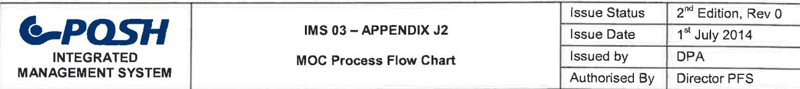

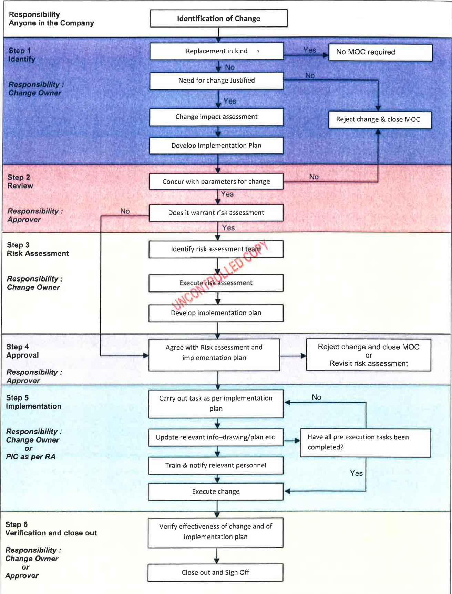

{146}------------------------------------------------

| 
  
INTEGRATED
 
MANAGEMENT SYSTEM
 
 | IMS 03 – APPENDIX J3 | Issue Status  | 2 nd Edition, Rev 0 |
| ---------------------------------------------------------------------------------------------------------------------------------------- | -------------------- | ------------- | ------------------------------ |
|                                                                                                                                          | MOC Log              | Issue Date    | 1 st July 2014      |
|                                                                                                                                          |                      | Issued by     | DPA                            |
|                                                                                                                                          |                      | Authorised By | Director PFS                   |

Year :

Vessel / Office:

| MOC No | Date Opened | Description                                                                                                                                                                    | Proposed date of completion | Actual date of Completion |
| ------ | ----------- | ------------------------------------------------------------------------------------------------------------------------------------------------------------------------------ | ------------------------------ | ---------------------------- |
|        |             | l                                                                                                                                                                              |                                |                              |
|        |             |                                                                                                                                                                                |                                |                              |
|        |             |                                                                                                                                                                                |                                |                              |
|        |             |                                                                                                                                                                                |                                |                              |
|        |             |                                                                                                                                                                                |                                |                              |
|        |             |                                                                                                                                                                                |                                |                              |
|        |             |                                                                                                                                                                                |                                |                              |
|        |             |                                                                                                                                                                                |                                |                              |
|        |             |                                                                                                                                                                                |                                |                              |
|        |             |                                                                                                                                                                                |                                |                              |
|        |             |                                                                                                                                                                                |                                |                              |
|        |             |                                                                                                                                                                                |                                |                              |
|        |             |                                                                                                                                                                                |                                |                              |
|        |             |                                                                                                                                                                                |                                |                              |
|        |             | ------------------------------------------------------------------------------------------------------------------------------------------------------------------------------ |                                |                              |
|        |             |                                                                                                                                                                                |                                |                              |
|        |             |                                                                                                                                                                                |                                |                              |
|        |             |                                                                                                                                                                                |                                |                              |
|        |             |                                                                                                                                                                                |                                |                              |
|        |             |                                                                                                                                                                                |                                |                              |
|        |             |                                                                                                                                                                                |                                |                              |
|        |             |                                                                                                                                                                                |                                |                              |
|        |             |                                                                                                                                                                                |                                |                              |
|        |             |                                                                                                                                                                                |                                |                              |
|        |             |                                                                                                                                                                                |                                |                              |
|        |             |                                                                                                                                                                                |                                |                              |
|        |             |                                                                                                                                                                                |                                |                              |
|        |             |                                                                                                                                                                                |                                |                              |
|        |             |                                                                                                                                                                                |                                |                              |
|        |             |                                                                                                                                                                                |                                |                              |
|        |             |                                                                                                                                                                                |                                |                              |
|        |             |                                                                                                                                                                                |                                |                              |
|        |             |                                                                                                                                                                                |                                |                              |
|        |             |                                                                                                                                                                                |                                |                              |
|        |             |                                                                                                                                                                                |                                |                              |
|        |             |                                                                                                                                                                                |                                |                              |
|        |             |                                                                                                                                                                                |                                |                              |
|        |             |                                                                                                                                                                                |                                |                              |
|        |             |                                                                                                                                                                                |                                |                              |

{147}------------------------------------------------

|                                                                   |                     |            | Issue Status  | 2nd Edition, Rev 0 |
| ----------------------------------------------------------------- | ------------------- | ---------- | ------------- | ------------------ |
| C-SR MARINE                                                       | IMS 03 - APPENDIX K | Issue Date | 1st July 2014 |                    |
|                                                                   |                     | Issued by  | DPA           |                    |
| SR MARINE BBS OBSERVATION CARD INTEGRATED MANAGEMENT SYSTEM |                     |            | Authorised By | Director PFS       |

| Observer Name:        |                                       | Day:                                     |                                |
| --------------------- | ------------------------------------- | ---------------------------------------- | ------------------------------ |
| Location:             |                                       | Time:                                    |                                |
| Observed Person:      | Ship's Crew <input type="checkbox"/>  | Non Ship's Crew <input type="checkbox"/> |                                |
| Observation Category: | Positive BBS <input type="checkbox"/> | Negative BBS <input type="checkbox"/>    | HAZOB <input type="checkbox"/> |

Comments on At-Risk Observation

| While (the task): |     |
| ----------------- | --- |
| Was (at risk):    |     |

| Is the OP aware? Yes <input type="checkbox"/> No <input type="checkbox"/> | Does the OP agree? Yes <input type="checkbox"/> No <input type="checkbox"/> |
| ------------------------------------------------------------------------- | --------------------------------------------------------------------------- |
| Actions Taken / To Be Taken To Improve Behaviour:                         |                                                                             |

| Agreed / Disagreed:      | Yes <input type="checkbox"/> No <input type="checkbox"/> |
| ------------------------ | -------------------------------------------------------- |
| Further Action Required? | Yes <input type="checkbox"/> No <input type="checkbox"/> |

# BBS Contacts - Six Step Framework

- 1. Greet to get the person's attention.
- 2. Commend safe acts/practices (be specific & sincere)
- 3. Show concern about at risk act and potential injury consequences, and ask why the person performed the risk act. Stop work if needed and consult with knowledge people.
- 4. Ask about other ways to perform the task safely and gain commitment for change and ensure that change occurs.
- 5. Ask about other safety concerns
- 6. Thanks the person for his/her good work and commitment to safe work.

{148}------------------------------------------------

| Issue Status  | 2nd Edition, Rev 0 |
| ------------- | ------------------ |
| Issue Date    | 1st July 2014      |
| Issued by     | DPA                |
| Authorised By | Director PFS       |

| PTW Reference No (ex-Dept/no/year). | Type of PTW | Date/Time PTW Open | Date/Time PTW Close |
| -------------------------------------- | ----------- | ------------------ | ------------------- |
|                                        |             |                    |                     |
|                                        |             |                    |                     |
|                                        |             |                    |                     |
|                                        |             |                    |                     |
|                                        |             |                    |                     |
|                                        |             |                    |                     |
|                                        |             |                    |                     |
|                                        |             |                    |                     |
|                                        |             |                    |                     |
|                                        |             |                    |                     |
|                                        |             |                    |                     |
|                                        |             |                    |                     |
|                                        |             |                    |                     |
|                                        |             |                    |                     |
|                                        |             |                    |                     |
|                                        |             |                    |                     |
|                                        |             |                    |                     |
|                                        |             |                    |                     |
|                                        |             |                    |                     |
|                                        |             |                    |                     |
|                                        |             |                    |                     |
|                                        |             |                    |                     |
|                                        |             |                    |                     |

PTW ref no shall be in Dept/No/Year format, i.e. for deck D/01/2013 & for Engine Room E/01/2013.

{149}------------------------------------------------

# CONTENTS

#### PERSONNEL SAFETY AND OCCUPATIONAL HEALTH 1.

- 1.1. Purpose
- 1.2. Scope

#### 2. PROCEDURE - PERSONAL PROTECTIVE EQUIPMENT (PPE)

- 2.1. PPE Requirements
- 2.2. Where and when PPE is to be used
- 23 PPF Matrix

#### 3. RISK ASSESSMENT AND TOOLBOX TALKS

- Health Risk Assessment 3.1.
- 3.2. Toolbox Talks

#### 4. CONTROL AND HANDLING OF HAZARDOUS SUBSTANCES

- 4.1. General
- 4.2. Precautions
- 4.3. Handling Liquified Gases
- 4.4. Ship's Stores
- 4.5. Cargo and Bunker Samples
- 4.6. Other Materials
- 4.7. Packaged Cargoes
- Dangerous Goods 4.8.

#### MANUAL HANDLING TECHNIQUES 5.

- 5.1. Introduction
- 5.2. Good Handling Technique for Lifting
- 5.3. Good Handling Technique for Pushing & Pulling
- 5.4. Good Handling Techniques for Twisting
- 5.5. Slips, Trips and Falls

#### FIRE PRECAUTIONS 6.

- 6.1. Smoking
- 6.2. Electrical fittings
- 6.3. Oily rags
- 6.4. Cleanliness

#### 7. GENERAL HEALTH AND WELLBIENG

- 7.1. Purpose
- 7.2. Scope
- 7.3. Personal Responsibility
- Medical Examination 7.4.
- 7.5. Malaria Prevention
- 7.6. Vaccination Requirements

{150}------------------------------------------------

- 7.7. Asbestos Hazards and Precautions
- 7.8. Rabies Prevention
- Bird Flu 7.9.
- Normal Seasonal Flu 7.10.
- 7.11. Pandemic Flu
- 7.12. Legionnaires Disease
- 7.13. AIDS
- 7.14. Skin Care
- 7.15. Heat Illness
- 7.16. Sun Light Exposure Risks
- 7.17. Eye Damage from Light Exposure
- 7.18. Noise
- 7.19. Dust Inhalation

#### 8. HYGIENE

- 8.1. Purpose
- 8.2. Scope
- 8.3. Personal Responsibility
- 8.4. Personal Hygiene
- 8.5. Caterng Procedures, including Galley and Messroom Hygiene
- 8.6. Galley Fire Protection
- 8.7. Galley Heavy Weather Precautions
- 8.8. Cookers and Fryers
- 8.9. Sharp Utensils
- Refrigerator Spaces and Store Rooms 8.10.
- Food Wastes 8.11.
- 8.12. Shower Cubicles and Toilets
- 8.13. Freshwater Tank and Supplies
- 8.14. Work Clothes
- 8.15. On-board Inspections

#### 9. PESTS - CONTROL AND PREVENTION

- 9.1. Safe Use of Pesticides
- 9.2. Vermin Infestation
- 9.3. Control of Rodents
- 9.4. Control of Insects
- 9.5. Inspection for Infestations
- 10. SLIPS, TRIPS AND FALL
- 11. GUIDELINES ON USE OF PORTABLE ELECTRICAL EQUIPMENT
- 12. PROCEDURES FOR CONTROL OF DRUGS AND ALCOHOL
- REST HOURS 13.

{151}------------------------------------------------

# 14. OHSAS OBJECTIVES AND TARGETS

# Appendices

- First Aid Kit Contents A.
- B PPE Matrix
- C Drug and Alcohol Test Record
- D Weekly Accommodation Inspection Checklist
- E Shipboard Working Hours
- F Rest Hour Log
- G OHSAS Objectives and Targets

UNCONTROLLED COPY

{152}------------------------------------------------

#### 1. PERSONNEL SAFETY AND OCCUPATIONAL HEALTH

#### 1.1 Purpose

· The purpose of this procedure is to address the safety and occupational health issues faced by all seagoing staff in the operation of the Company vessels.

#### 1.2 Scope

It is the Company's philosophy that the safety and health of its seagoing staff is paramount. This procedure and others within the IMS address that philosophy and, in doing so, meet the requirements of the ISM Code and the OHSAS 18001 standard.

The Company ensures that their entire seagoing staff is holding appropriate and verified Certificates of Competency as per statutory requirements, thereby ensuring they have undergone the appropriate training, including safety training.

Nevertheless, such safety training should be regarded as providing only a basic knowledge of personal safety, hence the need for this procedure to provide guidance in this respect.

#### 2. Procedure

# PERSONAL PROTECTIVE EQUIPMENT (PPE)

Regardless of practicalities of work or economics, safety will not be compromised. All personnel onboard SR MARINE vessels will abide by SR MARINE safety standards including the wearing of appropriate PPE.

#### 2.1. PPE Requirements

- a. All personnel must wear the appropriate PPE as provided by the Company when working. Even if a crew member is just 'lending a hand" to a work activity during an off duty period, appropriate PPE must still be worn.
- b. In effect, any work activity (particularly work outside the accommodation) requires the use of appropriate PPE.
  - R Safety shoes or boots must be worn in working areas where danger exists. This will be in all areas outside of the accommodation and in the galley work areas and in designated areas ashore. Safety shoes with worn or broken soles, damaged uppers or toecap protruding should be replaced. Lace-up type boots should always be worn properly tied up.
  - The Chief Officer is responsible to ensure that all PPE is in good condition and 11. properly maintained. He must ensure that is sufficient PPE onboard and requisition as required. In the event that adequate PPE has not been supplied to the vessel, the DPA/HSEQA Department must be informed accordingly.
  - iii. At the individual level, crew are responsible for checking their own PPE and highlighting any deficiencies.
  - iv. Long sleeve overalls, as provided by the Company should be worn when working onboard. As far as reasonable practicable, overalls should be clean with the Company Logos intact. Very dirty, torn or oily overalls should be disposed of and replaced.

{153}------------------------------------------------

| Issue Status  | 2nd Edition, Rev 0 |
| ------------- | ------------------ |
| Issue Date    | 1st July 2014      |
| Issued by     | DPA                |
| Authorised By | Director PFS       |

| 2.2.   | Where and when PPE is to be used:   |
| ------ | ----------------------------------- |
| ------ | ----------------------------------- |

| a)  | Safety Helmet1                  | Where there is any danger of things falling from above or being struck on the head and at all times when working outside or in machinery spaces.               |
| --- | ------------------------------- | ----------------------------------------------------------------------------------------------------------------------------------------------------------------------- |
| b)  | Safety Footwear                 | At ALL times in working areas, whether actually working or not. This includes machinery spaces, inside/outside the accommodation and the Galley.               |
| c)  | Ear Protection                  | In all machinery spaces or when undertaking noisy work e.g. chipping or when working with noisy equipment.                                                        |
| d)  | Safety Harness                  | When working aloft, overside or any other occasion when working above the deck level. The use of Safety belt with lanyard is banned on company vessel.         |
| e)  | Dust masks/Respirator           | When working in a dusty environment, e.g. wire brushing or any other environment where there is or is likely to be a high concentration of airborne particles. |
| f)  | Goggles/Safety Glasses/Visors   | When chipping/grinding or any other work where particles could enter the eyes, when handling chemicals.                                                           |
| g)  | Working Gloves                  | When working with items which could cut, scratch, pierce or abrade the hands.                                                                                        |
| h)  | Chemical Resistant Gloves/Apron | When working with chemicals/batteries.                                                                                                                                  |
| i)  | Lifevests/Lifejackets           | At all times when working on the main deck and any other occasion where there is a danger of falling overboard.                                                   |

# Note:

Appropriate PPE must also be worn as required when in designated areas ashore or on when on board other vessels or installations.

# 2.3

1 Writing with markers pen, stickers and painting on helmet should not be done as it can weaken the helmet.

{154}------------------------------------------------

#### 3. RISK ASSESSMENT AND TOOLBOX TALKS

#### 3.1. Health Risk Assessment

The Risk Assessment process and matrix as described in IMS 03 has been designed and developed in such a way that it can be used for assessing the health risks associated with any work to be carried out on board Company vessels, as well as for assessing safety and environmental risks

The purpose of the Risk Assessment is to highlight the risks involved in the task to be carried out and identify the mitigating steps necessary to reduce the risk to as low as reasonably practical (ALARP).

It is mandatory to carry out a Risk Assessment for all on board tasks and all personnel that will be involved must also be involved in the risk assessment process.

#### Toolbox Talks 3.2.

Toolbox Talks should be considered as a job briefing and a follow on to the Risk Assessment. They are a forum for the supervisor and/or person in charge of a job to ensure that the personnel carrying out the work fully understand the job requirements and they are reminded of the hazards involved, the procedures to be followed and the precautions to be taken, as identified in the Risk Assessment.

# 4. CONTROL AND HANDLING OF HAZARDOUS SUBSTANCES/MATERIAL

#### 4.1. General

There are a number of Hazardous Substances that may be encountered on board, either materials being transported on behalf of a customer or for use on board the vessel itself,

The Hazardous Substances may include, but not be limited to the following:

- Paint 0
- Solvents 0
- Fuel Oil
- . Lubricating Oils and Hydraulic Oils
- De-rusting Fluids .
- Cleaning Agents
- Substances being carried that are identified as dangerous under the International . Maritime Dangerous Goods (IMDG) Code

#### 4.2. Precautions

- a) Prior to handling potentially hazardous substances, read the manufacturer's safety instructions and the Material Safety Data Sheet (MSDS) and comply fully with all recommended precautions and PPE requirements. If the MSDS is not provided when the substance is delivered to the vessel, do not accept it onboard. The MSDS should, where practicable, be kept with the substance as it provides information on the material itself and what to do in the event of various types of emergencies. The manufacturer's instructions should also be read and observed.
- Protective clothing must always be worn to safeguard the person against accidental ﮯ spillage and eye and respiratory protection will be necessary in most cases of handling.
- c) completed and sent as soon as possible to Head Office and recorded onboard. A summary of the illness should be recorded in the vessel's Monthly HSE minutes.

{155}------------------------------------------------

- d) For IMDG Cargoes, the IMDG Code provides details of storage, transportation and incompatibilities as well as information on the material itself and what to do in the event of various types of emergencies.
- Paints and/or Chemicals may contain toxic or irritant substances, and with solvents may e) give rise to toxic, flammable and potentially explosive vapours.
- Associated materials such as rust removers and acids are also hazardous and skin f) contact should be avoided.
- g) All such materials, whether for use on board or being transported must be properly stored at all times.
- h) Internal / enclosed spaces should be atmosphere monitored and well ventilated at all times.
- i) Correct protective clothing should always be worn.
- i) No smoking in areas of painting or using chemicals.
- No naked lights in areas of painting or using chemicals. k)
- If paint is to be sprayed, the manufacturer's instructions for the equipment should be ﮯ read and adhered to.
- m) Paint may be sprayed at high velocity and can cause damage to the skin and eyes. Great care and supervision is required.
- n) Proper protective clothing is required such as combination suits, gloves and goggles.
- o)

#### 4.3 Handling Liquefied Gas

The following safeguards should be observed when handling packaged liquefied gas cargoes:

- a) Pressurised receptacles should be suitably protected against physical damage from other cargo, stores or equipment.
- b) Pressurised receptacles should not be over-stowed with other heavy goods or other items.
- c) Pressurised receptacles should be stowed in such a position that the safety relief device is in contact with the vapour space within the receptacle.
- d) Valves should be protected against any form of physical damage with a suitable protection cap in place at all times when the cylinder is not in use.
- e) Cylinders stowed below deck should be in compartments or holds capable of being ventilated and away from accommodation and working areas and all sources of heat
- f) Oxygen cylinders should be stowed separately from flammable gas cylinders.

{156}------------------------------------------------

#### 4.4 Ship's Stores

#### General a)

Any chemical or hazardous material placed on board a ship as stores should be accompanied by a Material Safety Data Sheet (MSDS). Where MSDS is not found or provided and the item is already taken onboard, the item should be isolated and stored in accordance with guidance provided on its container or packaging. It should not be put into use until satisfactory user information is provided.

Containers and packages should be stowed closed and the storage location kept clean and tidy.

#### b) Paint

Paint, paint thinners and associated cleaners and hardeners should be stowed in storage location protected by fixed fire extinguishing arrangements approved by the administration. (SOLAS II-2 Regulation 10 Section 6.3 as amended covers Spaces Containing Flammable Liquid.)

#### Chemicals C)

All chemicals should be stowed in designated and dedicated storage locations. Care should be taken to ensure that incompatible chemicals are stowed separately, Information on the fire-fighting medium for each chemical should be really available from the product's MSDS.

#### d) Cleaning Liquids

It is preferable to use cleaning liquids that are non-toxic and non-flammable. If flammable liquids are used, they should have a high flashpoint. High volatile liquids, such as gasoline or naphtha, should never be used in engine or boiler rooms.

Flammable cleaning liquids should be kept in closed, unbreakable, correctly labelled containers and should be stored in a suitable compartment when not in use.

Cleaning liquids should only be used in places where ventilation is adequate, taking into consideration the volatility of the liquids being used. All such liquids should be stowed and used in compliance with the manufacturer's instructions.

Direct skin contact with, or the contamination of clothing by, cleaning liquids should be avoided.

#### Spare gear Storage e)

Spare gear is not inherently hazardous. There have, however, been cases where large items of spare gear stowed on deck have broken free of their lashings with consequent damage to the vessel and risk of injury to personnel. When stowing spare gear, the following should be borne in mind:

- · It should allow safe access to, and operation of, any safety equipment.
- · It should not interfere with mooring or other operations.
- · It should be properly lashed, taking into account expected weather on the voyage.

#### 4.5 Cargo and Bunker Samples

All cargo samples should be stowed securely in lockers that have access external to accommodation. Consideration should be given to storing samples in a location protected by a fixed fire-fighting system, such as paint locker. The number of samples retained on board should be carefully managed and, when no longer required, they should be disposed in accordance with Marpol regulation.

The Company should have a policy that addresses the disposal of samples; the aim should be to minimize the period of retention after the relevant cargo has been discharged. Unless the

{157}------------------------------------------------

company advises to the contrary, it is suggested that samples are retained for a period of three months after the cargo has been discharged.

#### 4.6 Other Materials

#### Sawdust, Oil Absorbent Granules and Pads a.

The use of saw dust for cleaning up small oil spills on board ship is discouraged. If sawdust is carried on board, care should be taken to ensure that, while unused, it is stowed in a dry condition and, if possible, in a cool location. Moist sawdust is susceptible to spontaneous combustion.

When sawdust has been used to clean up a minor oil spill, the contaminated sawdust should be stowed separately, in a sealed container and in safe location, clear of the accommodation and hazardous areas.

Any oil-impregnated absorbent granules or pads should be stowed in dedicated containers on board, clear of the accommodation and hazardous areas.

Oil-impregnated sawdust and absorbent granules should be disposed of early as possible, either ashore or via the ship's waste incinerator.

#### b. Garbage

The storage locations for garbage should be carefully selected to ensure that the garbage presents no potential hazard to adjacent spaces.

Particular consideration should be given to the storage of garbage that is designated as 'special waste', such as batteries, sensors and fluorescent tubes, to ensure that only compatible materials are stowed together .

The ICS publication 'Guideline for the Preparation of Garbage Management Plans' provides information on how to comply with Annex V of MARPOL.

#### 4.7 Packaged Cargoes

# a.

Packed petroleum cargoes are usually shipped in steel drums of approximately 200 litres capacity. Product transported in this manner include gasoline, kerosene, gas oils and lubricating oil

In addition to the general safety precautions for handling bulk petroleum, the following procedures should be observed when handling packaged petroleum products.

#### b. Loading and Discharging

Packages petroleum and other flammable liquids should not be handled during the loading of volatile petroleum in bulk, except with the express permission of both the Responsible Officer and loading of bulk cargo should be suspended owing to the increased risk of spark generation.

#### C. Precautions During Handling

A responsible Officer should supervise the handling of packaged petroleum and other flammable liquids. The following precautions should be taken :

- Stevedores must comply with smoking restrictions and other safety regulations. i.
- When permanent hatch protection is not fitted, temporarily protection should be ﻨﺘ provided to avoid the risk of spark being caused by hoist striking the hatch coamings, hatch sides or hold ladders.

{158}------------------------------------------------

| Issue Status  | 2nd Edition, Rev 0 |
| ------------- | ------------------ |
| Issue Date    | 1st July 2014      |
| Issued by     | DPA                |
| Authorised By | Director PFS       |

- All hoists should be of a size suitable for passing through hatches with ample iii. clearance
- iv. Fibre rope slings, cargo nets, or drum hooks on wire rope or chain slings, should be used for handling loose drums.
- Goods should preferably be palleted and secured. Pallets should be lifted with pallet lifting gear with safety nets. If goods are not presented on pallets, cargo trays or fibre rope slings may be used. The use of cargo nets for packaged goods is generally to be discouraged as they are liable to cause damaged to the packaging.
- vi. Loose gas cylinders should be handled with cargo nets of a sufficiently small mesh to prevent them falling through the net. Cylinders should never be handled by the valve or protection cap. Cylinders should never be lifted on board using lifting magnets, chains, clings or strops. A cylinder trolley or other appropriate device should be used when moving cylinders, even for short distances.
- vii. Each package should be inspected for leakage or damage before being stowed, and any found defective to an extent likely to impair safety should be rejected.
- viii. Packages should be placed on dunnage on the deck.
- ix. Packages should not be dragged across the deck or hold and should not be allowed to slide or roll free.
- Cans and drums should be stowed with caps and end plugs uppermost. X. x
- When securing the cargo, each tier should be separated by dunnage. The xi. height to which cargo can be safely stowed should be related to the nature, size and strength of the packages. Advice should be obtained from the terminal or shipper, as appropriate.
- Sufficient suitable dunnage should be used to prevent possible damage during xii. the voyage.
- The cargo should be properly secured to prevent any movement during the xiii. voyage.
- xiv . During darkness, adequate approved lighting should be provided.
- xv. Empty receptacles, unless gas free, should be treated as filled receptacles.

#### 4.8 Dangerous Goods

Dangerous goods are classified in Chapter VII of the International Convention for the Safety of Life at Sea (SOLAS), 1974.

The Master should only permit aboard the ship packaged dangerous goods, which have been properly identified by the shipper of the goods and declared as being properly packaged, marked and labelled in compliance with the appropriate provisions of the International Maritime Dangerous Goods (IMDG) Code, taking into consideration, as appropriate, the IMO 'Recommendations on the Safe Transport of Dangerous Cargoes and related Activities in Port Areas'

{159}------------------------------------------------

| Issue Status  | 2nd Edition, Rev 0 |
| ------------- | ------------------ |
| Issue Date    | 1st July 2014      |
| Issued by     | DPA                |
| Authorised By | Director PFS       |

Before accepting the cargo, the Master should check that he has received adequate advice on any special properties of the cargo, on procedures for entering an enclosed compartment containing the cargo, and for dealing with any leak, spill, inhalation, skin contact or fire.

Attention is drawn to the advice for dealing with spillage or fire contained in the IMO guide 'Emergency Procedures for Ships Carrying Dangerous Goods - Group Emergency Schedules',

The Master should ensure that the dangerous good loaded in the ship are properly stowed and segregated as recommend in the IMDG Code, taking into consideration, as appropriate, the IMO 'Recommendations on the Safe Transport of Dangerous Cargoes and Related Activity in Port Areas'.

#### 5 MANUAL HANDLING TECHNIQUES

#### 5.1 Introduction

- i. Manual handling injuries can occur wherever people are at work. Heavy manual labour, awkward postures, manual materials handling and previous or existing injury are all risk factors implicated in the development of Musculoskeletal Disorders.
- This section will help prevent these injuries and is likely to be cost effective. However, 11. not all injuries can be prevented, so it is still essential to encourage early reporting of symptoms and make arrangements for the proper treatment and rehabilitation of anybody who is injured.

#### 5.2 Good Handling Technique for Lifting

- i. Think before lifting/handling. Plan the lift. Can handling aids be used? Where is the load going to be placed? Will help be needed with the load? Remove obstructions such as discarded wrapping materials. For a long lift, consider resting the load midway on a table or bench to change grip.
- ii. Keep the load close to the waist. Keep the load close to the body for as long as possible while lifting. Keep the heaviest side of the load next to the body. If a close approach to the load is not possible, try to slide it towards the body before attempting to lift it.
- = Adopt a stable position. The feet should be apart with one leg slightly forward to maintain balance (alongside the load, if it is on the ground). The worker should be prepared to move their feet during the lift to maintain their stability.
- iv. Get a good hold. Where possible the load should be hugged as close as possible to the body. This may be better than gripping it tightly with hands only.
- Start in a good posture. At the start of the lift, slight bending of the back, hips and knees ﺧ is preferable to fully flexing the back (stooping) or fully flexing the hips and knees (squatting).
- vi. -Don't flex the back any further while lifting. This can happen if the legs begin to straighten before starting to raise the load.
- vii. Avoid twisting the back or leaning sideways, especially while the back is bent. Shoulders should be kept level and facing in the same direction as the hips. Turning by moving the feet is better than twisting and lifting at the same time.
- viii. Keep the head up when handling. Look ahead, not down at the load, once it has been held securely.
- İX. Move smoothly. The load should not be jerked or snatched as this can make it harder to keep control and can increase the risk of injury.

{160}------------------------------------------------

| Issue Status  | 2nd Edition, Rev 0 |
| ------------- | ------------------ |
| Issue Date    | 1st July 2014      |
| Issued by     | DPA                |
| Authorised By | Director PFS       |

Don't lift or handle more than can be easily managed. There is a difference between X. what people can lift and what they can safely lift. If in doubt, seek advice or get help.

xi.

Put down, and then adjust. If precise positioning of the load is necessary, put it down first, and then slide it into the desired position.

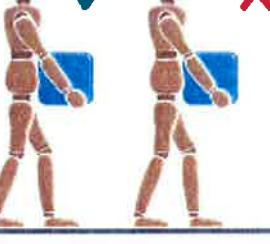

Keap the head up when handling

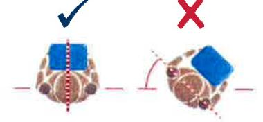

Awaid twisting the beck or leaning sideways, aspecially while the back is bent

# 5.3 Good Handling Technique for Pushing & Pulling

- រៈ Handling Device. Aids such as barrows and trolleys should have handle heights that are between the shoulder and waist. Devices should be well maintained with wheels that run smoothly (ensure equipment is maintained). When purchasing new trolleys etc. ensure they are of good quality with large diameter wheels made of suitable material and with castors, bearings etc which will last with minimum maintenance.
- ii. Force. As a rough guide the amount of force that needs to be applied to move a load over a flat, level using a well-maintained handling aid is at least 2% of the load weight. For example, if the load weight is 400 kg, then the force needed to move the load is 8 kg. The force needed will be larger, perhaps a lot larger, if conditions are not perfect (e.g. wheels not in the right position or a device that is poorly maintained). Try to push rather than pull when moving a load, provided you can see over it and control steering and stopping.
- iii. Slopes. Enlist help from others whenever necessary if you have to negotiate a slope on ramp, as pushing and pulling forces can be very high. For example, if a load is moved up a slope of 1 in 12 (about 5°), the required force is over 30 kg even in ideal conditions - good wheels and a smooth slope. This is above the guideline weight for men.
- Uneven Surfaces. Moving an object over soft or uneven surfaces requires higher forces. iv. On an uneven surface, the force needed to start the load moving could increase to 10% of the load weight, although this might be offset to some extent by using larger wheels. Soft ground may be even worse.
- Stance and Pace. To make it easier to push or pull, keep your feet well away from the load and go on faster than walking speed. This will stop you becoming too tired too quickly.

{161}------------------------------------------------

# 5.4 Good Handling Techniques for Twisting

Reduce the guidelines weights if the handler twists to the side during the operation. As a rough guide, reduce them by 10% if the handler twists beyond 45° and by 20% if the handler twists beyond 90°.

#### 5.5 Slips, Trips and Falls

- Safety shoes should be worn by all personnel (including the catering staff) at all times 1. within the designated working areas. A large numbers of injuries occur because of using unsuitable footwear which does not grip the decks properly and/or protect the feet from falling objects, burns or scalds if liquids are split.
- 11.1 Working areas should be kept clear of grease, oil, rubbish and ice, etc to avoid slipping, Any spillage should be cleaned up immediately.
- iii. Working areas should be cleared from obstructions.
- iv. In galleys and messrooms, broken glass or crockery to be cleared away immediately.

#### 6 FIRE PRECAUTIONS

#### 6.1 Smoking

Fires are often caused by burning cigarette butts. Smoking is only permitted in certain locations on-board as designated by the Master and the Company "Smoking Policy". Smoking material should be extinguished properly. Smoking in bed is strictly prohibited and is a disciplinary offence.

#### 6.1 Electrical fittings

All electrical fittings should be of an approved type. Only qualified personnel are allowed to work on electrical equipment. Electrical fittings should be correctly installed. Loose wires, makeshift plugs and sockets are not acceptable and must be rectified.

#### 6.2 Oily rags

Heat can be generated from oily rags, cloths and sawdust etc. This can lead to spontaneous combustion and fire. Such rubbish should be properly stored until it can be disposed of. In all work spaces, e.g. engine room/pump room, great care should be taken with oily rags. Proper disposal containers should be provided.

#### 6.3 Cleanliness

The general upkeep of the vessel is essential for ensuring a working and living environment that is a minimum risk from fire. All machinery spaces should be kept clean and oil free at all times. Paint and other flammable liquids should only be stored in designated 'paint lockers' provided with sprinkler systems. All paint used on a daily basis should be returned to the 'paint locker' after use. Metal swarf must not be allowed to accumulate and should be properly disposed of.

#### GENERAL HEALTH AND WELLBIENG 7

#### 7.1 Purpose

a. The purpose of this section is to acquaint all members of crew and other personnel with information for their general well-being and health.\

{162}------------------------------------------------

| Issue Status  | 2nd Edition, Rev 0 |
| ------------- | ------------------ |
| Issue Date    | 1st July 2014      |
| Issued by     | DPA                |
| Authorised By | Director PFS       |

b. HSEQA Dept will provide the vessels with guidelines, notices and guidance including personal health management as received and promulgated by the relevant medical authorities.

#### 7.2 Scope

The scope of this section addresses the dual topics of health and occupational hazards encountered on-board.

#### 7.3 Personal Responsibility

All personnel have an equal responsibility for their own well-being. If the vessel has a Medical Officer on board, he is responsible (reporting to the Master) for health matters on board. If the vessel does not have a Medical Officer, the Master assumes this responsibility.

#### 7.4 Medical Examination

- It is a Company policy that all Officers and crew should undergo an approved medical a. examination every two years or less.
- b. The medical examination will be carried out by the Company Medical Officer or other approved Physician at the expense of the Company.
- c. Officers and crew are responsible for ensuring their medical certificates are up to date. The officers and crew must have their original medical certificate with them onboard as required by regulations.

#### 7.5 Malaria Prevention

Precautions should be taken against the risk of contracting malaria when visiting certain countries. The Company provides anti-malaria tablets for vessels operating in malarial areas and it is the responsibility of all individuals to take these tablets as necessary. It is necessary to start taking anti-malaria precautions two weeks in advance of visiting malaria areas. Personnel appointed to ships in those areas should start taking precautions whilst on leave, in advance of travelling. The costs of malaria tablets required under these circumstances will be borne by the Company by reimbursement for out-of-pocket expenses. It should be borne in mind that some anti-malaria can have certain side effects and therefore the Company does not compulsorily require the taking of such medication.

#### 7.6 Vaccination Requirements

- a The Company may require personnel to receive Vaccinations and maintain Certificates for yellow fever and cholera. The yellow fever vaccination is valid for ten years; the cholera vaccination is valid for six months. Vaccination against typhoid, tetanus, polio, hepatitis "B" and other diseases may also be required.
- b. It must be borne in mind that some countries require that yellow fever vaccinations must be done at least 10 days before entry into that country is permitted.

#### Asbestos Hazards and Precautions 7.7

On some older Company vessels, there may still be small quantities of asbestos onboard. The subject of asbestos and its related hazards is now well documented from a multitude of industrial and inspectorate sources and which is freely available to Masters. An Asbestos Control Policy in the use of asbestos-based materials must be followed, and reliance is placed upon the Master, the Chief Engineer and the Safety Officer to maintain the safety of personnel when asbestos risks are present.

{163}------------------------------------------------

#### 77.1 Ashestos Control

- a. Materials containing asbestos will only be removed by suitably trained and qualified operatives where it is found to be hazardous and is required to be removed for maintenance purposes. By definition the hazard will be presented in the form of flaking or friable material.
- ف Any replacement, modified or new structure will not include asbestos or asbestos containing material.
- c. Only if no adequate substitutes are available will the continued use of compound materials containing white asbestos be permitted in components of plant or machinery. In this event warning notices will be posted for personnel protection and information during maintenance or breakdown periods.

Note: Some state authorities apply even more stringent measures on the control and use of asbestos. Masters are advised to check with Head Office prior to commencement of charter.

#### 779 Health Hazards of Asbestos

- a. The main hazard of asbestos stems from airborne fibres in the form of visible and invisible dust caused by work on old insulation including electrical cable protection and the dismantling of any panelling behind which dust have accumulated,
- b. Inhalation of asbestos fibres and dustican lead to asbestosis, bronchial carcinoma (lung cancer) and mesothelioma, a rare but lethal tumour
- c. Additional risk is encountered by asbestos fibres penetrating the skin,

#### 773 Action on vessels

- a. The Master and Safety Officer should acquaint themselves with the places where there is asbestos or likely risk. Sound surfaces should not be probed or disturbed to ascertain whether asbestos is present.
- Any crewmember working in the probable vicinity of asbestos should liaise with the ف Safety Officer and specifically report any defects or deterioration in the condition of such material.
- Should an adverse report be indicated, the Master and Safety Officer should inspect the C. area immediately and adopt the following strategies.
- ರ. All crew and personnel should be informed and restriction of access applied to the area.
- e. If at all possible, the hazard area should be covered or sealed in order to reduce dust emission.
- f. Consider the abandonment of all work (if non-essential) until specialist shore-based operatives are able to attend.
- Report risk of airborne asbestos to Head Office. ರ
- Any member of crew or attendant personnel who has been exposed to asbestos dust ﮯ should be advised to make a record of dates and circumstances and to inform his local medical practitioner and Medical Officer of such exposure. The Master and Safety Officer are both required to submit comprehensive reports.
- Where repairs involving the dismantling of asbestos are undertaken by shore-based operatives, the repairer must be pre-informed of the nature and extent of any asbestos

{164}------------------------------------------------

| Issue Status  | 2nd Edition, Rev 0 |
| ------------- | ------------------ |
| Issue Date    | 1st July 2014      |
| Issued by     | DPA                |
| Authorised By | Director PFS       |

work anticipated. It is essential that all airborne dust is contained within the work area and that fibres are not carried to other parts of the vessel by forced ventilation and extraction systems.

i. All modern new build vessels should be certified asbestos free and be issued with an Asbestos Free Certificate.

#### 77 4 Protection

- a. It is unlikely that the identification and proper monitoring of airborne asbestos can be effectively achieved onboard ship during periods of maintenance. Accordingly the following procedures should be adopted where no recourse to shore-based expertise is available.
- b. All attendant personnel must be given clear instruction in the proper use of protective clothing and equipment.
- Respiratory protective equipment and full protective clothing must be worn. The
  ပ respiratory equipment must meet the required minimum protection factor as required by International Standards. Clothing should comprise suitable footwear and pocket-less overalls, headgear and gloves, all manufactured from material capable of shedding dust. Overalls should be securely closed at the neck, ankles and wrists. Disposable overalls are acceptable provided they exclude asbestos dust.
- d. Respirators should be snug fitting to the face. Beards and spectacles will prevent most masks form fitting properly and therefore persons who cannot wear a close-fitting mask must either use a positive pressure respirator or keep away from areas of asbestos dust contamination.
- The Self Contained Breathing Apparatus (SCBA) reserved for fire-fighting emergencies e. should not be used unless the asbestos dust is being caused by fire.
- f. Once work has commenced, the protective equipment and clothing must not be worn outside the area of contamination.
- g . When work is completed and areas tidied, the clothing and equipment should be freed of as much dust as possible using a specialised vacuum cleaner and its filters. NORMAL DOMESTIC/LIGHT INDUSTRIAL VACUUM CLEANERS MUST NOT BE USED.
- h. The vacuum cleaner should be cleaned before the protective clothing is removed. Clothing which is or was dust contaminated should be carefully removed and placed in a dust tight container (e.g. strong plastic bag sealed with adhesive tape) for eventual safe disposal ashore.
- i. Parts of the body exposed during the work should be thoroughly rinsed and washed again after removal of contaminated clothing.

# 7.7.5 Additional Safeguards

- Some important safeguards are necessary to ensure minimum cross-movement of a. asbestos dust. These include :
  - i. Thorough wetting of asbestos items.
  - Careful handling and the use of hand tools instead of powered tools. =
  - Controlled ventilation and the use of portable dust extraction equipment vented III. to safe areas.
  - The barring of access to all but essential personnel. iv.

{165}------------------------------------------------

- Total enclosure of the working area by the use of plastic sheeting and adhesive v. sealing tape.
- Safe asbestos collection facilities such as a large plastic sheet which can vi. subsequently be sealed air tight.
- vii. Disposal of all contaminated items to ashore for specialist attention or laundry, all containers to be clearly labelled "Warning: Contains Asbestos" or "Asbestos Contaminated Clothing - Do Not Inhale the Dust".
- viii. The sealing of any remaining friable material by the use of suitable sealing compounds.

#### 7.8 Rabies Prevention

Rabies is a viral infection to which humans and all warm-blooded animals can succumb. The disease attacks the central nervous system to cause paralysis and convulsions (foaming at the mouth) and in humans is invariably fatal. The incubation period of human rabies is uncertain and any person exposed to rabies, normally through the bite of an animal, would be prescribed a course of unpleasant preventative injections. These injections are not always successful. The possession of shipboard pets/animals acquired overseas is absolutely forbidden due to the possible risk of rabies and other diseases. Furthermore, the importing of such animals will almost certainly be in breach of port state legislation is this respect.

#### 7.9 Bird Flu

Bird flu is a disease affecting birds that is caused by several types of flu viruses. Highly Pathogenic Bird Flu (HPAI) is a highly contagious disease affecting wild birds and poultry, and has been responsible for recent human outbreaks and deaths in Asian countries. Bird flu spreads to humans mainly through contact with infected birds, which shed the virus in their saliva, nasal secretions and faeces. Very rarely, inefficient and limited human-to-human transmission may occur.

#### Normal Seasonal Flu 7.10

Flu (Influenza) is an infection caused by a virus called the flu virus. It is usually a more severe illness than the common cold which is caused by other respiratory viruses. There are 3 main types of flu: flu A, flu B and flu C. Flu A and flu B are associated with annual outbreaks and epidemics. Flu A usually causes more severe illness than flu B and can result in pneumonia, hospitalization or even death, especially in the elderly and those with chronic illnesses. Flu A has also been responsible for all previous pandemics (worldwide epidemics of flu). Fiu C is very rarely seen and is associated with only mild sporadic illness.

#### Pandemic Flu 7.11

Pandemic flu occurs when a new flu virus emerges and starts spreading as normal flu (i.e. efficient human to-human transmission) - by coughing and sneezing. The new virus must be able to replicate in humans and cause serious illness. As the virus is new, the human immune system will have no pre-existing immunity. This makes it likely that that people who contract pandemic flu will experience more serious disease than that caused by normal flu.

# 7.12 Legionnaires Disease

The legionella bacteria lives and thrives in stagnant water or sludge or in cooling towers where wet material can be encrusted with scale or dirt or organic matter. It is considered that areas within the vessel's air conditioning system can present a breeding ground for such bacteria even with difference designs from those encountered ashore.

{166}------------------------------------------------

The main danger areas are :

- a. air inlet arrangements
- b. filters
- cooler units (dehumidifiers) C.
- d. humidifiers
- e. plenum chambers

Regular maintenance and cleaning will reduce the level of risk from legionella and close attention to drainage provisions, filter overhaul in conjunction with super-chlorinated rinsing and the examination of insulating material within plenum chambers will be necessary. Frequency of cleaning will depend on specific system design and its susceptibility to fouling but should not exceed 3 month intervals.

#### 7.13 AIDS

- a. Much has been publicised on this topical subject and information is readily available. To summarise, AIDS is caused by a virus called HIV. This virus attacks the body's natural immune system which fights infections, and thereby lays the body open to opportunistic infections. At the present time, those who develop full blown AIDS will die from their illnesses. On current evidence approximately 30% of those infected will develop AIDS in the next five years.
- b. The HIV virus is present in body fluids such as blood, semen, saliva and tears. However, no-one is recorded having caught AIDS from saliva or tears.
- Two common avenues of viral transmission are vaginal and anal sexual intercourse and blood cross-infection. The more sexual partners the individual has the higher the risk of catching the virus. In many parts of the world and especially in Africa and South America the virus is prevalent. There are obvious risks in going with a prostitute. Always use a condom which will also reduce the possibility of other sexually transmitted diseases,
- d. Infection by drug abusers is known to be a major factor in the spread of the virus, whereby such drug misuse involve the sharing of drug paraphernalia (needles, syringes, mixing bowls, etc).
- e. Never use equipment for ear-piercing, tattooing or acupuncture unless it is absolutely certain that it is unused or sterilised. Don't share a tooth brush or razor - both items could transfer the virus through infected blood.

#### 7.14 Skin Care

- a. The skin provides natural protection so long as it remains intact and undamaged. However, the opening of skin pores and hair follicles, being a normal body function experienced onboard in warm climates or work areas, do present access to skin irritants. Heavy sweating, far from giving a dilution effect to soluble irritants, will make the skin sodden and thus less resistant to chemical or irritant agent attack.
- b. equally not all skin diseases are of occupational origin.
- All personnel are cautioned in the handling of hazardous substances. Proper ن preventative measures and personal protection advice must be strictly followed.
- d. Types of chemicals which will cause skin disease include contact irritants (acids, alkalis and organic solvents), contact sensitisers or allergens (nickel, chromates and rubber additives) and photo-sensitisers which require the stimulus of sun or U.V. light (coal tar pitch).

{167}------------------------------------------------

- e Additional agents which have proved the cause of skin disease include cutting oils, inorganic and organic chemicals, de-greasing agents, tar, pitch and other products of coal tar, physical agents including heat, light, humidity and ionising radiation, horticultural agents and dermatitis causing agents such as flour, sugar, cement dust, slurry and glass fibre.
- f. Always remember to don protective clothing and equipment prior to handling hazardous substances. Choose the correct item of clothing or equipment necessary for the work e.g. cotton gloves give little protection against liquids, many organic solvents will penetrate rubber (nitrile or neoprene), heavy PVC gloves cause loss of manual dexterity.
- Never rely on so-called barrier creams to effect skin protection. They are unlikely to be g. effective against allergic contact dermatitis. Emollient creams applied after skin cleansing help to replace the natural skin grease removed by degreasants or organic solvents.
- h. Prompt treatment of all wounds is essential since once the skin is broken, chemicals can penetrate to lower dermal levels and be readily absorbed into the body. All wounds should be dressed and re-dressed whilst the individual is at work.
- Personnel should note that although occupational dermatoses are not infectious or i. contagious a high standard of personal hygiene is most important in the combating of skin diseases. Contaminated clothing should be washed regularly or safely disposed of if washing is impracticable. Persons with a pre-history of skin ailments e.g. childhood eczema, should be especially prudent.
- j. When washing clothing, care must be taken to ensure that items are properly rinsed with fresh water to avoid skin problems due to detergent remaining in the clothing. Do not use excessive quantities of detergent and ensure the ship's washing machine is operated correctly.

#### 7.15 Heat Illness

The prevention of heat illness is a matter of common sense in keeping with normal day-to-day health precautions. Such illness can be simple sunburn, severe sunburn (peeling), dehydration, giddiness, vomiting and photophobia. In extreme circumstances the person can succumb to heat exhaustion which can be serious in the extreme. Precautions involve the ample replacement of body fluids by the intake of freshwater, body protection against extremes of heat and the taking of adequate salt tablets or salt with food. Abstinence or the limited intake of alcohol is recommended in high ambient temperature areas.

#### 7.16 Sun Light Exposure Risks

The publicised risks of overexposure to sunlight (U.V.) for holidaymakers also apply to personnel working in tropical conditions on decks. Never regard the working on deck as a side benefit for the purposes of obtaining a tan. Risks such as malignant melanoma, skin cancer and changes of appearance to moles and other skin blemishes are becoming all too common. Always cover up and wear the work clothes provided.

# 7.17 Eye Damage from Light Exposure

- Optical radiation is another term for light, covering ultraviolet (UV) radiation, visible light, a. and infrared radiation. The greatest risks to health are probably posed by:
- b. JV radiation from the sun. Exposure of the eyes to UV radiation can damage the cornea and produce pain and symptoms similar to that of sand in the eye. When working in strong sunlight personnel should use approved safety glasses that also provide protection from sunlight or some other form of shading of the eyes. Never look directly at the sun with binoculars or telescope.

{168}------------------------------------------------

- The misuse of powerful lasers. High-power lasers can cause serious damage to the eye c. (including blindness) as well as producing skin burns.
- Exposure to electric Arc-welding. Unprotected exposure to arc-welding can cause "arc-Gi eye" where the retina of the eye can become permanently damaged. Never look directly at the arc without using appropriate welding eye protections.

#### 7.18 Noise

One of the most common industrial ailments is noise-induced hearing loss. In compliance with statutory codes of practice, the Company provides suitable ear protection equipment and the compulsory wearing should be strictly enforced. Admittance to engine spaces and other areas of high noise exposure is to be denied to persons not equipped with ear protection.

#### 7.19 Dust Inhalation

All precautions against the inhalation of dust e.g. whilst cleaning bulk tanks, should be taken. Dust or respirator masks must be worn. Filter elements should be changed regularly and masks cleaned at the end of each working cycle. Damaged or unserviceable equipment should be brought to the attention of the Safety Officer for immediate replacement.

#### 8 HYGIENE

#### 8.1 Purpose

The purpose of this section is to amplify basic procedures in regard to the maintenance of hygiene standards in excess of minimum standards.

#### 8.2 Scope

This section covers guidance on basic hygiene matters required for the preservation and wellbeing of work conditions and personnel onboard.

#### 8.3 Personal Responsibility

Everyone on board is responsible for their own personal hygiene and the Master is responsible for the overall hygiene of the vessel.

#### 8.4 Personal Hygiene

- a. HSE Policy Statement includes the recognition of ensuring the good health of all employees, charterers' personnel and other persons with whom the company has contact at the work place.
- b. This policy however recognises that important steps in achieving the principle of good health are the provision of hygienic working conditions and the education of personnel to care for themselves.

# 8.5 Catering Procedures, including Galley and Messroom Hygiene

- a. Galley and Messroom hygiene and well organised catering facilities are paramount for the welfare of the personnel on-board and an important factor in the performance of duties at work.
- b. The Cook is responsible for the Galley procedure including ensuring that all personnel on board are provided with good quality food that takes account of varying nationalities, customs and tastes and for ensuring that the ships budget for provisions is complied

{169}------------------------------------------------

| Issue Status  | 2nd Edition, Rev 0 |
| ------------- | ------------------ |
| Issue Date    | 1st July 2014      |
| Issued by     | DPA                |
| Authorised By | Director PFS       |

with. He shall ensure that food inventory contains expiry dates. The expiry dates shall be updated after each supply of fresh provisions.

- c. Catering staff should be properly trained and have a thorough knowledge of food safety and hygiene as they are responsible for ensuring high standards of personal hygiene and for ensuring the cleanliness of the galley, pantries, messrooms, refrigerated rooms and storerooms is always maintained.
- di Only properly trained Galley personnel should be used for the preparation of food in the Galley. Untrained personnel should not be tasked with the preparation of food.
- Non catering crew using the galley facilities should also comply fully with this procedure. e.
- f.. f... f... f... f... f... The Master must undertake regular inspections of the galley, messrooms, pantries and food storage areas and record the results of such inspections in the Log Book. Any remedial action in regard to inadequacies found should also be recorded.
- All catering staff have responsibility for the maintenance of hygienic conditions within the Galley and other food preparation areas, store rooms and cupboards, refrigerated spaces and mess rooms.
- Regular cleaning activities will include but will not limited to the frequent cleaning of all h. working and eating surfaces, the disinfection of galley floors and scuppers, the removal of accumulated grease and fats on extraction hoods, trunks and screens and applying daily cleaning routines as directed by the Master. Cleaning cloths and other items used for cleaning surfaces must be thoroughly washed and dried after use,
- The galley staff and all other personnel onboard must take great care to avoid leaving i. food scraps lying around, as doing so can result in rodents, cockroaches and other vermin proliferating onboard.
- j. Personal hygiene when dealing with foodstuff includes:
  - Hands and Fingernails should be washed and cleaned before food is handled, This is most important after visiting the toilet.
  - All cuts, however small, should be reported immediately and receive first aid attention to prevent infection. An open cut, burn or abrasion should be covered with a waterproof dressing.
  - Illness, Rashes or Spots should be reported immediately the symptoms appear.
  - A Person Suffering from Dysentery or Diarrhorrea MUST NOT work in the galley, . pantry or other food handling areas.
  - Catering Staff should wear clean clothing when handling food and preparing . meals. A supply of clean, hot, running water, clean towels and soap should be available.
  - Cleanliness of all food, crockery, cutlery, linen, utensils, equipment and storage . is vital. Cracked or chipped crockery and glassware should be destroyed.
  - Prepared food should be kept covered as far as possible. Foodstuffs which may . have come into contact with broken glass or broken crockery should be thrown away.
  - There will be no smoking in galleys, pantries, store rooms or other places where . food is prepared.

{170}------------------------------------------------

- . Separate work surfaces, colour coded chopping boards and utensils should be used for preparation of raw food and cooked food.
- Food items that have passed their expiry date should be disposed of in accordance with the requirements of the Garbage Management Plan.
- Food waste, empty food containers and other garbage are major sources of pollution and should be placed in proper storage areas away from foodstuffs.
- k. Personnel using the catering facilities during unattended hours are required to follow the above procedures as well as maintain cleanliness to working surfaces and equipment use. ANY UTENSILS, DISHES, PLATES, CUTLERY ETC MUST BE WASHED AND PROPERLY RESTOWED.

#### 8.6 Galley Fire Protection

- a. Galley staff must always bear in mind that they are often working with hot surfaces that can be a source of ignition of fires, so great care must be taken to avoid flammable materials coming into contact with hot surfaces.
- In the event of fire in the galley, the flames should be smothered using a fire blanket if practicable, the container removed from the source of heat and the power supply isolated. A suitable fire extinguisher should be used. In no circumstances should water be used.
- c. Water should never be poured into hot oil; the water turns to steam, throwing the oil a considerable distance. This may cause severe burns to personnel and may well start a fire.
- All electrical appliances in use should never be left unattended. They should be ರ. switched off immediately after use.
- e. Access to emergency equipment should never be obstructed.
- f. f.
  f.
  f.
  f.
  f.
  Alleyways and doorways should not be blocked with stored items, such as cases of mineral water or other stores.

#### 8.7 Galley Heavy Weather Precautions

- In rough weather, extra care should be taken and range guards should be fitted. a.
- ﻓ Minimise the cutting of bulk foodstuff etc.
- Enforce the use of anti-slip mats to prevent slippage of cookery and utensils, ပံ
- d. Bear in mind that hot other hot liquids can slop about in heavy weather which may result in spillages and possibly burns to Galley staff.

#### 8.8 Cookers and Fryers

- The need for care when using or when using such equipment should be obvious. a.
  ច
- b Particular care must be taken when working with hot oils and any other hot liquids, especially when moving them from one place to another or transferring them from one utensil to another.
- c. Thermostatically controlled deep fryers with lids must be used for deep frying, never open saucepans or other open utensils or containers.

{171}------------------------------------------------

| Issue Status  | 2nd Edition, Rev 0 |
| ------------- | ------------------ |
| Issue Date    | 1st July 2014      |
| Issued by     | DPA                |
| Authorised By | Director PFS       |

- d. Galley staff should bear in mind that cooking oil, when heated to high temperatures, can suddenly burst into flames without any additional source of ignition, hence the requirement for thermostatically controlled deep fryers with lids.
- Any malfunction of galley equipment that is defective in its parts, guards or safety e. e. devices should be reported to the Chief Engineer and taken out of service with power disconnected until properly repaired. The malfunctioning equipment should also be locked/tagged out indicating the unserviceable condition.

#### 8.9 Sharp Utensils

- a. Sharp utensils should not be left lying around where someone may accidentally cut themselves. They should not be mixed in with other items for washing up but cleaned individually and should be stored in secured racks or sheaths when not in use.
- b. Chopping foodstuffs requires undivided attention. The chopping board must be firm, the cutting area of the foodstuff well on the chopping block and hands and body clear of the line of strike. There must be adequate room for movement and no obstructions in to the cutting stroke. Particular care is required when the vessel in underway and/or when other personnel are in the vicinity.
- c. When chopping or cutting foodstuffs during preparation, personnel must wear protective cut resistant gloves.

# 8.10 Refrigerator Spaces and Store Rooms

- a. Refrigerator spaces are to be the subject of regular inspection and cleaning. The periods of defrosting will be assessed by pre-planning according to ice development and storage rotation determined by vessel movements and food quality, condition and shelf life.
- All refrigerated room doors are fitted with means of opening the door and of sounding the alarm from the inside. A routine testing of the alarm bell and checking of the door clasps and inside release should be carried out regularly, at least at weekly intervals.
- All stores and crates should be stowed securely so that they do not shift or move at sea. င့္မွ
- d. All refrigerated room doors should be able to be secured open while stores are being handled. The doors are extremely heavy and can cause serious injury to a person caught between the door and the door frame.
- All stores and crates should be stowed securely so that they do not shift or move in e. seaway.
- f. When stores are received onboard, as far as possible cartons and other packaging should not be brought inside the accommodation as cockroaches can be living in the packaging materials. The contents should be unpacked on deck and the individual items brought inside for storage.
- g In the event of vermin infestation becoming apparent on board, the Master must be advised immediately and he will arrange with the Technical Superintendent to arrange for pest control measures to be taken as soon as possible.

#### 8.11 Food Wastes

a Garbage or food wastes should not be allowed to build up in the galley and/or messrooms.

{172}------------------------------------------------

- ف Proper garbage containers and bags should be provided so that garbage can be stored hygienically and segregated in accordance with their contents and the requirements of the Garbage Management Plan. The containers should clearly indicate the content of the garbage.
- Garbage should be regularly transferred to a designated location outside the ن accommodation where it can be segregated and safely stored. Means shall be provided to cover the garbage to prevent it from being disturbed.
- d. As far as possible, garbage awaiting disposal should be securely stored outside of ship's accommodation well away from vents and blower suctions.
- e. Garbage, including food waste, must be disposed of in accordance with the requirements of the Garbage Management Plan.

#### 8.12 Shower Cubicles and Toilets

- a. It is each individual's responsibility to ensure the showers are rinsed and toilets flushed after use. All shower cubicles and toilets are to be the subject of regular cleaning and disinfection. Shower screens or curtains must be regularly wiped down. Shower roses must be regularly dismantled and cleaned.
- b. Toilet bowls and seats including the hinge mechanisms must be cleaned with disinfectant solution at least once a week.
- c. Shower heads and flexible hoses, where fitted, should be thoroughly cleaned in 50ppm chlorine solution routinely every 3 months.

#### 8.13 Freshwater Tank and Supplies

In order to reduce the possibility of bacterial infection or toxic ingestion the following procedures should be closely followed:

- a Loading and Supply Arrangements. Only hoses designated for freshwater purposes shall be used and marked as such. They are to be flushed through before use and discharged to waste. Hoses must be drained after use and properly stored in clean areas.
- b. Treatment. When taking in fresh water in some parts of the world, bear in mind that treatment of the water may be necessary.
- c. Freshwater from Evaporators or Reverse Osmosis Plant. The output from such water producing plants must only be stored when the vessel is at least 20 miles from land or away from estuarial pollution risk which can extend well in excess of 20 miles.
- d. Storage Tanks. All freshwater tanks should be emptied, opened up, ventilated and inspected at regular intervals. The tanks should be thoroughly cleaned and recoated as necessary. PTW for confined space must be carried out and enforced prior to entry.
- Fresh Water Distribution System. The various elements of freshwater distribution should e. be the subject of inspection and maintenance according to the vessel's Planned Maintenance System requirements.
- f. Water Filtration System. Most of the Company Fleet has been or will be fitted with water purification systems.
- g. In order to maintain their effectiveness, such systems need to be regularly maintained as required in the Planned Maintenance System.

{173}------------------------------------------------

#### 8.14 Work Clothes

- Frequent washing of work clothes is a major factor in the reduction of cross-infections a. and skin ailments. Never allow the work clothes to be saturated by industrial dirt, oils, greases or hazardous substances. Always remove such clothing immediately should contamination occur, wash using washing powder (NOT solvents, dispersants, degreasers, diesel, etc) and fully rinsed using fresh water. When washing work clothes in washing machines and drying using tumble dryers, ensure the manufacturer's instructions are properly followed and the machines are not overloaded.
- b. If the work clothes cannot be properly cleaned or are in poor condition, they should be properly disposed of and replaced.
- c. The Company maintains a policy in excess of statutory requirements for the provision of protective clothing and equipment and therefore does not condone the wearing or usage of sub-standard or dirty protective clothing. All crew members have a responsibility to maintain such clothing to normal industrial cleanliness standards.

# 8.15 On-board Inspections

The Master has the full authority of management to inspect all parts of the vessel at least weekly, as required by MLC '06. This inspection will include all working, storage, recreational, living, sleeping, laundry and lavatory spaces occupied by the vessel's complement, the ship's hospital and any facilities used/occupied by other temporary personnel (including Charter's personnel), No one person has the right for objection since the Master, as Owners representative, is required by both International and Flag State legislation to ensure hygienic facilities are afforded to the welfare of all.

#### Pests - Control and Prevention 9.0

#### 9.1 Safe Use of Pesticides

- a. The Master's attention is drawn to the fact that the development of new pesticides has lead to increasing concern with regard to pest-control operations onboard ships in general. These concerns have necessitated the issue of revised recommendations.
- b. In particular, some of the gases and agents in common use for fumigation are flammable and must only be used strictly in accordance with manufacturer's instructions. All recommended fumigants are highly toxic and must only be applied by qualified operatives.
- The Master must ensure all safeguards are taken to minimise risk to on-board personnel ن during pest control and fumigation operations.

#### 9.2 Vermin Infestation

In the event of vermin infestation becoming apparent on board, the Master must be advised immediately and he will arrange with the Technical Superintendent to arrange for pest control measures to be taken as soon as possible.

#### 9.3 Control of Rodents:

9.3.1 Rats on ships are a menace to health and a nuisance; they cause extensive damage to cargo and food and are carrier to diseases. As rats usually roam around galley and food storage areas, they can introduce disease organism into food and water supplies. Rats also carry fleas, which can transmit plague and typhus fever. Vessels infested with rats must be fumigated, though it can be avoided through preventive anti rat measures including proper cleanliness and frequent inspection.

{174}------------------------------------------------

- 9.3.2 Despite precautions, by the ship personnel and port authorities, some rats may still be able to find their way on board either through cargo or ship stores. However, they can eliminate them by ensuring that they do not have access to food and that there are no suitable nesting place for them and also by placing rat traps.
- 9.3.3 To keep a ship relatively free of rats, following steps should be taken :
  - a. Prevent them on getting onboard by placing and maintaining rat guards on all mooring lines and keeping the gangway well lit and guarded.
  - b. The stores and cargo received shall be checked and accommodation doors closed to prevent their entry where it is known that rats exist.
  - Rat proof the ship by eliminating hidden and dead spaces where they can hide, keeping the ship in good shape, preventing garbage area, cargo, boxes, dunnage and other movable equipments from providing temporary shelter.
  - d. Do not provide the survival food to rats by keeping all food and garbage stored in metal containers with tightly fitted metal covers.
  - e. Avoid the accumulation of food scraps and clean up spilled food or edible waste on regular interval.
- 9.3.4 To eliminate rats, take following steps:
  - Set snap traps, cages along the route used as rat runs. a.
  - Use baits i.e. meat, bacon, cheese, apple, pears, dates, ﻋ
  - Use rat poison, note that these chemicals are poisonous to man too, keep them in ပ original containers with label and store away from food.
  - d. Use bait trays for poison as it will not get scattered and can be removed easily, crew handling rat poisons should wear gloves and wash their hands carefully after laying baits.
  - If the ship is badly infested, then fumigation is the best method to eliminate rats. The e. operations should be carried out by experts from authorised agencies. The gases used for fumigation are hydrogen cyanide and carbon monoxide; they are extremely poisonous to human.
- 9.3.5 If the fumigation is carried out on board then following procedures are to be carried out:
  - a. Before fumigation, the vessel has to be tied up at a distance from other vessels.
  - ﻀ Ensure crew removed and only fumigation team on board.
  - c. After fumigation ventilate accommodation thoroughly.
  - ರ. Beds and clothing to be thoroughly aired on deck for at least 2 hours.
  - Destroy any food that has been exposed to fumigation. e.
  - f Test for gas after an hour of ventilation.
  - Do not enter fumigated area until certified by officer in charge of fumigation. g.

#### 9 4 Control of Insects.

9.4.1 Flies and mosquitoes may board the vessel at wharves or in the harbour or in offshore locations. Bedbugs, fleas, lice may be brought on the bodies, clothing or personal gear of crew or passenger, fleas may also be carried by rats. Cockroaches may be present in provisions or in cargo brought aboard ship. Insects occasionally transmit bacterial infection when germs on their bodies come in contact with food or other articles. The suppression of insect infestation requires

{175}------------------------------------------------

coordination between ship and shore personnel. Unless control efforts are continued at sea, the efforts to eliminate them in port will fail. It is easier and less costly to maintain constant controls onboard than to apply intensive cleaning measures only in port, continual control measures at sea will have long lasting effects and will also improve living and working condition on board.

- 9.4.2 Knowledge of habits on each type of insect is essential for prevention, control and elimination:
  - a. Body lice live on the human body and clothing; personal cleanliness will reduce the risk of infestation
  - b. Bedbugs seek shelter in cracks in walls and floors around beds, cleanliness and frequent inspection are essential.
  - c. Cockroaches breed wherever food is available, so strict cleanliness is essential wherever food is stored, prepared and/or eaten.
  - d. Flies are attracted to unprotected food and refuse, avoid unnecessary exposure of food and place refuse in clean, tightly covered cans for prompt disposal.
- 9.4.3 Personal cleanliness and cleanliness of the living and working environment are vital to keeping insect population to a minimum. Insecticides provide short term relief and are of little long term value if unsanitary conditions persist. Insecticides also contaminate drink, food, or surfaces used for food preparation and some of them are flammable in nature. Only properly trained staff should be allowed to use insecticides, which must be stored in such a way as to prevent the insecticides from being stolen or picked up by accident.
- 9.4.4 Housefies are a nuisance and may transmit disease if they have access to faeces and food. The following guidelines are useful to eliminate flies and prevent any disease:
  - a. Store all refuse in durable cans with tight lids.
  - b. Use chemical sprays sparingly (i.e. fly kill aerosols).
  - C. Screen windows and doors if possible.
  - ಕ Scheduled disinfection of garbage storage areas and drums, preferably on weekly basis
- 9.4.5 Several species of mosquito bite humans and may transmit malaria, dengue, yellow fever, and other diseases, following steps should be taken to prevent and eliminate them :
  - Remove all potential receptacles or containers of standing water. a.
  - Keep insect screen on windows and doors if possible. b.
  - Use insect repellent lotion on exposed skin when working in mosquito infested areas or C. ports.
- 9.4.6 Cockroaches are often a indication of sub standard cleaning and food storage but do not normally transmit disease. The below steps shall be carried out to control cockroaches :
  - a. Eliminate cracks, crevices, and dead spaces.
  - Eliminate sources of moisture by repairing leaking taps and covering plug holes, ﻘ
  - Store food and garbage properly. C.
  - ರ. Keep the entire vessel clean.

{176}------------------------------------------------

| Issue Status  | 2nd Edition, Rev 0 |
| ------------- | ------------------ |
| Issue Date    | 1st July 2014      |
| Issued by     | DPA                |
| Authorised By | Director PFS       |

- Watch for and destroy all cockroaches and their egg cases, especially those introduced e. with luggage, food stores and furniture.
- f -Where practicable, unpack cardboard boxes and cartons out on deck and transfer the 'items to the provision stores as soon as possible, thereby avoiding bringing the boxes / cartons inside the accommodation.
- Use enclosed bait stations or gels, traps in food storage and preparation areas. ಧ.
- h. In other areas use the appropriate spray to eliminate cockroaches.
- 9.4.7 Bedbugs are common throughout the world, especially in tropical and sub tropical areas and in economically weaker countries. They do not live in beds but in cracks and crevices around walls and roofs. They bite humans while asleep, most often just before dawn, and are rarely seen by humans. The bite cause itching, swelling, redness of skin, and can become infected. The following steps should be taken to prevent bedbugs on vessels :
  - Hot wash or dry clean bedclothes, or place them in plastic bag and then in a freezer for a. 24 hours.
  - b. Early in the day use a insecticide to spray on cracks in bulkhead and floors, bed bases, mattresses and furniture.
  - Dry insecticide treated mattresses and cover them with sheets before re-use C.

Note that bedbugs do not usually transmit diseases and, to relieve itching if bitten, apply the appropriate cream

#### 9.5 Inspection for Infestations

- Regular inspections are necessary to detect early signs of infestation and so that action a. can be taken accordingly. Master's must check the vessel for any of the above infestations during the weekly inspection.
- b. Frequent reminders and awareness training to ship staff will keep them aware of the need to maintain the vessel in clean condition.
- c. Master's are reminded to request for shore assistance if the infestation is beyond their control and specialist support is needed.

#### 10. SLIPS, TRIPS AND FALLS

- 10.1 Suitable footwear, preferably with slip-resistant soles, should be worn at all times. A large proportion of injuries to crews arise because they wear unsuitable footwear such as sandals, plimsolls or flip-flops, which do not grip greasy decks or protect the feet from burns or scalds if hot or boiling liquids are spilt.
- 10.2 Decks, and particularly stairs, should be regularly maintained so that cracks and worn areas do not cause a trip hazard.
- 10.3 Decks and gratings should be kept clear from grease, rubbish and unused tools etc to avoid slipping. Any spillage should be cleared up immediately.
- 10.4 The area of deck immediately outside the entrance to accommodation should have an anti-slip surface.
- 10.5 Care should always be taken when using stairs and companionways; one hand should always be kept free to grasp the handrail.

{177}------------------------------------------------

- 10.6 Trays, crates, cartons etc should not be carried in such fashion that sills, storm steps or other obstructions in the path are obscured from view.
- 10.7 Lifts that involve reaching up too high or too low should be avoided. Personnel should not stand on unsecured objects to reach articles which are out of reach.
- 10.8 Personnel are reminded to take care as they move about the ship. In particular, the following points, though obvious, are all too often overlooked :
  - Personnel should watch out for tripping hazards, and protrusions such as pipes, framing of a. etc:
  - The possibility of a sudden or heavy roll of the ship should always be borne in mind; 0.
  - Suitable footwear should be worn which will protect toes against accidental stubbing and ن falling loads, and will afford a good hold on deck and give firm support while using ladders; extra care should be taken when using ladders whilst wearing sea boots;
  - d. It is dangerous to swing on or vault over stair rails, guard-rails or pipes;
  - Injuries are often caused by jumping off hatches etc; e.
  - Manholes and other deck accesses should be kept closed when not being used; guardf. rails should be erected and warning signs posted when they are open;
  - Spillage of oil, grease, soapy water etc, should be cleaned up as soon as practicable; g.
    တွေ
  - Areas made slippery by snow lice or water should be treated with sand or some other h. suitable substance;
  - i. The presence of temporary obstacles should be indicated by appropriate warning signs;
  - j. Litter and loose objects, e.g. tools, should be cleared up;
  - k. Wires and ropes should be coiled and stowed;
  - ـــــــــــــــــــــــــــــــــــــــــــــــــــــــــــــــــــــــــــــــــــــــــــــــــــــــــــــــــــــــــــــــــــــــــــــــــــــــــــــــــــــــــــــ Lifelines should be rigged securely across open decks in rough weather;
  - Ladders should be secured and ladder steps kept in good condition; care should be m. taken when using ladders and gangways providing access to or about the vessel, particularly when wearing gloves;
  - Means of access to fire fighting equipment, emergency escape routes and watertight n. doors should never be obstructed.
- 10.9 All deck surfaces used for transit about the ship and all passageways, walkways and stairs must be properly maintained and kept free from substances liable to cause a person to slip or fall.
- 10.10 Suitable hand-holds should be provided at the top and at any intermediate landing place of all fixed ladders.
- 10.11 Protection from falls
  - a. All personnel who are working aloft, outboard or below decks or in any other area where there is a risk of falling more than two metres, should wear a safety harness attached to a lifeline.

{178}------------------------------------------------

- b. Permit to work system and risk assessment should be carried out before working aloft.
- C. If a vessel is shipping frequent seas, nobody should be required to work on deck unless absolutely necessary.
- - However, where this is unavoidable, persons on deck should wear a harness and, where d. practicable, should be secured by lifeline as a protection from falls and from being washed overboard or against the ship's structure.

#### 11. GUIDELINES ON USE OF PORTABLE ELECTRICAL EQUIPMENT

#### 11.1 General

Power operated equipment may be dangerous unless properly maintained, handled and used and should only be used by competent persons.

The flexible cables of electric tools should comply with the relevant International standard. Before work begins, personnel should ensure that power supply leads are in good condition laid safely & do not obstruct passage.

The risk of electric shock is increased by perspiration and locations which are damp, humid or have large conductive surfaces.

Accessories and tool pieces should be absolutely secure in the tool. They should not be changed when the tool is connected to a source of power.

Grinding discs and rotary brushes must be of the correct type and must only be fitted by competent personnel.

Correct safety guards should be securely fixed to appliances requiring them and should be checked for security before starting any operation. Such guards should only be removed when the equipment is not operating and isolated from the power source.

During temporary interruptions to work and on completion of tasks, equipment should be isolated from power sources and left safely or stowed away correctly.

Electrical tools should not be used on open decks which can cause spark and lead to fire when working near a platform or FPSO or in area where flammable vapour and gases might be present.

Personal protective equipment should be worn as appropriate (e.g. eye, face and hearing protection).

Since ships are largely made of metal, which conducts electricity, great care should be taken in the use of electrical equipment. Permit to work system to be followed as applicable on the nature of operation.

#### Guidelines 11.2

# INSTRUCTIONS

Read and follow all labels and the Owner's Manual carefully before installing, operating, or servicing unit. Read the safety information at the beginning of the manual and in each section.

Use only genuine replacement parts from the manufacturer.

Perform maintenance and service according to the Owner's Manuals, industry standards.

{179}------------------------------------------------

# ELECTRIC SHOCK

Touching live electrical parts can cause fatal shocks or severe burns. The input power circuit and machine internal circuits are live when power is on. Do not touch live electrical parts.

Do not use equipment in damp areas, if movement is confined, or if there is a danger of falling.

Additional safety precautions are required when any of the following electrically hazardous conditions are present:

- l. in damp locations or while wearing wet clothing;
- II. on metal structures such as floors, gratings, or scaffolds;
- III. when in cramped positions such as sitting, kneeling, or lying;
- IV. When there is a high risk of unavoidable or accidental contact with the equipment.
- V. Do not work alone!

Disconnect input power before installing or servicing this equipment.

Properly install, ground, and operate this equipment according to its Owner's Manual.

Always verify the supply ground - check and be sure that input power cord ground wire is properly connected to ground terminal.

Do not touch grounded surfaces when using this equipment (metal pipes, enclosures, structures, etc.).

Keep cords dry, free of oil and grease, and protected from hot metal and sparks.

Frequently inspect input power cord for damage or bare wiring -replace cord immediately if damaged - bare wiring can kill.

# HOT PARTS

Do not touch the hot parts bare handed.

Allow cooling period before working on equipment.

To handle hot parts, use proper tools and/or wear heavy, insulated welding gloves and clothing to prevent burns.

# FUMES, GASES, AND PARTICLES

Using this equipment with certain materials may produce fumes, gases, and particles. Breathing these fumes, gases, and particles can be hazardous to your health.

Keep your head out of the fumes, gases, and particles, do not breathe them.

If inside, ventilate the area and/or use local forced ventilation to remove fumes, gases and particles.

Read and understand the Material Safety Data Sheets (MSDSs) and the manufacturer's instructions for metals, consumables, coatings, cleaners, and degreasers.

{180}------------------------------------------------

| Issue Status  | 2nd Edition, Rev 0 |
| ------------- | ------------------ |
| Issue Date    | 1st July 2014      |
| Issued by     | DPA                |
| Authorised By | Director PFS       |

Work in a confined space only if it is well ventilated. Always have a trained watchperson nearby, Fumes, gases, and particles can displace air and lower the oxygen level causing injury or death. Be sure the breathing air is safe.

Do not work in locations near degreasing, cleaning, or spraying operations.

Do not work on materials that may contain hazardous substances, including items with leadbased paint. Coatings and any materials containing these elements can give off toxic fumes, gases, and particles when worked on.

# SPARKS can cause fire or explosions

Check and be sure the area is safe before doing any work.

Sparks can fly off from the equipment. The flying sparks, hot work piece, and hot equipment can cause fires and burns. Accidental contact with metal objects can cause sparks, explosion, overheating, or fire.

Remove all flammables within 10 m of the equipment. If this is not possible, tightly cover them with approved covers.

Do not work on containers that have held combustibles or on closed containers such as tanks, drums, or pipes unless they are properly inspected for residuals.

Do not work where flying sparks can strike flammable material. Protect yourself and others from flying sparks and hot metal.

Be alert that sparks and hot materials can easily go through small cracks and openings to adjacent areas.

Watch for fire, and keep a fire extinguisher nearby.

Do not work where the atmosphere may contain flammable dust, gas, or liquid vapour, within 500 mtrs of offshore platform or near FPSO

Wear oil-free protective garments such as boiler suits, safety shoes, and helmet.

Remove any combustibles, such as butane lighter or matches, from your pockets before doing any work.

After completion of work, inspect area to ensure it is free of sparks, glowing embers, and flames.

Use only correct fuses or circuit breakers. Do not oversize or bypass them.

Follow requirements for hot work (permit/Risk Assessment) and have a fire watcher and extinguisher nearby.

# Flying metal-dirt-sparks can injure eyes

Welding, chipping, wire brushing and grinding cause sparks and flying metal. As welds cool, they can throw off slag. Wear approved safety glasses with side shields even under your welding helmet.

Wear a face shield to protect eyes and face. Operate equipment with proper guards, and in a safe location while wearing proper face, and body protection.

Sparks can cause fires - keep flammables away.

{181}------------------------------------------------

# NOISE can damage hearing

Noise from some processes or equipment can damage hearing. Wear approved ear protection if noise level is high.

# MOVING PARTS can cause injury

Keep away from moving parts, Keep all doors, panels, covers, and guards closed and securely in place.

Have only qualified persons remove doors, panels, covers, or guards for maintenance and troubleshooting as necessary.

Reinstall doors, panels, covers, or guards when maintenance is finished and before reconnecting input power.

Do not wear clothing, gloves, or jewellery, or other items that may be caught in moving parts. Wear a hat or other covering to contain long hair.

Do not make adjustments on moving equipment. Remove adjusting tools (keys, wrenches) before using equipment.

Verify the switch is in the off position before plugging in the equipment.

Use the equipment only for the recommended application and at the specified rate. Do not use the equipment for tasks for which it is not intended.

Do not hold work piece in your hand when using equipment. Use a vice or clamp to hold work piece.

# 12. PROCEDURES FOR CONTROL OF DRUGS AND ALCOHOL

All vessels are to strictly comply with the IMS Drug and Alcohol policy (see IMS 01) and to be aware that SR MARINE Management has implemented zero tolerance policy towards alcohol and drugs on board our fleet.

The Company's Drug and Alcohol Abuse Policy applies to all personnel who may work ashore, sail on, or visit the Company's vessels and embraces the principles set forth in the Oil Companies International Marine Forum (OCIMF) "Guideline for the control of drugs and alcohol aboard ships".

The Company recognises that alcohol, illicit, prescription and other drugs, and controlled substances can cause impairment and affect an individual's performance, safety and productivity. The Company is committed to a workplace that is free from impairment induced by any substance, which includes but is not limited to drugs and alcohol.

Drug and Alcohol is strictly forbidden on all Company vessels. It is an offence for anyone, be they seagoing staff, shore staff or contractors, to take drug and alcohol onboard any of the Company's vessels

Seagoing and/or shore-based staff may be subject to drug and alcohol testing during preemployment, periodical medical assessments, post-incident testing, for cause, random or blanket testing, and failing of such tests may lead to disciplinary action.

A positive test result or refusal to submit to a drug/or alcohol test shall be grounds for disciplinary action and the staff concerned is liable to be prosecuted by local law and dismissal from the company.

{182}------------------------------------------------

# 12.1 Routine and Random Drug and Alcohol Search

During the weekly inspection of crew quarters, the Master shall perform a drug and alcohol search and make a log entry to the effect.

The drug and alcohol search shall also include other spaces, like decklengine/electrical stores, mast houses, steering gear room, machinery spaces, etc.

Apart from the routine searches, random unannounced drug and alcohol search should be carried out periodically.

# 12.2 Drug and Alcohol Testing Procedures

- 12.2.1 All staff shall submit to drug and alcohol testing in the following cases:
  - a. Where cause exists to suspect drug or alcohol abuse;
  - c If it is required by law; and
  - Post incident and accident involving 3rd party ﻥ ﻧ
  - Admission by crew member of drug or alcohol abuse d.
  - Reports by 3rd party of alcohol abuse on board where there is reason to believe that the e. reports to be true
  - f. Individuals who have failed the test previously
- 12.2.2 In addition, the following shall be conducted:
  - Drug and alcohol test for all sea staff prior to assignment to vessel, subject to validity of a. one year.
  - Unannounced random drug testing for all crew at least once a year per vessel ﻘ
  - Unannounced random alcohol testing of min 50% of ship staff every month c.
  - In case of any injury/ incident/accident on board where no third parties are involved, the ं Master shall conduct an alcohol test on the staff involved.
  - e. Master shall carry out alcohol/drug test for personnel who are suspected to be under influence of alcohol/drug at any time, at his discretion.

# 12.2.3 Unannounced Random Drug testing procedures

- a. Drug test kits will be provided on board for this purpose.
- b. All tests shall be witnessed by another senior officer. The Chief Officer will carry out the testing of the Master in the presence of the Chief Engineer.
- c. Crewing Department will inform the Master on who and when to conduct the Random Drug Test. The Master shall report the results of the Random Drug Test using the using the appendix A and include it in the HSE minutes:
- रं The minimum number of Drug Test Kits equal to one full complement.
- e. Master is to indent the Drug Test Kits through the Crewing Department.
- f. Masters shall ensure that the Drug Test Kits on board are with the expiry date of not less than 3 months.

{183}------------------------------------------------

#### 13 HOURS OF WORK AND REST

- a. The normal working hours shall satisfy the following in conditions: 8 hour day and they are not more than 14 hours in any 24-hour period or 72 hours in any 7 day period.
- b. The normal hours of rest shall satisfy the minimum requirement of not less than 10 hours in any 24-hour period or 77 hours in any 7 day period.
- c. The Hours of rest shall comply with the requirement that they may be divided into no more than two periods, one of which shall be at least 6 hours in length, and the interval between consecutive periods of rest shall not exceed 14 hours.
- d. All Musters, fire fighting and lifeboat drills (and drills prescribed by the national law) shall be conducted in such a manner so as to minimise the disturbance of rest periods and not to induce fatigue. The drill and training period shall be counted as work hour and reflected in rest hour log accordingly.
- e. Complementary rests shall be provided for call-outs during the normal hours of rest.
- f. A table (Appendix E) containing the following information for every position on board the ship provided in English and the working language of the ship and displayed in an accessible place:
  - (a) The schedule of service at sea and service in port and (b) The maximum hours of work or the minimum hours of rest
- g. Records shall be maintained in the Company's Form showing the seafarers' daily hours of work and their daily hours of rest (Appendix F).
- h. Seafarers shall receive a copy of their rest hour record.
- i. Master may require a seafarer to perform extra hours of work necessary for the immediate safety of the ship, persons on board or cargo, or for the purpose of giving assistance to other ships or persons in distress at sea. As soon as practicable after the normal situation has been restored, the Master shall ensure that seafarers are provided with an adequate period of rest.
- j. Any non compliance of rest hour shall be reported to office immediately.

#### 14. OHSAS OBJECTIVES AND TARGETS

In line with policies, HSE department has developed objectives and targets for the prevention of injury and ill health. Typically, they identify the responsible personnel, benchmarks, milestones and time lines, and measurements of success. Objectives and targets should be "S M A R T" i.e., Simple, Measurable, Relevant, and Time-bound. The template of OHSAS objectives and target is as per Appendix G.

{184}------------------------------------------------

n and o

{185}------------------------------------------------

| Issue Status  | 2nd Edition, Rev 0 |
| ------------- | ------------------ |
| Issue Date    | 1st July 2014      |
| Issued by     | DPA                |
| Authorised By | Director PFS       |

| Item No. | Contents                                                                | For every 25 persons employed or less |
| -------- | ----------------------------------------------------------------------- | ---------------------------------------- |
| 1        | Assorted elastic adhesive dressings medicated                           | 20                                       |
| 2        | Triangular bandages '                                                   | 4                                        |
| 3        | Medium sterile bandages with un-medicated dressings                     | 6                                        |
| 4        | Large sterile bandages with un-medicated dressings                      | 2                                        |
| 5        | Extra large sterile bandages with un-medicated dressings                | 2                                        |
| 6        | Sterile eye pads                                                        | 2                                        |
| 7        | Package of sterile gauge swabs                                          | 2                                        |
| 8        | Disposable gloves (pairs)                                               | 5                                        |
| 9        | Scissors                                                                | 1                                        |
| 10       | Safety pins(medium)                                                     | 6                                        |
| 11       | Sterile eye wash in eye wash bottle                                     | 500 ml                                   |
| 12       | Antiseptic solutions or wipes for cleaning skin wounds and disinfection | 250g                                     |

{186}------------------------------------------------

# IMS 04 - APPENDIX B PPE MATRIX

Issue Status 2nd Edition, Rev 0 1st July 2014 Issue Date Issued by DPA Authorised By Director PFS

PPE Matrix - this is a generic minimum required PPE matrix. Any additional requirements shall be identified during tool box and RA. Customer's additional requirement should be complied with. Winter gear shall be used in cold climates. Damaged PPE should be discarded immediately.

|                                              | Long Sleeve Boiler Suit | Safety Boots/Shoes | Hard Hat with chin strap | Ear Defenders (Sound barrier) | Safety Glasses/Goggles / Visor | Impact Resistant Face Shield | Chemical Resistant Face Shield | Welding Visor | Oxy-Acetylene Goggles | Safety Harness | Working Life Vest | General Purpose Work Gloves | leather Work Gloves | Welding Gauntlets | PVC Gloves | Electrical Insulating Gloves | Oven Gloves | Butchers Glove | Dust Mask | Air- Fed Hood | Welding Apron | Fireman Outfit | High Visibility Waist Coat |
| -------------------------------------------- | ----------------------- | ------------------ | ------------------------ | ----------------------------- | ------------------------------ | ---------------------------- | ------------------------------ | ------------- | --------------------- | -------------- | ----------------- | --------------------------- | ------------------- | ----------------- | ---------- | ---------------------------- | ----------- | -------------- | --------- | ------------- | ------------- | -------------- | -------------------------- |
| General work on Deck                         | X                       | X                  | X                        |                               | X                              |                              |                                |               |                       |                |                   | X                           |                     |                   |            |                              |             |                |           |               |               |                |                            |
| Mooring operations                           | X                       | X                  | X                        |                               | X                              |                              |                                |               |                       |                |                   | X                           |                     |                   |            |                              |             |                |           |               |               |                |                            |
| Anchoring Operations                         | X                       | X                  | X                        |                               | X                              |                              |                                |               |                       |                |                   | X                           |                     |                   |            |                              |             |                |           |               |               |                |                            |
| Towing Operations                            | X                       | X                  | X                        |                               | X                              |                              |                                |               |                       |                | X                 | X                           |                     |                   |            |                              |             |                |           |               |               |                |                            |
| Work in Machinery Spaces                     | X                       | X                  | X                        | X                             | X                              |                              |                                |               |                       |                |                   |                             |                     |                   |            |                              |             |                |           |               |               |                |                            |
| Work in Galley and Store Rooms               |                         | X                  |                          |                               | X                              |                              |                                |               |                       |                |                   |                             |                     |                   |            |                              | X           | X              |           |               |               |                |                            |
| Work Alongside Rigs/Barges /Installations    | X                       | X                  | X                        |                               | X                              |                              |                                |               |                       |                |                   | X                           |                     |                   |            |                              |             |                |           |               |               |                |                            |
| Anchor Handling                              | X                       | X                  | X                        |                               | X                              |                              |                                |               |                       |                | X                 | X                           |                     |                   |            |                              |             |                |           |               |               |                |                            |
| Connecting/Disconnecting Tow's               | X                       | X                  | X                        |                               | X                              |                              |                                |               |                       |                | X                 | X                           |                     |                   |            |                              |             |                |           |               |               |                |                            |
| Snatch Lifting Cargo                         | X                       | X                  | X                        |                               | X                              |                              |                                |               |                       | X              | X                 | X                           |                     |                   |            |                              |             |                |           |               |               |                |                            |
| Connecting/Disconnecting Cargo Hoses         | X                       | X                  | X                        |                               | X                              |                              |                                |               | X                     | X              | X                 | X                           |                     |                   |            |                              |             |                |           |               |               |                |                            |
| Deck Work In Heavy Weather                   | X                       | X                  | X                        |                               | X                              |                              |                                |               |                       | X              | X                 | X                           |                     |                   |            |                              |             |                |           |               |               |                |                            |
| Working in Ships Boats/FRC                   | X                       | X                  | X                        |                               | X                              |                              |                                |               |                       | X              | X                 | X                           |                     |                   |            |                              |             |                |           |               |               |                |                            |
| Personnel Basket Transfers                   | X                       | X                  | X                        |                               | X                              |                              |                                |               | X                     | X              | X                 | X                           |                     |                   |            |                              |             |                |           |               |               |                |                            |
| Ship to Ship Transfer                        | X                       | X                  | X                        |                               | X                              |                              |                                |               | X                     | X              | X                 | X                           |                     |                   |            |                              |             |                |           |               |               |                |                            |
| Helicopter Operations (Helideck)             | X                       | X                  | X                        | X                             | X                              | X                            |                                |               |                       |                |                   |                             |                     |                   |            |                              |             |                |           |               |               | X              | X                          |
| Bunkering & Fuel Transfer                    | X                       | X                  | X                        |                               | X                              |                              |                                |               |                       | X              | X                 | X                           |                     |                   |            |                              |             |                |           |               |               |                |                            |
| Working Outboard                             | X                       | X                  | X                        |                               | X                              |                              |                                |               | X                     | X              | X                 | X                           |                     |                   |            |                              |             |                |           |               |               |                |                            |
| Working Aloft                                | X                       | X                  | X                        |                               | X                              |                              |                                |               | X                     |                |                   |                             |                     |                   |            |                              |             |                |           |               |               |                |                            |
| Working at Height                            | X                       | X                  | X                        |                               | X                              |                              |                                |               | X                     | X              | X                 | X                           |                     |                   |            |                              |             |                |           |               |               |                |                            |
| Enclosed Space Entry                         | X                       | X                  |                          |                               | X                              |                              |                                |               |                       |                |                   |                             |                     |                   |            |                              |             |                |           |               |               |                |                            |
| Using Grinders/Cutting discs                 | X                       | X                  | X                        | X                             | X                              | X                            |                                |               |                       |                |                   | X                           |                     |                   |            |                              |             |                |           |               |               |                |                            |
| Using Chipping Hammers/Scaling Machines      | X                       | X                  | X                        | X                             | X                              | X                            |                                |               |                       |                |                   | X                           |                     |                   |            |                              |             |                |           |               |               |                |                            |
| Using Hammers and Cold Metal Cutting Tools   | X                       | X                  | X                        |                               | X                              |                              |                                |               |                       |                |                   | X                           |                     |                   |            |                              |             |                |           |               |               |                |                            |
| Cleaning Bulk Tanks                          | X                       | X                  |                          |                               | X                              |                              |                                |               |                       |                |                   | X                           |                     |                   |            |                              |             |                | X         | X             |               |                |                            |
| Painting Inside Tanks                        | X                       | X                  |                          |                               | X                              |                              |                                |               |                       |                |                   | X                           |                     |                   |            |                              |             |                | X         | X             |               |                |                            |
| Electric Arc Welding                         | X                       | X                  |                          |                               |                                |                              |                                | X             |                       |                |                   |                             |                     | X                 |            |                              |             |                |           |               | X             |                |                            |
| Oxy-Acetylene Cutting                        | X                       | X                  |                          |                               |                                |                              |                                |               | X                     |                |                   |                             |                     | X                 |            |                              |             |                |           |               | X             |                |                            |
| Gas Welding                                  | X                       | X                  |                          |                               |                                |                              |                                | X             |                       |                |                   |                             |                     |                   |            |                              |             |                |           | X             |               |                |                            |
| Cleaning OBM Tanks                           | X                       | X                  |                          |                               | X                              |                              |                                |               |                       |                |                   |                             |                     | X                 |            |                              |             |                |           |               | X             |                |                            |
| Handling Wires                               | X                       | X                  | X                        |                               | X                              |                              |                                |               |                       |                |                   | X                           |                     |                   |            |                              |             |                |           |               |               |                |                            |
| Handling of Chemicals                        | X                       | X                  |                          |                               |                                |                              | X                              |               |                       |                |                   |                             |                     | X                 |            |                              |             |                |           |               |               |                |                            |
| Checking and Topping -up Batteries           | X                       | X                  |                          |                               |                                |                              | X                              |               |                       |                |                   |                             |                     | X                 |            |                              |             |                |           |               |               |                |                            |
| Using Oven Cleaner & Household Chemicals     |                         | X                  |                          |                               | X                              |                              |                                |               |                       |                |                   |                             |                     | X                 |            |                              |             |                |           |               |               |                |                            |
| Using Machine Tools/Lathe/Pedestal Drill etc | X                       | X                  |                          |                               | X                              |                              |                                |               |                       |                |                   |                             |                     |                   |            |                              |             |                |           |               |               |                |                            |
| Mixing and Applying Paint                    | X                       | X                  |                          |                               | X                              |                              |                                |               |                       |                | X                 |                             |                     |                   |            |                              |             |                |           |               |               |                |                            |
| Working With/Near Cranes                     | X                       | X                  | X                        |                               | X                              |                              |                                |               |                       |                |                   |                             |                     |                   |            |                              |             |                |           |               |               |                | X                          |

{187}------------------------------------------------

| Issue Status  | 2nd Edition, Rev 0 |
| ------------- | ------------------ |
| Issue Date    | 1st July 2014      |
| Issued by     | DPA                |
| Authorised By | Director PFS       |

UNCONTROLLED COPY

{188}------------------------------------------------

| <b>SR MARINE</b> INTEGRATED MANAGEMENT SYSTEM |      | IMS 04 – APPENDIX C DRUG AND ALCOHOL TEST RECORD |             | Issue Status  | 2nd Edition, Rev 0 |
| ------------------------------------------------------------------------------------------- | ---- | --------------------------------------------------- | ----------- | ------------- | ------------------ |
|                                                                                             |      |                                                     |             | Issue Date    | 1st July 2014      |
|                                                                                             |      |                                                     |             | Issued by     | DPA                |
|                                                                                             |      |                                                     |             | Authorised By | Director PFS       |
| Vessel:                                                                                     |      | Date:                                               |             | Time :        |                    |
| No.                                                                                         | Name | Rank                                                | Test Result | Signature     |                    |
|                                                                                             |      |                                                     |             |               |                    |
|                                                                                             |      |                                                     |             |               |                    |
|                                                                                             |      |                                                     |             |               |                    |
|                                                                                             |      |                                                     |             |               |                    |
|                                                                                             |      |                                                     |             |               |                    |
|                                                                                             |      |                                                     |             |               |                    |
|                                                                                             |      |                                                     |             |               |                    |
|                                                                                             |      |                                                     |             |               |                    |
|                                                                                             |      |                                                     |             |               |                    |
|                                                                                             |      |                                                     |             |               |                    |
|                                                                                             |      |                                                     |             |               |                    |
|                                                                                             |      |                                                     |             |               |                    |
| Conducted by :                                                                              |      |                                                     | Witness by: |               |                    |
| Name/Rank                                                                                   |      |                                                     | Name/rank   |               |                    |
| Signature                                                                                   |      |                                                     | Signature   |               |                    |

{189}------------------------------------------------

| Issue Status  | 2nd Edition, Rev 0 |
| ------------- | ------------------ |
| Issue Date    | 1st July 2014      |
| Issued by     | DPA                |
| Authorised By | Director PFS       |

WEEKLY ACCOMMODATION INSPECTION CHECKLIST

Inspection to be conducted on weekly basis using this checklist as guidance and entries shall be made in official log book upon completion.

# Bridge Area:

| Items                                                                               | Yes/No |
| ----------------------------------------------------------------------------------- | ------ |
| Are Curtains in good condition?                                                     |        |
| Toilet: clean/flush working/tiles intact/toilet paper, towel, hand soap available   |        |
| Toilet floors not to be covered with mats completely, only door mats/anti slip mats |        |
| allowed                                                                             |        |
| Bridge floor: regularly cleaned and polished                                        |        |
| No loose items with potential to cause damage and harm                              |        |
| Chart table clean and tidy                                                          |        |
| Coffee area clean and loose items secured                                           |        |
| Any traces of pest/cockroaches                                                      |        |
| Other Remarks:                                                                      |        |

# Cabins:

| Items                                                                                       | Yes/No |
| ------------------------------------------------------------------------------------------- | ------ |
| Condition of Mattress and pillow                                                            |        |
| Bed sheet and pillow case in clean condition                                                |        |
| Toilet: clean/flush working/tiles intact/toilet paper, soap available                       |        |
| Toilet floors not to be covered with mats completely, only door mats/anti slip mats allowed |        |
| Table/Chair/drawer/cupboard in good condition                                               |        |
| Lifejacket and immersion suit available/neatly stored and ready for use                     |        |
| Smoke detectors not covered                                                                 |        |
| Any traces/proof of smoking in the cabin found                                              |        |
| Shower and tap fittings in good condition                                                   |        |
| Floor regularly cleaned and polished                                                        |        |
| Garbage drum available for storage                                                          |        |
| AC vents not blocked, cleaned regularly                                                     |        |
| Passenger cabins cleaned and ready for use, linen and toiletries provided                   |        |
| Sports room/tv room/recreation rooms cleaned regularly                                      |        |
| Any traces of pest/cockroaches                                                              |        |
| Other Remarks:                                                                              |        |

# Alleyways and Lockers:

| Items                                                                         | Yes/No |
| ----------------------------------------------------------------------------- | ------ |
| Alleyway floor cleaned and polished                                           |        |
| Smoke detectors in good condition and not covered                             |        |
| Lockers kept clean and arranged                                               |        |
| LSA/FFE lockers cleaned and inspected regularly, no other items allowed to be |        |
| stored-in                                                                     |        |
| Any traces of pest/cockroaches                                                |        |
| Other Remarks:                                                                |        |

# Mess room/Pantry:

| ltems                                                              | Yes/No |
| ------------------------------------------------------------------ | ------ |
| Mess room floor clean and waxed                                    |        |
| Table top items secured and well arranged                          |        |
| Training Manuals kept in visible location                          |        |
| Adequate no of garbage drums provided in all areas with proper lid |        |
| Garbage segregation carried out as per Garbage Management Plan     |        |
| Leftover food not kept in open place                               |        |
| Food warmer in working condition, water changed frequently         |        |

{190}------------------------------------------------

# IMS 04 - APPENDIX D

| Issue Status  | 2nd Edition, Rev 0 |
| ------------- | ------------------ |
| Issue Date    | 1st July 2014      |
| Issued by     | DPA                |
| Authorised By | Director PFS       |

WEEKLY ACCOMMODATION INSPECTION CHECKLIST

| Pantry floors cleaned and washed regularly                          |     |
| ------------------------------------------------------------------- | --- |
| Cupboards are cleaned and arranged properly, no unwanted items kept |     |
| Any traces of pest/cockroaches(control should be in place)          |     |
| AC in good condition, vents are cleaned regularly                   |     |
| Enough lightings provided in mess room                              |     |
| Fridge working and kept clean, no expired items stored inside       |     |
| Pantry wash basin clean, drain pipes clear of blockages             |     |
| Any traces of pest/cockroaches                                      |     |
| Other Remarks:                                                      |     |
|                                                                     |     |

# Galley/provision stores

| Items                                                                                  | Yes/No |
| -------------------------------------------------------------------------------------- | ------ |
| High standard of cleaning and maintenance maintained in Galley                         |        |
| Adequate no of garbage drums provided in all areas with proper lid                     |        |
| Any traces of pest/cockroaches                                                         |        |
| Galley fridge cleaned regularly and food items stored neatly, no expired items kept    |        |
| Cooks provided with proper working gear including safety boots/aprons and skull cap    |        |
| Cooks awareness on health and hygiene adequate?                                        |        |
| Cooks to keep clean fingernails and short hair, long hair to be covered with skull cap |        |
| Cooks wearing clean uniform and safety shoe                                            |        |
| Hand towel and cloths in galley to be washed frequently and kept clean                 |        |
| Hand wash station working and appropriate soap available                               |        |
| Utensils are kept clean and washed before reuse                                        |        |
| Galley cooking range exhaust filter cleaned regularly and free of oil                  |        |
| Galley wash basin clean, drain pipes clear of blockages                                |        |
| Galley fire fighting equipments inspected regularly(fire blanket/fire extinguisher)    |        |
| Dry store clean and arranged, no expired foods in the store                            |        |
| Vegetable room cleaned and properly arranged, no expired/rotten items inside           |        |
| Vegetable room floor cleaned regularly                                                 |        |
| Vegetable room lock-in alarm tested and working                                        |        |
| Vegetable room average temp:                                                           |        |
| No meat stored in Vegetable room                                                       |        |
| Freezer room cleaned and properly arranged, no expired/rotten items inside             |        |
| Freezer room average temp:                                                             |        |
| Freezer room floor cleaned regularly                                                   |        |
| Any defects with freezer room fan and cooling units                                    |        |
| Freezer room lock-in alarm tested and working                                          |        |
| Other Remarks:                                                                         |        |

# Medical Store:

- 0

| Items                                                                 | Yes/No |
| --------------------------------------------------------------------- | ------ |
| Medical store cleaned on regular interval                             |        |
| Inventory updated and medicines replenished                           |        |
| Expired medicines removed from locker                                 |        |
| Emergency oxygen in ready condition and instruction to use available  |        |
| Toilet: clean/flush working/tiles intact/toilet paper, soap available |        |
| Bed sheets and pillow cases in clean and hygienic condition           |        |
| Other Remarks:                                                        |        |

{191}------------------------------------------------

|                                                                                                                                                                                                                                                                      |                                    |                                        | IMS 04 – APPENDIX E SHIPBOARD WORKING HOURS |                                        |          | Issue Status -                 | 2nd Edition, Rev 0 |
| -------------------------------------------------------------------------------------------------------------------------------------------------------------------------------------------------------------------------------------------------------------------- | ---------------------------------- | -------------------------------------- | ---------------------------------------------- | -------------------------------------- | -------- | ------------------------------ | ------------------ |
|                                                                                                                                                                                                                                                                      |                                    |                                        |                                                |                                        |          | Issue Date                     | 1st July 2014      |
|                                                                                                                                                                                                                                                                      |                                    |                                        |                                                |                                        |          | Issued by                      | DPA                |
|                                                                                                                                                                                                                                                                      |                                    |                                        |                                                |                                        |          | Authorised By                  | Director PFS       |
| Ship name:                                                                                                                                                                                                                                                           |                                    | Flag of Ship:                          |                                                | IMO No:                                |          | Latest update :                |                    |
| The maximum hours of work / minimum hours of rest are applicable in accordance with Flag State Regulations issued in conformance with ILO's Seafarers Hours of Work and the Manning of Ships Convention, 1996 (No. 180). Minimum Hours of Rest: 77 hours per week |                                    |                                        |                                                |                                        |          |                                |                    |
| Position/Rank                                                                                                                                                                                                                                                        | Scheduled Daily Work Hours at Sea  |                                        | Scheduled Daily Work Hours in Port             |                                        | Comments | Total Daily Work / Rest3 Hours |                    |
|                                                                                                                                                                                                                                                                      | Watchkeeping Duties (from - to) | Non-Watchkeeping Duties (from - to) | Watchkeeping Duties (from - to)             | Non-Watchkeeping Duties (from - to) |          | At Sea                         | In Port            |
|                                                                                                                                                                                                                                                                      |                                    |                                        |                                                |                                        |          |                                |                    |
|                                                                                                                                                                                                                                                                      |                                    |                                        |                                                |                                        |          |                                |                    |
|                                                                                                                                                                                                                                                                      |                                    |                                        |                                                |                                        |          |                                |                    |
|                                                                                                                                                                                                                                                                      |                                    |                                        |                                                |                                        |          |                                |                    |
|                                                                                                                                                                                                                                                                      |                                    |                                        |                                                |                                        |          |                                |                    |
|                                                                                                                                                                                                                                                                      |                                    |                                        |                                                |                                        |          |                                |                    |
|                                                                                                                                                                                                                                                                      |                                    |                                        |                                                |                                        |          |                                |                    |
|                                                                                                                                                                                                                                                                      |                                    |                                        |                                                |                                        |          |                                |                    |
|                                                                                                                                                                                                                                                                      |                                    |                                        |                                                |                                        |          |                                |                    |
|                                                                                                                                                                                                                                                                      |                                    |                                        |                                                |                                        |          |                                |                    |
|                                                                                                                                                                                                                                                                      |                                    |                                        |                                                |                                        |          |                                |                    |
|                                                                                                                                                                                                                                                                      |                                    |                                        |                                                |                                        |          |                                |                    |
|                                                                                                                                                                                                                                                                      |                                    |                                        |                                                |                                        |          |                                |                    |
|                                                                                                                                                                                                                                                                      |                                    |                                        |                                                |                                        |          |                                |                    |
|                                                                                                                                                                                                                                                                      |                                    |                                        |                                                |                                        |          |                                |                    |
| 1) The terms used in this model table are to appear in the working language or languages of the ship and in English.                                                                                                                                                 |                                    |                                        |                                                |                                        |          | Master's Signature             |                    |

2. See overleaf for selected extracts from ILO Convention 180 and the STCW Convention.

3. Delete as applicable

4. For those positions/ranks that are also listed in the ship's safe manning document, the terminology used should be the same as in that document.

5. For watch ieening personnel, the comments section may be afficipated number of hours to be devoted to unscheduled work and any such hours should be induded in the appropriate total daily work hours column.

{192}------------------------------------------------

|                                                                                                                                                    |     |     |     |     |        |     |     |     |     |     |       |     | IMS 04-APPENDIX F    |     |     |     |       |     |     |     |     |     |                                   | Issue Status                         | 2nd Edition, Rev0                     |                                          |
| -------------------------------------------------------------------------------------------------------------------------------------------------- | --- | --- | --- | --- | ------ | --- | --- | --- | --- | --- | ----- | --- | -------------------- | --- | --- | --- | ----- | --- | --- | --- | --- | --- | --------------------------------- | ------------------------------------ | ------------------------------------- | ---------------------------------------- |
|                                                                                                                                                    |     |     |     |     |        |     |     |     |     |     |       |     | REST HOURS LOG SHEET |     |     |     |       |     |     |     |     |     |                                   | Issue Date                           | 1st July 2014                         |                                          |
| O-SR MARINE                                                                                                                                        |     |     |     |     |        |     |     |     |     |     |       |     |                      |     |     |     |       |     |     |     |     |     |                                   | Issued By                            | DPA                                   |                                          |
| INTEGRATED MANAGEMENT SYSTEM                                                                                                                    |     |     |     |     |        |     |     |     |     |     |       |     |                      |     |     |     |       |     |     |     |     |     |                                   | Authorised By                        | Director PFS                          |                                          |
| VESSEL:                                                                                                                                            |     |     |     |     | MONTH: |     |     |     |     |     | RANK: |     |                      |     |     |     | NAME: |     |     |     |     |     |                                   |                                      |                                       |                                          |
|                                                                                                                                                    | 00  | 01  | 02  | 03  | 04     | 05  | 06  | 07  | 08  | 09  | 10    | 11  | 12                   | 13  | 14  | 15  | 16    | 17  | 18  | 19  | 20  | 21  | 22                                | 23                                   | 24                                    | To be completed by head of department |
| Date/Hr                                                                                                                                            |     |     |     |     |        |     |     |     |     |     |       |     |                      |     |     |     |       |     |     |     |     |     | Hours of Rest In 24 hrs period | Hour of rest in any 24 hrs period | Hours of rest in any 7 days period |                                          |
| 1                                                                                                                                                  |     |     |     |     |        |     |     |     |     |     |       |     |                      |     |     |     |       |     |     |     |     |     |                                   |                                      |                                       |                                          |
| 2                                                                                                                                                  |     |     |     |     |        |     |     |     |     |     |       |     |                      |     |     |     |       |     |     |     |     |     |                                   |                                      |                                       |                                          |
| 3                                                                                                                                                  |     |     |     |     |        |     |     |     |     |     |       |     |                      |     |     |     |       |     |     |     |     |     |                                   |                                      |                                       |                                          |
| 4                                                                                                                                                  |     |     |     |     |        |     |     |     |     |     |       |     |                      |     |     |     |       |     |     |     |     |     |                                   |                                      |                                       |                                          |
| 5                                                                                                                                                  |     |     |     |     |        |     |     |     |     |     |       |     |                      |     |     |     |       |     |     |     |     |     |                                   |                                      |                                       |                                          |
| 6                                                                                                                                                  |     |     |     |     |        |     |     |     |     |     |       |     |                      |     |     |     |       |     |     |     |     |     |                                   |                                      |                                       |                                          |
| 7                                                                                                                                                  |     |     |     |     |        |     |     |     |     |     |       |     |                      |     |     |     |       |     |     |     |     |     |                                   |                                      |                                       |                                          |
| 8                                                                                                                                                  |     |     |     |     |        |     |     |     |     |     |       |     |                      |     |     |     |       |     |     |     |     |     |                                   |                                      |                                       |                                          |
| 9                                                                                                                                                  |     |     |     |     |        |     |     |     |     |     |       |     |                      |     |     |     |       |     |     |     |     |     |                                   |                                      |                                       |                                          |
| 10                                                                                                                                                 |     |     |     |     |        |     |     |     |     |     |       |     |                      |     |     |     |       |     |     |     |     |     |                                   |                                      |                                       |                                          |
| 11                                                                                                                                                 |     |     |     |     |        |     |     |     |     |     |       |     |                      |     |     |     |       |     |     |     |     |     |                                   |                                      |                                       |                                          |
| 12                                                                                                                                                 |     |     |     |     |        |     |     |     |     |     |       |     |                      |     |     |     |       |     |     |     |     |     |                                   |                                      |                                       |                                          |
| 13                                                                                                                                                 |     |     |     |     |        |     |     |     |     |     |       |     |                      |     |     |     |       |     |     |     |     |     |                                   |                                      |                                       |                                          |
| 14                                                                                                                                                 |     |     |     |     |        |     |     |     |     |     |       |     |                      |     |     |     |       |     |     |     |     |     |                                   |                                      |                                       |                                          |
| 15                                                                                                                                                 |     |     |     |     |        |     |     |     |     |     |       |     |                      |     |     |     |       |     |     |     |     |     |                                   |                                      |                                       |                                          |
| 16                                                                                                                                                 |     |     |     |     |        |     |     |     |     |     |       |     |                      |     |     |     |       |     |     |     |     |     |                                   |                                      |                                       |                                          |
| 17                                                                                                                                                 |     |     |     |     |        |     |     |     |     |     |       |     |                      |     |     |     |       |     |     |     |     |     |                                   |                                      |                                       |                                          |
| 18                                                                                                                                                 |     |     |     |     |        |     |     |     |     |     |       |     |                      |     |     |     |       |     |     |     |     |     |                                   |                                      |                                       |                                          |
| 19                                                                                                                                                 |     |     |     |     |        |     |     |     |     |     |       |     |                      |     |     |     |       |     |     |     |     |     |                                   |                                      |                                       |                                          |
| 20                                                                                                                                                 |     |     |     |     |        |     |     |     |     |     |       |     |                      |     |     |     |       |     |     |     |     |     |                                   |                                      |                                       |                                          |
| 21                                                                                                                                                 |     |     |     |     |        |     |     |     |     |     |       |     |                      |     |     |     |       |     |     |     |     |     |                                   |                                      |                                       |                                          |
| 22                                                                                                                                                 |     |     |     |     |        |     |     |     |     |     |       |     |                      |     |     |     |       |     |     |     |     |     |                                   |                                      |                                       |                                          |
| 23                                                                                                                                                 |     |     |     |     |        |     |     |     |     |     |       |     |                      |     |     |     |       |     |     |     |     |     |                                   |                                      |                                       |                                          |
| 24                                                                                                                                                 |     |     |     |     |        |     |     |     |     |     |       |     |                      |     |     |     |       |     |     |     |     |     |                                   |                                      |                                       |                                          |
| 25                                                                                                                                                 |     |     |     |     |        |     |     |     |     |     |       |     |                      |     |     |     |       |     |     |     |     |     |                                   |                                      |                                       |                                          |
| 26                                                                                                                                                 |     |     |     |     |        |     |     |     |     |     |       |     |                      |     |     |     |       |     |     |     |     |     |                                   |                                      |                                       |                                          |
| 27                                                                                                                                                 |     |     |     |     |        |     |     |     |     |     |       |     |                      |     |     |     |       |     |     |     |     |     |                                   |                                      |                                       |                                          |
| 28                                                                                                                                                 |     |     |     |     |        |     |     |     |     |     |       |     |                      |     |     |     |       |     |     |     |     |     |                                   |                                      |                                       |                                          |
| 29                                                                                                                                                 |     |     |     |     |        |     |     |     |     |     |       |     |                      |     |     |     |       |     |     |     |     |     |                                   |                                      |                                       |                                          |
| 30                                                                                                                                                 |     |     |     |     |        |     |     |     |     |     |       |     |                      |     |     |     |       |     |     |     |     |     |                                   |                                      |                                       |                                          |
| Notes: 31                                                                                                                                       |     |     |     |     |        |     |     |     |     |     |       |     |                      |     |     |     |       |     |     |     |     |     |                                   | Signature of Ship Staff              |                                       |                                          |
| 1. Please mark period of rest, as applicable, with an (X)                                                                                          |     |     |     |     |        |     |     |     |     |     |       |     |                      |     |     |     |       |     |     |     |     |     |                                   |                                      |                                       |                                          |
| 2. All staff shall be provided with a minimum 10 hrs of rest in any 24 hr period, 77 hrs of rest in 7 days period                                  |     |     |     |     |        |     |     |     |     |     |       |     |                      |     |     |     |       |     |     |     |     |     |                                   |                                      |                                       |                                          |
| 3. The hours of rest may be divided into no more than 2 periods, one of which shall be intervals between consecutive periods of                    |     |     |     |     |        |     |     |     |     |     |       |     |                      |     |     |     |       |     |     |     |     |     |                                   |                                      |                                       |                                          |
| rest shall not exceed 14 hours                                                                                                                     |     |     |     |     |        |     |     |     |     |     |       |     |                      |     |     |     |       |     |     |     |     |     |                                   |                                      |                                       |                                          |
|                                                                                                                                                    |     |     |     |     |        |     |     |     |     |     |       |     |                      |     |     |     |       |     |     |     |     |     |                                   | Verified by Master/CE                |                                       |                                          |
| 4. All Musters, Training and lifeboat drills (and drills prescribed by the national law) shall be conducted in such a manner so as to minimise the |     |     |     |     |        |     |     |     |     |     |       |     |                      |     |     |     |       |     |     |     |     |     |                                   |                                      |                                       |                                          |
| disturbance of rest periods and not to induce fatigue. Complementary rests shall be provided for call-outs of rest.                                |     |     |     |     |        |     |     |     |     |     |       |     |                      |     |     |     |       |     |     |     |     |     |                                   |                                      |                                       |                                          |
| 5. Training and drills shall be considered as working hour                                                                                         |     |     |     |     |        |     |     |     |     |     |       |     |                      |     |     |     |       |     |     |     |     |     |                                   |                                      |                                       |                                          |
| 6. Individual staff to complete their log and handover to head of Dept at month end & retained for staff tenure on board                           |     |     |     |     |        |     |     |     |     |     |       |     |                      |     |     |     |       |     |     |     |     |     |                                   |                                      |                                       |                                          |

{193}------------------------------------------------

| Issue Status | Issue Date | Issued by   | Authorised By |                   | 2nd Edition, Rev 0 | 1st July 2014 |
| ------------ | ---------- | ----------- | ------------- | ----------------- | ------------------ | ------------- |
|              |            |             |               | Responsible Staff | DPA                | Director PFS  |
| No.          | Hazard     | Consequence | Objective     | Action Plan       | Target             |               |
|              |            |             |               |                   |                    |               |
|              |            |             |               |                   |                    |               |
|              |            |             |               |                   |                    |               |
|              |            |             |               |                   |                    |               |

Note: The OHSAS objectives and targets will be communicated through circular.

{194}------------------------------------------------

# CONTENTS

- 1. PURPOSE
- 2. SCOPE

#### RESPONSIBILITY 3.

- 3.1. Shore Personnel
- 3.2. Ship Personnel

#### 4. PROCEDURE

- Shore Personnel 4.1.
- 4.2. Seagoing Personnel (Manning)
- 4.3. Selection and Recruitment
- 4.4. Crew Administration
- 4.5. Travel and Visas

#### 5.0 SHORE LIBERTY AND PASSENGER CARRAIGE

- 5.1 General
- 5.2 Guidelines on Requesting Shore Liberty
- 5.3 Crew on Shore Liberty
- Recall from Shore Liberty 5.4
- Vessel on Salvage or other Emergency Standby 5.5
- Operation Superintendent / Executive's Duties 5.6

17

- 5.7 Crew Passports
- 5.8 Carriage of Passengers on Board

# Appendices

- A. SR MARINE Fleet Services Pte. Ltd. Instructions to Manning Agent
- B. Joining Checklist for Officers and Crew
- C. Visitor Indemnity Letter

{195}------------------------------------------------

#### 1 PURPOSE

This procedure describes the activities and controls necessary to ensure that:-

- Suitably qualified, competent, experienced and medically fit personnel are employed by a) SR MARINE Fleet Services Pte. Ltd. (PFS) to operate the vessels.
- b) That vessels are adequately manned with suitably qualified, competent, trained and medically fit personnel in line with STCW and Flag State requirements.

#### 2 SCOPE

The Procedure covers recruitment, selection and appointment of shore and ship personnel and the regular appraisal of both groups to meet PFS safe operating requirements and objectives.

#### 3 RESPONSIBILITY

#### 3.1 Shore Personnel

- 3.1.1. The Director, PFS, through the Corporate HR Department is responsible for the recruitment. selection and appointment of qualified and competent personnel ashore,
- 3.1.2. The Corporate HR Department is responsible for maintaining personnel records (Qualifications, Experience/Competency) of shore personnel.

#### Ship Personnel 3.2

- 3.2.1. The Crewing Department is responsible for the appointment of competent, qualified and medically fit personnel to work aboard vessels in accordance with Company requirements and instructions. The "Approved Manning Agent" appointed by Crewing Department is charged with carrying out this procedure as instructed and for maintaining all necessary records.
- 3.2.2. The Crewing Department is responsible for ensuring the Company has sufficient suitably qualified and competent sea going personnel available to adequately man the vessels in accordance with STCW and Flag State requirements.
- 3.2.3. The Crewing Department will ensure the following records are maintained and available for audit:
  - a) Sea going personnel records.
  - b) Officers' and Ratings' Professional Certifications.
  - P & I related claim incidents. C)
- 3.2.4. The Master is responsible for :
  - a) Ensuring his vessel is manned according to STCW and Flag State requirements.
  - That his officers have valid STCW certifications of a level equal or superior to their rank. ﻘ
  - Keeping the Company informed in a timely manner of the vessel's crewing needs. c)
  - d) Organising onboard induction and familiarisation of any personnel joining the vessel.

#### বা PROCEDURE

#### 4.1 Shore Personnel

4.1.1. The Company recognises the importance of employing competent, trained, experienced personnel at all levels of Management to ensure the safe and efficient operation of the fleet.

{196}------------------------------------------------

- 4.1.2. Whenever a vacancy occurs or a new workload is identified by Senior Management, the Director, PFS and the Departmental Head will, after taking all the facts into account, may make one or more of the following decisions :-
  - Promote from within. a)
  - b) Re-allocate responsibilities within the Company to cover the vacancy or new workload,
  - Recruit from outside c)
- 4.1.3. Once a decision has been made to recruit a new member of staff, the Director, PFS will :
  - a) Group Recruitment Form to be completed.
  - Review the existing file of previous applicants. b)
  - Decide whether to use an employment agency or advertise. C)
- 4.1.4. The Director, PFS and the responsible Head of Department will interview and select the candidate that best fits the requirements of the position.
- 4.1.5. The candidate selected will be subject to a reference check where applicable and a pre-employment medical examination.
- 4.1.6. Once acceptable references and assessment (where applicable) results have been obtained, the candidate's appointment and salary details are arranged.
- 4.1.7 The successful candidate will be formally offered the position by letter, which includes details of .
  - a)
  - Terms and conditions of employment. b)
  - c) A duplicate letter which must be signed/dated and returned by the candidate to indicate acceptance.
- 4.1.8. All new employees will :-
  - Undergo an induction into the Company including being made aware of the Company's a) Policies and requirements.
  - Be shown the Company IMS Manual as well as other relevant manuals and systems. b)
- 4.1.9. Staff are evaluated in the following manner :
  - a) All new employees are evaluated by the Head of Department after the first six months service. Period of probation may be further extended subject to the performance of the new employee.
  - All employees' performance is evaluated by their Department Manager. b)

# 4.2 Sea Going Personnel (Manning)

- 4.2.1. The Crewing Department uses appointed "Approved Manning Agents" which are approved by the Director, PFS. All crews supplied by Manning Agents are closely monitored to ensure that the Manning Agent follows the PFS instructions.
- 4.2.2. The manning of vessels is in compliance with National regulations and in accordance with STCW and Flag State requirements.
- 4.2.3. Details of all sea going personnel are kept by the Crewing Department and record:-

{197}------------------------------------------------

- a) Name, Rank, D of B., Nationality
- b) Marital status, Next of Kin, Dependants
- Crew Professional Certifications C)
- Latest Medical and other Medical info d)
- e) Qualification and experience details
- f) Sea Service records
- 4.2.4. The Approved Manning Agents are directed to supply qualified, trained, competent, experienced and medically fit personnel to crew the vessels and be able to speak and understand the common working language onboard, which is the English Language.
- 4.2.5. Before commencing the journey to join the vessel, each seafarer must sign a "Contract of Employment" between himself and PFS. In very rare cases when the seafarer joins the vessel without having signed the agreement, the Manning Agent will forward a duly filled standard Performa Contract of Employment to the vessel. The Master will ensure the seafarer concerned fully understands and agrees with all terms and conditions laid down in the Contract of Employment. He is to sign and forward the original to the PFS Head Office.
- 4.2.6. An undertaking agreeing to transfer from one vessel to another is included in the contract.

#### Selection and Recruitment 4.3

- 4.3.1. The Company recognises the employment of competent seagoing personnel is vital for the safe, efficient and economic operation of the vessels. To this end, Masters and Chief Engineers are selected with great care.
  - a) Where possible, Masters and Chief Engineers are promoted from within the Company following continuous appraisal.
  - If Senior Officers join the Company before doing so reference checks from previous b) employers are obtained.
- 4.3.2. Before sending a new Master or Chief Engineer to a vessel, every effort is made to arrange for the Master/Chief Engineer to visit the PFS Head Office in Singapore, if practicable, for a familiarisation and orientation to PFS requirements.
- 4.3.3. The source of recruitment of Officers and Ratings is either direct or via Approved Manning Agent who works to defined Company instructions.
- 4.3.4. Each seafarer must provide a medical fitness certificate issued within the last year to the Approved Manning Agent which is filed, in the individual's personal file.
- 4.3.5 Masters and Officers are required to have an adequate command of the English Language. The Company will endeavour to ensure there is a common language between Officers and Ratings on board all vessels in accordance with IMO - ISM Code requirements, Section 6.6.
- 4.3.6. The Crewing Department retains copies of all crew documentation in accordance with STCW and Flag State requirements.

#### Crew Administration 4.4

- 4.4.1% Records are kept by the Crewing Department on all seagoing personnel both current and past as detailed in para 4.2.3 of this procedure.
- 4.4.2. All sea-going personnel must have their original professional certifications and medical records with them at all times.

{198}------------------------------------------------

- 4.4.3. Masters are to ensure that all sea-going personnel are in compliance with para 4.4.2, and if not, to immediately report to the Company.
- 4.4.4. Additional crew training is carried out by the "Approved Manning Agent" and PFS, where required.
- 4.4.5. Further instructions on crew administration and discipline are to be found in HSEQA Integrated Management System.

#### 4.5 Travel and Visas

- 4.5.1 Travel and visa arrangements of crew are arranged by the Approved Manning Agent as required.
- 4.5.2 Crew members do not have the facility to change their travel arrangements. This can only be done via PFS Head Office or by an approved local agent.

#### Shore Liberty and Passenger carriage 5

#### General 5.1

This section aims to standardize the criteria for requesting of Shore Liberty across the fleet.

This section is applicable to all company's vessels. Vessel must check if there are any regional / local guidelines or restrictions that must be taken into consideration when crews are ashore.

Master of the vessel is to request for Shore diberty through their respective Operations Superintendent / Executive, who will evaluate and obtain the approval of the crew Shore Liberty.

Master must ensure that the vessel is always manned with sufficient and competent crew, should there be a need for shifting the vessel, relocate the vessel, or a unforeseen situation/emergency occur. There should never be less than 50% of the crew remaining on board, separately for the deck & engine departments.

As a general SR MARINE Semco policy requirement, one senior officer in each department must be onboard at all times, e.g. Master + 200 Engineer or CE + CM.

The Master & Chief Engineer cannot be on shore liberty at the same time, as a company policy, unless the vessel has a 2nd master on her articles.

Master of vessel must fully adhere to the guidelines listed in this section, as well as international and local regulations/guidelines, and ensure that records are maintained accordingly.

Crew that are going for shore liberty are to read and fully understand the contents of this section and comply accordingly.

# 5.2 **Guidelines for Requesting Shore Liberty**

Upon vessel's arrival at Port / Anchorage, Master may request for their Shore Liberty taking consideration of the following:

- a) No outstanding major repairs and maintenance to be done onboard
- b) No immediate upcoming charters that requires the crew to remain onboard to prepare the vessel
- c) No immediate internal or external audits, surveys and inspections scheduled for the vessel

In the event that vessel stay in Port / Anchorage for a prolong period, Master may request for subsequent shore liberty with an interval of 3 weeks. Master should inform their respective

{199}------------------------------------------------

Operations Superintendent / Executive of the date of their last granted shore liberty when.

Master requesting for Shore Liberty are required to send an email to their respective Operations Superintendent / Executive, as mentioned in section 5.1 above.

#### Crew on Shore Liberty 5.3

Upon approval of Shore Liberty, Operations Superintendent / Executive will make the necessary arrangements for the launch to ferry the crew from vessel to shore and back.

Crew on Shore Liberty must bring along their Passport (where applicable) and Landing Pass and to be ready to board the launch at the arranged timing. For vessel located outside Singapore, crew on Shore Liberty must carry along the agent's contact details with them.

All crew are to abide with Law and Regulation of the country and reminded that no contraband items are to be brought to shore. Any crew found violating the Law will face immediate dismissal. Company also reserves the right to report the case to Police.

All crew to remain sober and watch for individual behavior when ashore. All crew are reminded that they represent the Company and be mindful of their doings so as not to bring bad reputation to Company.

If there's any crew who arrives late for the launch back to the vessel, he has to make his own arrangement and bear all related transportation costs or other expenses that may arise. Master to report such arrangement to Operations Superintendent / Executive immediately and crew may be subjected to disciplinary actions.

# All crew are reminded that they are strictly not allowed to stay overnight ashore.

Before the crew proceeds for Shore Liberty, they must fill in the ISPS crew log (kept with personnel doing gangway duties).

#### 5.4 Recall from Shore liberty

Only when deemed necessary, Operations Superintendent / Executive will recall the crew from Shore Liberty for operation or sailing. All crew are to remain contactable at all times with the vessel. In the event of being recalled, all crew must report back to vessel and ready for operation within 2 hours. Operintendent / Executive will inform Master / Chief Officer regarding the recall and will make necessary arrangement for the crew back to vessel.

# 5.5 Vessel on Salvage or other Emergency Standby

When there is more than one vessel in Singapore, the Operations Department will appoint one vessel for Salvage or other emergency Standby. When a vessel is appointed to be on salvage/emergency standby, NO SHORE LIBERTY will be allowed, excluding crew that needs to seek emergency medical attention ashore.

The Operations Department will rotate the duties for vessel on Salvage/emergency Standby to ensure that all vessels get a fair chance for going on Shore Liberty.

# 5.6 Operation Superintendent / Executive's Duties

Operations Superintendent / Executive will keep Crewing, HSEQA and Technical Departments in the loop of the approved Shore Liberty.

For vessel requesting for shore liberty outside Singapore, Operations Superintendent / Executive will liaise with the agent for the costs of hiring a launch as the arrangement for ferrying the crew.

{200}------------------------------------------------

| Issue Status  | 2nd Edition, Rev 0 |
| ------------- | ------------------ |
| Issue Date    | 1st July 2014      |
| Issued by     | DPA                |
| Authorised By | Director PFS       |

#### 5.7 Crew Passports

The handling of Crew Passports must be very stringently controlled when there are requests from Agents asking to take these documents ashore. If possible, it is preferable that these documents remain on board at all times, but if they have to be sent ashore, the landing Form in IMS 11A Appendix B, shall be used and the purpose of landing is clearly identified. A signed acknowledgement shall be taken from the Agent before they are handed over .This Form is also to be used to advise the Operations department that these documents have been handed over, thereby ensuring that the Office can also keep track as well as assist, if the need arises. In cases where the Master does not feel comfortable to hand over the Passports he should withhold them and immediately inform and take direction from Office.

#### 5.8 Carriage of Passengers on Board

Carriage of passengers onboard our fleet vessels are only after master's consideration and appraisal of the following:-

- a) Total complement of crew and passengers does not go beyond the vessel's LSA/FFA capacity as stated on the vessel's Safety Equipment certification
- b) There is sufficient accommodation space for all crew and intended passengers, prior to departure from the port or installation
- c) Total number of passengers onboard the vessel does not exceed 12; else the vessel is in serious contravention of SOLAS regulations, not being a passenger vessel.
- d) Vessel with SPS (Special Purpose Ship) code notation may exceed 12 passengers in line with their class certification.

SR MARINE Semco Crewing, Technical, HSEQA and Operations departments must always be kept advised on the carriage of passengers, with full passenger details of name / nationality and passport numbers. This is besides date & port / installation of embarkation and disembarkation. These passenger details must be sent as a separate email, to ensure that this is properly highlighted.

These services are chargeable to charterers, and accurate records must be maintained and sent to the Operations Department so that necessary invoicing can be raised to the charterers.

This may be a chargeable service, therefore it is necessary for the Master to ensure the following: -

- a) A clean cabin and serviceable toilet is provided to the passengers
- b) Clean linen, towel & soap is provided
- c) Any other essentials must be carried by the passengers & can be declined if requested,

The Chief Officer is responsible, under the Master's guidance, to ensure and monitor cleanliness standards of the cabins provided to the passengers, and is to utilise the services of the catering department, with very clear instructions on the cleanliness standards required for the carriage.

The SR MARINE Visitor Indemnity Form must be signed by all passengers being carried onboard the vessel, a scanned copy of which must be forwarded to the Operations Department.

{201}------------------------------------------------

ි පිහිටා し

{202}------------------------------------------------

| Issue Status  | 2nd Edition, Rev 0 |
| ------------- | ------------------ |
| Issue Date    | 1st July 2014      |
| Issued by     | DPA                |
| Authorised By | Director PFS       |

# SR MARINE FLEET SERVICES PTE. LTD. INSTRUCTIONS TO MANNING AGENT

To : Manning Agent

Date

# Re : SR MARINE FLEET SERVICES REQUIREMENTS

Dear

SR MARINE FLEET SERVICES PTE. LTD. (PFS) is an ISMISO/OHSAS certificated Company and, in accordance with our procedures, it is necessary for instructions to be issued to our Manning Agent.

In addition to the contractual requirements as stipulated in our Agreement, we are bound by National and International manning laws and conventions, paramount of which is the International Convention on Standards of Training, Certification and Watch keeping for Seafarers, 1995 as amended (STCW). This convention categorises and stipulates minimum requirements applicable to Deck, Engine and Radio Department personnel, and that ships be manned with trained, experienced, medically fit and where necessary, appropriately Certificated / Licensed personnel.

Therefore, all personnel hired to work aboard our ships must be

- > Suitably qualified with all required certificates of competencies (COC) and watch keeping certificates endorsed in accordance with the STCW requirements.
- > Certificate of Endorsements as may be required by Flag States
- > Medically fit and in possession of a medical certificate.
- > Sufficiently trained and experienced to safely carry out their assigned duties.
- > Sufficiently proficient in English to be able to safely carry out their duties.

To assist in keeping track of what is required a checklist has been compiled (see attached),

# THIS CHECKLIST MUST BE COMPLETED FOR EVERY SEAFARER PRIOR TO JOINING THE SHIP.

On completion, the original is to be passed to the seafarer for handing in to PFS office on his way to joining the ship, or (in the case of seafarers joining the ship direct) sent to PFS office. In addition a copy should be kept and filed by you.

The above clearly states our requirements and your obligations but should you have any questions please do not hesitate to ask.

Yours sincerely,

# SR MARINE FLEET SERVICES PTE. LTD

{203}------------------------------------------------

| Issue Status  | 2nd Edition, Rev 0 |
| ------------- | ------------------ |
| Issue Date    | 1st July 2014      |
| Issued by     | DPA                |
| Authorised By | Director PFS       |

The purpose of this checklist is to assist in ensuring that all seafarers joining the Company vessels are adequately qualified, certificated and medically fit in accordance with National and International requirements. (ISM Code Clause 6.2) A copy of this checklist must be completed / updated and recorded for all personnel before they join Company vessels.

ALL PERSONNEL JOINING COMPANY VESSELS MUST BE HOLDING THEIR ORIGINAL CERTIFICATES.

Each "Box" should be completed :

"√" for Yes, "X" for No "NA" for Not Applicable "NR" for Not Required or the appropriate details inserted

| NAME                                               |       |        | DATE OF BIRTH |     |         |
| -------------------------------------------------- | ----- | ------ | ------------- | --- | ------- |
| JOINING RANK                                       |       |        | VESSEL NAME   |     |         |
| DATE & PORT OF JOINING                          |       |        | VESSEL FLAG   |     |         |
| DOCUMENT                                           | GRADE | ISSUED | EXPIRY        |     | REMARKS |
| Passport                                           |       |        |               |     |         |
| Seaman's Book                                      |       |        |               |     |         |
| Joining Port Visa (if required)                 |       |        |               |     |         |
| Contract                                           |       |        |               |     |         |
| Pre-Employment Medical Certificate              |       |        |               |     |         |
| Certificate of Competency/License               |       |        |               |     |         |
| STCW Endorsement 1/2 (5 Years)                  |       |        |               |     |         |
| Firefighting STCW VI/1 IMO 1.20                 |       |        |               |     |         |
| Pers. Survival Techniques STCW VI/1 IMO 1.19 |       |        |               |     |         |
| Elementary 1st Aid STCW VI/1 IMO 1.13           |       |        |               |     |         |
| Prof. In Survival Craft STCW VI/2 IMO 1.23      |       |        |               |     |         |
| GMDSS/GOC STCW IV/2                             |       |        |               |     |         |
| Certificate of Endorsement (COE)                |       |        |               |     |         |
| SSO Certification STCW VI/5                     |       |        |               |     |         |
| Told to bring originals of ALL Certs/Docs?      |       |        |               |     |         |
| Allotment                                          |       |        |               |     |         |

UNCONTROLLEO COPY

| Checked By |     |
| ---------- | --- |
| Date       |     |

{204}------------------------------------------------

| Vessel:      |     | Date:            |     |
| ------------ | --- | ---------------- | --- |
| Port:        |     | Name of Visitor: |     |
| Passport No: |     | Designation:     |     |

To: Owners of Vessel and/or her Managers, Agents and/or Insurers

In consideration of your allowing me to board the above named vessel and to remain on board the Vessel up to the date of my disembarkation, I hereby agree and undertake as follows:-

1. That I am boarding the Vessel at my sole risk and expense and that you shall not be held responsible, whether under any statute or common law or otherwise, for any loss of life or any personal injury which I may suffer, howsoever caused, or for any loss of or damage to any baggage or effects belonging to me, howsoever caused. Without limiting the generality of the foregoing, I agree that this clause shall apply to any loss of life or personal injury and/or loss of or damage to baggage or effects caused by the negligence of the Owners, or their managers, operators, servants, or agents.
2. That the Vessel is not a passenger ship and no warranty of sea worthiness expressed or implied, shall be deemed to have been given to me by the Owners at any time.
3. That this Indemnity shall be governed by Singapore Law and that the High Court of Singapore alone shall have jurisdiction in any dispute arising out of this Indemnity.
4. That I will indemnify you and hold you harmless in respect of any and all liability, loss, damage or expense incurred as a consequence of actions taken in protecting and/or defending the Vessel in accordance with the terms of the Client Services Agreement
5. That all rights, exemptions from liability, and immunities of whatsoever kind referred to in this Indemnity shall also inure for the benefit of the servants and agents of the Owners acting in pursuance of their employment, and for the purpose of this Indemnity any such person shall be deemed to be a party hereto.
6. That in the event that you are held liable for any claim notwithstanding the above, you shall be entitled to rely on the defences and/or limits of liability set out in the 1974 Athens Convention relating to the Carriage of Passengers and their Luggage by Sea.
7. That for purposes of the Maritime Labour Convention 2006 ("MLC 2006"), I am a person falling within the definition of "Charterers' Personnel" set out in MLC 2006.

| Signature of Visitor   | Vessel Stamp   |
| ---------------------- | -------------- |
| ---------------------- | -------------- |

{205}------------------------------------------------

# CONTENTS

- 1. PURPOSE - SHIPBOARD PERSONNEL
- 2. SCOPE - SHIPBOARD PERSONNEL
- FAMILIARISATION TRAINING SHIPBOARD PERSONNEL 3.
- HEALTH, SAFETY AND ENVIRONMENTAL MANAGEMENT TRAINING SHIPBOARD ব: PERSONNEL

#### 5. COMPUTER BASED TRAINING (WHERE FITTED)

- 5.1. General.
- 5.2. Lessons
- 5.3. Assessment
- 5.4. Monitoring

#### SHIPBOARD ON-THE-JOB TRAINING 6.

#### 7. SHIPBOARD TRAINING

- 7.1. General
- 7.2. SOLAS Safety Training Manua
- Training Documentation 7.3.
- HSE RELATED REFERENCES & INFORMATION 8.
- 9. FURTHER SHIPBOARD TRAINING REQUIREMENTS
- 10. PURPOSE - SHOREBASED PERSONNEL

#### 11. SCOPE - SHOREBASED PERSONNEL

- 11.1. Familiarisation Shorebased Personnel
- 11.2. Training Shorebased Personnel

# Appendices

- A Crew Familiarisation Form
- B Familiarisation for Supernumeraries / Passengers / Non-Crewmembers and Visitors
- C Shipboard Training Plan
- D Training Plan for Critical Machinery(Engine Room)
- E Shorebased Staff Induction Checklist
- ட் Shorebased Staff Training Evaluation Form
- G Attendance Record

{206}------------------------------------------------

# SHIPBOARD PERSONNEL

#### 1.0 Purpose - Shipboard Personnel

- a) > The Company recognises the important contribution of ship's personnel towards the safety of life and property at sea and the protection of the marine environment.
- b) The Company policy is to employ only suitably qualified, competent and experienced personnel onboard its vessels and initial appointment takes place after interview (where possible) and a thorough verification of qualifications and experience.
- c) The Company adopts a systemic approach to the training needs of crewmembers, which is designed to ensure that ship's personnel are familiar with their specific duties and with all the ship's arrangements, installations, equipment, procedures and ship characteristics that are relevant to their routine or emergency duties.

#### 2.0 Scope - Shipboard Personnel

The identification of training needs and the provision of appropriate training are to ensure that:

- a) Any crew performing tasks for the company or on its behalf that manage the environmental, occupational health and safety management on board are competent.
- A keen sense of environmental, health and safety awareness is developed on board. b)
- Where fitted, crews undergo Computer Based Training (CBT) that will enable them to c) c operate the vessels safely and more efficiently.
- Shipboard trainings are carried out to familiarise them with routine shipboard operations. ರಿ)
- e) advised to the Head of Crewing Department and HSEQA Department as appropriate.
- Ship's personnel who are directly associated with the implementation and maintenance f) of the HSEQ IMS are fully familiar with the system and, if necessary, the company shall provide training.
- g) Records of environmental, health and safety management training for the sea staff are maintained in the office (for shore based training), and onboard the ship (for shipboard training).

# 3.0 Familiarisation Training - Shipboard Personnel

- 3.1 To ensure full continuity of operations on-board the vessel, the safety of all personnel and the vessel and that the environment is protected, all personnel joining must familiarise themselves with all aspects of their responsibilities, the vessel's emergency procedures and the equipment or machinery they will be operating.
- 3.2 The Master is to arrange for an experienced officer to provide a guided tour of the vessel and that familiarisation induction training, including completing the familiarisation checklist as per appendix is carried out. The completed checklist is to be returned to Master for filing prior to sailing.

{207}------------------------------------------------

| Issue Status  | 2nd Edition, Rev 0 |
| ------------- | ------------------ |
| Issue Date    | 1st July 2014      |
| Issued by     | DPA                |
| Authorised By | Director PFS       |

- 3.3 All Officers and Ratings joining the vessel will receive formal familiarisation with regard to
  - a) Their duties and responsibilities.
  - b) The general arrangement of the vessel.
  - The equipment and machinery they will be operating. c)
  - The Company Policies, procedures and instructions in relation to their responsibilities. d)
  - Emergency alarms, life saving and fire fighting appliances. e)
  - f) Shipboard security duties and responsibilities
  - Muster lists, muster points, emergency duties and responsibilities. g)
  - h) Permit to Work system
  - Toolbox talks and Risk Assessment i)
  - j) Other items as per Appendix
- 3.4 The Master maintains a record of the training and familiarisation covering all newly joined crewmembers. All records of familiarisation must be filed and be available for inspection at all times.

# 4. Health, Safety and Environmental Management Training - Shipboard Personnel.

- 4.1 It is most important that Masters make every effort to develop and continuously promote a strong "HSE Culture" on board their vessels and that the Officers and Crews understand the resulting benefits to everyone on board, the ship itself, the Company and the Charterer,
- 4.2 Masters shall ensure that their Officers and Crews are aware of and understand :
  - a) The importance of conformance with the health, safety and environmental standards that the company subscribes to and the content and meaning of the Company's policies,
  - b) The significant actual or potential health, safety and environmental impacts of their work and the benefits of continuously improving personal performance.
  - c) The roles and responsibilities of the crew in achieving conformance with the company's stated policies and procedures and with the requirements of the IMS, including emergency preparedness and response requirements.
  - d) The potential consequences of not following specified operating procedures and requirements.
- 4.3 In addition to the Familiarisation Training, a good opportunity for creating the abovementioned awareness is during the monthly HSE Meetings conducted on board the vessel.
- 4.4 The company endeavours through briefings in the office and on board and sea staff seminars to ensure that seagoing personnel are given proper familiarisation of the company's stated policies, procedures and objectives prior to assignment on board the Company's vessels.

#### ട്. Computer Based Training (where fitted).

#### 5.1 General

- a) Manual), the Company utilises a Computer Based Training System (CBT) to cater for, monitor and manage individual crew training needs.
- b) The CBT system (where fitted) is managed by the system supplier and the results of personnel carrying out the various modules are monitored by the Company Crewing Department.

{208}------------------------------------------------

#### 5.2 l essons

- a) Masters, Officers and Crewmembers must carry out and complete the various modules appropriate to their job requirements.
- Each training module is a dedicated multimedia programme on a "stand-alone" computer b) and workbook. The CBT lessons are given with a sequential text, illustrations, animations and video clips.

#### 53 Assessment

- a) At the end of each CBT module, the person carrying out the module will attempt the assessment to test their understanding. They will have to achieve the minimum score in order to register completion of the module. If not, they will have to re-attempt the module until they are capable of achieving the passing grade.
- b) To be awarded a certification of qualification (for example, Shipboard Security Officer), the person carrying out the module must demonstrate that the required level of knowledge and performance has been achieved by documenting the CBT assessments and workbook and by passing an evaluation.

#### 5.4 Monitoring

- a) Crew Employee Numbers are used to track and manage CBT training needs and performance of individuals. This Crew Employee Number is applicable to the individual. not the ship, thereby enabling them to continue their training from previous vessels.
- b) On a monthly basis, the vessel will download all the crew training activities and send to the service provider (Seagul), who will collate the results and advise the Company accordingly. Using this information, the Crewing Department will tabulate the training results.
- c) The Crewing Department will also review the system from time to ensure the system continues to meet crew training needs and requirements.

#### 6.0 Shipboard On-the-Job Training

- The Company supports active on-the-job training for vessel crew. This is important to the 6.1 improvement in crew efficiency and it assists the crewmember in gaining advancement.
- 6.2 Training or instruction periods can be held formally as conditions allow. The important thing is to encourage all onboard to continue learning. Officers showing initiative and enthusiasm should be encouraged to upgrade their certification.
- 6.3 It must be borne in mind that the Master, Chief Officer and Chief Engineer's duties includes the training of their officers and crew to be skilled, useful and dependable members of the ship's team. It is particularly important in this type of vessel that Mates and Engineers are encouraged not only to become proficient in the use of technical equipment, but to understand when to use it, how it works and in the event of a defect to carry out repairs to it.
- 6.4 The Mates are encouraged to practise handling the vessel under the supervision of the Master when opportunity permits in order to build up their level of competency in ship handling. Master is also to take proactive steps to ensure that proper training for ship handling is carried out for junior officer as no simulator can replace hands-on training.
- 6.5 All on board are encouraged to gain knowledge from other Departments, so that not only are they proficient in their own specialised area but are able to assist and give support to their shipmates.

{209}------------------------------------------------

| Issue Status  | 2nd Edition, Rev 0 |
| ------------- | ------------------ |
| Issue Date    | 1st July 2014      |
| Issued by     | DPA                |
| Authorised By | Director PFS       |

#### 7.0 Shipboard Training

#### 7 1 General

In order to ensure that all the crew are fully conversant with their roles and responsibilities, the Company has generated a calendar month based Training Matrix thereby ensuring that all statutory and individual shipboard training needs are properly conducted, administrated and recorded. The training schedule shall be considered as the minimum requirement and the Master may insert additional training as required.

# 7.2 SOLAS Safety Training Manual and Fire Training Manual (Including Fire Safety Ops)

- Every Company vessel is provided with two identical 'SOLAS Safety Training Manual a) a and Fire Training Manual (Including Fire Safety Ops)'
- The Training Manuals has been developed and implemented throughout the Fleet by the ﻣ Company. It should be adapted by the Master (or his designate) to be "ship specific", thereby addressing all the FFE and LSA equipment onboard and any items included in the standard basic Training Manual that are not onboard should be crossed out (cancelled across but do not remove the non-applicable contents from the manual).
- c) One copy of each Training Manuals should be located on bridge and second copy in common area (e.g. mess room) where they are accessible to all personnel,
- d) The Training Manuals give instruction and guidance on the vessels emergency equipment and how it should be used.
- e) As part of everybody's joining 'Familiarisation' procedure the 'SOLAS Safety Training Manual and Fire Training Manual (Including Fire Safety Ops)'should be read and understood by all.
- f) The 'Training Manual' should give specific instructions for the equipment on-board the vessel'. If equipment is changed the manual should be updated. This is the responsibility of the Chief Officer or Safety Officer.

#### 7.3 Training documentation

- The Master is required to maintain records of all training conducted onboard as pee the a) training matrix.
- b) By ensuring proper monitoring and maintaining a proper record of training onboard will ensure:
  - i. Objectives and expected competency are achieved.
  - ii. Re-evaluate the training needs to suit the crew and job requirements.
  - Enable proper feedback on the adequacy of the training to the Company. iii.
- c. In addition, a record of Safety induction carried out onboard shall be maintained.

{210}------------------------------------------------

| Issue Status  | 2nd Edition, Rev 0 |
| ------------- | ------------------ |
| Issue Date    | 1st July 2014      |
| Issued by     | DPA                |
| Authorised By | Director PFS       |

#### HSE Related References and Information 3.0

- To further encourage Officers and Ratings to gain a greater understanding of company a. procedures, instructions, rules, regulations and industry guidelines, Nautical Publications are maintained onboard the vessel.
- The Company holds a monthly Fleet HSE Meeting in Head Office which addresses all the HSE feedback from the Fleet as well as additional appropriate HSE related issues. The minutes of every Fleet HSE Meeting are disseminated to all Company vessels for the benefit of all on board and "actioning" as may be required.
- c. Information issued from statutory bodies or extracted from other accredited maritime bodies will be sent to the vessels and reiterated during the Fleet HSE meeting. Any management comments or recommendation will be included in the minutes of the Fleet HSE Meeting.

#### 9.0 Further Shipboard Training Requirements

The Company adopts a flexible approach to the individual training needs. Personnel who are earmarked to hold the next appointments will receive specialised training. These courses provide the personnel with the necessary practical tools and techniques to inculcate safe work practices and the confidence and credibility to hold their appointed roles.

As and when appropriate and when opportunity permits, suitable training information may be disseminated to the vessels for awareness, especially where safety and operational activities are concerned. The training material may also be provided to the vessel for reference, either by email or in soft copy.

The Master will also advise to the Crewing Department and HSEQA Department with regard to any additional training requirements he may consider necessary.

# SHOREBASED PERSONNEL

#### 10.0 Purpose - Shorebased Personnel

- a) This procedure is to ensure that only suitably qualified, competent and experienced personnel are employed by the Company to manage its vessels.
- b) All shorebased personnel are employed through the Company HR Department and therefore the employment process must be followed as described in this procedure.
- c) To ensure that persons performing tasks for the company or on its behalf that have the potential to cause a significant environmental impact are competent, on the basis of appropriate education, training or experience and all training records are to be maintained by the HOD.
- d) aspect and management system. The company shall provide training or take other action to meet these needs and maintain associated records.
- To create environmental awareness in all staff e)

#### 11.0 Scope - Shorebased Personnel

- a) A job scope for the position must be prepared by the Head of Department (HoD) and submitted to the HR Department for senior management approval.
- b) Once approval is received, potential candidates may be sourced through agencies, personal recommendation, advertising or internal transfer.

{211}------------------------------------------------

- Prior to interviewing a potential employee, the Company carries out a thorough verification C) of qualifications and experience.
- d) The candidate will usually be interviewed by the HOD and, subsequently, by the HR Department.
- 11.1 Familiarisation - Shorebased Personnel
  - a) All new employees working ashore are given a period of induction to ensure they are fully aware of :
    - i Their duties and responsibilities.
    - ii. The Company IMS Manual as applicable to their responsibilities.
    - iii. The Company's Health, Safety and Environment Policy and other policies.
    - What to do in the event of fire and other emergencies. iv.
    - V. Company rules and regulations.
    - Company welfare benefits and other administration matters vi.
  - b) Where practicable, new employees will work alongside experienced personnel for a period of time before they are left on their own.
- 11.2 Training - Shorebased Personnel
  - a) All HOD's should budget for training of their departmental personnel,
  - b) Training need should be regularly reviewed and personnel nominated for training accordingly.
  - It should be noted that training may include both external training from service providers and c) internal training carried out "in-house".
  - d) To nominate personnel to attend training, their supervisor or Head of Department is to arrange for the appropriate training requisition form to be completed.
  - For training that is related to staff competency, evaluation on the training shall be e) conducted.
  - f) Prior to the training being carried out, the supervisor completes the first part of the training evaluation form indicating the training objective and expected level of competency after the training has been completed.
  - g) After the training, the HOD or Immediate Superior shall evaluate the trained staff(s) to determine if training objective is satisfied.
  - h) The trained staff shall also feedback the adequacy of the course/training content, methodology and effectiveness using the same Training Evaluation Form.
  - i) The HOD shall re-identify training needs if the training objective is not satisfactorily met.
  - i) Once the training has been satisfactorily completed, a record of the training completed with a copy of any certification issued is maintained by the Departmental Administrator.

{212}------------------------------------------------

S ﺔ ﺍﻟﻤﺴﺎﺭ ﺍﻟ

{213}------------------------------------------------

The Master is to arrange for an experienced officer to provide a guided tour of the vessel for new joiners for their familiarisation. This completed checklist to be handed over to the Master prior to sailing, with any items not applicable to the particular vessel scored through. Joining staff to tick each item after completion to acknowledge understanding of subject.

| Name: | Rank:                                                                                                                                                                                   | Vessel:            |                                                          |
| ----- | --------------------------------------------------------------------------------------------------------------------------------------------------------------------------------------- | ------------------ | -------------------------------------------------------- |
| Port: | Date Joined:                                                                                                                                                                            |                    |                                                          |
| No    | Item                                                                                                                                                                                    | Application        | Tick                                                     |
| 1     | A guide tour of the entire ship has taken place.                                                                                                                                        | (All Crew)         |                                                          |
| 2     | Familiarised with onboard duties and responsibilities                                                                                                                                   | (All Crew)         |                                                          |
| 3     | Ship's Emergency signals and Procedures understood.                                                                                                                                     | (All Crew)         |                                                          |
| 4     | Specific Emergency, Muster and Raft/Boat Station and duties                                                                                                                             | (All Crew)         |                                                          |
| 5     | Emergency Drill Procedures understood.                                                                                                                                                  | (All Crew)         |                                                          |
| 6     | Action in the event of a person falling overboard                                                                                                                                       | (All Crew)         |                                                          |
| 7     | Emergency exits and escape routes from accommodation & working place are known.                                                                                                      | (All Crew)         |                                                          |
| 8     | Familiar with location and operation of all Emergency Stops on Deck, Bridge and Engineroom.                                                                                          | (All Crew)         |                                                          |
| 9     | Location & operation of the liferafts and lifeboats                                                                                                                                     | (All Crew)         |                                                          |
| 10    | Location & operation of all fire-fighting and safety equipment (emergency fire pump, CO2 and other smothering systems installation/release points, and fire flaps & dampers etc.) | (All Crew)         |                                                          |
| 11    | SOPEP equipment location and procedures. (SOPEP/SMPEP)                                                                                                                                  | (All Crew)         |                                                          |
| 12    | Proper use of lifejackets, immersion suits, etc and their location.                                                                                                                     | (All Crew)         |                                                          |
| 13    | Familiar with location of medical locker, stretcher, oxygen apparatus, SCBA sets, EEBD's.                                                                                            | (All Crew)         |                                                          |
| 14    | Familiar with the operation of Bridge / Engine Room Equipment. Staff to be made aware of any special requirement or procedure to ensure safe handling of equipments               | (As Applicable) |                                                          |
| 15    | Familiar with Relevant Work Procedures including Tool Box meeting/Risk assessment, Permit to Work (PTW) System, etc.                                                                 | (All Crew)         |                                                          |
| 16    | Familiar with operation of machinery on deck i.e. cranes, winches, windlass, hydraulic equipment etc.                                                                                | (As Applicable) |                                                          |
| 17    | Requirement to read, understand and know the location of Ship's Safety Training Manuals, IMS Manuals, Muster, Emergency & Boat Station Lists, Safety Plans, Standing Orders, etc. | (All Crew)         |                                                          |
| 18    | Familiar with Company Policies- Health/Safety/Environmental/Drug & Alcohol/Smoking/Navigation/Security, Stop job & HSE Compliance                                                    | (All Crew)         |                                                          |
| 19    | Familiar with on board Security Duties (refer SSP).                                                                                                                                     | (All Crew)         |                                                          |
| 20    | Familiar with Garbage Management Plan requirements                                                                                                                                      | (All Crew)         |                                                          |
| 21    | Incident/accident reporting as per IMS                                                                                                                                                  | (All Crew)         |                                                          |
| 22    | General Voltage of vessel 110V or 220V :                                                                                                                                                | (All Crew)         |                                                          |
|       | Name/Rank/signature of staff giving induction:                                                                                                                                          |                    | Signature of staff inducted: Date/Time of completion: |

{214}------------------------------------------------

| Issue Status  | 2nd Edition, Rev 0 |
| ------------- | ------------------ |
| Issue Date    | 1st July 2014      |
| Issued by     | DPA                |
| Authorised By | Director PFS       |

The Master is to arrange for an experienced officer or petty officer to provide a guided tour of the vessel.

This familiarisation checklist must be completed prior to sailing and/or commencement of any work by such personnel and is to be handed over to the Master when complete.

| Vessel: | Location : | Date:             |
| ------- | ---------- | ----------------- |
| Names:  | Company:   | Purpose of Visit: |
| 1       |            |                   |
| 2       |            |                   |
| 3       |            |                   |

Note: √ = Briefing conducted. X = Not conducted. NA = Not Applicable.

| No  | Items                                                                                                                         | ✓/X/NA | Remarks |
| --- | ----------------------------------------------------------------------------------------------------------------------------- | ------ | ------- |
| 1   | Issue Visitor's pass and recorded                                                                                             |        |         |
| 2   | Guided tour of vessel has taken place(area of interest only)                                                                  |        |         |
| 3   | Emergency Alarm/Fire Alarm/Abandon ship signal                                                                                |        |         |
| 4   | Emergency exits & escape routes from accommodation and work place are known.                                               |        |         |
| 5   | Emergency/Fire/Abandon ship Muster Stations                                                                                   |        |         |
| 6   | Storage location/donning of lifejacket/immersion suit                                                                         |        |         |
| 7   | Familiar with Company Policies- Health/Safety/Environmental/Drug & Alcohol, Smoking/Navigation/DP/Security, HSE Compliance |        |         |
| 8   | Stop-job Policy in detail                                                                                                     |        |         |
| 9   | Waste Management Policy                                                                                                       |        |         |
| 10  | All areas labeled "Restricted"- entries are prohibited                                                                        |        |         |
| 11  | Enclosed space - no entry without approval of Master                                                                          |        |         |
| 12  | JSA/Tool box/Risk assessment                                                                                                  |        |         |
| 12a | Permit-to-work procedures to be complied with prior start of work                                                             |        |         |
| 14  | MSDS are available for chemicals in use.                                                                                      |        |         |
| 15  | PPE used as per nature of the operation/work                                                                                  |        |         |
| 16  | Incident/accident reporting as per IMS 06                                                                                     |        |         |
| 17  | General Voltage of Vessel 110V or 220V:                                                                                       |        |         |
|     | Briefing Carried Out By:                                                                                                      | Rank:  |         |
|     | Signature:                                                                                                                    | Date:  |         |
|     | To be Completed by the Visitor.                                                                                               |        |         |
|     | I confirm to observe all instructions as stated above.                                                                        |        |         |
|     | The Vessel, Master or the Superintendent at site will not be held responsible for any injuries                                |        |         |

sustained by me whilst my visit onboard due to my failure to observe the requirements of the Company HSEQ Integrated Management System.

| Signature: | Date: |
| ---------- | ----- |
| Name:      |       |

{215}------------------------------------------------

| No  | Training Topics                                                                                       | Jan | Feb | Mar | Apr | May | Jun | Jul | Aug | Sep | Oct | Nov | Dec |
| --- | ----------------------------------------------------------------------------------------------------- | --- | --- | --- | --- | --- | --- | --- | --- | --- | --- | --- | --- |
| 1   | Rescue Boat launching / recovery procedures                                                           | ✓   | ✓   | ✓   | ✓   | ✓   | ✓   | ✓   | ✓   | ✓   | ✓   | ✓   | ✓   |
| 1   | Launching, Recovery / Operation of FRC/Work boat (if provided)                                     | ✓   | ✓   | ✓   | ✓   | ✓   | ✓   | ✓   | ✓   | ✓   | ✓   | ✓   | ✓   |
|     | Operation of Rescue Boat and FRC engines                                                              | ✓   | ✓   | ✓   | ✓   | ✓   | ✓   | ✓   | ✓   | ✓   | ✓   | ✓   | ✓   |
|     | Life Raft launching procedures                                                                        | ✓   | ✓   | ✓   | ✓   | ✓   | ✓   | ✓   | ✓   | ✓   | ✓   | ✓   | ✓   |
|     | Operation of EPIRB / SART / Two way Radio telephone                                                   | ✓   | ✓   | ✓   | ✓   | ✓   | ✓   | ✓   | ✓   | ✓   | ✓   | ✓   | ✓   |
|     | Distress message transmission by Inmarsat / HF-MF/ VHF                                             | ✓   | ✓   | ✓   | ✓   | ✓   | ✓   | ✓   | ✓   | ✓   | ✓   | ✓   | ✓   |
| 2   | Donning and use of Immersion suit, Lifejackets                                                        | ✓   | ✓   | ✓   | ✓   | ✓   | ✓   | ✓   | ✓   | ✓   | ✓   | ✓   | ✓   |
|     | Use of pyrotechnics & line throwing apparatus                                                         | ✓   | ✓   | ✓   | ✓   | ✓   | ✓   | ✓   | ✓   | ✓   | ✓   | ✓   | ✓   |
|     | Use of Lifebuoys                                                                                      | ✓   | ✓   | ✓   | ✓   | ✓   | ✓   | ✓   | ✓   | ✓   | ✓   | ✓   | ✓   |
|     | Operation of Emergency Generator                                                                      | ✓   | ✓   | ✓   | ✓   | ✓   | ✓   | ✓   | ✓   | ✓   | ✓   | ✓   | ✓   |
|     | Use of EEBD                                                                                           |     |     |     |     |     | ✓   |     | ✓   |     | ✓   |     | ✓   |
|     | Operation and Recharging of Portable Fire Extinguishers                                               |     |     |     |     |     | ✓   |     | ✓   |     | ✓   |     | ✓   |
| 3   | Donning and use of SCBA, Fireman Outfit , Operation of SCBA Charger if provided                    |     |     |     |     |     | ✓   |     | ✓   |     | ✓   |     | ✓   |
|     | Operation of Fixed Fire fighting system including paint store                                      |     |     |     | ✓   |     |     |     | ✓   |     | ✓   |     | ✓   |
|     | Operation of fire doors, fire detection and Fire Alarm system                                      |     |     |     | ✓   |     | ✓   |     | ✓   |     | ✓   |     |     |
|     | Ship Handling Training by Master for Mates                                                            | ✓   |     | ✓   |     | ✓   | ✓   | ✓   | ✓   | ✓   | ✓   | ✓   |     |
|     | Permit To Work System And Risk Assessment                                                             | ✓   |     | ✓   |     | ✓   | ✓   | ✓   | ✓   | ✓   | ✓   | ✓   | ✓   |
|     | Towing & Anchor Handling Winch Operation by C/E to deck & engine staff including emergency release | ✓   |     | ✓   |     | ✓   | ✓   | ✓   | ✓   | ✓   | ✓   | ✓   |     |
| 4   | Operation of Portable Gas Detector                                                                    | ✓   |     | ✓   |     | ✓   | ✓   | ✓   |     | ✓   | ✓   |     |     |
|     | Operations of deck crane(s)                                                                           | ✓   |     |     |     | ✓   | ✓   |     |     | ✓   | ✓   |     |     |
|     | DP Operation (if fitted) & DP Power Management                                                        | ✓   |     |     |     |     | ✓   |     |     | ✓   |     |     |     |
|     | Bridge Navigational/GMDSS equipments for deck officers                                                | ✓   |     |     |     |     | ✓   | ✓   |     | ✓   |     |     |     |

Notes:

To Display copy of this plan on bridge, enter the date in ink for monitoring. 1.

- Cell with ✓ means that the particular training has to be carried out in that month. 2.
  - To insert NA in spaces for items not applicable to vessel type. 3.
- No 1 & 4 to be carried out on monthly basis & No 2 & 3 on two monthly basis. 4.
- To complete training attendance record sheet & file for reference, reflect in monthly HSE report. 5.
-

---- 2

{216}------------------------------------------------

# TRAINING PLAN FOR CRITICAL MACHINERY (Engine Room) IMS 06 - APPENDIX D

| Issue Status       | Issue Date    | Issued by | Authorised By |
| ------------------ | ------------- | --------- | ------------- |
| 2nd Edition, Rev 0 | 1st July 2014 | DPA       | Digest        |

|     |                            |     |     |     |     |     | Authorised By |     |     |     | Director PFS |     |     |     |
| --- | -------------------------- | --- | --- | --- | --- | --- | ------------- | --- | --- | --- | ------------ | --- | --- | --- |
| No  | Topics                     |     |     |     |     |     |               |     |     |     |              |     |     |     |
|     |                            | Jan | Feb | Mar | Apr | May | Jun           | Jul | Aug | Sep | Oct          | Nov | Dec |     |
| 1   | Emergency Fire pump        | ✓   | ✓   | ✓   | ✓   | ✓   | ✓             | ✓   | ✓   | ✓   | ✓            | ✓   | ✓   |     |
| 2   | Emergency Generator        | ✓   | ✓   | ✓   | ✓   | ✓   | ✓             | ✓   | ✓   | ✓   | ✓            | ✓   | ✓   |     |
| 3   | Main Engines               | ✓   | ✓   | ✓   | ✓   | ✓   | ✓             | ✓   | ✓   | ✓   | ✓            | ✓   | ✓   |     |
| 4   | Auxiliary Engines          |     | ✓   |     | ✓   |     |               | ✓   |     | ✓   |              | ✓   |     |     |
| 5   | Oily Water Separator       | ✓   | ✓   | ✓   | ✓   | ✓   | ✓             | ✓   | ✓   | ✓   | ✓            | ✓   | ✓   |     |
| 6   | Thrusters (Tunnel/Azimuth) |     |     |     |     |     |               |     |     |     |              |     |     |     |
| 7   | Fuel Trips                 |     |     |     |     |     |               |     |     |     |              |     |     |     |
| 8   | Water Mist System          |     | ✓   |     | ✓   |     | ✓             |     | ✓   |     | ✓            |     | ✓   |     |

# Notes:

- 1. The Gell with √ means that the particular training has to be carried out in that month.
- Where applicable, black out test procedures shall be available and crew trained for same 2.
  - The training may be coupled during routine testing as per PMS 3.
- To display copy of this plan in engine room, enter the date for record and monitoring. 4.
  - To insert NA in spaces for items not applicable to vessel type. 5.

{217}------------------------------------------------

- 1. The aim of this checklist is to ensure that all new shorebased staff undergo an effective induction into SR MARINE FLEET SERVICES (PFS). The extent of the induction shall be dependent on the designation and job specification of the new staff, likewise Supervisor/HOD shall determine whether all other new staff need to complete the entire induction or selected aspects depending on their job specifications.
- 2. It is the responsibility of the staff providing the induction and the Supervisor/HOD to ensure that the new staff member receives a comprehensive and relevant induction program when they join PFS.
- The new staff member must be familiarised within the company premises (base layout) prior 3. to the commencement of the Induction Program. This will ensure that helshe is familiarised with the evacuation procedures, or specific safety requirements in his/her work area.
- 4. The induction checklist has been created to be sufficiently flexible to meet the needs of the individual and the department. Additional space has been allocated for departmental specific requirements.
- 5. If any boxes are left incomplete at the end of the induction, it is the responsibility of the new staff member and the inducting staff to bring it to the attention of the person involved in assisting with that particular task.
- 6. This Induction is designed for PFS shore personnel only. For ship's crew, please refer to Appendix A of this procedure.
- 7.

{218}------------------------------------------------

| Issue Status  | 2nd Edition, Rev 0 |
| ------------- | ------------------ |
| Issue Date    | 1st July 2014      |
| Issued by     | DPA                |
| Authorised By | Director PFS       |

# Shorebased Staff Induction Checklist

Welcome to the SR MARINE FLEET SERVICES (PFS) family. We look forward to getting to know you and working with you. Your supervisor or nominated person will work through this checklist, policies and guidelines with you. You are required to complete the individual task and sign the form after you understand them.

| Introduction                                                             |     |
| ------------------------------------------------------------------------ | --- |
| <label><input type="checkbox"/> Nature &amp; structure of PFS</label>    |     |
| <label><input type="checkbox"/> Roles &amp; key people of PFS</label>    |     |
| <label><input type="checkbox"/> Jobs, tasks and responsibilities</label> |     |

| Health & Safety                                                                           |     |
| ----------------------------------------------------------------------------------------- | --- |
| <label><input type="checkbox"/> Guided tour of PFS premises (yard layout)</label>         |     |
| <label><input type="checkbox"/> Location of emergency exits &amp; assembly points</label> |     |
| <label><input type="checkbox"/> Location of fire hoses &amp; extinguishers</label>        |     |
| <label><input type="checkbox"/> Proper work attire &amp; PPE brief (if required)</label>  |     |
| <label><input type="checkbox"/> Location of First Aid Equipment (if required)</label>     |     |
| <label><input type="checkbox"/> Issue of Safety Handbook</label>                          |     |

| Job Introduction                                                                         |     |
| ---------------------------------------------------------------------------------------- | --- |
| <label><input type="checkbox"/> Introduce other employees and Head of Department</label> |     |
| <label><input type="checkbox"/> Director, PFS</label>                                    |     |
| <label><input type="checkbox"/> General Manager, Technical Services</label>              |     |
| <label><input type="checkbox"/> Manager, Crewing (Deepwater Services)</label>            |     |
| <label><input type="checkbox"/> Manager, Crewing (OCS)</label>                           |     |
| <label><input type="checkbox"/> Senior Manager, Purchasing</label>                       |     |
| <label><input type="checkbox"/> General Manager, HSEQA</label>                           |     |
| <label><input type="checkbox"/> Finance Manager</label>                                  |     |
| <label><input type="checkbox"/> Manager, Purchasing</label>                              |     |
| <label><input type="checkbox"/> Job description</label>                                  |     |

| Security                                                               |     |
| ---------------------------------------------------------------------- | --- |
| <label><input type="checkbox"/> Issue of PFS security pass</label>     |     |
| <label><input type="checkbox"/> Issue of PFS employee pass</label>     |     |
| <label><input type="checkbox"/> Activation of Intranet account</label> |     |

| Inventory                                                          |     |
| ------------------------------------------------------------------ | --- |
| <label><input type="checkbox"/> Issue of PPE (if required)</label> |     |
| <label><input type="checkbox"/> Safety Helmet</label>              |     |
| <label><input type="checkbox"/> Safety Shoe</label>                |     |
| <label><input type="checkbox"/> Coverall</label>                   |     |
| <label><input type="checkbox"/> Hearing protection aids</label>    |     |
| <label><input type="checkbox"/> Stationery</label>                 |     |

| Additional Inventory (Exec and above)                          |     |
| -------------------------------------------------------------- | --- |
| <label><input type="checkbox"/> Corporate laptop</label>       |     |
| <label><input type="checkbox"/> Corporate mobile phone</label> |     |
| <label><input type="checkbox"/> Corporate SIM card</label>     |     |

| Company Policy                                                                  |     |
| ------------------------------------------------------------------------------- | --- |
| <label><input type="checkbox"/> Quality Policy (PFS)</label>                    |     |
| <label><input type="checkbox"/> Health, Safety &amp; Environment Policy</label> |     |
| <label><input type="checkbox"/> Drug &amp; Alcohol Policy</label>               |     |
| <label><input type="checkbox"/> 'STOP' Policy</label>                           |     |
| <label><input type="checkbox"/> No Smoking Policy</label>                       |     |

| Others (As required)                    |     |
| --------------------------------------- | --- |
| <label><input type="checkbox"/></label> |     |
| <label><input type="checkbox"/></label> |     |

| Name & Appointment:   | Orientating Staff | Inductee Staff |
| --------------------- | ----------------- | -------------- |
| Date of Completion:   |                   |                |
| Inductee's Signature: |                   |                |
| Endorsement by HOD:   |                   |                |

{219}------------------------------------------------

| Issue Status  | 2nd Edition, Rev 0 |
| ------------- | ------------------ |
| Issue Date    | 1st July 2014      |
| Issued by     | DPA                |
| Authorised By | Director PFS       |

This form is to be used for both Internal & External trainings. Please check appropriate box. □Internal

# A) PRE-TRAINING (To be completed by supervising officer/HOD)

1. Personnel & Course Particulars:

| Name             |                   |
| ---------------- | ----------------- |
| Department       | Designation       |
| Course Title     |                   |
| Course Organiser | Course Instructor |
| Start Date       | End Date          |

# 2. Learning Objectives

The objectives of sending the above staff for this training are as follows;

| 1.  |     |
| --- | --- |
| 2.  |     |
| 3.  |     |

1

# B) POST-TRAINING

# 1. Training Evaluation by participant:

| S.N. | EVALUATION CRITERIA                                                   | Please Tick appropriate column (1) being strongly Disagree and (5) being strongly Agree |     |               |     |           |
| ---- | --------------------------------------------------------------------- | ------------------------------------------------------------------------------------------ | --- | ------------- | --- | --------- |
|      |                                                                       | (1)                                                                                        | (2) | (3)           | (4) | (5)       |
| 1    | Subject was interesting                                               |                                                                                            |     |               |     |           |
| 2    | Examples / Case studies were easy to understand                    |                                                                                            |     |               |     |           |
| 3    | The coverage of the course was adequate for our understanding      |                                                                                            |     |               |     |           |
| 4    | The handouts (if any) were clear and designed to aid understanding |                                                                                            |     |               |     |           |
| 5    | The trainer's presentation skills were good                        |                                                                                            |     |               |     |           |
| 6    | The trainer was well prepared and organized                        |                                                                                            |     |               |     |           |
| 7    | The trainer communicated his ideas and concepts clearly            |                                                                                            |     |               |     |           |
| 8    | Overall Effectiveness of Trainer                                      |                                                                                            |     |               |     |           |
| 9    | Duration of the course was adequate                                   | Too Long                                                                                   |     | Just Right |     | Too Short |
| 10   | Remarks (if any)                                                      |                                                                                            |     |               |     |           |

Participant's Signature: .....................................................................................................................................................

Date: ........................................................................................................................................................................

# 2. Training Evaluation by Supervisor/HOD:

| EVALUATION CRITERIA                                                 | Please Tick appropriate column (1) being strongly Disagree and (5) being strongly Agree |     |     |     |     |
| ------------------------------------------------------------------- | ------------------------------------------------------------------------------------------ | --- | --- | --- | --- |
|                                                                     | (1)                                                                                        | (2) | (3) | (4) | (5) |
| The Training/course objectives are met                              |                                                                                            |     |     |     |     |
| Other staff can be sent for this training should the need arises |                                                                                            |     |     |     |     |

# 3. Supervisor/HOD's Particulars:

| Name:             |     |
| ----------------- | --- |
| Designation:      |     |
| Signature & Date: |     |
| Department:       |     |

{220}------------------------------------------------

Date:

| Issue Status  | 2nd Edition, Rev 0 |
| ------------- | ------------------ |
| Issue Date    | 1st July 2014      |
| Issued by     | DPA                |
| Authorised By | Director PFS       |

Vessel/Office:

Location:

# Titles Trained/Drills attended/others:

|                                         |  1 ------------------------------------------------------------------------------------------------------------------------------------------------------------------------------ Comments of Children Comments of Children Comments of Children ------------------------------------------------------------------------------------------------------------------------------------------------------------------------------ |
| --------------------------------------- | ------------------------------------------------------------------------------------------------------------------------------------------------------------------------------------------------------------------------------------------------------------------------------------------------------------------------------------------------------------------------------------------------------------------------------------------- |
|                                         | and the same of the same of the same of the same of the same of the same of the secure of HOUSE BA., OR EN - SENSIONAL B                                                                                                                                                                                                                                                                                                                 |
|                                         |                                                                                                                                                                                                                                                                                                                                                                                                                                             |
| Children and Artistic Particle Property | a manager and the many comments of the same of the same of the states of the secure of the - - - - - - - - - - -                                                                                                                                                                                                                                                                                                                         |

# Attendance:

| No. | Name | Rank | Signature |
| --- | ---- | ---- | --------- |
| 1   |      |      |           |
| 2   |      |      |           |
| 3   |      |      |           |
| 4   |      |      |           |
| 5   |      |      |           |
| 6   |      |      |           |
| 7   |      |      |           |
| 8   |      |      |           |
| 9   |      |      |           |
| 10  |      |      |           |
| 11  |      |      |           |
| 12  |      |      |           |
| 13  |      |      |           |
| 14  |      |      |           |
| 15  |      |      |           |
| 16  |      |      |           |
| 17  |      |      |           |
| 18  |      |      |           |
| 19  |      |      |           |
| 20  |      |      |           |
| 21  |      |      |           |
| 22  |      |      |           |
| 23  |      |      |           |
| 24  |      |      |           |
| 25  |      |      |           |
| 26  |      |      |           |
| 27  |      |      |           |
| 28  |      |      |           |
| 29  |      |      |           |
| 30  |      |      |           |

| Instructed by: Name/Designation/Sign |     |
| ------------------------------------ | --- |
| Verified by: Name/Designation/Sign   |     |

{221}------------------------------------------------

| Issue Status  | 2nd Edition, Rev 0 |
| ------------- | ------------------ |
| Issue Date    | 1st July 2014      |
| Issued by     | DPA                |
| Authorised By | Director PFS       |

# CONTENTS

- 1. PURPOSE
- 2. SCOPE
- 3. RESPONSIBILITY
- BASIC SAFETY TERMINOLOGY 4.
- 5. PROCEDURE FOR REPORTING & INVESTIGATING ACCIDENTS/INCIDENT
- ACCIDENTS/INCIDENTS/NEAR MISS INVESTIGATION 6.
- 7. MEDICAL REPORT - INJURY AND ILLNESS
- PROCEDURE FOR COMPANY INVESTIGATION OF SERIOUS ACCIDENTS/INCIDENTS 8.
- 9. 'WHY TREE' ANALYSIS
- INSURANCE & CLAIMS 10.
- 11. LEGAL DOCUMENTS
- 12. DOCUMENT CONTROL
- 13. NON-CONFORMANCE REPORTING AND INVESTIGATION

# Appendices

- A Accident Report
- B Incident Report
- C Investigation Report
- D Near Miss Report
- E Y Tree Analysis Report
- F Witness Statement Form

{222}------------------------------------------------

| Issue Status  | 2nd Edition, Rev 0 |
| ------------- | ------------------ |
| Issue Date    | 1st July 2014      |
| Issued by     | DPA                |
| Authorised By | Director PFS       |

#### 1. PURPOSE

- The purpose of completing an Accident/Incident/Near-Miss Report Form is to document what 1.1. has occurred and to report it to Company Management.
- 1.2. The purpose of carrying out an Accident/Incident/Near-Miss Investigation is to discover how and why an accident/incident occurred and to facilitate whatever action is necessary to minimise the possibility of re-occurrence.
- 1.3. In short, an Accident/Incident/Near-Miss Report Form documents the "what happened" and the "where it happened" - the Accident/Incident Investigation Form documents the "how it happened", the "why it happened" and the "action taken to prevent re-occurrence".
- 1.4. The purpose of reporting of non-conformances (NC's) is so that corrective and preventative action can be taken and so they can be investigated and analysed.

#### SCOPE つ

- After any serious accident, incident or near-miss, a HSE Meeting must be held on board to 2.1. discuss what happened and to initiate the reporting and investigation.
- 2.2. All accidents, incidents and near-misses must be reported immediately to the appropriate Operations Department and the HSEQA Department.
- 2.3. All incidents, accidents and near misses shall be investigated.
- 2.4. This Accident/Incident Investigation Form is intended to document the investigation and it must be accompanied by a completed Accident/Incident Report Form.
- 2.5. The Accident/Incident Investigation Form is designed to assist in identifying the immediate and underlying root causes of an accident or incident, as well as documenting the immediate and long term actions taken/to be taken to prevent re-occurrence.
- 2.6. On completion of the investigation, the Master may also consider holding a "safety standdown" on board (subject to Charterer's approval), at which the findings and corrective / preventative actions can be disseminated to the Officers and Crew.

#### 3. RESPONSIBILITY

- 3.1. It is the responsibility of the Master to carry out an Accident/Incident Investigation and to complete and submit the Form (and the Accident or Incident Report Form) to Company Management.
- 3.2. It is also the responsibility of the Master to ensure appropriate immediate and long term action is taken to prevent or minimise the possibility of re-occurrence.
- 3.3. If the severity of the accident, incident or near-miss warrants it, the Company Management will implement its own Investigation and take long-term remedial action as appropriate to prevent or minimise the possibility of re-occurrence.
- 3.4. It is the responsibility of the DPA/HSEQA Department to verify the appropriate action has been taken and to "close out" the investigation.

#### র্ব BASIC SAFETY TERMINOLOGY

- 4.1. Incident . An undesirable event that causes or has the potential to cause:
  - Harm to people Damage to property a. C.
  - Operational loss b. Harm to environment ರ್

1 Australian Maritime Safety Authority - Code of Safe Working Practice for Australian Seafarers

{223}------------------------------------------------

| Issue Status  | 2nd Edition, Rev 0 |
| ------------- | ------------------ |
| Issue Date    | 1st July 2014      |
| Issued by     | DPA                |
| Authorised By | Director PFS       |

- 4.2. Accident'. An undesirable event that causes the death, injury or incapacity of a person.
- 4.3. Near Miss. A sequence of events and/or conditions that did not result in a loss due to a fortuitous break in the chain of events and/or conditions. The potential loss could be human fatality, environmental damage or negative business impact (e.g. repair or replacement costs, off hire, loss of reputation)
- 4.4; Unsafe Act (also known as BBS Observation). Any act by a person or persons that could result in injury to personnel or damage to the equipment. Crew are encouraged to report any such acts through BBS observation to prevent potential injury or damage to equipment.
- 4.5. Unsafe Condition (also known as HAZOBS). Any condition of either the vessel, equipment on board the vessel or in the activities being carried out by the vessel that could result in injury to personnel or damage to equipment.
- 4.6. Immediate Cause. Usually due to acts or mistakes by individuals or equipment failure. In a typical incident / accident / near-miss, there could be multiple immediate causes. Immediate cause is not deep enough to be a root cause. Examples of immediate cause:
  - a.
  - ض Human errors that caused an incident / accident to occur, or allowed the consequences of the incident / accident to be worse than they might have been.
- 4.7. Root Cause. The absence, neglect, or deficiencies of management systems are fundamentally the root causes of incident. For a typical incident / accident, there is at least one root cause. Examples of root causes are as follows :
- 4.7.1. Personal Factors
  - Physical capabilities / conditions a.
  - b. Attitude
  - C. Behaviour
  - ರ Skill level
- 472 Job Factors
  - a. Inadequate Training / knowledge
  - b. Management / supervision / leadership
  - C. Management oversight
  - ರ. Engineering / design
  - e. Poor / No Procedure
  - f. Procedure not followed
- 4.8 identify the management failure and what changes need to be made in the management systems to prevent recurrence.
- 4.9 Immediate Corrective Action (Correction): A correction is any action that is taken to eliminate a nonconformity or undesirable situation. Correction is like first-aid, its the instant action that is taken to correct the nonconformity or to reduce the impact of nonconformity that has occurred.
- 4.10 Corrective Action (CA): Corrective actions are steps that are taken to remove the causes of an existing nonconformity or undesirable situation. Corrective action will target the root cause so that the non-conformity or undesirable situation does not re-occur (on same sight/vessel). Corrective Action can be considered as a 'Problem Solving'.

{224}------------------------------------------------

| Issue Status  | 2nd Edition, Rev 0 |
| ------------- | ------------------ |
| Issue Date    | 1st July 2014      |
| Issued by     | DPA                |
| Authorised By | Director PFS       |

4.11 Preventive Action (PA): Preventive actions are steps that are taken to remove the causes of potential nonconformities or potential situations that are undesirable. Preventive actions are taken to prevent occurrence of similar non-conformity or undesirable situation on other sights/vessels of the fleet. Preventive action is like Failure Mode Effect Analysis (FMEA) or · risk management. Where the non-conformity or undesirable situation have not actually occurred. We need to anticipate the risks or un-desirable situation that may occur and than think of actions that shall eliminate the cause of non-conformity.

#### PROCEDURE FOR REPORTING & INVESTIGATING ACCIDENTS/INCIDENT 5.

- 5.1. All accidents, incidents or near-misses must be immediately reported by the Master to the appropriate Operations Department and the DPA/HSEQA Department. The initial reporting shall be done through telephone call to appraise the office on nature and severity of the incident/accident and near miss. The respective reports shall be sent as per the time stipulated in the report (Accident report- within 6 hrs, Incident and Near Miss report- within 12 hrs).
- 5.2. Accident prevention requires the identification and elimination of unnecessary and unacceptable risks in operations. The reporting of accidents/incidents and near-misses help to identify system weaknesses and high-risk areas. Highlighting such areas allows the development of defences against risks or the making of improvements to weak areas. Any failure to report accidents, incidents or near-misses may allow weaknesses and risks to remain hidden in the system, resulting in possible re-occurrence,

#### ACCIDENTS/INCIDENTS/NEAR-MISS INVESTIGATION 6.0

- 6.1 The purpose of an accident/incident/near-misses investigation is to identify the immediate and root causes in order that action can be taken to prevent reoccurrence, and to benefit from the lessons learnt. It is not to assess blame, nor is it solely to establish a single or primary cause.
- 6.2 Without investigation, many questions would go unanswered, prevention measures could not be developed, and personnel would be likely to make the same mistakes again.
- 6.3 Few accidents/incidents/near-misses result from a single cause. Very commonly, a sequence of events occurs, the elimination of any one of which could have prevented the accident/incident/near-miss. Therefore, to prevent future occurrences, it is imperative that all cause factors be determined.
- 6.4 An incomplete or inadequate investigation resulting in erroneous conclusions nullifies completely the only possible benefit which could be derived from an accident/incident.
- 6.5 When an accident, incident or near-miss has occurred, Master has to establish an Investigation Team in order to identify the causal factors, intermediate causes, and root causes of an incident and develops recommendations to address each level of the analysis.
- 6.6 The Investigation Team requirements are vary based on the incident's classification. Each incident investigation team should meet the following minimum composition requirements:
  - At least one person knowledgeable in the process or activity involved
  - A team leader and/or others with appropriate knowledge and skills to thoroughly Investigate and analyse the event.

{225}------------------------------------------------

IMS 07 - ACCIDENT / INCIDENT / NEAR-MISS / NON-CONFORMANCE REPORTING & INVESTIGATION

| Issue Status  | 2nd Edition, Rev 0 |
| ------------- | ------------------ |
| Issue Date    | 1st July 2014      |
| Issued by     | DPA                |
| Authorised By | Director PFS       |

# 6.7 Incident Investigation Procedure

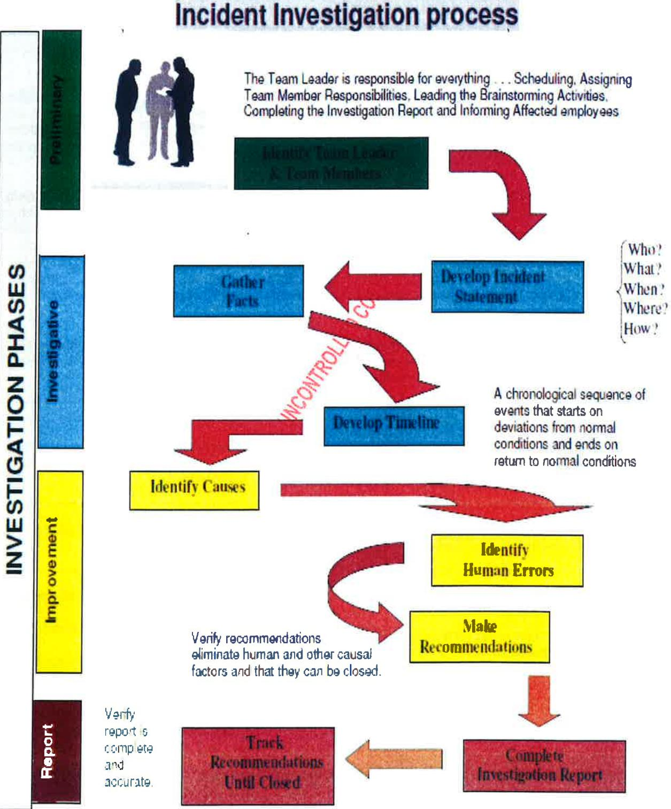

{226}------------------------------------------------

| Issue Status  | 2nd Edition, Rev 0 |
| ------------- | ------------------ |
| Issue Date    | 1st July 2014      |
| Issued by     | DPA                |
| Authorised By | Director PFS       |

- 6.7.1 Investigation Team Responsibilities The investigation team follows the basic investigation procedure outlined in the company incident investigation form. The investigation team is responsible for the following:
  - Completing the investigation as soon as possible
  - Documenting the results, including recommendations
  - Submitting the report to DPA for review, distribution, and communication.
- 6.7.2 Team Leader The investigation team leader is responsible for assigning team member responsibilities, Leading the brainstorming activities, completing the investigation report and informing the effected employees. He also responsible for communicating additional resource required (e.g. expertise) to company management when necessary to properly conduct the investigation.
- 6.7.3 Develop Incident Statement The personnel involved in the event will often not remember the details of the event, including their own actions. The information asked of them to remember is usually not required for the normal performance of their duties. So, there is little reason for them to pay attention to the details typically being asked during an investigation. In most cases, the raw data is needed from personnel: what they saw, what they heard and so on. Investigators are supposed to draw conclusion from the data collected. Please use Witness Statement Form (IMS 07, appendix F) in order to record down their statements. 2
- 6.7.4 Gathering Information This process involves gathering information related to the event(s) in order to understand what occurred. Note that the level of effort should be greater for events with greater actual or potential losses.

| Step                                                                             | Action                                                                                                                                                                                                                                                                                                                                          |
| -------------------------------------------------------------------------------- | ----------------------------------------------------------------------------------------------------------------------------------------------------------------------------------------------------------------------------------------------------------------------------------------------------------------------------------------------- |
| Inspect the scene and the structures/ machinery / equipment/ outfitting involved | Stabilize the vessel / equipment / process in a safe condition. Once stable, secure the area to preserve physical data so it is not disturbed                                                                                                                                                                                                   |
| Obtain on-the-spot information from eyewitnesses, if possible                    | Have witnesses complete an Initial Witness Statement ( Appendix F )                                                                                                                                                                                                                                                                             |
| Schedule interviews with those directly involved as soon as possible             | Interview those who were injured (if any) and others whose input might be useful Interview those directly involved in the incident as soon after the incident as possible Conduct interviews privately and individually so that the comments of one witness will not influence the responses of others Document the results of these interviews |
| Prepare visual aids of the affected physical data for the investigation          | Photographs/sketches Videos                                                                                                                                                                                                                                                                                                                  |
| Determine the physical data that are relevant to the investigation               | Structures Outfitting items                                                                                                                                                                                                                                                                                                                  |
|                                                                                  | Equipment components Product samples                                                                                                                                                                                                                                                                                                         |

{227}------------------------------------------------

IMS 07 - ACCIDENT / INCIDENT / NEAR-MISS / NON-CONFORMANCE REPORTING & INVESTIGATION

| Issue Status  | 2nd Edition, Rev 0 |
| ------------- | ------------------ |
| Issue Date    | 1st July 2014      |
| Issued by     | DPA                |
| Authorised By | Director PFS       |

| Perform the analysis of the equipment components and samples, following the test plan for each                              | When a preliminary analysis reveals that an item / sample may have failed to operate correctly, was damaged, etc. make arrangements to either preserve the items or carefully document any subsequent repairs or modifications. |                                               |                                                             |
| ------------------------------------------------------------------------------------------------------------------------------------ | ------------------------------------------------------------------------------------------------------------------------------------------------------------------------------------------------------------------------------------------- | --------------------------------------------- | ----------------------------------------------------------- |
|                                                                                                                                      | Toolbox Talk                                                                                                                                                                                                                                | PTW                                           | Risk Assessment                                             |
|                                                                                                                                      | Written logs                                                                                                                                                                                                                                | Manuals                                       | Test records                                                |
| Review all sources of potentially useful documentation / information                                                           | Charts                                                                                                                                                                                                                                      | Defect Report                              | Medical report of those involved                         |
|                                                                                                                                      | Previous incident reports                                                                                                                                                                                                                | Safety, hazard, engineering analyses | Training and performance records of those involved |
| Examine the applicable written procedures                                                                                         | Operating procedures                                                                                                                                                                                                                     | Safety Procedures                          | Maintenance Procedures                                   |
| Determine which incident-related items should be preserved, and establish chain-of-custody to control these items / samples | Access to these items should be controlled                                                                                                                                                                                                  |                                               |                                                             |
| Carefully document the sources of information contained in the incident report                                                 | Note: This will be valuable should it subsequently be determined that further study of the incident is necessary                                                                                                                      |                                               |                                                             |

- 6.7.5 Develop a timeline A chronological sequence of events that starts on deviation from normal conditions and ends on return to normal conditions.
- 6.7.6 Determining Causal Factors Identifying root causes is one of the main goals of the incident investigation process, but it is heavily dependent on finding the causal factors. Root cause identification should not be started until the causal factors have been identified. Develop an understanding of the causes of the event by using the fault tree (why tree or causal factor chart).
- 6.7.7 I Identifying the Root Causes For each causal factor, it must be determined why the causal factor existed or occurred. This usually leads to identification of missing, failed or inadequate management systems. These are root cause identification should not begin until all of the causal factors are determined. Jumping to root cause identification before the incident is understood and causal factors are identified may result in:
  - Developing the wrong recommendations
  - Developing ineffective recommendations
  - Recurrence of the incident

It is important to verify that the root causes meet the criteria for a root cause by using the causal factor, root cause and recommendation as given in IMS 07 - Appendix C.

6.7.8 Developing Recommendations - Recommendation are the most important products of the investigation. In addition to addressing the higher-level causes of an incident, recommendation should also address system improvement aimed at a problem's root causes.

{228}------------------------------------------------

| Issue Status  | 2nd Edition, Rev 0 |
| ------------- | ------------------ |
| Issue Date    | 1st July 2014      |
| Issued by     | DPA                |
| Authorised By | Director PFS       |

Recommendations are developed after the data analysis and identification of underlying causes are completed.

Recommendation should be directly tied to causal factors and their underlying causes. Implementing a recommendation should eliminate the causal factors and the underlying root causes. Therefore, it should inhibit and disrupt the sequence of events that led to the loss event.

Most recommendations do not have to be implemented in the short term to continue with operations. For example, a recommendation suggests making improvements to the design development process or a change in the way that purchasing is performed to ensure that the equipment and parts used by the vessel meet appropriate safety, environmental or quality standards. These are good ideas for the long-term operation of the equipment, but they usually do not have to be implemented to ensure proper operation today. As a result, recommendations need to be assigned to someone along with a specific date for completion. The company will also need someone to periodically review the list of unresolved recommendations to keep their implementation on schedule. In most cases, the person who will implement the recommendation is not the person who wrote it. Therefore, the recommendation must clearly state what should be accomplished so that it is carried out as intended.

6.7.9 Reporting - Team leader is responsible for ensuring that, at the conclusion of the investigation, the Accident/Incident/Near-Miss Report Form and Accident/Incident Investigation Form together with all supporting documentation are prepared and submitted to the appropriate Operations, Technical and the HSEQA Department. Root cause(s) identified, where possible, the recommendations for long term corrective / preventative action should be implemented within two weeks of the accident/incident/near-miss,

The report is one of the primary tools used to communicate the results of the investigation. It is the permanent record of what was done during the investigation, including the team's conclusions and recommendations.

Causal factors, root causes and recommendations should be presented in a manner that clearly shows the connection between each of these levels of the investigation. A standard method for presenting this relationship is a table with the causal factors in the first column, the root causes in the second column and the recommendations in the third column.

Fault trees or Why trees and causal factor charts should be included in the report or attached to the report. Fault trees or Whys trees and causal factor charts can often save the investigator additional writing by providing a summary of the including what happened, when it happened, who was involved and how it happened.

Photos shall be included in the simplest of reports. Photos of the scene and equipment can often be great time savers because photos save the writer from generating lengthy descriptions in the report.

6.7.10 Tracking recommendations - All recommendations must be resolved. Resolution does not necessarily require implementation, but it does require an evaluation and justification for the actions that are taken. Failure to document resolutions can increase legal and regulatory liability. In addition, failure to document a change to a resolution during implementation can also increase liability.

Tracking recommendations should continue until implementation of all of the recommendations is complete. The flowchart below, "Tracking Recommendations," illustrates a method for tracking recommendations (from incident investigations, hazard analyses, audits, etc.) to their final resolutions.

{229}------------------------------------------------

| Issue Status  | 2nd Edition, Rev 0 |
| ------------- | ------------------ |
| Issue Date    | 1st July 2014      |
| Issued by     | DPA                |
| Authorised By | Director PFS       |

The final closeout of each report should be documented. The final review of the report should verify that all of the reporting and documentation requirements have been met and that all of the recommendations have been resolved.

# Tracking Recommendations

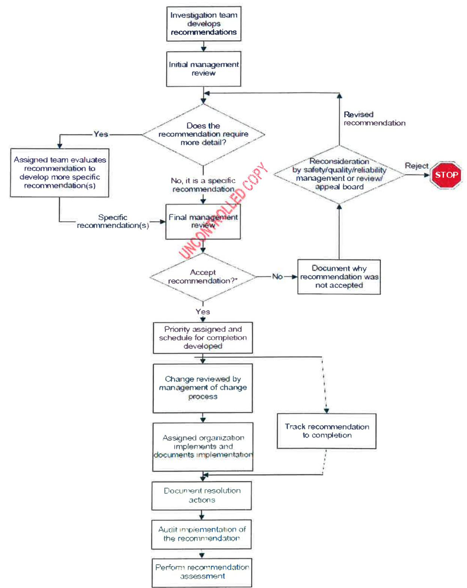

{230}------------------------------------------------

| Issue Status  | 2nd Edition, Rev 0 |
| ------------- | ------------------ |
| Issue Date    | 1st July 2014      |
| Issued by     | DPA                |
| Authorised By | Director PFS       |

- 6.8 When an accident/near miss investigation has been carried out and the root cause(s) identified, the DPA will review and approve or amend the long term action as proposed by the vessel within two weeks.
- 6.9 All significant accident/near misses/non-conformance along with root cause and corrective action shall be circulated among fleet vessels to prevent occurrence on other vessels. The Company may also consider sharing the lessons learned with Industry Groups, Charterers, Classification Societies and Flag States etc. Similarly information gathered from external sources e.g. safety flashes from Classification Societies, Flag State, Industry bodies etc shall be circulated among fleet vessels to prevent occurrence.

# 7.0 MEDICAL REPORT - INJURY AND ILLNESS

7.1 For Medical Reporting of Injuries and Illnesses, see MLC Crewing Manual Appendix C.

Remember that the reporting of ill health can assist in:

- Checking the effectiveness of health control measures. a)
- ﻘ Identifying and protecting personnel from health risks.
- c) Raising awareness of illnesses and promoting preventive measures,

# 8. PROCEDURE FOR COMPANY INVESTIGATION OF ACCIDENTS/INCIDENTS

- 8.1 If the DPA decides to initiate and lead further investigation of the accident of the severity of the accident or incident warrants it), the following procedure will be utilised:
- 8.2 Determining if an in-depth Investigation is needed:
- 8.2.1 Extract from:

IMO RESOLUTION A.884(21), adopted on 25 November 1999

AMENDMENTS TO THE CODE FOR THE INVESTIGATION OF MARINE CASUALTIES AND INCIDENTS (RESOLUTION A.849(20))

2.2 An occurrence may result in serious injury, illness, damage or environmental impact and sometimes all four.

The purpose of a marine casualty or occurrence safety investigation is to prevent recurrence of similar occurrences by identifying and recommending remedial action.

All minor occurrences of high potential in terms of credible result should be subjected to a full investigation.

# 8.2.2 Extract from the ISM Code:

As a minimum, the following information must be gathered:

- Who and what was involved? i.
- il. What happened, where and in what sequence?
- What were the actual or potential losses and their severity? ill.
- iv. What is the likelihood of a recurrence of the chain of events and/or conditions that led to the accident, incident or near-miss?

{231}------------------------------------------------

| Issue Status  | 2nd Edition, Rev 0 |
| ------------- | ------------------ |
| Issue Date    | 1st July 2014      |
| Issued by     | DPA                |
| Authorised By | Director PFS       |

The answers to these questions will determine if an in-depth investigation is needed, or a cursory report will suffice. An in-depth investigation is required if there is a likelihood of recurrence which could have similar or more severe consequences.

- 8.3 Responsibility for carrying out further investigation of serious accidents.
- 8.3.1 HSEQA/DPA will be responsible for convening and leading the investigation.
- 8.3.2 As deemed necessary by HSEQA/DPA, the Operations, Technical, Crewing and Marketing Departments will provide appropriate personnel to participate in the investigation process.
- 8.3.3 The Operations, Technical, Crewing and Marketing Departments will also support HSEQA/DPA in finalising Investigation Reports, disseminating them accordingly (including to Client if required) and ensuring corrective / preventative action is implemented and effective.

UNCONTROLLED COPY

{232}------------------------------------------------

| Issue Status  | 2nd Edition, Rev 0 |
| ------------- | ------------------ |
| Issue Date    | 1st July 2014      |
| Issued by     | DPA                |
| Authorised By | Director PFS       |

# 8.4. Serious Incident Investigation Process.

Events/Condition

Incident occurs, Master reports to Company (DPA, Ops)

Initiate Investigation

In consultation with Ops Management, DPA decides whether to initiate investigation

# Form Investigating Team

If an investigation is necessary, DPA decides on composition of Investigating Team - HSEQA (leading), Ops, Tech, Crewing, Marketing, etc. supporting.

Investigating Team Meets

DPA sets up an initial meeting of investigating team

(ATTENDANCE AND FULL COMMITMENT IS COMPULSORY FOR ALL PERSONNEL NOMINATED TO INVESTIGATING TEAM)

# Investigation

HSEQA leads the Investigating Team.

Investigating Team analyses reports received (including Immediate Action already taken), decides on methodology of investigation and implements accordingly.

Team also decides on the necessity or otherwise to visit the vessel(s) concerned - if so, appropriate personnel are nominated and briefed accordinalv.

Initial Findings & Report

Investigating Team develops an Initial Investigation Report, including Immediate Causes, Root Causes (Management Failures) based on reports received, and Long Term Action to prevent recurrence.

If Client requires, this Initial Investigation Report can be presented to the Client (note : Report may be subject to further development, e.g. additional info, findings from vessel visit, etc.)

The personnel presenting the report to Client to include representation from HSEQA and any other Departments as may e necessary to show "Management Commitment" to the Client

# Final Report and Implementation

Investigating Team develops a Final Investigation Report (developed from the Initial Investigation Report) incorporating all the findings and actions taken / to be taken.

Investigating Team delegates actions to be taken to appropriate personnel

HSEQA Department and representatives from other Departments as necessary present Final Investigation Report to Client.

HSEQA Department follows up on actions to be taken until all are verified fully completed and the investigation is closed out

{233}------------------------------------------------

| Issue Status  | 2nd Edition, Rev 0 |
| ------------- | ------------------ |
| Issue Date    | 1st July 2014      |
| Issued by     | DPA                |
| Authorised By | Director PFS       |

#### 'WHY TREE' ANALYSIS 9.

- To assist the investigating officer in identifying the immediate and root causes of an 9.1 incident/accident, they may wish to utilise the "Why Tree" analysis method. This method simply asks why things happened and prompts the user to think carefully and systematically before drawing conclusions.
- 9.2 Example of a 'Why Tree' analysis

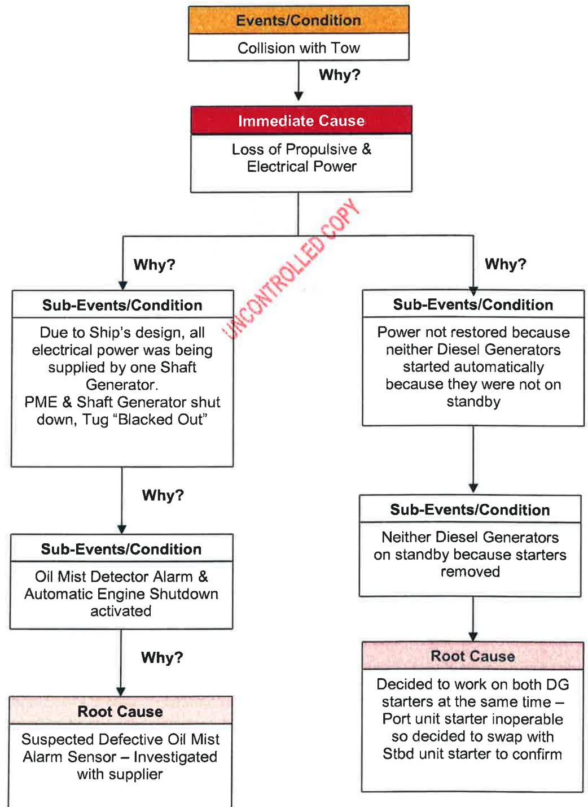

{234}------------------------------------------------

| Issue Status  | 2nd Edition, Rev 0 |
| ------------- | ------------------ |
| Issue Date    | 1st July 2014      |
| Issued by     | DPA                |
| Authorised By | Director PFS       |

#### 10 INSURANCE & CLAIMS

- 10.1 This applies to incidents affecting or possibly affecting the Company's insurance and the reports that are required from the Master.
- 10.2 When incidents occur that are likely to lead to a claim under a particular policy, the Master of the vessel will make direct contact with the Company. The initial report maybe made by phone/email/fax. Prior to issuing any documentation (i.e. Letter of Indemnity, Notes of Protest, photographs, etc), the Master must request instruction from the Company with regard to procedure, documentation, document distribution and retention etc.
- 10.3 Normally, a full Company report is required from the Master and other ship's staff (if appropriate) backed up by relevant information and documentation.
- 10.4 The Master must ensure that he co-operates fully with Head Office personnel and their appointed representatives such as Insurance Surveyors. Prior to co-operation with non-Company representatives, it may be necessary to gain authorisation from the Company.
- 10.5 The Master must ensure that Officers keep detailed notes and times in order that reports can be as accurate as possible.

#### 11 LEGAL DOCUMENTS

- 11.1 General
- 11.2 In general, there are two types of Protest and these should not be confused :
- 11.3 Note of Protest. This is a declaration made by the Master and notarised by a Notary Public wherein the Master declares that circumstances beyond his control (e.g. heavy weather, declaration of general average) have caused loss or damage to cargo or ship. This protest may be extended for up to 6 months after the initial deposition. The original note should include the words "reserving the right to extend the protest at a time and place of convenient". When making a protest, all relevant documents or log extracts, together with witness statements must be presented to the person authorised to take the deposition. The protest should be made within 24 hours of arrival port.
- 11.4 Letter of Protest. A Letter of Protest is a formal letter regarding any matter over which the Master feels there might be a legal dispute or claim, holding the recipient responsible for any consequences of the matter being complained about. The letter can be about many things such as cargo, port, berth and the Master of the other vessels. Should such a letter be received from any source holding a Company vessel liable for any incident, the letter should be signed "for receipt only".

#### 12 DOCUMENT CONTROI

- 12.1 All accident/incident/near miss reports, investigation reports and legal documents must be forwarded to the management, which upon consulting with Legal Department (if necessary), will release them to the external parties. This is to protect the interest of the company, ship and the individual.
- 12.2 At no time should the vessel send these reports directly to external parties, unless specifically instructed to do so by the Company Management.

{235}------------------------------------------------

| Issue Status  | 2nd Edition, Rev 0 |
| ------------- | ------------------ |
| Issue Date    | 1st July 2014      |
| Issued by     | DPA                |
| Authorised By | Director PFS       |

# 13 NON-CONFORMANCE REPORTING AND INVESTIGATION

- 13.1 A non-conformance is where a procedure has not been followed, and it therefore is necessary to find out why.
- 13.2 NC's are usually identified during audits and/or inspections, either by Company personnel, Classification Society auditors, Flag or Port State Inspectors or Charterer's personnel. However, anyone in the Company can raise an NC and report it to the HSEQA Department if it is observed that a procedure is not being followed as it should be.
- 13.3 Note that accidents, incidents and near-misses are not in themselves non-conformances. However, once they have been investigated and it is found that they resulted from a failure to follow a procedure then an NC should be raised accordingly.
- 13.4 Repairs, breakdowns and defects are also not non-conformances unless they directly affect safety and a weakness is identified in the Company's IMS System.
- 13.5 Resources
- 13.5.1 The Company recognises the need to provide the resources to ensure that a non-conformance of any nature is identified and corrective/preventative action taken by:
  - Recording, analysing and making decisions on situations that have resulted in identifying a) a non-conformances.
  - Providing resources to enable corrective/preventative action to be taken when nonb) conformances have been identified.
  - c) Maintaining effective communications to ensure all involved personnel are kept informed.
  - d) Review and update Company IMS where necessary.
- 13.6 Reporting Non-Conformances (NCR's)
- 13.6.1 All seagoing and shore-based staff are encouraged to report non-conformances, either in writing or verbally, to :
  - Their respective Heads of Departments a)
  - b) The Master of the vessel
  - DPA C)
  - d) HSEQA Department
- 13.6.2 The NCR is passed to the responsible manager who will liaise with the HSEQA Department.
- 13.6.3 All non-conformances will be recorded as follows :
  - a) Shibboard non-conformances will be noted by the Master of the vessel and recorded on a Non-Conformance Report.
  - Shore based non-conformances will be brought to the attention of the responsible Heads of Departments and also recorded on a NCR.
  - c) brought to the attention of the Master or Heads of Departments.

{236}------------------------------------------------

| Issue Status  | 2nd Edition, Rev 0 |
| ------------- | ------------------ |
| Issue Date    | 1st July 2014      |
| Issued by     | DPA                |
| Authorised By | Director PFS       |

- As soon as possible upon completion of an internal audit of the vessel, the Auditor shall d) provide the Master with an audit report, a copy of which is also sent to the HSEQA Department
- The audit report must also include any NCR's raised. e)
- 13.6.4 When the HSEQA Department receives an NCR, they will review and control it to ensure that appropriate corrective/preventative action is initiated and followed up with eventual close out.
- 13.6.5 All significant accident/near misses/non-conformance along with root cause and corrective action shall be circulated among fleet vessels to prevent occurrence on other vessels. Similarly information gathered from external sources e.g. safety flashes from Classification Societies, Flag State, Industry bodies etc shall be circulated among fleet vessels to prevent occurrence
- 13.7 Control of non-conforming product
- 13.7.1 Non-conforming products/processes shall be controlled. All non-conforming products process are prohibited from use/put in operation unless;
  - MOC (Management of Change) process (IMS-03) is followed OR a)
  - b) Approval is received from person in-charge in PFS (e.g. DPA, Alt DPA, Tech Superintendent, Crewing Manager etc for ships & Respective Division heads for shore based processes/products).

Page 16

{237}------------------------------------------------

| Issue Status  | 2 nd Edition, Rev 0 |
| ------------- | ------------------------------ |
| Issue Date    | 1 st July 2014      |
| Issued by     | DPA                            |
| Authorised By | Director PFS                   |

| This report shall be sent within 6 hrs of Accident to hseqadept@paccoffshore.com.sg   |
| ------------------------------------------------------------------------------------- |
| ------------------------------------------------------------------------------------- |

| Vessel:                     |     | Report No:         |     |
| --------------------------- | --- | ------------------ | --- |
| Date/Time of Accident:      |     | Vessel Location:   |     |
| Accident location on board: |     | Vessel Activities: |     |
| Weather Condition:          |     |                    |     |

**Personal Details**

| Name of Person: |     | Rank/Nationality: |     |
| --------------- | --- | ----------------- | --- |
| Date of Birth:  |     |                   |     |
| Address:        |     |                   |     |

**Details of Injury**

| Nature of Injury:                               |
| ----------------------------------------------- |
| Part of Body Affected (Shade all that apply) |

Abrasion - area of the skin which has been scraped or rubbed

Burn / Chemical Burn - Burn caused by chemical / water etc

Contusion - Body part has been subjected to a blow from an object

Crush - When a body is smashed between objects

Fracture - Broken bone

Inflammation - Reddening of the skin normally followed by swelling

Inhale of Fumes or gases - Injury related to inhaling of substance

Ingestion - Swallow of chemical etc

Cuts - Laceration

Puncture - When an object enters a body part

Skin Disorder - Rash etc

Sprain - Damage to a joint

Strain - a pulled muscle ie. Back strain from lifting

Others

Brief Description of Accident & Injury( send photos of the injured area):

Nature of First Aid Given:

| Witness/Name/Rank/Sign        |     | Ships Stamp: |     |
| ----------------------------- | --- | ------------ | --- |
| Safety Officer/Name/Rank/Sign |     |              |     |
| Master's Name/Sign:           |     |              |     |

{238}------------------------------------------------

| Vessel Name                     |     | Location          |     |
| ------------------------------- | --- | ----------------- | --- |
| Date/Time of Incident           |     | Charterer         |     |
| Date of this Report             |     | Vessel Activities |     |
| Weather-Wind/Tide/current info: |     |                   |     |

Incident Information ( Provide photos and Sketch as evidence )

| Name of other Vessel / Structure                   |     |
| -------------------------------------------------- | --- |
| Damage to Own Vessel (attach photos)               |     |
| Damage to Other Vessel / Structure (attach photos) |     |
| Any Injuries Reported                              |     |

Description of Incident (Attach additional sheets of statements if required)

Immediate Action Taken

| Witness/Name/Rank/Sign   |     | Ships Stamp: |
| ------------------------ | --- | ------------ |
| C/O or CE Name/Rank/Sign |     |              |
| Master's Name/Sign:      |     |              |

{239}------------------------------------------------

| C-SR MARINE INTEGRATED MANAGEMENT SYSTEM | IMS 07 - APPENDIX C INVESTIGATION REPORT | Issue Status  | 2nd Edition, Rev C |
| ---------------------------------------------- | ------------------------------------------- | ------------- | ------------------ |
|                                                |                                             | Issue Date    | 1st July 2014      |
|                                                |                                             | Issued by     | DPA                |
|                                                |                                             | Authorised By | Director PFS       |

| Brief description of Accident or Incident :              |                                     |                                             |     |
| -------------------------------------------------------- | ----------------------------------- | ------------------------------------------- | --- |
|                                                          |                                     |                                             |     |
|                                                          |                                     |                                             |     |
|                                                          |                                     |                                             |     |
|                                                          |                                     |                                             |     |
|                                                          |                                     |                                             |     |
|                                                          |                                     |                                             |     |
|                                                          |                                     |                                             |     |
|                                                          |                                     |                                             |     |
|                                                          |                                     |                                             |     |
| Immediate Causes : (Tick appropriate box or boxes)       |                                     |                                             |     |
| Not following procedure                                  | Dangerous assumption                | Used poor quality / wrong materials         |     |
| ignoring procedure                                       | Over-rode safety devices            | Didn't make use of resources                |     |
| Inadequate procedure                                     | Foolishness                         | "Bending/Breaking the Rules"                |     |
| Breach of Regulations                                    | Skylarking/Fooling around           | Didn't know how to do the job               |     |
| Not enough care taken                                    | Bravado/"Showing off"               | Didn't realise the danger                   |     |
| Not enough time taken                                    | Daydreaming                         | Ignored risks                               |     |
| Lack of awareness                                        | Carelessness                        | Ignored hazards                             |     |
| Lack of understanding                                    | Cutting Corners                     | Ignored Instruction/Advice/Training         |     |
| Misunderstanding                                         | Used wrong tool                     |                                             |     |
| Wrong assumption                                         | Used poor quality / wrong equipment |                                             |     |
| Others (please describe) :                               |                                     |                                             |     |
|                                                          |                                     |                                             |     |
|                                                          |                                     |                                             |     |
|                                                          |                                     |                                             |     |
|                                                          |                                     |                                             |     |
| Underlying Root Causes : (Tick appropriate box or boxes) |                                     |                                             |     |
| Incorrect procedure                                      | Conflicting responsibilities        | Inexperience                                |     |
| Poor procedure                                           | Bad design                          | Insufficient resources                      |     |
| No procedure                                             | Afraid to ask                       | Insufficient manpower                       |     |
| Didn't know procedure                                    | Assumed someone else would do it    | Did not consider impact on other activities |     |
| Poor Instruction/Advice/Training                         | Forgot to check                     | Complacency                                 |     |
| Insufficient Instruction/Advice/Training                 | Attention distracted                | Lack of Supervision                         |     |
| Wrong Instruction/Advice/Training                        | Too many tasks at once              | Wrong person for the job                    |     |
| Poor planning                                            | Conflicting tasks                   | Incorrect attitude                          |     |
| Poor housekeeping                                        | Fatigue                             | Inattentiveness                             |     |
| Others (please describe) :                               |                                     |                                             |     |
|                                                          |                                     |                                             |     |
|                                                          |                                     |                                             |     |

# Immediate Corrective Action taken:

isf description of Accident or Insid

Signed/Name/Designation/date:

Corrective Action (to prevent recurrence) taken or to be taken (include "Action by" and Completion/Target Completion date) :

Signed/Name/Designation/date:

Preventive Action (To be filled by HSEQA Department) :

Signed/Name/Designation/date:

# Verification of Corrective/Preventive action:

Signed/Name/Designation/date:

# Note: This report must be sent to HSEQADept@paccoffshore.com.sg

{240}------------------------------------------------

| This report shall be sent within 12 hrs of Near Miss to hseqadept@paccoffshore.com.sg   |
| --------------------------------------------------------------------------------------- |
| --------------------------------------------------------------------------------------- |

| Name:                     |     |
| ------------------------- | --- |
| Date of Report:           |     |
| Date & Time of Near Miss: |     |
| Vessel Location:          |     |

# A) Description of Near Miss

| B) Possible Root Cause:                                         |     |
| --------------------------------------------------------------- | --- |
| a) Human                                                        |     |
| b) Machinery                                                    |     |
| c) Procedure/Method                                             |     |
| d) Others (specify, if applicable)                              |     |
| e) Any violation of statutory / regulatory compliance (specify) |     |

# C) Actions and Recommendation

| Description of Corrective/Preventive Actions | Person Responsible for Implementation | Agreed Date of Completion | Actual Date of Completion |
| -------------------------------------------- | ---------------------------------------- | ---------------------------- | ---------------------------- |
|                                              |                                          |                              |                              |
|                                              |                                          |                              |                              |

#### OYes ONo D) Near-miss discussed among ship staff

| Master/Name/Sign |     |
| ---------------- | --- |
| Ship stamp       |     |

# E) Verification of Corrective/Preventive actions

Name/Designation/Sign/Date

{241}------------------------------------------------

| Issue Status  | 2nd Edition, Rev 0 |
| ------------- | ------------------ |
| Issue Date    | 1st July 2014      |
| Issued by     | DPA                |
| Authorised By | Director PFS       |

| Vessel:                |     |
| ---------------------- | --- |
| Location:              |     |
| Date of investigation: |     |

| Attendees: |              |
| ---------- | ------------ |
| Name       | Organisation |
|            |              |
|            |              |
|            |              |
|            |              |
|            |              |
|            |              |
|            |              |
|            |              |
|            |              |
|            |              |
|            |              |
|            |              |

{242}------------------------------------------------

# IMS 07 – APPENDIX E "Y" TREE INVESTIGATION REPORT

| Issue Status  | 2nd Edition, Rev 0 |
| ------------- | ------------------ |
| Issue Date    | 1st July 2014      |
| Issued by     | DPA                |
| Authorised By | Director PFS       |

# 1. Sequence of Events , UNCONTROLLED COPY

{243}------------------------------------------------

| Issue Status  | 2nd Edition, Rev 0 |
| ------------- | ------------------ |
| Issue Date    | 1st July 2014      |
| Issued by     | DPA                |
| Authorised By | Director PFS       |

# Investigation Analysis

2.

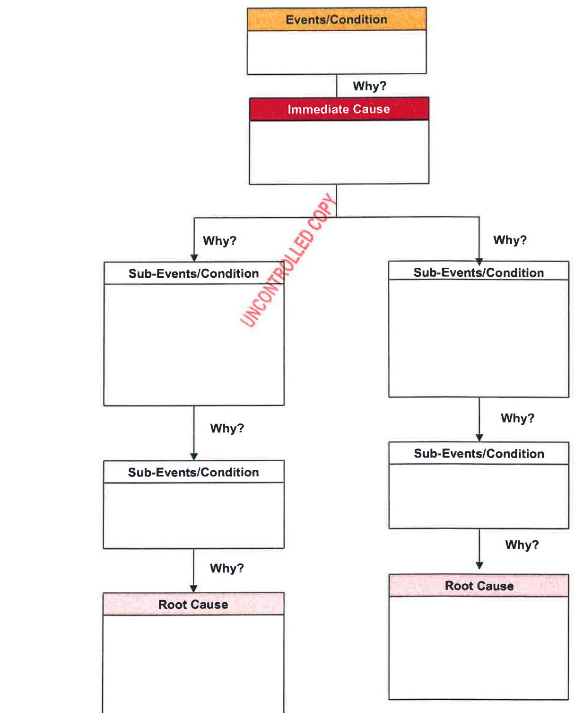

Page 3

{244}------------------------------------------------

# IMS 07 - APPENDIX E "Y" TREE INVESTIGATION REPORT

| Issue Status  | 2nd Edition, Rev 0 |
| ------------- | ------------------ |
| Issue Date    | 1st July 2014      |
| Issued by     | DPA                |
| Authorised By | Director PFS       |

| 3.  | Immediate Corrective Actions taken |
| --- | ---------------------------------- |
|     |                                    |
|     |                                    |
|     |                                    |
|     |                                    |
|     |                                    |
|     |                                    |

# 4.

CONTROLLED COPY

| 5. Completion and Close-out   |
| ----------------------------- |
| ----------------------------- |

| 5a. Completion of Immediate Corrective Actions   |
| ------------------------------------------------ |
| ------------------------------------------------ |

| Date: | Completed by: |
| ----- | ------------- |
| Date: | Completed by: |

| 5b. Completion of Long Term Corrective Actions   |
| ------------------------------------------------ |
| ------------------------------------------------ |

| Date: | To be completed by: |
| ----- | ------------------- |
| Date: | To be completed by: |

Immediate and Long Term Corrective Actions followed up, checked and closed out :

| Closed out by (HSEQA Dept) : |     |
| ---------------------------- | --- |
| Date :                       |     |

{245}------------------------------------------------

| Incident Date and Time | / /                                             |
| ---------------------- | ----------------------------------------------- |
| Type of Incident       | Accident or Near Miss |
| Your Name              |                                                 |
| Title                  |                                                 |
|                        | License or Certificate                          |
| Work Location          |                                                 |
| Work Telephone         |                                                 |

Please write your view of what happened as soon as possible after the incident. Your cooperation in completing this form is appreciated and is an important part of the organization's health, safety, environmental and quality aspect.

Assignment of blame and fault finding are NOT part of the investigation process. Punishment of individuals will ONLY occur in cases of illegal activity such as theft, use of illegal drugs, sabotage, etc.

Please provide information about what you know about incident: Follow the WHO, WHAT, WHEN, WHERE, WHY thought process.

| 1. Names of other people involved or in the area   |     |
| -------------------------------------------------- | --- |
| -------------------------------------------------- | --  |

2. Weather conditions.

3. Anything moved or repositioned following the incident.

4. Training and preparations issues.

{246}------------------------------------------------

# IMS 07 - APPENDIX F Witness Statement Form

| Issue Status  | 2nd Edition, Rev 0 |
| ------------- | ------------------ |
| Issue Date    | 1st July 2014      |
| Issued by     | DPA                |
| Authorised By | Director PFS       |

- 5. What happened? Please include each of the following:
  - · Timing of events (record sequentially and in as much detail as possible)
  - · Location of personnel
  - · Any indicators of the conditions that existed
  - · Actions of other people
  - . Emergency response activities

UNCONTROLLED COPY

{247}------------------------------------------------

# CONTENTS

- Glossary of Terms Relevant to this Procedure
- 1. Scope of this Environmental Management System (EMS)
- 2. Health Safety and Environmental Policy Ethos

# 3. Interactions between the EMS Elements

- 4. Planning
- 4.1 Environmental Aspects
- 4.2 Legal and Other Requirements
- 4.3 Objectives, Targets and Programme(s)
- 5. Implementation and Operation

# Appendices:

11 17

- Appendix A: Register of Environmental Aspects, Identification and Evaluation
- Appendix B: Environmental Performance Report Summary
- Appendix C: SOPEP-SMPEP Oil Spill Response Material
- Appendix D: Register of Environmental Objectives and Targets (Template)

Appendix E: Interaction between EMS Elements

{248}------------------------------------------------

# Glossary of Terms Relevant to this Procedure

Company: SR MARINE Fleet Services Pte. Ltd. (PFS)

Continual Improvement: recuring process of enhancing the environmental management system to achieve improvements in overall environmental performance consistent with the organisation's environmental policy.

Element: a generic component of an environmental management system required by a clause of the international standard; could also be referred to as a process.

Environment: surroundings in which an organisation operates, including air, water, land, natural resources, flora, fauna, humans and their interrelation.

Environmental aspect: an element of an organisation's activities, products or services that can interact with the environment.

Environmental impact: any change to the environment, whether adverse or beneficial, wholly or partially resulting from an organisation's environmental aspects.

Environmental management system: part of an organisation's management system used to develop and implement its environmental policy and manage its environmental aspects; often abbreviated to EMS.

Environmental objective: overall environmental goal, consistent with the environmental policy, that an organisation sets itself to achieve.

Environmental performance: measurable results of an organisation's management of its environmental aspects.

Environmental policy: overall intentions and direction of an organisation related to its environmental performance as formally expressed by top management.

Environmental target: detailed performance requirement applicable to the organisation, that arises from the environmental objectives and that needs to be set in order to achieve those objectives.

Greenhouse Gases: gases in the atmosphere that absorb and emit radiation in the thermal infrared range; give rise to the greenhouse effect; water vapour is the most abundant greenhouse gas, followed by carbon dioxide, others are methane, nitrous oxide, various man-made fluorine compounds and ozone; increasing concentration of carbon dioxide due to human activity is believed to be the main contributor to global warming.

Initial Environmental Review: a review of environmental aspects of an organisation's activities, products and services as a basis for establishing an environmental management system.

Management Review: holistic and strategic determination by top management of the suitability, adequacy and effectiveness of an environmental management system to fulfil commitments made in the environmental policy and achieve the established environmental objectives

Operational Control: process employed to manage environmental aspects, ensure compliance with legal and other requirements, achieve environmental objectives and consistency with commitments in the environmental policy, or avoid or minimise environmental risks

Prevention of Pollution: use of processes, practices, techniques, materials, products, services or energy to avoid, reduce or control (separately or in combination) the creation, emission or discharge of any type of pollutant or waste, in order to reduce adverse environmental impacts; can include source reduction or elimination, process, product or service changes, efficient use of resources, material and energy substitution, reuse, recovery, recycling, reclamation and treatment

{249}------------------------------------------------

Risk Evaluation: process of comparing the level of risk against risk criteria, e.g. the process used in determining significant environmental aspects

Significant Environmental Aspect: an environmental aspect that has or can have a significant environmental impact in the context of an organisation

Standard: a set of requirements for a management system, e.g. ISO 14001:2004

# References

---

The following standards and codes are referenced in this Environmental Management System:

| ISO 14001:2004 | :   | Environmental Management Standard.                                                                     |
| -------------- | --- | ------------------------------------------------------------------------------------------------------ |
| ISO 9001:2008  | :   | Quality Management Standard.                                                                           |
| The ISM Code   | :   | International Standard for the Safe Management and Operation of Ships and for Pollution Prevention. |

# 1. Scope of this Environmental Management System (EMS)

The Company provides Ship management Services on behalf of its Principal(s) and operates under an Integrated Management System (IMS)

The IMS addresses the health, safety and environmental aspects of all PFS shore-based and shipboard ship management activities, specifically the operation of all vessels under its jurisdiction as well as the shore-based HSEQA, Crewing, Technical and Purchasing Management functions of the Company.

This EMS is considered an integral part of the IMS and is applicable to to all operations and services of the Company.

This EMS is a set of interacting processes or elements. Each process or element takes one or more inputs and creates one or more outputs to be passed onto one or more other processes or elements.

This is depicted in the flow diagram (Appendix E) as a "roadmap" to the Company EMS.

#### 2. Health Safety and Environmental Policy Ethos

The Company Health, Safety and Environmental Policy is a statement of commitment from top management and reflects the values and ethos of the organisation. The policy is signed and dated and is reviewed by the management at Management Review Meetings for its appropriateness and legitimacy.

The Company Health, Safety and Environmental Policy is included in IMS 01. It is communicated to all existing staff through being displayed throughout the Company premises and is introduced to new shore-based and seagoing staff during familiarisation inductions.

{250}------------------------------------------------

| Issue Status  | 2nd Edition, Rev 0 |
| ------------- | ------------------ |
| Issue Date    | 1st July 2014      |
| Issued by     | DPA                |
| Authorised By | Director PFS       |

# 3. Interactions between the EMS Elements (Refer to Appendix E)

#### 4. Planning

#### 4.1 Environmental Aspects

PFS has reviewed all of its vessel and office-based activities that it can control and influence, including planned and new developments, activities and has identified all of its environmental aspects. These are listed in Appendix A, Register of Environmental Aspects, Identification and Evaluation.

Each identified environmental aspect is subject to analysis based on the consequences of environmental impact or impact on the organisation from environment-related issues, in the context of existing measures to control the risk. Both positive impacts can be considered. The impact analysis matrix is as follows:

| Significance Evaluation | Consequence Evaluation |                                                                                                                                                                                                                                                                                                                                                                                                   |
| -------------------------- | ---------------------- | ------------------------------------------------------------------------------------------------------------------------------------------------------------------------------------------------------------------------------------------------------------------------------------------------------------------------------------------------------------------------------------------------- |
| HIGHLY SIGNIFICANT      | H                      | May cause severe long-term effects to the environment and known to be hazardous to the environment. Chronic long-term environmental impacts. There are applicable legal and other requirements and SR MARINE is not in compliance or status of compliance is unknown Threat to human life. Third party complaints likely. Loss of customers. May attract media attention. |
| MEDIUM SIGNIFICANT      | M                      | Short-term effect or reversible impact on the environment. No long term cumulative effect. Local community complaints possible. Special handling technique, storing or labeling required by legal and other requirements. There are applicable legal and other requirements and SR MARINE is in compliance.                                                                     |
| NOT SIGNIFICANT         | L                      | Negligible impact on the environment. No applicable legal and other requirements.                                                                                                                                                                                                                                                                                                              |

To Conduct an impact analysis results in the allocating of a significance level of high, medium or low for each environmental aspect.

High or medium environmental aspects are recorded in the Register of Environmental Aspects and are given priority during the establishment, implementation and maintenance of the Company environmental management system.

The Register of Environmental Aspects is reviewed each year to ensure that is kept up to date. It is also reviewed if there is any change to activities or services of the Company.

{251}------------------------------------------------

| Issue Status  | 2nd Edition, Rev 0 |
| ------------- | ------------------ |
| Issue Date    | 1st July 2014      |
| Issued by     | DPA                |
| Authorised By | Director PFS       |

# 4.2 Legal and Other Requirements

The organisation is subject to legal and possibly non-legal requirements regarding the environmental aspects of its operations, and these are taken into account in establishing, implementing and maintaining the Company environmental management system.

Environmental aspects associated with a legal requirement, or another requirement to which the Company subscribes, such as Government policy, are also considered to be significant, regardless of the outcome of the impact analysis.

The Register of Legal and other requirements is listed in IMS 01 and details the statutory IMO and Flag State requirements applicable to the Company and its Fleet, as well as showing how the IMS addresses such requirements. It is maintained by the Company HSEQA Department who are also responsible for reporting on changing legal and other requirements as part of management reviews.

As the Company Fleet operates globally, it may, from time to time, be necessary for Company vessels to comply with local legislation and/or other local requirements. In such cases, the Company must do the following:

- · Ascertain what local legislation and/or other requirements may be applicable,
- · Evaluate the implications of compliance.
- · Develop a Register of applicable local legislation and/or other requirements.
- · Develop and implement whatever procedures and measures may be necessary to ensure compliance.
- · Ensure all appropriate personnel are briefed / trained accordingly,
- · Monitor compliance and report accordingly.

The Company marketing, operational and HSEQA management must work together to ensure the above requirements are met.

# 4.3 Objectives, Targets and Programme(s)

Consistent with the Company environmental policy, measurable objectives and targets are set each year regarding significant environmental aspects and recorded in Appendix D, Register of Environmental Objectives & Targets. The register also lists action plans, improvement programmes and controls for achieving those objectives and targets, as well as key performance indicators (KPIs) to monitor progress in achieving the objectives and targets. The register is revised each year in the management review regarding the extent to which objectives and targets have been met.

#### 5 Implementation and Operation

# 5.1 Resources, Roles, Responsibility and Authority

Various positions in the organisation have roles, responsibilities and authorities for managing environmental aspects, action plans, programs and controls. The roles, responsibility and authority of staff with respect to the environmental management system is defined in IMS 02.

The Company HSEQA Department has responsibility for overall co-ordination of the environmental management system including monitoring of performance and recommendations for improvement to top management for review. The specific tasks associated with this role include:

- Maintenance of the Register of Environmental Aspects (Appendix A)
- Maintenance of the Register of Legal and Other Requirements (IMS 01)
- Maintenance of the Register of Environmental Objectives & Targets (Appendix D)
- Assessment of general environmental awareness of staff and contractors

{252}------------------------------------------------

.

- Control of documents, forms and records required by the EMS
- Co-ordination of environmental monitoring and measurement .
- Evaluation of compliance with legal and other requirements relevant to the EMS .
- Management of the internal audit program , 0
- Co-ordination of corrective and preventive action .
- Co-ordination of management review of the EMS 0

UNCONTROLLED COPY

2nd Edition, Rev 0

1ª July 2014

Director PFS

DPA

{253}------------------------------------------------

| INTEGRATED MANAGEMENT SYSTEM |     |
| ------------------------------- | --- |

# REGISTER OF ENVIRONMENTAL ASPECTS/IMPACTS, IDENTIFICATION AND EVALUATION । ਹਵ IMS 08 - APPENDIX A 1

| Issue Status       | Issue Date    | Issued by | Authorised By |
| ------------------ | ------------- | --------- | ------------- |
| 2nd Edition, Rev 0 | 1st July 2014 | DPA       | Director PFS  |

| INTEGRATED MANAGEMENT SYSTEM                                                                                                                                                             |                               |            |                                                                                  | Issued by                                                        |                                           | DPA Director PFS Authorised By                                                                                                                                                                                                                                                                                                                                                                                                                |
| ------------------------------------------------------------------------------------------------------------------------------------------------------------------------------------------- | ----------------------------- | ---------- | -------------------------------------------------------------------------------- | ---------------------------------------------------------------- | ----------------------------------------- | --------------------------------------------------------------------------------------------------------------------------------------------------------------------------------------------------------------------------------------------------------------------------------------------------------------------------------------------------------------------------------------------------------------------------------------------------- |
| Environmental Aspect Guide: Fuel Oil - Lub/Hyd/Other Oil - Chemical - Paint/Solvent - Exhaust Emission - Food Waste - Paper Waste - Plastic Waste - Metal Waste                          |                               |            |                                                                                  |                                                                  |                                           |                                                                                                                                                                                                                                                                                                                                                                                                                                                     |
| Environmental Impact Guide: Pollution - Sea Pollution - Soil Pollution- Depletion of natural Resources - Fossil Fuel Depletion -Global Warming - Good Company Impact- Noise Pollution |                               |            |                                                                                  | For Significance Évaluation Refer to : IMS 08 Section 4.1. |                                           |                                                                                                                                                                                                                                                                                                                                                                                                                                                     |
|                                                                                                                                                                                             | L = Low                       | M = Medium | Significance Evaluation Legend : H = High                                     |                                                                  |                                           |                                                                                                                                                                                                                                                                                                                                                                                                                                                     |
|                                                                                                                                                                                             | ACTIVITY ANALYSIS             |            |                                                                                  | ENVIRONMENTAL ASPECT IMPACT IDENTIFICATION                       |                                           | REMARKS                                                                                                                                                                                                                                                                                                                                                                                                                                             |
|                                                                                                                                                                                             | Activity / Process / Services |            | Environmental Aspect                                                             | Environmental Impact                                             | Significance Evaluation (L / M / H) | Applicable Legal /other requirements and Current Control                                                                                                                                                                                                                                                                                                                                                                                            |
|                                                                                                                                                                                             | 1- ENGINE 1-1 FUEL         | Fuel / Oil | Fuel consumption Propulsion / ME                                              | Sea pollution                                                    | L                                         | Engine Maintenance-PMS Cleaner Fuel (MGO) on most vessels Consumption reduction programme (slow steaming, weather routing, hull cleaning.,,) EEDI / SEEMP - EEOI REGULATION: SOX: MARPOL ANNEX VI/14 MEPC.132(53) + Directive 2012/33/EU+ MEPC. 190 (60) (North Am ECA) + Marpol VI/3-14 + Turkey Sox 0,1% at berth + CARB regulation + California (01/01/2014) Section 2299,2, title 13, California Code of Regulations (CCR) |
|                                                                                                                                                                                             | 1- ENGINE 1-1 FUEL         | Fuel / Oil | Fuel consumption Propulsion / ME                                              | Depletion of natural ressources                               | M                                         | NOX: MARPOL Nox technical code, Appendix 1. MEPC. 132(53) + Marpol VI/13 Nox Emissions MEPC.176 (58) + 01/07/2016 MARPOL Revised Nox technical file code (Tier III Standard) MEPC. 177 (58) SOX + NOX = MARPOL MEPC.176(58) + 01/01/2014 : MARPOL VI/14 MEPC. 202(62) Carribean eca MARPOL Annex VI IAPP certificate;CARB Regulation                                                                                                 |
|                                                                                                                                                                                             | 1- ENGINE 1-1 FUEL         | Fuel / Oil | Fuel consumption electricity production / Auxiliary engines                | Air pollution                                                    | L                                         | Aux Engine Maintenance - PMS EEDI / SEEMP - EEOI REGULATION: SOX: MARPOL ANNEX VI/14 MEPC.132(53) + Directive 2012/33/EU+ MEPC. 190 (60) (North Am ECA) + Marpol VI/3-14 + Turkey Sox 0,1% at berth + CARB regulation + California (01/01/2014) Section 2299,2, title 13, California Code of Regulations (CCR)                                                                                                                       |
|                                                                                                                                                                                             | 1- ENGINE 1-1 FUEL         | Fuel / Oil | Fuel consumption electricity production / Auxiliary engines                | Depletion of natural ressources                               | L                                         | NOX: MARPOL Nox technical code, Appendix 1. MEPC. 132(53) + Marpol VI/13 Nox Emissions MEPC.176 (58) + 01/07/2016 MARPOL Revised Nox technical file code (Tier III Standard) MEPC. 177 (58) SOX + NOX = MARPOL MEPC.176(58) + 01/01/2014 : MARPOL VI/14 MEPC. 202(62) Carribean eca MARPOL Annex VI IAPP certificate;CARB Regulation                                                                                                 |
|                                                                                                                                                                                             | 1- ENGINE 1-1 FUEL         | Waste      | Waste production : rags for cleaning / oily rags                              | Soil pollution                                                   | L                                         | GMP (Garbage Management Plan) REGULATION: MARPOL Annex V , MEPC.201 (62)                                                                                                                                                                                                                                                                                                                                                                         |
|                                                                                                                                                                                             | 1- ENGINE 1-1 FUEL         | Waste      | Cleaning of the separator disks Waste production : oily rags, carbon waste | Soil pollution                                                   | L                                         | GMP (Garbage Management Plan) REGULATION: MARPOL Annex V , MEPC.201 (62)                                                                                                                                                                                                                                                                                                                                                                         |

{254}------------------------------------------------

|     |                                       |                                                                                                                                                                                                 |                                                                          |                                                                                                      |                                                                                                                                                                                                                                                  |                                           |                                                                                                                                                               | Issue Status                                                                                                                                                                                                                                         | 2nd Edition, Rev 0 |     |
| --- | ------------------------------------- | ----------------------------------------------------------------------------------------------------------------------------------------------------------------------------------------------- | ------------------------------------------------------------------------ | ---------------------------------------------------------------------------------------------------- | ------------------------------------------------------------------------------------------------------------------------------------------------------------------------------------------------------------------------------------------------ | ----------------------------------------- | ------------------------------------------------------------------------------------------------------------------------------------------------------------- | ---------------------------------------------------------------------------------------------------------------------------------------------------------------------------------------------------------------------------------------------------- | ------------------ | --- |
|     |                                       |                                                                                                                                                                                                 |                                                                          |                                                                                                      | IMS 08 - APPENDIX A                                                                                                                                                                                                                              |                                           |                                                                                                                                                               | Issue Date                                                                                                                                                                                                                                           | 1st July 2014      |     |
|     | INTEGRATED                            |                                                                                                                                                                                                 |                                                                          | REGISTER OF ENVIRONMENTAL ASPECTS/IMPACTS, IDENTIFICATION AND EVALUATION                             |                                                                                                                                                                                                                                                  |                                           |                                                                                                                                                               | Issued by                                                                                                                                                                                                                                            | DPA                |     |
|     | MANAGEMENT SYSTEM                     |                                                                                                                                                                                                 |                                                                          |                                                                                                      |                                                                                                                                                                                                                                                  |                                           |                                                                                                                                                               | Authorised By                                                                                                                                                                                                                                        | Director PFS       |     |
|     |                                       | Environmental Aspect Guide: Fuel Oil - Lub/Hyd/Other Oil - Chemical - Paint/Solvent - Exhaust Emission - Food Waste - Paper Waste - Plastic Waste - Metal Waste                              |                                                                          |                                                                                                      |                                                                                                                                                                                                                                                  |                                           |                                                                                                                                                               |                                                                                                                                                                                                                                                      |                    |     |
|     |                                       | Environmental Impact Guide: Air Pollution - Sea Pollution - Soil Pollution- Depletion of natural Resources - Fossil Fuel Depletion -Global Warming - Good Company Impact Noise Pollution  |                                                                          |                                                                                                      |                                                                                                                                                                                                                                                  |                                           |                                                                                                                                                               | For Significance Evaluation Refer to :                                                                                                                                                                                                            |                    |     |
|     |                                       | Significance Evaluation Legend : L = Low M = Medium H = High                                                                                                                                 |                                                                          |                                                                                                      |                                                                                                                                                                                                                                                  |                                           |                                                                                                                                                               | IMS 08 Section 4.1.                                                                                                                                                                                                                                  |                    |     |
|     |                                       | ACTIVITY ANALYSIS                                                                                                                                                                               |                                                                          | ENVIRONMENTAL ASPECT IMPACT IDENTIFICATION                                                           |                                                                                                                                                                                                                                                  |                                           |                                                                                                                                                               | REMARKS                                                                                                                                                                                                                                              |                    |     |
| No. |                                       | Activity / Process / Services                                                                                                                                                                   |                                                                          | Environmental Aspect                                                                                 | Environmental Impact                                                                                                                                                                                                                             | Significance Evaluation (L / M / H)    |                                                                                                                                                               | Applicable Legal /other requirements and Current Control                                                                                                                                                                                             |                    |     |
| 4   |                                       | 1- ENGINE 1-1 FUEL                                                                                                                                                                           |                                                                          | Liquid discharge                                                                                     | Sludge production                                                                                                                                                                                                                                | L                                         |                                                                                                                                                               | Sludge Disposal procedures REGULATION : MARPOL Annex I rules 9 /10/16/19/20/26, ORB Part 1 MEPC. 187(59) Local regulation China : Regulation of the People's republic of China on the prevention and Control of Marine Pollution from Ships |                    |     |
| 5   |                                       | 1- ENGINE 1-1 FUEL                                                                                                                                                                           |                                                                          | Waste                                                                                                | Sludge discharge                                                                                                                                                                                                                                 | L                                         |                                                                                                                                                               | Sludge Disposal procedures REGULATION : MARPOL Annex I rules 9 /10/16/19/20/26, ORB Part 1 MEPC. 187(59) Local regulation China : Regulation of the People's republic of China on the prevention and Control of Marine Pollution from Ships |                    |     |
| 6   |                                       | 1- ENGINE 1-1 FUEL                                                                                                                                                                           |                                                                          | Fuel / Oil                                                                                           | Bunkering Depletion of natural resources                                                                                                                                                                                                   | L                                         |                                                                                                                                                               | Bunkering Procedures-IMS REGULATION : MARPOL, ORB Part 1 MEPC. 187(59)                                                                                                                                                                            |                    |     |
| 7   |                                       | 1- ENGINE 1-2 OIL                                                                                                                                                                            |                                                                          | Fuel / Oil                                                                                           | Lubricating + hydraulic oil Consumption Depletion of natural resources                                                                                                                                                                  | L                                         |                                                                                                                                                               | Proper control and supervision by Tech Supt. WinSDS & Tech Circulars SEEMP                                                                                                                                                                     |                    |     |
|     |                                       |                                                                                                                                                                                                 |                                                                          |                                                                                                      | Air pollution                                                                                                                                                                                                                                    | L                                         |                                                                                                                                                               |                                                                                                                                                                                                                                                      |                    |     |
| 8   |                                       | 1- ENGINE 1-3 SEA WATER                                                                                                                                                                      |                                                                          | Sea Water                                                                                            | Cooling system- heated sea water discharged at sea                                                                                                                                                                                            | L                                         |                                                                                                                                                               | Proper monitoring/control by C/E PMS Controlling hot water/heaters to the time/Temp limited/required                                                                                                                                           |                    |     |
|     |                                       |                                                                                                                                                                                                 |                                                                          | Chemical                                                                                             | Ballast Water - Sea exchange ballast system Introduction / Mooving of invasive species (Sea water Pumping and reject for vessel stability) Cleaning agents Cleaning engine, deck, galley , living quarters (grease remover) | L                                         |                                                                                                                                                               | BWMP (Ballast Water Management Plan) Garbage Management Plan GMP REGULATION : MARPOL Annex V , MEPC.201 (62)                                                                                                                                   |                    |     |
|     |                                       | ACTIVITY ANALYSIS                                                                                                                                                                               |                                                                          |                                                                                                      | ENVIRONMENTAL ASPECT IMPACT IDENTIFICATION                                                                                                                                                                                                       |                                           |                                                                                                                                                               |                                                                                                                                                                                                                                                      | REMARKS            |     |
| No. |                                       | Activity / Process / Services                                                                                                                                                                   |                                                                          | Environmental Aspect                                                                                 | Environmental Impact                                                                                                                                                                                                                             | Significance Evaluation (L / M / H) |                                                                                                                                                               | Applicable Legal /other requirements and Current Control                                                                                                                                                                                             |                    |     |
| 9   | 1- ENGINE                             | 1-4 CONSUMABLES                                                                                                                                                                              | Waste                                                                    | Paint waste production: paint brushes, rags                                                    | Soil pollution                                                                                                                                                                                                                                   | L                                         | DPA Letter 12-013 Garbage Management Plan - Green Ship EN - DPA letter 11-007 - GMP REGULATION: MARPOL Annex V , MEPC.201 (62)                             |                                                                                                                                                                                                                                                      |                    |     |
|     |                                       |                                                                                                                                                                                                 | Chemical                                                                 | Antifouling paint                                                                                    | Sea pollution                                                                                                                                                                                                                                    | L                                         | TBT Free anti fouling paints in use                                                                                                                           |                                                                                                                                                                                                                                                      |                    |     |
|     |                                       |                                                                                                                                                                                                 | Chemical                                                                 | Treatment products chemical products/MSDS                                                         | Sea pollution                                                                                                                                                                                                                                    | L                                         | Garbage Management Plan GMP REGULATION: MARPOL Annex V , MEPC.201 (62)                                                                                     |                                                                                                                                                                                                                                                      |                    |     |
|     |                                       |                                                                                                                                                                                                 | Waste                                                                    | Cleaning agent / Paint / treatment products waste production: empty drums - tins management | Soil pollution                                                                                                                                                                                                                                   | L                                         | Garbage Management Plan GMP REGULATION: MARPOL Annex V , MEPC.201 (62)                                                                                     |                                                                                                                                                                                                                                                      |                    |     |
| 10  | 1- ENGINE                             | 1-5 SPARE PARTS                                                                                                                                                                              | Waste                                                                    | packaging waste : Chips/ cardboard/ plastic                                                       | Soil pollution                                                                                                                                                                                                                                   | L                                         | Garbage Management Plan GMP                                                                                                                                   |                                                                                                                                                                                                                                                      |                    |     |
|     |                                       |                                                                                                                                                                                                 |                                                                          | used pieces production                                                                               | Soil pollution                                                                                                                                                                                                                                   | L                                         | REGULATION: MARPOL Annex V , MEPC.201 (62)                                                                                                                    |                                                                                                                                                                                                                                                      |                    |     |
| 11  | 1- ENGINE                             | 1-6 OILY WATER                                                                                                                                                                                  | Sea Water                                                                | oily water 15 ppm discharged at sea                                                               | Sea pollution                                                                                                                                                                                                                                    | L                                         | Shipboard maintenance REGULATION: MARPOL Annex I special Area Designation MEPC. 154(55) - Southern African waters                                       |                                                                                                                                                                                                                                                      |                    |     |
|     |                                       |                                                                                                                                                                                                 | Waste                                                                    | waste : used filters ( oily) production                                                           | Soil pollution                                                                                                                                                                                                                                   | L                                         | Garbage Management Plan GMP REGULATION: MARPOL Annex V , MEPC.201 (62)                                                                                     |                                                                                                                                                                                                                                                      |                    |     |
| 12  | 1- ENGINE                             | 1-7 AIR CONDITIONNING                                                                                                                                                                        | Refrigerant gaz                                                          | refrigerant gases - vessel air conditionning maintenance and repair                            | Air pollution                                                                                                                                                                                                                                    | M                                         | PMS, Control action plan: training, vessel audits,conformity tool kit provided to vessels REGULATION: CFCS MARPOL MEPC.176(58) Europe HCFC 2037/2000/EC |                                                                                                                                                                                                                                                      |                    |     |
| 13  | 1- ENGINE                             | 1-8 REEFERS                                                                                                                                                                                     | Refrigerant gaz                                                          | refrigerant gases- reefer cntrs maintenance and repair                                         | Air pollution                                                                                                                                                                                                                                    | L                                         | Control action plan: training, vessel audits,conformity tool kit provided to vessels REGULATION: Europe HCFC 2037/2000/EC CFCS : MARPOL MEPC.176(58)    |                                                                                                                                                                                                                                                      |                    |     |
| 14  | 2- HOSPITAL                           |                                                                                                                                                                                                 | Waste                                                                    | Health care waste production out of date medicine                                                 | Soil pollution                                                                                                                                                                                                                                   | L                                         | Garbage Management Plan GMP REGULATION: MARPOL Annex V , MEPC.201 (62)                                                                                     |                                                                                                                                                                                                                                                      |                    |     |
|     |                                       |                                                                                                                                                                                                 |                                                                          | medical oxygen                                                                                       | Soil pollution                                                                                                                                                                                                                                   | L                                         |                                                                                                                                                               |                                                                                                                                                                                                                                                      |                    |     |
|     |                                       |                                                                                                                                                                                                 |                                                                          |                                                                                                      |                                                                                                                                                                                                                                                  |                                           | Issue Status                                                                                                                                                  | 2nd Edition, Rev 0                                                                                                                                                                                                                                   |                    |     |
|     | SR MARINE                             |                                                                                                                                                                                                 |                                                                          | IMS 08 - APPENDIX A                                                                                  |                                                                                                                                                                                                                                                  |                                           | Issue Date                                                                                                                                                    | 1st July 2014                                                                                                                                                                                                                                        |                    |     |
|     | INTEGRATED                            |                                                                                                                                                                                                 | REGISTER OF ENVIRONMENTAL ASPECTS/IMPACTS, IDENTIFICATION AND EVALUATION |                                                                                                      |                                                                                                                                                                                                                                                  |                                           | Issued by                                                                                                                                                     | DPA                                                                                                                                                                                                                                                  |                    |     |
|     | MANAGEMENT SYSTEM                     |                                                                                                                                                                                                 |                                                                          |                                                                                                      |                                                                                                                                                                                                                                                  |                                           | Authorised By                                                                                                                                                 | Director PFS                                                                                                                                                                                                                                         |                    |     |
|     |                                       | Environmental Aspect Guide : Fuel Oil - Lub/Hyd/Other Oil - Chemical - Paint/Solvent - Exhaust Emission - Food Waste - Paper Waste - Plastic Waste - Metal Waste                                |                                                                          |                                                                                                      |                                                                                                                                                                                                                                                  |                                           |                                                                                                                                                               |                                                                                                                                                                                                                                                      |                    |     |
|     |                                       | Environmental Impact Guide : Air Pollution - Sea Pollution - Soil Pollution- Depletion of natural Resources - Fossil Fuel Depletion -Global Warming - Good Company Impact Noise Pollution |                                                                          |                                                                                                      |                                                                                                                                                                                                                                                  |                                           | For Significance Evaluation Refer to : IMS 08 Section 4.1.                                                                                              |                                                                                                                                                                                                                                                      |                    |     |
|     |                                       |                                                                                                                                                                                                 | Significance Evaluation Legend : L= Low M = Medium H = High           |                                                                                                      |                                                                                                                                                                                                                                                  |                                           |                                                                                                                                                               |                                                                                                                                                                                                                                                      |                    |     |
|     | ACTIVITY ANALYSIS                     |                                                                                                                                                                                                 |                                                                          | ENVIRONMENTAL ASPECT IMPACT IDENTIFICATION                                                           |                                                                                                                                                                                                                                                  |                                           | REMARKS                                                                                                                                                       |                                                                                                                                                                                                                                                      |                    |     |
| No. | Activity / Process / Services         |                                                                                                                                                                                                 | Environmental Aspect                                                     | Environmental Impact                                                                                 | Significance Evaluation (L/M/H)                                                                                                                                                                                                            |                                           | Applicable Legal /other requirements and Current Control                                                                                                      |                                                                                                                                                                                                                                                      |                    |     |
| 5   | 3- Living quarters / Accomodations |                                                                                                                                                                                                 | Waste                                                                    | recycable waste production ( galley + accomodations)                                              | Soil pollution                                                                                                                                                                                                                                   | L                                         | Garbage Management Plan GMP REGULATION : MARPOL Annex V , MEPC.201 (62)                                                                                    |                                                                                                                                                                                                                                                      |                    |     |
|     |                                       |                                                                                                                                                                                                 |                                                                          | non-recycable waste production( galley + accomodations)                                           | Soil pollution                                                                                                                                                                                                                                   | L                                         | Garbage Management Plan GMP REGULATION : MARPOL Annex V , MEPC.201 (62)                                                                                    |                                                                                                                                                                                                                                                      |                    |     |
|     |                                       |                                                                                                                                                                                                 |                                                                          | dangerous waste production ( galley + accomodations)                                              | Soil pollution                                                                                                                                                                                                                                   | L                                         | Garbage Management Plan GMP REGULATION : MARPOL Annex V , MEPC.201 (62)                                                                                    |                                                                                                                                                                                                                                                      |                    |     |
| 6   | 3- Living quarters / Accomodations |                                                                                                                                                                                                 | Liquid discharge                                                         | Sewage/ Grey waters (Laundry cleaning agent , hospital                                            | Sea pollution                                                                                                                                                                                                                                    | L                                         | Sewage discharge control.treatment/holding tanks REGULATION : Marpol Annex IV/9 (MEPC.115,51)                                                              |                                                                                                                                                                                                                                                      |                    |     |
|     |                                       |                                                                                                                                                                                                 |                                                                          | Sewage / Black waters                                                                                | Sea pollution                                                                                                                                                                                                                                    | L                                         | Europe : port reception facilities : Directive 2007/11/EC Garbage Management Plan                                                                          |                                                                                                                                                                                                                                                      |                    |     |
| 7   | 3- Living quarters Accomodations   |                                                                                                                                                                                                 |                                                                          | Consumable ( paper, ink cartridge ...)                                                            | Depletion of natural ressources                                                                                                                                                                                                               | L                                         | Garbage Management Plan GMP REGULATION : MARPOL Annex V , MEPC.201 (62)                                                                                    |                                                                                                                                                                                                                                                      |                    |     |
| 8   | 3- Living quarters Accomodations   |                                                                                                                                                                                                 |                                                                          | Electricity Consumption (Light, computers, electrical appliances etc)                          | CO2 emission, Global warming                                                                                                                                                                                                                     | M                                         | 1. Change to fluoroscent lamps 2. Switching off lights wehen not in use 3. Switching off/pluggin out all appliances after use.                          |                                                                                                                                                                                                                                                      |                    |     |
|     |                                       |                                                                                                                                                                                                 |                                                                          | food supply                                                                                          | Soil pollution                                                                                                                                                                                                                                   | L                                         |                                                                                                                                                               |                                                                                                                                                                                                                                                      |                    |     |
| 9   | 4- Galley                             |                                                                                                                                                                                                 | Waste                                                                    | cooking oil waste production                                                                         | Sea pollution                                                                                                                                                                                                                                    | L                                         | Garbage Management Plan GMP REGULATION : MARPOL Annex V , MEPC.201 (62)                                                                                    |                                                                                                                                                                                                                                                      |                    |     |
|     |                                       |                                                                                                                                                                                                 |                                                                          | food waste production                                                                                | Sea pollution                                                                                                                                                                                                                                    | L                                         |                                                                                                                                                               |                                                                                                                                                                                                                                                      |                    |     |
| 10  | 4- Galley                             |                                                                                                                                                                                                 | Refrigerant gaz                                                          | refrigerant gases - "food cold rooms" maintenance and repair                                   | Air pollution                                                                                                                                                                                                                                    | L                                         | Control action plan: training, vessel audits,conformity tool kit provided to vessels REGULATION : Europe HCFC 2037/2000/EC CFCs : MARPOL MEPC.176(58)   |                                                                                                                                                                                                                                                      |                    |     |
| 11  | 5- Deck                               |                                                                                                                                                                                                 | Waste                                                                    | waste : used neon bulbs waste production ( batteries, ..)                                         | Soil pollution                                                                                                                                                                                                                                   | L                                         | Garbage Management Plan GMP REGULATION : MARPOL Annex V , MEPC.201 (62)                                                                                    |                                                                                                                                                                                                                                                      |                    |     |
| 12  | 6- Bridge                             |                                                                                                                                                                                                 | Waste                                                                    | waste paper production used cartridges                                                            | Soil pollution                                                                                                                                                                                                                                   | L                                         | Garbage Management Plan GMP REGULATION : MARPOL Annex V , MEPC.201 (62)                                                                                    |                                                                                                                                                                                                                                                      |                    |     |
| 13  | 7 - Crew travel                       |                                                                                                                                                                                                 | Fuel / Oil                                                               | Crew travel Energy consumption                                                                       | Air pollution                                                                                                                                                                                                                                    | L                                         | Proper crew rotation plan.                                                                                                                                    |                                                                                                                                                                                                                                                      |                    |     |

{255}------------------------------------------------

{256}------------------------------------------------

ﺎﺕ ﺍﻟﻤﺘﺤﺪﺓ ﺍﻟﻤﺘﺤﺪﺓ ﺍﻟﻤﺘﺤﺪﺓ ﺍﻟﻤﺘﺤﺪﺓ ﺍﻟﻤﺘﺤﺪﺓ ﺍﻟﻤﺘﺤﺪﺓ ﺍﻟﻤﺘﺤﺪﺓ ﺍﻟﻤﺘﺤﺪﺓ ﺍﻟﻤﺘﺤﺪﺓ ﺍﻟﻤﺘﺤﺪﺓ ﺍﻟﻤﺘﺤﺪﺓ ﺍﻟﻤﺘﺤﺪﺓ ﺍﻟﻤﺘﺤﺪﺓ ﺍﻟﻤﺘﺤﺪﺓ ﺍﻟﻤﺘﺤﺪﺓ ﺍﻟﻤﺘﺤﺪﺓ ﺍﻟﻤﺘﺤﺪﺓ ﺍﻟﻤﺘﺤﺪﺓ ﺍﻟﻤﺘﺤﺪﺓ ﺍﻟﻤﺘﺤﺪﺓ ﺍﻟﻤﺘﺤﺪﺓ ﺍﻟ

{257}------------------------------------------------

|               | INTEGRATED         | MANAGEMENT SYSTEM |
| ------------- | ------------------ | ----------------- |
| Issue Status  | 2nd Edition, Rev 0 |                   |
| Issue Date    | 1st July 2014      |                   |
| Issued by     | DPA                |                   |
| Authorised By | Director PFS       |                   |

# REGISTER OF ENVIRONMENTAL ASPECTS/IMPACTS, IDENTIFICATION AND EVALUATION i IMS 08 - APPENDIX A

|     | Fuel Oil - Lub/Hyd/Other Oil - Chemical - Paint/Solvent - Exhaust Emission - Food Waste - Paper Waste - Plastic Waste - Metal Waste                               |         | Environmental Aspect Guide :                            |                                                                                                                                                        |                                           |                                                                                                                                                                                               |     |
| --- | ----------------------------------------------------------------------------------------------------------------------------------------------------------------- | ------- | ------------------------------------------------------- | ------------------------------------------------------------------------------------------------------------------------------------------------------ | ----------------------------------------- | --------------------------------------------------------------------------------------------------------------------------------------------------------------------------------------------- | --- |
|     | Air Pollution - Sea Pollution - Soil Pollution- Depletion of natural Resources - Fossil Fuel Depletion -Global Warming - Good Company Impact - Noise Pollution |         | Environmental Impact Guide :                            |                                                                                                                                                        |                                           | For Significance Evaluation Refer to : IMS 08 Section 4.1.                                                                                                                              |     |
|     |                                                                                                                                                                   | L = Low | Significance Evaluation Legend : M = Medium H = High |                                                                                                                                                        |                                           |                                                                                                                                                                                               |     |
|     | ACTIVITY ANALYSIS                                                                                                                                                 |         |                                                         | ENVIRONMENTAL ASPECT IMPACT IDENTIFICATION                                                                                                             |                                           | REMARKS                                                                                                                                                                                       |     |
| No. | Activity / Process / Services                                                                                                                                     |         | Environmental Aspect                                    | Environmental Impact                                                                                                                                   | Significance Evaluation (L / M / H) | Applicable Legal /other requirements and Current Control                                                                                                                                      |     |
| 4   | 8- Abnormal -All activites                                                                                                                                     |         | Emergency                                               | Fire                                                                                                                                                   |                                           | Proper work procedures, PMS, Emergency Response Plan - IMS18                                                                                                                               |     |
| 5   | 9- Abnormal -All activites                                                                                                                                     |         | Emergency                                               | Explosion                                                                                                                                              |                                           | Proper work procedures, PMS, Emergency Response Plan - IMS18                                                                                                                               |     |
| 6   | 9- Abnormal -All activites                                                                                                                                     |         | Emergency                                               | Heavy damage (collision, flooding, emergency steering, engine damage, grounding, sinking, heavy weather)                                   |                                           | Proper work procedures, PMS, Emergency Response Plan - IMS18                                                                                                                               |     |
| 7   | 10- Abnormal -All activites                                                                                                                                    |         | Emergency                                               | Spill / leakage ( oil / chemicals)                                                                                                                     |                                           | Proper work procedures, PMS, Emergency Response Plan - IMS18                                                                                                                               |     |
| 8   | 10- Abnormal -All activites                                                                                                                                    |         | Emergency                                               | Dysfonction that create abnormal release to sea (bunkering, debunkering, waste, ballast, sewage treatment plant, 15 ppm, sludge discharge) |                                           | Bunkering Procedures-IMS Emergency Response Plan - IMS18 SOPEP/SMPEP                                                                                                                    |     |
| 9   | 10- Abnormal -All activites                                                                                                                                    |         | Emergency                                               | refrigerant gases release to the air (vessel/office air conditionning, reefer cntrs, food cold room)                                             |                                           | Control action plan: training, vessel audits, conformity tool kit provided to vessels REGULATION : Europe HCFC 2037/2000/EC CFCS : MARPOL MEPC.176(58) France : Arrêté du 30/06/2008 |     |
| 10  | 11- OFFICE                                                                                                                                                        |         | Fuel / Oil                                              | Office Energy consumption (lighting, cooling system, computers)                                                                                  | M                                         | 1. Change to fluoroscent lamps 2. Switching off lights when not in use 3. Switching off all computers after use. 4. Switching off all Aircons after use.                             |     |
| 11  | 11- OFFICE                                                                                                                                                        |         | Waste                                                   | Waste production ( paper/cardboard, ink cartridges, EEE waste, plastics)                                                                         | L                                         | Eco-friendly actions                                                                                                                                                                          |     |
| 12  | 11- OFFICE                                                                                                                                                        |         | Refrigerant gaz                                         | refrigerant gases release to the air - office air conditionning maintenance and repair                                                           | H                                         | Maintenace by apoproved maker's service engineers                                                                                                                                             |     |
| 13  | 11- OFFICE                                                                                                                                                        |         | Fuel / Oil                                              | Travel (Superintendant business trip, from home to HO)                                                                                              | L                                         | Proper planning of trips                                                                                                                                                                      |     |
| 14  | 11- OFFICE                                                                                                                                                        |         |                                                         | Consumable ( paper, ink cartridge. ...)                                                                                                                | L                                         | Eco-friendly actions E-learning                                                                                                                                                            |     |
|     |                                                                                                                                                                   |         |                                                         |                                                                                                                                                        |                                           |                                                                                                                                                                                               |     |

{258}------------------------------------------------

|                                                |       |                                                 | IMS-08 APPENDIX B ENVIRONMENTAL PERFORMANCE REPORT SUMMARY |                               |                |          |                     |                                     |                                            |              |      |                     |                     | Issue Status     | 2nd Edition, Rev 0 |                      |                     |
| ---------------------------------------------- | ----- | ----------------------------------------------- | ------------------------------------------------------------- | ----------------------------- | -------------- | -------- | ------------------- | ----------------------------------- | ------------------------------------------ | ------------ | ---- | ------------------- | ------------------- | ---------------- | ------------------ | -------------------- | ------------------- |
| INTEGRATED MANAGEMENT SYSTEM                |       |                                                 |                                                               |                               |                |          |                     |                                     |                                            |              |      |                     |                     | Issue Date       | 1st July 2014      |                      |                     |
|                                                |       |                                                 |                                                               |                               |                |          |                     |                                     |                                            |              |      |                     |                     | Issued By        | DPA                |                      |                     |
| NAME OF VESSEL:                                |       |                                                 |                                                               |                               |                |          |                     |                                     | Ship fitted with IMO Approved Incinerator? | No           |      |                     |                     |                  |                    |                      |                     |
| ENVIRONMENTAL PERFORMANCE REPORT SUMMARY (YEAR |       |                                                 |                                                               |                               |                |          |                     |                                     |                                            |              |      |                     |                     |                  |                    |                      |                     |
|                                                |       |                                                 |                                                               | GARBAGE DISPOSAL              |                |          |                     | PAPER                               |                                            |              |      | REFRIGERANT         |                     |                  | Fuel Oil           | SLUDGE               |                     |
| S.NO                                           | Month | At Sea                                          | Landed ashore                                                 | Sent to Offshore Installation | Incinerate d\* | Total m3 | ROB from last month | Reams (500s) Received this month | ROB End Of month                           | Consump tion | Type | ROB from last month | Received this month | ROB End of Month | Consump tion       | Fuel Oil Consumed MT | SLUDGE Generated m3 |
| 1                                              | Jan   |                                                 |                                                               |                               | NA             | 0.00     |                     |                                     |                                            | 0.00         |      |                     |                     |                  | 0.00               | 0.00                 | 0.00                |
| 2                                              | Feb   |                                                 |                                                               |                               | NA             | 0.00     |                     |                                     |                                            | 0.00         |      |                     |                     |                  | 0.00               | 0.00                 | 0.00                |
| 3                                              | Mar   |                                                 |                                                               |                               | NA             | 0.00     |                     |                                     |                                            | 0.00         |      |                     |                     |                  | 0.00               | 0.00                 | 0.00                |
| 4                                              | Apr   |                                                 |                                                               |                               | NA             | 0.00     |                     |                                     |                                            | 0.00         |      |                     |                     |                  | 0.00               | 0.00                 | 0.00                |
| 5                                              | May   |                                                 |                                                               |                               | NA             | 0.00     |                     |                                     |                                            | 0.00         |      |                     |                     |                  | 0.00               | 0.00                 | 0.00                |
| 6                                              | June  |                                                 |                                                               |                               | NA             | 0.00     |                     |                                     |                                            | 0.00         |      |                     |                     |                  | 0.00               | 0.00                 | 0.00                |
| 7                                              | July  |                                                 |                                                               |                               | NA             | 0.00     |                     |                                     |                                            | 0.00         |      |                     |                     |                  | 0.00               | 0.00                 | 0.00                |
| 8                                              | Aug   |                                                 |                                                               |                               | NA             | 0.00     |                     |                                     |                                            | 0.00         |      |                     |                     |                  | 0.00               | 0.00                 | 0.00                |
| 9                                              | Sep   |                                                 |                                                               |                               | NA             | 0.00     |                     |                                     |                                            | 0.00         |      |                     |                     |                  | 0.00               | 0.00                 | 0.00                |
| 10                                             | Oct   |                                                 |                                                               |                               | NA             | 0.00     |                     |                                     |                                            | 0.00         |      |                     |                     |                  | 0.00               | 0.00                 | 0.00                |
| 11                                             | Nov   |                                                 |                                                               |                               | NA             | 0.00     |                     |                                     |                                            | 0.00         |      |                     |                     |                  | 0.00               | 0.00                 | 0.00                |
| 12                                             | Dec   |                                                 |                                                               |                               |                | 0.00     |                     |                                     |                                            | 0.00         |      |                     |                     |                  | 0.00               | 0.00                 | 0.00                |
|                                                |       |                                                 | 0.00                                                          | 0.00                          | 0.00           | 0.00     | 0.00                | 0.00                                | 0.00                                       | 0.00         |      |                     | 0.00                |                  | 0.00               | 0.00                 | 0.00                |
| REMARKS (IF ANY)                               |       | On ships fitted with IMO Approved Incinerators. |                                                               |                               |                |          |                     |                                     |                                            |              |      |                     |                     |                  |                    |                      |                     |

Page 1

{259}------------------------------------------------

| Issue Status  | 2nd Edition, Rev 0 |
| ------------- | ------------------ |
| Issue Date    | 1st July 2014      |
| Issued by     | DPA                |
| Authorised By | Director PFS       |

All vessels must carry following SOPEP/Oil Spill response material.

| S.N. | Item                                                                          | Quantity | UOM |
| ---- | ----------------------------------------------------------------------------- | -------- | --- |
| 1    | Safety Goggles                                                                | 5        | PCS |
| 2    | Rubber Boots Long                                                             | 5        | PRS |
| 3    | Rubber Gloves                                                                 | 5        | PRS |
| 4    | Rain coat with hood                                                           | 2        | PCS |
| 5    | Sprayer (Hand pump) Shoulder Type 10 Ltr                                      | 4        | SET |
| 6    | Cotton Rags Sterilized                                                        | 100      | KG  |
| 7    | Sand                                                                          | 100      | KG  |
| 8    | Cement Portland                                                               | 40       | KG  |
| 9    | Oil absorbent pads (sheet) 43cmx48cm 100's/Pkt                                | 10       | PKT |
| 10   | Absorbent Granules                                                            | 200      | KG  |
| 11   | Sawdust                                                                       | 100      | KG  |
| 12   | Oil Dispersant                                                                | 200      | Ltr |
| 13   | Shovels                                                                       | 5        | PCS |
| 14   | Plastic Bucket                                                                | 5        | PCS |
| 15   | Bailer/Scoop                                                                  | 2        | PCS |
| 16   | Deck Brush 300mm w/long handle                                                | 5        | PCS |
| 17   | Deck Brush 450mm w/long handle                                                | 2        | PCS |
| 18   | Scraper Deck 2" w/long handle                                                 | 6        | PCS |
| 19   | Scraper Deck 3" w/long handle                                                 | 6        | PCS |
| 20   | Scraper Deck 4" w/long handle                                                 | 6        | PCS |
| 21   | Rubber Squeegee 400mm w/long handle                                           | 5        | PCS |
| 22   | SOPEP Drum Fiberglass W/Cover Size 127cm (L)x76cm(W)x76cm(H), Yellow Color | 1        | PCS |
| 23   | Scupper Plugs                                                                 | 12       | PCS |

Note:

1. SOPEP equipment shall not be used for any other purpose. Equipment shall be inspected by Chief Officer monthly.

2. Additional material may be required as per local rules depending upon vessel's deployment/charter.

{260}------------------------------------------------

| 2nd Edition, Rev 0 | 1st July 2014       | DPA                                  | Director PFS      | Responsible Staff |                     |     |     |
| ------------------ | ------------------- | ------------------------------------ | ----------------- | ----------------- | ------------------- | --- | --- |
| Issue Status       | ssue Date           | lssued by                            | Authorised By     |                   |                     | -   |     |
|                    | IMS 08 - APPENDIX D | ENVIRONMENTAL OBJECTIVES AND TARGETS |                   | Action Plan       | Chapting Learn Copy |     |     |
|                    |                     |                                      |                   | Target            |                     |     |     |
|                    |                     |                                      |                   | Objective         |                     |     |     |
| C-SR MARINE        |                     | INTEGRATED                           | MANAGEMENT SYSTEM | Aspect            |                     |     |     |
|                    |                     |                                      |                   | No.               |                     |     |     |

Note: The Environmental objectives and targets will be communicated through circular.

{261}------------------------------------------------

Interactions between the EMS Elements IMS 08 APPENDIX E

| Issue Status  | 2nd Edition, Rev 0 |
| ------------- | ------------------ |
| Issue Date    | 1st July 2014      |
| Issued by     | DPA                |
| Authorised By | Director PFS       |

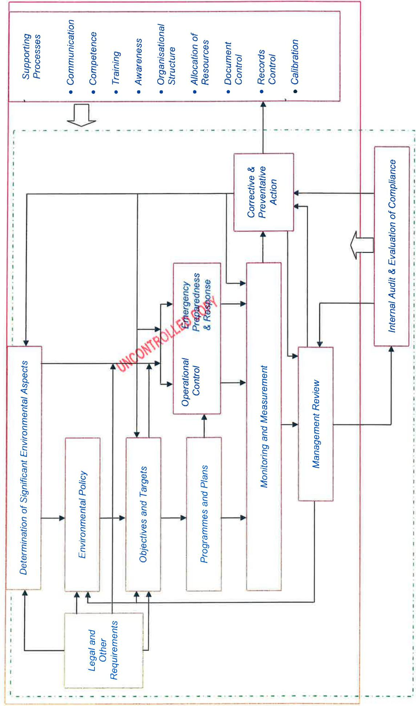

{262}------------------------------------------------

| Issue Status  | 2nd Edition, Rev 0 |
| ------------- | ------------------ |
| Issue Date    | 1st July 2014      |
| Issued by     | DPA                |
| Authorised By | Director PFS       |

# CONTENTS

- 1. PURPOSE
- 2. SCOPE
- RESPONSIBILITY 3.
- 4. CERTIFICATION
  - 4.1. ISM Certificate issued to the Company Office
  - 4.2. ISM Certificates issued to the Ship

#### 5. DEFINITIONS

- 5.1. HSEQ Management System (IMS)
- 5.2. Major Non-Conformity.
- 5.3. Non-Conformity (NC).
- 5.4. Observation.
- NC Investigation and Root Cause Analysis 5.5
- 5.6 Corrective Action
- 5.7 Preventive Action
- AUDIT PLANNING AND SCHEDULING 6.
- INTERNAL AUDITS 7.
- PRE AUDIT PREPARATION 8.
- CONDUCTING THE INTERNAL AUDIT 9.
- 10. AUDIT REPORTING
- 11. POST AUDIT ACTIVITY
- REVIEW OF NCR 12.
- 13. EXTERNAL AUDITS
- PRE AUDIT PREPARATION FOR EXTERNAL AUDITS 14.
- REPORTING THE EXTERNAL AUDIT AND CERTIFICATION 15.
- 16. POST EXTERNAL AUDIT ACTIVITY
- EXTERNAL AUDIT REVIEW 17.
- 18. CUSTOMER AUDITS
- PORT STATE CONTROL (PSC) INSPECTIONS 19.
- MONITORING & TRACKING OF AUDIT FINDINGS 20 -

# Appendices:

- A. Audit Report
- в NC Report
- C Audit Observation List
- Application for Internal Audit/Tech Inspection Postponement ם

{263}------------------------------------------------

| Issue Status  | 2nd Edition, Rev 0 |
| ------------- | ------------------ |
| Issue Date    | 1st July 2014      |
| Issued by     | DPA                |
| Authorised By | Director PES       |

#### PURPOSE 1.

- 1.1 The purpose of audits is not necessarily to find fault but to provide a learning opportunity to continually improve on the implementation of the Company management systems, both in the office and throughout the Company fleet. 12 1
- 1.2 To ensure compliance with applicable legal requirements
- To periodically evaluate compliance with other requirements to which the company 1.3 subscribes.

#### 2. SCOPE

Audits are conducted in the office and on the vessels to ensure compliance with the IMS requirements and the requirements of the various applicable standards and codes.

#### RESPONSIBILITY 3.

- 3.1. The HSEQA Department is responsible for :-
  - Appointing Auditors and ensuring the Auditors have received appropriate auditing a) training.
  - Planning and implementing Internal Safety Audits ashore and onboard each vessel,
  - Analysing the results of all Internal Safety Audits, non-conformances and corrective/ c) preventive actions.
  - d) Ensuring that follow up audits take place to ensure the effectiveness of previous corrective and/ or preventive action.
  - e)
  - Methods used to evaluate compliance include audits, inspections, review of documents f) f f f f f f f f f f f and records, annual management review
  - g) Maintain records of the results of periodic evaluation of compliance
- 3.2. Each appointed Auditor is responsible for carefully planning their audits and reporting any identified non-conformance. Where possible, the same Auditor should be used to follow-up and verify agreed corrective and/ or preventive action.

#### র ব CERTIFICATION

# 4.1. ISM Certificate issued to the Company Office

- 4.1.1 ISM Document of Compliance (DOC) is issued to the Company following an interim, initial or renewal office ISM audit certifying compliance with the requirement of the ISM Code. The DOC is also re-validated on completion of annual Intermediate Verification Audits.
- 4.1.2. The original of each DOC (each Flag State issues its own DOC's) is retained by the HSEQA Department and a copy of the appropriate DOC is provided to all Company Vessels.
- 4.1.3 Other Office Certification the IMS also addresses the requirements of ISO 9001, ISO 14001 and OHSAS 18001 and is audited accordingly as required by these standards. On completion of such audits, the appropriate certification is issued / verified accordingly.

{264}------------------------------------------------

# 4.2. ISM Certificates issued to the Ship

- 4.2.1 Safety Management Certificate (SMC) is issued by the Flag Administration (usually by the Classification Society on behalf of the Flag Administration) to the ship following an Interim, Initial, or Renewal audit onboard certifying compliance with the requirements of the ISM Code.
- 4.2.2 On successful completion of an Intermediate Verification Audit (carried out between the second and third anniversary of the Initial or Renewal Auditor will endorse the Intermediate Verification Section of the SMC (usually on the second page of the SMC) certifying compliance with the requirements of the ISM Code.
- 4.2.3. International Ship Security Certificate (ISSC)' is issued by the Classification Society to the ship following an Interim, Initial, Intermediate Verification or Renewal audit to certify that the security system and any associated security equipment of the ship has been verified in accordance with section 19.1 of Part A of the ISPS Code.
- 4.2.4. Ship Security Plan Approval Certificate endorsing the approved Ship Security Plan (SSP) issued by Administration as recommended by a Recognised Security Organisation (RSO) usually Classification Society.
- 4.2.5. Continuous Synopsis Record (CSR) Issued by the Administration as part of the ISPS documentation to each ship providing an onboard record of the history of the ship. Any changes relating to the entries on the certificate will be carried out the Head Office, approved by the Flag State and issued to the vesse. As such there maybe more than 1 version of the CSR onboard (for example CSR No. 1, CSR No. 2 etc) and ALL previous CSRs must be kept onboard and be available for inspection at any time.

#### 5. DEFINITIONS

# 5.1. HSEQ Integrated Management System (IMS)

5.1.1. A structured and documented system enabling Company personnel to implement effectively the Company policies.

#### 5.2. Major Non-Conformity

- 5.2.1. An identifiable failure to follow procedures or observe regulations which poses a serious threat to personnel or ship safety or a serious risk to the environment and requires immediate corrective action. In addition, the lack of effective and systematic implementation of a requirement of a code or standard is also considered a major non-conformity.
- 5.2.2. The issuing of an ISM related major non-conformity during a vessel audit will result in the suspension or withdrawal of the vessel's SMC, thereby preventing the vessel obtaining clearance to enter or leave port.
- 5.2.3. The issuing of a major ISM related non-conformity during an office audit will result in the suspension or withdrawal of the office DoC for that Flag State, thereby preventing any of the Company's vessels registered under that Flag State from obtaining clearance to enter or leave port.

#### 5.3. Non-Conformity (NC)

5.3.1 An observed situation where objective evidence indicates the non-fulfilment of a specific requirement. Namely, when objective evidence, which substantiates the non-fulfilment of a

1 Please refer to ISPS Code & Shipboard Security Plan for more details on ISPS matters.

{265}------------------------------------------------

| Issue Status  | 2nd Edition, Rev 0 |
| ------------- | ------------------ |
| Issue Date    | 1st July 2014      |
| Issued by     | DPA                |
| Authorised By | Director PFS       |

specific requirement of the Company's IMS, the ISM Code, or Rules and Regulations, is found, the matter shall be judged as Non-conformity.

- 5.3.2. Note that a previously raised NC that has not been corrected at the time of the next audit may be upgraded to a Major Non-Conformity.
- 5.3.3 All personnel are responsible for identifying and reporting non-conformances, and the Master is responsible for reporting all non-conformances to the DPA and HSEQA Dept. He shall also take whatever immediate corrective/preventative action as may be necessary onboard the vessel.

#### 5.4. Observation

- 5.4.1 A statement of fact made during the auditor considers ought to be recorded, although it does not necessarily constitute any non-fulfilment of the requirements of the Code or Company IMS.
- 5.4.2. In effect, an Observation indicates that although the requirements of the Code or Company System are being complied with, the way compliance is being implemented can be improved upon.
- 5.4.3. Nevertheless, if the same observation is made at a subsequent audit, it may be upgraded to an NC.

# 5.5 NC Investigation and Root Cause Analysi

5.5.1 All NC's raised should be investigated in order to identify the root cause and implement effective corrective / preventative action. The investigation will not only help to determine what and how an event occurred but also why it happened, thereby ensuring workable corrective and preventive astion to prevent future recurrence can be specified and implemented.

#### 5.6 Corrective Action (CA)

5.6.1 An action taken to eliminate the cause of a detected non-conformity or other undesirable situation. CA addresses actual problems. Because of this, the corrective action process can be thought of as a problem solving process, ie an instrument that has not been calibrated needs to be calibrated, or a member of the staff's training record that is not up to date should be updated, etc. (See Preventive Action below).

#### 5.7 Preventive Action

- 5.7.1 An action taken to eliminate the cause of a potential non-conformity or other potentially undesirable situation. This is especially important when a lesson is learned from other's nonconformity, ie incident, injury, port state deficiency, etc. Hence, the preventive action process here is to prevent the occurrence of non-conformities or situations that do not yet exist. It tries to prevent occurrence by eliminating causes.
- 5.7.2 A further action which is established to eliminate the recurrence of one's own non-conformity, after completing the CA. Note: PA must be effectively established in order to prevent recurrence as, prevention is better than cure.

#### AUDIT PLANNING AND SCHEDULING 6.

6.1 The HSEQA Department prepares and continuously updates the office and fleet audit plan, taking into consideration the required audit frequency. The audit plan addresses internal and

{266}------------------------------------------------

| Image: SR MARINE INTEGRATED MANAGEMENT SYSTEM | IMS 09 – OFFICE AND VESSEL AUDITS | Issue Status  | 2nd Edition, Rev 0 |
| --------------------------------------------------- | --------------------------------- | ------------- | ------------------ |
|                                                     |                                   | Issue Date    | 1st July 2014      |
|                                                     |                                   | Issued by     | DPA                |
|                                                     |                                   | Authorised By | Director PFS       |

external audits and includes the dates of current certification, the dates audits were last conducted and the audit due dates.

- 6.2 The office and fleet audit plan is approved by the GM HSEQA and is discussed as may be necessary within the Company for the purpose of scheduling the actual audits.
- HSEQA Dept monitors the audit plan and, prior to an audit coming due, liaises with the 6.3 6.3 relevant parties and informs the vessel about the impending audits.
- 6.4
- 6.5 the Company staff that has undergone appropriate Internal Auditor training and is certificated accordingly.
- 6.6 Occasionally it may be necessary to subcontract an internal audit, in which case the service provider must be approved by the Company and the actual auditor certificated accordingly.
- 6.7 The selection of auditors and conduct of audits shall be done in such a way as to ensure objectivity and impartiality of the audit process.
- 6.8 Auditors must not audit their own areas of responsibility.

#### INTERNAL AUDITS 7.

- 7.1 Internal audits are carried out by Company personnel at intervals not exceeding twelve months to:
  - Ensure that the Company IMS procedures are understood, implemented and effective
  - Follow up and / or close out any previously raised Non-Conformances that are still b) outstanding.
  - c) Provide the management with an internal view that shipboard activities conform to the planned arrangements requirements and effectiveness of the Company health, safety and environment management system.
  - d) preventative action.
  - e) Help people to help themselves.
- 7.2 In exceptional circumstances if the internal audit is not carried out by the time frame as specified in Section 7.1, the GM HSEQA / DPA may authorise an extension of up to three months. If an extension is authorised, the Company Senior Management must be advised by the GM HSEQA / DPA.
- 7.3 Such exceptional circumstances may include unexpected delays to the vessel caused by Charterer's requirements, the vessel being continuously at sea when the normal schedule of auditing becomes due, the vessel port stay being at too short notice, the vessel's port stay being too short for a proper audit to be carried out, or the unavailability of transportation (helicopters, crew boats, etc.) to enable the auditor to get to the vessel's location.
- 7.4 Upon approval by the GM HSEQA / DPA for the postponement of Internal Audit, the vessel must be advised accordingly and a record of the relevant correspondence maintained on the ship and in the office.

{267}------------------------------------------------

| Issue Status  | 2nd Edition, Rev 0 |
| ------------- | ------------------ |
| Issue Date    | 1st July 2014      |
| Issued by     | DPA                |
| Authorised By | Director PFS       |

7.5 External Interim Audit and before an External Initial Audit is carried out (usually by the Classification Society) on behalf of the Flag Administration. In exceptional circumstances, an extension of one and a half months for this Internal Audit to be carried out is permissible, subject to the approval as per Appendix C from the Director.

#### 8 PRE AUDIT PREPARATION

- The appointed auditor approved by the GM HSEQA shall notify the Master for the conduct of 8.1 the vessel internal audit.
- 8.2 If required, the GM HSEQA shall brief the internal auditor on the audit scope, criteria, objectives and particular points to check during the audit.
- 8.3 The auditor shall review the last internal and external audit report, NCRs and observations. The internal auditor shall also check the relevant procedures and processes for the upcoming audit and prepare the audit checklist.

#### 9. CONDUCTING THE INTERNAL AUDIT

- The auditor shall conduct an opening meeting with the ship personnel to brief them on the 9.1 scope, schedule and process for the audit.
- 9.2 Objective evidence is examined to verify conformance to the requirements as stated in the IMS manual.
- 9.3 Special attention is given to verify that appropriate corrective action has been taken for the last internal or external audit NCR's and observations, Vessel Inspections conducted by the technical superintendent, third party inspections and external audits.
- 9.4 At the end of the audit a closing meeting with the ship personnel shall be conducted to appraise results of the audits to those responsible for the activities being audited. It is important that they are fully informed - audits must be of benefit to the people concerned.
- 9.5 The internal auditor shall ensure that if a non-conformance report (NCR) is being issued to the vessel, the Master or Chief Engineer shall acknowledge Section A of the NCR confirming the issuance of the NCR to the vessel by the internal auditor.
- 9.6 Section B of the NCR shall be discussed between the internal auditor and the Master or Chief Engineer as applicable to determine the result of the root cause analysis. If root cause analysis has been jointly agreed upon, then appropriate comments shall be entered in Section B of the NCR form.
- 9.7 For all internally raised Non-Conformances a Root Cause Analysis must be carried out so that effective action can be implemented to prevent recurrence.
- 9.8 The methodology for carrying out such Root Cause Analysis may be "Y" Tree Analysis, as described in IMS 07.
- 9.9 The internal auditor and the auditee (Master or Chief Engineer) shall agree to the target date for completion of the corrective or preventive action. The target date of completion should be realistic but in any event should not exceed three months. The completion date agreed between the Master, Chief Engineer and the internal auditor must be entered in Section C of the NCR form.
- 9.10 The internal auditor shall ensure that the internal audit report, NCR forms and summary of observations form have been fully completed and acknowledged by the Master and Chief engineer prior to leaving the vessel.

{268}------------------------------------------------

9.11 After the completion of Internal Audit on board a Company vessel, the Auditor shall prepare and sign off the internal Audit Report (complete with any Non-Conformances raised) which is then countersigned by the GM HSEQA. It is then forwarded to the vessel, as far as practicable within 7 days from the audit date.

#### 10 AUDIT REPORTING

- The internal auditor shall report the findings of the internal audit along with any NCR's raised 10 1 and summary of observations to the GM HSEQA for review. The summary provides an overview of the audit findings as well as the auditor's comments on the effective implementation of the company's IMS and opportunities for improvement if any.
- 10.2 All non conformances shall be reported on the NCR form as per Appendix A of this chapter.
- 10.3 The GM HSEQA shall review and counter-sign the internal audit report (complete with NCR's raised and summary of observations) and, if necessary, circulate for action as may be required to the :
  - Director PFS a)
  - b) Technical Department Manager
  - Technical Superintendent c)
  - d) Crewing Department Manager
  - e) Appropriate Operations Department Per

#### 11 POST AUDIT ACTIVITY

- 11.1 The Master or Chief Engineer is responsible for following up to ensure the necessary corrective and preventive action is taken to address any non-conformances and/or observations raised by the auditor.
- 11.2 The corrective and preventive action for an NCR must be taken within the target date (as agreed upon at the time of the audit) as specified in of the NCR form, max 3 months for Minor NC and 30 days for observations. Major NC shall be acted on immediate basis and all steps shall be taken to close it out. If Master is not able to close out Minor NC and observations in stipulated time then it shall be communicated to respective departments and assistance shall be requested well in advance.
- 11.3 Any required objective evidence should be attached to the NCR form and then submitted to the HSEQA Department and a record maintained on board.
- 11.4 Corrective / preventative action must also be taken to address observations raised during an audit. Actions taken shall be summarised by the Master and Chief Engineer and the results submitted to the HSEQA Department. The completion date for action taken to address observations must be 30 days from the date the observation was raised.
- 11.5 The Master shall advise on progress in addressing outstanding NCR's and observations during the monthly HSE meeting report submitted to office.
- 11.6 The result of the internal audit shall be highlighted to all office staff during the monthly fleet HSE meeting at office.

{269}------------------------------------------------

#### 12 REVIEW OF NCR's

- The GM HSEQA shall ensure all NCR's raised are included in the agenda and discussed in 12.1 Management Review meetings.
- 12.2 NCR's raised are also discussed during the monthly Fleet HSE meetings conducted at the office.

#### 13 EXTERNAL AUDITS

- 13.1 The HSEQA department is responsible for ensuring that the external audits are conducted in the Company office (DOC) and fleet vessels (SMC).
- 13.2 The frequency of external audits shall, as a minimum, be as follows:
  - a) The validity of the Document of Compliance (DOC) and related certificates issued shall be subjected to annual verification by the Administration or by the organisation recognised by the Administration or at the request of the Administration by another contracting Government within three months before or after the anniversary date.
  - b) The validity of the Safety Management Certificate (SMC) shall be subject to intermediate verification by the Administration or an organisation recognised by the Administration or at the request of the Administration by another contracting Government. If only one intermediate verification is to be carried out and the period of validity of the SMC is five years, it should take place between the second and third anniversary date of the SMC.

#### PRE AUDIT PREPARATION FOR EXTERNAL AUDITS 14

- 14.1 The HSEQA Department monitors the vessel schedules and requests the certification body to arranging for an external auditor to attend the vessel accordingly,
- 14.2 When the external auditor's attendance to the vessel has been confirmed, the HSEQA Department informs the Master accordingly.
- 14.3 The HSEQA Department informs all appropriate Company personnel of the arrangements made for office audits once they have been confirmed by the certification body.

# 15 REPORTING THE EXTERNAL AUDIT AND CERTIFICATION

- 15.1 When the external audit has been completed, the external auditor should prepare a report, complete with any non-conformances raised.
- 15.2 The auditor must also endorse the existing SMC or issue a new SMC as appropriate.
- 15.3 This report should, if practicable, be passed to the vessel Master who then sends it, any related attachments and a copy of the endorsed/re-issued SMC by e-mail to the HSEQA Department (HSEQADept@paccoffshore.com.sg), who will forward the audit report as necessary to other Departments.
- 15.4 A copy of the report, any attachments and the original of the endorsed/re-issued SMC must be retained on board.
- 15.5 If it is not possible for the external auditor to pass the completed audit report to the Master, the external auditor must send it to the HSEQA Department by email as soon as possible, who will then forward a copy to the vessel.

{270}------------------------------------------------

| Issue Status  | 2nd Edition, Rev 0 |
| ------------- | ------------------ |
| Issue Date    | 1st July 2014      |
| Issued by     | DPA                |
| Authorised By | Director PFS       |

#### 16 POST EXTERNAL AUDIT ACTIVITY

- 16.1 If the external audit results in a NCN being issued, the HSEQA Department, on behalf of the Company, investigates the root cause of the non-conformance using objective evidence provided by the vessel or office Department, to determine the corrective action to be taken within the agreed time frame provided by the auditor.
- 16.2 The "NON-CONFORMITY" section is completed by the Originator in consultation with the Master/Department Head.
- 16.3 The Corrective Action is then carried out and the "CORRECTIVE ACTION COMPLETED / IMPLEMENTED" section of the NCR form is completed, signed and dated by the Head of Department/Master. Copies of the form completed to this stage are then sent to the DPA/HSEQA Dept.
- 16.4 The HSEQA Dept will then send a copy of the form completed to this stage to the External Auditor who raised the Non-Conformity Note, complete with documentary evidence to verify the corrective action has been taken.
- 16.5 The external auditor then accepts (or otherwise) the corrective action and indicates same to the HSEQA Department. If it is not accepted, the external auditor will advise what further action is required.
- 16.6 When the Vessel/Department is next audited (by an External Auditor), the Auditor verifies that the Corrective Action has been effectively taken, and then completes the "CORRECTIVE ACTION VERIFIED" section.
- 16.7 Copies of the completed form are retained by the Head of Department/Master, the HSEQA Dept and the Originator.

#### 17 EXTERNAL AUDIT REVIEW

17.1 Results of the external audit are reviewed during the Fleet HSE meetings and as part of the annual Management Review.

#### 18 CUSTOMER AUDITS

- 18.1 In addition to the above mentioned audits, Customers may request for audits of the Company and/or the vessel, usually prior to a major project. Such audits are normally carried out by Customer appointed surveyors who will usually (but not always) use a standardised checklist such as the International Marine Contractors Association - Common Marine Inspection Document (IMCA - CMID) or OVID Offshore Vessel Inspection Questionnaire (OVIQ).
- 18.2 Findings will be disseminated to the vessel, Company and Customer and will usually stipulate a certain time limit to correct any NC's or Observations raised.
- 18.3 In order for the Company vessels to be well prepared for such Audits, HSEQA Department provides all Company vessels with a soft copy of the appropriate Checklists for the Master to carry out a "self audit" on board, in order to highlight and correct any deficiencies.
- 18.4 In the event the Customer requires an OVID Audit to be carried out on a Company vessel, the process of inspection and reporting is as follows :
  - The Customer appoints an Inspector to carry out the OVID inspection on their behalf. a.
  - ﻘ The Company is advised and the inspection is carried out, using the OVIQ Checklist.
  - c. On completion, the Inspector submits is report to the Database, at which point is becomes available to the Customer to review and validate.

{271}------------------------------------------------

- d. On completion of their review and validation, the Customer emails the Company informing that the report is ready to be viewed and commented on.
- e. The Company can then view the findings and will usually distribute the report internally for the appropriate Departments and/or the vessel itself to comment on the findings and take action accordingly.
- The action to be taken can be either to complete the corrective action on the f. . . . . deficiency which led to the finding, or to provide indication as to how and when the deficiency will be rectified. In either case, it will usually be necessary to produce documentary evidence accordingly and the proposed and/or completed action must be to the satisfaction of the Customer.
- g. The Company then consolidates its comments on the report and then releases the report to the database. At this point the report becomes available to view and download over the database to other OVID members.
- h. available to them (see 18.4 c. above) then it will automatically go live on the database and comments submitted subsequently will be reflected in the report available for download.
- i. When the Commented on the report that corrective action will be taken by a certain date that, action must be completed accordingly.
- j. The Company maintains its own record of outstanding deficiencies for monitoring, follow-up, completion and close-out purposes.
- k. When the corrective action has been completed, the Company must inform the Customer accordingly and ensure that the report on the database is updated.

# 19. PORT STATE CONTROL (PSC) INSPECTIONS

# 19.1 Purpose of Port State Control Inspection

19.1.1 It is the inspection of foreign ships in national ports to verify that the condition of the ship and its equipment comply with the requirements of international regulations and that the ship is manned and operated in compliance with these rules.

# 19.2 Port State Control Memorandum of Understanding (MOU)

- 19.2.1 There are various PSC MOU ocean regions around the world which require each contracting authority, within three years, to inspect an annual total of 25% of foreign merchant ships calling at its ports. Each authority will 'consult, co-operate and exchange information' with other authorities'.
- 19.2.2 Authorities should "seek to avoid inspecting ships which have been inspected by any of the other authorities within the previous six months unless they have clear grounds for inspection."
- 19.2.3 Port State Control Memorandum of Understanding Ocean Regions :

| Europe and North Atlantic | -   | Paris MOU               |
| ------------------------- | --- | ----------------------- |
| Asia and the Pacific      | -   | Tokyo MOU               |
| Latin America             | -   | Acuerdo de Vina del Mar |
| Caribbean                 | -   | Caribbean MOU           |

{272}------------------------------------------------

| Image: SR MARINE INTEGRATED MANAGEMENT SYSTEM | IMS 09 - OFFICE AND VESSEL AUDITS | Issue Status  | 2nd Edition, Rev 0 |
| --------------------------------------------------- | --------------------------------- | ------------- | ------------------ |
|                                                     |                                   | Issue Date    | 1st July 2014      |
|                                                     |                                   | Issued by     | DPA                |
|                                                     |                                   | Authorised By | Director PFS       |

| West and Central Africa | -   | Abuja MOU            |
| ----------------------- | --- | -------------------- |
| Black Sea Region        | -   | Black Sea MOU        |
| Mediterranean           | -   | Mediterranean MOU    |
| Indian Ocean            | -   | Indian Ocean MOU     |
| Arab States of the Gulf | -   | GCC MOU (Riyadh MOU) |

#### 19.3 Detention of the Ship

- 19.3.1 The PSC Officers follow a set of guidelines, grouped under relevant conventions and/or codes which, if the vessel is found to be not in compliance, would be considered to be of such serious nature that they may warrant the detention of the ship involved:
  - a) Areas under the SOLAS Convention (especially with regards to the efficiency of the crew during emergency drills).
  - b) Areas under the Load Lines Convention
  - Areas under the MARPOL Convention, Annex I C)
  - d) Areas under the STCW Convention
  - e) Areas under the ISM Code
  - Areas under the ISPS Code f)
  - g) Areas under the MLC
- 19.3.2 If the vessel is found to be non-compliant with any of the ship will be detained by the PSC Officer. A combination of deficiencies of a less serious nature may also warrant the detention of the ship. Ships which are unsafe to proceed to sea will be detained upon first inspection irrespective of the time the ship will stay in port.

# 19.4 Actions Taken as a Result of PSC Inspection

- 19.4.1 Deficiencies under codes 17 and 30 should be documented as non-conformities and are to be investigated and rectified to the satisfaction of the organisation which issued the relevant certificate and in all cases, to the satisfaction of the PSC Officer.
- 19.4.2 Findings of the PSC Inspection must be forward to the HSEQA Department for disseminating the lessons learnt to all vessels to prevent reoccurrence. The HSEQA Department will also advise the PSC Office that raised the deficiency report that corrective action has been completed.
- 19.4.3 The PSC Inspection report must be retained onboard for a period of two years and must be available for consultation by PSC Officers at all times.

# 19.4.4 Reducing The Risk Of Port State Detention

#### 1 Master and Office Responsibility

- Certificates Original Copies of all trading certificates and documents available a)
- STCW All personnel adequately certificated and documents available ﻣ
- SOPEP Approved, up to date and with current contact details included c)
- ರು ISM Emergency Preparedness - Drills carried out regularly and effectively with documented evidence.

{273}------------------------------------------------

| Issue Status  | 2nd Edition, Rev 0 |
| ------------- | ------------------ |
| Issue Date    | 1st July 2014      |
| Issued by     | DPA                |
| Authorised By | Director PFS       |

#### 2. Bridge Area

- Nautical publications valid and as required for the voyage a)
- Charts correct charts for voyage being undertaken and corrected as necessary ﻘ
- Magnetic compass easily readable and correctly adjusted with updated deviation c) card
- Lights, shapes, sound signals in good working condition d)
- GMDSS in working order e)
- EPIRB available and in working order; updated maintenance records f)
- Fire detection Alarms in working condition g)

#### Life Saving Appliances 3.

- Emergency lighting and batteries functioning correctly and in place a)
- Rescue boat structure sound b)
- Rescue boat engine able to start without difficulty c)
- Rescue boat davit well maintained and in good working condition d)
- Rescue boat inventory all as required and in date e)
- Lifebuoys correct number and location and in good condition f) f f f f f f f f f f f f f
- Lifejackets correct number and location and in good condition g)
- Inflatable life rafts clear of obstructions. Weak link correctly positioned and h) hydrostatic release in date

#### 4. Accommodation

- Fire doors able to close tight and in good condition a)
- Fire fighting equipment available, in place and in good working order ﻣ
- Fire control plan in place and up-to-date C)
- Signs, indicators (weather tight doors, fire detectors, fire dampers, ventilation) all in o place and as required
- Emergency lighting and batteries functioning correctly and in place e)
- Sanitary facilities equipment in place, clean and functioning correctly f)

#### Deck Areas 5.

- Deck corrosion ensure deck well maintained, not corroded, holed or wasted a)
- Railings, cat walks ensure all well maintained, not corroded, holed or wasted ﻘ
- Cargo and other hatchways ensure weather tight and the covers are in good c) condition with securing devices adequate and in place
- Weather tight doors in good condition and securing correctly d)
- Ventilators, air pipes, casings clearly marked and in good working condition e)
- Winches and capstans Clear marking and in good working condition t)
- Fixed fire extinguishing installation bottles correctly serviced and dated; release ခ mechanisms in good condition and in place
- Fire fighting equipment available, in place and in good working order with valid ﮯ recharge date marked where appropriate
- Fire dampers, quick closing devices and means of control clearly marked, easy to ﮯ operate and corrosion free
- Signs, indications (weather tight doors, fire detectors, fire dampers, ventilation) all in j) place and as required

{274}------------------------------------------------

| Issue Status  | 2nd Edition, Rev 0 |
| ------------- | ------------------ |
| Issue Date    | 1st July 2014      |
| Issued by     | DPA                |
| Authorised By | Director PFS       |

# Note:

- 1: Corroded or non-operable fire dampers are one of the most common detaining items,
- The condition of the hatchway covers and their closing devices are usually checked 2. 3 during PSC inspections.

#### 6. Working spaces

- a) Emergency fire pump - capable of being easily started and delivering sufficient water to two hoses.
- b) Emergency generator - able to be easily operated and connected to switchboard
- C) Lighting - ensure adequate

#### 7. Engine Room

- Retention of oil on board ensure correct tanks are being used and emptied at port a) facilities
- b) Cleanliness of engine room - clean, no oil leaks, clean bilges and tank tops and no oily rags
- Auxiliary engines all in working order C)
- Propulsion main engine all components functioning correctly d)
- Jacketed piping system for high pressure fuel lines approved system in place e)
- Oil filtering equipment (oily water separator) working correctly, ensure no illegal f) pipe work
- Oil record book data correctly entered and up-to-date g)
- Fire pump in working order with adequate pressure h)
- i) Steering gear - functioning correctly
- Signs, indicators (watertight doors, fire detectors, fire dampers, ventilation, etc) all i) in place and as required
- k) Emergency lighting and batteries - functioning correctly and in place
- Fire fighting equipment available, in place, in good working order with valid 1) recharge date marked where appropriate
- Weather tight doors in good condition, securing correctly m)

# 20. MONITORING & TRACKING OF AUDIT FINDINGS

- 20.1 The HSEQA Dept and the respective ship shall monitor and track all audit findings to ensure corrective and preventative actions are taken within the stipulated time limits.
- 20.2 If the corrective actions cannot be taken or completed within the stipulated time limits, then the reasons why must be fully explained to the auditor and an extension sought to enable completion.
- 20.3 The audit findings shall be shared with the fleet vessels to prevent recurrence of similar deficiencies to update and generate awareness from lessons learnt.

{275}------------------------------------------------

{276}------------------------------------------------

|  |     | IMS 9 - APPENDIX A INTERNAL AUDIT REPORT |                                                                            |                        |     |     |
| ------------------------------------------------------------------------------- | --- | ------------------------------------------- | -------------------------------------------------------------------------- | ---------------------- | --- | --- |
|                                                                                 |     | Issue Status                                | 2nd Edition, Rev 0                                                         |                        |     |     |
|                                                                                 |     | Issue Date                                  | 1st July 2014                                                              |                        |     |     |
|                                                                                 |     | Issued by                                   | DPA                                                                        |                        |     |     |
|                                                                                 |     | Authorised by                               | Director PFS                                                               |                        |     |     |
| AUDITEE DETAILS (FOR SHIP AUDIT)                                                |     | AUDITEE DETAILS (FOR OFFICE AUDIT)          |                                                                            |                        |     |     |
| Ship Name                                                                       |     | Company                                     |                                                                            |                        |     |     |
| IMO No.                                                                         |     | Department                                  |                                                                            |                        |     |     |
| Flag                                                                            |     |                                             |                                                                            |                        |     |     |
| Port of Registry                                                                |     | Date of Audit                               |                                                                            |                        |     |     |
| Class                                                                           |     | Place                                       |                                                                            |                        |     |     |
| SMC (Issued By)                                                                 |     | Date of Report (Max 1 week)              |                                                                            |                        |     |     |
| STATUS OF LAST INTERNAL AUDIT FINDINGS                                          |     | SCOPE OF AUDIT                              |                                                                            |                        |     |     |
| Date of audit                                                                   |     | ISM                                         |                                                                            | Mark as appropriate    |     |     |
| Place                                                                           |     | ISPS                                        |                                                                            |                        |     |     |
| Auditor                                                                         |     | EMS (ISO 14001)                             |                                                                            |                        |     |     |
| NCs Issued                                                                      |     | QMS (ISO 9001)                              |                                                                            |                        |     |     |
| NCs Closed                                                                      |     | OTHERS                                      |                                                                            |                        |     |     |
| NCs Outstanding                                                                 |     |                                             |                                                                            |                        |     |     |
| Observations raised                                                             |     | AUDIT FINDINGS                              |                                                                            |                        |     |     |
| Observations Closed                                                             |     | NCs raised                                  |                                                                            | (As attached)          |     |     |
| Observations Outstanding                                                        |     | Observations raised                         |                                                                            | (As attached)          |     |     |
| Remarks (if any):                                                               |     |                                             |                                                                            |                        |     |     |
|                                                                                 |     |                                             | I have checked that the details in this report are correct and acceptable. |                        |     |     |
| Auditor(Name and Sign)                                                          |     |                                             |                                                                            | Auditee(Name and Sign) |     |     |

Note: The audit follows a sampling process, which means that if no non-conformity / no findings are raised, it does not mean that no deficiencies in the system exist.

{277}------------------------------------------------

| Name of Vessel/Dept/Others                        |              |           |           |
| ------------------------------------------------- | ------------ | --------- | --------- |
| Originator/Auditor                                | Auditee/Dept |           |           |
| Type of Audit (Internal/External/Office/Others)   |              |           |           |
| Scope of Audit (ISM/ISPS/ISO9001/ISO14001/Others) |              |           |           |
| NCR No:                                           | Date:        | Major NC: | Minor NC: |

Section A- Non Conformance and Objective Evidence:

| Agreed Between   | Name/Designation/Sign:   | Name/Designation/Sign:   |
| ---------------- | ------------------------ | ------------------------ |
| ---------------- | ------------------------ | ------------------------ |

Section B- Root cause analysis:

UNCONTROLLED COPY

Section C- Corrective/Preventive action to be taken:

Section D: Agreed date for completion of corrective and Preventive action (Max 3 months from date of NC for Minor NC and Immediate Action for Major NC )

| Date:   |     |
| ------- | --- |
| ------- | --  |

Section E: Completion of Corrective/Preventive action:

| Date:   |     |
| ------- | --- |
| ------- | --  |

Name/Designation/Sign

Section F- Verification of Completion of Corrective/Preventive action(follow up audit/etc):

Verified by: Name/Designation/Sign/Date:

{278}------------------------------------------------

|                   | 
C-SR MARINE
          |        | IMS 09 - APPENDIX C                                | Issue Status                          | 2nd Edition, Rev 0 |
| ----------------- | ---------------------------------------------- | ------ | -------------------------------------------------- | ------------------------------------- | ------------------ |
|                   |                                                |        |                                                    | Issue Date                            | 1st July 2014      |
|                   | 
INTEGRATED
           |        | AUDIT OBSERVATION LIST                             | Issued by                             | DPA                |
|                   | 
MANAGEMENT SYSTEM
    |        |                                                    | Authorised By                         | Director PFS       |
| Vessel / Office : |                                                | Dept : | Audit Date :                                       |                                       | Page :             |
|                   | Type of Audit (Internal / External / Others) : |        | Audit Scope (ISM / ISPS / 9001 / 14001 / Others) : |                                       |                    |
| S/No              | Observations                                   |        | Corrective Action                                  |                                       | Closed Out Date    |
| 01                |                                                |        |                                                    |                                       |                    |
| 02                |                                                |        |                                                    |                                       |                    |
| 03                |                                                |        |                                                    |                                       |                    |
| 04                |                                                |        |                                                    |                                       |                    |
| 05                |                                                |        |                                                    |                                       |                    |
| 06                |                                                |        |                                                    |                                       |                    |
| 07                |                                                |        |                                                    |                                       |                    |
| 08                |                                                |        |                                                    |                                       |                    |
| 09                |                                                |        |                                                    |                                       |                    |
| 10                |                                                |        |                                                    |                                       |                    |
|                   |                                                |        |                                                    |                                       |                    |
|                   | Name/Designation/Signature of Auditor          |        | Name/Designation/Signature of Auditee              | Name/Designation/Signature of Auditee |                    |

Note : All observations shall be closed out within 30 days, Master shall inform respective dept if unable to do so and seek assistance.assistallite. ﺍﻟﻤﺮﺍﺩ

{279}------------------------------------------------

|                                                                                                                                         | C-SR MARINE                           |        | IMS 09 - APPENDIX C                                | Issue Status                          | 2nd Edition, Rev 0 |
| --------------------------------------------------------------------------------------------------------------------------------------- | ------------------------------------- | ------ | -------------------------------------------------- | ------------------------------------- | ------------------ |
|                                                                                                                                         |                                       |        |                                                    | Issue Date                            | 1st July 2014      |
|                                                                                                                                         | INTEGRATED                            |        | AUDIT OBSERVATION LIST                             | Issued by                             | DPA                |
|                                                                                                                                         | MANAGEMENT SYSTEM                     |        |                                                    | Authorised By                         | Director PFS       |
| Vessel / Office :                                                                                                                       |                                       | Dept : | Audit Date :                                       |                                       | Page :             |
| Type of Audit (Internal / External / Others) :                                                                                          |                                       |        | Audit Scope (ISM / ISPS / 9001 / 14001 / Others) : |                                       |                    |
|                                                                                                                                         |                                       |        |                                                    |                                       |                    |
| S/No                                                                                                                                    | Observations                          |        | Corrective Action                                  |                                       | Closed Out Date    |
| 01                                                                                                                                      |                                       |        |                                                    |                                       |                    |
| 02                                                                                                                                      |                                       |        |                                                    |                                       |                    |
| 03                                                                                                                                      |                                       |        |                                                    |                                       |                    |
| 04                                                                                                                                      |                                       |        |                                                    |                                       |                    |
| 05                                                                                                                                      |                                       |        |                                                    |                                       |                    |
| 06                                                                                                                                      |                                       |        |                                                    |                                       |                    |
| 07                                                                                                                                      |                                       |        |                                                    |                                       |                    |
| 08                                                                                                                                      |                                       |        |                                                    |                                       |                    |
| 09                                                                                                                                      |                                       |        |                                                    |                                       |                    |
| 10                                                                                                                                      |                                       |        |                                                    |                                       |                    |
|                                                                                                                                         |                                       |        |                                                    |                                       |                    |
|                                                                                                                                         | Name/Designation/Signature of Auditor |        | Name/Designation/Signature of Auditee              | Name/Designation/Signature of Auditee |                    |
| Note : All observations shall be closed out within 30 days, Master shall inform respective dept if unable to do so and seek assistance. |                                       |        |                                                    |                                       |                    |

be closed out within 30 days, Master shall inform respective dept if unable to do so and seek assistance. is Silall C .... ﺎﺕ ﺍﻟﻤﺘﺤﺪﺓ ﺍﻟﻤﺘﺤﺪﺓ ﺍﻟﻤﺘﺤﺪﺓ ﺍﻟﻤﺘﺤﺪﺓ ﺍﻟﻤﺘﺤﺪﺓ ﺍﻟﻤﺘﺤﺪﺓ ﺍﻟﻤﺘﺤﺪﺓ ﺍﻟﻤﺘﺤﺪﺓ ﺍﻟﻤﺘﺤﺪﺓ ﺍﻟﻤﺘﺤﺪﺓ ﺍﻟﻤﺘﺤﺪﺓ ﺍﻟﻤﺘﺤﺪﺓ ﺍﻟﻤﺘﺤﺪﺓ ﺍﻟﻤﺘﺤﺪﺓ ﺍﻟﻤﺘﺤﺪﺓ ﺍﻟﻤﺘﺤﺪﺓ ﺍﻟﻤﺘﺤﺪﺓ ﺍﻟﻤﺘﺤﺪﺓ ﺍﻟﻤﺘﺤﺪﺓ ﺍﻟﻤﺘﺤﺪﺓ ﺍﻟﻤﺘﺤﺪﺓ ﺍﻟ

{280}------------------------------------------------

## IMS 09 – APPENDIX D application for internal audit/tech INSPECTION POSTPONEMENT

| Issue Status  | 2nd Edition, Rev 0 |
| ------------- | ------------------ |
| Issue Date    | 1st July 2014      |
| Issued by     | DPA                |
| Authorised By | Director PFS       |

| TO :                                                    |     |
| ------------------------------------------------------- | --- |
| FROM :                                                  |     |
| POSTPONEMENT OF : (Internal Audit / Tech Inspection) |     |
| VESSEL / DEPARTMENT :                                   |     |
| DATE LAST DONE :                                        |     |
| SCHEDULED DATE / MONTH :                                |     |
| PROPOSED NEW DATE / MONTH :                             |     |
| REASON :                                                |     |

UNCONTROLLED COPY

| SIGNATURE OF PROPOSER :   |     | DATE :   |     |
| ------------------------- | --- | -------- | --- |
| ------------------------- | --  | -------- | --  |

| GM COMMENTS :                     |                                       |
| --------------------------------- | ------------------------------------- |
| <input type="checkbox"/> APPROVED | <input type="checkbox"/> NOT APPROVED |
| GM REMARKS (IF ANY) :             |                                       |

| GM NAME/SIGNATURE:   |     | DATE:   |     |
| -------------------- | --- | ------- | --- |
| -------------------- | --  | ------- | --  |

{281}------------------------------------------------

# CONTENTS

- 1. GENERAL
- 2. DOCUMENT CONTROL AND ISSUE
- 3. UNCONTROLLED DOCUMENTS
- এ.. RETENTION OR REMOVAL OF OBSOLETE DOCUMENTS
- 5. AVAILABILITY OF DOCUMENTS
- 6. REVIEW AND ISSUE OF NEW EDITIONS OF HSEMS MANUALS
- COMPANY CIRCULARS 7.
- 8. DOCUMENT CHANGES AND MODIFICATIONS
- 9. IDENTIFICATION OF CHANGE AND REVISION STATUS
- 10. CONTROL OF DOCUMENTS OF EXTERNAL ORIGIN
- SUPPLEMENTARY INSTRUCTIONS 11.
- 12. VESSEL AND PERSONNEL CERTIFICATION, VALIDATION AND CONTROL
- 13. NAUTICAL PUBLICATIONS LIBRARY
- 14. PLANS/DRAWINGS AND SPECIFICATIONS OF VESSELS
- 15. SAFETY SIGNS
- CHARTS AND MARINE PUBLICATIONS 16.
- MARINE CIRCULARS 17.

# Appendices

- A Certificates and Records Retention Period
- B Record of Ship Certificates
- C Change Request Form
- D Master List of Appendices
- Shipboard Standard Filing System- Deck E

{282}------------------------------------------------

#### GENERAL 1

- 1.1 .. This procedure ensures that all documentation relating to the Company Integrated Management System (IMS) is properly reviewed and controlled.
- 1.2. All controlled documents and approved forms of the document are the property of the Company and shall not be distributed by hard copy or electronically to any persons outside the organisation without the approval of the DPA.
- 1.3. The HSEQA Department retains the master original editable electronic soft copies of the IMS and related manuals with access limited to the departmental personnel only.
- 1.4. This procedure applies but is not limited to the following documentation :
  - IMS Manual and related documents a
  - b. Shipboard Security Plan (SSP)
  - SOPEP/SMPEP Manuals C.
  - d. SOLAS Training and additional Fire Fighting Manuals
  - e. Garbage Management Plan
- 1.5. The Master is responsible for the control of all documentation on board the vessel and for liaising with the HSEQA Department with regard to the upkeep of the system.
- 1.6. The Chief Engineer however, takes responsibility for the control of all Engine Room documentation, plans and instruction manuals.
- 1.7. If the Master is ever in doubt that his documentation is of the latest issue; he should consult the HSEQA Department for clarification.

#### DOCUMENT CONTROL AND ISSUE 2

- The DPA / MR is responsible for the control and issue of controlled documents which clearly 2.1 specify the recipients of the controlled copies.
- 2.2 The DPA/ MR shall ensure the recipients of controlled documents are instructed to update their copies and destroy obsolete copies whenever an amendment takes place.
- 2.3 -Where appropriate, controlled documents are provided with an updated revision control list.
- 24 The HSEQA department assists the DPA / MR in tracking the revision control issue of the controlled documents.
- 2.5 ensure that relevant versions of applicable documents are available at point of use
- ensure that documents of external origin determined by the company to be necessary for the 2.6 planning and operation of the environmental, health, safety and quality management system are identified and their distribution controlled

#### 67 UNCONTROLLED DOCUMENTS

- 3.1 The HSEQA Department personnel are authorised to issue the whole or part of a controlled document to relevant Company personnel, but such documents shall, if issued, be clearly marked as uncontrolled documents, be for reference only and are not to be used for any work processes on board.
- 3.2 If it is necessary to issue electronic copies to other Company personnel and/or to external parties, only scanned PDF copies that cannot be edited are to be provided and these are considered as uncontrolled copies.

{283}------------------------------------------------

- 3.3 The HSEQA Department provides editable versions to Company vessels of the IMS forms and checklists so that they can be used for the control, recording and reporting of work processes as described within the IMS.
- 3.4 Photocopying and any other form of reproduction of controlled documents is not permitted, with the exception of section 3.2 and 3.3 above.

#### ৰ RETENTION OR REMOVAL OF OBSOLETE DOCUMENTS AND RECORDS

- 4.1 The recipients of controlled documents (Master and Chief Engineer) and office department heads shall be responsible for destroying their copy of obsolete or superseded documents as instructed by the issuing HSEQA Department personnel.
- Obsolete or superseded copies of controlled documents or supporting documents thereof that 42 are not immediately destroyed or retained for any purpose shall be clearly identified with the terms such as "Obsolete", "superseded", "cancelled", or "with a single bold line struck against the document diagonally.
- 4.3 All staff as specified in the "Register of Manual Holders" of the controlled document shall be responsible for the removal and/or identification of obsolete document under their possession and/or point of use.

# 5 AVAILABILITY OF DOCUMENTS AND RECOR

- 5.1 The department heads shall decide on the storage locations of the controlled documents and records for their departments and shall ensure the all departmental staff has access to the documents.
- 5.2 The Master and Chief Engineer must ensure that all controlled documents issued by the company are kept on the Bridge and Engine Control Room respectively and that the documents are accessible to the ship staff.
- 5.3 Each vessel shall carry on board all documentation and records relevant to the vessel including technical publications as mandated by the vessel flag state.
- 5.4 Documentation and records shall remain legible and readily identifiable, maintained in an orderly manner and shall always indicate the date of issue and revision.
- 5.5 hard copy as required. Retention period of all records is specified in Appendix A. All old/obsolete records to be disposed off.

#### REVIEW AND ISSUE OF NEW EDITIONS OF IMS MANUALS 6

- 6.1 The currency of the IMS manual is maintained by the HSEQA Department to ensure that the health, safety and environmental standards that the company subscribes to continue to be met, the system remains relevant to suit its current contractual and operational requirements and to continually improve the effectiveness of the system.
- 6.2 Aproved change requests (CR) raised is incorporated prior to distribution of the revised manual to the manual holders.

#### 7 COMPANY CIRCULARS

7.1 The Company's circulars to fleet vessels are issued under the authorisation of the DPA.

{284}------------------------------------------------

| Issue Status  | 2nd Edition, Rev 0 |
| ------------- | ------------------ |
| Issue Date    | 1st July 2014      |
| Issued by     | DPA                |
| Authorised By | Director PFS       |

- 7.2 Company Circulars are reviewed at the Management Review Meeting and any which are no longer valid are removed. Circulars to be incorporated in the IMS manuals are included during the next IMS manual review.
- 7.3 After the review, all circulars in force are issued to all fleet vessels.

#### 8 DOCUMENT CHANGES AND MODIFICATIONS

- Any changes to the documented system are recorded upon Revision Control Sheets shown in 8.1 the front of each copy of the Manual.
- 8.2 If the Master, any person on-board the vessel or any office personnel identifies a need to change the documentation, a 'Change Request Form' should be submitted to the HSEQA Dept.
- 8.3 Where requests are rejected, the person making the request is notified of the reason for rejection.
- 8.4 If the request is approved, the appropriate pages are updated and may be circulated by the HSEQA Department to the appropriate heads of departments for review and comment.
- 8.5 When finalised, the HSEQA Dept issues the amendments (usually with specific instructions) on a page by page basis for ease of updating the manuals.
- 8.6 The HSEQA dept will review all CR's during scheduled review period (at least every 3 months or more) and results will be distributed to all concerned parties. Urgent and statutory CR's will be reviewed immediately upon receipt and changes made, If any, will be transmitted to all affected parties.
- 8.7 The approved changes arising out of the CR are incorporated in the next IMS manual review amendments.
- 8.8 It is the responsibility of the holders of manuals to insert updated pages on receipt, destroy pages which have been superseded and acknowledge to the HSEQA Dept when the amendment has taken place.

#### g IDENTIFICATION OF CHANGE AND REVISION STATUS

- 9.1 The nature of change in the IMS manual shall, where possible, be identified by a double underline (XXXX) indicating the changed text of the controlled document, where applicable.
- The revision status is identified by the revision number and date on the document. 9.2
- 9.3 When a complete new Edition of the IMS is issued, initially the revision status of all pages will be "Rev 0". Subsequent page revisions will be "Rev 1", "Rev 2", etc.
- 9.4 The current document revision status is listed in the contents page under revision control record of each manual.

#### 10 CONTROL OF DOCUMENTS OF EXTERNAL ORIGIN

- 10.1 Documents of external origin (nautical publications) are identified in a controlled manner as issued by HSEQA Department on quarterly basis (March, June, Sept, Dec) through fleet wide circular.
- 10.2 The HSEQA Department is responsible for determining the latest edition of the nautical publications through the contracted supplier's website or updates.

{285}------------------------------------------------

| Issue Status  | 2nd Edition, Rev 0 |
| ------------- | ------------------ |
| Issue Date    | 1st July 2014      |
| Issued by     | DPA                |
| Authorised By | Director PFS       |

10.3 A current set of the publications as specified in the latest HSEQA nautical publications circular is maintained by the HSEQA Department and is readily available to all Company staff for reference.

#### SUPPLEMENTARY INSTRUCTIONS 11

11.1 All instructions issued to shore and sea staff to supplement the Company IMS must be reviewed and approved by the staff having direct authority over the process. Any subsequent amendments to such instructions must also be reviewed and approved accordingly.

# 12 VESSEL AND PERSONNEL CERTIFICATION, VALIDATION AND CONTROL

#### 12.1 Trading Certificates

- 12.1.1 The Master is responsible for ensuring that all Trading, Classification, Administration, Personnel and other important certificates are kept up to date. The status of these certificates is monitored via -
  - Change of Command Reports (Handover Notes) a.
  - Records of Vessel Certificates & Surveys submitted monthly by the Master to the ﻔ Technical Superintendent
- 12.1.2 Certification and Survey for vessels include, but is not limited to:
  - a. Statutory Certificates, Surveys and requirements (Registry, Appointment of Managers, LRIT, Bunker Pollution, International Anti Fouling Convention Certificate issued by Flag / under authorisation of the Flag State)
  - Classification Certificates, Surveys and requirements ﻘ
  - International Sanitary Regulations C.
  - ರ Suez and Panama Canal Certificates
  - Anchors and Chain Certificates e.
  - ISM Compliance Certificate, both Document Of Compliance (DOC) and Safety f. Management Certificate (SMC)
  - ISPS Compliance Certifications ದಿ.
- 12.1.3 The indication of inspection and test status of the vessel's hull, machinery, safety equipment and other important equipment is readily available by reference to the appropriate trading certificates, survey reports, test certificates, classification Records and Log Books. The Technical Department monitors these records via Classification Society Websites and, should a vessel require copies, these can be provided by the Technical Department.
- 12.1.4 Safety Management and Security related Certification (DOC, SMC, ISSC, CSR, etc.) are part of the ships' trading certificates and are monitored by the HSEQA Department, although the Master remains responsible for ensuring the originals of these certificates are available onboard.
- 12.1.5 The Master must ensure that an original copy of Class Approval Certificate for the class approved documents is available on board at all times.

# 12.2 Personnel Certificates

12.2.3 In accordance with the STCW '95 requirements, the originals of professional certificates must always be available on board to:

{286}------------------------------------------------

- Ensure the vessel is manned according to Flag State and International Regulations. a.
- Ensure the ship's personnel have valid STCW licenses, endorsed by Flag State, b. appropriate to the type and size of vessel and of a level equal or superior to their rank.

Issue Status

Issue Date

Issued by

Authorised By

2nd Edition, Rev 0

18t July 2014

Director PFS

DPA

- 12.2.4 The originals of crew Medical Certificates must be available onboard with copies provided to Crewing Department.
- 12.2.5 Individuals are responsible for ensuring that their certification does not lapse and, if expiry is coming due, the Master and Crewing Department must be informed.

#### NAUTICAL PUBLICATIONS LIBRARY 13

- 13.1 A Nautical Publications Library is maintained onboard which includes all publications as required by Classification Society, Flag State, IMO and the Company.
- 13.2 Revisions and updates of each publication are checked by the HSEQA Dept. and the vessel is advised accordingly. A requisition can then be raised by the Master and the publication updated.
- 13.3 The Master must ensure that these nautical publications are kept securely on board, but at the same time are available for reference by the ship's Officers and Crew.
- 13.4 Obsolete publications are to be removed from the system for destruction or to be clearly marked "OBSOLETE".
- 13.5 Updated list of nautical publications will be provided to vessel through circular at periodical interval or when changes take place.

# 14 PLANS/DRAWINGS AND SPECIFICATIONS OF VESSELS

- 14.1 Plans, drawings and vessel specification details are controlled by the responsible Technical Superintendent.
- 14.2 The responsible Superintendent will ensure that all obsolete issues are removed and destroyed.
- 14.3 All latest issue plans, drawings and sketches associated with any alterations are retained (after completion of the specified work) in the relevant file onboard and in Technical Dept.
- 14.4 Plans displayed on bulkheads or located outside the accommodation should be amended and dated when changes in the vessel or equipment take place. These plans must be legible at all times.

#### 15 SAFETY SIGNS

- 15.1 The following Safety signs shall be displayed at all relevant locations, few examples as below;
  - a. Emergency Exits location
  - b. Emergency Exit routes
  - Muster Stations C.
  - ರ Liferaft launching areas
  - Liferaft launching instructions e.
  - f. Lifejacket donning instructions
  - Fire extinguisher information ರು.

{287}------------------------------------------------

- Restricted Areas/Confined spaces h
- i. Crane signal

#### CHARTS AND MARINE PUBLICATIONS 16

- 16.1 The Master delegates the control of these documents to the Second Officer.
- 16.2 The Company provides charts and publications for the trading area of the vessel.
- 16.3 A 'Chart and Marine Publication Master List' shall be kept up to date by the ship for all relevant documents.
- 16.4 The vessel must receive 'Weekly Notices to Mariners', either in hard copy or electronically, which contain full information on the correction and issue of new editions of all charts and marine publications.
- 16.5 All documentation must be corrected with records maintained to this effect for a period of at least two years.
- 16.6 New editions of charts and publications are supplied in accordance with the Master List of the charts and publications onboard. If additional chart folios are required for a Charter which is outside the vessel's normal trading area, these should be ordered through the Company and, on supply, will be added to the vessel's Master List.
- 16.7 When charts and publications are superseded and the latest edition is onboard, the previous editions should be marked "Cancelled" and kept on board or destroyed,
- 16.8 In the event the ship has not received Notices to Mariners for more than four weeks, the Second Officer must advise the Master immediately who will then inform the Operations Department, copied to the DPA/HSEQA Department.

#### MARINE CIRCULARS 17

- 17.1 These include but are not limited to Port State, Flag State, Classification Society, IMO and Company Circulars and are disseminated periodically to the vessels by the Management for implementation and awareness.
- 17.2 This information will be disseminated to Company vessels by the HSEQA Dept.
- 17.3 In addition, a consolidated set of these circulars will be periodically issued.

{288}------------------------------------------------

ריין 11 -

{289}------------------------------------------------

| Issue Status  | 2nd Edition, Rev 0 |
| ------------- | ------------------ |
| Issue Date    | 1st July 2014      |
| Issued by     | DPA                |
| Authorised By | Director PFS       |

| Document                            | Retaining Period           | Remarks                                                                     |
| ----------------------------------- | ----------------------------- | --------------------------------------------------------------------------- |
| All Statutory Certificates          | Life Time                     |                                                                             |
| All Technical/Delivery Certificates | Life Time                     | -                                                                           |
| All Classification Certificates     | Validity period               | Subject to intermediate verification. Replace with new valid certificate |
| Trading Certificates                | Validity period               |                                                                             |
| Continuous Synopsis Record          | Life Time                     | All CSRs must be onboard.                                                   |
| Official Log Book                   | Upon expiry of the Article | To return to Crewing Department.                                            |
| Letter of Article                   |                               |                                                                             |
| Note of Protest & Statement of Fact | 7 years                       |                                                                             |
| External Audit Report               | 5 years                       |                                                                             |
| Port State Control Inspection       | 5 years                       |                                                                             |
| Deck Log Book                       | 7 years                       |                                                                             |
| GMDSS Log Book                      | 7 years                       |                                                                             |
| Night Order Book                    | 1 year                        |                                                                             |
| Garbage Record Book                 | 3 years from last entry    | With receipts                                                               |
| Cargo Record Book for NLS           | 3 years from last entry    |                                                                             |
| Cargo Documentation                 | 2 years                       |                                                                             |
| Chart & Marine Publication List     | Current                       |                                                                             |
| Compass Error Book                  | 2 years                       |                                                                             |
| GPS Position Log Book               | 2 years                       |                                                                             |
| Project Document                    | 2 years                       |                                                                             |
| Circulars                           | Current                       | Flag state/company/IMO/MISC                                                 |
| Bunker Sample                       | 1 year                        |                                                                             |
| Oil Record Book Part I              | 3 years from last entry    |                                                                             |
| Marine Fuel Sulphur Record Book     | 3 years from last entry    |                                                                             |
| Bunker Receipt (BDN)                | 3 years                       |                                                                             |
| MSDS for Bunker Fuels               | 3 years                       |                                                                             |
| Engine Log Book                     | 7 years                       |                                                                             |

{290}------------------------------------------------

|          | G-SR MARINE                                  |                              |                                                    |             | lasne Status                                                                   | 2nd Edition, Rev O |         |
| -------- | -------------------------------------------- | ---------------------------- | -------------------------------------------------- | ----------- | ------------------------------------------------------------------------------ | ------------------ | ------- |
|          |                                              |                              | IMS 10 - APPENDIX B RECORD OF SHIP CERTIFICATES |             | Issue Date                                                                     | 1st July 2014      |         |
|          | INTEGRATED                                   |                              |                                                    |             | Iscued By                                                                      | DPA                |         |
|          | MANAGEMENT SYSTEM                            |                              |                                                    |             | Authorised By                                                                  | Director PFS       |         |
|          | VESSEL:                                      |                              | MONTH:                                             |             | YEAR: 2014                                                                  |                    |         |
| NO.      |                                              | TYPE OF CERTIFICATE / SURVEY | CERTIFICATE NUMBER ISSUE DATE                      | EXPIRY DATE | ANNUAL/INTERNEDIATE/PERIODICAL ENDORSEMENTS (AS APPLICABLE) FIRST SECOND | THIRD FOURTH       | REMARKS |
| 1        |                                              |                              |                                                    |             |                                                                                |                    |         |
| 2        |                                              |                              |                                                    |             |                                                                                |                    |         |
| з        |                                              |                              |                                                    |             |                                                                                |                    |         |
|          |                                              |                              |                                                    |             |                                                                                |                    |         |
| 4        |                                              |                              |                                                    |             |                                                                                |                    |         |
| 5        |                                              |                              |                                                    |             |                                                                                |                    |         |
| ნ        |                                              |                              |                                                    |             |                                                                                |                    |         |
| 7        |                                              |                              |                                                    |             |                                                                                |                    |         |
|          |                                              |                              |                                                    |             |                                                                                |                    |         |
| 8        |                                              |                              |                                                    |             |                                                                                |                    |         |
| 0        |                                              |                              |                                                    |             |                                                                                |                    |         |
| 10       |                                              |                              |                                                    |             |                                                                                |                    |         |
| 11       |                                              |                              |                                                    |             |                                                                                |                    |         |
| 12       |                                              |                              |                                                    |             |                                                                                |                    |         |
| 13       |                                              |                              |                                                    |             |                                                                                |                    |         |
|          |                                              |                              |                                                    |             |                                                                                |                    |         |
| 14       |                                              |                              |                                                    |             |                                                                                |                    |         |
| 15       |                                              |                              |                                                    |             |                                                                                |                    |         |
|          |                                              |                              |                                                    |             |                                                                                |                    |         |
| 17       |                                              |                              |                                                    |             |                                                                                |                    |         |
| 18       |                                              |                              |                                                    |             |                                                                                |                    |         |
| 19       |                                              |                              |                                                    |             |                                                                                |                    |         |
| 20       |                                              |                              |                                                    |             |                                                                                |                    |         |
|          |                                              |                              |                                                    |             |                                                                                |                    |         |
| 21       |                                              |                              | 199                                                |             |                                                                                |                    |         |
| 22       |                                              |                              |                                                    |             |                                                                                |                    |         |
| 23       |                                              |                              |                                                    |             |                                                                                |                    |         |
| 24       |                                              |                              |                                                    |             |                                                                                |                    |         |
| 25       |                                              |                              |                                                    |             |                                                                                |                    |         |
| 29       |                                              |                              |                                                    |             |                                                                                |                    |         |
|          |                                              |                              |                                                    |             |                                                                                |                    |         |
| 27       |                                              |                              |                                                    |             |                                                                                |                    |         |
| 28       |                                              |                              |                                                    |             |                                                                                |                    |         |
| 29       |                                              |                              |                                                    |             |                                                                                |                    |         |
| 30       |                                              |                              |                                                    |             |                                                                                |                    |         |
| 31       |                                              |                              |                                                    |             |                                                                                |                    |         |
| 32       |                                              |                              |                                                    |             |                                                                                |                    |         |
|          |                                              |                              |                                                    |             |                                                                                |                    |         |
| 3' 11 |                                              |                              |                                                    |             |                                                                                |                    |         |
| 34       |                                              |                              |                                                    |             |                                                                                |                    |         |
| 35       |                                              |                              |                                                    |             |                                                                                |                    |         |
| 36       |                                              |                              |                                                    |             |                                                                                |                    |         |
| 37       |                                              |                              |                                                    |             |                                                                                |                    |         |
| 38       |                                              |                              |                                                    |             |                                                                                |                    |         |
|          |                                              |                              |                                                    |             |                                                                                |                    |         |
| ઉત્તર    |                                              |                              |                                                    |             |                                                                                |                    |         |
| 40       |                                              |                              |                                                    |             |                                                                                |                    |         |
| 41       |                                              |                              |                                                    |             |                                                                                |                    |         |
| 42       |                                              |                              |                                                    |             |                                                                                |                    |         |
| 43       |                                              |                              |                                                    |             |                                                                                |                    |         |
|          |                                              |                              |                                                    |             |                                                                                |                    |         |
| 44       |                                              |                              |                                                    |             |                                                                                |                    |         |
| 45       |                                              |                              |                                                    |             |                                                                                |                    |         |
| 48       |                                              |                              |                                                    |             |                                                                                |                    |         |
| 47       |                                              |                              |                                                    |             |                                                                                |                    |         |
| 48       |                                              |                              |                                                    |             |                                                                                |                    |         |
|          |                                              |                              |                                                    |             |                                                                                |                    |         |
| 49       |                                              |                              |                                                    |             |                                                                                |                    |         |
| 50       |                                              |                              |                                                    |             |                                                                                |                    |         |
| 51       |                                              |                              |                                                    |             |                                                                                |                    |         |
|          | Note: 1} Keep this list updated at all times |                              |                                                    |             |                                                                                |                    |         |

1. Keep this list updated at all times

1. Ken his list list is a leasted at all innes.
1. Forward the list to Office (To: Toch Sup. Co: HSEQA/OPS/Crewing as required) every broommand

In addition, forward updated list to the company at change of command.

{291}------------------------------------------------

| 1. Details of Person Proposing Change                                                                     |                                                                                                                                                                                                                    |        |
| --------------------------------------------------------------------------------------------------------- | ------------------------------------------------------------------------------------------------------------------------------------------------------------------------------------------------------------------ | ------ |
| <label><input type="checkbox"/> Office</label> <label><input type="checkbox"/> Ship</label>               | Dept/Vessel :                                                                                                                                                                                                      | Date : |
| Name / Rank:                                                                                              | Ref no (ex 01/2013) :                                                                                                                                                                                              |        |
| 2. Nature of Proposed Change / Suggestion: Tick applicable Change(s)                                      |                                                                                                                                                                                                                    |        |
| Procedure, Checklist, Form                                                                                | <label><input type="checkbox"/> Amend</label> <label><input type="checkbox"/> Add new</label> <label><input type="checkbox"/> Delete Existing</label>                                                              |        |
| Others (Specify)                                                                                          |                                                                                                                                                                                                                    |        |
| 3. Type of Change                                                                                         |                                                                                                                                                                                                                    |        |
| <label><input type="checkbox"/> Temporary change</label>                                                  | <label><input type="checkbox"/> Permanent change</label> <label><input type="checkbox"/> Urgent change</label>                                                                                                     |        |
| 4. Description of Change: (Attach additional sheets if required)                                          |                                                                                                                                                                                                                    |        |
|                                                                                                           |                                                                                                                                                                                                                    |        |
| 5. Reason for Change:                                                                                     |                                                                                                                                                                                                                    |        |
|                                                                                                           |                                                                                                                                                                                                                    |        |
| UNCONTROLLED COPY                                                                                         |                                                                                                                                                                                                                    |        |
| 6. Identify which procedure, form, check list, page no, document or drawing no. will be affected (if any) |                                                                                                                                                                                                                    |        |
|                                                                                                           |                                                                                                                                                                                                                    |        |
| 7. Master/ Head of Dept :                                                                                 | Note: Change request form will be acknowledged thru email by HSE dept upon receipt. The document changes will be carried out during scheduled review of IMS unless urgent or required under statutory regulations. |        |
| Name / Signature :                                                                                        |                                                                                                                                                                                                                    |        |
| For HSE Dept Use:                                                                                         |                                                                                                                                                                                                                    |        |
| CRF Register Number :                                                                                     | Request Accepted (Yes / No)                                                                                                                                                                                        |        |
| Request Denied/Reason :                                                                                   |                                                                                                                                                                                                                    |        |
| Reviewed by Asst Manager/Superintendent/Date :                                                            | Approved by DPA/Date :                                                                                                                                                                                             |        |

{292}------------------------------------------------

| Serial      | Chapter No. | Appendix No                                                  | Title                                                                        | Revision No   | Issue Date               | Retention Period      | Remarks       |
| ----------- | ----------- | ------------------------------------------------------------ | ---------------------------------------------------------------------------- | ------------- | ------------------------ | --------------------- | ------------- |
| 1           | IMS 2       | App A                                                        | Master's Review of Integrated Management System                              | 0             | 1st July 2014            | Current               |               |
| 2           | IMS 2       | App B                                                        | Office Management Review Agenda / Minutes                                    | 0             | 1st July 2014            | Staff Tenure On Board |               |
| 3           | IMS 2       | App C                                                        | Master Handover / Takeover Checklist                                         | 0             | 1st July 2014            | 3 Years               |               |
| 4           | IMS 2       | App D                                                        | Chief Officer's Handover / Takeover Checklist                                | 0             | 1st July 2014            | 5 Years               |               |
| 5           | IMS 2       | App E                                                        | Second Officer Handover / Takeover Checklist                                 | 0             | 1st July 2014            | 3 years               |               |
| 6           | IMS 2       | App F                                                        | Chief Engineer Handover / Takeover Checklist                                 | 0             | 1st July 2014            | 2 Years               |               |
| 7           | IMS 2       | App G                                                        | Second Engineer Handover / Takeover Checklist                                | 0             | 1st July 2014            | 2 Years               |               |
| 8           | IMS 2       | App H                                                        | Third Engineer Handover / Takeover Checklist                                 | 0             | 1st July 2014            | 3 Years               |               |
| 9           | IMS 2       | App I                                                        | Electrician Handover / Takeover Checklist                                    | 0             | 1st July 2014            | 2 Years               |               |
| 10          | IMS 2       | App J                                                        | Shipboard Appraisal Form                                                     | 0             | 1st July 2014            | 2 Years               |               |
| 11          | IMS 2       | App K                                                        | Master's Appraisal Form                                                      | 0             | 1st July 2014            | 2 Years               | -             |
| 12          | IMS 2       | App L                                                        | Chief Engineer Appraisal Form                                                | 0             | 1st July 2014            | 2 Years               | Office only   |
| 13          | IMS 2       | App M                                                        | Customer Feedback Form                                                       | 0             | 1st July 2014            | 2 Years               | Office only   |
| 14          | IMS 2       | App N                                                        | Customer Complaints / Compliment Register                                    | 0             | 1st July 2014            | 2 Years               | Office only   |
| 15          | IMS 2       | App O                                                        | Shore Based Staff Handover Checklist (Leave / Travel)                        | 0             | 1st July 2014            | 3 Years               | Office only   |
| 16          | IMS 2       | App P                                                        | Management Visit Report                                                      | 0             | 1st July 2014            | 3 Years               | Office only   |
| 17          | IMS 3       | App A                                                        | Risk Assessment Worksheet                                                    | 0             | 1st July 2014            | 1 Year                |               |
| 18          | IMS 3       | App A1                                                       | Risk Assessment Matrix                                                       | 0             | 1st July 2014            | NA                    | In IMS Manual |
| 19          | IMS 3       | App B                                                        | Tool Box Talk                                                                | 0             | 1st July 2014            | 1 Year                |               |
| 20          | IMS 3       | App C                                                        | Hot Work Permit                                                              | 0             | 1st July 2014            | 1 Year                |               |
| Serial      | Chapter No. | Appendix No                                                  | Title                                                                        | Revision No   | Issue Date               | Retention Period      | Remarks       |
| 21          | IMS 3       | App D                                                        | Enclosed Space Entry Permit                                                  | 0             | 1st July 2014            | 1 Year                |               |
| 22          | IMS 3       | App E                                                        | Electrical Work Permit                                                       | 0             | 1st July 2014            | 1 Year                |               |
| 23          | IMS 3       | App F                                                        | Height / Overside Work Permit                                                | 0             | 1st July 2014            | 1 Year                |               |
| 24          | IMS 3       | App G                                                        | Mechanical/Electrical Lockout / Tagout (LOTO)                                | 0             | 1st July 2014            | 1 Year                |               |
| 25          | IMS 3       | App H                                                        | Diving Work Permit                                                           | 0             | 1st July 2014            | 1 Year                |               |
| 26          | IMS 3       | App I                                                        | Other Work Permit                                                            | 0             | 1st July 2014            | 1 Year                |               |
| 27          | IMS 3       | App J                                                        | Management of Change Form                                                    | 0             | 1st July 2014            | 1 Year                |               |
| 28          | IMS 3       | App J1                                                       | Change Impact Assessment Checklist                                           | 0             | 1st July 2014            |                       |               |
| 29          | IMS 3       | App J2                                                       | MOC Process Flow Chart                                                       | 0             | 1st July 2014            |                       |               |
| 30          | IMS 3       | App J3                                                       | MOC Log                                                                      | 0             | 1st July 2014            |                       |               |
| 31          | IMS 3       | App K                                                        | SR MARINE BBS Observation Card                                               | 0             | 1st July 2014            | 1 Year                |               |
| 32          | IMS 3       | App L                                                        | Permit to Work Register                                                      | 0             | 1st July 2014            | NA                    | NA            |
| 33          | IMS 4       | App A                                                        | First Aid Kit Contents                                                       | 0             | 1st July 2014            | NA                    | NA            |
| 34          | IMS 4       | App B                                                        | PPE Matrix                                                                   | 0             | 1st July 2014            | NA                    | NA            |
| 35          | IMS 4       | App C                                                        | Drug and Alcohol Test Record                                                 | 0             | 1st July 2014            | 2 Years               |               |
| 36          | IMS 4       | App D                                                        | Weekly Accommodation Inspection Checklist                                    | 0             | 1st July 2014            | As Guidelines         | NA            |
| 37          | IMS 4       | App E                                                        | Shipboard Working Hours                                                      | 0             | 1st July 2014            |                       |               |
| 38          | IMS 4       | App F                                                        | Rest Hour Log                                                                | 0             | 1st July 2014            |                       |               |
| 39          | IMS 4       | App G                                                        | OHSAS Objectives and Targets                                                 | 0             | 1st July 2014            |                       |               |
| 40          | IMS 5       | App A                                                        | PFS Instructions to Manning Agents                                           | 0             | 1st July 2014            | Contract Lifetime     | Office only   |
| 41          | IMS 5       | App B                                                        | Joining Checklist for Officers and Crew                                      | 0             | 1st July 2014            | 1 Year                | Office Only   |
| 42          | IMS 5       | App C                                                        | Visitor Indemnity Letter                                                     | 0             | 1st July 2014            | 2 Years               |               |
| 43          | IMS 6       | App A                                                        | Crew Familiarisation Form                                                    | 0             | 1st July 2014            | 2 Years               |               |
| Serial      | Chapter No. | Appendix No                                                  | Title                                                                        | Revision No   | Issue Date               | Retention Period      | Remarks       |
| 44          | IMS 6       | App B                                                        | Familiarisation For Visitors                                                 | 0             | 1st July 2014            | 2 Years               |               |
| 45          | IMS 6       | App C                                                        | Shipboard Training Plan                                                      | 0             | 1st July 2014            | 2 Years               |               |
| 46          | IMS 6       | App D                                                        | Training Plan for Critical Machinery (Engine Room)                        | 0             | 1st July 2014            | 2 Years               |               |
| 47          | IMS 6       | App E                                                        | Shore based Staff Induction Checklist                                        | 0             | 1st July 2014            | 2 Years               | Office only   |
| 48          | IMS 6       | App F                                                        | Shore based Staff External Training Evaluation Form                       | 0             | 1st July 2014            | 2 Years               | Office only   |
| 49          | IMS 6       | App G                                                        | Shorebased Staff Training Evaluation Form                                    | 0             | 1st July 2014            | 2 Years               | Office only   |
| 50          | IMS 6       | App H                                                        | Attendance Record                                                            | 0             | 1st July 2014            | 2 Years               |               |
| 51          | IMS 7       | App A                                                        | Accident Report                                                              | 0             | 1st July 2014            | 3 Years               |               |
| 52          | IMS 7       | App B                                                        | Incident Report                                                              | 0             | 1st July 2014            | 3 Years               |               |
| 53          | IMS 7       | App C                                                        | Investigation Report                                                         | 0             | 1st July 2014            | 3 Years               |               |
| 54          | IMS 7       | App D                                                        | Near Miss Report                                                             | 0             | 1st July 2014            | 3 Years               |               |
| 55          | IMS 7       | App E                                                        | "Y" Tree Investigation Report                                                | 0             | 1st July 2014            | 3 Years               |               |
| 56          | IMS 7       | App F                                                        | Witness Statement Form                                                       | 0             | 1st July 2014            |                       |               |
| 57          | IMS 8       | App A                                                        | Register of Environmental Aspects, Identification and Evaluation          | 0             | 1st July 2014            | 2 years               |               |
| 58          | IMS 8       | App B                                                        | Environmental Performance Report Summary                                     | 0             | 1st July 2014            | Current               |               |
| 59          | IMS 8       | App C                                                        | SOPEP - SMPEP - Oil Spill Response Material                                  | 0             | 1st July 2014            |                       |               |
| 60          | IMS 8       | App D                                                        | Environment Objectives and Targets                                           | 0             | 1st July 2014            |                       |               |
| 61          | IMS 8       | App E                                                        | Interaction Between EMS Elements                                             | 0             | 1st July 2014            |                       |               |
| 62          | IMS 9       | App A                                                        | Internal Audit Report                                                        | 0             | 1st July 2014            | 5 years               |               |
| 63          | IMS 9       | App B                                                        | Non Conformance/Corrective/Preventative Action Report (NCR)               | 0             | 1st July 2014            | 5 years               |               |
| 64          | IMS 9       | App C                                                        | Audit Observation List                                                       | 0             | 1st July 2014            | 5 years               |               |
| 65          | IMS 9       | App D                                                        | Application for Internal Audit / Technical Inspection Postponement        | 0             | 1st July 2014            | 2 years               |               |
| 66          | IMS 10      | App A                                                        | Certificates and Record Retention Period                                     | 0             | 1st July 2014            | NA                    |               |
| Serial      | Chapter No. | Appendix No                                                  | Title                                                                        | Revision No   | Issue Date               | Retention Period      | Remarks       |
| 67          | IMS 10      | App B                                                        | Record of Ship Certificates                                                  | 0             | 1st July 2014            | Current               |               |
| 68          | IMS 10      | App C                                                        | Change Request Form                                                          | 0             | 1st July 2014            | 5 years               |               |
| 69          | IMS 10      | App D                                                        | Master List of Appendices                                                    | 0             | 1st July 2014            | NA                    |               |
| 70          | IMS 10      | App E                                                        | Shipboard Standard Filing System- Deck                                       | 0             | 1st July 2014            | NA                    |               |
| 71          | IMS 11A     | App A                                                        | On Off Hire Delivery Statement                                               | 0             | 1st July 2014            | 2 years               |               |
| 72          | IMS 11A     | App B                                                        | Landing Form                                                                 | 0             | 1st July 2014            | 2 years               |               |
| 73          | IMS 11B     | App A                                                        | Advisory to Suppliers / Subcontractors / Service Providers                | 0             | 1st July 2014            | 2 years               | Office Only   |
| 74          | IMS 11B     | App B                                                        | HSE Data of Suppliers / Subcontractors / Service Providers                | 0             | 1st July 2014            | 2 years               | Office Only   |
| 75          | IMS 11B     | App C                                                        | Suppliers / Subcontractors / Service Providers Internal Evaluation Record | 0             | 1st July 2014            | 2 years               | Office Only   |
| 76          | IMS 12      | App A                                                        | Equipment Calibration Log                                                    | 0             | 1st July 2014            | 3 Years               |               |
| 77          | IMS 12      | App B                                                        | Defect Report                                                                | 0             | 1st July 2014            | 5 Years               |               |
| 78          | IMS 12      | App C                                                        | Defect Report Summary (Deck/Engine)                                          | 0             | 1st July 2014            | 5 Years               |               |
| 79          | IMS 12      | App D                                                        | Quarterly Inspection & Maintenance Record                                    | 0             | 1st July 2014            | 3 Years               |               |
| 80          | IMS 12      | App E                                                        | Portable Electrical Equipment Maintenance Log                                | 0             | 1st July 2014            | 3 Years               |               |
| 81          | IMS 12      | App F                                                        | Colour Coding of Anchor Handling And Towing Shackles                      | 0             | 1st July 2014            | NA                    |               |
| 82          | IMS 14      | App A                                                        | Passage Plan                                                                 | 0             | 1st July 2014            | 1 Year                |               |
| 83          | IMS 14      | App A1                                                       | Passage Plan Checklist                                                       | 0             | 1st July 2014            | 1 Year                |               |
| 84          | IMS 14      | App A2                                                       | Waypoint Checklist                                                           | 0             | 1st July 2014            | 1 Year                |               |
| 85          | IMS 14      | App B                                                        | Bridge Pre-Arrival Checklist                                                 | 0             | 1st July 2014            | Current               |               |
| 86          | IMS 14      | App C                                                        | Bridge Pre-Sailing Checklist                                                 | 0             | 1st July 2014            | Current               |               |
| 87          | IMS 14      | App D                                                        | Navigation Audit Checklist                                                   | 0             | 1st July 2014            | 1 Year                |               |
| 88          | IMS 14      | App E                                                        | Pilot Card                                                                   | 0             | 1st July 2014            | 1 Year                | -             |
| 89          | IMS 14      | App E1                                                       | Master Pilot Exchange Form                                                   | 0             | 1st July 2014            | 1 Year                |               |
| Chapter No. | Appendix No | Title                                                        | Revision No                                                                  | Issue Date    | Retention Period         | Remarks               |               |
| IMS 14      | App F       | Bridge Watch Handover Checklist                              | 0                                                                            | 1st July 2014 | Current                  |                       |               |
| IMS 14      | App G       | Familiarisation With Bridge Equipment                        | 0                                                                            | 1st July 2014 | 2 years                  |                       |               |
| IMS 14      | App H       | Heavy Weather Preparations / Navigation in Heavy Weather  | 0                                                                            | 1st July 2014 | Current                  |                       |               |
| IMS 14      | App I       | Navigation in Restricted Visibility Checklist                | 0                                                                            | 1st July 2014 | Current                  |                       |               |
| IMS 14      | App J       | Preparation for Anchoring Checklist                          | 0                                                                            | 1st July 2014 | Current                  |                       |               |
| IMS 14      | App K       | Bridge Checklist - Vessel at Anchor                          | 0                                                                            | 1st July 2014 | Current                  |                       |               |
| IMS 14      | App L       | Anchor Holding Power & Critical Wind Velocity Calculation | 0                                                                            | 1st July 2014 | NA                       |                       |               |
| IMS 14      | App M       | Tool for Calculating Compass Error                           | 0                                                                            | 1st July 2014 | NA                       |                       |               |
| IMS 14      | App N       | Squat Table                                                  | 0                                                                            | 1st July 2014 | NA                       |                       |               |
| IMS 15      | App A       | Crane Operation Training Certificate (SWL <10 T)             | 0                                                                            | 1st July 2014 | Staff Tenure On Board |                       |               |
| IMS 16      | App A       | 500 Metre Safety Zone Checklist                              | 0                                                                            | 1st July 2014 | 1 Year                   |                       |               |
| IMS 16      | App B       | Checklist for Supply Vessel / Installation Operation      | 0                                                                            | 1st July 2014 | 1 Year                   |                       |               |
| IMS 16      | App C       | Anchor Handling and Towing Checklist                         | 0                                                                            | 1st July 2014 | 1 Year                   |                       |               |
| IMS 16      | App D       | Rescue Craft Operations Weather Guidelines                   | 0                                                                            | 1st July 2014 | NA                       |                       |               |
| IMS 16      | App E       | Signals For Crane Operators                                  | 0                                                                            | 1st July 2014 | NA                       |                       |               |
| IMS 16      | App F       | Hose Colour Code                                             | 0                                                                            | 1st July 2014 | NA                       |                       |               |
| IMS 16      | App G       | Liquid Bulk Transfer Note                                    | 0                                                                            | 1st July 2014 | NA                       |                       |               |
| IMS 17      | App A       | Bunkering Checklist                                          | 0                                                                            | 1st July 2014 | 3 Years                  |                       |               |
| IMS 17      | App A1      | Bunkering Plan                                               | 0                                                                            | 1st July 2014 | 3 Years                  |                       |               |
| IMS 17      | App B       | Engine room - Pre-Sailing Checklist                          | 0                                                                            | 1st July 2014 | Current                  |                       |               |
| IMS 17      | App C       | Engine room - Pre-Arrival Checklist                          | 0                                                                            | 1st July 2014 | Current                  |                       |               |
| IMS 17      | App D       | Emission Control Area (ECA)                                  | 0                                                                            | 1st July 2014 | NA                       |                       |               |
| IMS 17      | App E       | Note of Protest - Bunker                                     | 0                                                                            | 1st July 2014 | 2 Year                   |                       |               |
| Serial      | Chapter No. | Appendix No                                                  | Title                                                                        | Revision No   | Issue Date               | Retention Period      | Remarks       |
| 113         | IMS 17      | App F                                                        | Note of Protest - Short Delivery of Bunkers                                  | 0             | 1st July 2014            | 3 Years               |               |
| 114         | IMS 17      | App G                                                        | Engine room Handing Over Watch Checklist                                     | 0             | 1st July 2014            | Current               |               |
| 115         | IMS 17      | App H                                                        | Engine Dept - Standard Filing System                                         | 0             | 1st July 2014            | NA                    |               |
| 116         | IMS 17      | App I                                                        | Machinery Insulation Test Report                                             | 0             | 1st July 2014            | 2 Year                |               |
| 117         | IMS 17      | App J                                                        | Machinery Lube Oil Change Status                                             | 0             | 1st July 2014            | 2 Year                | -             |
| 118         | IMS 17      | App K                                                        | Main Engine Operational Data                                                 | 0             | 1st July 2014            | 2 Year                |               |
| 119         | IMS 17      | App L                                                        | Engine Room Filters and Oil Change Record                                    | 0             | 1st July 2014            | 2 Year                |               |
| 120         | IMS 17      | App M                                                        | Shore Based LO/HO Testing Schedule                                           | 0             | 1st July 2014            | 2 Year                |               |

{293}------------------------------------------------

{294}------------------------------------------------

{295}------------------------------------------------

{296}------------------------------------------------

{297}------------------------------------------------

{298}------------------------------------------------

IMS 10 - APPENDIX E SHIPBOARD STANDARD FILING SYSTEM- DECK DEPT

| Issue Status  | 2nd Edition, Rev 0 |
| ------------- | ------------------ |
| Issue Date    | 1st July 2014      |
| Issued by     | DPA                |
| Authorised By | Director PFS       |

| FILE NO             | TITLE CONTENT                                                       | RETENTION PERIOD |
| ------------------- | ------------------------------------------------------------------- | ---------------- |
| Master Files        |                                                                     |                  |
| M 01                | 1. Master Hand Over                                                 | 3 years          |
| M 02                | 1. Accident/Incident/Near Miss Report                               | 3 years          |
|                     | 2. Investigation Report                                             | 3 years          |
|                     | 3. "Y" Tree Investigation Report                                    | 3 years          |
| M 03                | 1. Master's Review of IMS                                           | 3 years          |
|                     | 2. Management of Change Plan                                        | 1 year           |
|                     | 3. Change Request Form                                              | 5 years          |
| M 04                | 1. Management Review Records                                        | 3 years          |
|                     | 2. Ship-Shore Emergency Exercise Records                            | 3 years          |
| M 05                | 1. Minutes Shipboard HSE Meetings                                   | 1 Year           |
|                     | 2. Minutes of Fleet HSE Meetings                                    | 1 Year           |
| M 06                | 1. ISM/ISPS Internal Audit Report                                   | 5 years          |
|                     | 2. ISM/ISPS External Audit Report                                   | 5 years          |
|                     | 3. Non-Conformity Report / Audit Observation List                   | 5 years          |
|                     | 4. FSC/PSC Reports                                                  | 3 years          |
|                     | 5. Application for Internal Audit/Technical Inspection Postponement | 2 years          |
| M 07                | 1. Visitor Indemnity Letter                                         | 2 years          |
|                     | 2. Drug and Alcohol Test Record                                     | 2 years          |
|                     | 3. Document Acknowledgement Slip                                    | 3 Years          |
|                     | 4. Weekly Accommodation Inspection Checklist                        | 1 Year           |
| Chief Officer Files |                                                                     |                  |
| C 01                | 1. Tool Box                                                         | 1 year           |
|                     | 2. Risk Assessment Worksheet                                        | 1 year           |
| C 02                | 1. PTW Register                                                     | 1 year           |
|                     | 2. Permit to Work (All)                                             | 1 year           |
| C 03                | 1. Crew Familiarization Training                                    | 1 years          |
|                     | 2. Familiarization for Non-Crew & Visitors                          | 2 years          |
|                     | 3. Rest Hour Log Sheet                                              | Tenure onboard   |
| C 04                | 1. Emergency Drill matrix                                           | 2 years          |
|                     | 2. DP Drill matrix                                                  | 2 years          |
|                     | 3. Drill Report                                                     | 2 years          |
|                     | 4. Training Plan                                                    | 2 years          |
|                     | 5. Attendance Record                                                | 2 years          |
| C 05                | 1. 500mtr Safety Zone Checklist                                     | 1 year           |
|                     | 2. Checklist for Supply Vessel/Installation Operation               | 1 year           |
|                     | 3. Anchor Handling and Towing Checklist                             | 1 year           |
| C 06                | 1. Deck Defect Report                                               | 5 years          |
|                     | 2. Deck Defect Report Summary                                       | 5 years          |
|                     | 3. Deck Service Report                                              | 5 years          |
| C 07                | 1. Portable Electrical Equipment Maintenance Log (Deck)             | 3 years          |
|                     | 2. Removal /Landing Report                                          | 3 years          |
|                     |                                                                     |                  |

{299}------------------------------------------------

| IMS 10 – APPENDIX E SHIPBOARD STANDARD FILING SYSTEM- DECK DEPT | Issue Status  | 2nd Edition, Rev 0 |
| ------------------------------------------------------------------ | ------------- | ------------------ |
|                                                                    | Issue Date    | 1st July 2014      |
|                                                                    | Issued by     | DPA                |
|                                                                    | Authorised By | Director PFS       |

|                      | 3. Equipment Calibration Log                               | 5 Years |
| -------------------- | ---------------------------------------------------------- | ------- |
| C 08                 | 1. BBS/Hazobs                                              | 1 year  |
| C 09                 | 1. Chief Officer Hand over                                 | 2 Years |
| C10                  | 1. Purchase Requisition                                    | 2 Years |
|                      | 2. Delivery order                                          | 2 years |
|                      | 3. Landing Form                                            | 2 years |
| C11                  | 1. Cargo list/manifest                                     |         |
|                      | 2. Stowage plan                                            | 3 Years |
|                      | 3. Dangerous cargo list                                    |         |
| C12                  | 1. Stability records                                       | 3 Years |
|                      | 2. Stability Comparison records                            |         |
| C13                  | 1. LSA/FFA maintenance Records                             | 3 Years |
|                      | 2. LSA/FFA certificates                                    | Current |
| C14                  | AH/Towing and Lifting Gear register                        |         |
|                      | 1. Quarterly Inspection & Maintenance Record -AH & Towing  | 3 years |
|                      | 2. Quarterly Inspection & Maintenance Record -Lifting gear | 3 years |
|                      | 3. Quarterly Inspection & Maintenance Record -Mooring gear | 3 years |
|                      | 4. Certificates                                            | Current |
| Second Officer Files |                                                            |         |
| S 01                 | 1. Passage Plan                                            | 1 year  |
|                      | 2. Passage Plan Checklist                                  | 1 year  |
|                      | 3. Waypoint List                                           | 1 year  |
| S 02                 | 1. Master Pilot Exchange Form                              | 1 year  |
|                      | 2. Familiarization With Bridge Equipment                   | 2 years |
|                      | 3. Navigation Audit Checklist                              | 1 Year  |
| S 03                 | 1. Medical Log                                             | 1 year  |
|                      | 2. Medicines Inventory                                     | 1 year  |
| S 04                 | 1. 2nd Officer Hand Over                                   | 2 Years |
|                      | 2. 3rd Officer Hand Over                                   | 2 Years |
| S05                  | 1. Nav Warnings                                            | Current |
|                      | 2. Weather reports                                         | 1 Year  |
| S06                  | 1. SR MARINE- HSE circulars                                | Current |
|                      | 2. SR MARINE- Safety Alerts/Safety Flash                   | Current |
|                      | 3. SR MARINE- OPS Circulars                                | Current |
|                      | 4. 3rd Party Safety Alerts                                 | Current |
| S07                  | 1. Flag state circulars                                    | Current |
|                      | 2. Other circulars                                         | Current |

{300}------------------------------------------------

| Issue Status  | 2nd Edition, Rev 0 |
| ------------- | ------------------ |
| Issue Date    | 1st July 2014      |
| Issued by     | DPA                |
| Authorised By | Director PFS       |

# CONTENTS

1. PURPOSE & SCOPE

#### 2. PROCEDURE

- 2.1 Internal Communication
- 2.2 External Communication
- 2.3 Communication Process
- VESSEL REPORTS 3.
- A. ROUTINE REPORTING
- B. NON-ROUTINE REPORTING
- C. EMERGENCY COMMUNICATIONS
- D. CONTROL OF COMMUNICATION & ACKNOWLEDGEMENT RECEIPT

# Appendices

- A "ON Hire / OFF Hire" Delivery Statement
- в Landing Form

{301}------------------------------------------------

| Issue Status  | 2nd Edition, Rev 0 |
| ------------- | ------------------ |
| Issue Date    | 1st July 2014      |
| Issued by     | DPA                |
| Authorised By | Director PFS       |

#### 1. PURPOSE & SCOPE

- 1.1. In order to ensure the efficient conduct of Company operations, the ships and office need to interact frequently and smoothly. The purpose of this procedure is to establish the guidelines for the internal and external communications. ,
- 1.2. This procedure contains the type of information required to be communicated internally and externally for sustaining the IMS and the communication techniques used for transmitting to the appropriate audience.

#### 2. PROCEDURE

#### 2.1 Internal Communication

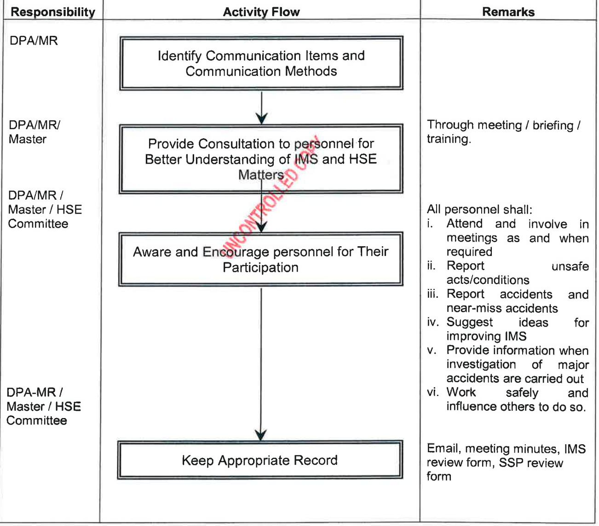

{302}------------------------------------------------

| Issue Status  | 2nd Edition, Rev 0 |
| ------------- | ------------------ |
| Issue Date    | 1st July 2014      |
| Issued by     | DPA                |
| Authorised By | Director PFS       |

# 2.2 External Communication

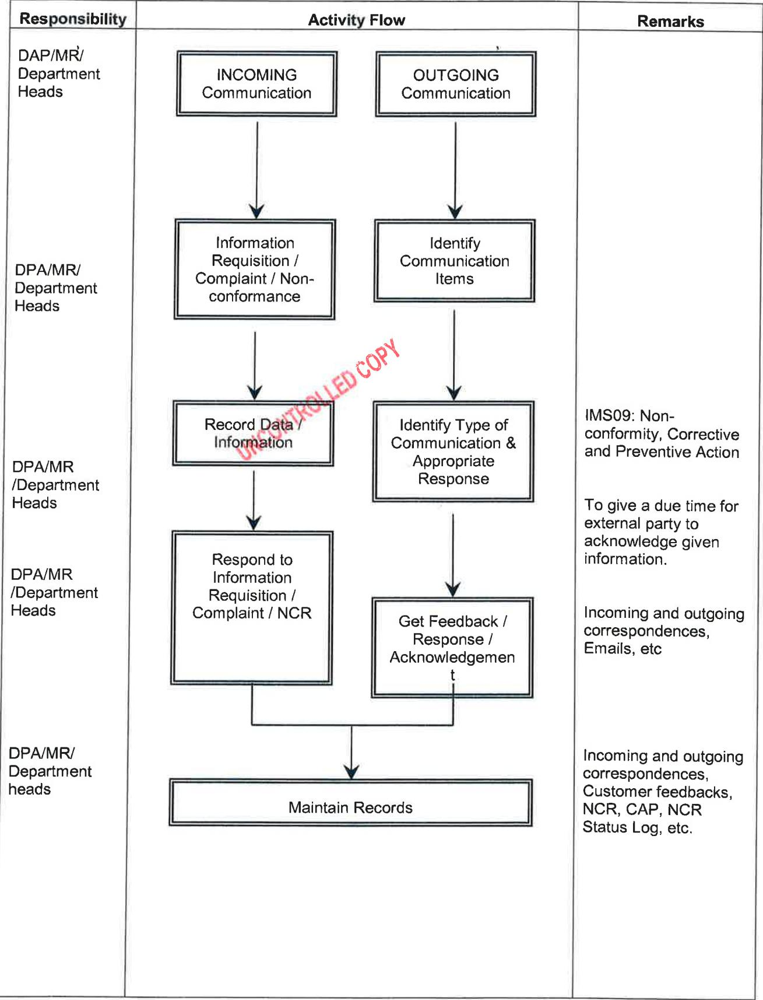

{303}------------------------------------------------

| Issue Status  | 2nd Edition, Rev 0 |
| ------------- | ------------------ |
| Issue Date    | 1st July 2014      |
| Issued by     | DPA                |
| Authorised By | Director PES       |

| Responsibility    | Activity Flow                                                                         | Remarks                                                                                                |
| ----------------- | ------------------------------------------------------------------------------------- | ------------------------------------------------------------------------------------------------------ |
|                   | Communicating Significant Environment / Performance to External Interested Parties |                                                                                                        |
| Top Management | Decision Made During Management Review                                                | Record the decision in Management Review Meeting Minutes.                                        |
|                   | YES                                                                                   |                                                                                                        |
| DPA/MR            | Decide Method of Communication                                                        | Organization does not wish to communicate to the external party about significant aspects. |

# 2.3 Communication Process

# A. INTERNAL COMMUNICATION

| No. | Subject Matter                                                                   | Channel of Communication                              | Frequency                                                                | Responsible Person                     | Information Receiver |
| --- | -------------------------------------------------------------------------------- | -------------------------------------------------------- | ------------------------------------------------------------------------ | ----------------------------------------- | ----------------------- |
| 1.  | HSE Policy                                                                       | Publicly displayed                                       | At all time                                                              | DPA/MR                                    | Every Employee       |
| 2.  | HSE Objectives, Targets and Program, HSE Legal and Other Requirement | • Meeting • Memo • Emails                          | As and when required                                                  | DPA/MR                                    | Every Employee       |
|     |                                                                                  | • Training                                               | • Induction training for new employee • Refreshment training | DPA/MR/Respecti ve Department Heads | Every Employee       |
| 3.  | Relevant Significant Aspects and Impacts OH&S Risk                   | • Briefing                                               | As and when required                                                  | DPA/MR/Respecti ve Department Heads | Every Employee       |
| 4.  | HSE Performance                                                               | • HSE Meeting                                            | • Monthly                                                                | • DPA/MR                                  | • Every Employee     |
|     |                                                                                  | • Management Review Meeting                           | • At least every 12 months                                            | • Div.Head/DPA/M R                     | • Management            |
| 5.  | Emergency Response Procedure (Office)                                   | • Emergency Response Training • Memo • Email | • Every 6 months • Occasionally                                       | MR/Div.Head                               | All Employees           |

{304}------------------------------------------------

| 6.  | Emergency Response Procedure (Shipboard)  | • Drills                                                | Monthly (as per drill schedule) | Master        | All ship staff |
| --- | -------------------------------------------------- | ------------------------------------------------------- | ---------------------------------- | ------------- | -------------- |
| 7.  | Changes that may affect HSE matters on board | • Meeting • Consultation / Briefing • Training | As and when required            | Master/DPA/MR | All ship staff |

# B. EXTERNAL COMMUNICATION

| No. | Subject Matter                                                                                  | Channel of Communication                    | Frequency               | Responsible Person                 | Information Receiver                          |
| --- | ----------------------------------------------------------------------------------------------- | ---------------------------------------------- | ----------------------- | ------------------------------------- | ------------------------------------------------ |
| 1.  | • HSE Policy • HSE Objectives, Targets and Program • Legal and Other Requirement | • Letter • Email • Briefing / Meeting | As and when required | MR                                    | Clients/Suppliers / Subcontractors            |
| 2.  | Client Complaint / Non-conformance Report (Incoming)                                      | • Verbal or written                            | As and when received | Client's Representative            | Management                                       |
| 3.  | Non-conformance Report (Outgoing)                                                            | Non-Conformance Report                      | As and when required | Management                            | Suppliers / Subcontractor's Representative |
| 4.  | Emergency Response Procedure                                                              | • Letter • Email • Briefing / Meeting | As and when required | DPA/MR (Office) Master (Vessel) | Clients/ Suppliers / Subcontractors        |

#### 3. VESSEL REPORTS

#### A. ROUTINE REPORTING

- 3.1. There are a number of standard reports initiated and sent by the ship and include but are not limited to the following:
- 3.2. Operational Reports
  - a. Noon Position Report (NPR)
  - b. Situation Report (SITREP)
  - C. Arrival/Departure Report
  - d. "0800 Hrs Report (Singapore Time)" – Usually for vessels on long tows
  - Fuel Oil (FO) and Lub. Oil (LO) Returns e.
  - f. Radio Returns
  - Issuing of Notice of Readiness (NOR's) ପ୍ର.
  - h. Issuing of Certificate of Delivery
  - i. Imprest Statement

{305}------------------------------------------------

| Issue Status  | 2nd Edition, Rev 0 |
| ------------- | ------------------ |
| Issue Date    | 1st July 2014      |
| Issued by     | DPA                |
| Authorised By | Director PFS       |

- J. Requisitions & Delivery Notes
- k. Project Specific Reports
- 1. On Hire/Off Hire ROB Report (see Appendix A)
- m. Items landed ashore (See Appendix B)

#### 3.3. Vessel Maintenance Reports

- a. Deck Maintenance Reports
- b. Planned Maintenance System (PMS) Reports
- Defect Reports C.
- d. Rectification Reports
- e. Machinery Running Reports

# 3.4. HSEQA Matters - Refer to Chapter 3 - HSEQA Regime

3.5. Crewing Matters - Refer to Chapter 4 - Shipboard Personnel Matters, Chapter 3 -HSEQA Regime and Crewing Manual.

#### NON-ROUTINE REPORTING B.

These are non-standard reports initiated and sent by the ship which may not have a defined reporting format. For example:

- Route Deviation due to weather or other causes a.
- Notes of Protest b.
- C. Rendering assistance to vessels in distress
- ರ. Salvage Report

#### C. EMERGENCY COMMUNICATIONS

These are reports related to emergencies onboard or involving the tow. These are initiated and sent using the format as described in the Emergency Reponses Procedures and/or the SOPEP/SMPEP.

#### D. CONTROL OF COMMUNICATION & ACKNOWLEDGEMENT RECEIPT

- Vessels must maintain records of all outgoing documents, either in soft or hard copy. a.
- Records of incoming documents should also be maintained. ﻘ
- Where official documents are received onboard that require acknowledgement of a. receipt, the vessel must send an acknowledgement as soon as practicable.

{306}------------------------------------------------

| Vessel:    |     |
| ---------- | --- |
| Date/Time: |     |
| Location:  |     |
| Draft:     |     |
| Fwd:       |     |
| Aft:       |     |

# This is to certify the quantities of liquid consumables presently onboard as follows:

| Type of Fuel     | Quantity M³ | SG  | Quantity MT |
| ---------------- | ----------- | --- | ----------- |
| 1.Heavy Fuel     |             |     |             |
| 2.Marine Gas Oil |             |     |             |
| 3. Other         |             |     |             |

| Type of MARINE LUBRICANTS | Total Qty in Liters |
| ------------------------- | ------------------- |
| 1.                        |                     |
| 2.                        |                     |
| 3.                        |                     |
| 4.                        |                     |
| 5.                        |                     |
| 6.                        |                     |
| 7.                        |                     |
| 8.                        |                     |
| 9.                        |                     |
| 10.                       |                     |
| 11.                       |                     |
| 12.                       |                     |
| 13.                       |                     |
| 14.                       |                     |
| 15.                       |                     |

| Type of WATER   | Total Qty (MT) |
| --------------- | -------------- |
| 1.Potable Water |                |
| 2.Drill Water   |                |
| 3. Other        |                |

# Remarks:

This Declaration is issued without prejudice to any of the concerned parties, with reservations as to information not made available or hidden at the time of the survey, and neither the Company nor the undersigned shall be held liable whatsoever for any act, error, omission or default in connection therewith.

| Master/Name/Sign           |            |
| -------------------------- | ---------- |
| Chief Engineer/Name/Sign   |            |
| Surveyor Name/Sign/Company | Ship Stamp |

{307}------------------------------------------------

| Vessel: |     | Location : |     |
| ------- | --- | ---------- | --- |
| Date:   |     | Report No: |     |

| Description of Item/s Landed ashore | Qty | Destination | Reason for landing |         |        |                 |       | Summary of      |         |
| -------------------------------------- | --- | ----------- | ------------------ | ------- | ------ | --------------- | ----- | --------------- | ------- |
|                                        |     |             | Transfer           | Service | Repair | Safe storage | Scrap | Wrong Supply | Weights |
|                                        |     |             |                    |         |        |                 |       |                 |         |
|                                        |     |             |                    |         |        |                 |       |                 |         |
|                                        |     |             |                    |         |        |                 |       |                 |         |
|                                        |     |             |                    |         |        |                 |       |                 |         |
|                                        |     |             |                    |         |        |                 |       |                 |         |
|                                        |     |             |                    |         |        |                 |       |                 |         |
|                                        |     |             |                    |         |        |                 |       |                 |         |
|                                        |     |             |                    |         |        |                 |       |                 |         |
|                                        |     |             |                    |         |        |                 |       |                 |         |
|                                        |     |             |                    | C       |        |                 |       |                 |         |

| Remarks: |     |
| -------- | --- |
|          |     |
|          |     |
|          |     |
|          |     |
|          |     |
|          |     |

Handed over by: (Name/Rank/Signature)

Received by: (Name/Rank/Signature)

Items Returned Onboard ( Where applicable )

| Description of Item/s received onboard | Date Received | Port / Position | Received By | Remarks |
| ----------------------------------------- | ------------- | --------------- | ----------- | ------- |
|                                           |               |                 |             |         |
|                                           |               |                 |             |         |
|                                           |               |                 |             |         |
|                                           |               |                 |             |         |
|                                           |               |                 |             |         |
|                                           |               |                 |             |         |
|                                           |               |                 |             |         |

| Head of Dept (Name/Rank/Signature) | MASTER/CE (Name/Signature) |
| ---------------------------------- | -------------------------- |
|                                    |                            |

{308}------------------------------------------------

# CONTENTS

#### 1. PURPOSE

- 2. RESPONSIBILITIES
- 3. PROCEDURE

#### 4. APPROVAL PROCESS

- 4.1 Approval Process - General
- 4.2 Approval Process - Assessment of Financial Integrity
- 4.3
- Approval Process Record Keeping 4.4
- RE-EVALUATION PROCESS 5.
- 6. SUPPLY OF SPARES/PROVISIONS/CONSUMABLES/OILS TO VESSELS
- VERIFICATION OF PURCHASED GOODS/SERVICES 7.

# Appendices

- A Advisory to Suppliers / Subcontractors / Service Providers
- B Evaluation of Suppliers / Subcontractors / Service Providers
- C Suppliers / Subcontractors / Service Providers Internal Evaluation Record

{309}------------------------------------------------

- ,

こ

1

:

{310}------------------------------------------------

#### 1. PURPOSE

- 1.1 In order to ensure that all goods and services procured by the Company meet or exceed the standards required by the Company.
- 1.2. Compliance with this procedure should ensure that the standard of goods provided by vendors and the standard of services provided by contractors/service providers does not compromise the standard of service provided by the Company to its Charterers.

#### 2. RESPONSIBILITIES

- 2.1 The Purchasing Department is responsible for:

  - a. Ensuring that all suppliers of goods have undergone an approval process and have been accepted as "Approved Suppliers" by the Company.
  - b. Ensuring that all approved suppliers of goods undergo periodic (at least annual) reevaluation of their performance.
  - c. of their performance.
  - d. Sourcing of stores and spares, including machinery, parts, equipments and consumable supplies.
  - Ensuring the required standard and quantity of the required goods is clearly specified to e. the suppler, as well as any requirements for additional documentation (e.g. certificates. safety data, etc.)
  - f. Monitoring the status of Purchase Orders (PO's) to ensure that the required items are supplied as specifically ordered and delivered to the vessel on schedule.
  - g.

  တ Making all necessary arrangements to ensure the required goods are delivered to the vessel efficiently and cost-effectively.

  - h. Maintaining records of the Approved Supplier process, re-evaluations carried out and the purchase/supply of goods to the Company vessels.

- 2.2 All other Departments that may, from time to time, procure services from external subcontractors/service providers are responsible for :
  - a. Ensuring that all subcontractors/service providers have undergone an approval process and have been accepted as "Approved Suppliers" by the Company.
  - b. Ensuring that all approved subcontractors/service providers undergo periodic (at least annual) re-evaluation of their performance.
  - c. For subcontractors/service providers for "one-off" jobs only, it may not be necessary to carry out a re-evaluation of their performance.
  - d. Ensuring the scope of work is clearly specified to the subcontractor/service provider, as well as any requirements for involvement of the subcontractor/service provider in the job planning and preparing process.
  - Ensuring that if equipment is to be provided by the subcontractor/service provider, it is e. suitable for the intended scope of work and has been maintained to documented standards.

{311}------------------------------------------------

ាំ )

ﮯ

{312}------------------------------------------------

- f Ensuring that if personnel are to be provided by the subcontractor/service provider, they are appropriately screened, trained, qualified and experienced personnel.
- Ensuring that the subcontractor/service provider has HSE management and working g. processes that are fully consistent with those of the Company, including meeting the Company HSE standards, expectations and requirements.
- he Ensuring that the subcontractor/service provider self-assesses the implementation of its own systems to ensure compliance.
- i. Ensuring that the contractor/service provider is made fully aware of their responsibilities. including reporting processes and lines of communication.
- j. Ensuring that, where necessary, bridging documents are developed and implemented between the subcontractor/service provider and the Company to provide effective alignment between the management systems of each party, particularly with regard to operations and emergency management.
- k. Ensuring that the performance of subcontractors/service providers is effectively monitored, especially with regard to HSE performance.
- l. Maintaining records of the Approved Supplier process, re-evaluations carried out, the services actually provided and all other relevant information.

#### 3. Procedure

- a. Supplier's performance is a critical link in the delivery process and hence the importance of evaluating suppliers/service providers including (but not limited to)
  - · Equipment and Spares Suppliers
  - Maintenance Service Providers
  - Survey and Inspection Agencies
  - Shipyards .
  - Software and Hardware Suppliers ●
  - Agencies
  - Waste Disposal Contractors
  - Fuel and Oils Suppliers
  - · Subcontract Vessel Suppliers
- b. Procurement of services and goods shall, as far as possible, only be from suppliers / subcontractors / service providers that have been approved by the Company.
- C. . It may not always be possible to carry out the full approval process, particularly in remote locations or where limited time is available. However, the Department responsible should, as far as reasonably practicable, make an assessment of the contractors/service provider it is intended to use.
- ರ Quotations may be obtained from any supplier.
- When issuing PO's for the purchase of any service and / or goods (particularly those e. which can affect vessel operations), it shall be ensured that the PO has all the relevant details as required internally.

{313}------------------------------------------------

. .

r

D

( )

{314}------------------------------------------------

#### ব Approval Process

......

- 4.1 Approval Process - General:
  - The Purchasing Department is responsible for the approval of goods suppliers and the Departmental Heads are responsible for the approval of service providers/subcontractors.
    - The approval process may be based on (but not necessarily limited to) : C.
      - . Market reputation/references
      - . Background and credentials
      - . Legal integrity
      - . Financial integrity
      - Accredited standard 0
      - Implemented HSE Management System .
      - · Other criteria as listed in Appendix A to this procedure
    - Appendices A and B to this procedure are to be used as guidance for the Purchasing d. Department personnel when carrying out the approval process on potential suppliers of goods.
    - When approving service providers/subcontractors, Heads of Departments (other than e. Purchasing Department) should develop evaluation/approval criteria to suit their requirements, using Appendices A and B as a framework for guidance.
- 4.2 Approval Process Assessment of Financial Integrity

When assessing the financial integrity of a potential goods supplier, service provider or subcontractor, the financial records as maintained by the appropriate Regulatory Authority should, where possible, be consulted (e.g. ACRA - Accounting and Corporate Regulatory Authority - in Singapore) to ensure :

- · The company/organisation providing the goods and/or services has a reasonable financial footing.
- · None of the Directors of the company/organisation is or has previously been declared bankrupt.

# 4.3 Approval Process - Assessment of Legal Integrity

When assessing the legal integrity of a potential goods supplier, service provider or subcontractor, the appropriate Regulatory Authority should, where possible, be consulted to ensure there are no current legal issues or outstanding legal cases that may affect the provision of goods and/or services.

However, it is understood that it may not always be possible to carry out financial and/or legal checks (as described in 4.2, above), especially in places where such information may not be readily available or not available at all. In such cases, the potential goods supplier, service provider or subcontractor should, as a minimum, be asked to provide declarations regarding its financial and legal status.

- 4.4 Approval Process - Record Keeping
  - a. The list of approved suppliers of goods is maintained in the Purchasing System and records of the goods supplier approval process are maintained by the Purchasing Department.

{315}------------------------------------------------

(

{316}------------------------------------------------

- Lists of approved contractors/service providers and a record of the approval processes c carried out are maintained by the appropriate Departmental Head.
- c. Results of approval processes shall be discussed as necessary in the Management Review Meeting.

#### 5. Re-Evaluation Process

- All "Approved Suppliers" of goods and/or services should be re-evaluated at least a. annually to ensure their standard of supply/service remains at an acceptable standard and records of the re-evaluation must be maintained.
- The re-evaluation criteria should be based on previously agreed stipulations, b specifications and requirements.
- Appendix C of this procedure should be used as guidance for the Purchasing C. Department personnel when carrying out the re-evaluation process on approved suppliers of goods.
- d. When re-evaluating service providers/subcontractors, Heads of Departments (other than Purchasing Department) should develop re-evaluation criteria to suit their requirements, using Appendix C as a framework for guidance.
- e Action required for under-performing suppliers/contractors/service providers shall be discussed at Management Review Meetings and action initiated based on their performance.

#### 6. Supply of Spares/Provisions/Consumables/Oils to Vessels

- 6.1 The Master, Chief Officer or Chief Engineer complete a stores or spares requisition, which is sent through the purchasing system to the Technical Superintendent.
- 6.2 In urgent cases, the requisition may be made by phone.
- 6.3 A record of all requisitions must be retained on-board,
- 6.4 The assigned Technical Superintendent reviews the requisition for the following :
  - Adequacy of information
  - Accuracy of information
  - Necessity of requisition
  - . Urgency of supply
- 6.5 If any amendments or cancellations are made they must be notified to the Vessel,
- 6.6 The Technical Superintendent then amends/cancels/approves the requisition as appropriate,
- 6.7 The vessel can check in the system regarding the proposed supply,

#### 7. Verification of Purchased Goods/Services

- When goods/services are received on-board the vessel, the Master or Chief Engineer a. must ensure that inspection takes place by a responsible Officer.
- b. The suppliers 'Delivery Order' shall be signed by the Master or Chief Engineer and the following shall be recorded (as applicable) :

{317}------------------------------------------------

: 上一篇: 上一篇: 上一篇: 上一篇: 上一篇: 上一篇: 上一篇: 上一篇: 上一篇: 上一篇: 上一篇: 上一篇: 上一篇: 上一篇: 上一篇: 上一篇: 上一篇: 上一篇: 上一篇: 上一篇: 上一篇: 上一篇: 上一篇: 上一篇: 上一篇: 上一篇: 上一篇: 上一篇: 上一篇: 上一篇: 上一篇: 上一篇: 上一篇: 上一篇: 上

..

្រ

(1)

ﮯ

{318}------------------------------------------------

| Issue Status  | 2nd Edition, Rev 0 |
| ------------- | ------------------ |
| Issue Date    | 1st July 2014      |
| Issued by     | DPA                |
| Authorised By | Director PFS       |

- Missing items .
- Damaged items (to be returned to the supplier) .
- Wrongly delivered items (to be returned to the supplier) .
- Poor service .
- Results of any tests .
- A copy of the 'Delivery Order' must be retained by the Master or Chief Engineer and a C. copy is forwarded to the Office.
- d. Wrongly or damaged delivered items that cannot be immediately returned to the supplier should be isolated from use on-board and labelled 'DO NOT USE' until the items can be landed.
- e. Ships personnel should consider the security implication of items arriving onboard, especially unexpected items. Refer to Shipboard Security Plan

{319}------------------------------------------------

0

( )

{320}------------------------------------------------

# IMS 11B - APPENDIX A ADVISORY TO SUPPLIERS / SUBCONTRACTORS / SERVICE PROVIDERS

| Issue Status  | 2nd Edition, Rev 0 |
| ------------- | ------------------ |
| Issue Date    | 1st July 2014      |
| Issued by     | DPA                |
| Authorised By | Director PFS       |

To

Attn

Date

# ADVISORY TO SUPPLIERS / SUBCONTRACTORS / SERVICE PROVIDERS

Dear Sir/Madam,

SR MARINE FLEET SERVICES (PFS) has implemented an Integrated Management System that meets the standards required by the ISM Code and the ISO 9001, ISO 14001 and OHSAS 18001 Standards. This system requires formal review and evaluation of suppliers, sub-contractors and service providers to meet specified requirements for both materials and services as required by the Company standards.

PFS maintains records of existing suppliers, subcontractors and service providers as well as assessing potential new suppliers, subcontractors and service providers. You are therefore requested to complete the attached questionnaire and return it to the undersigned within one month of the above date, together with any supporting information, such as copies of any Quality or HSE Certification you may hold, or any other documentary evidence of complicable. The information you provide will be treated in the strictest confidence and will be used to update our existing List of Approved Suppliers.

There may also be occasions when we may request access to your premises for the purpose of verification at source of materials / services. Where this is a specified requirement we seek your cooperation. Notice for such visits would be communicated in advance.

Our criteria for assessing new suppliers/sub-contractors may include, but is not necessarily limited to, the following:

- a) Price
- Ability to meet specification / requirements / Company specified standards b)
- C) Ability to meet delivery targets
- d) Responding to queries
- Compliance with the applicable National requirements for HSE standards e)
- Accreditation of supplier (e.g. ISO standard) f)
- Recommendation by other Customers ರು)
- h) After-sales service
- i) Past track Record

We also reserve the right to use various methods of assessing new suppliers / service providers / subcontractors which may include, but not necessarily be limited to, the following:

- Writing to the suppliers/service providers/sub-contractors requesting written confirmation j) regarding the standard of the goods / services being offered
- Meeting with and inspecting/assessing the quality of the goods/services offered k)
- Auditing quality standards of potential suppliers/service providers/sub-contractors l)
- m) Carrying out reference, credibility & background checks as required
- Monitoring the performance of new suppliers/service providers/sub-contractors n)

Yours faithfully,

{321}------------------------------------------------

# IMS 11B - APPENDIX B EVALUATION OF SUPPLIERS / SUBCONTRACTORS / SERVICE PROVIDERS

| Issue Status  | 2 nd Edition, Rev 0 |
| ------------- | ------------------------------ |
| Issue Date    | 1 st July 2014      |
| Issued by     | DPA                            |
| Authorised By | Director PFS                   |

# Name of Supplier / Subcontractor / Service Provider :

Address :

Person in Charge of Quality and HSE:

Tel. No. :

E-Mail :

Type of Materials / Services Supplied :

# 1. HSE and Quality Related Certification

Compliance to standards: (List down any National standards to which your Company is complying such as ISO ( 9001, 14001, OHSAS 18001, ISO 50,001 or any other (If yes kindly provide a copy of the certificate)

| 2. Compliance to Applicable HSE standards (Kindly tick applicable box)                                                                 |                                                                                    |                          |                          |                          |
| -------------------------------------------------------------------------------------------------------------------------------------- | ---------------------------------------------------------------------------------- | ------------------------ | ------------------------ | ------------------------ |
| Kindly answer below questions for your products / services. Please justify on a separate sheet if the answer to any questions is 'No'. |                                                                                    |                          |                          |                          |
|                                                                                                                                        |                                                                                    | Yes                      | No                       | NA                       |
| 1                                                                                                                                      | We comply with applicable National/International Safety & Work place regulations   | <input type="checkbox"/> | <input type="checkbox"/> | <input type="checkbox"/> |
| 2                                                                                                                                      | We have an HSE Management System in place that meets or exceeds Industry Standards | <input type="checkbox"/> | <input type="checkbox"/> | <input type="checkbox"/> |
| 3                                                                                                                                      | We have documented work processes that are consistent with Industry practices      | <input type="checkbox"/> | <input type="checkbox"/> | <input type="checkbox"/> |
| 4                                                                                                                                      | We comply with applicable National/International Environmental regulations         | <input type="checkbox"/> | <input type="checkbox"/> | <input type="checkbox"/> |
| 5                                                                                                                                      | The Top Management is involved in HSE matters                                      | <input type="checkbox"/> | <input type="checkbox"/> | <input type="checkbox"/> |
| 6                                                                                                                                      | Our Company's license has not been suspended due to any HSE lapse                  | <input type="checkbox"/> | <input type="checkbox"/> | <input type="checkbox"/> |
| 7                                                                                                                                      | We consent to an on-site audit / inspection                                        | <input type="checkbox"/> | <input type="checkbox"/> | <input type="checkbox"/> |
| 3. Improving HSE performance (Kindly tick applicable box)                                                                              |                                                                                    |                          |                          |                          |
|                                                                                                                                        |                                                                                    | Yes                      | No                       | NA                       |
| 1                                                                                                                                      | We promote a strong HSE awareness and culture amongst our staff / employees        | <input type="checkbox"/> | <input type="checkbox"/> | <input type="checkbox"/> |
| 2                                                                                                                                      | We undertake to improve HSE standards in our Company                               | <input type="checkbox"/> | <input type="checkbox"/> | <input type="checkbox"/> |
| 3                                                                                                                                      | We endeavour to reduce the generation of waste in our company                      | <input type="checkbox"/> | <input type="checkbox"/> | <input type="checkbox"/> |
| 4                                                                                                                                      | We internally self-assess to ensure compliance with and improve our systems        | <input type="checkbox"/> | <input type="checkbox"/> | <input type="checkbox"/> |
| 4. Performance - how do you ensure your personnel are trained, experienced and qualified?                                              |                                                                                    |                          |                          |                          |
| When equipment is to be provided, how do you ensure it is suitable and maintained to documented standards?                             |                                                                                    |                          |                          |                          |

| 5. Supplier's Declaration and Acknowledgement |                                                                                                                       |                                                                                                                                   |
| --------------------------------------------- | --------------------------------------------------------------------------------------------------------------------- | --------------------------------------------------------------------------------------------------------------------------------- |
| 1                                             | The above information is correct and updated.                                                                         | <label><input name="q1" type="checkbox" value="yes"/> Yes</label> <label><input name="q1" type="checkbox" value="no"/> No</label> |
| 2                                             | We shall advise SR MARINE Fleet Services Pte Ltd, if there is a change in any of the above data.                      | <label><input name="q2" type="checkbox" value="yes"/> Yes</label> <label><input name="q2" type="checkbox" value="no"/> No</label> |
| 3                                             | Our Company is financially stable with no current or pending bankruptcy issues                                        | <label><input name="q3" type="checkbox" value="yes"/> Yes</label> <label><input name="q3" type="checkbox" value="no"/> No</label> |
| 4                                             | Are there any current legal issues or outstanding legal cases that may affect the provision of goods and/or services? | <label><input name="q4" type="checkbox" value="yes"/> Yes</label> <label><input name="q4" type="checkbox" value="no"/> No</label> |
| Name & Signature                              | Designation                                                                                                           | Date                                                                                                                              |

Please return the completed questionnaire to: SR MARINE FLEET Service Pte. Ltd. 59 Shipyard Road, Jurong, Singapore 628143

{322}------------------------------------------------

# IMS 11B - APPENDIX C SUPPLIERS / SUBCONTRACTORS / SERVICE PROVIDERS INTERNAL RE-EVALUATION

| Issue Status  | 2nd Edition, Rev 0 |
| ------------- | ------------------ |
| Issue Date    | 1st July 2014      |
| Issued by     | DPA                |
| Authorised By | Director PFS       |

# FOR INTERNAL USE AND DISTRIBUTION ONLY

| Particulars     |     |
| --------------- | --- |
| Vendor Name:    |     |
| Telephone:      |     |
| E-Mail          |     |
| Contact Person: |     |
| Designation:    |     |
| Services:       |     |

# Evaluation Record

| <60 Poor          |
| ----------------- |
| 60-70 Fair        |
| >70-80 Good       |
| >80-90 Very Good  |
| >90-100 Excellent |

| Criteria |                                             | Year: |        | Remarks |
| -------- | ------------------------------------------- | ----- | ------ | ------- |
|          |                                             | Total | Faulty |         |
|          | Total number of supplies/services        |       |        |         |
| 01       | Packaging/Packing                           |       |        |         |
| 02       | Poor Quality                                |       |        |         |
| 03       | Poor Services                               |       |        |         |
| 04       | Poor response                               |       |        |         |
| 05       | Short supply                                |       |        |         |
| 06       | Wrong supply                                |       |        |         |
| 07       | Late delivery                               |       |        |         |
| 08       | Higher than market                          |       |        |         |
| 09       | HSE Performance                             |       |        |         |
| 10       |                                             |       |        |         |
| 11       |                                             |       |        |         |
| 12       |                                             |       |        |         |
|          | %age Grade: 100 x (Total-Faulty) / Total |       |        |         |
|          | Additional Comments                         |       |        |         |
|          | Evaluated By (Sign & Date)                  |       |        |         |
|          | Approved By (Sign & Date)                   |       |        |         |

{323}------------------------------------------------

| Issue Status  | 2nd Edition, Rev 0 |
| ------------- | ------------------ |
| Issue Date    | 1st July 2014      |
| Issued by     | DPA                |
| Authorised By | Director PFS       |

# CONTENTS

#### 1. PURPOSE

#### 2. PLANNED MAINTENANCE

#### CONDITION BASED MAINTENANCE 3.

#### 4. LSA & FFE MAINTENANCE

- 4.1 Responsibility
- 4.2. LSA / FFE Testing, Inspection and Maintenance
- 4.3 Equipment Renewal

#### 5. CRITICAL EQUIPMENT

- 5.1 Scope and Identification
- 5.2 Maintenance of Critical Equipment
- 5.3 Critical Equipment Spares
- 5.4 Use of on-board Emergency Equipment
  - 5.4.1 Fire Pump & Emergency Fire Pump
  - Emergency Generator 5.4.2
  - 5.4.3 Fuel Trips
  - Fire Dampers 5.4.4
  - Fire Detection System 5.4.5
  - 5.4.6 Fixed Smothering System
  - 5.4.7 Fridge Alarms.
  - 5.4.8 Emergency Steering Gear
  - 5.4.9 Oily Water Separator
  - 5.4.10 Waste Disposal Equipment
  - 5.4.11 Communication and Navigation Equipment
  - 5.4.12 Rescue Boat Engine

#### DEFECT REPORTING 6.

#### 7. DECK MAINTENANCE

- 7.1 Responsibility
- 7.2 Vessel Appearance.
- 7.3 Regular Maintenance
- 7.4 Lifting and Cargo Securing Appliances and Equipment
- 7.5 Towing and Anchor Handling Gear
- 7.6 Records
- 7.7 Inspection
- 7.8 Gas Monitors/Oxygen Analysers

#### ENGINE ROOM MAINTENANCE 8.

- 8.1 Responsibility
- 8.2 Maintenance Periods
- 8.3 Classification Requirements
- 8.4 Undertaking Maintenance

{324}------------------------------------------------

| Issue Status  | 2nd Edition, Rev 0 |
| ------------- | ------------------ |
| Issue Date    | 1st July 2014      |
| Issued by     | DPA                |
| Authorised By | Director PFS       |

8.5 Records

#### 9. DRY DOCKING / AFLOAT REPAIRS - DECK DEPARTMENT

- 9.1 Repair List
- 9.2 Stability
- 9.3 Monitoring
- 9.4 Re-floating

#### 10 DRY DOCKING / AFLOAT REPAIRS - ENGINE ROOM DEPARTMENT

- 10.1 Preparing For Repairs
- 10.2 Upon Arrival In Dock
- 10.3 Monitoring Repairs
- 10.4 Daily Meetings
- 10.5. Testing
- 10.6. Re-floating
- EQUIPMENT CALIBRATION LOG 11.
- MAINTENANCE AND INSPECITION OF LIFTING GEAR 12.
- 13. MAINTENANCE AND CARE OF MOORING ROPES

| Appendix A | :   | Equipment Calibration Log                          |
| ---------- | --- | -------------------------------------------------- |
| Appendix B | :   | Defect Report                                      |
| Appendix C | :   | Defect Report Summary                              |
| Appendix D | :   | Quarterly Inspection and Maintenance Log           |
| Appendix E | :   | Portable Electrical Equipment Maintenance Log      |
| Appendix F | :   | Colour Coding of Anchor Handling & Towing Shackles |

{325}------------------------------------------------

#### 1. PURPOSE

- 1.1. A Planned Maintenance System (PMS) ensures that maintenance, repair and dry-docking work is carried out in an efficient, controlled and effective manner, with adequate records , maintained
- The Chief Engineer is required to manage the PMS onboard with the assistance of the Chief 1.2. Officer. However, the ultimate responsibility rests with the Master.
- 1.3. WinSDS (Windows Ship Data System) is implemented onboard the vessels for the management of Planned Maintenance and Spare Parts onboard the vessels. Data is daily exchanged between the Head Office and the ship. The Superintendents and the Purchasing Officers use Head Office version of WinSDS. They are therefore able to oversee the Planned Maintenance onboard and follow up on the spare parts requisitions.

#### つ PLANNED MAINTENANCE

- 2.1 A planned approach to repair and maintenance is most important. Without careful planning, there can be no identification of workload, which could lead to improper work allocation, inefficient personnel utilisation and possible oversights.
- 2.2. When it is envisaged that some stores, spares or material will be required to effectively undertake some foreseeable routine maintenance and repair items, the necessary requisition should be created in WinSDS under Spares and Stores Windows well before hand for ensuring timely supply so as not to hamper the schedule.
- 2.3. Inventory of spares and stores should be updated whenever items are received or consumed to keep the inventory accordingly
- 2.4. Before undertaking routine maintenance or repairs of any component which can be best done while in port, the duration of the vessel's port stay should be known and a judgement made whether the job can be affected in the time-frame, in order not to cause any delay of the vessel
- 2.5. Repair work which the capabilities of the ship's staff or which involves fabrication or expert knowledge etc. should be planned as far as possible to be attended to during the vessel's routine dry-docking or periods of long port stay without compromising the safe operation of the vessel.

#### 3 CONDITION BASED MAINTENANCE

- 3.1 -An additional maintenance system when applied to planned maintenance for the purpose of initiating maintenance procedures is intimately linked to "performance monitoring" or referred to as "predictive maintenance"
- 3.2 Condition based maintenance means any measurable condition (Data on wear and tear, Electrical, Evaluation criterion, Load, Performance check, Pressure, Temperature, Visual, Vibration, Water-tightness factor) supported by what may be used as part of a maintenance routine and that the condition being monitored is convenient to read with repeatable results being achieved.
- 3.3 This kind of maintenance system is applied to monitoring the condition in real time that is when the machinery is in operation or running. A condition based maintenance record can be used to show the current status of the running machinery in good order and that does not require the components of the machinery from being dismantled for the inspection or survey.
- 3.4 This approach of maintenance can have considerable savings in terms of spares and down time as well as in terms of human resource necessary to carry out the overhaul and reassembly of the machinery

{326}------------------------------------------------

| Issue Status  | 1st Edition, Rev 0 |
| ------------- | ------------------ |
| Issue Date    | 1st July 2014      |
| Issued by     | DPA                |
| Authorised By | Director PFS       |

- 3.5 Under this maintenance regime, more rigorous testing and monitoring systems must be employed to justify extending the maintenance periods.
- 3.6 Testing and monitoring systems have been put in place by the technical management to ensure optimum balance in the maintenance regime between availability, downtime, cost and safety.
- 3.7 Testing and monitoring devices shall always be calibrated and capable of giving meaningful and known measurement before use.
- 3.8 Records maintained on board and at office to demonstrate compliance with the company's Condition Based Maintenance system as follows:

# Externally Generated Records:

- a. Quarterly Class Listing
- b. Statutory Records, reports and certificates
- Port State Control Inspection reports C.
- ರ OVID/OVMSA reports

# Internally Generated Records:

- e. Records of routine shipboard inspections (Win SDS PMS)
- Records of maintenance work carried out (Win SDS PMS) f.
- Records of testing of standby and other critical equipment (Win SDS PMS) g.
- ﻏ Records of testing of alarms and emergency shut downs (Win SDS PMS)
- Records of monthly Main Engine performance data (Technical Superintendent) 1.
- Defect report (Operations, Technical and HSEQA) 1.
- Spare part requests, acknowledgements and delivery notes k.
- -Lube oil and Hydraulic oil test analysis report
- Technical Superintendent annual visit and inspection report m.
- Internal and third party audit reports n.
- Reports of non conformities, accidents and hazardous occurrences 0.
- Records of the implementation and verification of corrective action 0.

#### A LSA & FFE MAINTENANCE

#### 4.1 Responsibility

- 4.1.1 The Master designates the Chief Officer to be in overall charge of ensuring the maintenance work is carried out. However, the Chief Officer may designate one of the Deck Officers and the Chief Engineer may designate one of the Engineers to actually carry out the maintenance work.
- 4.1.1 The designated Officer onboard shall maintain a record of safety/emergency equipment maintenance (either in the PMS or in hard copy) as required by SOLAS which should be kept updated for inspection.
- 4.1.2 All equipment is checked and maintained as required by Class/Flag/IMO.
- 4.1.3 To assist in carrying out the LSA maintenance, the SOLAS Checklist for Life Saving Appliances (SOLAS Chapter III Regulation 20/36) may be used as a guideline.

{327}------------------------------------------------

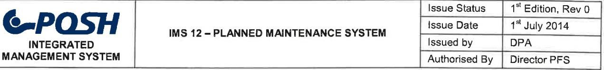

# 4.2 LSA & FFE Testing, Inspection and Maintenance.

- 4.2.1 Records of testing of the Safety/Emergency equipment must be entered in the Deck Logbook & Engine Room Logbook. All personnel onboard should be given the opportunity for handson experience on this equipment in order to be familiarised with their operation.
- 4.2.2 As far as reasonable and practicable, the rescue boat/FRC shall be launched each month with their assigned crew aboard and manoeuvred in the water. In all cases this requirement shall be complied with at least every three months. (Note : if in port, it is usually necessary to obtain permission from Authorities to do so). When fully lowered, the boat should be let go from the falls and the crew given the opportunity of maneuvering the rescue boat. At the same time the Rescue Boat launching system must be tested. This procedure should be supervised by an Officer and good communications should be maintained with the vessel. On completion, a record of these tests should be made in the log book.
- 4.2.3 The following items, if applicable, shall be inspected / tested / maintained as per the PMS :
  - a. Fire extinguishers
  - b. Fire blanket
  - Sand buckets C.
  - ರ. Fireman's outfits
  - e. Self Contained Breathing Apparatus (including EEBD and BA Cylinder Compressor where fitted)
  - f. Resuscitation Equipment and other Medical Equipment
  - Fire hoses, Inspect monthly & Pressure test every 3 months ರು.
  - h. Fire flaps
  - i Fire hydrants and main stop valves
  - j. Foam / Water Mist / Sprinkler system
  - k. CO2 systems (ensure safety pins are removed)
  - 1.  Liferaft boarding areas illumination
  - Rescue boat condition and equipment m.
  - Liferaft including correct attachment of hydrostatic release n.
  - Lifejackets (including light, whistle) O.
  - Lifebuoys (including lanyard, lights, markers etc. where fitted) p.
  - Man-overboard equipment ರ
  - Line throwing apparatus / Bridge pyrotechnics r.
  - Bulkhead 'Safety Plan' up to date & legible S.
  - External 'Safety Plan' up to date & legible t.
  - u. Safety Training Manual - up to date & in messrooms
  - EPIRB & SART V.
  - Muster Station Lists W.
  - Emergency Radio Equipment X.
  - y. Immersion Suits
  - Other items as may be identified on board. 7
- 4.2.4 The following items, if applicable, should be tested weekly -
  - Fire and General alarms a.
  - b Emergency fire pump
  - Emergency generator (automatic cut-in every month) C..
  - d. Bridge to Emergency Steering Gear change-over and communications
  - e. Steering Compartment Compass Repeaters
  - f. Oily Water Separator
  - Communication and Navigation Equipment a.
  - h. Boat Engine

{328}------------------------------------------------

| Issue Status  | 1st Edition, Rev 0 |
| ------------- | ------------------ |
| Issue Date    | 1st July 2014      |
| Issued by     | DPA                |
| Authorised By | Director PFS       |

#### 43 Equipment Renewal

- 4.3.1 Certain items of safety equire renewing at intervals. The renewal or expiry dates are usually marked on the exterior of each item and a record of all dates should be maintained in the PMS or hard copy. These items include :-
  - Pyrotechnics a.
  - Line throwing apparatus charges b.
  - C. Liferafts and hydrostatic releases (servicing)
  - ದ Man-overboard Smoke/Light Float
  - e. Lifebuoy lights
  - f. SART batteries
  - EPIRB batteries Q.
  - GMDSS Batteries h.
- 4.3.2 A 'Requisition' should be created in WinSDS stores windows and the Technical Superintendent informed prior to expiry giving full details and expiry date of the item.
- 4.3.3 Expired items (particularly pyrotechnics and batteries) must not be kept onboard and must be properly disposed of through Technical Dept or arrangements with local agents and a record of disposal maintained in the Garbage Record Book. Expired Pyrotechnics MUST NOT be fired off in order to dispose of them and batteries should not be disposed of over the side.
- 4.3.4 All fire extinguishers should be inspected at least annually by a competent person and serviced every two years by a recognised company.
- 4.3.5 All breathing apparatus cylinders should be inspected every year and pressure tested every five years by a recognised company. In addition, the air in SCBA Cylinders (but NOT in EEBD Sets) should be emptied and recharged every three months to ensure the air is fresh,

#### 5 CRITICAL EQUIPMENT

#### 5.1 Scope and Identification

- 5.1.1 Critical equipment is any item that, if it fails, may affect the following :
  - The seaworthiness of the vessel
  - The operations that the vessel is carrying out
  - The health and safety of personnel and the environment in which the vessel is working
- 5.1.2 The identification of what should be considered as "critical equipment" should be based on :
  - Manufacturer's recommendations
  - Operating experience
  - Industry guidelines and feedback
  - Class / Flag requirements / recommendations
  - Maintenance history and "lessons learned"
  - Performance analysis / condition monitoring trending
  - The impact on health / environment if the item were to fail
  - The impact on the seaworthiness / safety of the vessel if the item were to fail
  - The impact on vessel operations if the item were to fail
  - Charterer's additional requirements
- 5.1.3 A list of critical items is developed for all Company vessels by the Company Technical Department in conjunction with the Chief Engineer and Master.
- 5.1.4 Special attention is given to the recording of test and performance data for all critical equipment and systems by the Technical Superintendent and the Chief Engineer.

{329}------------------------------------------------

- 5.1.5 The critical items list may be amended from time to time depending on requirements.
- 5.1.6 The basic list of "Critical Items" that is applicable to all vessel may be (but not necessarily limited to) the following :
  - Seaworthiness
    - Emergency Generator
    - FRC
    - Fire and General Service Pump
  - Operational
    - Anchor Handling and Towing Winches .
    - Shark Jaws and Tow Pins
    - Cargo System (i.e. Brine, Mud, Base Oil, Dry Bulk Drill Water, Air Dryer)
  - · Health, Environmental
    - Oily Water Separator .
      - Air Conditioning and Refrigeration Plant
    - Sewage Treatment Plant
    - Bilge Pump
    - Sludge Pump

# 5.2 Maintenance of Critical Equipment

- 5.2.1 Maintenance of critical equipment must be carried out in accordance with the Planned Maintenance System.
- 5.2.2 The appropriate Technical Superintendent must be informed prior to any maintenance on critical equipment being carried out.
- 5.2.3 Prior to carrying out maintenance on critical equipment, a risk assessment must be carried out (using the Risk assessment process as described in IMS 03).
- 5.2.4 The Risk Assessment should address (but not necessarily be limited to) the following :
  - Risks to personnel in doing the job .
  - Competency of personnel doing the job
  - Availability of the correct spares and tools for the job
  - Impact on other activities
  - Worst case scenarios
  - Alternative back-up equipment / systems
  - Necessary modification in operational procedures as a result
  - Recovery and mitigation measures
  - Commissioning and testing procedures
  - Additional safety precautions / procedures
- 5.2.5 If any maintenance on critical equipment is likely to have an effect on the safe operating of the vessel, the Management of Change (MoC) process as described in IMS 03 should be followed.
- 5.2.6 If the agreed shutdown period for critical equipment or systems is to be exceeded, any extension or alternative actions will require review by shore management.
- 5.2.7 A further risk assessment is undertaken if circumstances (such as environmental conditions, crew fatigue or operational parameters) change.
- 5.2.8 No maintenance should be carried out when the vessel is in a 500 metre Zone and/or whilst operations are being carried out (e.g. anchor handling operation, DP Operations).

{330}------------------------------------------------

#### 53 Critical Equipment Spares

- 5.3.1 A list of critical equipment spares is developed for all Company vessels by the Company Technical Department in conjunction with the Chief Engineer and Master.
- 5.3.2 The inventory of critical equipment spares is maintained and monitored by the Chief Engineer and the appropriate Technical Superintendent advised accordingly.
- 5.3.3 Spares items should be properly marked for easy identification and carefully stored.
- 5.3.4 Used items that are still serviceable should also be properly identified and stored separately from new items.
- 5.3.5 There should be "minimum stock levels" indicated in the inventory and, when the spares are consumed, an order for replacements must be raised as a priority and the Technical Superintendent advised.
- 5.3.6 The Chief Engineer should also bear in mind the operating location of the vessel may result in longer delivery time for such items, therefore forward planning must be carried out to ensure availability.

# 5.4 Use of on-board Emergency Equipment

In order to train all personnel on board in the methods of operating this equipment, it is recommended that different people test the items under the supervision of an Engineer. In an emergency situation, the more people who are aware of how to operate the equipment, the better it will be. Chief Engineer shall keep ship specific written procedures readily available within the engine room.

# 5.4.1 Fire Pump & Emergency Fire Pump

- These pumps are to be tested weekly and the test recorded in the Engine Logbook. a.
- b. They may be run as part of a Fire Drill.
- At least two Fire Hoses shall be used and a good jet of water is required from each. c.
- d. Instructions on how to start the fire pump and the emergency fire pump must be posted on or adjacent to the equipment.

#### 5.4.2 Emergency Generator

- a. The emergency generator is to be tested weekly and recorded in the Engine Logbook. The secondary starting system must also be tested at the same time.
- ف Instructions on how to start the engine must be locally posted on or adjacent to the equipment.
- The fuel and oil levels should be checked (the minimum fuel level should be marked ن on the tank)
- d. in' is operable (if applicable).
- e. All equipment and lights operated under the emergency system should be checked.

#### 5.4.3 Fuel Trips.

a. operational exigencies) and recorded in the Engine Logbook.

{331}------------------------------------------------

#### 5.4.4 Fire Dampers

- a. All fire dampers should be checked as per PMS in WinSDS.
- b. The operating/closing mechanism should be accessible, free to move, lubricated as required and the Fire Damper itself must be clearly painted in red (where practicable).

#### 5.4.5 Fire Detection System

- a. A selection of sensors should be tested as per PMS in WinSDS,
- ف An entry should be made in the Engine Logbook for each test.

#### 5.4.6 Fixed Smothering System

- a. The fixed smothering systems should be visually inspected weekly. In addition, the Engine Room 'Evacuation' alarm should be tested monthly, although testing must only be done when the vessel is in port or at anchor. If a monthly test has to be missed due to the vessel being at sea, then the 'Evacuation' alarm must be tested as soon as possible thereafter.
- b. It may be necessary to insert the Safety Pins in order to carry out testing on the system or at other times when work is being carried out on board. However, it must be ensured that the Safety Pins on the Smothering System have been taken out when such work is completed in order to make the system operable again.
- An entry should be made in the Engine Logbook of all tests, c.
- d. All fixed smothering system cylinders should be level checked by a recognised company as per PMS. The certificate issued for the level test is to be retained on board

#### 5.4.7 Fridge Alarms.

a. The 'Fridge Lock-in' alarms are to be tested weekly.

#### 5.4.8 Emergency Steering Gear

- Instructions for changing over to emergency steering should be posted in the steering ം
  സ് flat and on the Bridge.
- Every three months and in full co-operation with the Master, the emergency steering b. shall be tested. See Emergency Drills Matrix and Training Plan.
- C. All Engineers should be familiar with this procedure.
- ರ. The bridge/steering gear communications should be tested weekly.
- e. All tests to be entered in the Deck and Engine Logbook.

#### 5.4.9 Oily Water Separator

- a. Oily Water Separators are not designed to handle "raw" bilges but to reduce the content of oil in water taken from the bilges and settled in the Bilge Holding Tank.
- b. filtering elements with oil and the equipment will not function correctly.
- All fitted sensors and alarms must be tested and proved functional on a weekly basis. C.

{332}------------------------------------------------

| Issue Status  | 1st Edition, Rev 0 |
| ------------- | ------------------ |
| Issue Date    | 1st July 2014      |
| Issued by     | DPA                |
| Authorised By | Director PFS       |

- The Chief Engineer Officer shall delegate a responsible member of the Engine Room ರ staff to carry out these tests and to make a suitable entry in the Engine Room Logbook.
- Clear and specific instructions for the operation of the OWS are to be posted in the e. immediate vicinity of the equipment. Pipelines to and from the equipment are to be clearly marked showing flow directions.
  - Routine maintenance recommendations and schedules of the OWS are to be f followed, particular attention being paid to the following:
    - Periodic cleaning of the internal elements.
    - Operation of automatic valves.
    - Integrity of the automatic valves.
    - Periodic cleaning of the internal elements.
    - Calibration of the 15ppm meter
    - Alarm and control equipment 0

# 5.4.10 Waste Disposal Equipment

Sufficient spares are to be carried to maintain all waste disposal equipment in proper working order including :

- Incinerator (where fitted), including Alarm and Control equipment.
- Bilge Pump(s).
- Sludge pump(s).

# 5.4.11 Communication and Navigation Equipment

The Master has overall responsibility for ensuring all items of communication and navigation equipment are in good working order and shall personally randomly check operational items of equipment each day.

- a. ensure the secrecy of correspondence and are to ensure that the radio equipment is used at all times in accordance with the International Radio Regulations.
- b. All Deck Watch-keepers are to use all communications and navigation equipment according to the manufacturers' instruction books, become proficient in their operation and be aware of the limitations of the equipment being used.
- c. Refer to the GMDSS Handbook for advice on the operation of DSC equipment, EPIRBs and satellite terminals.
- d. The Master is to designate one Deck Officer as having primary responsibility for radio communications during distress incidents. This must be indicated in the GMDSS log book.

# Maintenance

- a. The Master must be advised at once if there is any problem with the gyrocompass and/or radar and any other items of communication and/or navigation equipment.
- b. Any routine maintenance should be carried out in accordance with the instructions laid down in the manufacturers' instruction manuals on board.

{333}------------------------------------------------

| Issue Status  | 1st Edition, Rev 0 |
| ------------- | ------------------ |
| Issue Date    | 1st July 2014      |
| Issued by     | DPA                |
| Authorised By | Director PFS       |

- a The Electrician (or designated engineer) must be advised promptly of any defects found during operation of the units so that these can be rectified without undue delay.
- b. In the event that the Electrician (or designated engineer) is unable to repair any defective equipment, the Master must liaise with Office and shore technicians arranged accordingly.

# Magnetic Compass

a. The Master is responsible for the proper use and stowage of the correcting magnets for the magnetic compass.

# Signal Lights

a. Each vessel should clearly identify the special light signals required, especially for Japanese ports (and mark them on the switchboard if necessary), verify that they are operational and ensure that they are checked on a regular basis.

# Emergency Air Horn

- a . Another item that has been found to be overlooked is the emergency operation of the air horn, which is normally some form of wire / pulley arrangement.
- b. Once a month this equipment must be checked to ensure working satisfactorily and ensuring that all moving parts are greased.

# Automatic Identification System (AIS)

- a. The procedure for testing of the internal GPS (where fitted) should ensure it cuts in when the external supply fails. This can only be simulated by disconnecting the input cable
- c. There may be no warning given or other visual indication when the external supply fails, so checking to see whether the external supply is functioning is not possible.
- d. Each ship should check the maker's instructions to see what testing procedure is applicable.
- e. It should also be remembered that if possible the power should be switched to "LOW" after berthing and switched back to "HIGH" prior to departure.

# 5.4.12 Rescue Boat Engine

- a. The Rescue Boat Engine is to be tested weekly and recorded in the Engine Logbook.
- ﺿ Instructions on how to start the engine must be locally posted on or adjacent to the equipment.
- C. Ensure the engine is securely clamped or bolted to the boat.
- ರ. Ensure fuel is fresh and uncontaminated and that the fuel tank is filled to maximum capacity.
- e. Ensure that the controls operate correctly (i.e : Turn the steering wheel from lock to lock and the throttle/gear control from ahead to astern).
- f. Ensure Throttle control is neutral and propeller is out of gear.

{334}------------------------------------------------

- Ensure the connections of the fuel line to the tank and to the engine are in good o condition and free of kinks.
- Ensure the filter bowl is free of dirt or water and drain it off if it is fitted with a water ﮯ separator/filter.
- Ensure all the necessary switches and circuit breakers are switched on if the engine i is connected to the boat's electrical system.
- The flow of cooling water and its temperature should be checked after starting the engine.
- k. Any oil or water leakage and abnormal engine sounds should be checked.
- Engine should be allowed to warm up so that it will tick-over smoothly.

#### 6 DEFECT REPORTING

- 6.1 Defects regarding LSA and FFE onboard should be communicated directly to the Technical Superintendent for decisions to be made as to how the repairs are to be carried out.
- 6.2 A summary of defects is to be included in the ship's monthly HSE Reports to the HSEQA Department.
- 6.3 Any defect to critical equipment should be brought to the notice of Technical and HSE department immediately and shall be dealt with urgent priority.
- 6.4 The standard defect report, Appendix B, form shall be raised for all equipment defects whether it is rectified by ship staff or by shore assistance.
- 6.5 All vessels shall maintain the defect summary report, Appendix C, and email it to Technical Department with other month end report documents.
- 6.6 Defects to critical equipment will further require to be reported to flag state with root cause analysis and timeline for rectification. Any non reported defects to critical equipment may lead to detention by flag state or port state control, the reporting to flag state control will be carried out by Technical or HSEQA Dept after receiving reports from Master.
- 6.7 Deck and Engine department shall maintain separate defect reports and summary reports.

#### DECK MAINTENANCE 7

#### 7.1 Responsibility

- 7.1.1 The Chief Officer is responsible for deck maintenance and he may seek the Chief Engineer's assistance for items beyond the capabilities of the deck crew.
- 7.1.2 The Bosun is responsible for the deck ratings and must report to the Chief Officer each morning to obtain the daily work schedule.

#### 7.2 Vessel Appearance

7.2.1 The vessel should be clean and painted in line with the Company's colour scheme.

#### 7.3 Regular Maintenance

7.3.1 The following items should be inspected, lubricated as required, and generally kept in a clean, working condition at all times :-

{335}------------------------------------------------

| Issue Status  | 1st Edition, Rev 0 |
| ------------- | ------------------ |
| Issue Date    | 1st July 2014      |
| Issued by     | DPA                |
| Authorised By | Director PFS       |

- All mooring equipment winches fairleads panama leads etc.
- b. Anchor securing devices
- C. Openings in the railings (especially Rescue Doors)
- d. All vent closures
- e. Cargo and ballast valves
- f. All piping/manifolds on deck
- Gangway/Accommodation ladders g.
- h. Pilot/Rope ladders
- i. Davits and Boat Launching Equipment
- j. Karm Forks, Shark Jaws, Dolly Pins, Stern Roller
- Towing Winch, Anchor Handling Winch, Spooling Gear, Spare Reels k.

#### 7.4 Cargo Securing Gear

- 7.4.1 All cargo securing gear should be certified for use and it is the responsibility of the Chief Officer to retain the certificates.
- 7.4.2 Safe Working Load (SWL) and identification number must be clearly marked.
- 7.4.3 All gears should be inspected as per interval stated in PMS and, in addition, inspected prior and post use.
- 7.4.4 The Chief Officer must maintain a complete inventory of cargo securing gear,
- 7.4.5 Any defective, damaged, unfit or uncertified gear should be immediately removed from service and stored in box "Damaged // Un-Certified Gear- Do Not Use".
- 7.4.6 The disposal of damage gear is to be carried out as per the Garbage Management Plan and other applicable regulations after approval from the operations and technical departments.

# 7.5 Towing and Anchor Handling Gear

- 7.5.1 All Towing and Anchor Handling Gear should be certified for use and it is the responsibility of the Chief Officer to retain the certificates on file.
- 7.5.2 Safe Working Load (SWL) and identification number must be clearly marked.
- 7.5.3 All gears should be inspected as per interval stated in PMS and, in addition, inspected prior and post use.
- 7.5.3 The colour coding of AHT shackles shall be done as per Appendix F. Post use, the shackles should be cleaned, inspected for any damages and repainted.
- 7.5.4 The Chief Officer must maintain an Anchor Handling and Towing Gear Register which lists all items of towing equipment on board. Each of these items must be inspected by a competent person at least annually as well as inspected immediately prior to use and after use.
- 7.5.5 Any defective, damaged, unfit or uncertified gear should be immediately removed from service and stored in box "Damaged / Un-Certified Gear- Do Not Use".
- 7.5.6 The disposal of damage gear is to be carried out as per the Garbage Management Plan and other applicable regulations after approval from the operations and technical departments.

#### 7.6 Records

7.6.1 The Chief Officer should keep a 'Deck Maintenance Work Book' on the work done onboard.

#### 7.7 Inspection

{336}------------------------------------------------

| Issue Status  | 1st Edition, Rev 0 |
| ------------- | ------------------ |
| Issue Date    | 1st July 2014      |
| Issued by     | DPA                |
| Authorised By | Director PFS       |

- 7.7.1 The Master shall undertake a weekly inspection of the accommodation and catering areas and record findings on the Deck and Official Logbook.
- 7.7.2 Certain areas of the vessel cannot be visited frequently for operational reasons. These areas therefore require inspection so that their condition can be monitored. Such spaces are;-
  - Ballast spaces & Double bottoms a.
  - b. Fore Peak & Aft Peak
  - Cofferdams/Void spaces C.
  - ದ Cargo Tanks (as appropriate)
  - e Cargo Holds (as appropriate)
- 7.7.3 The Chief Officer shall ensure that each space is entered and inspected annually, where practicable. Prior to entry, an Enclosed Space Entry Permit to Work (PTW) must be completed to ensure all precautions are taken when entering enclosed spaces.

# 7.8 Gas Monitors/Oxygen Analysers

- 7.8.1 All gas detecting monitors and oxygen analysers shall be tested prior to use if a calibration kit is supplied. Records of testing shall be maintained.
- 7.8.2 Gas detecting monitors and oxygen analysers are required to be sent ashore annually for calibrating. This shall be done prior to the date of expiry and Certificates of calibration shall be maintained by the Chief Officer. Un-calibrated monitors/analysers shall not be used.

#### ENGINE ROOM MAINTENANCE 8

#### 8.1 Responsibility

- 8.1.1 The Chief Engineer is responsible to the Master for the execution of the machinery Planned Maintenance System programme and ensuring such work is carried out onboard and completed satisfactorily. Reports are sent, via the Master, to the Technical Superintendent involved.
- 8.1.2 The PMS schedules the maintenance of the vessel for the year ahead on a quarterly basis, based on the previous maintenance completed, the details of the last survey, the next (Class) survey due dates and the last overhaul dates. For reference and as a back-up, the Chief Engineer may print off the PMS schedule for the next three months.
- 8.1.3 The vessel should be maintained to a standard that ensures compliance with applicable rules and regulations.

#### 8.2 Maintenance Periods

- 8.2.1 Reports on the periodical maintenance carried out are to be entered in the M-Input window of WinSDS PMS. There are 4 types of Maintenance Input :
  - . General Maintenance Input
  - Special Maintenance Input ●
  - Alarms & Routine Maintenance Input
  - · Form based Maintenance Input
- 8.2.2 The running hours of critical machinery items are updated by the Chief Engineer in WinSDS accordingly.
- 8.2.3 Each item of machinery has a 'scheduled' maintenance period. This period may be 'running hour' (e.g. 5000 hours) or a fixed time period (e.g. one year).

{337}------------------------------------------------

| Issue Status  | 1st Edition, Rev 0 |
| ------------- | ------------------ |
| Issue Date    | 1st July 2014      |
| Issued by     | DPA                |
| Authorised By | Director PFS       |

8.2.4 The 'scheduled' maintenance period is initially obtained from manufacturer's instructions. However the 'period' can either be lengthened or shortened with the mutual agreement of the Chief Engineer and the Technical Department.

#### 8.3 Classification Requirements

- 8.3.1 The Survey Status of the vessel can be checked by the Chief Engineer using the "Class Listings' that are available online form the Classification Society Website. Alternatively he may check via the Technical Superintendent regarding the status of surveys as Technical Superintendent sends "Survey Status Report" to the vessels in quarterly basis.
- 8.3.2 The Chief Engineer shall cross-check this report with his own records and ensures they are correct.

#### 8.4 Undertaking Maintenance

- 8.4.1 As far as possible, all maintenance shall be carried out when the 'scheduled period' is due or an item of machinery is due for a 'Classification Society' survey.
- 8.4.2 The Chief Engineer shall liaise with the Technical Superintendent for requesting the attendance of surveyors.

#### 8.5 Records

- 8.5.1 Machinery and equipment defects / breakdown are to be reported by email for appropriate action by shore office. An indication that the item is defective is to be recorded on the weekly B – form, in the breakdown column, with a reference to the email DTG.
- 8.5.2 When repair / replacement has been completed on a previously reported defective item, a fresh indication is to be recorded in the weekly B – form, that the item has been repaired / replaced. giving a reference email DTG as appropriate.
- 8.5.3 Reports on the maintenance completed the B-forms are to be secured in a file on board, readily available for inspection, as required.
- 8.5.4 Reports sent to the Technical Superintendent are also to be secured in a file, readily available for inspection, as required.
- 8.5.5 The Chief Engineer shall complete the Company records and forward to the Head Office as required.
- 8.5.6 The Chief Engineer shall arrange for the bunker tanks to be sounded once a week if possible, although due regard must be taken of the prevailing weather conditions and the possible hazards involved in working on deck.
- 8.5.7 The soundings shall be entered in a 'Bunker Sounding Book'.
- 8.5.8 Records of quarterly reviews are to be filed on board.
- 8.5.9 Inspections of equipment / machinery / hull, are carried out by Class Surveyors as indicated by them in an advance notice, for the maintenance of various certificates. These inspection reports are to be secured in a file by the Technical Superintendent (original) and in a file on board (copy).
- 8.5.10 The Company has also identified certain items of equipment and technical systems fitted to its vessels, the sudden operational failure of which could result in hazardous situations. These items have been detailed in Section 4 of this procedure and their maintenance and testing requirements are detailed in the Planned Maintenance System in WinSDS.

{338}------------------------------------------------

| Issue Status  | 1st Edition, Rev 0 |
| ------------- | ------------------ |
| Issue Date    | 1st July 2014      |
| Issued by     | DPA                |
| Authorised By | Director PES       |

# 9 DRY DOCKING / AFLOAT REPAIRS – DECK DEPARTMENT

#### 9.1 Repair List

- 9.1.1 The Chief Officer is responsible for completing and forwarding all 'Defect Reports' for the deck department to the Master.
- 9.1.2 'Defect Reports' shall contain full and precise details of work that will be required in a forthcoming dry-dock. Enough information shall be given to ensure that accurate estimates can be prepared and the work can be planned.
- 9.1.3 The Master shall authorise all 'Defect Reports' and forward to the Company in good time.

#### 9.2 Stability

- 9.2.1 Prior to docking, the Master shall liaise with the Company and dry-dock company with regard to the required draft and ballast limitations.
- 9.2.2 The Master, together with the Chief Officer, shall plan the arrival condition depending upon the required criteria.

#### 9.3 Monitoring

- 9.3.1 The Chief Officer is responsible for monitating work carried out in the dry-dock/repair yard by shore staff.
- 9.3.2 At all times throughout the repair period, all personnel working onboard, including the ships staff, repair personnel, contractors and sub-contractors, must comply with the Company PPE requirements.
- 9.3.3 The Chief Officer shall work closely with the Technical Department and Chief Engineer regarding repairs.
- 9.3.4 The Chief Officer shall obtain a copy of the repair specification and use this to itemise repairs as they progress.
- 9.3.5 The Chief Officer shall attend the daily repair meeting with the Chief Engineer, Company Representative and shore managers.

#### 9.4 Re-floating

- 9.4.1 Regardless of who else inspects the underside of the Chief Officer (under the Master's direction) shall thoroughly inspect the underside of the vessel to ensure all is secure. All plugs, sea-valves, hull openings and anchors shall be checked.
- 9.4.2 The Master shall ensure that the ballast disposition is suitable for re-floating and that the vessels stability and proposed drafts are suitable.
- 9.4.3 The Chief Officer shall sound all spaces on-board, during and after flooding the dock to ensure the watertight integrity of the vessel.

{339}------------------------------------------------

| Issue Status  | 1st Edition, Rev 0 |
| ------------- | ------------------ |
| Issue Date    | 1st July 2014      |
| Issued by     | DPA                |
| Authorised By | Director PES       |

# 10 DRY DOCKING / AFLOAT REPAIRS – ENGINE ROOM DEPARTMENT

#### 10.1 Preparing For Repairs

- 10.1.1 During the vessel's routine dry-docking, major work that is outside the capabilities of the ship's staff or requires shipyard facilities will be undertaken after the approval of the Technical Superintendent. At that time, the work will include:
  - a. Routine dry-docking and repair items
  - b. Major alterations, if any
  - Outstanding Class recommendations, which may necessitate shipyard assistance C.
  - ರ Repairs requested by the vessels
- 10.1.2 Circumstances permitting, all practical preparations shall be made by the vessel's personnel in readiness for (and prior to) the actual commencement of repairs. The above refers to preparations such as the cooling down of boilers, emptying fuel and water tanks, clearing spaces in which the work is to be affected, trimming the vessel for dry-docking to the requirement of the yard, keeping all the repair items labelled for easy identification etc.

#### 10.2 Upon Arrival in Dock

- 10.2.1 Being well prepared for the docking repairs not only reflects on good seamanship but also helps in keeping the repair time low, which benefits the Company financially.
- 10.2.2 Immediately the dock is dry, the Chief Engineer, in company with the Chief Officer, shall thoroughly inspect the vessel's underwater areas and make sure the vessel is sitting correctly on the blocks. Special attention shall be paid to any defects in the vessel's hull i.e. shell plating, bilge keel, etc.
- 10.2.3 The Chief Engineer shall thoroughly inspect all sea-chests, the rudder and rudder bearings, the propeller(s) zinc plates and all other under water fittings.

# 10.3 Monitoring Repairs

- 10.3.1 The Chief Engineer shall have a copy of the specification.
- 10.3.2 On a daily basis, he shall ensure that all repairs/work carried out by the repair personnel are inspected and tested where appropriate.
- 10.3.3 The Chief Engineer shall use the specification to write notes and keep up to date with the status of each job.

#### 10.4 Daily Meetings

- 10.4.1 During the dry-dock period the attending Company representative will hold daily meetings with the Master, Chief Engineer, Chief Officer, Second Engineer and Shipyard Repair Manager. During these meetings, the work progress will be discussed and planning/preparation of pending jobs will be worked out for which the departmental heads should have all the relevant information ready. In case any work carried out so far by the shipyard is found to be unsatisfactory or if any dispute remains with respect to poor workmanship etc., it should be brought to the notice of the Company representative for necessary action.
- 10.4.2 In addition to the daily meeting, a daily Vessel Safety Committee (VSC) Meeting will be held to address the safety aspects of all activities on board. This is particularly important where work that is to be carried out may affect other areas on board, such as hot work, electrical work etc.

{340}------------------------------------------------

10.4.3 At all times throughout the repair period, all personnel working onboard, including the ships staff, repair personnel, contractors and sub-contractors, must comply with the Company IMS procedures, especially the PPE requirements.

#### 10.5 Testing

10.5.1 All items of machinery repaired/overhauled during the dry-dock shall be thoroughly checked and tested by the Chief Engineer before accepting the repair/overhaul as being complete.

#### 10.6 Re-floating

- 10.6.1 The Chief Engineer, with the Master and Chief Officer, shall personally inspect the underside of the vessel and internal sea valves etc. prior to flooding of the dock.
- 10.6.2 During and after re-floating, the Chief Engineer shall inspect all engine room compartments and sea valves as being secure.

#### 11 Equipment Calibration Log

- 11.1 Every vessel shall maintain an equipment calibration log as in Appendix A, the equipment details in the form can be modified to suit individual vessel.
- 11.2 Master and Chief Engineer to liaise with vessel's technical superintendent for calibration of listed equipment prior to their due date, the vessel's location to be kept in mind so that the calibration duration does not exceed the time stipulated in the log.
- 11.3 Any equipment out of calibration range shall not be used and replaced or repaired immediately.

#### 12 Maintenance and Inspection of Liftin

#### 12.1 General.

In order to ensure that all parts of lifting equipment and related equipment are kept in good repair and working order, regular preventative maintenance should be carried out.

Maintenance should include regular examinations by a competent person (Master/CE/CO/2E), Checks should look for general material defects such as cracks, distortion, corrosion and wear and tear that could affect safe working load and overall strength.

When there is any suspicion that any appliance or item of equipment may have been subjected to excessive loads, exceeding the Safe Working Load (SWL), or subjected to treatment likely to cause damage, it should be taken out of service until it can be subjected to a thorough examination by a competent person.

Lifting equipment includes items such as cranes, hoists, to loose items such as slings, chains, shackles, hooks, chain blocks, lifting tackle etc.

New lifting appliances shall not be brought into use unless accompanied by the manufacturers test certificate. A copy of all test certificates shall be retained with the "Lifting Gear Register" and will be inspected during internal audit and or 3rd party inspection.

#### 12.2 Lifting Gear Register.

A "Lifting Gear Register Deck" and "Lifting Gear Register Engine Room" must be maintained for deck and engine room equipment which shall contain the data of all lifting gear and loose items provided on board

Maintenance of the Deck lifting gear shall be under the Chief Officer and Engine Lifting gear under the Chief Engineer.

{341}------------------------------------------------

The information shall include:

- The item number and safe working load. a.
- The certificate number. b.
- C. Total quantity on board.
- ರ Frequency of inspection.
- e. Type of inspection.
- f. Date of last inspection.
- Re- certification. g.
- h. Repairs carried out if any.
- i. Any other relevant information.

#### 12.3 Inspection.

In addition to the pre and post operation inspection, the following inspection regime shall be followed:

- 3 monthly general inspections internal. a.
- b. 6-monthly thorough inspection of lifting gear and change of colour coding - internal.
- 12 monthly thorough examination / operational test internal. C.
- Test and examination following substantial alteration or repair external. ত
- e. 5 yearly testing of lifting gear and renewal of certification - external.
- Statutory inspection as required by class / flag (annual/periodical / dry docking). f.
- Load test and inspection of cranes shall be carried out every intermediate and 5 yearly g. docking.

Equipment must be inspected for any obvious signs of deterioration before each use. If at any time there is a reason to doubt the safety condition of the equipment, it must be withdrawn from service and subjected to a thorough examination. If the tag or label identifying the gear and its working load limit becomes detached and necessary information is not marked, it must be withdrawn from service.

#### 12.4 Colour Coding.

All loose lifting gear to be colour coded after inspection on six monthly basis, with changeover periods for inspection / re-colour coding being from 15th June to 15th July and 15th December to 15th January.

| January to June   | 15th June to 15th July, colour changeover period   | July to December   | 15th December to 15th January, colour changeover period   |
| ----------------- | -------------------------------------------------------- | ------------------ | ------------------------------------------------------------------ |
| ----------------- | -------------------------------------------------------- | ------------------ | ------------------------------------------------------------------ |

When a vessel is required to implement the charterer's colour regime and inspection schedule, they may do so after consultation from operation department.

# 12.5 Quarantine and Disposal of Defective Lifting Gear.

Any defective lifting equipment shall be immediately removed from service, marked in red colour and stored in a safe place, covered box, to prevent accidental use. The box for quarantine of damage equipments shall be marked as "Damaged Gear- Do Not Use".

The disposal of damaged gear is to be carried out as per the Garbage Management Plan after approval from operation and technical departments.

{342}------------------------------------------------

| Issue Status  | 1st Edition, Rev 0 |
| ------------- | ------------------ |
| Issue Date    | 1st July 2014      |
| Issued by     | DPA                |
| Authorised By | Director PES       |

# 12.6 General Maintenance and Inspection.

Inspection and maintenance guidelines and frequency for cranes are provided in the PMS / WinSDS. The guidance for maintenance and inspection codes for loose lifting gear is provided in an excel sheet together with inventory of equipment.

Lifting gear shall not be left lying around where it can be damaged or degraded due to weather.

During the inspection and maintenance, the following guidelines shall be taken into account :

- a. Greasing should be thorough and frequent, as dry bearings impose additional loads that can lead to failure.
- ﻣ The condition of all slings and chains should be checked for wear, damage and corrosion and replaced as necessary.
- Shackles, links and rings should be renewed when wear or damage is evident.
- d. Structures should be examined for corrosion, cracks, distortion and wear of bearings, securing points, etc.
- Hollow structures, if so designed, should be checked for trapped water inside. If water is e. e. . found, the structure should be drained, appropriately treated and then sealed.
- f. There should be function tests of controls, stops, brakes, safety devices for hoisting gear etc, preferably before the start of operations.

#### 12.7 TRAINING

Only those trained and competent to do so should operate any lifting appliance and personnel assisting in lifting operations must also be trained and competent.

Such training may be "in-house", including "on the job training" by another worker or a supervisor, or may be training provided by the equipment manufacturer or another outside body.

The designated crane operator may be issued with a crane operator certificate by the Master after he has undergone briefing and thorough training by Chief Engineer and Electrical Engineer for cranes of less than 10T SWL.

Instruction should be given to the vessel's personnel to enable them to appreciate factors affecting the safe operation of lifting appliances.

#### 13 Maintenance and Care of Mooring Ropes

- 13.1 In order to ensure that ropes remain in satisfactory condition and free of damage, the following points should be borne in mind by crew involved in mooring activities:
  - Ropes should not be left exposed to sunlight whilst at sea; they should either be covered to a. or stored below deck.
  - Ropes need to be kept clear of the deck to ensure they do not come into contact with any ڪ chemicals which may be detrimental to their strength.
  - C. Ropes should be stored clear of sources of heat.
  - It should be ensured that all mooring rollers are free turning and are free from damage on ರ. rust on their surfaces which could cause rope wear.
  - Winch drum ends, bollards and Panama leads need to be free of damage or rust which e. could cause rope wear.
  - Ropes should not be surged on winch drum ends or slacked away by rendering; ropes f. should be walked back so far as possible.
  - g. Sharp angles in the lead of the rope are to be avoided and it must be remembered that these may exist when the mooring rope runs along the hull between the fairlead and the mooring bollard on the wharf.

{343}------------------------------------------------

| Issue Status  | 1st Edition, Rev 0 |
| ------------- | ------------------ |
| Issue Date    | 1st July 2014      |
| Issued by     | DPA                |
| Authorised By | Director PFS       |

- h. Ropes should not be led such that they cross other ropes, be they either fibre or wire, which could lead to wear during the port stay.
- ﮯ۔ Avoid overloading over the above maximum working load
- Inspect full length regularly and operating length before and after each use j.
- Keep rope clean-imbedded dirt is abrasive on fibres ("sandpaper" effect) and will speed k. up the wear, wash ropes with fresh water periodically if it has been in contact with sea water.
- Distribute the wear reverse occasionally from time to time so that the outer spliced part comes in and vice versa
- If a rope part gets damaged, cut out this section and splice the rest good (uninjured) part m.
- Avoid kinks sharp angles, shock and dynamic loads and the combination of friction and n. high loads, avoid unnecessary wear - winch drums, pulley sheaves etc. Should be smooth; don't drag rope over rough surfaces, Do not bend over angled parts, corners and sharp edges or use over rough surfaces without sheaves or chafe protection
- Know the working limit (WLL) of your rope, the maximum working load of the rope is o voided if shock and dynamic loads are applied on the rope
- p. reduce ropes' strength by up to 50%. Make a splice instead of a knot
- Do not stand within recoil (snapback zone) area should rope or attachment break death σ or limb damage can occur

#### 13.2 Damage to Ropes

Below are some examples for which the condition of the rope will have to be re-evaluated before using it again.

The part that shows the large localised wear (internally or externally) must be cut out and the rope re-spliced, or the rope must be withdrawn from further use and be destroyed / recycled according to the local legislation or other regulations on handling end of life products.

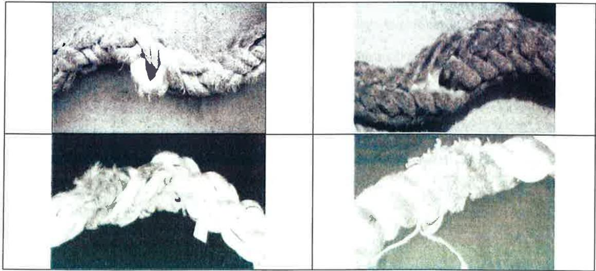

#### 13.3 Mooring Rope Inspection

Apart from a visual inspection by ship staff prior to berthing and periodic inspections by the watch keeper whilst alongside, mooring ropes should be periodically inspected along their entire length at least once a month.

The wear along the rope should be externally examined and areas of wear and fusing on manmade fibre ropes closely checked to assess the integrity of the rope at these points.

{344}------------------------------------------------

Areas of degradation should also be inspected closely to assess the rope's integrity.

Eye splice integrity and eye wear needs to be checked and the strands of the rope opened up to check for internal wear, the pilling of the internal surfaces on a man-made fibre rope is an indication of hard use.

Mooring ropes, both loose coils used on the bitts and those on winch drums should be end for ended once the working end becomes worn.

# It is recommended that major damage should not be cropped out and replaced with a short splice as this will reduce the strength of the rope.

If there is any doubt as to the strength or integrity of a rope then it should be replaced.

| Rope Type and Condition                                                                                     | Re-Splice (If localised damage only) | Discard |
| ----------------------------------------------------------------------------------------------------------- | ------------------------------------------ | ------- |
| <b>All Ropes</b>                                                                                            |                                            |         |
| Bulk of surface yarns or strands reduced by 50% or more for a linear distance equal to the rope diameter | X                                          | X       |
| Rope suspected of being shock loaded                                                                        |                                            | X       |
| Exposure to excess temperature as specified for type of fibre                                               |                                            | X       |
| Burns or melting visible for a length of over four rope diameters                                           | X                                          | X       |
| Abrasion on inside radius of eye, with bulk of surface yarns or strands reduced by 50% or more           | X                                          | X       |
| Rust on nylon (might indicate chemical damage)                                                              | X                                          | X       |
| Oil and grease                                                                                              | Wash in mild detergent                     |         |
| Heavy surface progressive abrasion                                                                          | Remove source of abrasion                  |         |
| UV degradation, splinters on yarn surface                                                                   |                                            | X       |
| <b>For Braided Cover and Core Ropes</b>                                                                     |                                            |         |
| More than four consecutive pulled cover stands (which cannot be reincorporated into cover braid)         | X                                          | X       |
| More than 3 cut cover strands                                                                               | X                                          | X       |
| Core visible through cover, because of cover damage                                                         |                                            | X       |
| Core damage-pulled, cut, abraded, powdered, or melted strands                                            |                                            | X       |
| Herniation-core pokes through cover (sheath)                                                                |                                            | x       |

1st Edition, Rev 0 1st July 2014

Director PFS

DPA

{345}------------------------------------------------

|                                                                                                      |                               |                     |                                                          |                                | Issue Status    | 2nd Edition, Rev 0                                                      |
| ---------------------------------------------------------------------------------------------------- | ----------------------------- | ------------------- | -------------------------------------------------------- | ------------------------------ | --------------- | ----------------------------------------------------------------------- |
|                                                                                                      |                               |                     | IMS 12 - APPENDIX A                                      |                                | Issue Date      | 1st July 2014                                                           |
|                                                                                                      |                               |                     | EQUIPMENT CALIBRATION LOG                                |                                | Issued by       | DPA                                                                     |
| CSR MARINE INTEGRATED MANAGEMENT SYSTEM                                                        |                               |                     |                                                          |                                | Authorised By   | Director PFS                                                            |
|                                                                                                      |                               |                     |                                                          |                                |                 |                                                                         |
| Vessel:                                                                                              |                               |                     | Year:                                                    |                                |                 |                                                                         |
| Equipment                                                                                            | Working Scale              | Max Error Margin | Onboard Testing Frequency                                | Name/Sign of Officer In charge |                 | External Calibration                                                 |
| Loading Computer Comparing shall be made between calculated and stability booklet condition | NA                            | Nil                 | March                                                    | C/O                            |                 |                                                                         |
|                                                                                                      |                               |                     | June                                                     | C/O                            |                 | If error found in the program                                           |
|                                                                                                      |                               |                     | Sept                                                     | C/O                            |                 |                                                                         |
|                                                                                                      |                               |                     | Dec                                                      | C/O                            |                 |                                                                         |
| Multi Gas Detector Maker:                                                                         | Oxy :0 ~ 30 %                 | Nil                 | March                                                    | C/O                            |                 | Yearly calibration by approved Vendor                                |
|                                                                                                      | H2S: 0 ~ 200 ppm              |                     | June                                                     | C/O                            |                 |                                                                         |
| Serial No:                                                                                           | CO: 0-1000 ppm LEL: 0-100% | Nil                 | Sept                                                     | C/O                            | Date Last Done: |                                                                         |
|                                                                                                      |                               |                     | Dec                                                      | C/O                            | 1 2          |                                                                         |
| Magnetic Compass Maker:                                                                           | 0 - 360 Deg                   | +/- 5 Deg           | Daily compass error calculation by Bridge Officers |                                |                 | Yearly calibration by approved Vendor                                |
| Serial No:                                                                                           |                               |                     |                                                          | NA                             | Date Last Done: |                                                                         |
| Alcohol Sensor Maker:                                                                             | NA                            | Nil                 | NA                                                       | NA                             |                 | Yearly calibration by approved Vendor if required by manufacturer |
| Serial No:                                                                                           |                               |                     |                                                          |                                | Date Last Done: |                                                                         |
| OWS - Oily Water Monitoring System Maker:                                                      | 0 - 15 ppm                    | Nil                 | On board maintenance and testing as per PMS           | NA                             |                 | Calibration during 2.5 and 5 Yearly docking by approved Vendor    |
| Serial No:                                                                                           |                               |                     |                                                          |                                | Date Last Done: |                                                                         |

Note: Attach a copy of external calibration certificate with this log.

Page 1

{346}------------------------------------------------

| Issue Status  | 2 nd Edition, Rev 0 |
| ------------- | ------------------------------ |
| Issue Date    | 1 st July 2014      |
| Issued by     | DPA                            |
| Authorised By | Director PFS                   |

| Vessel:   |     | Date:   |     | Report No:   |     |
| --------- | --- | ------- | --- | ------------ | --- |
| --------- | --  | ------- | --  | ------------ | --  |

Defect Summary:

| Is the defect related to critical equipment?                                                               | Yes | No                                              |     |
| ---------------------------------------------------------------------------------------------------------- | --- | ----------------------------------------------- | --- |
| If the defect is related to critical equipment, it must be reported on urgent basis to Tech. / HSEQA Dept. |     |                                                 |     |
| Machinery/Equipment/System Name                                                                            |     |                                                 |     |
| Sub assembly/Sub System Name                                                                               |     |                                                 |     |
| Date and time defect occurred/sighted                                                                      |     | Location of Vessel :                            |     |
| Effect on operational capability of Vessel                                                                 |     |                                                 |     |
| Brief details of defect including symptoms/situation leading to defect :                                   |     |                                                 |     |
| Possible reasons of defect/ship findings :                                                                 |     |                                                 |     |
| Can vessel crew repair? (Yes/No)                                                                           |     | Estimated time required for repair :            |     |
| Is Shore assistance required (Yes/No):                                                                     |     | (If yes, then provide Equipment/Spares details) |     |
| Make:                                                                                                      |     | Spare part no:                                  |     |
| Any other info:                                                                                            |     |                                                 |     |
| Interim steps taken for the period when equipment is defective :                                           |     | Vessel Stamp:                                   |     |
| Master or CE's Name/Sign :                                                                                 |     |                                                 |     |

Defect Rectification Report:

| Date defect rectified:                                                          |     | Defect rectified by Ship's Crew or Contractor/Technician (Attach shore service report if any) |     |
| ------------------------------------------------------------------------------- | --- | --------------------------------------------------------------------------------------------- | --- |
| Indicate vessel's operational capability after defect rectification :           |     |                                                                                               |     |
| Details of rectification(work carried out to rectify) :                         |     |                                                                                               |     |
| Findings & Suggestions for future improvement or any other remark/information : |     | Vessel Stamp:                                                                                 |     |
| Master or CE's Name/Sign :                                                      |     |                                                                                               |     |

List of Critical Equipment as per IMS 12, Section 5 :

| Fire Pump & Emergency Fire Pump       | Emergency Generator     | Fuel Trips               |
| ------------------------------------- | ----------------------- | ------------------------ |
| Fire Dampers                          | Fire Detection System   | Fixed Smothering Systems |
| Fridge Alarms                         | Emergency Steering Gear | Oily Water Separator     |
| Communications & Navigation Equipment | Rescue Boat Engine      |                          |

Rescue Boat Engine

Communications & Navigation Equipment

{347}------------------------------------------------

| IMS 12 – APPENDIX C                     |     |
| --------------------------------------- | --- |
| DEFECT REPORT SUMMARY (DECK / ENGINE\*) |     |

| Issue Status  | 2nd Edition, Rev 0 |
| ------------- | ------------------ |
| Issue Date    | 1st July 2014      |
| Issued by     | DPA                |
| Authorised by | Director PFS       |

| Vessel: |     |
| ------- | --- |
| Year:   |     |

| S.No. | Defect Report No. | Description | Dept: | Date of Defect | Date Rectified | Remarks |
| ----- | ----------------- | ----------- | ----- | -------------- | -------------- | ------- |
|       |                   |             |       |                |                |         |
|       |                   |             |       |                |                |         |
|       |                   |             |       |                |                |         |
|       |                   |             |       |                |                |         |
|       |                   |             |       |                |                |         |
|       |                   |             |       |                |                |         |
|       |                   |             |       |                |                |         |
|       |                   |             |       |                |                |         |
|       |                   |             |       |                |                |         |
|       |                   |             |       |                |                |         |
|       |                   |             |       |                |                |         |
|       |                   |             |       |                |                |         |
|       |                   |             |       |                |                |         |

{348}------------------------------------------------

| 2nd Edition, Rev 0                                  | 1st July 2014 | DPA        | Director PFS         |                                                                                                                                                                                                                             |                  |          | Remarks/Type of Maintenance |     |     |     |     |     |     |     |     |     |     |     |     |     |
| --------------------------------------------------- | ------------- | ---------- | -------------------- | --------------------------------------------------------------------------------------------------------------------------------------------------------------------------------------------------------------------------- | ---------------- | -------- | --------------------------- | --- | --- | --- | --- | --- | --- | --- | --- | --- | --- | --- | --- | --- |
| Issue Status                                        | Issue Date    | Issued By  | Authorised By        | Date:                                                                                                                                                                                                                       |                  |          |                             |     |     |     |     |     |     | ﺮ   |     |     |     |     |     |     |
|                                                     |               |            |                      |                                                                                                                                                                                                                             |                  |          | Date                        |     |     |     |     |     |     |     |     |     |     |     |     |     |
|                                                     |               |            |                      |                                                                                                                                                                                                                             | Re-certification | Cert No. |                             |     |     |     |     |     |     |     |     |     |     |     |     |     |
|                                                     |               |            |                      |                                                                                                                                                                                                                             |                  | Date     |                             |     |     |     |     |     |     |     |     |     |     |     |     |     |
| INSPECTION & MAINTENANCE LOG IMS 12 - APPENDIX D |               |            | ANCHOR HANDLING GEAR | Location                                                                                                                                                                                                                    |                  |          |                             |     |     |     |     |     |     |     |     |     |     |     |     |     |
|                                                     |               |            |                      |                                                                                                                                                                                                                             | Certificate No.  |          |                             |     |     |     |     |     |     |     |     |     |     |     |     |     |
|                                                     |               | QUARTERLY  |                      |                                                                                                                                                                                                                             | TYPE (Select):   | QTY      |                             |     |     |     |     |     |     |     |     |     |     |     |     |     |
| 3                                                   |               |            |                      |                                                                                                                                                                                                                             |                  | SWL      |                             |     |     |     |     |     |     |     |     |     |     |     |     |     |
|                                                     |               |            |                      |                                                                                                                                                                                                                             |                  | Size-Dia | Length                      |     |     |     |     |     |     |     |     |     |     |     |     |     |
|                                                     |               |            |                      |                                                                                                                                                                                                                             |                  |          |                             |     |     |     |     |     |     |     |     |     |     |     |     |     |
| C-SR MARINE                                         |               | INTEGRATED | MANAGEMENT SYSTEM    | ltems to be inspected prior put in use and after every operation. Quarterly inspections to be carried out in Jan/ApriJul/Oct Separate sheet to be created for Anchor Handling and Towing Gear/Mooring Grear/Lashing Gear |                  | ITEMS    |                             |     |     |     |     |     |     |     |     |     |     |     |     |     |
|                                                     |               |            |                      |                                                                                                                                                                                                                             | Vessel:          | NO.      |                             |     |     |     |     |     |     |     |     |     |     |     |     |     |

{349}------------------------------------------------

All Portable electrical itmes shall be inspected prior and post use in addition to planned maintenance.

Page 1

{350}------------------------------------------------

| IMS 12 - APPENDIX F                                     | Issue Status  | 2nd Edition, Rev C |
| ------------------------------------------------------- | ------------- | ------------------ |
| COLOUR CODING OF ANCHOR HANDLING AND TOWING SHACKLES | Issue Date    | 1st July 2014      |
|                                                         | Issued by     | DPA                |
|                                                         | Authorised By | Director PFS       |

In order to standardize the colour coding of shackles for anchor handling and towing gear across the fleet, following colour coding and inspection procedure shall be carried out:

- 1. Colour coding of AH and Towing shackles will be based on SWL.
- 2. Thick band of colour shall be painted on shackle body; pin may be painted in full.
- 3. To wire brush outside the painted band area to bare metal for proper inspection.
- 4. Numbers & other markings to be cleaned and kept in legible condition.
- 5. Shackles to be inspected before & after use for their condition.
- 6. Chief Officer to ensure that all shackles are with original certificates.
- 7. Prior to its use, staff shall ensure that shackle is fitted with equivalent SWL pin.

| COLOUR CODE OF SHACKLES |                        |        |               |
| ----------------------- | ---------------------- | ------ | ------------- |
| NO                      | SHACKLE SIZE (SWL) (T) | COLOUR | REMARKS       |
| 01                      | 8.5T                   | White  |               |
| 02                      | 12T                    | Red    | Image: Red    |
| 03                      | 17T                    | Brown  | Image: Brown  |
| 04                      | 25 T                   | Grey   | Image: Grey   |
| 05                      | 35 T                   | Black  | Image: Black  |
| 06                      | 55 T                   | Blue   | Image: Blue   |
| 07                      | 85 T                   | Yellow | Image: Yellow |
| 08                      | 120 T                  | Orange | Image: Orange |
| 09                      | 125T                   | Green  | Image: Green  |

{351}------------------------------------------------

# CONTENTS

#### 1. GENERAL

#### 2. PASSAGE PLANNING

- 2.1. Responsibilities
- 2.2 Guidelines to Voyage Planning

#### 3. KEEPING A SAFE NAVIGATIONAL WATCH

- 3.4 Master's Control
- 3.5 Calling the Master
- 3.6 Lookout
- 3.7 Fire Rounds
- 3.8 Positions
- 3.9 Traffic Avoidance
- 3.10. Handing Over the Watch
- 3.11 Vessel at Anchor
- 3.12 Towing
- 3.13 Underway / 500m Zone Bridge Watches Manning
- 3.14 Safe Waiting Place

#### এ.. ANCHORING

- Anchoring Plan 4.1
- 4.2 Preparing to Drop Anchor
- Operations to Drop Anchor 4.3
- Anchoring in Deep Water 4.4
- Points to Be Observed When Anchoring 4.5
- Anchor Watch under Normal Weather Conditions 4.6
- 4.7 Anchor Watch under Rough Weather Conditions
- 4.8 Points to be Observed when Weighing Anchor
- 4.9 Anchoring other Vessels (unmanned barges/tows)

#### HAZARDOUS SITUATIONS 5.

- 5.1. Reduced Visibility
- 5.2. Heavy Weather
- 5.3. Close Proximity to Land and Excessive Traffic
- 5.4. Pilot Embarkation / Disembarkation Operations
- 5.5. Navigation with Pilot Onboard

#### 6. NAVIGATIONAL AIDS

- 6.1. General
- 6.2. Compasses
- 6.3. Radars
- 6.4. Whistle

{352}------------------------------------------------

- GPS 6.5.
- 6.6. Echosounder
- 6.7. VHF
- Engine, Propeller Pitch & Steering Controls 6.8.
- 6.9. Automatic Pilot
- 6.10. Automatic Identification System (AIS)
- 6.11
- 6.12 Navigational Audits

#### 7. RECORDS

- 7.1. Deck Log Book
- 7.2. Noon Report
- 7.3. GPS Log Book
- 7.4. Notices

#### 8. RADIO EQUIPMENT

- 8.1. Responsibility
- 8.2. Emergency Instructions
- 8.3. Messages
- 8.4. Emergency Radio Equipment

# Appendices

- A Passage Plan
- A1 Passage Plan Checklist
- A2 Way Point List
- B Bridge - Pre-arrival Checklist
- C Bridge - Pre-sailing Checklist
- D Navigation Audit Checklist
- 트 Pilot Card
- E1 Master Pilot Exchange Form
- F Bridge Watch Hand Over Checklist
- G Familiarisation with Bridge Equipment
- H Preparation for Heavy Weather & Navigation in Heavy Weather Checklist
- -Navigation in Restricted Visibility Checklist
- J Anchoring Preparation Checklist
- K Vessel at Anchor Checklist
- ட Tool for calculating Anchor Holding Power and Critical Wind Velocity
- M Tool for calculating Compass Error
- N Tool for making Squat Table

{353}------------------------------------------------

#### 1. GENERAL

- 1.1. An effective bridge organisation efficiently manages all the bridge resources and promotes good communication and teamwork. The need to maintain a proper look-out determines the basic composition of a navigational watch. Effective bridge management utilises all resources, human and technical, available to the bridge team to ensure the safe navigation of the vessel at all times.
- 1.2. The Operations Manager is responsible for setting navigation standards and limitations (including DP operation standards and limitations) on board Company vessels. Masters are reminded of the Company "STOP WORK POLICY" if it is likely that the Company limitations may be exceeded or if he feels the safety of the vessel may be at risk.
- 1.3. The Master has the ultimate responsibility for the safety of the ship. Delegation of authority to the Officer of the Watch (OOW) should be undertaken in accordance with agreed procedures and reflects the ability and experience of the watch-keeper.
- 1.4. The Officer on Watch is responsible for the safe navigation of the vessel while on watch and for giving the Master full assistance while the Master has the 'con'.
- 1.5. The Master and Officers have at their disposal many navigational aids to assist the safe passage of the vessel. However these 'aids' will not be effective, in fact may even prove to be a danger, if they are not used correctly and with due regard to their limitations.
- 1.6. The Master and Officers should never forget the basics of navigation and should always base critical decisions on sound information and with due regard to good seamanship. The Master and Officers should never become over-reliant on navigational aids and should bear in mind the most effective tool for safe navigation is still visual observation.
- 1.7. The 'International Regulations for Preventing Collisions at Sea' (ColRegs) should always be complied with.
- 1.8. The Master should write clear and precise 'Standing Orders' which should be available to the Officers on Watch. The Master and all watchkeeping officers should sign and date such orders.
- 1.9. The Master shall maintain a 'Night Order Book'. This is to be completed every night, whether at sea, at anchor or alongside, and must contain instructions for the officer of the Watch. The Night Orders must be signed by the Master and counter-signed by the Officers of the Watch on taking over the watch.
- 1.10. All personnel should be well rested and in a fit state to stand a watch. A watch should not be handed over if incoming personnel are not considered fit to take over. For guidance on work hours and fitness for duty, refer to STCW and MLC.
- 1.11. The only times when the requirements for rest periods as laid down in STCW and MLC need not be maintained is in cases of any emergency, monthly programmed drills or other overriding operational conditions such as:
  - a. Essential work which cannot be delayed for safety or environmental reasons or which could not reasonably have been anticipated at the commencement of the charter or operations.
  - Unplanned or unforeseen long periods of standby duties at offshore locations due to b. operational exigencies.
- 1.12 Records of actual work hours will be maintained by all sea staff, including the Master and Chief Engineer. The Rest / Work Hours log sheet shall be maintained by the individual. The

{354}------------------------------------------------

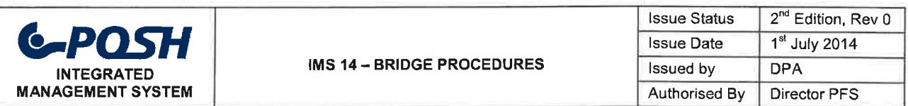

record so maintained by the individual shall be handed over to the Master for verification and filing at the end of each month.

1.13 The Master and Chief Engineer establish the shipboard watch keeping/working arrangements bearing in mind the need to comply with the above requirements. The completed Watchkeeping rosters must be posted on the Bridge and Engine room for their respective departments.

#### PASSAGE PLANNING - (see Appendix A) 2

#### 2.1 Responsibilities

- 2.1.1 The Master shall ensure that the Passage Plan (Appendix A) and Waypoint checklist (Appendix A2) are prepared by the navigating officer (200 Officer) prior to commencement of the voyage. Note that a Waypoint Checklist should form part of a passage plan, but should not in itself be considered as a complete Passage Plan.
- 2.1.2 The Passage Plan and Waypoint checklist shall be from berth, the only exceptions being when the voyage is to and from an offshore location and when the passage requires the vessel to operate within the 500m zone.
- 2.1.3 Offshore installations must never be used as waypoints when preparing a passage plan & waypoint checklist. The intermediate or last waypoint in all cases should be at least 1 mile away from any offshore installation. The courses should be laid in such a manner that they do not directly head towards the offshore installation.
- 2.1.4 The Master shall give final approval to all Passage Plans before they are executed. The Master, the Navigating Officer, the Chief Officer and the Chief Engineer must countersign the Passage Plan.
- 2.1.5 Planning a vessel's passage will involve the Master, Chief Officer, 200 Officer (Navigating Officer) and the Chief Engineer. So
- 2.1.6 All Bridge Watchkeeping Officers (OOW) shall review and verify the passage plan and waypoint checklist, including courses laid and charts in use/to be used, prior to taking over their watch.
- 2.1.7 The Master shall be informed immediately if the OOW encounters:
  - The course line is found to stop short on a particular chart for no apparent reason, a.
  - The course line is not continued on the next chart. b.
  - Course line passes close to or over a potential danger. C.

The Master, upon being informed of the above by the OOW, shall immediately review the course and that particular part of the passage, including amending the passage plan and waypoint checklist accordingly and recording the changes made.

- 2.1.8 If any deviation from the planned route is required, the Master shall inform all bridge team members and a new/updated passage plan must be prepared. The Master, Bridge Watchkeeping Officers and the Chief Engineer must initial the new/updated passage plan.
- 2.1.9 For any deviation in the vessel passage plan, the Master may use the Management of Change process as detailed out in IMS03 to document that the changes have been properly considered. Such a Management of Change Plan is to be attached to the amended copy of the Passage Plan.
- 2.1.10 The vessel's progress as per the passage plan must be monitored throughout the passage.

{355}------------------------------------------------

- 2.1.11 The position of the vessel must be closely checked and plotted when approaching course alteration points / wheel over positions, to ensure that the vessel is safely on the new course line after the alteration of course.
- 2.1.12 Distinctive chart features should be used for monitoring the ships position visually, by radar and by echo sounder.
- 2.1.13 The Passage Plan format is included in Appendix A of this Procedure and is for the use of Masters and Second Officers when preparing their Passage Plans.
- 2.1.14 The Passage Plan must be available on the chart table for the duration of the passage. On completion of the voyage it should be filed by the 2nd Officer.
- 2.1.15 All navigational charts and nautical publications shall be kept updated at all times. Second Officer or other deck officer designated by Master shall be responsible for keeping all charts and publications up-to-date. Procedures for correcting/updating charts and publications are laid down in NP-100 (Mariners handbook) and NP-294 (How to keep your admiralty products up to date).

#### 22 Guidelines for Voyage Planning

#### 2.2.1 Appraisal

All information relevant to the contemplated woyage or passage should be considered. The following items should be taken into account in voyage and passage planning;

- a. The condition and state of the vessel, its stability, and its equipment; any operational limitations its permissible draught at sea in fairways and in ports; its manoeuvring data, including any restrictions.
- ف Any special characteristics of the cargo (especially if hazardous), and its distribution, stowage and securing on board the vessel.
- The provision of a competent and well-rested crew to undertake the voyage c. or passage.
- d. Requirements for up-to-date certificates and documents concerning the vessel, its equipment, crew, passengers or cargo.
- e. e Appropriate scale, accurate and up-to-date charts to be used for the intended voyage or passage, as well as any relevant permanent or temporary notices to mariners and existing radio navigational warnings.
- f. Accurate and up-to-date sailing directions, lists of lights and lists of radio aids to navigation.
- Any relevant up-to-date additional information, including: တွေ
  - Mariners' routeing guides and passage planning charts, published i) by competent authorities.
  - Current and tidal atlases and tide tables. ii)

{356}------------------------------------------------

- iii) Climatological, hydrographical, and oceanographic data as well as other appropriate meteorological information.
- iv) Availability of services for weather routeing (such as that contained in Volume D of the World Meteorological Organization's Publication No. 9.
- v) Existing ships' routeing and reporting systems, vessel traffic services, and marine environmental protection measures.
- vi) Volume of traffic likely to be encountered throughout the voyage or passage.
- vii) If a pilot is to be used, information relating to pilotage and embarkation and disembarkation including the exchange of information between master and pilot.
- viii) Available port information, including information pertaining to the availability of shore-based emergency response arrangements and equipment.
- ix) Any additional items pertinent to the type of the vessel or its cargo, the particular areas the vessel will traverse, and the type of voyage or passage to be undertaken.
- h. On the basis of the above information, an overall appraisal of the intended voyage or passage should be made. This appraisal should provide a clear indication of all areas of danger; those areas where it will be possible to navigate safely, including any existing routeing or reporting systems and vessel traffic services; and any areas where marine environmental protection considerations apply.
- 2.2.2 Planning

On the basis of the fullest possible appraisal, a detailed voyage or passage plan should be prepared which should cover the entire voyage or passage from berth to berth, including those areas where the services of a pilot will be used.

The detailed voyage or passage plan should include the following factors;

- a. The plotting of the intended route or track of the voyage or passage on appropriate scale charts: the true direction of the planned route or track should be indicated, as well as all areas of danger, existing ships' routeing and reporting systems, vessel traffic services, and any areas where marine environmental protection considerations apply.
- b. the main elements to ensure safety of life at sea, safety and efficiency of navigation, and protection of the marine environment during the intended voyage or passage; such elements should include, but not be limited to:
  - i) Safe speed, having regard to the proximity of navigational hazards along the intended route or track, the manoeuvring characteristics of the vessel and its draught in relation to the available water depth.
  - ii) Necessary speed alterations en route, e.g., where there may be

{357}------------------------------------------------

| SR MARINE INTEGRATED MANAGEMENT SYSTEM | IMS 14 – BRIDGE PROCEDURES | Issue Status  | 2nd Edition, Rev 0 |
| -------------------------------------------- | -------------------------- | ------------- | ------------------ |
|                                              |                            | Issue Date    | 1st July 2014      |
|                                              |                            | Issued by     | DPA                |
|                                              |                            | Authorised By | Director PFS       |

limitations because of right passage, tidal restrictions, or allowance for the increase of draught due to squat and heel effect when turning.

- iii) Minimum clearance required under the keel in critical areas with restricted water depth.
- Positions where a change in machinery status is required. iv) =
- Course alteration points, taking into account the vessel's turning circle at v) the planned speed and any expected effect of tidal streams and currents.
- vi) The method and frequency of position fixing, including primary and secondary options, and the indication of areas where accuracy of position fixing is critical and where maximum reliability must be obtained.
- vii) Use of ships' routeing and reporting systems and vessel traffic services.
- viii) Considerations relating to the protection of the marine environment.
- xi) Contingency plans for alternative action to place the vessel in deep water or proceed to a port of refuge or safe anchorage in the event of any emergency necessitating abandonment of the plan, taking into account existing shore-based emergency response arrangements and equipment and the nature of the cargo and of the emergency itself.
- c. The details of the voyage or passage plan should be clearly marked and recorded, as appropriate, on charts and in a voyage plan notebook or computer disk.
- d Each voyage or passage plan as well as the details of the plan, should be approved by the ships' master prior to the commencement of the voyage or passage.

#### 2.2.3 Execution

- a. Having finalized the voyage or passage plan, as soon as time of departure and estimated time of arrival can be determined with reasonable accuracy, the voyage or passage should be executed in accordance with the plan or any changes made thereto.
- b. Factors which should be taken into account when executing the plan, or deciding on any departure there from include:
  - i) The reliability and condition of the vessel's navigational equipment;
  - Estimated times of arrival at critical points for tide heights and flow; ii)
- c. Meteorological conditions, (particularly in areas known to be affected by frequent periods of low visibility) as well as weather routeing information;
- Daytime versus night-time passing of danger points, and any effect this may have ರ on position fixing accuracy; and
- e. Traffic conditions, especially at navigational focal points.

{358}------------------------------------------------

f. It is important for the master to consider whether any particular circumstance, such as the forecast of restricted visibility in an area where position fixing by visual means at a critical point is an essential feature of the voyage or passage plan, introduces an unacceptable hazard to the safe conduct of the passage; and thus whether that section of the passage should be attempted under the conditions prevailing or likely to prevail. The master should also consider at which specific points of the voyage or passage there may be a need to utilize additional deck or engine room personnel.

#### 2.2.4 Monitoring

- a. The plan should be available at all times on the bridge to allow officers of the navigational watch immediate access and reference to the details of the plan.
- b. The progress of the vessel in accordance with the voyage and passage plan should be closely and continuously monitored. Any changes made to the plan should be made consistent with these Guidelines and clearly marked and recorded.
- 225 Under Keel Clearance

The following are the minimum under-keel clearance (UKC) prescribed for each situation namely:

| a.  | Ocean passages | -   | 20% of the deepest draft      |
| --- | -------------- | --- | ----------------------------- |
| b.  | Fairways       | -   | 15% of the deepest draft      |
| c.  | Inside ports   | -   | 10% of the deepest draft      |
| d.  | Canals         | -   | as per local navigation rules |

Allowances for variable factors and local conditions should include, but not be limited to, the following:

- e. The effect of squat.
- f. Environmental conditions e.g. the prevailing weather, height of swell, tidal height and range, atmospheric pressure, changes in the density of sea and inland waters etc.
- The nature and stability of the bottom (e.g. sand wave phenomena). g.
- The vessel's size and handling characteristics, and increase in draft due to heel. ﻏ
- i. The reliability of ship's draft observations and calculations, including estimates of hogging or sagging.
- The accuracy of Hydrographical data and tidal predictions. 1.
- k. Reduced depths over pipelines.

# Example of UKC Calculation, the least depth on passage is taken into consideration while calculating under keel clearance:

| DATE | HW TIME | LW TIME | HT(m) A | LEAST DEPTH B | AVAILABLE DEPTH A + B = C | SHIP'S DRAFT\* D | UKC C - D |
| ---- | ---------- | ---------- | ---------- | ------------------- | ------------------------------- | ---------------------- | ------------ |
|      |            |            |            |                     |                                 |                        |              |

{359}------------------------------------------------

| Issue Status  | 2nd Edition, Rev 0 |
| ------------- | ------------------ |
| Issue Date    | 1st July 2014      |
| Issued by     | DPA                |
| Authorised By | Director PFS       |

| A mark and consisted on the first from the first the first the first the first to the first the first the first the first to the first the first the first the first the first |     | International control controllers of the contribution of the contribution of the contribution of the contribution of the contribution of the contribution of the contribution |                                                                                                                                                                                                                                                                                                                                                                  | ------------------------------------------------------------------------------------------------------------------------------------------------------------------------------ |                                                                                                                                                                                |
| ------------------------------------------------------------------------------------------------------------------------------------------------------------------------------ | --- | ----------------------------------------------------------------------------------------------------------------------------------------------------------------------------- | ---------------------------------------------------------------------------------------------------------------------------------------------------------------------------------------------------------------------------------------------------------------------------------------------------------------------------------------------------------------- | ------------------------------------------------------------------------------------------------------------------------------------------------------------------------------ | ------------------------------------------------------------------------------------------------------------------------------------------------------------------------------ |
|                                                                                                                                                                                |     |                                                                                                                                                                               | ------------------------------------------------------------------------------------------------------------------------------------------------------------------------------ ------------------------------------------------------------------------------------------------------------------------------------------------------------------------------ | ------------------------------------------------------------------------------------------------------------------------------------------------------------------------------ | A 1000 - 10 - 11 - 11 - 11 - 11 - 11 - 11 - 11 - 11 - 11 - 11 - 11 - 1 - 1 - 1 - 1 - 1 - 1 - 1 - 1 - 1 - 1 - 1 - 1 - 1 - 1 - 1 - 1 - 1 - 1 - 1 - 1 - 1 - 1 - 1 - 1 - 1 - 1 - 1 |
|                                                                                                                                                                                |     |                                                                                                                                                                               | ------------------------------------------------------------------------------------------------------------------------------------------------------------------------------                                                                                                                                                                                   |                                                                                                                                                                                | ------------------------------------------------------------------------------------------------------------------------------------------------------------------------------ |

# (\*) Ship's draft "D" includes squat as per expected transit speed.

- 2.2.6 When planning operations for Company vessels, due regard must be given to the likely depth of water in the working area, the draft of the vessels and any additional draft limitation imposed by the need to use retractable thrusters and skeg. If Fleet vessels are unable to conform to the above under keel clearance policy, the Master shall inform and discuss with the Operations Manager for further guidance.
- 2.2.7 The Master must obtain the following information from the Charterer or ships husbandry agent well in advance or arriving at the arrival port.
  - Permissible safe arrival draft at the port of arrival (Master to provide ETA and range a. date and time as applicable.)
  - Controlling depth of the channel which governs a vessel's transit from the sea buoy or pilot station to the berth.
  - Depth of water available in port limits prior to carrying out any operations for or on C. behalf of the charterers.
  - Official declared depth at the berth, yard or dock space. ಕ
  - Any updated information, if applicable. e. e
  - Recent information on any navigational, weather and/or environmental conditions which may affect the available depth for the ship's transit from the sea buoy or pilot station to berth. 1141
  - Expected weather, tidal and current conditions in the working area for the duration of g. the Charter.
- 2.2.8 If a response from the agents to the Masters query is not received in good time, then the Operations department shall be consulted for further guidance as soon as possible.
- 2.2.9 On arrival of the local pilot on board and prior to making the transit to the berth, the Master must discuss the planned transit including the anticipated UKC with the pilot and record this communication in the Deck log book or the Bridge note book.
- 2.2.10 If the Master is in doubt as to the anticipated UKC as declared by the pilot, the Master must exercise his over-riding authority and consider invoking the Company's Stop Work policy for the safety of the vessel and her crew.
- 2.2.11 The Master, in exercising his due diligence with reference to 2.2.7 above, shall as soon as possible inform the Operations Superintendent and HSEQA department.
- 2.2.12 If local requirements, sailing directions, or IMO Ships routeing with regard to UKC are present, then the vessel shall comply with them implicitly.
- 2.2.13 Masters should also take in to account of vessel's skeg as it will result in increase of aft draft to a great extent, the declared aft draft should include the value of the skeg in all cases.
- 2.2.14 Squat

{360}------------------------------------------------

The squat effect is the hydrodynamic phenomenon by which a vessel moving quickly through shallow water creates an area of lowered pressure that causes the ship to be closer to the seabed than would otherwise be expected. This phenomenon is caused when water that should normally flow under the hull encounters resistance due to the close proximity of the hull to the seabed. This causes the water to move faster, creating a low-pressure area with lowered water level surface. This squat effect results from a combination of vertical sinkage and a change of trim that may cause the vessel to dip towards the stern or towards the bow. Squat may be computed using the empirical formula given below (Dr C. B. Barras's formula):

Calculate the vessel's maximum draft with additional factors to be taken into account i.e. trim, list, vessel's manoeuvring characteristics, hog, sag and water density(While calculating trim, the change in trim due to the change in density of water must also be accounted for).

# Maximum Squat = $(Cb x V^2)$ / 100 for open waters

# Maximum Squat = $(Cb \times V^2)$ / 50 for confined channels

| Sq  | :   | Squat in metres                                    |
| --- | --- | -------------------------------------------------- |
| Cb  | :   | Block coefficient of vessel at max navigable draft |
| V   | :   | Speed in knots.                                    |

Worked example:

(For vessel having Cb: 0.5, speed: 10 knots in confined water)

Squat = $(0.5 \times 10^2)$ / 50 = 1.0 m

Squat effect is approximately proportional to the square of the ship. Thus, by reducing speed by half, the squat effect is reduced by a factor of four. Squat effect is usually felt more when the depth/draft ratio is less than four or when sailing close to a bank. It can lead to unexpected groundings and handling difficulties. Another important factor is the block coefficient Cb as Squat varies directly with Cb. Oil Tankers will therefore have comparatively more squat than Passenger Liners.

- 2.2.15 The overall effect of shallow water on the maneuvering characteristics of a vessel;
  - a. Speed of the vessel decreases as squat is directly proportional to square of speed.
  - R.P.M. decreases and high R.P.M. increases astern trim. ﻘ
  - C. Higher the draught to depth of water ratio, greater the squat thus resulting in lesser U.K.C
  - d. Vibration may occur.
  - e. In shallow water squal causes abnormal bow and stem wave to build up there by the type of bow effects wave making and pressure distribution.
  - Steering is affected because the water displaced by the hull is not so easily replaced f. by other water and the propeller and rudder might be working in partially vacuum conditions. The vessel takes long to answer her helm and response to engine movement become sluggish.
  - It will be extremely difficult to correct a yaw or sheer with any degree of rapidity. g.
    တ
  - h. The moving vessels bow wave, stem wave and trough increase in amplitude.
  - i-Signs of Squat:
    - Speed decreases.
    - RPM decreases. .
    - Vibration may occur. .
    - · Steering is affected vessel become sluggish to maneuver.

{361}------------------------------------------------

| Issue Status  | 2nd Edition, Rev 0 |
| ------------- | ------------------ |
| Issue Date    | 1st July 2014      |
| Issued by     | DPA                |
| Authorised By | Director PFS       |

- · Ship made waves increase in amplitude.
- · Ship wake changes color and becomes muddy.

# 2.2.16 Waypoint list - (see Appendix A2)

- 2.2.17 Waypoints, courses and distance details of the passage must be entered on the 'Waypoint Checklist', which must be completed for each voyage and signed by the Masters and all Bridge Watchkeeping Officers.
- 2.2.18 The "Waypoint list' shall be available on the chart table for the duration of the passage. On completion of the voyage it should be filed by the Second Officer.
- 2.2.19 When planning a passage, due regard shall be made for the following .
  - a. Submerged dangers en-route
  - b. Unlit dangers
  - The availability of fixed navigational marks for navigating in confined waters C.
  - d. Weather, tidal and visibility dangers and areas prone to abnormal conditions
  - Areas of high density traffic e.
  - f. Any 'Vessel Traffic Control' reporting points
  - വ. Traffic Separation Schemes
  - h. Pilot boarding/un-boarding areas
  - i Piracy areas
  - Manoeuvrability of tug(s) and tow j.
  - k.
    K Possibility of Tropical Revolving Storm
  - The use of Offshore Installations as waypoints is prohibited ت
  - Under Keel Clearance (see 1.13.2 above) and Squat (see 2.2.11 above) m.
  - Clashing Overhead Structures, such as Bridges, Power Lines, Cable Cars, etc.
  - n.
- 2.2.20 All courses shall be clearly laid on the charts showing but not limited to the following information :-
  - True courses in way of course lines a.
  - b. Alter course positions
  - C. Reporting points on passage
  - d. Dangers close to the vessel while en-route
- 2.2.21 The charts shall be placed in the chart table drawer in the correct order of use.

#### 3 KEEPING A SAFE NAVIGATIONAL WATCH

- 3.1 The officer in charge of a navigational watch is the Master's representative and is primarily responsible at all times for the safe navigation of the vessel and for complying with the International Regulations for Preventing Collisions at Sea. At all times, when the vessel is at sea, at anchor, in port and during operations involving towing, anchor handling, offshore supply and when using dynamic positioning, the bridge must at all times be under the control of an experienced, responsible and certificated OOW. The OOW must never leave the bridge without being properly relieved.
- 3.2 to be distracted by such things as :
  - private telephone calls

{362}------------------------------------------------

- using the ship's computers
- visitors to the Bridge
- VHF conversations
- correcting charts and publications
- 3.3 The OOW must fully familiarise himself with the bridge equipment in use and be fully aware of the operational conditions the vessel is working in for the duration of his watch. In addition to the familiarisation provided when joining the vessel, the Master must ensure that all Bridge Watch keeping Officers are made fully aware of the operational limitations of the vessel and her equipment.

#### 3.4 Master's Control

- 3.4.1 The Master shall be on the bridge in the following circumstances :-
  - When arriving in port. a.
  - b. When sailing from port.
  - C. Docking / undocking and shifting of the vessel.
  - d. During ship to ship manoeuvring
  - e. When embarking / disembarking pilot, OIM and docking Master,
  - ಕೆ. During helicopter or Medevac operations
  - Anchoring or weighing anchor. g.
  - h. In areas of high density traffic.
  - i. In reduced visibility
  - i. In close proximity to land.
  - k. In heavy weather.
  - When called by the Officer on Watch (OOW) -
  - In emergency situations m.
- 3.4.2 Whenever the Master takes over or hands over the 'control' of the vessel he shall clearly inform the OOW. This must be logged down in the Bridge note book by the OOW "Master takes/hands over con of the vessel" as such. Exceptions can be made to this requirement during the offshore operation where OOW takes control as stop gap measure & Master is on bridge monitoring the whole situation.

#### 3.5 Calling the Master

The OOW should not hesitate to call the Master in the following circumstances:-

- Reduced visibility of less than 2 miles or as directed by the Master a.
- b. Heavy weather
- C. One hour prior to arrival in port
- ರ. In high density traffic
- e. If the vessels position is unclear for any reason
- f. As per the Masters 'Standing' and 'Night' Orders
- If the OOW is in any doubt ு.
- Prior to entering restricted zones and before entering 500 metres zones ﻏ

#### Lookout 3.6

- A proper lookout shall be maintained at all times. a.
- b. Lookouts shall be positioned to give the best unobstructed view.

{363}------------------------------------------------

| Issue Status  | 2nd Edition, Rev 0 |
| ------------- | ------------------ |
| Issue Date    | 1st July 2014      |
| Issued by     | DPA                |
| Authorised By | Director PFS       |

- At all times, in addition to the Officer of the Watch, there should be a lookout on the bridge except in clear weather, daylight hours and well clear of other traffic and navigational hazards, when it may be possible for the lookout to be engaged in other work. The lookout should always remain within immediate verbal calling distance from the bridge and OOW.
- ત A helmsman is not considered to be a lookout.
- e. Lookouts must be attentive to their duties and other personnel on the bridge should not distract the bridge lookout(s) from their duties.

#### 37 Fire Rounds

- Between the hours of 2000 and 0800 the OOW shall ensure that fire rounds' are a. made of the accommodation spaces and outside areas when weather conditions permit.
- b. These shall be conducted at the end of each watch by the OOW and at other times during the watch if deemed necessary. A log book entry shall be made when rounds are completed.
- c. Lookouts should not be used for fire rounds during watches as it will contravene watch keeping regulation during hours of darkness and will be unsafe during restricted visibility & heavy traffic.

#### Positions 3.8

- a. The vessels position shall be determined at regular intervals and clearly marked on the chart.
- ڪ The frequency of positions fixing is relative to the dangers that exist and the proximity of coastal areas and traffic.
- The Master and the OOW shall not rely entirely on electronic navigational aids. c. Positions derived from visual bearings shall be used whenever possible.
- Positions that are used to make critical decisions shall be cross-checked by verifying d.. the position by at least two different means.
- When at anchor, the position of the vessel must be checked frequently, particularly if e. the current/tide is strong or heavy weather is encountered.
- Parallel indexing shall be used in monitoring ship's progress in relation to the f.
  f.
  f.
  f.
  passage plan but does not replace the need to fix ship's position on the chart at regular intervals.
- g. The minimum frequency of position fixing shall be as follows. Master may at his discretion reduce this as required:
  - i. 5 mins when picking up pilot, approaching and departing ports/berth
  - 15 mins when in 'coastal waters'- i.e. within 24 miles off land/dangers ii.
  - ii-60 mins when on open sea / ocean passage

#### 3.9 Traffic Avoidance

a. All personnel shall strictly follow the 'International Regulations for Preventing Collisions at Sea'. Never "Bend the Rules" by agreeing with another vessel to take

{364}------------------------------------------------

action(s) that is in contravention to the International Regulations for Preventing Collisions at Sea

- ف All vessels should be given a wide berth whenever possible.
- C. The use of the VHF during potential 'close quarter' situations should, as far as possible, be avoided as it is not always possible to confirm that the vessel being spoken to on the VHF is the same vessel that is involved in the close quarter situation.
- Do not rely on navigational aids for the purpose of collision avoidance, unless poor ರ. visibility prevents visual observations.
- Whenever possible, visual observation should be used, supported by the use of e. e navigational aids.
- f. Do NOT USE THE AIS FOR COLLISION AVOIDANCE traffic information gained from the Automatic Identification System (AIS) is usually inaccurate.

# 3.10 Handing Over the Watch

- 3.10.1 The incoming OOW shall attend the bridge well before he is due to take over the watch,
- 3.10.2 At night, the incoming OOW shall ensure that his vision has adjusted to the darkness,
- 3.10.3 The outgoing OOW shall give his relief a full appraisal of the navigational and all other aspects of the vessel's operational circumstances, including but not limited to, the following :
  - Position of the vessel. a.
  - b. Navigational features in the area e.g. buoy - lighthouses.
  - True, gyro and magnetic courses and speed. C.
  - d. Any leeway allowed
  - Details of traffic in the vicinity. e.
  - f. Condition of electronic navigational aids and setting of all other control systems,
  - Details of any dangers in the vicinity or to be expected during the next watch. g.
  - h. Any alter course positions approaching.
  - ... Master's 'Night Orders'.
  - Condition and behaviour of the tow and tow gear (if towing). 1.
  - k. Information regarding the other tug(s) if more than one tug is involved.
  - Anything unusual or unexpected. .
  - Any special deck work or offshore operations planned or in progress. m..
  - Existing and expected weather, tidal and current conditions. n.
  - O. DP Operations (if any)
- 3.10.4 The incoming OOW should verify the vessel's position and relative courses of traffic,
- 3.10.5 The incoming OOW should read and sign the Master's 'Night Orders',
- 3.10.6 When both parties are satisfied and no manoeuvring process is presently being carried out, the watch may be handed over.
- 3.10.7 The outgoing OOW should then sign the Deck Log Book for completion of his watch.
- 3.11 Vessel at Anchor

{365}------------------------------------------------

| C-SR MARINE INTEGRATED MANAGEMENT SYSTEM | IMS 14 – BRIDGE PROCEDURES | Issue Status  | 2nd Edition, Rev 0 |
| ---------------------------------------------- | -------------------------- | ------------- | ------------------ |
|                                                |                            | Issue Date    | 1st July 2014      |
|                                                |                            | Issued by     | DPA                |
|                                                |                            | Authorised By | Director PFS       |

- 3.11.1 A continuous navigational watch should be maintained and the OOW should ensure the following :
  - The position of the vessel is frequently checked particularly if the vessel is swinging, a.
  - the current/tide is strong or heavy weather is encountered.
  - b. A lookout is maintained.
  - Correct lights and shapes are shown. C.
  - Rounds are made. If potential boarders are a possibility then a continuous watch d. should be kept on the deck by sufficient personnel.
  - e. Passing traffic is monitored.
  - Inspect the lay of the anchor cable and securing arrangement at least once per f. watch
  - Maintain continuous VHF 16 watch and on other frequencies as maybe required. ்.
  - h. Weather forecasts are monitored.
  - i. The Master is called if in any doubt.
- 3.11.2 The Master must consult with the Chief Engineer to ensure that, if required, the engines are ready for immediate use.

#### 3.12 Towing

When the vessel is towing, the OOW should regularly check the condition of the tow and tow gear including checking the security of the tow. Refer to Chapter 15 section 8.

# 3.13 Underway / 500 metre Zone Bridge Watches Manning.

- 3.13.1 This Section describes how, when vessel is underway or within the 500m zone, bridge watches must be manned and the outies of the OOW and crew members involved for each different Bridge watch condition Pilots, OlMs, Docking Masters, etc. must not be considered as part of the vessel's complement and shall not assume any of the bridge watch organisational positions.
- 3.13.2 When a vessel is underway or operating within the 500m zone of the installation the following four Bridge watch keeping conditions shall apply.

| Primary Conditions                                                          | Bridge Watch |
| --------------------------------------------------------------------------- | ------------ |
| Open Sea:                                                                   |              |
| Clear weather, light or no traffic (Sunrise to Sunset)                      | I            |
| Clear weather, higher density traffic                                       | II           |
| Clear weather, light or no traffic (Sunset to Sunrise)                      | II           |
| Restricted visibility, little or no traffic                                 | III          |
| Restricted visibility, higher density traffic                               | IV           |
| Restricted waters / 500m Zone of Fixed Installation:                        |              |
| Clear weather, little or no traffic, low level operations activity          | II           |
| Clear weather, high traffic density, high level operations activity         | III          |
| Restricted visibility, little or no traffic, low level operations activity  | III          |
| Restricted visibility, high traffic density, high level operations activity | IV           |
| Arrival / Departure Port:                                                   |              |
| Clear weather, little or no traffic                                         | III          |
| Clear weather, high traffic density                                         | III          |

{366}------------------------------------------------

|     | IMS 14 - BRIDGE PROCEDURES | Issue Status  | 2nd Edition, Rev 0 |
| --- | -------------------------- | ------------- | ------------------ |
|     |                            | Issue Date    | 1st July 2014      |
|     |                            | Issued by     | DPA                |
|     |                            | Authorised By | Director PFS       |

| Restricted visibility, little or no traffic | III |
| ------------------------------------------- | --- |
| Restricted visibility, high traffic density | IV  |

# At any time when the following conditions exist:

High traffic density, collision avoidance, restricted visibility < 3 n.miles IV 3.13.3 Bridge Watch I

The Bridge watch consists of one Deck watch officer on the bridge at all times, with the lookout / helmsman readily available within communicating distance. Bridge watch I is applicable in daytime only from sunrise to sunset.

Bridge watch I condition shall only be followed after the situation has been carefully assessed on each occasion and it has been established without doubt that it is safe to do so. Full account shall be taken of all prevalent factors including but not limited to the state of weather, current, condition of visibility, traffic density and proximity to navigational hazards and if navigating in or near a traffic separation scheme.

When the OOW is acting as a sole lookout, he must not hesitate to summon assistance to the bridge. Chart corrections, paperwork, port formalities or any such job shall not be undertaken by the OOW during such times.

The Bridge Navigational Watch Alarm System (BNWAS) (if fitted) is to be kept operational whenever the OOW is acting as a sole lookout.

# 3.13.4 Bridge Watch II

The Bridge watch consists of one deck watch officer and lookout / helmsman on the bridge at all times.

# 3.13.5 Bridge Watch III

The Bridge watch consists of Master (2nd Master / Chief Officer), one deck watch officer and lookout / helmsman on the bridge at all times.

# 3.13.6 Bridge Watch IV

The Bridge watch consists of Master, (2nd Master / Chief Officer), one deck watch officer and two lookouts / helmsmen on the bridge at all times.

- 3.13.7 In addition to above bridge watch keeping procedures, whenever vessel is engaged in Anchor handling operation or working within 500 metre zone of any installation, platform or any other type of vessel, the bridge shall be manned with at least 2 watch keepers, one being the master or equivalent competent officer.
- 3.13.8 The status of every watch shall be logged into the Deck including the timing when bridge watch level was increased or downgraded.

#### 3.14 Safe Waiting Place

While vessel is idle or is put on waiting due to any reason, following factors, but not limited to, should be taken into consideration while selecting for a safe waiting place:

- Condition of engines/thruster, breakdown/failures/maintenance a.
- Depth of water, nature of seabed, underwater obstruction ﻘ
- Prevailing and expected current & tidal condition C.
- Type of cargo onboard, hazardous cargo will require special designated place ﺗ

{367}------------------------------------------------

- Prevailing and expected weather in the area, Monsoon/TRS e.
- f. Fishing traffic, chances of net fouling with propellers/thruster
- Traffic in vicinity, clear of traffic routes/lanes g.
- h. Piracy/Terrorism in the area
- Anchored vessels in vicinity, safe room i.
- j. Proximity to port for logistic support
- k. Length of stay
- 1. Navigational warnings, T & P corrections
- Local rules and regulations m.

Master is required to inform HSE, operations and charterer, if any, of his intended safe waiting place before proceeding or anchoring.

#### 4 ANCHORING

- 4.1 Anchoring Plan The Master shall prepare a plan for anchoring in accordance with the following:
- 4.1.1 Selection of Anchorage Investigate the port conditions beforehand, and select the most suitable anchorage.
- 4.1.2 Determining of Anchoring Method Normal anchoring is by a single anchor. The master shall determine which anchoring is the best among a single anchoring, double anchoring, twoanchor mooring or any other appropriate anchoring by considering weather & sea conditions when anchoring the ship and also while the ship is at anchor, or the depth of, or room for the anchoring area for use, etc.
- 4.1.3 Deciding Which Anchor To Be Used Decide which anchor (port or starboard) to use by considering the anchoring method direction of approach, tidal current set, frequency of use of both anchors until now, or measures against expected rough weather, etc. Also, when using the anchors on both sides of the ship, decide on the sequence in which they will be dropped.
- 4.1.4 Deciding on Extension of Anchor Chains When deciding on the length of anchor chains to be extended, give consideration to the duration of anchoring, room of the anchoring area for use, weather conditions while the ship is at anchor and holding power of the anchor.

Empirical or Rule of Thumb Methods for Assessing the Minimum Required Length of Anchor Chain :

Fine weather L = 3d + 60m Rough weather : L = 4d + 100m L: Minimum Required Length of Anchor Chain (m) Where: d: Water depth (m)

# 4.1.5 Holding power of the anchor and Critical Wind Velocity for dragging anchor

To avoid any disasters resulting from dragging anchor, Master shall calculate the holding power of the anchor and critical wind velocity for dragging anchor. This should be utilised in developing the anchoring plan and the anchor watch instructions / checks. It should also be noted that this calculation only provides a guide to understanding how the wind velocity affects anchor dragging and that the ship may start to drag its anchor even if the wind velocity is less than the critical wind velocity. It should be carefully examined to determine whether safe anchoring can be maintained especially when heavy weather is forecast.

- a. Note that the critical wind velocity is subject to preconditions such as the size or shape of the ship, depth of water, bottom sediment, etc.
- b. The following are to be considered when assessing the risk of dragging anchor:

{368}------------------------------------------------

| Issue Status  | 2nd Edition, Rev 0 |
| ------------- | ------------------ |
| Issue Date    | 1st July 2014      |
| Issued by     | DPA                |
| Authorised By | Director PFS       |

- Even if the wind velocity is not more than the critical wind velocity, the ship may drag or damage her anchor due to other additional factors such as swells, waves, currents, age & condition of anchor itself, its chain, shackles etc.
- · It is very difficult to heave up anchor if the weather, especially the sea condition, becomes heavy or unfavourable.

#### 4.2 Preparing To Drop Anchor

Carry out RISK ASSESSMENT and TOOL BOX TALK.

Conduct the preparatory work for anchoring in accordance with the following:

- 4.2.1 The Master, at an appropriate time before arriving at the anchoring area for use, shall call anchor stations and advise the person-in- charge of the anchors to be used, the expected number of shackles to be laid out, the expected depth of anchoring area for use and other necessary information.
- 4.2.2 Conduct the following on the Bridge:
  - When the ship is approaching the anchorage, take continuous soundings to check the a. depth.
  - Check the head way of the ship (over ground and through the water), ﻔ
  - Check frequently the ship's position and distance from other ships. c. .
  - Keep a particularly close lookout of the surroundings to check the movements of d. other ships.
  - Plot, as occasion demands, the positions of other anchored ships on the nautical e. chart.
- 4.2.3 The person-in- charge of the anchor party, after taking up the station at the forecastle, checks that all hands are wearing the proper PPE including safety goggles. Make preparations to drop anchor in accordance with the following procedures:
  - Start up the windlass and test-run it to check for any abnormality; then take off the as a stopper.
  - Walk out the anchor chains until the anchor is just above the water, apply the brake, ﻣ put out of gear and stand by for dropping the anchor (alternatively, the anchor may be walked out to the expected full length).
  - c. When walking out the anchor chains under water, do it after the ship has lost all head way or, better still, when the ship is making slight stern way.
  - d. It is a good practice to also prepare the anchor that is not planned to be used, just in case of emergency.
  - e. When the above work is finished, report to the bridge that preparations to drop the anchor have been completed.

#### 4.3 Operations to Drop Anchor

- 4.3.1 The person-in-charge, on the Master's order to "let go anchor" shall let go anchor in accordance with the following procedures. When letting go anchor into deep water, he shall do it in accordance with Para.4.4:
  - a. On the order from the bridge to "let go anchor", do a final check on deck and on the water that it is safe to do so, then slowly release the brake until the anchor cable starts to run out.

{369}------------------------------------------------

| Issue Status  | 2nd Edition, Rev 0 |
| ------------- | ------------------ |
| Issue Date    | 1st July 2014      |
| Issued by     | DPA                |
| Authorised By | Director PFS       |

- b. down or stop it again using the brake. Pay attention and carefully control the speed at which the anchor and cable runs out.
- Report to the bridge at appropriate times, advising the direction in which the anchor C. cable is lying, the length of cable paid out and the tension of the cable.
- When the planned length of anchor cable to be laid is reached, apply the brake to d. fully stop the cable.
- e.. Allow the ship time to settle at and become "brought up" to the anchor.
- f. After checking that the anchor has been brought up, put on the stopper, relieve the tension on the windlass, ensure the brake is fully applied and put the windlass out of gear.
- While using stopper bar upon vessel being brought-up, it is required that the in-board g. vertical link of the chain does not touch the bar and that there is sufficient clearance between the vertical link and the stopper to detect any slippage of the brake.
- 4.3.2 The OOW determines the anchor position and enters the "Bridge Turning Circle" on the nautical chart.

#### Anchoring in Deep Water র্বা বা

Lowering of the anchor in deep water shall be done in accordance with the following procedure:

- a. When the depth of the water exceeds 25 meters, walk back the anchor under water close to the sea bottom (10 to 5 meters) and then let it go.
- b. When the depth of the water exceeds 50 meters, walk back the anchor until it reaches the sea bottom and pay out the anchor chain under power to the scheduled amount of chain to be laid out while laying the anchor chain along the sea bottom.
- c. In the above case, when paying out the anchor chain, speed over the ground shall be 0.5 knots or less.

# 4.5 Points to be Observed when Anchoring

The Master, when anchoring at an anchorage with strong winds or currents, shall carry out risk assessment and shall be careful of the following:

- a Avoid anchoring for shorter periods unless as per Charterer's and/or Owner's requirements.
- b. Pay Due consideration to the condition of hydraulic gear, windlass motors, anchors, cable, and brake lining.
- c. The anchor chain is liable to be subjected to an unexpected load causing the anchor to drag in the initial stage of laying out the chain after the anchor is let go, or causing the chain to lie curved or snaked on the sea bottom so that a good hold of the anchor cannot be obtained.

{370}------------------------------------------------

- If judging the speed over the ground is difficult, set a landmark that is exactly abeam ﯽ to the ship to obtain the speed over the ground.
- Make the approach and lower the anchor with the tide from the bow. (In case of e. single anchoring).
- Check the current set from the headings of other anchored ships nearby are facing. f.
- Pay out ample anchor chain so that the anchor does not drag initially, g.
- h. Try as much as possible not to have the current from behind, but if this is unavoidable, lessen the way of the ship and let go the anchor on the turning side of the ship at a short distance from the scheduled anchorage.
- . When there is a ship already anchored in the vicinity of scheduled anchorage, avoid the course on which the ship may drag her anchor.

# 4.6. Anchor Watch under Normal Weather Conditions

The Master shall give the necessary instructions for keeping an anchor watch to the officer of the watch (OOW).

The OOW shall pay careful attention to any changes of the weather and sea conditions and at all times be aware of the positions of others ships relative to his own ship, as well as the position of shoals, rocks and anything else that poses a danger to the ship.

He shall also check at least hourly to ensure the anchor is not dragging,

# 4.6.1 Detecting a dragging anchor :

a. Check of Ship's Position.

Determine the ship's position by means of radar, GPS or by landmark and judge whether or not the anchor is dragging by checking to see if the ship's position is inside the "Bridge Turning Circle".

# b. Record of Course Recorder.

The anchor might be dragging when the recorder stops drawing a steady sine curve,

c. Swinging of Ship.

The anchor might be dragging when the ship stops making steady swings and remains in one posture against the wind. The number of times when the vessel swings to complete 360° turns should be recorded.

d. Tautness of Anchor Chain.

The anchor might be dragging when the anchor chain does not slacken and remains taut. e. Speed over Ground

Check the speed over the ground by Doppler log.

f. Changes in Relative Positions of Other Ships

{371}------------------------------------------------

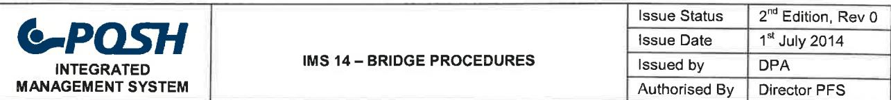

Pay careful attention to any changes in the relative positions of other ships,

# 4.6.2 Dragging Anchor of Own or Other Ships

, Monitor for dragging not only the anchor of the ship but those of other ships as well,

When the cable is slipping or anchor is dragging, extra length of cable may be paid out. At initial anchoring, it is recommended to keep lengths of reserve cable, which may be used later.

Remember that even if your own ship is not dragging its anchor, other ships may be and therefore it is important to plot and monitor the positions of other anchored vessels.

#### 4.6.3 Watching Other Ships

When other ships pass by, the Master/OOW shall pay careful attention to ensure they do not pass too close.

If the other vessel is considered to be passing too close, the Master/OOW must attract the attention and communicate with the other vessel in order to prevent collision.

When other ships drop their anchor and the Master considers it dangerous as the other ship's anchoring position is too close to his own ship, he shall immediately request the other ship to heave up their anchor and change their anchoring position.

# 4.7 Anchor Watch under Rough Weather Conditions

The Master shall take the following necessary countermeasures when rough weather is expected while anchored:

- a. Obtain weather information from weather maps, navigational warnings, etc. Check with the agent or the nearest maritime safety authorities whether or not there have been any gale warnings, etc.
- b.. Keep a listening watch on VHF Ch16 and obtain information of other ships, warnings, etc.
- Maintain a safe distance from other ships and, if necessary, shift anchorage. c.
- ರ... Be aware of the critical wind velocity which may cause the anchor to drag.
- e. the ship, the depth of water, the nature of the sea bottom, etc., or carry out double anchoring, stand by the other anchor, and drop another anchor to check the ship's swing.
- f.. Put engines on standby if, judging from the weather and sea conditions, it is necessary.
- Make steering gear ready for immediate use. g.
- Pay out extra anchor chain and use the engine at appropriate times to prevent the h. Samu anchor from dragging.

{372}------------------------------------------------

| Issue Status  | 2nd Edition, Rev 0 |
| ------------- | ------------------ |
| Issue Date    | 1st July 2014      |
| Issued by     | DPA                |
| Authorised By | Director PFS       |

- Weather conditions shall be continuously monitored. If necessary, anchors shall be heaved well in advance of the onset of bad weather and the vessel may proceed to a safe place where a safe distance from other vessels can be maintained while drifting.
- If it is unavoidable and required to weigh anchor under unfavourable weather ﺃ. conditions, due regard shall be given to the excessive load coming on the windlass and chain. Engine power, thrusters and steering may be used to ease the load on the cable and an efficient communication shall be maintained between forward station and the bridge to closely monitor the lead and load on the anchor cable.

# 4.8 Points to be Observed when Weighing Anchor

The Master shall observe the following when weighing anchor:

- a. When the wind or current is strong, the anchor will drag as the chain is being heaved up and the ship will start to go astern. In such a case, use the engines at appropriate times to reduce the load on the windlass.
- b. When the ship's head, while heaving anchor, is in a direction excessively different from the one she intends to proceed after the anchor is up, carry out the anchor weighing operation and help her turn to the favourable direction by using the engines, thrusters and rudder in combination.
- c. When weighing anchor in swells, the windlass motors are subjected to excessive forces, so be careful to avoid causing damage.
- d. When rough weather is expected, do not lose the right opportunity to weigh anchor.

# 4.9 Anchoring other Vessels (unmanned barges/tows)

On rare occasions own vessel crew may be required by the clients/charterers to anchor other vessels (unmanned barges etc). On such occasions following procedure is to be followed :

- a. Consult client/charter's vessel operation manual (if provided).
- b. Gather all required information from the client/charterers regarding the anchors and anchoring gear available on board other vessel/barge.
- c. Calculate the maximum anchoring depth based on the lifting load and brake holding capacity of the windlass. Due regard shall be taken with regard to the condition of the windlass, anchor chain and anchors.
- d. Decide the anchoring plan having due regard to depth of water, nature of seabed, prevailing weather conditions, currents, tides, duration of stay at anchorage, etc.
- e. Carry out thorough risk assessment and tool box talk.

In case sufficient information is not available about the anchors and anchoring gear of the other vessel/barge, seek assistance from the clients/charterers/operation dept. Do not attempt anchoring without proper information and prior permission from clients/charterers.

{373}------------------------------------------------

#### 5 HAZARDOUS SITUATIONS

#### 5.1 Reduced Visibility

- 5.1.1 The following actions should be taken when encountering reduced visibility:
  - Call the Master a-
  - Inform the engine room b.
  - C. Reduce to a safe speed
  - d. Ensure radars & other navigational equipment are on, properly adjusted & fully functional
  - e. Post extra lookouts
  - f. Engage manual steering
  - Commence sounding 'fog signals' ପ୍ର.
  - h. Maintain a radar plot of other vessels, particularly those that are or maybe in close proximity
  - i. Ensure navigation lights are on
  - If possible, re-verify position prior to onset of reduced visibility J.
- 5.1.2 SAFETY SHALL NOT BE SACRIFICED FOR SPEED IN RESTRICTED VISIBILITY.

#### 5.2 Heavy Weather

- 5.2.1 The following actions should be taken when heavy weather is approaching / forecasted :
  - Call the Master. a.
  - b. Inform all departments to secure all areas, particularly the galley.
  - Obtain updated weather forecast. C.
  - d. The Chief Officer must inspect the deck areas to ensure all is secure - use additional sea fastenings if necessary
  - e. Ensure the navigation lights are on.
  - f Reduce speed as required.
  - ರ್. Alter course as required to minimise wave impact.
  - h. Post extra lookouts as required.
  - i. Ensure radars are on and operational.
  - Ensure extra vigilance small vessels may not be detected on radar in heavy j. weather.
  - k. Maintain a VHF 16 watch and on other frequencies as maybe required.
- 5.2.2 If a Tropical Revolving Storm (TRS) is in the vicinity, the Master must take control of the situation and monitor the weather forecasts closely. The Master has over-riding authority to navigate the vessel into areas of least danger and to remain alert to changes in the direction of the TRS. Good seamanship should prevail at all times. Refer to NP 100 - The Mariner's Handbook for further information regarding TRS avoidance.

# 5.3 Close Proximity to Land and Excessive Traffic

- 5.3.1 The following actions should be taken when encountering excessive traffic or navigating close to land :
  - Call the Master. a.
  - b. Post extra lookouts.
  - C. Inform the engine room.
  - ರ Engage manual steering.
  - e. Ensure radars are on and operational.

{374}------------------------------------------------

- Ensure radars are set to the most suitable range. f
- g. Plot the vessel's position at frequent intervals.
- h. Radar plot other vessels.
- i. Reduce speed as required.
- Maintain a VHF 16 watch. i.
- 5.3.2 The Master should always ensure that there is sufficient personnel on-hand to safely navigate the vessel.

# 5.4 Pilot Embarkation / Disembarkation Operations

- 5.4.1 The Master should always be on the bridge for this operation.
- 5.4.2 The following checks should be made:
  - a .. Pilot boat contacted for pilot ladder rigging instructions.
  - b. Inform pilot boat of freeboard.
  - C. Pilot ladder checked and properly rigged.
  - ರ. Lifebuoy and light in readiness.
  - Heaving line in readiness. e
  - f. Manropes in readiness.
  - q. Lifeline and harness in readiness.
  - Vessel manoeuvred to provide a 'lee' for the operation. h.
  - i. Speed reduced.
  - Vessels position and other traffic monitored. j.
  - k.
    Z Officer and rating standing-by with walkie-talkie, in contact with Master on the Bridge.
  - Officer/bridge in communication. -
  - Pilot card prepared and provided to pilot. m.
- 5.4.3 Pilot ladders/gangways should always be rigged according to Regulation 17, Chapter 5, of Merchant Shipping (Safety Convention) Regulations,

# 5.5

- 5.5.1 Navigation in restricted waters with a pilot on board is a hazardous operation.
- 5.5.2 Masters and Officers are reminded that the presence of a pilot does not relieve them of their responsibilities.
- 5.5.3 Except in the Panama Canal, the Master is fully responsible for the vessel when pilot is on board and the pilot acts in an advisory capacity only. Therefore the Master/Pilot relationship is crucial to the safe navigation of the vessel.
- 5.5.4 The OOW should draw the attention of the Pilot Card', especially the manoeuvring characteristics of the vessel. This will give the essential information on the ships characteristics that he will require.
- 5.5 In addition, the Master and the pilot shall discuss the following:
  - Intended route. a.
  - b. Speed to be used.
  - C. Navigational restrictions.
  - d. Status of navigational aids.
  - Tides, currents, visibility and weather expected. e.
  - f. Expected traffic.

{375}------------------------------------------------

- Reporting procedures. ପ୍ର.
- h. Pilot change positions.
- i. Berthing arrangements.
- i. Depth of water at critical points.
- 5.5.6 Although the pilot has local knowledge, the Master is familiar with his vessel and should gain as much information as possible from publications and from the pilot in preparation for the passage.
- 5.5.7 The OOW should, at all times, maintain a plot of the vessels position and clearly indicate this on the chart.
- 5.5.8 It is the OOW responsibility to ensure that all orders are complied with, particularly helm orders. The helmsman should be monitored.
- 5.5.9 The Master must monitor the operation carefully and should be in no doubt that it is his responsibility to take over the 'con' from the pilot if he feels that the vessel is in danger or that the pilot's orders are not sound.

#### NAVIGATIONAL AIDS 6

#### 6.1 General

- 6.1.1 The OOW is responsible for reporting any deficiency to the Master.
- 6.1.2 Any maintenance required is to be done by qualified shore-based technicians.

#### 6.2 Compasses

- 6.2.1 All compasses should be serviced by an approved technician at least every two years. A record of the service should be maintained onboard.
- 6.2.2 The vessel should be 'swung' after every dry dock and at any other time when the compass deviation is considered excessive. The magnetic compass should be corrected and a 'Deviation Curve' produced. This should be clearly displayed on the bridge.
- 6.2.3 Where practicable, standard compass error is to be determined at least once a watch and, when possible, after any major alteration of course. However when the vessel is engaged in offshore operations and unable to comply with this requirement, a compass error should be taken once a day and recorded in the 'Compass Error Book'. Gyro and magnetic compass errors should be calculated.
- 6.2.4 Gyro and magnetic headings and all repeaters should be compared regularly.
- 6.2.5 If excessive errors are found, the Master must be informed so that repairs/service/adjustment can be arranged.

#### 6.3 Radars

- 6.3.1 The OOW should monitor the performance of the radars and report any deficiencies to the Master.
- 6.3.2 Every watch while the radars are in use, the OOW should compare the radar compass heading to the master gyro.
- 6.3.3 In addition, if the radar is fitted with a 'Performance Monitor' this should be tested as per the manufacturers instructions to ensure the radar is performing efficiently.

{376}------------------------------------------------

#### 6.4 Whistle

6.4.1 The whistle should be tested daily at noon if this will not cause a navigational hazard or interference with offshore operations.

#### 6.5 GPS

6.5.1 Not all navigational charts are based on WGS 84 datum. There will be cases where the GPS provides a fix based on a datum different from that on the chart. In this case, the GPS position datum shift must be corrected to that of the chart datum before plotting the position on the chart.

#### Echo Sounder 6.6

- 6.6.1 The echo sounder is an invaluable aid to navigation and should be used when the depth of water is shallow or unknown.
- 6.6.2 When the vessel is at anchor and the depth of water is known from the chart, the accuracy of the echo sounder may be determined.
- 6.6.3 If the echo sounder has a paper recorder then it should be marked with a reference date & time on each occasion it is switched on.

#### 6.7 VHF

- 6.7.1 The Distress and Calling Frequency (CH16) should always be monitored at sea and when at anchor. In addition other frequencies may have to be monitored as required.
- 6.7.2 CH16 should only be used for calling or for distress/urgency/safety messages. Working channels should be used at all other times.

# 6.8 Engine, Propeller Pitch, Thrusters & Steering Controls

6.8.1 The engine, propeller pitch, thrusters and steering controls should always be tested prior to proceeding to sea.

#### 6.9 Automatic Pilot

- 6.9.1 When steering is changed from hand to automatic, the change must be supervised by an Officer and the ships course should be monitored closely.
- 6.9.2 Once per day the steering should be changed to hand to ensure the effectiveness of manual steering.

# 6.10 Automatic Identification System (AIS)

- 6.10.1 The AIS must be regularly updated with the relevant information such as :
  - whether underway or at anchor or in port
  - the number of personnel on board
  - next port / ETA
- 6.10.2 When in areas of high security risk, the AIS may be operated in accordance with internationally accepted guidelines, such as Best Management Practices (BMP).

{377}------------------------------------------------

| Image: SR MARINE Logo INTEGRATED MANAGEMENT SYSTEM | IMS 14 – BRIDGE PROCEDURES | Issue Status  | 2nd Edition, Rev 0 |
| -------------------------------------------------------- | -------------------------- | ------------- | ------------------ |
|                                                          |                            | Issue Date    | 1st July 2014      |
|                                                          |                            | Issued by     | DPA                |
|                                                          |                            | Authorised By | Director PFS       |

- 6.10.3 The OOW MUST NOT use the AIS CPA and TCPA information for collision avoidance, as explained in SOLAS:
  - a Collision avoidance must be carried out in strict compliance with the COLREGs. There is no provision in the COLREGs for use of AIS information therefore decisions should be taken based primarily on visual and/or radar information.
  - b. AIS positions are derived from the target's GNSS position. (GNSS = Global Navigation Satellite System, usually GPS). This may not coincide with the radar target.
  - Faulty data input to AIS could lead to incorrect or misleading information being ن displayed on the other vessels. Mariners should remember that information derived from radar plots relies solely upon the data measured by the own-ship's radar and provides an accurate measurement of the target's relative course and speed, which is the most important factor in deciding upon action to avoid collision.

# 6.11 Voyage Data Reorder (VDR) /Simplified Voyage Data Recorder (S-VDR)

- 6.11.1 The primary purpose of the VDR / S-VDR data is to assist with Incident investigation. It is therefore important that the VDR / S-VDR data is preserved and retrieved, in a timely manner, in case of an Incident.
- 6.11.2 Most VDRs / S-VDRs are provided with means of saving and protecting approximately 12 hours of data on a Hard drive. Vessels should comply with the following
  - a. It should be always ensured that the VDR / S-VDR is always switched on and functional
  - A placard shall be displayed near the vessel's VDR / S-VDR stating the requirement to take data backup.
  - Vessel's staff shall be familiar with the maximum recording capacity of the VDR / S-ن VDR (in hours) and same shall be included in the placard.
  - Work instructions regarding saving of VDR / S-VDR data shall be displayed near the d. VDR / S-VDR.
  - e. For the particular type/make of VDR-SVDR, please confirm the module / location where data is saved. Basis the instruction manual of the particular VDR/S-VDR equipment, please prepare Working Instruction on procedure to retrieve above mentioned module (e.g. hard disk of the VDR/S-VDR where data has been saved or unit/section containing the data or entire VDR/SDVR capsule).

#### 6.12 Navigational Audits

- 6.12.1 The Master shall conduct audits to ensure compliance with navigational & operational procedures and navigational publications e.g. Bridge Procedures Guide, Bridge Team Management, Collision Avoidance Regulations, Ship's Routeing and STCW/MLC.
- 6.12.2 The audit shall be conducted by the Master as soon as is practically possible after taking over command.
- 6.12.3 The Vessel Navigation Audit Checklist (see Appendix D) has been prepared primarily to assist Masters in conducting navigational audits and can be used as an aide memoire when carrying out a navigational audit.

{378}------------------------------------------------

- 6.12.4 The audit is to be recorded in the deck log book and reported in the ship's HSE Meeting Minutes.
- 6.12.5 Any non compliance observed during the audit relating to the functioning of navigation equipment must be reported immediately to the Technical Superintendent. >

#### 7 RECORDS

#### 7.1 Deck Log Book

- 7.1.1 The Deck Log should be completed as per Flag State requirements including completion at the end of every watch and signed by the outgoing OOW.
- 7.1.2 All columns of the Deck Log should be completed.
- 7.1.3 In addition, the following should be entered:
  - a. Times of passing navigational marks
  - b. Fire rounds
  - C. Times and positions when altering course
  - Names of helmsman/lookouts て
  - Details and times for berthing e.
  - f. Details and times for sailing
  - Details and times for anchoring g.
  - Details on tests of navigational equipment h.
  - Noon Position details i-
  - 1-Emergency drills
  - Confirmation that watertight doors and openings are closed and secured prior to k. departure.
  - -Records of watertight doors and/or openings that have been opened whilst the vessel is in port
  - Draft readings on arrival / departure. m.
  - Other relevant information. n.
- 7.1.4 Details should not be entered in the Log Book unless the OOW has sufficient time to do so. When the workload is high, use should be made of the Rough Log Book to record details at the time. This information can be transferred to the Deck log later.
- 7.1.5 The Master should inspect the Deck Log daily and sign the bottom of each page.
- 7.1.6 Any mistaken entries in log books to be scored through once and initialed. There must be NO erasing or deleting of entries.
- 7.1.7 All logbook entries to be made in black ballpoint ink.
- 7.1.8 The Official Log Book must also be completed as per Flag State requirements.

#### 7.2 Noon Report

- 7.2.1 The Second Officer is responsible for the completion of the Noon Report.
- 7.2.2 Noon position details should be entered in the Deck Log Book.
- 7.2.3 A Noon Report should be complete with but not be limited to the following information:

{379}------------------------------------------------

- Position (Lat Long) a.
- b. Distance over last 24 hours
- C. Speed over last 24 hours
- ರ. Total distance since sailing
- e. Total time since sailing
- f. Average speed since sailing
- Distance to go g.
- h. ETA next port

#### 7.3 GPS Log Book

7.3.1 For ease of reference the OOW shall maintain a GPS Log Book detailing the times and positions of the vessel. The GPS position shall be entered every hour except in cases where vessel is working close to installation or is in port.

#### 7.4 Notices

- 7.4.1 The following shall be posted on the bridge for easy reference;
  - a. Manual steering/automatic steering changeover procedures
  - b. Emergency steering changeover procedures
  - C. Manoeuvring characteristics of the vessel
  - ರ The vessels 'Call Sign'
  - e. Pilot Card
  - f. Dimension of the vessel including height
  - Method of sending a distress message ರ
  - h. Watchkeeping schedule
  - i. Contact information of DPA and CSO

#### 8 Radio Equipment

#### 8.1 Responsibility

- 8.1.1 The Deck Officers are responsible for the Radio and GMDSS Equipment.
- 8.1.2 The OOW shall maintain a radio watch as required by International Regulations.
- 8.1.3 The OOW shall maintain the GMDSS Radio Log Book
- 8.1.4 The OOW shall ensure that while on watch, the automatic emergency receiving equipment is in operation.

#### 8.2 Emergency Instructions

8.2.1 Instructions on how to transmit a distress message must be posted by the Radio Equipment.

#### 8.3 Messages

- 8.3.1 The OOW shall send messages as required and authorised by the Master.
- 8.3.2 The OOW should always consider the confidentiality of messages.
- 8.3.3 The ships email system should be regularly checked for incoming messages.

{380}------------------------------------------------

|                                                |                            | Issue Status  | 2nd Edition, Rev 0 |
| ---------------------------------------------- | -------------------------- | ------------- | ------------------ |
|                                                |                            | Issue Date    | 1st July 2014      |
| C-SR MARINE INTEGRATED MANAGEMENT SYSTEM | IMS 14 – BRIDGE PROCEDURES | Issued by     | DPA                |
|                                                |                            | Authorised By | Director PFS       |

8.3.4 The ship's satellite phone system must be switched on at all times except in areas where its use is prohibited.

#### 8.4 Emergency Radio Equipment

- 8.4.1 The Chief Officer is responsible for the testing of all emergency radio equipment, including EPIRBSs, SARTs and Walkie-Talkies.
- 8.4.2 All items should be checked as defined by the test schedule in the GMDSS logbook and the list of radio equipment.
- 8.4.3 Emergency batteries should be checked weekly and recorded in the Maintenance Notebook or in the PMS log. Once per month, all emergency radio batteries should be manually fully charged. Immediately prior to the Annual Radio Survey, the emergency radio batteries should be completely discharged and fully recharged, making note of the times taken to give indication as to the life of the batteries. This information will also be required by Class Surveyors. The monthly checking of batteries has to be logged in GMDSS logg

{381}------------------------------------------------

From

| Issue Status  | 2 nd Edition, Rev 0 |
| ------------- | ------------------------------ |
| Issue Date    | 1 st July 2014      |
| Issued by     | DPA                            |
| Authorised By | Director PFS                   |

# Vessel:

Date:

# Voyage no.

To

# 1. BA CHARTS FOR THE PASSAGE

# 2. OTHER / LOCAL CHARTS

|                                                                                                                                                                                |     |                                                                                                                                                                                                                                                                                                                                                                  |     | 1   |
| ------------------------------------------------------------------------------------------------------------------------------------------------------------------------------ | --- | ---------------------------------------------------------------------------------------------------------------------------------------------------------------------------------------------------------------------------------------------------------------------------------------------------------------------------------------------------------------- | --- | --- |
| ------------------------------------------------------------------------------------------------------------------------------------------------------------------------------ | .   | ------------------------------------------------------------------------------------------------------------------------------------------------------------------------------ ------------------------------------------------------------------------------------------------------------------------------------------------------------------------------ |     |     |

# 3. REFERENCE PUBLICATIONS AND OTHER INFO

| S/No. | Publication                                   | No. / Volume / etc. | Remarks(Insert page no if applicable) |
| ----- | --------------------------------------------- | ------------------- | ------------------------------------- |
| 1.    | Sailing direction (Pilots)                    |                     |                                       |
| 2.    | Routing charts                                |                     |                                       |
| 3.    | Ocean passages for the world                  |                     |                                       |
| 4.    | Tide & tidal stream tables                    |                     |                                       |
| 5.    | List of lights                                |                     |                                       |
| 6.    | Radio signals                                 |                     |                                       |
| 7.    | Latest notice to mariners                     |                     |                                       |
| 8.    | Guide to port entry extracts                  |                     |                                       |
| 9.    | Passage planning chart                        |                     |                                       |
| 10.   | Safe ocean towing                             |                     | IMO Guidelines                        |
| 11.   | Guidelines on Piracy Area                     |                     |                                       |
| 12.   | Stability booklet & Load Line                 |                     |                                       |
| 13.   | Bridge Procedure Guide                        |                     |                                       |
| 14.   | Other relevant publications & local guides |                     |                                       |

# 4. WEATHER / CURRENT INFORMATION (Taken into account)

# 5. PERTINENT NAVIGATIONAL WARNINGS (from Navtex, Radio Nav Warnings, etc.)

NAV AREAS -

# NAVTEX STATIONS -

VHF BROADCAST CHANNEL (if any) -

Note: This Passage Plan is to be completed by the Navigating Officer prior to departure port.

{382}------------------------------------------------

| Issue Status  | 2nd Edition, Rev 0 |
| ------------- | ------------------ |
| Issue Date    | 1st July 2014      |
| Issued by     | DPA                |
| Authorised By | Director PFS       |

# 6.

.

MARPOL Annex 1 -

MARPOL Annex 4 -

MARPOL Annex 5 -

MARPOL Annex 6 -

Ballast Water Exchange Requirements -

Any Special Local Environmental Requirements -

# 7.

**TIME ZONE:**

| Pilot station VHF Ch                | Port Control VHF Ch | VTS VHF Ch |
| ----------------------------------- | ------------------- | ---------- |
| Information required for reporting: |                     |            |
|                                     |                     |            |
|                                     |                     |            |
|                                     |                     |            |
|                                     |                     |            |

CONTROLLED COPY# 8. DEPARTURE PORT TIDAL INFORMATION

| Water Density   |            |            |      |            |         |     |
| --------------- | ---------- | ---------- | ---- | ---------- | ------- | --- |
| Departure Draft | Forward    | M          | Aft  | M          | Midship | M   |
|                 | High Water |            |      | Low Water  |         |     |
| Date            | Time       | Height (m) | Time | Height (m) |         |     |
|                 |            |            |      |            |         |     |
|                 |            |            |      |            |         |     |
|                 |            |            |      |            |         |     |
|                 |            |            |      |            |         |     |

| 9. ARRIVAL PORT INFORMATION |     |
| --------------------------- | --- |
| PORT:                       |     |
| TIME ZONE:                  |     |

Information required for reporting:

| Pilot station VHF Ch |     |
| -------------------- | --- |
| Port Control VHF Ch  |     |
| VTS VHF Ch           |     |
| ETA/Other Info:      |     |

Note: This Passage Plan is to be completed by the Navigating Officer prior to departure port.

{383}------------------------------------------------

| Issue Status  | 2nd Edition, Rev 0 |
| ------------- | ------------------ |
| Issue Date    | 1st July 2014      |
| Issued by     | DPA                |
| Authorised By | Director PFS       |

# 10. ARRIVAL PORT TIDAL INFORMATION (Update if ETA is changed)

| DW Density    |            |     |            |     |           |            |
| ------------- | ---------- | --- | ---------- | --- | --------- | ---------- |
| Arrival Draft | Forward    | M   | Aft        | M   | Midship   | M          |
|               |            |     |            |     |           |            |
|               | High Water |     |            |     | Low Water |            |
| Date          | Time       |     | Height (m) |     | Time      | Height (m) |
|               |            |     |            |     |           |            |
|               |            |     |            |     |           |            |
|               |            |     |            |     |           |            |
|               |            |     |            |     |           |            |
|               |            |     |            |     |           |            |
|               |            |     |            |     |           |            |

#### 11. TIDAL CURRENT

# LOCATION:

| Date | Time | Direction (000 degrees) | Speed (kts) |
| ---- | ---- | ----------------------- | ----------- |
|      |      |                         |             |
|      |      |                         |             |
|      |      |                         |             |
|      |      |                         |             |
|      |      |                         |             |
|      |      |                         |             |

Use additional pages if necessary.

#### 12. UKC

Minimum UKC shall be calculated for every leg, courses shall be plotted as below guidelines:

- (a) Ocean passages 20% of the deepest draft
- (b) Fairways 15% of the deepest draft
- (c) Inside ports 10% of the deepest draft
- Canals (d)

as per local navigation rules

If vessel is towing, then the draft of tow shall be taken into account, minimum UKC for the voyage leg shall be recorded in Waypoint List.

#### SQUAT 13.

The effect of squat shall be considered as it will reduce UKC, calculation guideline as below:

Maximum Squat = $(Cb \times V^2)$ / 100 for open waters

Maximum Squat = $(Cb \times V^2)$ / 50 for confined channels

Sq: Squat in metres, Cb: Block coefficient of vessel at max navigable draft, V: Speed in knots

Calculate SQUAT for max sea speed applicable to vessel:

Open Water:

Confined Waters:

{384}------------------------------------------------

| Issue Status  | 2nd Edition, Rev 0 |
| ------------- | ------------------ |
| Issue Date    | 1st July 2014      |
| Issued by     | DPA                |
| Authorised By | Director PFS       |

# 14. PAST EXPERIENCE & SPECIFIC NOTES FOR THE PASSAGE

| S/No | Notes (Indicate chart no. and leg identification before each note) |
| ---- | ------------------------------------------------------------------ |
|      |                                                                    |
|      |                                                                    |
|      |                                                                    |
|      |                                                                    |
|      |                                                                    |
|      |                                                                    |
|      |                                                                    |
|      |                                                                    |
|      |                                                                    |
|      |                                                                    |

-2

Note: Attach additional sheets if required.

# 15. PRE DEPARTURE BRIEFING MEETING

|     | Item                                                                                                                                                                                                                                                                                                       | Yes |
| --- | ---------------------------------------------------------------------------------------------------------------------------------------------------------------------------------------------------------------------------------------------------------------------------------------------------------- | --- |
| 1   | Persons who attended the pre-departure navigation meeting:                                                                                                                                                                                                                                                 |     |
| 2   | Has the charted plan been discussed?                                                                                                                                                                                                                                                                       |     |
| 3   | Have the areas of high risk been determined and discussed?                                                                                                                                                                                                                                                 |     |
| 4   | Adequate rest hours planned for watch keeping staff?                                                                                                                                                                                                                                                       |     |
| 5   | Have the applicable watch conditions been identified for the different sections of the passage? Have the conditions for increasing the watch been discussed?                                                                                                                                            |     |
| 6   | Have safe speed during voyage leg identified? Have effects of squat discussed?                                                                                                                                                                                                                             |     |
| 7   | Have the position fixing intervals for each leg of the passage been discussed? a) 5 minutes when picking up pilot, approaching and departing ports/berth b)15 minutes when in 'coastal waters'- i.e. within 24 miles off land/dangers/installation c) 30 minutes when on open sea / ocean passage |     |
| 8   | Have the primary and secondary means of position fixing for the different sections of the passage been discussed?                                                                                                                                                                                       |     |
| 9   | Have the team members been made aware of any defective navigational equipment?                                                                                                                                                                                                                             |     |
| 10  | Has UKC Calculation been completed & complied as per HSEMS guidance                                                                                                                                                                                                                                        |     |
| 11  | Max draft to include SKEG, if applicable                                                                                                                                                                                                                                                                   |     |
| 12  | Have marine environmental protection measures been discussed?                                                                                                                                                                                                                                              |     |
| 13  | Have above comments been incorporated in the plan?                                                                                                                                                                                                                                                         |     |

| Prepared by 2/O, Name/Sign:    |     |
| ------------------------------ | --- |
| Chief Officer                  |     |
| Approved by Master, Name/Sign: |     |
| Chief Engineer                 |     |

Note: This Passage Plan is to be completed by the Navigating Officer prior to departure port.

{385}------------------------------------------------

# IMS 14 - APPENDIX A1 PASSAGE PLAN CHECKLIST

| Issue Status  | 2nd Edition, Rev 0 |
| ------------- | ------------------ |
| Issue Date    | 1st July 2014      |
| Issued by     | DPA                |
| Authorised By | Director PFS       |

# Vessel:

# Date:

# 1. Charts

| Item                                                                                                                                      | Y/N | Remarks |
| ----------------------------------------------------------------------------------------------------------------------------------------- | --- | ------- |
| 1 Are charts available to cover the entire voyage?                                                                                        |     |         |
| 2 Are the appropriate large-scale charts available and "in use"?                                                                          |     |         |
| 3 Have the voyage charts been corrected for the latest "Notice to Mariners" and local "Navigational Warnings - including T&P notices"? |     |         |
| 4 Have the routeing hazards been identified?                                                                                              |     |         |

# 2. Sailing Directions

| Item                                                                     | Y/N | Remarks |
| ------------------------------------------------------------------------ | --- | ------- |
| 1 Are the recommended routes being followed?                             |     |         |
| 2 Has compliance with local regulations been ensured, as are applicable? |     |         |
| 3 Are Sailing Directions corrected to latest NM                          |     |         |

# 3. Port Information

|     | Item                                                                     | Y/N | Remarks |
| --- | ------------------------------------------------------------------------ | --- | ------- |
| 1   | Information been gathered about local conditions in ports to be visited? |     |         |
| 2   | Is berthing information available for the ports of call?                 |     |         |
| 3   | Is the required terminal information booklet available?                  |     |         |

# 4. Tidal Information

|     | Item                                                                                                    | Y/N | Remarks |
| --- | ------------------------------------------------------------------------------------------------------- | --- | ------- |
| 1   | Has data been collected for tidal streams direction and strength in coastal and restricted passages? |     |         |
| 2   | Have tidal heights been calculated for the portion of the voyage through shallow waters?             |     |         |
| 3   | Is there any tidal bar on any leg of voyage                                                             |     |         |

# 5. List of Radio Signals

| Item | Remarks                                                |     |
| ---- | ------------------------------------------------------ | --- |
| 1    | Identify the pilot boarding area for the ports of call |     |
| 2    | Identify VHF working channels for the ports of call    |     |
| 3    | Identify the required pilot / port calling in points   |     |
| 4    | Are List of Radio Signals corrected to latest NM       |     |

# 6. Vessel Condition

|     | Item                                                                | Remarks |
| --- | ------------------------------------------------------------------- | ------- |
| 1   | State the departure drafts / GM                                     |         |
| 2   | State the departure air draft (highest point if tow connected)      |         |
| 3   | State the estimated arrival drafts at the port of destination / GM  |         |
| 4   | State the estimated arrival air draft at the port of destination    |         |
| 5   | State the under keel clearance at departure port                    |         |
| 6   | State the estimated under keel clearance at the port of destination |         |
| 7   | State the planned minimum UKC during the voyage                     |         |
| 8   | State HO/DO/FW rob at departure port                                |         |
| 9   | State the estimated HO/DO/FW rob at the port of destination         |         |

{386}------------------------------------------------

# 7. Maneuvering Data

|     | Item                                                        | Y/N | Remarks |
| --- | ----------------------------------------------------------- | --- | ------- |
| 1   | Have squat calculations been made for the applicable areas? |     |         |

# 8. Weather Reports

| Item                                                            | Y/N | Remarks |
| --------------------------------------------------------------- | --- | ------- |
| 1 Have weather reports been obtained for the port of departure? |     |         |
| 2 Have weather reports been obtained for the voyage areas?      |     |         |

# 9. Chart Information

|     | Item                                                                                                               | Y/N | Remarks |
| --- | ------------------------------------------------------------------------------------------------------------------ | --- | ------- |
| 1   | Have true courses and distances been marked on the course lines?                                                   |     |         |
| 2   | Courses laid berth to berth / berth to oil field                                                                   |     |         |
| 3   | Offshore installations are not be used as waypoints                                                                |     |         |
| 4   | Have no-go areas been identified?                                                                                  |     |         |
| 5   | Wrecks and hazards within 5 miles of the track marked?                                                             |     |         |
| 6   | Have margins of safety been plotted, where required?                                                               |     |         |
| 7   | Have alter course and, where applicable, wheel-over positions marked?                                              |     |         |
| 8   | Have the parallel indexes been marked as required?                                                                 |     |         |
| 9   | Have the VTS reporting points been marked?                                                                         |     |         |
| 10  | Have the abort positions been marked, where applicable?                                                            |     |         |
| 11  | Have contingency anchorages been marked, where applicable?                                                         |     |         |
| 12  | Alternative or contingency tracks been marked, where applicable?                                                   |     |         |
| 13  | Have radar conspicuous landmarks been identified and marked?                                                       |     |         |
| 14  | Areas marked where crossing and high density traffic might be expected?                                            |     |         |
| 15  | Environmental protection measures taken highlighted in the passage plan and all bridge team members made aware? |     |         |
| 16  | Transfer position to next chart and next chart number                                                              |     |         |
| 17  | Reporting point for Oil Field area as per charterer's requirement                                                  |     |         |

# 10. Other Information

|     | Item                                                   | Y/N | Remarks |
| --- | ------------------------------------------------------ | --- | ------- |
| 1   | Dangerous cargo segregation                            |     |         |
| 2   | Load line limitations                                  |     |         |
| 3   | Maneuverability of tug(s) and tow                      |     |         |
| 4   | Cargo lashing arrangements                             |     |         |
| 5   | Towline catenary & guidelines                          |     |         |
| 6   | Skeg (if applicable) of vessel to be included in draft |     |         |
| 7   | Port of refuge and shelter if applicable               |     |         |

| Completed by 2/Off: |     |
| ------------------- | --- |
| Name/Sign           |     |

| Verified by Master: |     |
| ------------------- | --- |
| Name/Sign           |     |

{387}------------------------------------------------

| SR MARINE INTEGRATED MANAGEMENT SYSTEM |                                      |                        |          |                     |                         |                     |             | IMS 14 - APPENDIX A2 WAYPOINT LIST |          | Issue Status  | 2nd Edition, Rev 0 |
| -------------------------------------- | ------------------------------------ | ---------------------- | -------- | ------------------- | ----------------------- | ------------------- | ----------- | ------------------------------------- | -------- | ------------- | ------------------ |
|                                        |                                      |                        |          |                     |                         |                     |             |                                       |          | Issue Date    | 1st July 2014      |
|                                        |                                      |                        |          |                     |                         |                     |             |                                       |          | Issued by     | DPA                |
|                                        |                                      |                        |          |                     |                         |                     |             |                                       |          | Authorised By | Director PFS       |
| Voyage No                              | Date Commenced                       | From Time Commenced |          | To Est Speed     |                         |                     |             |                                       |          |               |                    |
| WP                                     | Position or Latitude / Longitude1 | Co                     | Distance | ETA at Waypoint2 | Actual Arrival time2 | DTG                 | Min UKC3 | Position Fixing4 Method            | Interval | Remarks5      |                    |
|                                        |                                      |                        |          |                     |                         |                     |             |                                       |          |               |                    |
|                                        |                                      |                        |          |                     |                         |                     |             |                                       |          |               |                    |
|                                        |                                      |                        |          |                     |                         |                     |             |                                       |          |               |                    |
|                                        |                                      |                        |          |                     |                         |                     |             |                                       |          |               |                    |
|                                        |                                      |                        |          |                     |                         |                     |             |                                       |          |               |                    |
|                                        |                                      |                        |          |                     |                         |                     |             |                                       |          |               |                    |
|                                        |                                      |                        |          |                     |                         |                     |             |                                       |          |               |                    |
|                                        |                                      |                        |          |                     |                         |                     |             |                                       |          |               |                    |
|                                        |                                      |                        |          |                     |                         |                     |             |                                       |          |               |                    |
| Navigating Officer, Name & Sign        |                                      |                        |          |                     |                         | Master, Name & Sign |             |                                       |          |               |                    |
| NOTES:                                 |                                      |                        |          |                     |                         |                     |             |                                       |          |               |                    |

# This Checklist is to be completed from BERTH to BERTH. Courses MUST be laid on the chart from BERTH to BERTH.

- Offshore installations shall not be used as waypoint 1.
- The O.O.W shall fill in the "Actual Arival Time" after course alteration is made. Based upon this time, ETA at the next waypoint is to be inserted. 2.
  - Min UKC The Minimum Under keel Clearance shall be filled in for each leg of the passage, squat factor taken into account ల్లోన
    - Recommended position fixing method shall be filled in as G GPS, R Radar or V Visual, for each leg of the Passage. 4.
      - Watch Condition, time at which Master must be called, or other essential remarks. 5.

{388}------------------------------------------------

| VESSEL:     |                                                                                                                                                                                                                                                                                                                                                            |
| ----------- | ---------------------------------------------------------------------------------------------------------------------------------------------------------------------------------------------------------------------------------------------------------------------------------------------------------------------------------------------------------- |
| DATE:       |                                                                                                                                                                                                                                                                                                                                                            |
| PORT:       |                                                                                                                                                                                                                                                                                                                                                            |
| CHECKED BY: |                                                                                                                                                                                                                                                                                                                                                            |
| 1           | In preparing the passage plan for arrival in port, have the following factors been taken into consideration? - Availability of port information. - Advice / recommendations in sailing directions. - Latest weather reports. - Tides and currents for port. - Calculated/known min/max depths of water in port approach channels and berth. |
| 2           | Is it necessary to re-arrange cargo/ballast?                                                                                                                                                                                                                                                                                                               |
| 3           | Have anchors been cleared prior to arrival?                                                                                                                                                                                                                                                                                                                |
| 4           | Have the latest navigational messages for the area been received?                                                                                                                                                                                                                                                                                          |
| 5           | Has ETA been sent with all relevant information required by local regulations :- - Arrival draft. - Details of dangerous cargo on-board. - Length of vessel.                                                                                                                                                                                      |
| 6           | Have the Authorities in the arrival port been advised of any significant defects, especially any that may affect the seaworthiness of the vessel or the safety of navigation?                                                                                                                                                                              |
| 7           | Has all navigational equipment, inc steering gear been checked?                                                                                                                                                                                                                                                                                            |
| 8           | Has the following equipment been checked .- - Synchronisation of clocks. - Internal communication equipment. - Deck lighting. - Mooring winches. - Mooring lines/wires/heaving lines. - Halon / CO2 Room locked.                                                                                                                         |
| 9           | Has pilot card been completed?                                                                                                                                                                                                                                                                                                                             |
| 10          | Has manual steering been engaged in sufficient time for the helmsman to become accustomed before manoeuvring commences?                                                                                                                                                                                                                                    |
| 11          | Has the crew been advised on the time for 'stand-by' for entering port?                                                                                                                                                                                                                                                                                    |
| 12          | Have VHF channels for various port contacts been noted and a radio check carried out?                                                                                                                                                                                                                                                                      |
| 13          | Is the following berthing information available :- - Whether anchoring or berthing. - Which side alongside? - Whether gangway/accommodation ladder/shore gangway to be used. - Size/No. of shore connections. - Crane required. - Mooring boats available.                                                                               |
| 14          | Master/Pilot information exchange effective.                                                                                                                                                                                                                                                                                                               |
| 15          | Officers briefed on mooring plan                                                                                                                                                                                                                                                                                                                           |
| 16          | Has all loose equipment not required on arrival been secured against theft?                                                                                                                                                                                                                                                                                |
| 17          | Pre-arrival notification of Security (if required)                                                                                                                                                                                                                                                                                                         |
| 18          | Request for Port Security Contact information                                                                                                                                                                                                                                                                                                              |

A laminated copy of this checklist may be used. In case of any accidentlincidenthear miss/loss time etc, preserve a photocopy of the completed checklist.

{389}------------------------------------------------

| Issue Status  | 2nd Edition, Rev 0 |
| ------------- | ------------------ |
| Issue Date    | 1st July 2014      |
| Issued by     | DPA                |
| Authorised By | Director PFS       |

| VESSEL: |                                                                                                                                                                                                                                                                                                                                                                                                                                                                       | DATE:                  | PORT: |
| ------- | --------------------------------------------------------------------------------------------------------------------------------------------------------------------------------------------------------------------------------------------------------------------------------------------------------------------------------------------------------------------------------------------------------------------------------------------------------------------- | ---------------------- | ----- |
|         | CHECKED BY: Name /Rank/Sign                                                                                                                                                                                                                                                                                                                                                                                                                                        | Master: (sign/date) |       |
| 1       | Has a passage plan for the intended voyage been completed and are courses laid off on the charts?                                                                                                                                                                                                                                                                                                                                                                  |                        |       |
| 2       | Are charts and other nautical publications for the intended voyage corrected up to date?                                                                                                                                                                                                                                                                                                                                                                              |                        |       |
| 3       | Has the following equipment been checked and found ready for use :- - Anchors. - Ancillary bridge equipment (e.g. compass azimuth mirrors & binoculars). - Deck power. - Echo Sounder. - Navigational aids. - Gyro and compass repeaters. - Magnetic compass and repeaters. - Pilot embarkation/disembarkation arrangements/Pilot card completed. - Radar and plotting aids. - Speed distance recorder. - Halon / CO2 Room Unlocked. |                        |       |
| 4       | Have the latest navigational messages for the area been received?                                                                                                                                                                                                                                                                                                                                                                                                     |                        |       |
| 5       | Has the following been tested and found ready for use :- - Bridge/engine room telegraphs and revolution indicators. - Communication facilities - internal/external/radio. - Navigation lights and shapes. - Whistle. - Signalling lamps. - Steering gear, including manual, autopilot, rudder indicators & power failure alarm.                                                                                                                     |                        |       |
| 6       | Has the Steering Gear been tested and found ready for use :- - Manual Operation/ Autopilot Mode/Rudder indicators/Power failure alarm                                                                                                                                                                                                                                                                                                                              |                        |       |
| 6       | Have clocks been synchronised?                                                                                                                                                                                                                                                                                                                                                                                                                                        |                        |       |
| 7       | Are all persons on-board and all visitors ashore?                                                                                                                                                                                                                                                                                                                                                                                                                     |                        |       |
| 8       | Has drug/contraband & stowaway check been carried out?                                                                                                                                                                                                                                                                                                                                                                                                                |                        |       |
| 9       | Has crew been called to stations and Officers been briefed on un-mooring plan?                                                                                                                                                                                                                                                                                                                                                                                        |                        |       |
| 10      | Is the vessel secured for sea?                                                                                                                                                                                                                                                                                                                                                                                                                                        |                        |       |
| 11      | Stability comparison made between calculated data and actual data (draft/displacement)?                                                                                                                                                                                                                                                                                                                                                                               |                        |       |
| 12      | Are all LSA and FFE appliances in good condition and in place?                                                                                                                                                                                                                                                                                                                                                                                                        |                        |       |
| 13      | Are containers for spare lifejackets and immersions suits unlocked?                                                                                                                                                                                                                                                                                                                                                                                                   |                        |       |
| 14      | Have all watertight doors and openings below the bulkhead deck closed/secured.                                                                                                                                                                                                                                                                                                                                                                                        |                        |       |
| 15      | Departure draft checked and departure stability report ready                                                                                                                                                                                                                                                                                                                                                                                                          |                        |       |
| 16      | Weather reports collected for intended route                                                                                                                                                                                                                                                                                                                                                                                                                          |                        |       |
| 17      | Cargo manifest & port clearance received                                                                                                                                                                                                                                                                                                                                                                                                                              |                        |       |
| 18      | Lashing of cargo carried out                                                                                                                                                                                                                                                                                                                                                                                                                                          |                        |       |
| 19      | GMDSS equipment checked and in good working condition                                                                                                                                                                                                                                                                                                                                                                                                                 |                        |       |

preserve a photocopy of the completed checklist.

{390}------------------------------------------------

2nd Edition, Rev 0 Issue Status 1ª July 2014 Issue Date Issued by DPA Authorised By Director PFS

# (To be carried out by Master within one week of joining)

| Vessel Name : | Port/Place:                                                                                                                                                                                                                                                                                                               | Date : |         |
| ------------- | ------------------------------------------------------------------------------------------------------------------------------------------------------------------------------------------------------------------------------------------------------------------------------------------------------------------------- | ------ | ------- |
| S.No.         | Question                                                                                                                                                                                                                                                                                                                  | Y/N    | Remarks |
| 1             | Are the Manoeuvring Characteristics of the vessel displayed in the wheel house?                                                                                                                                                                                                                                           |        |         |
| 2             | Are all officers on watch familiar with data including turning circles, stopping distance, transfer etc.?                                                                                                                                                                                                              |        |         |
| 3             | Is the Steering Gear diagram displayed on Bridge & in Steering Room showing auto / manual / emergency steering change over procedures?                                                                                                                                                                                 |        |         |
| 4             | Are all officers thoroughly familiar with the proper method of changing over from one steering mode to another, procedures posted in vicinity of steering console?                                                                                                                                                     |        |         |
| 5             | Are all officers familiar with the emergency steering procedures?                                                                                                                                                                                                                                                         |        |         |
| 6             | Is current Master's standing orders displayed and signed by all watch keepers, any special requirements to be addressed to officers.                                                                                                                                                                                   |        |         |
| 7             | Is the Master's 'Night Order Book' maintained on daily basis?                                                                                                                                                                                                                                                             |        |         |
| 8             | Are Officers fully aware on when to call the Master during their watch?                                                                                                                                                                                                                                                   |        |         |
| 9             | Have the Master's and Watch keeping Officers discussed the Bridge Procedures contained in the Company IMS to reinforce and establish clear understanding?                                                                                                                                                              |        |         |
| 10            | Awareness of various Bridge underway watch conditions and tasks (eg. Additional watch keeping personnel may be required in poor visibility)?                                                                                                                                                                           |        |         |
| 11            | Is a current compass deviation table available on the bridge?                                                                                                                                                                                                                                                             |        |         |
| 12            | Are courses being checked and compasses compared regularly during the watch ?                                                                                                                                                                                                                                             |        |         |
| 13            | Did all Watch keeping Officers complete a Bridge familiarisation after joining?                                                                                                                                                                                                                                           |        |         |
| 14            | Are officers familiar with the operation and utilisation of the bridge equipment?                                                                                                                                                                                                                                         |        |         |
| 15            | Is the Master / OOW aware of the Company's Under Keel Clearance (UKC) policy and squat? Is it implemented?                                                                                                                                                                                                             |        |         |
| 16            | Is time of Master's take/hand over conn logged down and made clear to OOW?                                                                                                                                                                                                                                                |        |         |
| 17            | Are OOW aware of IMS guidelines regarding handing over the watch?                                                                                                                                                                                                                                                         |        |         |
|               | Is logbook entry made by OOW for fire rounds made                                                                                                                                                                                                                                                                         |        |         |
| 18            | While the vessel is under pilotage, does the OOW carefully maintain and monitor the plot of the vessel's position at all times?                                                                                                                                                                                        |        |         |
| 19            | Where possible, are two methods of position fixing being utilised?                                                                                                                                                                                                                                                        |        |         |
| 20            | Are Radars and ARPAs in good working order?                                                                                                                                                                                                                                                                               |        |         |
| 21            | Are diagrams showing blind / shadow sectors posted for reference?                                                                                                                                                                                                                                                         |        |         |
| 22            | Are all Electronic Navigation Aids inspected prior to the vessel getting underway? Are they in good working condition?                                                                                                                                                                                                 |        |         |
| 23            | Are all Gyro Repeaters (including steering gear) aligned with the Master Gyro?                                                                                                                                                                                                                                            |        |         |
| 24            | Is the Off-Course Alarm working?                                                                                                                                                                                                                                                                                          |        |         |
| 25            | Has the Gyro Compass been serviced as per the maker's recommendation?                                                                                                                                                                                                                                                     |        |         |
| 26            | When (date) was the last Gyro Compass last serviced by shore technician?                                                                                                                                                                                                                                                  |        |         |
| 27            | Is Magnetic compass in good order and readable from the main steering position even during daytime? Confirm there is no air bubble in the magnetic compass?                                                                                                                                                            |        |         |
| 28            | Is the magnetic compass deviation recorded in the compass error book?                                                                                                                                                                                                                                                     |        |         |
| 29            | Is the Echo Sounder in good working condition?                                                                                                                                                                                                                                                                            |        |         |
| 30            | Is Course recorder in good working condition?                                                                                                                                                                                                                                                                             |        |         |
| 31            | Is Course recorder being checked at the conclusion of each watch?                                                                                                                                                                                                                                                         |        |         |
| 32            | Are navigation lights in good working order & spares checked?                                                                                                                                                                                                                                                             |        |         |
| 33            | Are all daylight shapes (as required by the Colregs) available and in good order?                                                                                                                                                                                                                                         |        |         |
| 34            | Are whistles/sirens tested prior getting underway, at noon each day at sea and prior to entering restricted waters?                                                                                                                                                                                                       |        |         |
| 35            | Is the Speed Log in good order and readable at night?                                                                                                                                                                                                                                                                     |        |         |
| 36            | Is the rudder angle indicator in order and readable at night?                                                                                                                                                                                                                                                             |        |         |
| 37            | If fitted, are Bridge wing rudder angle indicators and engine tachometers good?                                                                                                                                                                                                                                           |        |         |
| 38            | Are both GPS in good working condition and adjusted to the correct datum?                                                                                                                                                                                                                                                 |        |         |
| 39            | Is the ships bell, gong, mallet available?                                                                                                                                                                                                                                                                                |        |         |
| 40            | Is Emergency Steering Drill carried out as per the Company drill schedule?                                                                                                                                                                                                                                                |        |         |
| 41            | Are the latest editions of Nautical Charts and Publications available on board?                                                                                                                                                                                                                                           |        |         |
| 42            | Have all corrections as per the latest NTM been carried out? Latest NTM no                                                                                                                                                                                                                                                |        |         |
| 43            | Are random checks made on at least four charts and four publications to ensure corrections have been made up to date? (Insert in the remarks column the numbers of checked charts/publications).                                                                                                                          |        |         |
| 44            | Is the largest scale of chart being used?                                                                                                                                                                                                                                                                                 |        |         |
| 45            | Are charts in good condition? Courses from previous voyages been erased?                                                                                                                                                                                                                                                  |        |         |
| 46            | Is the passage plan (as per the Company IMS) available?                                                                                                                                                                                                                                                                   |        |         |
| 47            | Is the procedure for filing of Navtex Warnings being followed on board?                                                                                                                                                                                                                                                   |        |         |
| 48            | Is the vessel maintaining a safe distance off the coast during normal voyages?                                                                                                                                                                                                                                            |        |         |
| 49            | Are prohibited areas and dangerous wrecks/underwater obstructions avoided?                                                                                                                                                                                                                                                |        |         |
| 50            | Is AIS operated at low power (2W) within 500m zone & in port?                                                                                                                                                                                                                                                             |        |         |
| 51            | Is VDR/S-VDR, if fitted, working & officers aware of operating procedures?                                                                                                                                                                                                                                                |        |         |
| 52            | Are all publications maintained as per the publication List are current & corrected?                                                                                                                                                                                                                                      |        |         |
| 53            | Are changes of Bridge watch level recorded in the deck log Book?                                                                                                                                                                                                                                                          |        |         |
| 54            | Are Navigational warnings appropriate to the ship's trading area being monitored?                                                                                                                                                                                                                                         |        |         |
| 55            | Are relevant navigational warnings brought to the attention of all watch keepers?                                                                                                                                                                                                                                         |        |         |
| 56            | Is the records/files of T&P notices, Navarea and Navtex warnings up to date?                                                                                                                                                                                                                                              |        |         |
| 57            | Are the relevant warnings charted?                                                                                                                                                                                                                                                                                        |        |         |
| 58            | Is it logged down when Master / Pilot exchange is carried out?                                                                                                                                                                                                                                                            |        |         |
| 59            | Are tidal calculations done and readily available for the port /channel / River?                                                                                                                                                                                                                                          |        |         |
| 60            | Are the Bridge watch keeping schedules posted on the bridge?                                                                                                                                                                                                                                                              |        |         |
| 61            | Are all Watchkeepers in compliance with STCW "Fitness for Duty" and MLC regarding hours of work and rest?                                                                                                                                                                                                                 |        |         |
| 62            | Are the watch keeping officers and crew suitably qualified?                                                                                                                                                                                                                                                               |        |         |
| 63            | Are all Certificates of Competency in the official language of the issuing country?                                                                                                                                                                                                                                       |        |         |
| 64            | Are the originals of all personnel Certificates as required by STCW Convention?                                                                                                                                                                                                                                           |        |         |
| 65            | Officers who's COC is not issued by the same Administration as the flag state of the vessel must be issued with a Certificate of Endorsement (CoE) by the Flag State of the vessel within an period of 3 months. In the Interim the holder may possess documentary proof of application which must be available on board. |        |         |

{391}------------------------------------------------

| Issue Status  | 2nd Edition, Rev 0 |
| ------------- | ------------------ |
| Issue Date    | 1st July 2014      |
| Issued by     | DPA                |
| Authorised By | Director PFS       |

{392}------------------------------------------------

| Issue Status  | 2nd Edition, Rev 0 |
| ------------- | ------------------ |
| Issue Date    | 1st July 2014      |
| Issued by     | DPA                |
| Authorised By | Director PFS       |

| 66       | Are Emergency and Contingency plans available on board?                                                                               |        |
| -------- | ------------------------------------------------------------------------------------------------------------------------------------- | ------ |
| 67       | Are stability condition calculations being carried out for pre-sailing and worst case scenario conditions?                            |        |
| 68       | Are External / Internal Communication equipment tests being carried out prior to the start of operations and are records maintained?. |        |
| 69       | Are notices posted on the Bridge regarding Emergency Release Methods, Emergency Winch stops, releases and hydraulic operation, etc.?  |        |
| 70       | Are proper records of events and logs maintained and retained in the event of any investigation / damage claim?                       |        |
| 71       | Towcon computer, CCTV coverage and S-VDR recording mode operational?                                                                  |        |
| 72       | Is Barometer calibration carried out annually & records/error available?                                                              |        |
| 73       | Are Anemometers in good working order?                                                                                                |        |
| 74       | Are Stevenson Screens properly maintained?                                                                                            |        |
| 75       | Is the weather fax in good working order?                                                                                             |        |
| 76       | Are all VHF radios in good working order?                                                                                             |        |
| 77       | Are instructions for operating the DSC and satellite communication equipment in an emergency clearly displayed on the Bridge?         |        |
| 78       | Is the INMARSAT/MF-HF/NBDP printer in operational condition?                                                                          |        |
| 79       | Are GMDSS portable hand held radios in working order?                                                                                 |        |
| 80       | Is there spare batteries availability for the GMDSS portable hand held radios?                                                        |        |
| 81       | Are the two SART 9 GHz located in the bridge in good working order?                                                                   |        |
| 82       | Is the last Inspection date of both SART recorded in the GMDSS log book?                                                              |        |
| 83       | Is the EPIRB labelled correctly and inspected in accordance with the manufacturer's instructions?                                     |        |
| 84       | Has communication between the Bridge and the Steering Flat been tested?                                                               |        |
| 85       | SSAS Test date and are test records complete and up to date?                                                                          |        |
| 86       | Are the radio emergency batteries in satisfactory condition and fully charged?                                                        |        |
| 87       | Is the GMDSS log being maintained correctly?                                                                                          |        |
| 88       | Are the vessel's call sign clearly marked at the GMDSS station?                                                                       |        |
| 89       | Are the vessel's GPS position inputs to the GMDSS equipment verified?                                                                 |        |
| 90       | Is there a shore based maintenance contract available for the GMDSS equipment?                                                        |        |
| 91       | Has a qualified personnel been designated to handle distress communications?                                                          |        |
| 92       | Has master acknowledged daily entries in GMDSS log                                                                                    |        |
| 93       | Have all deficiencies/non-conformances from the last Navigational Audit been rectified?                                               |        |
| Signed : |                                                                                                                                       | Date : |
| Master   |                                                                                                                                       | C/O    |
| 2/0      |                                                                                                                                       | 3/0    |

{393}------------------------------------------------

| Name:                      | Flag/Call Sign: |
| -------------------------- | --------------- |
| Displacement:              | Deadweight:     |
| Max Freeboard:             | GT/NT:          |
| Year Built:                | Imo No:         |
| Length Overall:            | Breadth:        |
| Summer Draft:              | Max Height:     |
| Anchor Shackles Port/Stbd: | Bulbous Bow:    |

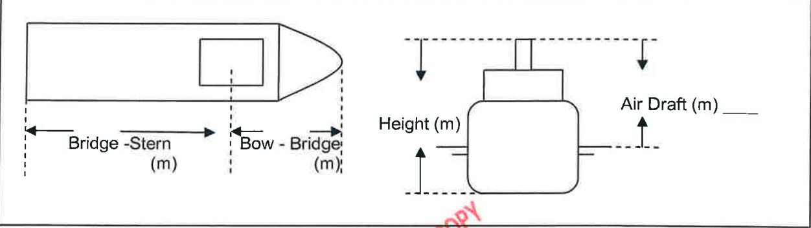

| Type of Engine: Twin/Single Screw/Z peller | Engine Max Power(HP/KW) Stbd: | Port: |
| --------------------------------------------- | -------------------------------- | ----- |
| Propeller Direction:                          | CPP(Yes/No):                     |       |
| Bow Thruster (KW/HP)                          | No2:                             | No3:  |
| Stern Thruster (KW/HP)                        | No2:                             | No3:  |

| Engine Movement                      | Rpm/Pitch | Loaded Speed (kts)                           | Ballast Speed (kts) |
| ------------------------------------ | --------- | ----------------------------------------------- | ---------------------- |
| Full Ahead                           |           |                                                 |                        |
| Half Ahead                           |           |                                                 |                        |
| Slow Ahead                           |           |                                                 |                        |
| Dead Slow Ahead                      |           |                                                 |                        |
| Slow Astern                          |           |                                                 |                        |
| Half Stern                           |           |                                                 |                        |
| Full Astern                          |           |                                                 |                        |
| Critical RPM                         |           | Max no of consecutive starts(if applicable): |                        |
| Time Full Ahead to Full Astern (sec) |           |                                                 |                        |

| No of Rudder                |                                 |
| --------------------------- | ------------------------------- |
| Time Hard Over to Hard Over |                                 |
|                             | Rudder Maximum Angle            |
|                             | Rudder Angle for Neutral Effect |

{394}------------------------------------------------

| Issue Status  | 2nd Edition, Rev 0 |
| ------------- | ------------------ |
| Issue Date    | 1st July 2014      |
| Issued by     | DPA                |
| Authorised By | Director PFS       |

This form shall be completed once the pilot is on board and a record shall be maintained.

| Name:                      |                                |
| -------------------------- | ------------------------------ |
| Date:                      |                                |
| Draft fwd/Aft:             |                                |
| Air Draft                  |                                |
| Last Port:                 |                                |
| Next Port:                 |                                |
| Draft of Tow if applicable | Air draft of Tow if applicable |
| Ship Type:                 | Cargo Type                     |

| No  | Item                                                                                                                                                                                                                                                                                                                                                                                                                                                 | Yes/No |
| --- | ---------------------------------------------------------------------------------------------------------------------------------------------------------------------------------------------------------------------------------------------------------------------------------------------------------------------------------------------------------------------------------------------------------------------------------------------------- | ------ |
| 1   | Immediately on arrival on the bridge, has the pilot been informed of the ship's heading, speed, engine setting and draught                                                                                                                                                                                                                                                                                                                           |        |
| 2   | Has the pilot been informed of the location of lifesaving appliances provided on board for his use                                                                                                                                                                                                                                                                                                                                                   |        |
| 3   | Have details of the proposed passage plan been discussed with the pilot and agreed with the master, including: <ul><li>radio communications and reporting requirements</li><li>bridge watch and crew stand-by arrangements</li><li>deployment and use of tugs</li><li>berthing/anchoring arrangements</li><li>expected traffic during transit</li><li>fender requirements</li><li>Speed/UKC/Squat/Air draft</li><li>Change of pilot if any</li></ul> |        |
| 4   | Has a completed Pilot Card been handed to the pilot and has the pilot been referred to the Wheelhouse Poster                                                                                                                                                                                                                                                                                                                                         |        |
| 5   | Have the responsibilities within the bridge team for the pilotage been defined and are they clearly understood                                                                                                                                                                                                                                                                                                                                       |        |
| 6   | Has the language to be used on the bridge between ship, the pilot and the shore been agreed                                                                                                                                                                                                                                                                                                                                                          |        |
| 7   | Are the correct lights, flags and shapes being displayed                                                                                                                                                                                                                                                                                                                                                                                             |        |
| 8   | Has weather info being exchanged                                                                                                                                                                                                                                                                                                                                                                                                                     |        |
| 9   | Has pilot suggested any deviation in passage plan, if yes, has passage plan been amended accordingly                                                                                                                                                                                                                                                                                                                                                 |        |
| 10  | Has pilot ladder arrangement been agreed                                                                                                                                                                                                                                                                                                                                                                                                             |        |
| 11  | Has tidal and current info exchanged                                                                                                                                                                                                                                                                                                                                                                                                                 |        |
| 13  | Contingency plan for any failure that may affect navigation discussed                                                                                                                                                                                                                                                                                                                                                                                |        |
| 14  | Does pilot need any additional lookout or anchor ready for use                                                                                                                                                                                                                                                                                                                                                                                       |        |
| 15  | Has pilot been made aware of restrictions to use Azimuth thruster in relation to available depth                                                                                                                                                                                                                                                                                                                                                     |        |
| 16  | Equipment defect related to Navigation(if any):                                                                                                                                                                                                                                                                                                                                                                                                      |        |
| 17  | Other Important details (berthing restriction/manoeuvring/navigational hazard/ship movement):                                                                                                                                                                                                                                                                                                                                                        |        |

Master Name & sign
Pilot Name & Sign

{395}------------------------------------------------

| Vessel: | Port/At Sea:                   |     |
| ------- | ------------------------------ | --- |
| Date:   | Hand-over Officer's Signature: |     |
| Time:   | Take-over Officer's Signature: |     |

| No  | Description                                                                   | Remarks |
| --- | ----------------------------------------------------------------------------- | ------- |
| 1   | Standing/night orders and other instructions by Master relating to Navigation |         |
| 2   | Position, course, speed and draft of vessel                                   |         |
| 3   | Prevailing and predicted tides, currents, weather, visibility and the effects |         |
| 4   | Main engine controls status (bridge, E/R or local)                            |         |
| 5   | Navigational equipment operational condition/status                           |         |
| 6   | Gyro and magnetic compass errors                                              |         |
| 7   | Traffic in the vicinity                                                       |         |
| 8   | Hazards likely to be encountered                                              |         |
| 9   | Under-keel clearance and any effect on squat                                  |         |
| 10  | Any special deck work in progress                                             |         |
| 11  | Any offshore operations in progress                                           |         |
| 12  | Any special instruction from charterers                                       |         |
| 13  | VHF channel/Radio frequencies to watch                                        |         |
| 14  | DP operation/500 mtr zone checklist requirements                              |         |
| 15  | Passage plan requirements                                                     |         |
| 16  | Navigational lights and shapes displayed                                      |         |
| 17  | Total no of person on board including offshore personnel                      |         |

A laminated copy of this checklist may be used. In case of any accident/incident/near miss/loss time etc, preserve a photocopy of the completed checklist.

{396}------------------------------------------------

| Issue Status  | 2nd Edition, Rev 0 |
| ------------- | ------------------ |
| Issue Date    | 1st July 2014      |
| Issued by     | DPA                |
| Authorised By | Director PFS       |

# All Bridge Watchkeeping Officers shall be given familiarisation with the bridge equipment immediately after joining vessel and before they take over any independent bridge duties.

| Name: |                                                                                                                                                                                                                       | Rank:                              |     | Vessel: |     |
| ----- | --------------------------------------------------------------------------------------------------------------------------------------------------------------------------------------------------------------------- | ---------------------------------- | --- | ------- | --- |
| Port: |                                                                                                                                                                                                                       | Date Joined:                       |     |         |     |
| No    | Item                                                                                                                                                                                                                  | Yes/No/NA                          |     |         |     |
| 1     | Bridge and deck lighting                                                                                                                                                                                              |                                    |     |         |     |
| 2     | Emergency arrangements in the event of main power failure                                                                                                                                                             |                                    |     |         |     |
| 3     | Navigation and signal lights, including searchlights, signaling lamp, Morse light                                                                                                                                     |                                    |     |         |     |
| 4     | Sound signaling apparatus, including whistles, fog bell and gong system                                                                                                                                               |                                    |     |         |     |
| 5     | Safety equipment, including LSA equipment including pyrotechnics, EPIRB and SART, bridge fire detection panel, general and fire alarm signaling arrangements, emergency pump, ventilation and watertight door control |                                    |     |         |     |
| 6     | Internal ship communication facilities, including portable radios, emergency "batteryless" telephone system, public address system                                                                                    |                                    |     |         |     |
| 7     | AIS and external communications equipment, including VHF and GMDSS equipment                                                                                                                                          |                                    |     |         |     |
| 8     | Alarm system on bridge                                                                                                                                                                                                |                                    |     |         |     |
| 9     | Automatic track-keeping system, if fitted                                                                                                                                                                             |                                    |     |         |     |
| 10    | ECDIS and electronic charts, if fitted                                                                                                                                                                                |                                    |     |         |     |
| 11    | Echo sounder                                                                                                                                                                                                          |                                    |     |         |     |
| 12    | Electronic navigation position-fixing systems                                                                                                                                                                         |                                    |     |         |     |
| 13    | VDR or S-VDR equipment                                                                                                                                                                                                |                                    |     |         |     |
| 14    | Gyro compass / repeaters                                                                                                                                                                                              |                                    |     |         |     |
| 15    | IBS functions, if fitted                                                                                                                                                                                              |                                    |     |         |     |
| 16    | Magnetic compass                                                                                                                                                                                                      |                                    |     |         |     |
| 17    | Off-course alarm                                                                                                                                                                                                      |                                    |     |         |     |
| 18    | Radar including ARPA                                                                                                                                                                                                  |                                    |     |         |     |
| 19    | Speed / distance recorder                                                                                                                                                                                             |                                    |     |         |     |
| 20    | Engine and thruster controls and emcy stop                                                                                                                                                                            |                                    |     |         |     |
| 21    | Ship security alert equipment                                                                                                                                                                                         |                                    |     |         |     |
| 22    | Steering gear, including manual, auto-pilot and emergency changeover and testing arrangements (see annex A7)                                                                                                          |                                    |     |         |     |
| 23    | Location and operation of ancillary bridge equipment (e.g. binoculars, signaling flags, meteorological equipment)                                                                                                     |                                    |     |         |     |
| 24    | Stowage of chart and hydrographic publications                                                                                                                                                                        |                                    |     |         |     |
| 25    | Manoeuvring control fwd and aft and change over procedures                                                                                                                                                            |                                    |     |         |     |
| 26    | Emergency stop for towing and anchor handling winches                                                                                                                                                                 |                                    |     |         |     |
| 27    | Emergency stop for bulk handling system                                                                                                                                                                               |                                    |     |         |     |
| 28    | DP control station and joystick/repeaters                                                                                                                                                                             |                                    |     |         |     |
| 29    | CY scan/laser/radar scan equipment/LTW/HIPAP                                                                                                                                                                          |                                    |     |         |     |
| 30    | Other check (to be expanded by Master and Navigation Officer):                                                                                                                                                        |                                    |     |         |     |
|       | Name/Rank/signature of staff giving induction:                                                                                                                                                                        | Signature of staff inducted: Date: |     |         |     |

{397}------------------------------------------------

## IMS - 14 APPENDIX H HEAVY WEATHER PREPARATIONS NAVIGATION IN HEAVY WEATHER

| Issue Status  | 2nd Edition, Rev 0 |
| ------------- | ------------------ |
| Issue Date    | 1st July 2014      |
| Issued by     | DPA                |
| Authorised By | Director PFS       |

| Vessel:            |     | Date/Time: |     |
| ------------------ | --- | ---------- | --- |
| Position/Location: |     | OOW:       |     |

| No. | Items/Action                                                                                                                                                                                                                                                                                                                                                                               | Check | Remarks |
| --- | ------------------------------------------------------------------------------------------------------------------------------------------------------------------------------------------------------------------------------------------------------------------------------------------------------------------------------------------------------------------------------------------ | ----- | ------- |
| 1   | Early warning of heavy weather obtained by continuous monitoring of prevailing weather conditions and reports.                                                                                                                                                                                                                                                                             |       |         |
| 2   | Crew briefing carried out to ensure they are familiar with available means/ procedures for heavy weather response.                                                                                                                                                                                                                                                                         |       |         |
| 3   | Following notified; <ul><li>Master,</li><li>Engine Room/Chief Eng.</li><li>Deck/ Chief Officer</li><li>Galley department.</li></ul>                                                                                                                                                                                                                                                        |       |         |
| 4   | All loose objects/gear on deck properly secured                                                                                                                                                                                                                                                                                                                                            |       |         |
| 5   | All loose objects/gear in E/R properly secured                                                                                                                                                                                                                                                                                                                                             |       |         |
| 6   | All loose gear in Galley/Mess room/Provision stores properly secured                                                                                                                                                                                                                                                                                                                       |       |         |
| 7   | All loose items in accommodation (common areas, stores & crew cabins) properly secured.                                                                                                                                                                                                                                                                                                    |       |         |
| 8   | Close all openings to ensure weather tightness of the vessel :- a) hatches, b) booby hatch covers c) all exposed dk-stores d) manholes e) weathertight doors to accommodation. & all others f) steering gear room g) tanks air pipes h) sounding caps i) all ventilation flaps especially on weather deck j) spurling pipes k) chain locker manhole covers, i) All other similar openings. |       |         |
| 9   | Cargo and anchor lashings checked. Extra lashings taken as required.                                                                                                                                                                                                                                                                                                                       |       |         |
| 10  | Change from Shaft to Diesel Generators                                                                                                                                                                                                                                                                                                                                                     |       |         |
| 11  | Crew informed not to go on deck.                                                                                                                                                                                                                                                                                                                                                           |       |         |
| 12  | Extra lookout posted as required                                                                                                                                                                                                                                                                                                                                                           |       |         |
| 13  | Radars on operational Navigation lights on.                                                                                                                                                                                                                                                                                                                                                |       |         |
| 14  | Speed/course adjusted to reduce rolling, pitching, pounding, slamming, pooping, broaching & stresses                                                                                                                                                                                                                                                                                       |       |         |
| 15  | Switch to manual steering or if an auto-pilot then auto-pilot settings adjusted to adapt to heavy weather steering.                                                                                                                                                                                                                                                                        |       |         |
| 16  | Progress of vessel in heavy weather continuously checked.                                                                                                                                                                                                                                                                                                                                  |       |         |
| 17  | If towing, extra caution exercised. Tow & towing gear monitored continuously.                                                                                                                                                                                                                                                                                                              |       |         |

<< Heavy weather refers to navigation under weather and sea conditions of "Beaufort Scale" wind force greater than 4 and wave heights greater than 2 meters. The Master may commence the checklist early if he deems that the wave size & the freeboard of the vessel warrants it. >>

A laminated copy of this checklist may be used. In case of any accident/incident/near miss/loss time etc, preserve a photocopy of the completed checklist.

{398}------------------------------------------------

| Issue Status  | 2 nd Edition, Rev 0 |
| ------------- | ------------------------------ |
| Issue Date    | 1 st July 2014      |
| Issued by     | DPA                            |
| Authorised By | Director PFS                   |

| Vessel:            |     |
| ------------------ | --- |
| Date/Time:         |     |
| Position/Location: |     |
| OOW:               |     |

| No. | Items/Action                                                                                    | Check | Remarks |
| --- | ----------------------------------------------------------------------------------------------- | ----- | ------- |
| 1   | Early warning of restricted visibility obtained by continuous monitoring of weather reports. |       |         |
| 2   | Master notified.                                                                                |       |         |
| 3   | Engine room notified - engines can be operated immediately when required.                       |       |         |
| 4   | Radar / ARPA / AIS / other plotting aids operated.                                              |       |         |
| 5   | Manual / Auto fog signal sounded.                                                               |       |         |
| 6   | Navigation lights switched 'ON'.                                                                |       |         |
| 7   | VHF watch ch.16 or other appropriate channel maintained.                                        |       |         |
| 8   | Extra lookout posted.                                                                           |       |         |
| 9   | Helmsman on standby / switch to manual steering if necessary.                                   |       |         |
| 10  | Collision regulation ( Rule 19 ) complied with.                                                 |       |         |
| 11  | Vessel proceeding at safe speed / reduce speed if necessary.                                    |       |         |
| 12  | Echo sounder operated if in shallow waters.                                                     |       |         |
| 13  | Anchoring plan considered if vessel's position in doubt.                                        |       |         |

# Restricted Visibility:

Refer to any condition in which visibility is restricted by fog, mist, falling snow, heavy rainstorm, sandstorm or any other similar causes and in principle to a visibility of less than two ( 2 ) nautical miles or visibility that is less than that separately prescribed by the Master.

Note:

Tick the relevant box upon completion of each item and enter "NA", when not applicable. Notify the Master immediately if any of the above is NOT carried out satisfactorily.

A laminated copy of this checklist may be used. In case of any accident/incident/near miss/loss time etc, preserve a photocopy of the completed checklist.

{399}------------------------------------------------

| Issue Status  | 2nd Edition, Rev 0 |
| ------------- | ------------------ |
| Issue Date    | 1st July 2014      |
| Issued by     | DPA                |
| Authorised By | Director PFS       |

| Vessel:            |     |
| ------------------ | --- |
| Date/Time:         |     |
| Position/Location: |     |
| OOW:               |     |

| No. | Items/Action                                                                                                                                                                                                                                                                                                                                                                                               | Check | Remarks |
| --- | ---------------------------------------------------------------------------------------------------------------------------------------------------------------------------------------------------------------------------------------------------------------------------------------------------------------------------------------------------------------------------------------------------------- | ----- | ------- |
| 1   | Have relevant sections of pre-arrival checklist (IMS12 Appendix-C) completed                                                                                                                                                                                                                                                                                                                               |       |         |
| 2   | If anchoring with Pilot, has pilot card been completed?                                                                                                                                                                                                                                                                                                                                                    |       |         |
| 3   | Has an anchoring plan been prepared and following taken into consideration; a) Speed reduction in ample time b) Intended Anchorage c) Depth of water at the intended & Nature of seabed d) Direction / speed of wind, weather conditions, current and tidal stream e) Need for adequate sea room particularly to seaward f) Alternate anchor position identified in case of an emergency |       |         |
| 4   | Following calculated/reviewed; • Scope of the cable required • Maximum anchoring depth/windlass liftable load • Critical wind velocity for dragging anchor                                                                                                                                                                                                                                        |       |         |
| 5   | Have the following parties been informed of "stand by " for anchoring • Master • Engine Room • Anchor party                                                                                                                                                                                                                                                                                       |       |         |
| 6   | Are the following equipment ready for use; • Anchors cleared (all lashings removed) • Lights and shapes • Signalling apparatus                                                                                                                                                                                                                                                                    |       |         |

# Note:

- Tick the relevant box upon completion of each item and enter "NA", when not applicable.
- · Notify the Master immediately if any of the above checks is NOT carried out satisfactorily.

A laminated copy of this checklist may be used. In case of any accident/incident/near miss/loss time etc, preserve a photocopy of the completed checklist.

{400}------------------------------------------------

| Vessel: | Port/At Sea:                   |
| ------- | ------------------------------ |
| Date:   | Hand-over Officer's Signature: |
| Time:   | Take-over Officer's Signature: |

| No  | Description                                                                                                                                                                                        | Remarks |
| --- | -------------------------------------------------------------------------------------------------------------------------------------------------------------------------------------------------- | ------- |
| 1   | Anchor position in compliance with Local Authority / Charterer's instruction                                                                                                                    |         |
| 2   | Suitability of water depth and nature of sea bed                                                                                                                                                   |         |
| 3   | Traffic in the anchor position                                                                                                                                                                     |         |
| 4   | Proximity of dangers with regards to ; a) New & existing Dangers b) Safe Distance                                                                                                               |         |
| 5   | Important information marked on the chart                                                                                                                                                          |         |
| 6   | Ensure vessel displays appropriate lights and shapes.                                                                                                                                              |         |
| 7   | Determine and plot the anchor position as soon as upon anchoring on the chart with swing circle of the anchor chain length.                                                                  |         |
| 8   | Check at sufficient intervals (not exceeding one hour) vessel's position on whether the vessel remain within the swing circle by taking bearings of fixed navigation marks or shore objects. |         |
| 9   | Ensure proper lookout is maintained and appropriate channel VHF watch kept.                                                                                                                     |         |
| 10  | Ensure deck security patrol is carried out and remain in frequent walkie-talkie contact with the Bridge.                                                                                        |         |
| 11  | Observe meteorological and tidal conditions and state of the sea, and notify Master if conditions worsen.                                                                                       |         |
| 12  | Notify Master and take necessary steps if vessel drags anchor.                                                                                                                                  |         |
| 13  | Ensure state of readiness of main engine and other machinery is in accordance with Master's instructions.                                                                                       |         |

A laminated copy of this checklist may be used. In case of any accidentlincident/near miss/loss time etc. preserve a photocopy of the completed checklist.

{401}------------------------------------------------

AN

| IMS 14 - APPENDIX L                                          |               |                    |
| ------------------------------------------------------------ | ------------- | ------------------ |
| ANCHOR HOLDING POWER & CRITICAL WIND VELOCITY CALCULATION | Issue Status  | 2nd Edition, Rev C |
|                                                              | Issue Date    | 1st July 2014      |
|                                                              | Issued By     | DPA                |
|                                                              | Authorized By | Director PFS       |

# HOLDING POWER & CRITICAL WIND VELOCITY CALCULATION

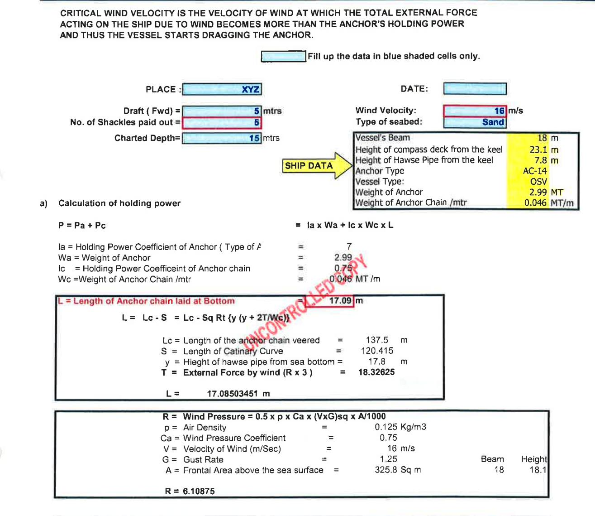

| P (Total Holding Power) | =   | T (Total External Force by wind) |
| ----------------------- | --- | -------------------------------- |
|                         |     | 3 x R                            |
| la x Wa + Ic x Wc x L   | =   | 3 X 6.10875                      |
| 21.519                  |     | 18.326                           |

If T is equal to or greater than P the vessel will start dragging Anchor. The Wind Velocity at which T become equal to P is the critical wind velocity.

| Result:                                      |
| -------------------------------------------- |
| SAFE TO ANCHOR                               |
| Critical Wind Velocity:                      |
| Critical Wind Velocity is 16 m/s OR 31 Knots |

{402}------------------------------------------------

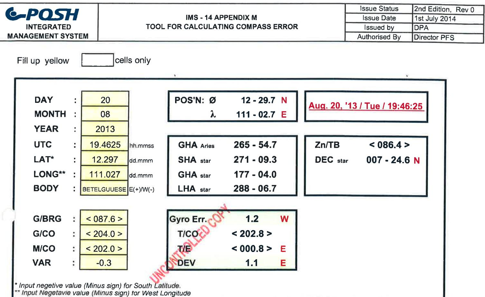

{403}------------------------------------------------

|                           |     |                            |      | IMS - 14 APPENDIX N SQUAT TABLE         |      |      |      | Issue Status  |      | 2nd Edition, Rev 0 |      |     |
| ------------------------- | --- | -------------------------- | ---- | ------------------------------------------ | ---- | ---- | ---- | ------------- | ---- | ------------------ | ---- | --- |
| C-SR MARINE INTEGRATED |     |                            |      | VESSEL NAME :                              |      |      |      | Issue Date    |      | 1st July 2014      |      |     |
| MANAGEMENT SYSTEM         |     |                            |      |                                            |      |      |      | Issued By     |      | DPA                |      |     |
|                           |     |                            |      |                                            |      |      |      | Authorised By |      | Director PFS       |      |     |
|                           |     |                            |      |                                            |      |      |      |               |      |                    |      |     |
|                           |     | 0.668 Block Coefficient |      | Input Vessel's Block Coefficient (Cb) here |      |      |      |               |      |                    |      |     |
|                           |     |                            |      | OPEN SEA                                   |      |      |      |               |      |                    |      |     |
| Speed (Kts)               |     | 2                          | 4    | 6                                          | 8    | 10   | 11   | 12            | 13   | 14                 | 15   |     |
| Squat (m)                 |     | 0.03                       | 0.11 | 0.24                                       | 0.43 | 0.67 | 0.81 | 0.96          | 1.13 | 1.31               | 1.50 |     |
|                           |     |                            |      |                                            |      |      |      |               |      |                    |      |     |
|                           |     |                            |      | CONFINED WATERS                            |      |      |      |               |      |                    |      |     |
| Speed (Kts)               |     | 2                          | 4    | 6                                          | 8    | 10   | 11   | 12            | 13   | 14                 | 15   |     |
| Squat (m)                 |     | 0.05                       | 0.21 | 0.48                                       | 0.86 | 1.34 | 1.62 | 1.92          | 2.26 | 2.62               | 3.01 |     |

Keep this table readily available on bridge.

{404}------------------------------------------------

| Issue Status  | 2nd Edition, Rev 0 |
| ------------- | ------------------ |
| Issue Date    | 1st July 2014      |
| Issued by     | DPA                |
| Authorised By | Director PFS       |

# CONTENTS

- 1. GENERAL
- '2. TOOLBOX MEETING & RISK ASSESSMENT
- 3. PPE & SAFETY EQUIPMENT
- এ. DECK LIGHTING
- 5. COMMUNICATION
- 6. MEANS OF ACCESS
  - 6.1. General
  - 6.2. Gangways
  - 6.3. Pilot Ladder
  - 6.4 Enclosed Spaces
- 7. DECK WATCH
- 8. LIFTING, HAULING & TOWING GEAR

#### 9. CARRIAGE OF CARGO ON DECK

#### MOORING, UNMOORING & ANCHORING 10.

- Responsibilities 1 10.1.
- Anchoring 10.2.
- Mooring and Un-Mooring 10.3.

#### WATERTIGHT INTEGRITY 11.

- 11.1. Soundings
- 11.2. Maintenance of Openings
- 11.3. Prior to Sailing

# Appendix:

# Appendix A: Crane Operator's Certificate

{405}------------------------------------------------

#### 1. GENERAI

- 1.1. Responsibility
- 1.1.1. The Master of the vessel has the ultimate responsibility for making sure that any operation is carried out with due regard to the safety of all those on board and that steps are taken to minimise the risks.
- 1.1.2. The Chief Officer is responsible for all operations on deck.

# 2. Toolbox Talk & Risk Assessment (See IMS 03)

- 2.1. The person in charge must carry out a toolbox talk with all personnel involved with the job, which must include a briefing and a risk assessment on the planned operation, prior to work commencing. The toolbox talk must be as detailed as necessary to fully inform the crew members of the proposed work program together with any unusual aspects of the jobs and any hazards that may be encountered. Particular attention should be paid to briefing new or inexperienced crew members as to the hazards associated with the operation. A risk assessment covering the proposed work program during this toolbox meeting must be completed and the required steps taken to mitigate the risks highlighted. The toolbox talk form must be signed by all personnel attending.
- 2.2. When working on deck, all personnel should keep in mind that it can be a dangerous place to be, especially if major operations are in progress. Personnel must at all times keep aware of potential hazards and bear in mind:
  - Weather conditions, especially where waves may break on deck and swamp the work a) area.
  - b) Slippery surfaces.
  - c) Wires/ropes/chain eto that may be under tension or suddenly come under tension or may move unexpectedly.
  - d) Never stand in the bight of a rope.
  - Items that are being moved or lifted never stand in position where crushing or e) injuries from falling or moving objects could occur.
  - f) Trip hazards.
  - Never sit on the ships rails or on bollards that have mooring ropes turned up on them. g)
  - h) Items on deck that could move as the ship rolls.
  - Never secure items on deck to anything other than the proper securing points; this ﯿ applies particularly to vent pipes and filling lines.
  - Maintaining good housekeeping clear up and properly stow tools and other items when the job is completed - do not leave unnecessary items on deck that could be a trip hazard.
  - k) Use the right tools for the job; never abuse tools or equipment.
  - Ensure any portable electrical equipment is the correct voltage and is in good 드 condition prior to use - check condition including the cable/plug and do not use any damaged equipment.

{406}------------------------------------------------

Ensure tools/rigging gear etc are adequate for the job and have been m) inspected prior to use.

Issue Status

Issue Date

Issued by

Authorised By

2nd Edition, Rev 0

1st July 2014

Director PFS

DPA

- Always ensure that you have an "escape route" in the event of something going the n) wrong.
- 0. If not involved in the job, keep out of the way.
- 2.3. J Above all, stay focused and alert, look out for one another's safety and ensure all jobs are done as safely as possible.

# 3. PPE & SAFETY EQUIPMENT (see also IMS 04)

- The appropriate safety equipment must be readily available on deck during operations. 3.1.
- 3.2. The appropriate personnel protective equipment must be available and worn during the operations. This should include but not necessarily be limited to:
  - a) Coveralls
  - b) Safety Boots
  - C) Work vest / Flotation device
  - Protective Gloves d)
  - Safety Glasses / Face Protection e)
  - Safety Helmets complete with chinstraps f)
  - High visibility work vest g)
- 3.3. In addition, suitable wet and cold weather clothing must be available and used as necessary.

#### DECK LIGHTING 4.

4.1. Deck lighting should always be adequate to conduct operations in a safe and efficient manner. At nightfall, sufficient lighting must be provided at the access ways, at work areas and gangway, to make sure that any obstructions can be clearly seen and that the work may be carried out in a safe manner.

#### 5. COMMUNICATION

- 5.1 . On all occasions when work is being carried out on deck ensure there is an efficient means of communication between the Bridge and the deck crew. This means of communication is usually by means of walkie-talkie and/or the ship's public address system. Frequent communication should be made between the deck and bridge personnel to ensure all involved are kept aware of activities that are in progress.
- 5.2. When carrying out operations with other facilities or vessels, ensure procedures are fully agreed and understood between all parties, communications systems are in place and working.

#### 6. MEANS OF ACCESS

#### General 6.1.

- 6.1.1. Only designated 'means of access' may be used at any time.
- 6.1.2 The Chief Officer is responsible for ensuring the equipment is in good order.

{407}------------------------------------------------

#### 62 Gangways

- 6.2.1. Proper Gangways shall be rigged and used at all times whilst the vessel is in port never climb over the rails and jump across to the jetty or to another vessel.
- The gangway should be :-6.2.2.
  - Well secured. a)
  - b) Provided with a properly rigged and secured safety net, lifebuoy and swing rope (where fitted).
  - c) Provided with secure foot and hand holds and steps to the level of the ship's rail where necessary.
  - d) In good condition.
  - e) Well illuminated at night.
  - If fitted with wheels or rollers, the gangway should be rigged with these at its lower f) end.
- 6.2.3. The gangway should be attended at all times and should be adjusted regularly with the rise and fall of the vessel.
- 6.2.4. When vessels are double banked or moored alongside each other, if practicable a gangway should be rigged to allow a safe means of access between vessels. If it is not practicable to rig a gangway between vessels, and alternative safe means of access should be provided and properly rigged.
- 6.2.5. When transferring between vessels at sea, great care should be taken, particularly when the vessel decks are wet or in rough weather conditions. Personnel should take great care not to allow any part of their body to come between any part of vessel and a lifejacket as well as the appropriate personal protective equipment must be worn.

#### 6.3. Pilot Ladder

- 6.3.1 The pilot ladder's construction should conform to regulations.
- 6.3.2. The pilot ladder should be checked to ensure it is in good condition. If it is not, it must be repaired or discarded.
- 6.3.3. All rungs and spreaders must be horizontal, undamaged and properly secured in place and all ropes must be in good condition.
- 6.3.4. The pilot ladder should be stowed in a dry place away from sunlight.
- 6.3.5 The ladder should be used / provided with the following equipment .-
  - Lifebuoy and light. a)
  - b) Heaving line.
  - C) Safety line and harness.
  - ರು) Manropes
  - e) Spreaders
- 6.3.6. The ladder should be well secured and provide easy access to the deck.
- 6.3.7 The boarding operation should be supervised by an Officer with a walkie-talkie in contact with the Master on the Bridge, and with a deck rating in attendance.
- 6.3.8. The ladder should be well illuminated at night.

{408}------------------------------------------------

#### 6.4. Enclosed Spaces

- 6.4.1 All enclosed spaces on deck and in the engine-room must be clearly marked.
- 6.4.2 Prior to entry into any enclosed space, a Permit to Work must be carried out and fully complied with.

#### DECK WATCH 7.

- 7.1. While in port, a deck watch shall be maintained and the following checked .-
  - Moorings are tended. a)
  - b) Gangway watch maintained at all times.
  - Emergency shore contact is known (as per ISPS requirements). c)
  - Control of access to the ship (as per SSP) a picture ID to be checked for all visitors, d)
  - Cargo work is monitored (See IMS 16). e)
  - Security and fire rounds are made and entered in the Deck Log. f)
- 7.2. Prior to sailing :-
  - All crew and other authorised personnel onboard a)
  - A stowaway search is conducted as appropriate b)
  - All shore staff have disembarked c)

#### LIFTING, HAULING & TOWING GEAR 8.

- 8.1. A Register of all lifting, hauling and towing gear must be maintained on board, complete with a schedule of inspection and maintenance.
- 8.2 Where provided, certificates of lifting, hauling and towing gear should be maintained on board.
- 8.3. All lifting equipment should be inspected at least annually and colour coded accordingly. The colour coding should be changed after each annual inspection to ensure equipment that has not passed inspection is not used.
- 8.4. Damaged and unfit lifting equipment is to be segregated from other in use items. They shall be kept in a clearly marked storage box or similar arrangement to ensure that accidental use is prevented at all times. The certificates shall be removed from the file or in case of common certificates; it should be well marked on the certificate of items discarded.
- 8.5 Fixed and running gear should be carefully maintained in good condition and inspected regularly to detect wear, damage and corrosion. Frequent inspections are to be made where gear has hard usage or is exposed to sea and weather conditions.
- 8.6. In all operations where large loads or shock strains upon the gear are involved, steps should be taken against sudden failure which may cause injury to personnel. The system should be so designed that the weakest element is at a point where failure is likely to cause least danger.
- 8.7 When gear is under load, personnel who are essential for the operation should position themselves so as to not be in the line of fire if anything falls. Personnel not involved in the operation should keep away from the working area.
- 8.8. Master to designate appropriate personnel to operate equipment based on experience and/or qualification. Only these personnel are to operate the controls.

{409}------------------------------------------------

- 8.9. Inexperienced personnel should only be allowed to operate the appliances under the strict supervision of experienced designated personnel.
- 8.10. Personnel used to direct the designated operator should be trained in correct hand signaling , techniques to avoid mistakes.

#### 9 -CARRIAGE OF CARGO ON DECK

- 9.1 . When it is planned to carry cargo on deck, the stability of the vessel must be considered prior to loading, particularly if bad weather is expected during the voyage.
- 9.2. All deck cargoes should be checked for safety and security by a competent person before the vessel commences its passage. To help unloading at sea to be carried out in a safe manner, independent cargo units should, as far as possible, be individually lashed. Cargo must only be secured to proper lashing points, which should be marked with their SWL.
- 9.3. Lashings should be checked at least once during each watch whilst a sea when it is safe to do so. Personnel carrying out the operation should be closely supervised from the Bridge, especially in bad weather conditions. During bad weather conditions at night, an Aldis lamp or searchlight should be used to help remote checking of lashings to prevent placing personnel at risk.
- 9.4. Any discarded rope, damaged or unserviceable equipment or cargo should not be jettisoned at sea, but should be kept on board for disposal ashore.

# 10. MOORING, UNMOORING & ANCHORING

#### 10.1. Responsibilities

- 10.1.1. During all mooring operations, there shall be responsible person in charge both on the foc'sle and on the after deck.
- 10.1.2. During all anchoring operations, a responsible person shall be in charge on the foc'sle.
- 10.1.3. The Master on the bridge shall direct all operations and be in constant communication with his Officers

#### 10.2. Anchoring

- 10.2.1. The responsible person in charge should follow all Masters Orders,
- 10.2.2. Prior to all operations the responsible person in charge shall check the following:-
  - The anchor brake is on. a)
  - b) All anchor lashings and securing bars are removed.
  - All personnel are wearing protective clothing particularly eyelface protection for c) personnel operating the anchor brake.
  - d) Communications are tested with the bridge.
  - e) Ensure power is on the windlass.

# 10.2.3. Dropping an anchor

- a) Check there are no obstructions below the anchor.
- Lower anchor under power to the waterline, or to a level advised by the Master, b) depending on the depth of water.
- Apply brake take out of gear. C)

{410}------------------------------------------------

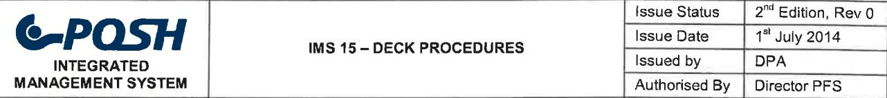

- Await Masters instructions for dropping the anchor.
- Pay out the cable in stages reporting to the Master on a regular basis. e)
- When the anchor is 'brought up', report to the Master and apply the anchor securing f) devices.
- Display the anchor ball/lights. a)
- 10.2.4. Personal Protection Equipment should be worn when dropping anchor, particularly safety glasses to protect eyes from flying debris coming off the anchor chain.
- 10.2.5. Weighing an anchor :
  - a) Check the anchor cable for obstructions.
  - b) On orders from the Master, put anchor in gear, release the securing devices and commence weighing the anchor.
  - Report to the Master when each shackle is heaved in and when the anchor is C) 'aweigh'.
  - d) Unship the anchor ball.
  - Bring the anchor to it's housing carefully and secure. e)

#### 10.3. Mooring and Un-Mooring

- 10.3.1. Mooring operations are dangerous for personnel working in the mooring areas. Protective clothing should be worn. These are:
  - a) Safety footwear.
  - b) Hard hats.
  - Gloves. C)
  - d) Overalls.
- 10.3.2. The following general precautions should be taken :
  - a) The responsible person in charge should test communications with the Master prior to commencement.
  - b) Power to be on all winches.
  - C) The responsible person in charge to liaise with the Master with regards to the mooring plan.
  - d) The availability and condition of wires, ropes, heaving lines, stoppers and messengers etc. to be checked.
  - e) The responsible person in charge should brief the crew on the proposed mooring plan.
  - f) All personnel should be aware of the operations going on around them.
- 10.3.3. During mooring operations, there are safe places to stand as well as dangerous ones. Never stand in the bight of a rope.
- 10.3.4. All 'in-use' mooring equipment, including but not limited to mooring ropes, heaving lines, stoppers, chains, messengers, bollards, shackles, securing points, etc. must be checked at least once per month to ensure they are in good condition and safe to use. Any damaged equipment must be repaired or replaced/segregated. Any equipment to be disposed of must be rendered impossible to use for mooring purposes (for example, a mooring rope unfit for further use must be cut up and the eyes cut off).

{411}------------------------------------------------

#### WATERTIGHT INTEGRITY 11

#### 11.1 Soundings

- 11.1.1 The Chief Officer should maintain a 'Sounding Book'.
  - 11.1.2 Where practicable, on a daily basis the following should be sounded:-
    - Fresh water tanks a)
    - b) Cofferdams/void spaces
    - Chain lockers C)
    - d) Ballast tanks/cargo tanks
  - 11.1.3 The details should be entered in the 'Sounding Book'.

# 11.2 Maintenance of Openings

- 11.2.1 All watertight openings should be inspected monthly and maintained as required,
- 11.2.2 Watertight openings include:-
  - Hatches a)
  - b) Watertight doors
  - Vent covers C)
  - d) Sounding pipe covers
  - Inspection hatches/plates e)
  - Access hatches f)
- 11.2.3 All closing devices should be well greased as required; the rubbers in good condition and capable of being closed tight. If in doubt, a hose test should be applied.
- 11.2.4 The Chief Officer should record all maintenance and tests in his 'Deck Maintenance Work Book'.

#### 11.3 Prior to Sailing

- 11.3.1 The Chief Officer should inspect the following areas prior to sailing :-
  - Foc'sle a)
  - b) Main deck and any items on deck
  - Outside accommodation decks C)
- 11.3.2 The Chief Officer should ensure that all watertight openings are closed, loose gear is stowed away and that the vessel is ready to proceed to sea.
- 11.3.3 Even if good weather is forecast, the checks should still be made,
- 11.3.4 The Chief Officer should pay special attention to the securing arrangements of any items on deck and should personally inspect the lashings to ensure that all securing arrangements are in good order and in a seagoing condition.

{412}------------------------------------------------

| Issue Status  | 2nd Edition, Rev 0 |
| ------------- | ------------------ |
| Issue Date    | 1st July 2014      |
| Issued by     | DPA                |
| Authorised By | Director PFS       |

# CONTENTS

#### 1. GENERAL

- 1.1. Responsibilities
- 1.2. Master / OIM Information Exchange and Communications
- 1.3. Toolbox Meeting for Crew
- 1.4. Deviation from Procedures
- 1 5 Stability and Safety Considerations
- 1.6 Deck Lighting
- 1.7 Weather Limitation Guidelines

#### PPE & SAFETY EQUIPMENT 2.

#### 3. APPROACHING & AT OFFSHORE INSTALLATION

- 3.1. Installation Pre-arrival
- 3.2. Before Entering the 500 metre Zone
- 3.3. Inside the 500 metre Zone

#### 4. HYDROGEN SULPHIDE (H2S) PROCEDURES

#### 5. DP OPERATIONS

5.1. Reference

#### CARGO OPERATIONS 6.

- 6.1. General.
- Order of Storage 6.2.
- Documentation & Marking 6.3.
- 6.4. Lashing & Securing / Restraining of Cargo
- 6.5. Deck Cargo
- 6.6. Pre-planning
- 6.7. Dangerous Goods & Marine Pollutants

#### CARGO OPERATION AT INSTALLATION 7.

- 7.1. General.
- 7.2. Considerations for Cargo Operations
- 7.3. Backloading of Cargo Offshore
- 7.4. Helicopter Operations
- 7.5. Crane Operations
- 7.6. Bulk Transfer Procedures

#### 8. RIG TOWING OPERATIONS

- 8.1. General
- 8.2. Agreed Procedures and Responsibilities
- 8.3. Equipment
- 8.4. Inspection.
- 8.5. Clear Decks, Towing Operations

{413}------------------------------------------------

- 8.6. Reserve Tow Equipment
- 8.7. Manned Tow
- 8.8. Unmanned Tow

#### ANCHOR HANDLING AND INSTALLATION SHIFTS 9.

- 9.1. General
- Agreed Procedures, Written Program, Briefing of Master, Responsibilities 9.2.
- Communication 9.3.
- 9.4. Pipelines, Sub-sea Obstructions/Structures
- Clear Decks, Anchor Handling Operations 9.5.
- 9.6. Removal of Clutter
- 9.7. Carriage of Spare Anchor Buoy
- 9.8. Winch Drum Visibility
- 9.9. Personnel Clear of Deck in Protected Area
- 9.10. Equipment
- 9.11. Weather Limitations Responsibilities
- 9.12. Loading / Unloading Rigs Whilst Underway
- Chain Chasing 9.13.
- 9.14. Grappling
- 9.15. Recovering Anchors
- 9.16. Multiple Pendants
- 9.17. Length of Pendant from Installation
- 9.18. Anchor Deployment
- Buoy Deployment. 9.19.
- 9.20. Passing Pendant to Installation.
- 9.21. Clearing Fouled Anchors
- 9.22 Safety Consideration for Anchor Handling Operations

#### 10. BARGE WORK

- 10.1. General
- 10.2. Hipping Up
- 10.3. High Wire Hazard

#### 11. WORK OVERSIDE OR ON BUOYS

- 11.1. Work Overside
- Work on Buoys 11.2.

#### 12. STANDBY VESSEL

- 12.1. General
- 12.2. Special Equipment
- 12.3. Fast Rescue Craft
- Blankets and Protective Equipment 12.4.
- 12.5. Communications

{414}------------------------------------------------

#### 13. TRANSFER OF PERSONNEL

- 13.1. Transfer of Personnel by Personnel Basket
- 13.2. Transfer of Personnel by Boat (Work Boat / FRC)
- 13.3. Transfer of Personnel by Swing Rope
- 13.4 Transfer of Personnel by Capsule
- 13.5 Transfer of Personnel by Gangway

# 14. BRIDGE MANOEUVRING POSITION CHANGE OVER

# Appendices

- A 500m Safety Zone Checklist
- ம Checklist for Supply Vessel / Installation Operations
- ပ Anchor handling and Towing Checklist
- Rescue Craft Operations Weather Guidelines ם CONTROL
- E Signal for Crane Operator
- F NWEA Piping Colour Code
- Bulk Transfer Note G

{415}------------------------------------------------

#### 1. GENERAL

#### 1.1. Responsibilities

- 1.1.1. The Master is responsible for the safety of the crew, the vessel and its equipment. He is also responsible for the safe operation of the vessel and should question any instructions or directions that he feels may compromise safety.
- 1.1.2 The OIM is responsible of the installation and operations within 500 metre zone.

# 1.2. Master / OlM Information Exchange and Communications

- 1.2.1. Prior to commencing operations offshore, the programme should be discussed and agreed between the Master and Offshore Installation Manager (OIM) to ensure that the installation and vessel are ready in all respects. The Master must be advised of any anticipated helicopter and supply vessel movements during the expected duration of the operations.
- 1.2.2. The Master must ensure that prior to commencing any operations offshore within the restricted area / 500m zone, the bridge is manned by at least two crew members or more, of which one must be the Master or a suitably qualified officer at all times.
- 1.2.3. Any factors limiting the vessel's expected performance before or during operations should be indicated to the installation and the Master should, in furn, be given information on limitations of the installation which may affect the operation.
- 1.2.4. Installations and vessels should have in place operating procedures designed to ensure smooth operations.
- 1.2.5. Effective communications between the Master, the installation staff (particularly the crane operators), the deck officers in charge of the installation and the deck crew are vital for safety. Communication should only be conducted only in the English language and, if required, there should also be adequate numbers of personnel proficient in English and local language to ensure effective communications. An effective radio communication link (primary and secondary communication) must be maintained at all times whilst the vessel in engaged in the operations.

#### 1.3. Toolbox Meeting for Crew

1.3.1. The Master must brief the crew on the planned operation prior to work commencing. The briefing must be as detailed as necessary to fully inform the crew members of the proposed work program together with any unusual aspects of the jobs and hazards that may be encountered. Particular attention should be paid to briefing new or inexperienced crew members as to the hazards associated with the operation. A Risk Assessment covering the proposed work program must be reviewed during this "Toolbox Meeting" and any necessary procedural changes made.

# 1.4. Deviation from Procedures (Management of Change - MOC)

1.4.1% Written procedures must be established detailing responsibilities, authority and the work to be carried out. If it becomes necessary to deviate from the planning during the operation, a Management of Change process should be used and any deviation from the plan must be agreed by all parties.

{416}------------------------------------------------

| Issue Status  | 2nd Edition, Rev 0 |
| ------------- | ------------------ |
| Issue Date    | 1st July 2014      |
| Issued by     | DPA                |
| Authorised By | Director PFS       |

# 1.5. Stability and Safety Considerations

- 1.5.1. It is the responsibility of the Master to ensure that the vessel always has adequate stability and at least complies with the minimum requirements of the International Conventions at all stages of operations.
- 1.5.2. Due regard shall be taken of the possible reduction of stability due to the retention of water in pipe cargoes, heeling effects if a tow wire under load, discharge of cargo at sea or any other factor that may affect the stability of the vessel.
- 1.5.3. The Master has the authority to cease or modify an operation if he is the opinion that it may compromise the stability of the vessel to the extent that the minimum requirements cannot be met at all times. If necessary, he may implement the 'STOP' Policy if he has any doubt about the safety of the operation at any time.
- 1.5.4. Comparison checks should be made between the stability calculation results using the ship's stability computer and stability calculation results from manual calculation. Such comparison checks should be regularly carried out (and recorded) and in any event at intervals not exceeding three months.
- 1.5.5. Comparison checks should also be made between actual and calculated displacements and records maintained. Where practicable, such comparison checks should be carried out (and recorded) every time the ship's displacement is calculated.
- 1.5.6. During anchor handling and other cargo operation, the Master shall ensure that the vessel is suitably trimmed for safe operations. A safe working environment for personnel working at the stern shall be also taken into consideration. As a guideline, the minimum freeboard at the stern shall be maintained as 0.01L at all times, where L denotes overall length of vessel.

#### 1.6. Deck Lighting

1.6.1. Deck lighting should always be adequate to conduct operations in a safe and efficient manner,

#### 17. Weather Limitation Guidelines

- 1.7.1. The Master should at all times consider the actual and forecast weather conditions prior to commencing and during any operations at or near to the installation.
- 1.7.2. It remains the Master's decision whether to commence/continue operations at or near to the installation if the actual or forecast weather conditions are marginal.
- 1.7.3. The Master shall take into consideration their vessel size and other factors, i.e. power and shape while applying these guidelines.
- 1.7.4. As a guide (as per NWEA Offshore Operations Guidelines), the following conditions should be considered as operational weather limits for operations at or near to the installation :

{417}------------------------------------------------

#### Lee side Working a.

| Trigger                                                   | Precaution                                                                                                                                                                                                                                                                                                                   |
| --------------------------------------------------------- | ---------------------------------------------------------------------------------------------------------------------------------------------------------------------------------------------------------------------------------------------------------------------------------------------------------------------------- |
| Wind                                                      |                                                                                                                                                                                                                                                                                                                              |
| Unfavourable Wind Direction                               | No installation overboard venting or discharges whilst working supply vessels, unless previously agreed with vessel Master.                                                                                                                                                                                            |
| 20 kts mean wind speed at 10m level                    | Secure loose items and advise greater caution to prevent injury to personnel and damage to equipment.                                                                                                                                                                                                                     |
| 20-25knots Mean Wind Speed at 10m level                | OIM, Crane operator and Master should evaluate the weather conditions and forecast. If necessary, a risk assessment should be carried out before commencing/ continuing the operation. Consider vessel motion and potential cargo damage when reviewing prevailing weather conditions and immediate forecast. |
| 25-40 knots mean wind speed at 10m level               | Any operations in this range must only be carried out with full agreement of OIM, Crane operator and Master. Weather conditions should be continuously monitored.                                                                                                                                                      |
| Sea State 3m-4m Significant Wave Height                | OIM, Crane operator and Master should assess the situation on positioning and cargo handling before arrival within safety zone. Allow for vessel motion, any awkward lifts, potential cargo damage due to heave and potential effects of the sea state on hose work.                                             |
| Tidal Streams Strong Currents or Tides                 | Consider delaying discharging until slack tides if vessel cannot hold station satisfactorily (propeller and/or thruster utilisation below 50%) against tide.                                                                                                                                                           |
| Visibility Poor visibility                             | Cease cargo operations if crane operator is unable to see vessel deck crew clearly.                                                                                                                                                                                                                                       |
| Visibility<250m                                           | Remain outside safety zone of installation to avoid collision with installation or other vessels. Maintain radar watch.                                                                                                                                                                                                   |
| Vessel and Equipment Vessel rolling heavily            | Master may stop operations at lower wave heights than those above if rolling starts to affect station keeping or crew safety.                                                                                                                                                                                          |
| Vessel moving violently                                   | If vessel motion adversely affects vessel's station-keeping ability, Master will cease operations and clear installation.                                                                                                                                                                                                 |
| Forecast for vessel's specific criteria to be exceeded | Consider making for sheltered waters or ports to avoid risk to personnel or equipment or cargo.                                                                                                                                                                                                                           |
| Hose Operations                                           | Continue hose operations at Master's discretion. If station keeping requires in excess of 45% of propeller and/or thruster utilisation, consider ceasing hose operations.                                                                                                                                           |

{418}------------------------------------------------

| Issue Status  | 2nd Edition, Rev 0 |
| ------------- | ------------------ |
| Issue Date    | 1st July 2014      |
| Issued by     | DPA                |
| Authorised By | Director PFS       |

#### Weather Side Working b.

| 20-25 knots Mean Wind Speed at 10m level               | Secure loose items and advise greater caution to prevent injury to personnel and damage to equipment.                                                                                                                                                                 |
| --------------------------------------------------------- | ------------------------------------------------------------------------------------------------------------------------------------------------------------------------------------------------------------------------------------------------------------------------ |
| Above 25 knots at 10m level                               | Operation cease.                                                                                                                                                                                                                                                         |
| Sea State                                                 | OIM, Crane operator and Master should assess the situation on positioning and cargo handling before arrival within safety zone. Account for vessel motion, any awkward lifts, potential cargo damage due to heave and potential effects of sea on hose work. |
| 3m-4m Significant Wave Height                             |                                                                                                                                                                                                                                                                          |
| Above 4m                                                  | Operation cease.                                                                                                                                                                                                                                                         |
| Tidal Streams                                             | Consider suspending operations until slack tides if vessel cannot hold station satisfactorily (propeller and/or thruster utilisation below 50%) against tide.                                                                                                      |
| Strong Currents or Tides                                  |                                                                                                                                                                                                                                                                          |
| Visibility                                                | Cease operations if crane operator is unable to see vessel deck crew clearly.                                                                                                                                                                                         |
| Poor visibility                                           |                                                                                                                                                                                                                                                                          |
| Visibility<250m                                           | Remain outside safety zone of installation to avoid collision with installation or other vessels. Maintain radar watch.                                                                                                                                               |
| Vessel and Equipment                                      |                                                                                                                                                                                                                                                                          |
| Vessel rolling heavily                                    | Master may cease operations at lower wave heights than those above if rolling starts to affect station keeping or crew safety.                                                                                                                                     |
| Vessel moving violently                                   | If vessel motion adversely affects vessel's station-keeping equipment, Master will cease operations and clear installation.                                                                                                                                        |
| Forecast for vessel's specific criteria to be exceeded | Consider making for sheltered waters or ports to avoid risk to personnel or equipment or cargo.                                                                                                                                                                       |
| Thruster and propeller Utilisation                        | If vessel thruster or propeller use exceeds 45% of propeller and/or thruster utilisation Master will cease operations.                                                                                                                                             |

1.7.5. If the weather conditions are worse (or are forecast to be worse) than those mentioned above, the Master can, if he considers it necessary, invoke the "STOP" Policy until such time as the weather conditions improve.

#### PPE & SAFETY EQUIPMENT 2.

- 2.1.1. Appropriate safety equipment should be readily available on deck during offshore operations.
- 2.1.2. The appropriate personnel protective equipment must be worn during the operations as per PPE matrix. This should include but need not be limited to:
  - a. Coveralls
  - b. Safety Boots
  - C. Work vest
  - d. Gloves
  - Safety Glasses e.
  - f. Safety Helmets complete with chinstraps
  - High visibility work vest g.

{419}------------------------------------------------

2.1.3. In addition, suitable wet and cold weather clothing must be available as may be necessary.

#### 3. APPROACHING & AT OFFSHORE INSTALLATION

#### 3.1. Installation Pre-arrival

- 3.1.1. Prior to arrival at any offshore installation location, the Master should ensure the following:
  - a. the vessel establishes contact with the installation and provides an ETA at least one hour before arrival;
  - the vessel does not enter the 500 metre zone without prior permission from the OlM.
  - adopt a position outside 500m zone and down weather of an installation when standing C. by awaiting instructions.

# 3.2. Before entering the 500 metre Zone

- 3.2.1. Pre-arrival checklists, reference Appendix A, for entry to any controlled area or 500 metre zone will be completed.
- 3.2.2. Any defects occurring after this initial report must be immediately reported to the installation as they occur. Continuity of operations shall be subject to agreement between the vessel Master and the installation OIM.
- 3.2.3. After completing the above, the vessel Master should formally request to enter the installation's 500 metre zone, this request should be confirmed and the time noted and entered into the vessel log book.

#### 3.3. Inside the 500 metre Zone

- 3.3.1 The vessel must always be manoeuvred at a safe speed.
- 3.3.2. Inside the 500 metre zone of any installation, the vessel must comply with the operator's procedures covering that installation. Any decisions on cargo operations will be made in conjunction with the installation OlM and the crane driver. Vessel Master, OlM and crane driver each have right of veto over any marine operation. However this does not prejudice or over-ride the Master's responsibility for the safety of his vessel and crew.

# 3.3.3. SMOKING IS PROHIBITED ANYWHERE ONBOARD THE VESSEL WHILST INSIDE THE 500 METRE ZONE.

- 3.3.4. Whilst within the 500 metre zone of an installation, the bridge must be manned as per Charterer's requirements and per the Installation requirements. Manning should also allow for 'comfort breaks' for bridge personnel whilst the vessel is connected to hoses for long periods of time.
- 3.3.5. Should equipment failure or a problem occur with the vessel's machinery/control room systems or contact be made with the installation structure, the vessel must inform the installation OlM immediately and leave the 500 metre zone as soon as practicable. The vessel will not be allowed to re-enter until the Master and OIM have satisfied themselves that remedial action has been taken to prevent a recurrence, and that the vessel is fully operational. The Charterer must also be advised of critical equipment failure either directly or via the Owners.
- 3.3.6 There must be no MF/HF transmissions or mobile phone usage whilst the vessel is inside the 500 metre zone. Should the need arise to transmit while working inside the 500 metre zone, the Master must request permission to transmit from the OlM. If permission is not granted and the urgency of the requirements, the Master must request permission to leave the 500

{420}------------------------------------------------

| Issue Status  | 2nd Edition, Rev 0 |
| ------------- | ------------------ |
| Issue Date    | 1st July 2014      |
| Issued by     | DPA                |
| Authorised By | Director PFS       |

metre zone and make the transmission. Similarly, all VHF Radio's should be operated on low power whilst within the 500 metre zone of an installation.

# 4. HYDROGEN SULPHIDE (H2S) PROCEDURES

4.1. H2S procedures are in IMS 18.

#### 5. DP OPERATIONS

- 51 Reference
- 5.1.1. For DP operations and checklist please refer to the Dynamic Positioning Operating Procedure Manual.

#### CARGO OPERATIONS 6.

#### 6.1. General.

- 6.1.1 Please refer to Section 1 & Section 2 of this procedure for basic information for any offshore operations.
- 6.1.2. Before any lifting operations are carried out, the items to be lifted should be checked to ensure there are no loose items that may fall off, the load is properly secure and the lifting equipment is in good condition, properly secured and adequate for the job.
- 6.1.3. The item to be lifted should be fitted with taglines to control movement and the deck crew should avoid controlling the movement with their hands - "no hands on load".
- 6.1.4. Where practicable, "push pull" sticks should be used to control the movement of the load,

#### 6.2. Order of Stowage.

- 6.2.1 Where practicable, the order of loading, discharging and stowage arrangements should be preplanned in order to avoid the "slotting in of containers" and the necessity for personnel to climb on top of cargo.
- 6.2.2. Before loading, the Master should be provided with details of any unusual items of cargo, cargoes requiring special securing arrangements, heavy lifts, etc.
- 6.2.3. During back-loading at an installation, the deck crew should stand well clear and allow the crane driver to place the cargo on deck before approaching the lift to disconnect the crane. Deck crew must ensure they do not position themselves between the load and other items of cargo or other fixed objects.
- 6.2.4. Taglines must always be used when loading cargo and lifting equipment should be fitted with stingers to facilitate hooking and unhooking the lifting gear. Deck crew should never have their hands directly on the load.
- 6.2.5 Deck crew must always be aware of what is going on around them as well as being focused on the load itself. Deck crew must be aware of safe directions / areas to move in the event of an emergency. It is especially important to be aware of flooding of the deck, particularly if the vessel is stern to sea.

{421}------------------------------------------------

| Issue Status  | 2nd Edition, Rev 0 |
| ------------- | ------------------ |
| Issue Date    | 1st July 2014      |
| Issued by     | DPA                |
| Authorised By | Director PFS       |

#### 6.3. Documentation & Marking

- 6.3.1, All cargo should be accompanied by a cargo manifest clearly identifying the goods and giving details regarding the contents, destination, general dimensions and weight. If the Master is unable to obtain full details of the cargo prior to loading at any port or back-loading at an installation, an outline list giving brief details must be drawn up to the Master's satisfaction, before loading is permitted to commence.
- 6.3.2. All dangerous cargoes must be declared to the Master, whether bound from shore to installation or vice-versa
- 6.3.3. Where shipment of dangerous cargoes is routine, special arrangement may be agreed with International Maritime Dangerous Goods (IMDG), but Master must be fully informed of the cargoes to be carried.
- 6.3.4. All cargo must be marked so as to be readily identifiable from the manifest or outline list.
- 6.3.5. Containers should have their identification numbers clearly marked on the top so that the crane driver and bridge officer can easily identify each container.
- 6.3.6. The Master has the authority to refuse cargo if insufficient information is given, the cargo is incorrectly manifested, or if he has reason to believe that dangerous goods are contained in unmarked cargo.
- 6.3.7. The description and mass of loaded containers must be individually declared on the manifest. Operators should provide facilities at the shore base to verify masses during the loading operations. Where weighing facilities are not available, offshore installation personnel should be careful not to underestimate the weight of the individual lifts,

# 6.4. Lashing & Securing / Restraining of Cargo

- 6.4.1. Cargo must always be secured. Restraints should be in position before the vessel sails and should remain in position until immediately before each item is offloaded.
- 6.4.2. Restraining bond/lashings should be rigged so as to prevent initial movement.
- 6.4.3. When determining the type and extent of restraining arrangements required, the Master should also take into consideration the following:
  - The motion characteristics of the ship a.
  - b. The anticipated weather
  - The freeboard C.
  - d. The nature of cargo
  - The number of installations to be worked e.

#### 6.5. Deck Cargo

- 6.5.1. All deck cargo must be stowed to the satisfaction of the Master is responsible for ensuring it is correctly stowed and adequately secured for the intended voyage.
- 6.5.2. Areas on deck which are not used for cargo stowage must be clearly marked or otherwise indicated. An adequate area for handling mooring lines must be left clear of cargo at the stern of the vessel if the vessel is securing to the installation.
- 6.5.3. Where fitted, pipe posts to restrain the movement of tubulars should be used. A supply of large soft wood wedges is also useful for temporarily restraining tubulars between lifts or while installing lashings. In any event, tubulars must be properly secured.

{422}------------------------------------------------

| Image: C-SR MARINE INTEGRATED MANAGEMENT SYSTEM | IMS 16 – OFFSHORE OPERATIONS | Issue Status  | 2nd Edition, Rev 0 |
| ----------------------------------------------------- | ---------------------------- | ------------- | ------------------ |
|                                                       |                              | Issue Date    | 1st July 2014      |
|                                                       |                              | Issued by     | DPA                |
|                                                       |                              | Authorised By | Director PFS       |

- 6.5.4. All cargo operations, on and offshore, must be supervised at all times by the deck officer in charge of the vessel.
- 6.5.5. The Master has the authority to decide the sequence of cargo discharge to, and back-loading from the installation.
- 6.5.6. In bad weather and under certain conditions of trim, a considerable amount of water may be shipped over the after deck when a vessel is approaching an installation stern-on under power. Crew members should be aware of, and alert to, this possibility and seek positions of shelter and safety.

#### 6.6. Pre-planning

- 6.6.1. Cargo pre-planning should be conducted both at the shore terminals and offshore. Pre-planning aids effective cargo securing practices. The objective of pre-sailing is the safe and practical restraint of cargo carried on deck of offshore support vessel whereby personnel, ship and cargo may be reasonably protected at all stages of carriage, and during cargo operations offshore.
- 6.6.2. It is essential therefore that liaison is established between the installation and the Master prior to unloading or back-loading of cargo.
- 6.6.3. The Master must be advised of expected delays to operations so that the vessel's work programme may be synchronised with that of the installation.
- 6.6.4 Excessive close standby/waiting time alongside the installation should be avoided,

# 6.7. Dangerous Goods & Marine Pollutants.

- 6.7.1. The carriage of dangerous goods and marine pollutants is governed by the IMDG Code and the provisions of various other State and Commonwealth Acts concerning pollution and the protection of the environment as well as health and safety.
- 6.7.2. Masters, and operators and owners of offshore installations must have available appropriate extracts of IMDG volume of reference. All requirements laid down by the IMDG Code must be followed, where applicable.
- 6.7.3. Operators and owner of offshore installation, in their capacity as shippers, must ensure that all dangerous goods and marine pollutants are properly declared, packaged and marked in accordance with the IMDG Code. The Master must ensure that all goods and pollutants are properly stowed, secured and segregated in accordance with the IMDG Code.
- 6.7.4. Master must be given advance notification prior to the loading of dangerous goods. A written declaration in the form of a Dangerous Goods Note must be delivered to the Master before the goods are taken onboard.
- 6.7.5. A Dangerous Goods Packing Certificate is required for all dangerous cargo or marine pollutants packed into containers, and cargo of this nature must be stowed and segregated in accordance with the IMDG Code. This is equally applicable to offshore back-loading.
- 6.7.6. All portable tanks used to carry dangerous and polluting substances must be approved for use by a competent authority, and tested and marked in accordance with the IMDG Code. Prior to being placed onboard, all tanks must be carefully checked for damage and leakage.
- 6.7.7. The Master should consult with the DPA/Operations Manager if in any doubt regarding shipping of the dangerous goods and marine pollutants and he has the authority to refuse to load these cargoes if the regulations are not being correctly observed.

{423}------------------------------------------------

| Issue Status  | 2nd Edition, Rev 0 |
| ------------- | ------------------ |
| Issue Date    | 1st July 2014      |
| Issued by     | DPA                |
| Authorised By | Director PFS       |

#### 7. CARGO OPERATION AT INSTALLATION

#### 7.1. General.

7.1.1. Please refer to Section 1 & Section 2 of this procedure for basic information for any offshore operations.

# 7.2. Considerations for Cargo Operations

- 7.2.1 Cargo operations while discharging all liquids, cargo and bulk to offshore installations must be undertaken in a safe and efficient manner. In recognising this fact, the following points must be considered:
  - That the ship can approach the installation safety; a.
  - ﻗ That there are no divers, ROVs etc in the water;
  - C. That the weather/tide/current/sea and swell conditions are suitable;
  - d. The type, weight and number of units to load/discharge;
  - e. The existing cargo on deck;
  - f. If there is sufficient space on deck to allow safe access to and from the area of work;
  - g. That all engine/steering/thrusters/joystick controls have been checked and are fully operational and the main engine pitch control is fully operational;
  - h. Redundancy of essential machinery;
  - Vessel's electrical load must be carried by auxiliary alternators and is not totally reliant on shaft alternators; and
  - Hose connection points on the vessel are in good order. i.
- 7.2.2. Before proceeding with the cargo operations, the Master must satisfy himself that:
  - All emergency pump stops are operational; a.
  - The vessel is able to remain on location in the prevailing weather and sea conditions: ت
  - Consideration given to the trim of the vessel during progressive loading/unloading; c.
  - The hoses and cargo lifting arrangements are in good order, and ರ
  - Constant communication is maintained with the person on the platform responsible for e. supervising the transfer of hoses and receiving the bulk/liquids or cargo.
- 7.2.3 The vessel must advise the offshore installation of the following:
  - Maximum pumping rate; τ
  - b. Emergency stop procedure;
  - C. Notice required to stop bulk transfer under normal conditions and
  - ರ. Draining back procedure.
- 7.2.4. The platform should inform the Master of the following:
  - Size of hose connection; a.

{424}------------------------------------------------

- Length of hose available; b.
- C. Maximum rate at which bulk/liquids can be received;
- ರ. Order of receiving bulk/liquids and
- Maximum back pressure that the platform pipe system can withstand. e.
- 7.2.5. When securing to the installation, crew should be made aware of:
  - a. The hazards involving with handling large mooring lines in the confined spaces normally available at the stern of a support vessel;
  - b. Cargo should not encroach on the area that is needed for the crew to operate the mooring capstans and to make the vessel fast safely. If it is necessary for a particular reason to carry deck cargo in the area that the crew require for mooring activities, such cargo should be discharged to the installation before the vessel is moored.

# 7.3. Back-loading of Cargo Offshore

- 7.3.1 All back-loading operations should be pre-planned to assist safe operations. Offloading from, and back-loading into slots ("cherry picking") should be strongly discouraged.
- 7.3.2. All tubular backloads should be indicated to the vessel in good time to allow for planning of stowage. Tubular cargoes should be pre-slung in bundles or singly and secured by bulldog grips or other equivalent methods to prevent slippage. All pipe lifts should be slung so as to be level. Varying lengths of sling in one lift should not be used. Taglines should be provided as required to increase overall safety when landing on the vessel's deck,
- 7.3.3. Tubulars must be very well secured to ensure they cannot break loose and roll around on deck. Loose tubulars on deck can be very dangerous as they can roll to one side of the vessel and upset the vessel's stability.
- 7.3.4. All cargoes to be back-loaded should be inspected by a responsible person on the installation to ensure that it is a safe and secure condition and will not create a hazard to the crew or vessel, ie :
  - a, That there are no loose items on top of or inside the cargo.
  - b That the cargo is properly slung.
  - C. That all doors, lids are properly secured.
  - ರ... That open skips or cargo baskets are fitted with nets or covers.
  - That tubulars have been cleaned of drilling mud residue as far as possible. e.
- 7.3.5. Open skips/baskets should be drained of loose water prior to offloading from or back-loading to the vessel.
- 7.3.6. Machinery oil drip tray shall be emptied and cleaned prior to back-loading onto a vessel.
- 7.3.7. Installation personnel must remove dangerous cargo labels on empty cleaned containers prior to back-loading to the vessel. Dangerous cargo labels must not be removed from empty uncleaned containers.

#### 74. Helicopter Operations

7.4.1. The Master must be notified well in advance of all expected helicopter operations on the installations, so that cargo work may be safely suspended.

{425}------------------------------------------------

#### 7.5. Crane Operations

- 7.5.1 All cranes must be inspected prior to use by the crane operator and periodically re-inspected by a qualified inspector to ensure compliance with industry standards
- 7.5.2 Crane operations offshore must be carried out by trained and certificated crane operators.
- 7.5.3 Crane booms, cables, fitting, foundation mountings, control cables, all safety devices and overload warning signals and limit switches are to be inspected and determined to be operating properly by the crane operator each day before starting operations. Any faults must be promptly reported to the OOW or the Master immediately.
- 7.5.4 Such an inspection by the crane operator must consist of a visual inspection for cracked welds, stranded or cut cable, bent braces, block and sheave conditions and other visual defects.
- 7.5.5 For all cargo work involving crane operations whether in port or offshore, the crane driver should have a clear view of the vessel's deck and should be stationed in a safe place. In exceptional situations where the crane driver cannot see the vessel's deck, then a trained and experienced assistant (banks man) that does have a clear view of the deck and the crane driver should be appointed and equipped with good communications.
- 7.5.6 The crane operator during operation shall always ensure that there is always minimum 6 wraps of the cable on the drum at all times.
- 7.5.7 For offshore crane operations a safety pendant ('Stinger') of sufficient length should be provided between either the headache ball or the floating block and the hook, all of which have to be high visibility colour.
- 7.5.8 For routine cargo operations offshore, only swivel self-locking safety hooks should be used. For non-routine cargo, alternative hooks or lifting gear as agreed between the Master and OIM may be used, providing that such equipment is fit for the purpose.
- 7.5.9 The crane driver offshore should have direct radio communication to the bridge of the vessel,
- 7.5.10 Directions given to the crane driver by the deck crew on the vessel must be given by only the person who has been assigned to perform that function. The crane operator must always respond to one authorised banks man, unless it is the emergency stop signal which can be given by anyone. Crane operator must always adhere to the signal code as per Appendix.
- 7.5.11 The working limitations (reach) of the crane should be formally passed to the Master prior to the operations commencing.
- 7.5.12 All heavy lift cargo should be indicated to the installation/vessel and careful planning shall be carried out prior loading/unloading.
- 7.5.13 All operations involving heavy lifts require suitable weather criteria which should be discussed and agreed prior to commencement. Other operations, bulk handling etc. may have to be suspended whilst heavy lifts are handled. Subject to agreement with the Master, taglines should be attached to heavy or large lifts, when considered necessary to aid handling.
- 7.5.14 Due account must be taken of impact loadings caused by the vertical movement of the craft in the swell when the weight of the cargo is taken by the crane.
- 7.5.15 When planning the loading ashore, containers and pre-slinging arrangements should be suitably de-rated to take account of the expected sea conditions during discharge at the offshore terminal.

{426}------------------------------------------------

| Issue Status  | 2nd Edition, Rev 0 |
| ------------- | ------------------ |
| Issue Date    | 1st July 2014      |
| Issued by     | DPA                |
| Authorised By | Director PFS       |

- 7.5.16 As far as practicable, all crane lifts made from or to a supply vessel should not be lifted directly over the vessel if the height of the lift above the vessel exceeds 3 metres inclusive of any swell which may be in existence. Once the height of the lift exceeds 3 metres, the remainder of the lift should be made over water.
- 7.5.17 When leaving the crane after operations, the crane operator shall ensure:
  - a) leave all controls in the "Off" position
  - b) Return unloaded hooks to the top position
  - c) switch off and remove the key

#### 7.6. Bulk Transfer Procedures

- 7.6.1. Agreed procedures covering the transfer of all bulk products should be followed.
- 7.6.2 Prior to start of operations, hoses should be visually inspected and doubtful lengths replaced. Slings and lifting points should also be visually checked and replaced if required. Hoses are only to be lifted by a certified wire stop on a certified hook eye fitting.
- 7.6.3 The following information should be requested by the Installation (or by the Master if bulk is to be transferred from the Installation to the vessel) :
  - Estimated pumping rate for each product. a)
  - Length of warning / estimate of time required to stop. b)
  - Emergency stop procedure. c)
  - d) Confirmation that the lines can be drained back to the vessel's tanks where necessary,
- 7.6.4 Master should be provided with the following information:
  - Size of hoses, connections. a)
  - b) Length of hose available.
  - C) Colour scheme in operation (hose and / or product).
  - Maximum loading rate / pressure permitted. d)
  - e) Quantities of each product required, the order in which they are required, and an estimate of the time at which they will be required.
- 7.6.5 When the hose is connected and installation lines are set, the supply vessel should be directed to start pumping at a slow rate. For dry bulk transfers, purge air to be utilised prior to bulk transfer to clear lines and prove connections.
- 7.6.6 If all is well and no leaks are observed, the supply vessel should be advised to increase pumping up to the fully delivery rate.
- 7.6.7 When pumping has finished, both the installation and the supply vessel should set their lines to allow the hose to be drained back to the vessel's tank. If the installation has a vacuum breaker fitted to the line, this should be used to aid draining.
- 7.6.8 Lines may also be blown through with air, if available, to ensure that they are properly cleared. In suitable conditions the crane should also be used to lift the hose to aid draining.
- 7.6.9 When the hose is disconnected, the end should be fitted with a cap or blank. Every bulk liquid hose should, as far as practicable, be drained back to the vessel's tank(s).
- 7.6.10 Hoses used for potable water should not be used for transferring other bulk liquids, including ordinary fresh water.

{427}------------------------------------------------

- 7.6.12 All bulk hoses used offshore are to be type approved by the appropriate certifying authority.
  - 7.6.13 All bulk hoses used offshore are to be sufficient length for safe operation, and have internally swaged or other approved clamp fittings. Unapproved repairs must not be made.
  - 7.6.14 Consideration should be given to the use of hose floats, where practicable, and where agreed by masters and installation personnel. If used, they must be correctly fitted to the appropriate portion of the hose system and be hi-visible in colour.
  - 7.6.15 Passing hoses to vessels is a hazardous operation and it must be supervised by a responsible person on the installation with direct communication to the vessel Master.
  - 7.6.16 During the period a vessel is connected to bulk hoses, continuous radio communication must be maintained, and the crane driver must remain in his cab until agreed otherwise. Also, relevant installation personnel should stand by appropriate valves so as to act quickly in event of an emergency.

#### 8. RIG TOWING OPERATIONS

#### 8.1. General

- 8.1.1 Please refer to Section 1 & Section 2 of this procedure for basic information for any offshore operations.
- 8.1.2. Towing has the potential to be a hazardous operation. Offshore personnel should be aware of the operational limitations of the various vessels utilised, including their power and freeboard, with the safety of crews being of paramount importance,

# 8.2. Agreed Procedures and Responsibilities

- 8.2.1 Full procedures for towing operations must be agreed by operators and the Mobile Installation Contractors and clear instructions laid down in writing. Where particular installations have detailed procedures for towing, these must be passed to the relevant vessels via the operator as required as that the Masters are fully briefed on the operation to be conducted. If possible, the Master should be briefed prior to leaving port but most certainly on location prior to the towing operations.
- 8.2.2 These procedures must identify the responsibilities of key personnel.
- 8.2.3. It must clearly be established in writing who is in charge of the tow. Normally the person in charge will be the one of the tug masters who should be appointed as Lead Tug Master by the operator in writing. His responsibility should be stipulated in writing and his responsibilities clearly laid down.
- 8.2.4 The Master of each vessel is responsible for the maintenance and use of the ship's own equipment.
- 8.2.5. The owner and the operator of the installation are responsible for all installation equipment, including equipment hired specifically for the move, and all towing gear on the installation.
- 8.2.6. Where vessels are engaged in towing operations, a system to prevent tow-line chafing should be adopted.

2nd Edition, Rev 0

18 July 2014

Director PFS

DPA

{428}------------------------------------------------

#### 8.3. Equipment.

- 8.3.1. A safe method of passing the main towing pendent from the installation to the towing vessel should be established, with a clear understanding of the procedures to be used by all parties.
- 8.3.2. If a messenger is used to pass the tow-wire to the towing vessel, it should be of adequate strength to support the entire weight of the towing bridle, and fore-runner or at least long enough to allow an adequate strength messenger to be on the winch of the towing vessel before the weight of the gear is taken. Recovery wires led to the towing vessel's equipment during connection/disconnection but these should not be so taut that they hold the weight of the gear above the water level or in any other way pose a danger to the towing vessel crew. The installation crew must take instruction from the towing vessel Master as to the use of these winches.
- 8.3.3. As soon as the towing vessels is connected and commences towing operations, winches on the vessel being towed (if used in the towing gear) must be continuously manned during the initial stage of the tow, and be under control of the towing vessel's Master.
- 8.3.4. Once the tow is safety connected, the crew should 'clear the deck' and stay clear until the tow is streamed to towing length and the Master authorises fitting gear or other necessary maintenance.

#### 8.4. Inspection.

8.4.1 The towing equipment must be inspected by a competent officer of the vessel before connection to ensure that there are no apparent defects that may affect the safety of the tow.

# 8.5. Clear Decks, Towing Operations JCO

- 8.5.1. Vessels involved in towing should have decks as clear as possible with no cargo or other equipment encroaching on the area of the deck covered by the tow wire between its extremes of possible movement.
- 8.5.2. Any equipment that is not necessary for the tow should be discharged back to the installation and anything carried on deck during the tow is to be carried at the discretion of the towing vessel Master. Such discretion should only be exercised when material that is proposed to be carried cannot impede the free movement of the tow-wire or the crew during work necessary for the conduct of the tow.

#### 8.6. Reserve Tow Equipment

- 8.6.1. The secondary towing system on an installation should be identified, a readiy available method of retrieval of the main towing gear established and a safe method of passing the secondary towing system agreed.
- 8.6.2. Towing vessels engaged in long tows where there is only a single towing vessel should carry a complete set of spare gear to enable reconnection in the event of failure. This will normally be a requirement of the underwriters in any case.
- 8.6.3. Where possible, spare tow-wires should be stored permanently on powered drums as this greatly assists the crew should the spare tow-wire be required to be installed. Spare tow-wires should be stowed on the drums with the bitter end outward.
- 8.6.4. Towing vessels should ensure that the installation personnel are aware of the time that may be required to rig their spare towing wire. When an additional vessel is available as reserves tug whilst on passage, it should be rigged for towing.

{429}------------------------------------------------

| Issue Status  | 2nd Edition, Rev 0 |
| ------------- | ------------------ |
| Issue Date    | 1st July 2014      |
| Issued by     | DPA                |
| Authorised By | Director PFS       |

8.6.5 All crew must be fully briefed on the procedure for installing the spare tow gear and reconnecting as this is normally required to be done in adverse conditions when hazards are greater than normal and mistakes can be made due to undue haste.

#### 8.7. Manned Tow.

- 8.7.1. It is the responsibility of the personnel onboard the towed vessel to maintain the proper navigation signals on a manned tow and to follow the instructions issued by the tow Master.
- 8.7.2. It is the responsibility of the personnel onboard the towing vessel to maintain the vessel properly ballasted and trimmed and not to make changes without the prior knowledge and agreement of the Master of the tug.
- 8.7.3. There should be a continuous communication link on a dedicated channel established and maintained between the tug and tow for the duration of the tow.

#### Unmanned Tow. 8.8.

- 8.8.1 The Master or officer of the towing vessel must inspect the towing arrangement of unmanned tows to familiarise himself with the layout of both main and reserve towing gear on the vessel to be towed and to have any apparent defects corrected before connection.
- 8.8.2. The Master or officer of the towing vessel must also check that the navigation lights of the vessels to be towed are working and have sufficient capacity to last the entire length of the proposed tow.
- 8.8.3. A officer of the towing vessel should inspect any machinery that may be fitted to the other vessel to be towed en ensure that side valves, watertight doors and any other hull openings are closed and that the towed vessels is in all respects ready for the proposed tow, properly ballasted and trimmed.
- 8.8.4. The reserved towing gear must be rigged so that it can be recovered by the tug crew without having to board the tow. This normally means a floating line streamed astern of the tow connected to the reserve towing gear.
- 8.8.5. The Master of the towing vessel should also satisfy himself that sea fastenings on any cargo that the towed vessel is carrying are adequate for the intended tow.
- 8.8.6. The operator, owner or charter of the towed vessel or installation must make good any deficiencies noted by the Master prior to connecting the tow.

# 9. ANCHOR HANDLING AND INSTALLATION SHIFTS

#### 9.1. General

- 9.1.1. Handling installation anchors at sea can be a particularly hazardous and demanding task. No formal hard and fast rules can be laid down for anchoring handling/towing operations, as so many variable factors apply. Offshore personnel should be aware of the operational limitation of the various vessels utilised, including their power and freeboard, with the safety of crew being of paramount importance.
- 9.1.2. Offshore installation personnel should ensure that, whenever pendants are passed to vessel close alongside, crane drivers are competent to undertake this operation. The operation should be adequately supervised.
- 9.1.3. Any equipment returned to the installation as suspect or unserviceable must not be used or sent back to a vessel for use until it has been repaired, retested and recertified by a proper authority.

{430}------------------------------------------------

- 9.1.4. As anchor handling is almost invariably performed over the stern, crew members must be made aware of the hazards associated with seas coming aboard during the operations. All precautions should be taken to avoid injury from crewmembers being washed across the deck by seas coming onboard. The Master has the authority to cease operations if the weather is such that there is significant risk of injury due to boarding seas.
- 9.1.5 in attendance, the standby vessel should be informed of all operations in progress.

# 9.2. Agreed Procedures, Written Program, Briefing of Master, Responsibilities.

- 9.2.1 Full procedures for installation move operations must be agreed by operators and their OIM and clear instructions laid down in writing. Where particular installations have detailed procedures for anchor-handling and towing, these must be passed to the relevant vessels via the operator as required, so that Masters are fully briefed on the operation to be conducted. If possible, Masters should be briefed prior to leaving port, or failing that, on location prior to installation move operations.
- 9.2.2. The procedures must identify the responsibilities of key personnel and identify who is the person in charge of the move.
- 9.2.3. The Master of each vessel is responsible for the maintenance and use of the ship's own equipment.
- 9.2.4. The owner and operator of the installation is responsible for the installation equipment, including equipment hired specifically for the move
- 9.2.5 There should be agreement as to the responsibility for providing mooring equipment for the move and as to the amount and specification of such equipment, taking account of the anticipated holding ground on location.
- 9.2.6. Sufficient piggyback anchors, buoys, associated pendant systems, shackles and other spare gear should be available in the field as required.

#### 9.3. Communication

- 9.3.1. See Section 1.2 on Master / OIM Information Exchange and Communications
- 9.3.2. Effective communication between the Masters, the installation staff and the vital for safety. For this reason adequate numbers of key personnel should be proficient in the English language. Only English should be used on the radio during operations to avoid hazardous confusion.
- 9.3.3. An effective radio communication link between the installation on a nominated channel should be maintained at all times whilst the vessel is engaged in anchor handling and/or towing operations. The channels should be clear of other operations to avoid congestion and delay in issuing instructions.
- 9.3.4. The Master engaged in anchor handling operations must be notified of any expected helicopter movements to or from the installation during such operations.
- 9.3.5. The Master should question any instructions or procedures that he feels are not consistent with the capabilities of the vessel, good practice or that may compromise the safety of the crew vessel or installation.

# 9.4. Pipelines, Sub-sea Obstructions/Structures

9.4.1. All personnel involved must have full details regarding the location of pipelines and sub-sea obstructions/structures relating to the whole operation.

{431}------------------------------------------------

| Issue Status  | 2nd Edition, Rev 0 |
| ------------- | ------------------ |
| Issue Date    | 1st July 2014      |
| Issued by     | DPA                |
| Authorised By | Director PFS       |

9.4.2. Where it is known that anchor handling and/or towing operations will be conducted near to pipelines or sub-sea obstructions/structures, then full written procedures should be agreed by all parties.

# 9.5. Clear Decks, Anchor Handling Operations.

- 9.5.1. Anchor handling vessels should have clear decks prior to commencing anchor handling operations. All cargo and equipment not needed for use during the move should be discharged back to the installation prior to commencing operations.
- 9.5.2. Installation deck loads should be pre-planned to ensure that it is necessary for support vessels to carry cargo or equipment that is not needed for the anchor handling operation.

#### Removal of Clutter 9.6.

- 9.6.1. Equipment, such as buoys, anchors, pennants etc. accumulated on the deck during the operations should be discharged back to the installation at regular intervals to avoid the hazards associated with the accumulation of clutter on the vessel's working deck.
- 9.6.2. Installation deck loads should be pre-planned to ensure that there is sufficient space and capacity to allow this excess gear to be returned to the installation.

# 9.7. Carriage of Spare Anchor Buoy

9.7.1 Each vessel engaged in anchor handling operations should carry anchor buoy on deck throughout the work in order that the vessel's work wire can be buoyed off should the need arise, e.g. if the weather deteriorates during anchor handling operations and it is not considered prudent to bring the vessel back alongside to recover the chasing pendant, or if the vessel suffers a mechanical breakdown which restricts its ability to manoeuvre safety alongside the installation.

#### 9.8. Winch Drum Visibility.

- 9.8.1 On all anchor handling vessel it is imperative for safety that the winch driver has a clear view of the winch drum that is being operated. It is preferable that the Master also has a clear view of the drum. Both the Master and winch driver should have a clear view of the working deck.
- 9.8.2. Where video cameras are installed to provide a view of the winch drum, these and the associated lighting, must be positioned so as to give the best view possible. The video system should be maintained so that the winch driver always has a clear view of the drum.
- 9.8.3. In an emergency or due to system breakdown, it may be necessary to operate the winches using a crew member as observer at the drum using a radio or hand signals to communicate direct with the winch driver. If this is necessary, the observer should be so placed that he is not in any danger from the winch or the equipment being wound/off. Hand signals should be agreed prior to the operation and all personnel fully briefed as to requirements.

#### 9.9. Personnel Clear of Deck in Protected Area

- 9.9.1. All personnel should be cleared off the deck and in a protected place at all times, except when they are actually working on the anchor handling equipment.
- 9.9.2. The anchor-handling winch should not normally be operated until all personnel are clear of the deck.

{432}------------------------------------------------

#### 9.10. Equipment

- 9.10.1 . In order to maintain a safe working environment of all personnel onboard, the following points should be addressed:
  - a. There should be in place a safe and effective method of "stopping" wire pendants.
  - b. The operation and maintenance of all equipment should be in accordance with the manufacturers' instructions and good practice.
  - A suitable system should be in placed for the testing, inspection, maintenance and C. recording of anchor handling equipment retained onboard vessels and installations. A means for recording the results and frequency of such work should be used.
  - d. Particular attention should be paid when using soft eye pendants as they wear more quickly than hard eye pendants and require frequent inspection. Hard eye pendants are also subject to distortion in the thimbles which may render them unusable or unsafe. If doubt exists as to the suitability of the pendant, it should be returned to the rig and replaced.
  - e. Hard eye or soft eye wires with a "Talurit' or sleeve (ferrule) type termination should not be used in a mechanical stopper where the sleeve bears the weight against the stopper jaws or inserts. Wire pendants may be supported in mechanical stoppers by attaching five links or anchor chain to the pendant of forming three links of anchor chain with the thimble and using a chain link in the mechanical stopper.
  - f. All equipment used in anchor handling operations should be secured until required.
  - Care should be taken when opening up wire coils, in particular pendants wires, as g. injuries have occurred by the spring open of the coils following release of the securing bands.
  - h. When running anchors, the Master should be advised where the installation winches have payout limitations so that speed can be controlled. Effective communication should be established between the Master and the winch driver.
  - i. . . . It is preferable to have a length of chain installed between the crown of the anchor and the pendant and this chain should be long enough to reach the vessel securing device and thus allow crew to change pendants without the necessity to deck the anchor.

# 9.11. Weather Limitations - Responsibilities (also refer to Section 1.7 of this procedure)

9.11.1. Weather forecasts are to be available during all rig movement operations planned accordingly. In marginal weather conditions, the Master of each vessel and the person in charge of the move should agree to terminate/commence operations. Ultimately, the Masters of each vessel has the responsibility to decide whether or not conditions allow his vessel to operate safely.

# 9.12. Loading/ / Unloading Rigs Whilst Underway.

9.12.1, Due to the effects of interaction between two moving vessels, all forms of cargo work/transferring of equipment between mobile offshore units/vessels when both are underway should be avoided.

#### 9.13. Chain Chasing

9.13.1. This operation should be performed using the recommended amount of wire for the depth of water and using the methods recommended by manufacturer.

{433}------------------------------------------------

| Issue Status  | 2nd Edition, Rev 0 |
| ------------- | ------------------ |
| Issue Date    | 1st July 2014      |
| Issued by     | DPA                |
| Authorised By | Director PFS       |

- 9.13.2. To avoid picking up bights of chain/wire with consequent overloading of the gear, tension should be maintained by the installation on the anchor chain/wire until the vessel has run the full distance and is ready to commence heaving.
- 9.13.3. The vessel should be kept directly over the line of the anchor cable while chasing to avoid overloading of the equipment.
- 9.13.4. In all cases, the crew should be off the deck and in a protected location during chasing operations.

#### 9.14. Grappling

- 9.14.1. Care should be taken deploying grapples and U' hooks over the stern. If the weight suddenly comes on the pendant wire, it may whip across the deck.
- 9.14.2. Excessive power or speed may cause sudden overloading on equipment when the grapple or 'U' hook encounters the cable.

#### 9.15. Recovering Anchors

- 9.15.1. Care should be taken when lifting anchors, especially those that are deeply embedded in the seabed, to avoid as much as possible sudden heavy loads on the pendant string from the rise and fall for the vessel in the seaway.
- 9.15.2. If it is necessary to deck an anchor, it should be secured on deck such that it cannot move due to the movement of the vessel

#### Multiple Pendants 9.16.

9.16.1 Care should be taken when slowing multiple pendants on the winch drum to avoid fouled pendants when the wire is unwound. If 'bow' type shackles are used, they should be placed so that the pin is toward the winch as this reduces the possibility of fouling behind the pin when the wire is unwound under load.

# 9.17. Length of Pendant from Installation

9.17.1 The length of pendant that is passed to the vessel from the installation should be sufficient to allow the Master room to manoeuvre to keep the pendant slack while it is being connected to the work-wire/pendant by the deck crew.

#### 9.18. Anchor Deployment

- 9.18.1. The vessel should be held in line with the anchor cable while the anchor is deployed and until the buoy is in the water so that the pendant is laid out in a straight line away from the anchor, reducing as much as possible the hazards associated with fouled anchors.
- 9.18.2. The installation should tension the cables as soon as possible after the anchor is on the bottom to 'set' the anchor below the seabed and thus avoid fouled anchors.

#### 9.19. Buoy Deployment.

9.19.1. Buoys should be deployed from as close to the vessel as possible to avoid an uncontrolled and damaging progression along the length of the deck.

# 9.20. Passing Pendant to Installation

9.20.1. Care should be taken that the pendant is not released from the securing device on deck until the crane has taken the weight as this can lead to unacceptable shock loads on the crane.

{434}------------------------------------------------

# 9.21. Clearing Fouled Anchors

- 9.21.1 Crewmembers should be aware that coils of pendant wire fouling an anchor may move sharply as they are cleared. Clearing should be accomplished as much as possible using tuggers and other mechanical means.
- 9.21.2. Pendant wires that have been cleared from a fould be closely inspected for damage before a decision is made as to whether they are suitable for use. If there is damage to the wire sufficient to render it suspect, the wire should be marked 'unserviceable' and returned to the installation where it should be quarantined and marked 'Out of Service'.

# 9.22 Safety Consideration for Anchor Handling Operations

- A) Ensure that all risks have been properly assessed (Risk Assessment process),
- B) Ensure all Safety and Operational Procedures are in place prior to carrying out the Anchor Handling Work and that they are fully and properly complied with.
- C) Ensure all operational activities are properly planned between the Anchor Handling Tug and the vessel for which anchors are being handled.
- D) Ensure communications are good and tested between the Anchor Handling Tug and the vessel for which the anchors are being handled, with a clear understanding between the persons in charge on both vessels.
- E) forward of the Main Tow Winch into the accommodation and the Engine-room/Steering Flat Escape Hatch) are properly closed prior to the anchor handling work commencing, and remain closed throughout the anchor handling operations.
- F) Ensure there are sufficient trained and experienced personnel available to carry out the anchor handling operations, especially with regard to the conning of the vessel and deck activities and particularly if operations are likely to continue for extended periods. If necessary, request additional personnel to avoid fatigue and ensure adequate rest periods. During operations the bridge has to be manned with at least 2 watch keepers including master.
- G) Ensure all personnel are properly briefed (Toolbox Talk), trained, experienced and capable of carrying out their assigned tasks, and they are equipped with and using the appropriate Personal Protective Equipment.
- H) Ensure that all operations (especially winching operations), vessel movements and manoeuvres are carried out at a safe speed.
- Ensure the Anchor Handling Tug is correctly trimmed and has adequate stability (GM) for the anchor handling work being done.
- J) Ensure Anchor Handling Guidelines (Client's Guidelines as appropriate and Guidelines for the Safe Management of Offshore Supply and Anchor Handling Operations (NWEA) are properly complied with.

# IF IN DOUBT, STOP THE JOB!

{435}------------------------------------------------

| Issue Status  | 2nd Edition, Rev 0 |
| ------------- | ------------------ |
| Issue Date    | 1st July 2014      |
| Issued by     | DPA                |
| Authorised By | Director PFS       |

#### 10. BARGE WORK

#### 10.1. General

- 10:1.1. Please refer to Section 1 & Section 2 of this procedure for basic information for any offshore operations.
- 10.1.2. As this is done using a very short tow-wire and normally necessitates large alternations of course and variations in power applied, it is important that all crew remain off the work deck in an area clear of any possible hazard once the tow is connected.

# 10.2. Hipping Up

- 10.2.1. Hipping up to the barge for close handling work requires considerable tension to be applied to the tug mooring lines if it is to be done effectively. The crew must be properly briefed prior to hipping up so that they are aware of the particular hazards associated with this operation.
- 10.2.2. Hipping up at sea presents additional hazards due to movement caused by sea and swell and deck crew should exercise great care when handling mooring lines to avoid injuries.
- 10.2.3. Consideration must be given to the limitations imposed by the shape of the vessel and the effect that any movement in the seaway will have on the safety of the operation. In most circumstances, support vessels are not designed with sufficiently straight sides and bow or with sufficient structural strength in this area to allow hipping up vessels in a situation where movement in the seaway between the vessels may occur.

#### 10.3. High Wire Hazard

10.3.1. Crews must be made aware of the hazard presented by a high wire when working close to a barge with a high bow and short bridle and fore-runner. This may cause the towing gear to rise and fall from the work deck if weight unexpectedly comes on the wire during connection/disconnection. No attempt should be made to work on the wire cable while it is off the deck or when there is any weight on the gear.

# 11. WORK OVERSIDE OR ON BUOYS

#### 11.1. Work Overside

- 11.1.1. Work to be carried out over the side of the vessel or from an area where there are no handrails and there is a risk of crew falling into the water, should be the subject of a work permit.
- 11.1.2. Appropriate safety equipment such as lifelines, work vests or life jackets, safety helmets etc. must always be worn by crew members working over the side, whether at sea or at port.
- 11.1.3. Equipment used in this work must be in good condition and the rigging supervised by a competent person.
- 11.1.4. A means of escape, such as a ladder properly secured must be rigged and accessible to those working over the side for the duration of the work.

# 11.2. Work on Buoys

- 11.2.1. Weather conditions as well as other factors will dictate if it is safely possible to perform work on buoys in the water. The Master is responsible for the decision to proceed having taken due regard of the particular circumstances.
- 11.2.2. As with work over the side, work vest or lifejackets and lifelines as well as other standard safely clothing should be worn should it be necessary for crew members to work on buoys in water.

{436}------------------------------------------------

- 11.2.3. The particular hazards associated with this work must be fully explained to crew members prior to operations and the objectives and means to achieve them fully discussed and understood.
- 11.2.4. The means of access for the buoy must be carefully considered prior to the operation taking place. In most cases, the workboat is considered to be the safest. Jumping in any form is to be avoided unless absolutely necessary.
- 11.2.5. Each crew member on the buoy must have a short length of rope that can be secured to the buoy and used as a holding point to steady against the movement of the buoy in the water or jolts from contact with the vessel or transfer boat.
- 11.2.6. Care must be taken to avoid contact between the vessel or its propeller wash and the buoys if it is necessary for operations to be conducted at close quarters while the buoy is manned.

#### STANDBY VESSEL 12.

#### 12.1. General

- 12.1.1. The duties of standby vessels must be laid down in the Client's Operational Procedures to avoid confusion as to what is expected of the standby vessel. Copies of operational procedures should be available on dedicated standby vessels as well as on any other support vessel that may be required to take over the duties of the standby vessel at particular times.
- 12.1.2. The time of taking over and being relieved of standby duty should be noted in the log and the vessel last appointed as standby should remain in that capacity until officially relieved of the duty.
- 12.1.3. Standby vessels on duty must have adequate clear deck space for any foreseeable emergency and to cope with the duties as laid down. Adequate clear deck space would normally mean that not more than one third of the deck space is taken up with cargo or material and that there is access for the full length of the deck. Both port and starboard rescue zones must be kept clear.
- 12.1.4. Vessels required to perform other duties should be officially relieved of the standby duty by another vessel before conducting other operations. A vessel performing cargo operations, surveys, anchor handling or towing should not also be expected to be the standby vessel.
- 12.1.5. The Client's Operational Procedures should detail particular operations that require a vessel on close standby and all such operations should be suspended if a vessel is not available to perform the function.

#### 12.2. Special Equipment

- 12.2.1. The Client's Operational Procedures should set out in detail any special equipment that is required to be carried by the standby vessel. Such equipment should also be available on board any other support vessel before it is engaged as the standby vessel.
- 12.2.2. Any special equipment supplied to vessels for the standby role should have full operating instructions to enable vessel crews to operate the equipment safely and efficiently for its intended purpose.

#### 12.3. Recue Craft/Fast Rescue Craft

- 12.3.1. Standby vessels should have a rescue craft and trained crew ready for immediate use at all times while the vessel is the designated standby vessel.
- 12.3.2. The rescue craft must be of a type approved for the purpose and maintained in a fit condition for use. Rescue craft operation weather guidelines are provided in appendix of this section.

{437}------------------------------------------------

12.3.3. Crews assigned to rescue craft should be regularly exercised in a variety of conditions to ensure that the response time and efficiency is as good as possible. Records of various training and drills should be maintained on board.

# 12.4. Blankets and Protective Equipment

12.4.1. These should be stowed in an accessible place where they are protected from deterioration.

#### 12.5. Communications

- 12.5.1. There should be a continuous communications link on a dedicated channel between the standby vessel and the control/operations room on the installation. There should be a person in attendance at all times both on board and on the installation.
- 12.5.2. Where the standby vessel is positioned for the protection of people undertaking a specific job (for instance, close standby for people working in the 'moonpool' of a drilling rig) there should be a continuous communications link with the person supervising the job on the installation in addition to the normal communications as above.
- 12.5.3. The standby vessel should also be informed of operations that will require specific attention well in advance to enable necessary preparations to be made. Helicopter schedules should be advised to the standby vessel in advance or as soon as they are known.

# 13. TRANSFER OF PERSONNEL

# 13.1. Transfer of Personnel by Personnel Basket

- 13.1.1 The following procedures should be strictly adhered to for the safe transfer of personnel from ship to rig by "personnel baskets":
  - a. two seamen should keep the equipment steady when it is lowered to the deck;
  - ﻓ luggage should be secured within the net of the basket;
  - personnel who are to be transferred should wear appropriate PPE including lifejackets c. and helmets with chinstraps at all times;
  - personnel who are to be transferred are to be evenly distributed around the base board d. to ensure maximum stability;
  - personnel are to stand outside the basket with their feet apart on the board and the e. basket is to be securely gripped with both arms looped through;
  - when the officer in charge is completely satisfied that everything is ready and at the right moment having regard to the movement of the ship in a seaway, the basket should be lifted well clear of the vessel and then swung up and out as quickly as possible before being carefully hoisted up to the rig;
  - g. immediately at hand on board the vessel for emergency use.

# 13.2. Transfer of Personnel by Boat (Work Boat / FRC)

- 13.2.1 The Master of the ship who provides the boat is responsible for the operation. Due regard being given to the effect of prevailing conditions on the safety of the transfer.
  - Hold toll box/RA, all involved parties to attend. a.
  - b. Inform other tugs (if twin or triple towing) that boat is to be launched.

{438}------------------------------------------------

| Image: SR MARINE Logo INTEGRATED MANAGEMENT SYSTEM | IMS 16 – OFFSHORE OPERATIONS | Issue Status  | 2nd Edition, Rev 0 |
| -------------------------------------------------------- | ---------------------------- | ------------- | ------------------ |
|                                                          |                              | Issue Date    | 1st July 2014      |
|                                                          |                              | Issued by     | DPA                |
|                                                          |                              | Authorised By | Director PFS       |

- C. G Inform engine control rooms of all tugs that boat is to be launched.
- d. If necessary tow course (if towing) to be altered to give a lee for launching boat, tow speed to be reduced. Launch speed through the water to be determined by prevailing sea and wind conditions.
- Check all equipment is present in the boat, check fuel tank has sufficient fuel and spare e. fuel is in the boat.
- Boat crew and passengers are properly equipped with work vests and PPE. Boat crew to f. have working walkie talkie radio kept in protective plastic cover. Spare battery to be carried by boat crew. Test communications with bridge. Vessel, boat and Tow (if towing manned vessel) all to be on same frequency.
- Bridge to establish communication with Tow if manned and confirm passenger landing g. place and that reception party ready. Ladder and man-ropes rigged at main deck gate. Lifebuoy with heaving line next to ladder.
- h. Designated crane driver to start crane and ensure safety stinger is hooked to main block,
- Fore and aft painters run out with one man tending each, check with bridge before ﻨﻴﺴ launching. When ready, lift boat from cradle and swing outboard and into water.
- Boat secured in position at main deck rescue zone painters secured to bollards. j.
- Designated driver and crew boat and let go crane wire, boat driver starts and tests k............................................................................................................................................................................. engine. Confirm with bridge to load passengers, they are to board boat one by one, 2 men stationed at the ladder to assist boarding. When all passengers have boarded, any small baggage to be loaded. Large amounts of baggage to go on separate trip,
- 1. 1 When boat is loaded, person in charge on deck to notify bridge and get confirmation to cast off. After confirmation from bridge, release painters, boat crew to recover painters and proceed to designated landing place.
- When clear of vessel, boat to establish communication with the tow reception party, boat m. not to go alongside the Tow until given permission to do so from reception party.
- n. When permission is granted, boat to go alongside designated landing place and passengers to board the Tow one by one. Any return passengers to board in an orderly manner.
- o. When operation completed, boat to call Tug to inform bridge that they are returning. Crew to stand by on deck. Crane driver to start crane and swing it outboard.
- p. Boat to come alongside ladder and land passengers, if any, one by one. When all passengers are landed, painters to be passed to vessel and secured on cleats.
- q. Crane wire to be attached to lifting ring by boat crew and boat crew to return on board the vessel. Boat to be lifted clear of water, painters to be taken off bollards. Once in cradle, disconnect crane wire and secure boat.

# 13.3. Transfer of Personnel by Swing Rope

- 13.3.1 Weather and Safety Limitation:
  - a. When the vessel is pitching, heaving or rolling heavily at/near the point of transfer,

{439}------------------------------------------------

- b. When the vessel's position cannot be maintained.
- When the individual is not confident C.
- d. Wind speed not more than 25 kts.
- e. The height between boat deck and boat landing is approximately 0.5 meter or less,
- If the charterer has more stringent rules and weather criteria, then that shall apply. ﮨﮯ
- On manned platform: ರ
  - 1.  Platform OIM is to provide assistance, platform crew, to assist all transfers.
  - 2.  The Master and OIM shall mutually agree for the transfer.
  - 3.  In sea state of up to max 2.5m, the transfer shall be well coordinated between Master and OIM; both of them have the authority to stop the transfer if they consider it not safe.
  - 4.  In sea state of more than 2.5m, no transfer shall take place and if any transfer in progress shall stop until weather subsides.
- h. On unmanned platform:
  - 1.  In sea state less than 1.0m, transfer is allowed in a safe manner,
  - 2.  In sea state between 1.0m to 2.5m transfer will be at vessel master discretion.
  - 3.  In sea state more than 2.5m, there shall be no transfer.
- Boat to Boat Transfer: i.
  - 1.  In sea state less than 1.0m, there should be a mutual agreement between both Masters, before the transfer can be executed. If either party, disagrees the transfer shall not be executed
  - 2.  In sea state more than 1.0m, there shall be no transfer.

# 13.3.2 Safety requirements:

- Transfer shall only be carried out to and from boat landing areas or other designated a. transfer points on platform/barge/rig.
- Transfer shall only be carried out to and from a dedicated boat with handrails fitted aft. ﻣ
- Transfer shall only be carried out when the deck level is approximately 0.5 m above the boat landing area on the platform/barge/rig.
- d Transfer shall only be carried out with personnel standing-by at the stern and/or platform/barge/rig's boat landing to assist in the transfer. (Both incoming and outgoing crew must be escorted and assisted at the point of transfer.
- e All personnel transferring and assisting at the stern/platform's boat landings shall wear work vest, hard hats, safety shoes and coverall/uniform.
- f. All transfer points shall be equipped with knotted swing ropes in good condition.
- Transfer shall be carried out in an orderly and controlled manner. g.
- h. The decision to carry out transfer is to be made jointly by the vessel's master and OIM/CSR/DS when sea state is between 0.0m and 2.5m.

{440}------------------------------------------------

- i. The final decision on whether to make the transfer lies with the individual who shall not do so if he considers it unsafe.
- j. Immediately on completion of transfer, personnel shall clear the transfer area.
- K. Ensure life buoy is readily available for immediate use; the FRC shall be in the state of readiness.
- 13.3.3 Swing Rope Personnel Transfer Procedure:

# A} Transfer from Boat to Platform or Boat to Boat :

- 1. Weather has been checked for personnel transfer by boat to platform
- 2. There is a qualified person in charge in the group of personnel being moved to the platform,
- 3. Master agrees wave and current conditions are acceptable for swing rope transfer of personnel.
- 4. Crew members assisting the transfer are wearing personnel flotation devices and are ready onboard the boat.
- 5. Master has positioned stern of boat within 2 meters of the boat landing.
- 6. All personnel making transfer have work vest buckled up securely and have no work gear or bags attached to their body.
- 7. Personnel making transfer must wear personnel flotation devices.
- 8. Boat deck crew member retrieves inboard swing rope using light weight hook attached to a 3 to 4 meter pole
- 9. Person making transfer grabs rope high with elbows locked
- 10. Person making transfer waits until wave raises the boat deck to peak height.
- 11. Person making transfer then takes one to two steps and pushes himself toward the boat landing.
- 12. When person making transfer has landed on boat landing he does not release the rope until he has his footing and balance.
- 13. Person making the transfer then returns the rope to the deck crewmember assisting the transfer and stands by to assist other personnel swinging off the boat.

# B) Transfer from Platform to Boat

- 1. Qualified person in charge on the platform has agreed for transfer of platform personnel to boat.
- 2. Master of boat agrees wave and current conditions are acceptable for swing rope transfer of personnel
- 3. Master has positioned stern of boat within 2 meter of the boat landing
- 4. Crewmembers assisting the transfer are wearing personnel flotation devices and are ready on the boat and deck.

{441}------------------------------------------------

| Issue Status  | 2nd Edition, Rev 0 |
| ------------- | ------------------ |
| Issue Date    | 1st July 2014      |
| Issued by     | DPA                |
| Authorised By | Director PFS       |

- 5. All personnel making transfer have work vest buckled up securely and have no work gear or bags attached to their body.
- 6. Personnel making transfer must wear personnel flotation devices.
- 7. Person making transfer grabs the outboard swing rope high with both elbows locked.
- 8. Person making transfer judges the boat deck motion and will swing out when the boat deck is rising to its peak level.
- 9. Person making transfer takes one or two steps and pushes off toward the boat deck when boat deck level is approximately 0.5 meter below the boat landing level.
- 10. When person making transfer feels his feet hit the boat deck and has his footing and balance, he should release the rope.
- 11. The boat staffs assist the landed person by supporting him after landing.
- 12. Person making the transfer then promptly exits the swing rope platform.

# 13.4 Transfer of Personnel by Capsule (e.g. Frog)

13.4.1 Pre-lift Planning

All equipment and rigging to be visually inspected and certification is to be checked in date and valid, including;

- 1. Certification of the crane including certification for man riding.
- 2. Transfer capsule to be certified and maintained as per manufacturer's instructions.
- 3. Any defects in the crane, capsule or lifting accessories must be remedied.
- 4. The engineering design of the transfer capsule is to be independently verified by a recognised authority and the SWL should be clearly identified.
- 5. The capacity of the capsule must not be exceeded. It is recommended that passenger load in any case should not be more than 5 persons.
- 6. Transfer capsule to be inspected prior to operation. To include checks of passenger securing, integrity of floatation and the fixed lifting point.
- 7. Lift rigging to be compatible with the transfer capsule fixed lifting points. Hook to be secure snap lock type and tag lines and/or push sticks must be in place.
- 8. A task specific Lift Plan must be in place.
- 9. All communications, including backup systems to be tested and confirmed as operational Method of communications agreed and set up with Deck/Bridge/Crane Operator.
- 10. Lift controlled by an identified banksman on both vessel and installation.
- 11. Crane planned maintenance must be up to date with no critical systems regimes overdue.
- 12. Cranes and lifting gear to be checked prior to operation. Lifting to be conducted by installation cranes only.

{442}------------------------------------------------

- 13. All crane checks to be completed and confirmed by the crane operator.
- 14. Risk Assessment to be prepared and instruction to proceed issued only when all mitigations are in place and all checks are confirmed as completed.
- 15. Toolbox talk prior to lift, attended by all involved in the lift, and held on the installation and vessel
- 16. Conduct test lift of empty transfer capsule.
- 13.4.2 Personnel Protective Equipment for Transfer of Personnel by Capsule

All personnel involved in the lifting operation to be wearing correct PPE as required. Consideration should be given to the compatibility of the survival suits and lifejackets provided when used together.

Vessel to Installation: Where practicable, passengers should wear survival suits with Personal Locator Beacons (PLB - if available), especially in cold climates, hard hats and marine life jackets.

Installation to Vessel: Survival suits, hard hats, life jackets and PLBs (if available),

All PPE provided specifically for such transfers (e.g. survival suits, lifejackets, etc.) must be returned to its owner after use.

# 13.4.3 Environmental Conditions for Transfer of Personnel by Capsule.

The Master of the transfer vessel and the Installation OIM must discuss the prevailing environmental conditions and decide if the transfer can proceed.

Operations should preferably be conducted in the hours of daylight only and other conditions must not exceed:

- 1. The parameters for crane operation.
- 2. The capability of the transfer vessel to hold position for the period of transfer.

Stipulated parameters:

- 1. Wind speed 20 knots or less, significant wave height 2.5 metres or less.
- 2. Visibility; horizontal, not less than 500m at sea level and vertical at 100 metres above sea level.
- 3. The transfer vessel must be able to operate in the conditions using a maximum of 45% of available power.
- 4. Operation to be conducted on the leeside only.
- 5. The Vessel Master to confirm that his vessel is able to maintain station for the expected duration of the transfer before final approach.
- 6. Transfer vessel motion to be assessed for pitch roll and heave.
- 13.4.4 Personnel involved in Transfers of Personnel by Capsule.

The Installation OIM and Vessel Master and/or designates must be present on the bridge /control room at all times for the duration of the passenger transfer phase and ensure that :

- 1. The passenger list is confirmed.
- 2. Reception facilities are prepared on installation/vessel.

{443}------------------------------------------------

- 3. The order of transfer and numbers of personnel transferred are agreed between the vessel and installation
- 4. Vessel and installation personnel are stationed at the landing/loading area, transit area and · reception.
- 5. Passengers have been weighed to ensure compatibility with the transfer capsule SWL.
- 6. Passengers have been assessed for fitness for transfer.
- 7. Vessel only: The installation is to be informed prior to the loading of any sea sick passengers in the transfer capsule, if applicable. It may be that some passengers are suffering from sea sickness. Those passengers should be integrated into a group of passengers that are fit and well. Once off the vessel and on the installation, passengers who are sea sick will quickly recover.
- 8. Sufficient barriers are in place to prevent unauthorised access to the lifting/landing area.
- 13.4.5 Passenger Loading to Transfer Capsule.
  - 1.  The transfer capsule must be on deck and stable before passenger approach for loading and unloading.
  - 2.  Passengers to be escorted to landing/loading area for loading to the transfer capsule.
  - 3.  Passengers are to approach the capsule one at a time.
  - 4.  Passengers to be secured in the transfer capsule as per Manufacturer's User Guidance Passengers to be secured before commencing the lift.
  - 5.  The capacity of the capsule must not be exceeded. It is recommended that passenger load in any case should not be more than 5 persons.
  - 6.  No baggage is to be taken into the capsule. Baggage to be transferred in a separate cargo basket.
- 13.4.6 Transfer Capsule Lifting Operations.
  - 1.  All checks have been completed and the OIM / Vessel Master confirm that everything is ready for the transfer.
  - 2.  Banksman is in place on both installation and vessel.
  - 3.  The Crane Operator confirms line of sight with the banksman.
  - 4.  The crane hook is in place and suspended well clear of the transfer capsule, but not below head height, until all passengers are secured within the transfer capsule.
  - 5.  The rigging must have sufficient "play" to allow for vessel movement, with the hook remaining above head height while the transfer capsule is on deck.
  - 6.  Transfer capsule lifted as signalled to the Crane Operator by the banksman.
  - 7.  Tag line/s / push sticks ready and held to control initial lift from deck to over side.
  - 8.  Transfer capsule lifted above the deck to a height sufficient to clear all structures,
  - 9.  Transfer capsule slewed over the sea.

{444}------------------------------------------------

- 10. Commence lift to installation / vessel.
- 11. Crane to lift the transfer capsule to a position adjacent to lifting/landing area before slewing inboard above the lifting/landing area.
- 12. Transfer capsule lowered to lifting / landing area; stop before landing to clear taglines and to steady transfer capsule with tag lines / push sticks before landing.
- 13. Transfer capsule landing; passengers to remain seated and secured until transfer capsule is stable on the deck.
- 14. Passengers to wait for assistance from installation / vessel personnel before passenger securing is removed.
- 15. Passengers assisted from the transfer capsule and escorted to receiving area.

# 13.4 Transfer of Personnel by Gangway

Whenever possible, gangways should be rigged to facilitate safe transfer of personnel, either from ship to ship, ship to shore or ship to installation. Refer to IMS 15 Section 6.2 for guidelines with regard to the rigging and use of gangways.

# 14. Bridge Manoeuvring Position Change Over

- a) The following situations may require Master or the Duty Officer to change the bridge manoeuvring position from forward to aft control or vice versa:
  - 1.  Approaching a berth head on and going alongside.
  - 2.  Casting off from berth to sea.
  - 3.  Swinging in a basin: 018
  - 4.  Approaching a platform or moving away.
  - 5.  Any other operation that requires such control change.
- b) The following precautions and procedures shall be in place to ensure such change of manoeuvring position is carried out safely:
  - 1.  The Master shall establish a ship specific procedure for control position change over from forward to aft and vice versa, it shall be clearly displayed at both control positions.
  - 2.  Risk assessment shall be in place prior change over
  - 3.  The clear line of communication shall be established between the Master and the duty officer involved in the position control change process
  - 4.  Engine room shall be informed in advance
  - 5.  If required, the 3rd party involved in the operation shall be informed
  - 6.  A thorough check shall be carried out around vessel to ensure the surrounding is safe and clear of any traffic and obstruction
  - 7.  Sea condition taken into account
  - 8.  Backup plan shall be ready in case the position control change fails
  - 9.  Both controls shall be manned during change over process and until the taking over position is well settled and no irregularities sighted
  - 10. Proper lookout in place
  - 11. All systems shall be tested after control position is changed to ensure all machineries are on line and working
  - 12. Vessel shall place itself clear of installations and other objects as far as practicable before initiating change over

{445}------------------------------------------------

| Issue Status  | 2nd Edition, Rev 0 |
| ------------- | ------------------ |
| Issue Date    | 1st July 2014      |
| Issued by     | DPA                |
| Authorised By | Director PFS       |

- 13. As far as practicable, the taking over position shall be manned by Master or the authorised duty officer
-
- 15. Change over shall not done while in DP mode, it shall be taken offline to manual control, then the process shall be initiated.

{446}------------------------------------------------

# IMS 16 - APPENDIX A

500 METRE SAFETY ZONE CHECKLIST

| Issue Status  | 2nd Edition, Rev 0 |
| ------------- | ------------------ |
| Issue Date    | 1st July 2014      |
| Issued by     | DPA                |
| Authorised By | Director PFS       |

| Vessel :                        |     | Date:                |     |
| ------------------------------- | --- | -------------------- | --- |
| Installation :                  |     | Time:                |     |
| Name/Rank/Sign of Duty Officer: |     | Name/Sign of Master: |     |

**CHECKS BEFORE ENTERING 500 METRE SAFETY ZONE**

|     |                                                                                                                                                                                           | Status (Y / N / N/A) |
| --- | ----------------------------------------------------------------------------------------------------------------------------------------------------------------------------------------- | -------------------- |
| 1   | Has a Risk Assessment / JSA been carried out involving all personnel directly involved with the job?                                                                                      |                      |
| 2   | Have all crew been informed and a Toolbox Talk (including PPE requirements) carried out with the personnel directly involved with the job?                                                |                      |
| 3   | Have all crew been reminded of the smoking restrictions for the duration of the period the vessel is in the 500 metre zone?                                                               |                      |
| 4   | Have all crew been reminded that no hot work is permitted for the duration of the period the vessel is in the 500 metre zone?                                                             |                      |
| 5   | Engineroom personnel informed about planned operations and reminded that overboard discharges are not permitted?                                                                          |                      |
| 6   | Bridge & Engine room manned in accordance with requirements? Bridge to manned with at least 2 competent person.                                                                           |                      |
| 7   | Have all crew been reminded of Garbage disposal regulations within 500 mtr zone?                                                                                                          |                      |
| 8   | All propulsion and thrusters function-tested and found fully operational (main & emergency controls to be tested)?                                                                        |                      |
| 9   | Engineroom personnel acknowledged that all engine systems are fully operational?                                                                                                          |                      |
| 10  | All manoeuvring (including emergency) & steering gear systems (all pumps in use at all times) tested including changeover between control positions & manoevering modes?                  |                      |
| 11  | Communications established and tested between Bridge, deck crew crane & engine room?                                                                                                      |                      |
| 12  | Only intrinsically safe portable radios to be used within 500 mtr zone, GMDSS radio shall not be used for this purpose                                                                    |                      |
| 13  | Communications established and tested between Bridge and installation?                                                                                                                    |                      |
| 14  | All crew rested as per ILO/STCW convention                                                                                                                                                |                      |
| 15  | Sea / weather conditions assessed and considered acceptable for the period of the planned operation and limitation been agreed and set?                                                   |                      |
| 16  | All required generators including shaft generators started and bus bar configured?                                                                                                        |                      |
| 17  | Have all emergency procedures been agreed and understood?                                                                                                                                 |                      |
| 18  | Is the Auto Pilot switched off?                                                                                                                                                           |                      |
| 19  | Has the installation been advised that all above tests have been satisfactorily carried out?                                                                                              |                      |
| 20  | Is the Master aware of the location of any risers, pipelines, flare stacks or other obstructions that may be a hazard to the vessel?                                                      |                      |
| 21  | Are there any special conditions (e.g. current speed/direction, work operations, etc.) that the Master should be aware of?                                                                |                      |
| 22  | Has the working side and manoevering mode (DP or manual) been agreed with the installation?                                                                                               |                      |
| 23  | Has the Masters evaluated, planned and agreed with the installation his safe direction of approach?                                                                                       |                      |
| 24  | Is the Master aware of the other vessels in vicinity and their communications channel(s)? Are they aware of the planned operations own vessel will carry out?                             |                      |
| 25  | Has Master informed OIM of any deficiencies/defects that may impact operation?                                                                                                            |                      |
| 26  | Has permission to enter the 500 metre zone been granted?(Date/Time:                                                                                                                       |                      |
| 27  | Has the sequence, number and type of deck / bulk cargo to be loaded / discharged been agreed?                                                                                             |                      |
| 28  | Deck/Engine room aware that no critical equipment maintenance shall be carried out within 500 mtr zone                                                                                    |                      |
| 29  | Have all involved been reminded that no "cherry picking" is allowed?                                                                                                                      |                      |
| 30  | Are there any special conditions that the vessel/Installation crane driver should be made aware of?                                                                                       |                      |
| 31  | Have all on-going and / or planned activities within 500 metre zone been confirmed between installation, vessel and the standby vessel?                                                   |                      |
| 32  | Has the Installation confirmed readiness for vessel arrival and for operations to commence (including no overboard discharges)?                                                           |                      |
| 33  | Has simultaneous cargo operations been discussed and agreed on?                                                                                                                           |                      |
| 34  | Is the vessel aware of other ongoing and/or scheduled activities within 500 mtr zone                                                                                                      |                      |
| 35  | DP System fully functional and tested as per DP checklist?                                                                                                                                |                      |
| 36  | Joystick (IJS) function tested and found fully operational? Have the DPOs practiced station keeping on IJS and Manual for at least 10 minutes?                                            |                      |
| 37  | Have DP Foot-print plots been conducted at the estimated working heading outside the 500 meters zone to assess vessel excursions in intact/loss of most effective thruster / after WCFDI. |                      |

{447}------------------------------------------------

# IMS 16 – APPENDIX B CHECKLIST FOR SUPPLY VESSEL / INSTALLATION OPERATION

| Issue Status  | 2nd Edition, Rev 0 |
| ------------- | ------------------ |
| Issue Date    | 1st July 2014      |
| Issued by     | DPA                |
| Authorised By | Director PFS       |

| Vessel Name       | Date                                                                                      |           |
| ----------------- | ----------------------------------------------------------------------------------------- | --------- |
| Installation Name | Time                                                                                      |           |
|                   | Checklist Items                                                                           | Completed |
| 1                 | Weather conditions are suitable                                                           |           |
| 2                 | Installation stationary, if not, installation manager's agreement for operations obtained |           |
| 3                 | All required propulsion, control and back-up systems operational                          |           |
| 4                 | Master and crew are sufficiently rested                                                   |           |
| 5                 | Deck crew are briefed and correctly dressed                                               |           |
| 6                 | Vessel's program has been advised/agreed                                                  |           |
| 7                 | Communications with the installation are working                                          |           |
| 8                 | Internal communications on vessel are working                                             |           |
| 9                 | Bulk transfer procedures have been agreed                                                 |           |
| 10                | Full details of cargo discussed/agreed                                                    |           |
| 11                | Notification has been given and received of any expected helicopter movements             |           |
| 12                | Required equipment ready for use                                                          |           |

{448}------------------------------------------------

Issue Status 2nd Edition, Rev 0 1st July 2014 Issue Date Issued by DPA Authorised By Director PFS

| Vessel: |                                                                                                                                                                 | Date: |     | Location: |         |
| ------- | --------------------------------------------------------------------------------------------------------------------------------------------------------------- | ----- | --- | --------- | ------- |
| No      | Items Check                                                                                                                                                     |       |     | Yes/No    | Remarks |
| 1       | Meeting Held on Board, discussions to include: Pennant Lengths, Links, Sequence of Anchor handling, Tow Routes, Navigation warning, Standoff position. |       |     |           |         |
| 2       | Rig Move procedures/Meeting Minutes signed and filed                                                                                                         |       |     |           |         |
| 3       | BA Charts updated and TOPO Charts available                                                                                                                     |       |     |           |         |
| 4       | VHF working Channel agreed CH: Alternative Channel agreed CH:                                                                                                |       |     |           |         |
| 5       | Deck Space Clear                                                                                                                                                |       |     |           |         |
| 6       | Towing, work and tugger wires, shackles in good condition                                                                                                    |       |     |           |         |
| 7       | Towing, working and tugger winches operational                                                                                                                  |       |     |           |         |
| 8       | Towing pins tested and operational                                                                                                                              |       |     |           |         |
| 9       | Shark Jaws/Karm forks operational , tested prior use and staff familiar                                                                                      |       |     |           |         |
| 10      | Stern roller in good working order                                                                                                                              |       |     |           |         |
| 11      | Sufficient Spare Shackles, split pins and wires                                                                                                                 |       |     |           |         |
| 12      | Engines and Thruster in good working order                                                                                                                      |       |     |           |         |
| 13      | Navigational equipment in good working order                                                                                                                    |       |     |           |         |
| 14      | Light and day signals available/working                                                                                                                         |       |     |           |         |
| 15      | RA and Tool box talk conducted.                                                                                                                                 |       |     |           |         |
| 16      | Designated person to direct lifting operations with rig, Banksman jacket available                                                                           |       |     |           |         |
| 17      | Towing pennant ready, inspected, good condition                                                                                                                 |       |     |           |         |
| 18      | Hand-over of tow between tug and tow master discussed                                                                                                        |       |     |           |         |
| 19      | Routine and emergency communications agreed upon, telephone numbers exchanged (All parties aware of STOP procedure)                                       |       |     |           |         |
| 20      | Communications tested between Bridge, Deck and Rig                                                                                                           |       |     |           |         |
| 21      | All water tight doors and hatches secure                                                                                                                        |       |     |           |         |
| 22      | Deck tools checked. One full set to placed each side of deck                                                                                                 |       |     |           |         |
| 23      | Gog Chain Stopper ready, inspected in good condition                                                                                                            |       |     |           |         |
| 24      | Addition Wire Stopper installed and ready for use                                                                                                               |       |     |           |         |
| 25      | On deck fair roller working properly                                                                                                                            |       |     |           |         |
| 26      | Buoy Catcher ready for use & inspected in good condition                                                                                                     |       |     |           |         |
| 27      | All Required PPE for the job ready for use & inspected in good condition                                                                                     |       |     |           |         |
| 28      | Latest/up dated Weather report receive                                                                                                                          |       |     |           |         |

| Chief Officer/Name/Signature | Master's Name/Signature |
| ---------------------------- | ----------------------- |
|                              |                         |

{449}------------------------------------------------

# IMS 16 - APPENDIX D

RESCUE CRAFT OPERATIONS WEATHER GUIDELINES

2nd Edition, Rev 0 Issue Status Issue Date 186 July 2014 DPA Issued by Authorised By Director PFS

| Offshore condition |                               |                   |                   | Working Criteria     |                                           |
| ------------------ | ----------------------------- | ----------------- | ----------------- | -------------------- | ----------------------------------------- |
| Beaufort scale     | Wind speed (Kts) 10 mtr level | Sig wave ht (mtr) | Max wave ht (mtr) | Sig wave limit (Mtr) | FRC operation                             |
| 5 (Fresh Breeze)   | 17-21                         | 2.0               | 2.5               | NA                   | No limitation                             |
| 6 (Strong Breeze)  | 22-27                         | 3.0               | 4.0               | 3.5                  | Limit for normal operation of FRC         |
| 7 (Near Gale)      | 28-33                         | 4.0               | 5.5               | NA                   | Emergency operation of FRC only           |
| 8 (Gale)           | 34-40                         | 5.5               | 7.5               | 5.5                  | Limit for emergency operation of FRC only |

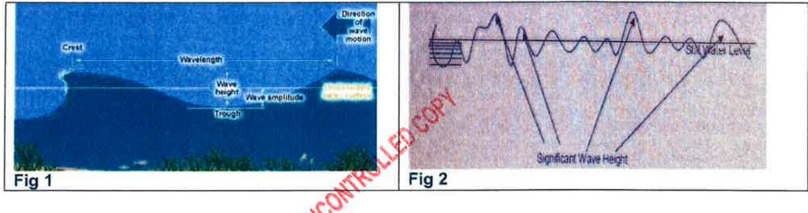

Predictions are generally given for significant and maximum wave heights by meteorological departments. The sea state is a mix of ever changing troughs and crests and in general there is no symmetry and repetition of their pattern. If these were plotted for some duration, a random wave pattern may emerge as reflected in above picture (Fig 2).

The smaller waves are ignored and more concentration is given to larger ones. These larger waves make up to approximately one third of all waves. The other two third waves are ignored as they are too small to create an impact.

Significant wave height: Average height of one third of the waves over a 20 minute period.

Maximum wave height: Height of the highest wave in a 20 minute period.

{450}------------------------------------------------

| Issue Status  | 2nd Edition, Rev 0 |
| ------------- | ------------------ |
| Issue Date    | 1st July 2014      |
| Issued by     | DPA                |
| Authorised By | Director PES       |

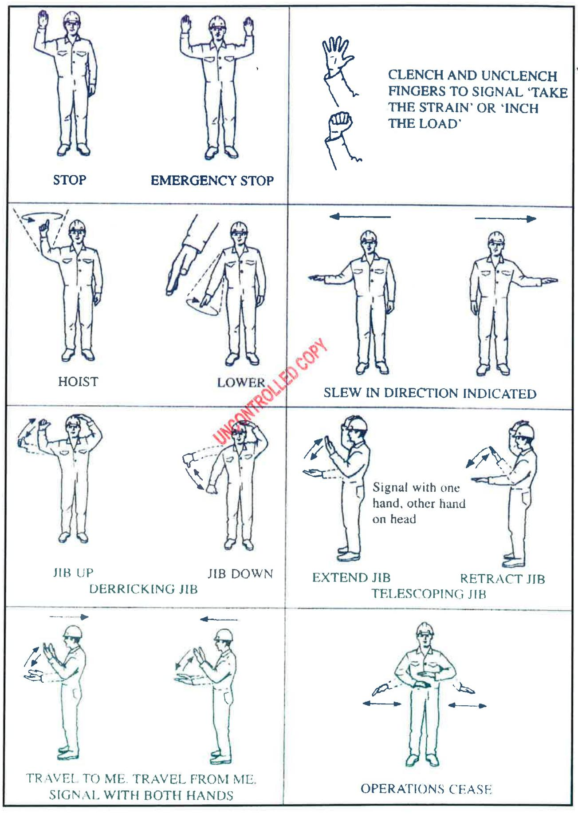

{451}------------------------------------------------

| Issue Status  | 2nd Edition, Rev 0 |
| ------------- | ------------------ |
| Issue Date    | 1st July 2014      |
| Issued by     | DPA                |
| Authorised By | Director PFS       |

# NWEA GUIDELINES FOR THE SAFE MANAGEMENT OF OFFSHORE SUPPLY & RIG MOVE OPERATIONS

ﺎ

| Hose Application | Coupling Colour | Connection                                                  |                           |
| ------------------- | ------------------ | ----------------------------------------------------------- | ------------------------- |
| Dry Cement          | Yellow             | 5" hammer lug union                                         | Image: Yellow coupling    |
| Dry Barytes         | Orange             | 5" hammer lug union                                         | Image: Orange coupling    |
| Potable Water       | Blue               | 4" hammer lug or quick release self- sealing coupling | Image: Blue coupling      |
| Diesel / Fuel       | Brown              | 4" quick release self- sealing coupling                  | Image: Brown coupling     |
| Base Oil            | White              | 4" quick release self- sealing coupling                  | Image: White coupling     |
| Drill Water         | Green              | 4" hammer lug or quick release self- sealing coupling | Image: Green coupling     |
| Oil Based Mud | Black              | 4" hammer lug or quick release self- sealing coupling | Image: Black coupling     |
| Brine               | Red                | 4" hammer lug or quick release self- sealing coupling | Image: Red coupling       |
| Glycol              | Purple             | 4" hammer lug or quick release self- sealing coupling | Image: Purple coupling    |
| Scale Inhibitor     | No colour          | 4" quick release self- sealing coupling                  | Image: No colour coupling |

{452}------------------------------------------------

| Vessel Name | Date      |
| ----------- | --------- |
| Location    | Time      |
| Start Time  | Stop Time |

| Type of Cargo           | Quantity |
| ----------------------- | -------- |
| Fuel Oil (Litres/MT)    |          |
| Fresh Water (Litres/MT) |          |
| Other Bulk Cargo:       |          |
| 1.                      |          |
| 2.                      |          |
| 3.                      |          |
| 4.                      |          |
| 5.                      |          |
| Remarks (If any):       |          |

| Master Name: |     |
| ------------ | --- |
| Signature:   |     |
| Ship Stamp:  |     |

| In charge of other Vessel/Rig/Barge/Craft: |     |
| ------------------------------------------ | --- |
| Signature:                                 |     |
| Stamp:                                     |     |

Note: For Fuel Oil transfer/debunkering to other party; a copy of receipt shall be kept with Oil Record Book and entries to be made as per IMO guideline.

{453}------------------------------------------------

| Issue Status  | 2nd Edition, Rev 0 |
| ------------- | ------------------ |
| Issue Date    | 1st July 2014      |
| Issued by     | DPA                |
| Authorised By | Director PFS       |

# CONTENTS

#### 1. GENERAL

#### 2. ENGINE ROOM WATCHKEEPING

- 2.1. Standing Orders
- 2.2. Night Orders
- 2.3. Handing Over and Engine Room Watch
- 2.4. Calling the Chief Engineer
- 2.5. Special Operations
- 2.6. Bilge Alarms
- 2.7. Machinery Alarms

#### 3. CRITICAL OPERATIONS

- 3.1. General
- 3.2. Critical Operation Procedures

#### 4. PLANNED MAINTENANCE

5. DEFECT REPORTS

#### 6. SURVEYS OF HULL & MACHINERY ITEMS

- 6.1.
- 6.2.

#### BUNKERING 7.

- 7.1.
- Olassification Listings
  Surveys
  Bunker Specifications UNCONTROLLED COPY
  Bunker Requisition Fores 7.2.
- 7.3. Sampling Procedure
- 7.4. Preparation
- 7.5. Ship/Shore Liaison
- 7.6. Prior to Bunker Fuel Transfer
- 7.7. During Bunker Fuel Transfer
- 7.8. On Completion of Bunker Fuel Transfer
- 7.9. Ship to Ship Transfer

#### 8. FUEL OIL TRANSFER ONBOARD

#### 9. OIL RECORD BOOK (Part 1)

- 9.1. Responsibility
- 9.2. Completion
- 10. MARINE FUEL SULPHUR RECORD BOOK
  - 10.1. Responsibility
  - 10.2. Purpose of the Document
  - 10.3. Letter of Protest (LOP)
- 11. NOTE OF PROTEST FOR BUNKER DISPUTES
- LUB OIL AND HYD OIL QUALITY MONITORING 12.

{454}------------------------------------------------

# Appendices

- A Bunker Checklist
- A1 Bunkering Plan
- Engineroom Pre-Sailing Checklist B
- C Engineroom - Pre-Arrival Checklist
- D Emission Control Area (ECA)
- E Note of Protest - Bunker Quality
- F Note of Protest - Short Delivery of Bunker
- G Engine Room Handover Watch Checklist
- H Engine Dept – Standard Filing List
- -Machinery Insulation test report
- ר Machinery Lub Oil Change Status
- K Main Engine Operating Data Reporting Form
- ட Engine room filters and Oil change
- Shore Based Lub Oil Testing Schedule M

{455}------------------------------------------------

#### 1. GENERAL

- 1.1. The Chief Engineer is responsible for this procedure,
- 1.2. The Chief Engineer is responsible for the daily maintenance and work of the engine room ratings and for maintaining an Engine Room Watch.
  - 1.3. Watchkeeping Engineers are responsible for maintaining an Engine Room Watch.
  - 1.4. The objective of this procedure is to promote the efficient running of all machinery and to avoid any pollution.
  - 1.5. Though the vessels may be fitted with UMS system, it is company policy to always operate with manned engine rooms.

#### 2. ENGINE ROOM WATCHKEEPING

#### 2.1. Standing Orders

- 2.1.1. The Chief Engineer should write 'Standing Orders' on the keeping of a safe Engine Room Watch. These orders shall be signed by the Chief Engineer and posted in the Control Room.
- 2.1.2. The Standing Orders should be read by all Engineers upon joining the vessel and signed accordingly. These orders shall be followed by all Engineers.

#### 2.2. Night Orders

- 2.2.1. The Chief Engineer should maintain a 'Night Order Book'. If there are any special instructions or items of particular importance while Chief Engineer is absent from the engine room, he shall write 'Night Orders' and include these items. The Night Orders must be signed by the Chief Engineer. Alles
- 2.2.2. All watchkeepers should read and sign these night orders prior to taking over a watch.

# 2.3. Handing Over and Engine Room Watch

- 2.3.1. The outgoing Engineer should complete the Engine Room Log prior to the completion of the watch. All machinery must be visually inspected.
- 2.3.2. The incoming Engineer should allow time to make a tour of the Steering Flat, Engine Room space and Bow Thruster Flat prior to the handover.
- 2.3.3. Any items of concern should be discussed with the outgoing Engineer,
- 2.3.4. The outgoing Engineer should appraise the incoming Engineer on all machinery,
- 2.3.5. The incoming Engineer should read and sign any Chief Engineer's 'Night Orders'.
- 2.3.6. Only when both Engineers are satisfied should the watch be handed over.
- 2.3.7. The outgoing Engineer should sign the Engine Room Log as evidence that the handover has taken place.

{456}------------------------------------------------

#### 2.4. Calling the Chief Engineer

- 2.4.1. The Chief Engineer must be called if any of the follow occur :
  - a. Breakdown of machinery
  - b. Potential breakdown of machinery
  - C. Unusual pressures and temperatures
  - ರ. One hour prior to arrival or sailing from port, as notified from the bridge.
  - If the bridge personnel put the main engine on stand-by for whatever reason e.g. Poor e. visibility.
  - f. If in any doubt

#### 2.5. Special Operations

- 2.5.1. The Chief Engineer shall be in the engine room and monitoring the situation for the following operations :-.
  - a. Entering or sailing from port / 500 metre zones.
  - b. Any stand-by condition.
  - If called by the Engineer on watch. C.

#### 2.6. Bilge Alarms

- 2.6.1 Bilge levels should be checked as part of the watch routine.
- 2.6.2 Bilge level alarms should be tested weekly and entered in the Engine Log Book.

#### Machinery Alarms 2.7.

- 2.7.1. It is important that all machinery alarms are operational and their activation settings compared with manual gauges (if possible).
- 2.7.2. To achieve this, the Chief Engineer should list all alarms and their settings and set up a sixmonthly cycle of monitoring.
- 2.7.3. When an alarm activates, the Engineer should indicate on the list that the alarm has activated and show any manual reading obtained.
- 2.7.4. If the same alarm activates again, it is not necessary to update the list.
- 2.7.5. If the vessel has UMS notation, alarms shall be tested periodically.
- 2.7.6. After the six month period, the procedure should re-commence and a new list made.
- 2.7.7. The dead man alarm shall be tested periodically as per PMS.

# 2.8. Safety, Fire & Security Patrol

- 2.8.1. Chief Engineer and Second Engineer to take round of the entire Engine Room at least once every day.
- 2.8.2. Engine Room Watch-keepers to carry out safety, fire and security patrol of the entire engine room once every watch with special attention to areas not visited frequently.

{457}------------------------------------------------

2.8.3 Fire, Safety and Security patrol to be recorded in the Engine Log Book.

#### 3 CRITICAL OPERATIONS

#### 3.1. General

- 3.1.1 Certain engine room operations, if not carried out correctly, could lead to the safety of the vessel or the protection of the environment being threatened.
- 3.1.2. These operations are :
  - a. Preparing the main engine, steering gear and all associated machinery for departure or arrival.
  - b. Disposal of engine room bilges.
  - C Starting of boilers.
  - d. Reinstating power after a 'blackout'.
  - e Bunkering and fuel transfer.
  - f. Bulk loading and discharge (e.g. cement, bayrites, gel, drill water, mud, glycol, saline, etc.).
- 3.1.3 Chief Engineer shall maintain written procedures for restarting of critical equipment and it should be readily available, These procedures shall be ship specific and all engineers shall be well trained in its use.

#### 3.2. Critical Operation Procedures

- 3.2.1 The Chief Engineer shall maintain a 'Critical Operations Procedure' File in the engine room,
- 3.2.2. The Chief Engineer should write simple 'step' guidelines on the procedure to be followed to safely undertake the above operations. Each procedure should be dated.
- 3.2.3. If at any time the Chief Engineer wishes to change one of the above procedures he shall re-write the procedure with a new date - insert it into the file and destroy the old copy.
- 3.2.4. All Engineers should refer to the file to ensure correct procedures are followed. If they are in any doubt about any procedure, they should contact the Chief Engineer.

#### PLANNED MAINTENANCE 4.

- 4.1.1. The Chief Engineer is responsible to the Master for the execution of the machinery maintenance programme and for ensuring such work carried out onboard is completed satisfactorily and reports are sent, via the Master, to the Technical Superintendent involved.
- 4.1.2. The vessel should be maintained to a standard that ensures compliance with applicable rules and regulations. See IMS 12 - Planned Maintenance System.

#### DEFECT REPORTS 5

- 5.1. -Defects regarding equipment on board the vessel should be communicated directly to the Technical Superintendent for decisions to be made as to how the repairs are to be carried out.
- 5.2. A summary of outstanding defects is to be sent to the HSEQA Department every month as part of the ship's HSE Meeting Minutes.

{458}------------------------------------------------

#### 6. SURVEYS OF HULL & MACHINERY ITEMS

#### 6.1. Classification Listings.

- 6.1.1. Every vessel is provided with a Listing of Survey-able Ship and Machinery items in accordance to the requirement of the Classification Society which indicates :
  - a. Status of all surveys
  - b. Surveys credited since previous list
  - Items due for survey within the next 12 months C.
  - て Items overdue
  - e. Recommendations and Memo, if any
- 6.1.2. When under a continuous cycle each item is surveyed once very five years and the derived schedule shall interface and form a part of the vessel's maintenance programme.
- 6.1.3. In order for the vessel to remain in Class it must be ensured by the Master and the Chief Engineer that these lists are properly scrutinised and all items are credited by the surveyor to the Class within the specified date.

#### 6.2. Surveys.

- 6.2.1. Before arranging for an item of equipment to be surveyed, proper functioning of the equipment must be verified and if any spares are required they must be ordered well before hand. The vessel staff should be fully satisfied and conduct all necessary checks appropriate to the item being surveyed prior to the survey. The Chief Engineer and the Master must liaise with the Technical Department for requesting a Surveyor's attendance.
- 6.2.2. Classification Society Survey Reports are maintained by the Classification Society and are available on their Internet Website. If necessary, the Superintendent responsible for the maintenance of the vessel can download the Reports and send them to the vessel, in which case they must be kept on board in accordance with the requirements of the Records section of this manual.

#### 7. BUNKERING

For more information on bunkering, please refer to 'Singapore Standard SS600 : 2008 -Code of Practice for Bunkering.

#### 7.1. Bunker Specifications

7.1.1 Bunker supplier shall, unless otherwise agreed by the buyer, supply bunker(s) of a quality which conform to or are better than the standards set by the International Organisation for Standardisation (ISO) for "Petroleum products - Fuels (Class F) - Specifications of Marine Fuel" (ISO 8217). For any contracted grade of bunker(s) which is not specified by the ISO 8217 standards, the bunker supplier and the buyer shall have prior written agreement with respect to the bunker specifications. The bunker supplier shall warrant that the bunker(s) is/are homogenous and stable.

{459}------------------------------------------------

#### 72. Bunker Requisition Form

- 7.2.1. This pre-delivery document is to be completed and signed by the Chief Engineer and the Cargo 1 Officer. The bunker requisition form is not intended to vary the terms of any pre-existing contract between the buyer and the bunker supplier.
- 7.2.2. If more than one grade of bunker(s) is to be supplied, the Cargo Officer shall indicate on the form the order in which grades are to be supplied. To avoid contamination of product, it is recommended that the lighter grade should be supplied first followed by the heavier grade, unless otherwise requested by the Chief Engineer in writing.
- 7.2.3. The cargo officer shall confirm with the Chief Engineer the requirements of the vessel including;
  - a) Quantity
  - b) Grade of Bunker(s)
  - C) Pumping rate
  - d) Max permissible purging pressure
- 7.2.4. All items in this form shall be completed and signed by the Cargo Officer and the Chief Engineering with their names clearly printed. This form shall be endorsed with the bunker tanker's stamp and the vessel's stamp.
- 7.2.5. Any cancellation or amendment on this form shall be signed by the Cargo Officer and the Chief Engineer.
- 7.2.6 At least two copies of this form are to be completed and signed. The original shall be retained by the bunker tanker and the duplicate shall be given to the Chief Engineer.

#### 7.3. Sampling Procedure

- 7.3.1 This sampling procedure is applicable to HFO and MGO (as applicable) bunkering operations,
- 7.3.2 The custody transfer sample shall be taken at the manifold of the vessel. The following is the procedure for bunker sampling. The sample collected in this manner shall constitute the representative sample of the bunker operation.
  - a) the sampling requirements.
  - ﮯ The Cargo Officer shall ensure that the sampling container is clean before fixing it to the end of the sampling probe.
  - c) out in the testing kit, the sampling container shall be security-sealed by the Cargo Officer in the presence of the Chief Engineer. The seal shall provide security against tampering and contamination during the entire process of bunkering. The seal number shall be recorded by the parties involved in the tank measurement/calculation form.
  - d) The Cargo Officer shall invite the Chief Engineer to witness the setting of the needle valve on the sampling probe to ensure that a continuous drip sample is collected throughout the entire duration of bunkering. The needle valve on the sampling probe should then be sealed in the presence of the Chief Engineer at the commencement of bunkering and the seal number recorded in the tank measurement/calculation form,

1 Cargo Officer - refers to the Representative from the Bunker Barge/Supplier.

{460}------------------------------------------------

Sampling shall start simultaneously with the commencement of the bunkering operation. When any adjustment of the needle valve is required, the Cargo Officer shall inform the Chief Engineer to witness the adjustment and record the change of seal number.

Issue Status

Authorised By

2nd Edition, Rev 0

18 July 2014

Director PFS

DPA

- e) Upon completion of bunkering, the Chief Engineer shall be invited to confirm that the security seals of the sampling container and the needle valve are not tampered with.
- f) After both parties are satisfied with the sample collected in the sampling container, the sample shall be properly shaken or stirred to promote homogeneity.
- g) The homogeneous sample is then poured in equal small portions into at least four sample containers, making three or four passes to fill each container in turn. The minimum quantity of the identical samples shall be not less than 600ml per container. For bunker samples to have repeated test, a minimum quantity of 750ml is required.
- h) The samples shall be distributed as follows :-
  - Two samples for the vessel; (1)
  - (2) One sample retained by the bunker tanker;
  - (3) One sample for the bunker surveyor, if engaged.
- i) If there is no bunker surveyor in attendance, the fourth sample shall be retained by the bunker tanker. If additional samples are taken during the bunkering, its distribution shall also be recorded.
- i) The sample container shall be sealed in the presence of the Chief Engineer with uniquely numbered security seals. The seal numbers of all samples taken during this bunkering shall be recorded in the respective sample labels and bunker delivery note (BDN). Counter seals, if used, shall also be recorded in the sample labels and bunker delivery note.
- k) On completion of the bunkering and sampling operations, secure sample labels shall be completed and pasted on the respective sample containers in the presence of the Chief Engineer. The Chief Engineer shall then sign the sample labels. No sample shall be presented to the Chief Engineer for signature prior to the completion of the bunkering and sampling operations.
- I) from the date of sampling or such extended period may be agreed between the parties.
- m) The details of the sampling shall be entered into the Marine Fuel Sulphur Record Book as follows:
  - (1) analysis report to the bunker operation.
  - (2) Sample Records (to be retained on board for 12 months): This notes the compliance of the BDN and the Annex VI Statutory representative sample. It also logs details of any Letter of Protest (LOP) issued and the disposal dates of the Annex VI sample and the BDN.
  - (3) Log 3 Fuel change over log for ships entering and leaving an ECA. (Refer to Appendix D on ECA zones.

{461}------------------------------------------------

| Issue Status  | 2nd Edition, Rev 0 |
| ------------- | ------------------ |
| Issue Date    | 1st July 2014      |
| Issued by     | DPA                |
| Authorised By | Director PFS       |

- If required, samples must be sent to the testing laboratory via the agent immediately to n) avoid delays in analysis.
- On completion of sampling, ensure all the sampling equipment is properly cleaned and o) properly re-stowed.
- p) Ensure there is adequate stock of new sampling bottles and requisition in good time when the stock is low.

#### 7.4. Preparation

- 7.4.1, Due to the hazardous nature of this operation, it should be well planned and coordinated between the Deck and Engine Departments.
- 7.4.2. The Chief Engineer is in-charge of this procedure and must make sure everyone involved is aware of the procedure. The Bunkering plan and checklist (Appendix A, A1) of this sectionis to be used throughout the planning and carrying out of the bunkering operation.
- 7.4.3. The following steps are to be made :-
  - Bunkering Plan made of which tanks to accept bunkers a
  - Enough ullage space must be available, allowing for a 'safe margin' غ
  - Persons must be allocated responsibilities with regard to the operation c.
  - Bunker hoses and connections must be thoroughly checked prior to use て
  - The Chief Officer and Master informed e.
  - Communications system are setup between the bunker tanker and the vessel and must f. be maintained throughout the bunkering operation
  - Drip trays emptied ರ
  - Pollution mop-up equipment on-hand h.
  - i. Tanks are ready in all respects
  - Valves correctly set including checking all other tank valves are shut i.
  - k. Bunkering Plan and Checklist on-hand

#### 7.5. Ship/Shore Liaison

- 7.5.1 Discuss and agree with the shore/bunker representative on the following .
  - a.. Quantity and grade to load
  - c Fuel Quality requirement
  - Normal pumping rate during loading and pumping rate for 'topping off' C.
  - ರ. Maximum air pressure to be used for 'purging'
  - e. Communication system
  - f. Emergency stop procedure
  - g. Procedure for connecting and disconnecting the hose to avoid spillage
  - ﻏ Both parties to sign the 'Bunkering Checklist'

#### 7.6. Prior to Bunker Fuel Transfer

- 7.6.1. It shall be the Chief Engineer's responsibility to prepare the vessel for receiving bunkers. including removing the blank flange(s) from the vessel's bunker manifold(s).
- 7.6.2. Once the pre-delivery requirements have been completed and bunker hoses(s) have been properly connected, bunkering operations shall commence after confirmation by the Chief Engineer.

{462}------------------------------------------------

- 7.6.3. The Chief Engineer shall have a crew member from the vessel to assist in overseeing the bunkering operation.
- 7.6.4. The Cargo Officer may also appoint a 'crew member from the bunker barge to assist in overseeing the sampling process on the vessel jointly with the Chief Engineer at all times during the entire bunkering operation.
- 7.6.5. Communications between the bunker barge and the vessel shall be maintained throughout the entire bunkering operation.
- 7.6.6. The Chief Engineer to check the following prior to transfer :-
  - Ensure the 'B' flag is flown (in daylight) and red all round masthead light is switched on a. (in darkness/restricted visibility).
  - Valves set correctly b.
  - C. Hose(s) in good condition
  - Hose(s) connected correctly d.
  - e. Personnel in attendance at the manifold and bunker tank sounding point
  - f. Communications are tested
  - ర్తా
    రా Method of sampling to be executed using the method as prescribed
  - Flow meter readings to be verified together with Cargo Officer. ﮯ
  - Ensure sounding tapes are in good condition and showing correct readings (no damage i. sections chopped off the tape).

# 7.7. During Bunker Fuel Transfer

- 7.7.1. The Cargo Officer shall ensure that the agreed pumping rate is adhered to by the bunker barge.
- 7.7.2. The agreed pumping rate should not be exceeded unless requested by the Chief Engineer and duly endorsed by him.
- 7.7.3. When an order to stop pumping is given by the vessel, the bunker barge shall stop the pumping immediately.
- 7.7.4. All stoppages and reasons for doing so shall be recorded in the bunker barge log and the vessel's log.
- 7.7.5. Purging of the bunker hose(s) shall only be carried out at the end of the pumping operation.
- 7.7.6. After pumping operations have been completed, the bunkers contained in the bunker hose(s) shall be purged into the vessel's tank. The procedure for purging the bunker hose(s) is as follows :
  - a. The Cargo Officer shall notify the Chief Engineer and bunker surveyor (if engaged) prior to the commencement of the purging operation.
  - b. The Chief Engineer shall stipulate the maximum permissible pressure to be used for the purging operation and the Cargo Officer shall ensure the stipulated pressure is not exceeded.
  - c. The Cargo Officer shall close the discharge valve after the pump and build up the pressure in the line using the bunker barge pump.
  - d. Once the pressure is built up, the Cargo Officer will open the discharge valve for the remaining bunkers in the bunker hose(s) to be purged into the vessel's tank.

{463}------------------------------------------------

- The purging process shall not be repeated more than twice after the completion of the e. pumping operation.
- ﯿﻨﮯ Once the purging process is completed, the residue in the hose(s) shall be drained back into the bunker barge before final gauging is taken. No re-pumping of bunkers shall be allowed and post delivery checks and documentation shall commence.
  - During the entire bunkering process, no other barge shall be allowed to come
    alongside the bunker barge delivering bunkers to the vessel, unless two different products are to be delivered to the vessel simultaneously.
- 7.7.7. The Chief Engineer shall ensure the following:-
  - Soundings are monitored / air escaping from vent heads during bunkering a.
  - c Rate is slowed for 'topping off'
  - Bunkers do not leak to closed tanks C.
  - Manifold is continuously monitored て
  - Supplier is given adequate notice of stopping e.

# 7.8. On Completion of Bunker Fuel Transfer

- 7.8.1. The following items to be checked by the Chief Engineer .-
  - Fuel hoses and lines are properly drained (see 7.7.6 above) a.
  - c All valves are closed
  - Hose is disconnected without causing pollution ﻦ
  - Quantity received on-board agrees with supplier d.
  - Supplier and the Company informed of shortages which should be remarked on the e. Bunker Delivery Note (BDN)
  - f A sample is received from the supplier (see 7.3 above)

#### 7.9. Ship to Ship Transfer

7.9.1 In addition to the above the Master is responsible for :-

- a. Ensuring the vessels are securely moored and fendered throughout the operation
- ف The port authorities have given permission and are kept informed
- The weather and sea state is acceptable for the operation C.
- Weather forecasts are received and favourable て
- A good anchor watch is maintained to monitor the vessels position and passing traffic. e.

#### 8. FUEL OIL TRANSFER ONBOARD

- 8.1. Fuel Oil Transfer for Trimming, Up-righting or Shifting
- 8.1.1. The Master, Chief Officer and Duty Officer must be advised of the intention to transfer fuel.
- 8.1.2. No fuel may be transferred without the consent of the Chief Engineer.
- 8.1.3. Before commencing the transfer of fuel oil internally onboard, the Duty Engineer must ensure that:-
  - Air vents of tanks to be worked are open. a.

{464}------------------------------------------------

- b. Scuppers on main deck are effectively plugged
- All valves not in use are lashed C.
- ರ Sounding caps are in place when not in use
- The line to the overflow tank is open e.
- f. The OOW is advise of the intention to transfer
- 8.1.4. During the transfer of fuel, the Engineer-in-Charge must closely monitor all stages of the operation and ensure that the rate of pumping is reduced whilst 'topping up'.
- 8.1.5. Any transfers of fuel oil are to be recorded in the Engine Rom Logbook by the Engineer in Charge

#### 0 OIL RECORD BOOK (Part 1)

#### 9.1. Responsibility

9.1.1 The Chief Engineer is responsible for the completion of the Oil Record Book (Part 1),

#### 9.2. Completion

9.2.1. Detailed instructions are to be found on the inside of the Book. The Oil Record Book (Part 1) must be completed in strict accordance with the instructions. The Oil Record Book (Part 1) should be retained on board by the Chief Engineer for a period of at least 3 years after the last entry was made.

# 10. MARINE FUEL SULPHUR RECORD BO

#### 10.1. Responsibility

10.1.1. The Chief Engineer is responsible for the completion of the Marine Fuel Sulphur Record Book. See Section 7.3 of this procedure on the Sampling requirements

# 10.2. Purpose of the Document

10.2.1 This MARPOL 73/78 Annex VI Reg. 14 & 18 record book allows ship to demonstrate easily their and the supplier's level of compliance with this regulation and at the same time maintain a system to track the statutory sample custody transfer, BDN and any notes of protest issued.

#### 10.3. Letter of Protest (LOP)

10.3.1. In the event that either the BDN or the statutory sample, or both, have been found to be noncompliant, an LOP should be issued in accordance with the ship's standing instructions. Refer to Marine Fuel Sulphur Record book for sample.

# 11. NOTE OF PROTEST FOR BUNKER DISPUTES

- 11.1. In event that either the Bunker Delivery Note (BDN) or the statutory sample, or both, have been found to be non-compliant, a Note of Protest should be issued.
- 11.2. The Master or Chief Engineer will need to raise a note of protest when the following cases of dispute arise:
  - a. No proper sample has been taken

{465}------------------------------------------------

| Issue Status  | 2nd Edition, Rev 0 |
| ------------- | ------------------ |
| Issue Date    | 1st July 2014      |
| Issued by     | DPA                |
| Authorised By | Director PFS       |

- No information as required by MARPOL Annex VI on the bunker delivery note; b.
- Quantity difference is significant and cannot be reconciled (short delivery of bunker); ﻥ ﻧ
- Material Safety Data Sheet (MSDS) not provided by the Bunker Supplier (MSC 86 ರ್... Resolution - Revised Recommendation for Material Safety Data Sheets (MSDS) for MARPOL Annex | Type Oil as Cargo in Bulk & Marine Fuel Oil);
- e. Non-compliance with other environmental legislation
- 11.3. Where non-compliance has been identified, the ship is required to inform the office immediately and to issue a Note of Protest to the Bunker Supplier. A copy of the Note of Protest is to be retained onboard and a copy sent to the Technical Superintendent. Any supporting documentation should be attached to the Note of Protest.
- 11.4. If the bunker dispute involves a bunker supplier in Singapore Shipping Association and Maritime and Port Authority of Singapore (MPA) must be informed by the Head Office.

# 12.0 Lubricating Oil and Hydraulic Oil Quality Monitoring

12.1 As part of preventive maintenance program to achieve operational efficiency and optimal machinery performance, following lubricating oil quality monitoring system has been put in place:

# 12.1.1 Shipboard LO and HO Testing

Four different tests can be carried out using shipboard water in oil testing kit, namely Salt Water, Water in Oil, TBN and Viscosity.

The test kit reagent should last for 6 months; top up reagent requisition shall be raised 3 months in advance, so they can be supplied in time. Schedule and recording of results shall be carried out as per "Shipboard LO/HO Test Results" and submitted to office on monthly basis. Technical department will provide all vessels with excel sheet for recording and monitoring of LO/HO test results.

Any test result more than 0.25% above the limits shall be brought to Head Office attention immediately.

# 12.1.2 Shore based LO and HO Testing

Lubricating oil samples to be taken and landed to designated oil testing lab for shore analysis as per "Shore based LO testing Schedule" provided in the appendix.

All samples are to be packed as per sampling instruction and send to head office compete with landing form.

HO will review the LO test analysis report of the lab and advisory will be sent to vessel if any corrective actions are required. Vessel shall keep a copy of shore lab LO analysis report.

{466}------------------------------------------------

{467}------------------------------------------------

# IMS 17 – APPENDIX A BUNKERING CHECKLIST

| Issue Status  | 2 nd Edition, Rev 0 |
| ------------- | ------------------------------ |
| Issue Date    | 1 st July 2014      |
| Issued by     | DPA                            |
| Authorised By | Director PFS                   |

| NOTE: ENSURE ALL BUNKERING OPERATIONS ARE CARRIED OUT IN COMPLIANCE WITH MARPOL 73/78 ANNEX VI REGULATION 14 AND 18 AND ANNEX 2 RESOLUTION MEPC. 96 (47) |     |                              |     |                     |                    |
| ----------------------------------------------------------------------------------------------------------------------------------------------------------- | --- | ---------------------------- | --- | ------------------- | ------------------ |
| Vessel Name:                                                                                                                                                |     | Bunker Vessel/Facility Name: |     | Date/Time alongside | Date/Time Cast off |

| No                                              | Remarks                                                                                                                                                                                                    | Y/N          |
| ----------------------------------------------- | ---------------------------------------------------------------------------------------------------------------------------------------------------------------------------------------------------------- | ------------ |
| 1                                               | Ensure the 'B' flag is flown (in daylight) and red all round masthead light is switched on (in darkness/restricted visibility).                                                                            |              |
| 2                                               | Has MSDS sheet for Fuel Oil been provided to vessel, if not contact operations dept                                                                                                                        |              |
| 3                                               | Have effective communications been established between the vessel/Bridge/Engine room and the bunker vessel / facility and can all personnel involved understand each other?                                |              |
| 4                                               | Are the vessel and the bunker barge / facility aware of the time required to shut off the supply of bunkers?                                                                                               |              |
| 5                                               | Has the amount of Bunkers required and to be delivered been agreed between the vessel and the bunker vessel / facility?                                                                                    |              |
| 6                                               | Can the amount of bunkers required fit into the space available with no more than 95% full and has a bunkering plan been made of which tanks are to be filled?                                             |              |
| 7                                               | Has the equipment for taking soundings been checked, soundings before filling taken on the tanks to be filled and arrangements made for tanks to be sounded during filling?                                |              |
| 8                                               | Are all the pipelines, valves and connections between the bunker vessel / facility and the vessel in good condition, properly connected and opened?                                                        |              |
| 9                                               | Have all other pipelines, valves and connections on the vessel's bunkering system been closed and secured?                                                                                                 |              |
| 10                                              | Has the maximum permissible pumping rate to the vessel been agreed with the bunker vessel / facility?                                                                                                      |              |
| 11                                              | Has the "topping off" pumping rate to the vessel been agreed with the bunker vessel / facility?                                                                                                            |              |
| 12                                              | Can the vessel close its bunker system valves against the bunker vessel / facility pumps in the event of an emergency?                                                                                     |              |
| 13                                              | Has the person in charge of bunkering on own vessel been nominated and made aware of all procedures, including normal and emergency shutdown procedures?                                                   |              |
| 14                                              | Has the person in charge of bunkering on the bunker vessel / facility been nominated and made aware of all procedures, including normal and emergency shut down procedures?                                |              |
| 15                                              | Have all other vessel personnel involved in the bunkering operation been nominated and made aware of all procedures, including normal and emergency shut down procedures?                                  |              |
| 16                                              | Have all other bunker vessel / facility personnel involved in the bunkering operation been nominated and made aware of all activities and procedures, including normal and emergency shut down procedures? |              |
| 17                                              | Have the Master and Chief Officer been informed?                                                                                                                                                           |              |
| 18                                              | Are the scuppers plugged and save-ails properly drained of water and in place at bunker station and tank vents?                                                                                            |              |
| 19                                              | Is there adequate Oil Pollution Clean Up equipment on hand ready for immediate use?                                                                                                                        |              |
| 20                                              | Has an acceptable specification been received for the bunker fuel to be provided? (E.g. correct grade, viscosity, specific gravity etc.)                                                                   |              |
| 21                                              | Have arrangements been made to collect samples of the bunker fuel during bunkering operations?                                                                                                             |              |
| 22                                              | If the hoses are to be "blown through" on completion of bunkering, has the maximum air pressure to be used been agreed between the vessel and the bunker vessel / facility?                                |              |
| 23                                              | Upon completion of bunkering, has agreement been reached on quantity of bunkers supplied and all paperwork been completed?                                                                                 |              |
| 24                                              | Upon completion of bunkering, have all valves been closed, bunkering pipelines disconnected and any minor spillages cleaned up?                                                                            |              |
| 25                                              | Adhere to " Code of Practice for Bunkering" Singapore Standard SS600:2008                                                                                                                                  |              |
| Chief Engineer/Name/Sign                        |                                                                                                                                                                                                            | Vessel Stamp |
|                                                 |                                                                                                                                                                                                            |              |
| Bunker Vessel or Facility In charge/Name & Sign |                                                                                                                                                                                                            |              |

{468}------------------------------------------------

| Issue Status  | 2nd Edition, Rev 0 |
| ------------- | ------------------ |
| Issue Date    | 1st July 2014      |
| Issued by     | DPA                |
| Authorised By | Director PFS       |

# BUNKERING PLAN

| Vessel:   |     |
| --------- | --- |
| Location: |     |
| Date:     |     |

| Grade | Flashpoint | Temp | S.G. | Weight | Volume |
| ----- | ---------- | ---- | ---- | ------ | ------ |
|       |            |      |      |        |        |
|       |            |      |      |        |        |

# BUNKER TANKS

|      | CAUTION MAX. FILL. LEVEL |        | STARTING      |        | FINISHING     |        |        |
| ---- | --------------------------- | ------ | ------------- | ------ | ------------- | ------ | ------ |
| TANK | ULLAGE SDG               | VOLUME | ULLAGE SDG | VOLUME | ULLAGE SDG | VOLUME | % FULL |
|      |                             |        |               |        |               |        |        |
|      |                             |        |               |        |               |        |        |
|      |                             |        |               |        |               |        |        |
|      |                             |        |               |        |               |        |        |
|      |                             |        |               |        |               |        |        |
|      |                             |        |               |        |               |        |        |

**LOADING SEQUENCE (TANKS IN ORDER OF LOADING)**

| TANKS:   | /   | /   | /   |
| -------- | --- | --- | --- |
| -------- | --- | --- | --- |

| LOADING RATES Start: |     |
| -------------------- | --- |
| Maximum:             |     |
| Topping Off:         |     |

# CREW INVOLVED IN BUNKER OPERATIONS

| Responsibilities    | Rank           | Name | Communication Method |
| ------------------- | -------------- | ---- | -------------------- |
| In Charge           | Chief Engineer |      |                      |
| Assistant In Charge |                |      |                      |
| Duty Deck Officer   |                |      |                      |
| Rating              |                |      |                      |

Supplier's Representative:

Communication Method Vessel / Terminal:

Emergency Stop Procedure: \_\_\_\_\_\_\_\_\_\_\_\_\_\_\_\_\_\_\_\_\_\_\_\_\_\_\_\_\_\_\_\_\_\_\_\_\_\_\_\_\_\_\_\_\_\_\_\_\_\_\_\_\_\_\_\_\_\_\_\_\_\_\_\_\_\_\_\_\_\_\_\_\_\_\_\_\_\_\_\_\_\_\_\_\_\_\_\_\_\_\_\_\_\_\_\_\_\_\_\_\_\_\_\_\_\_\_\_\_\_\_\_\_\_\_\_\_\_\_\_\_\_\_\_\_\_\_\_\_\_\_\_\_\_\_\_\_\_\_\_\_\_\_\_\_\_\_\_

Port Emergency Contact Telephone Numbers:

# REMARKS:

Chief Engineer (Name/Signature/Date)

{469}------------------------------------------------

| Issue Status  | 2nd Edition, Rev 0 |
| ------------- | ------------------ |
| Issue Date    | 1st July 2014      |
| Issued by     | DPA                |
| Authorised By | Director PFS       |

| VESSEL:                  |                                                                                        | DATE:       |     |
| ------------------------ | -------------------------------------------------------------------------------------- | ----------- | --- |
| PORT:                    |                                                                                        | CHECKED BY: |     |
| Check (√) as appropriate |                                                                                        |             |     |
| 1                        | Is all machinery seaworthy in all respects?                                            |             |     |
| 2                        | Are Bunkers, Lubs., Water, Stores, Tools and Spare Gear adequate for the voyage / job? |             |     |
| 3                        | Are Sea Watches to commence at least 2 hours before departure?                         |             |     |
| 4                        | Are all Settling and Service Tanks topped up?                                          |             |     |
| 5                        | Has Bunker Service Tank been heated up?                                                |             |     |
| 6                        | Have all Air Receivers been charged to full working pressure?                          |             |     |
| 7                        | Have Main Engine water jackets been heated up?                                         |             |     |
| 8                        | Has turning gear been engaged?                                                         |             |     |
| 9                        | Have Lub. Oil pumps been started and engine turned with indicator cocks open?          |             |     |
| 10                       | Has lubrication to the Cylinder Head Rocker Gear been inspected?                       |             |     |
| 11                       | Has turning gear been disengaged after item 10?                                        |             |     |
| 12                       | Has Aux. Generator been started, paralleled and put on load?                           |             |     |
| 13                       | Has Bridge been advised to test steering gear from local and remote controls?          |             |     |
| 14                       | Have rudder movements been checked during steering gear test?                          |             |     |
| 15                       | Have all steering gear linkages been inspected and header tanks topped up?             |             |     |
| 16                       | Have CPP header tanks been topped up?                                                  |             |     |
| 17                       | Have CPP's been run and tested for ahead and astern movement?                          |             |     |
| 18                       | Have all communications between Bridge and Engineroom been tested?                     |             |     |
| 19                       | Have main air vessels been drained of water?                                           |             |     |
| 20                       | Have main engines been 'blown through' on air with drain and indicator cocks open?     |             |     |
| 21                       | Upon 'Standby' from Bridge and engines are started, are all necessary pumps running?   |             |     |
| 22                       | Have engines been allowed to warm with exciter switched off?                           |             |     |
| 23                       | When Bridge is ready, have clutches been engaged and exciter switches on?              |             |     |
| 24                       | When Engineroom is ready, has Bridge control been engaged and Bridge been advised?     |             |     |
| 25                       | Are all control switches on?                                                           |             |     |
| 26                       | At 'Full Away', is fuel in service tank at adequate temperature?                       |             |     |
| 27                       | Has changeover been made from HSD to HFO?                                              |             |     |
| 28                       | Has changeover been made from Aux. Generator to Shaft Generator?                       |             |     |

{470}------------------------------------------------

# IMS 17 – APPENDIX C ENGINEROOM PRE-ARRIVAL CHECKLIST

| Issue Status  | 2nd Edition, Rev 0 |
| ------------- | ------------------ |
| Issue Date    | 1st July 2014      |
| Issued by     | DPA                |
| Authorised By | Director PFS       |

| VESSEL: |                                                                                        | DATE:       |     |
| ------- | -------------------------------------------------------------------------------------- | ----------- | --- |
| PORT:   |                                                                                        | CHECKED BY: |     |
|         | Check (√) as appropriate                                                               |             |     |
| 1       | Has reduction in HFO temp. Commenced 1 hour before notice to standby from Bridge?      |             |     |
| 2       | Is HSD service tank topped up?                                                         |             |     |
| 3       | Have auxiliary engines been started?                                                   |             |     |
| 4       | Is electrical power generation transferred from shaft generator to aux. Engines?       |             |     |
| 5       | Has fuel temperature dropped sufficiently to change over from HFO to HSD?              |             |     |
| 6       | Has change over been made from HFO to HSD?                                             |             |     |
| 7       | Has water maker been stopped?                                                          |             |     |
| 8       | Have purifiers been stopped?                                                           |             |     |
| 9       | Have main engine controls been tested?                                                 |             |     |
| 10      | Have CPP's been tested?                                                                |             |     |
| 11      | Has bow thruster been tested?                                                          |             |     |
| 12      | Have communications between Engineroom and Bridge been tested?                         |             |     |
| 13      | Have standby steering motor pumps been started?                                        |             |     |
| 14      | After FWE, has engine RPM been reduced?                                                |             |     |
| 15      | Are engine clutches out?                                                               |             |     |
| 16      | Exciters switched off?                                                                 |             |     |
| 17      | Have engines been allowed to idle to allow for even cooling?                           |             |     |
| 18      | After engines & fuel booster p/p stop, are Lub. & jacket water p/p still running?      |             |     |
| 19      | Has engine turning gear been engaged and engine turned?                                |             |     |
| 20      | Have Lub. & jacket water p/p been stopped after engine cooling & shutdown is complete? |             |     |
| 21      | Are engine pre-heaters on ready for sailing?                                           |             |     |

{471}------------------------------------------------

| Issue Status  | 2nd Edition, Rev 0 |
| ------------- | ------------------ |
| Issue Date    | 1st July 2014      |
| Issued by     | DPA                |
| Authorised By | Director PFS       |

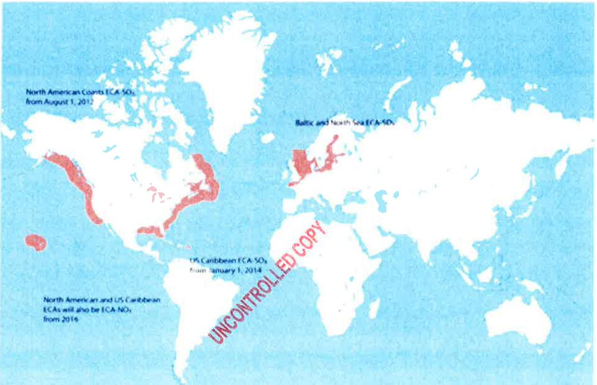

{472}------------------------------------------------

# NOTE OF PROTEST

# NON-COMPLIANCE WITH MARPOL 73/78 ANNEX VI REGS. 14 & 18

| Port:                             | Date:            |
| --------------------------------- | ---------------- |
| Receiving Vessel:                 | Bunker Supplier: |
| IMO:                              | IMO:             |
| BDN Reference Number:             |                  |
| Annex VI Sample Reference Number: |                  |

# To Supplier:

On behalf of my principal(s), I \_\_\_\_\_\_\_\_\_\_\_\_\_\_\_\_\_\_\_\_\_\_\_\_\_\_\_\_\_\_\_\_\_\_\_\_\_\_\_\_\_\_\_\_\_\_\_\_\_\_\_\_\_\_\_\_\_\_\_\_\_\_\_\_\_\_\_\_\_\_\_\_\_\_\_\_\_\_\_\_\_\_\_\_\_\_\_\_\_\_\_\_\_\_\_\_\_\_\_\_\_\_\_\_\_\_\_\_\_\_\_\_\_\_\_\_\_\_\_\_\_\_\_\_\_\_\_\_\_\_\_\_\_\_\_\_\_\_\_\_\_\_ hereby register the following items(s) which may be regarded as being non-compliant to MARPOL 73/78 Annex VI 14 and 18 or the EU Sulphur Directive 2005/33/EC, amending 1999/32/EC, MSC 86 Resolution, or another legislation (underline the relevant regulation or specify another).

Signature & Receiving Vessel's Stamp

Copied to:

Bunker Supplier

SR MARINE Operations Department (For forwarding as deemed appropriate) Signature & Bunker Supplier's Stamp

This Note of Protest should be supported with a copy of available documentation, such as the BDN or other documents that may have been provided by the supplier.

{473}------------------------------------------------

| Port / Location:                  |     | Date:            |     |
| --------------------------------- | --- | ---------------- | --- |
| Receiving Vessel:                 |     | Bunker Supplier: |     |
| IMO:                              |     | IMO:             |     |
| BDN Reference Number:             |     |                  |     |
| Annex VI Sample Reference Number: |     |                  |     |

# To Supplier:

| On behalf of my principal(s), |                              | short received             |
| ----------------------------- | ---------------------------- | -------------------------- |
| tonnes of                     | (Grade of Bunker) out of the | tonnes                     |
| requested on                  |                              | (Date of bunker received). |

I hereby lodge a Note of Protest against the short delivery. (Particulars of any undue stoppages or delays may also be set out in this paragraph).

Signature & Receiving Vessel's Stamp

Signature & Bunker Supplier's Stamp

Copied to:

Bunker Supplier

SR MARINE Fleet Services, Technical Services Department (For forwarding as deemed appropriate)

This Note of Protest should be supported with a copy of available documentation, such as the BDN or other documents that may have been provided by the supplier.

{474}------------------------------------------------

# IMS 17 – APPENDIX G ENGINEROOM HANDING OVER WATCH CHECKLIST

| Issue Status  | 2nd Edition, Rev 0 |
| ------------- | ------------------ |
| Issue Date    | 1st July 2014      |
| Issued by     | DPA                |
| Authorised By | Director PFS       |

| Vessel : |                                                                                                         | Port/At Sea:                    |     |
| -------- | ------------------------------------------------------------------------------------------------------- | ------------------------------- | --- |
| Date:    |                                                                                                         | Hand-over Engineer's Signature: |     |
| Time:    |                                                                                                         | Take-over Engineer's Signature: |     |
| No       | Description                                                                                             | Remarks                         |     |
| 1        | Which generator or shaft generator on load                                                              |                                 |     |
| 2        | Which Main Engine running or on standby                                                                 |                                 |     |
| 3        | What is Engine Load and RPM for Port/Starboard engines                                                  |                                 |     |
| 4        | Were there any alarms for any machinery in the last 4 to 6 hours? If yes: Which alarms/rectify          |                                 |     |
| 5        | Is there any cargo operations still on-going                                                            |                                 |     |
| 6        | Any internal Fuel Oil transfer still on-going. If yes:                                                  |                                 |     |
|          | a) which tank to which                                                                                  |                                 |     |
|          | b) what is the last sounding                                                                            |                                 |     |
|          | c) what should be the final sounding                                                                    |                                 |     |
| 7        | Any Bilge water pumped out in the last 4~6 hours. If yes:                                               |                                 |     |
|          | a) which compartment                                                                                    |                                 |     |
|          | b) any leakage                                                                                          |                                 |     |
|          | c) if there is leakage, is it now rectified                                                             |                                 |     |
| 8        | Are there any thrusters in operation? If yes, any problems                                              |                                 |     |
| 9        | Is there any ballasting still on-going? If yes, which tanks/latest sounding/bridge requirements         |                                 |     |
| 10       | Is there any hot-work in Engine/Machinery rooms going on? If yes - was there any Permit-to-Work issued? |                                 |     |

{475}------------------------------------------------

| Issue Status  | 2nd Edition, Rev 0 |
| ------------- | ------------------ |
| Issue Date    | 1st July 2014      |
| Issued by     | DPA                |
| Authorised By | Director PFS       |

| FILE NO | TITLE CONTENT                                                                                                                                                                                                                            | RETENTION PERIOD                |
| ------- | ---------------------------------------------------------------------------------------------------------------------------------------------------------------------------------------------------------------------------------------- | ------------------------------- |
| E 01    | PERSONAL 1. Chief Engineer's Handing-over report 2. Chief Engineer Handing-over statement 3. Chief Engineer statement                                                                                                           | 2 years                         |
| E 02    | PERSONAL 1. Second Engineer Handing-over report 2. Third Engineer Handing-over report 3. Electrician Handing-over report                                                                                                        | 2 years                         |
| E 03    | PMS System 1. 3 monthly maintenance print                                                                                                                                                                                             | 3 months                        |
| E 04    | MACHINERY MAINTENANCE RECORD 1. ME cylinder service record 2. ME crank shaft deflection record 3. ME performance record 4. AE service record 5. Alternator service record 6. Other Machinery maintenance record        | Permanently Retained            |
| E 05    | CLASS SURVEY 1. Class quarterly listing 2. Class survey record                                                                                                                                                                     | 2 years                         |
| E 06    | BUNKER 1. Pre-Bunker/Transfer check list 2. Bunker delivery Receipts 3. Bunker MSDS 4. Fuel oil / Fresh water transfer note 5. Fuel oil analysis report 6. Monthly FO and LO return                                    | 3 Years                         |
| E 07    | LUBRICANT 1. Machinery LO Chart 2. Bunker check list 3. Lube Oil Sample and Analysis record (Shore base) 4. Shipboard LO analysis record 5. Monthly Lube Oil ROB record 6. Lube Oil Test Report (Monthly onboard Test) | Permanently Retained 3 Years |

{476}------------------------------------------------

IMS 17 – APPENDIX H ENGINE DEPT – STANDARD FILING SYSTEM

| Issue Status  | 2nd Edition, Rev 0 |
| ------------- | ------------------ |
| Issue Date    | 1st July 2014      |
| Issued by     | DPA                |
| Authorised By | Director PFS       |

| E 08 | WATER TREATMENT LOG 1. Engine cooling water test log 2. Cooling water review report                                                                                                                                                                                     | 2 Years                         |
| ---- | ----------------------------------------------------------------------------------------------------------------------------------------------------------------------------------------------------------------------------------------------------------------------------- | ------------------------------- |
| E 09 | MACHINERY SPARE PARTS 1. Spare inventory record 2. Critical spare part list and ROB 3. Machinery spare delivery order, receipts                                                                                                                                      | 2 Years                         |
| E 10 | STORE 1. Summary of store spare order 2. Delivery order/receipts                                                                                                                                                                                                        | 2 Years                         |
| E 11 | TECHNICAL 1. Engine Maker's Technical information 2. Technical Circulars                                                                                                                                                                                                | Permanently Retained            |
| E 12 | ENGINE WARRANTY CLAIM AND DEFECT REPORT 1. Warranty claim report 2. Warranty claim rectification report 3. Warranty claim Summary 4. Defect report 5. Defect rectification report 6. Defect report summary 7. Service report/time sheet/work done report | 5 Years                         |
| E 13 | DRY DOCKING 1. Dry Dock specification 2. Work list 3. Docking / inspection report                                                                                                                                                                                    | Permanently Retained            |
| E 14 | DOCUMENT 1. Manuals 2. List of finish plan and drawing 3. Alarm print out 4. Machinery certificate                                                                                                                                                                | Permanently Retained 2 Years |
| E 15 | VESSEL PARTICULARS 1. Machinery Particulars                                                                                                                                                                                                                                | Permanently Retained            |

{477}------------------------------------------------

|  INTEGRATED MANAGEMENT SYSTEM |                                                                                                                                                                                        | IMS 17 - APPENDIX H ENGINE DEPT - STANDARD FILING SYSTEM |     | Issue Status  | 2nd Edition, Rev 0 |
| ----------------------------------- | -------------------------------------------------------------------------------------------------------------------------------------------------------------------------------------- | ----------------------------------------------------------- | --- | ------------- | ------------------ |
|                                     |                                                                                                                                                                                        |                                                             |     | Issue Date    | 1st July 2014      |
|                                     |                                                                                                                                                                                        |                                                             |     | Issued by     | DPA                |
|                                     |                                                                                                                                                                                        |                                                             |     | Authorised By | Director PFS       |
| E 16                                | MACHINERY MAINTENANCE 1. Machinery Insulation Test Report 2. Machinery Lube Oil Change Status 3. Main Engine Operational Data 4. Engine Room Filters and Oil Change Record |                                                             |     | 2 years       |                    |
| E 17                                | RISK ASSESSMENT 1. Risk Assessment Worksheet 2. Tool Box Talk 3. Permit To Work (Engine room)                                                                                 |                                                             |     | 1 year        |                    |
| E 18                                | 1. Drill and Training Plan for Critical Equipment                                                                                                                                      |                                                             |     | 2 years       |                    |
|                                     | 2. Portable Electrical Equipment Maintenance Log                                                                                                                                       |                                                             |     | 3 years       |                    |
| E 19                                | 1. Non-Conformance with Environmental Legislation                                                                                                                                      |                                                             |     | 2 years       |                    |
|                                     | 2. Note of Protest - Short Delivery of Bunker                                                                                                                                          |                                                             |     | 3 years       |                    |

2 years

3. On Hire / Off Hire Delivery Statement

UNCORA

{478}------------------------------------------------

VESSEL:

| No. | Description                                                                                                                                                                               |     | January      | July         | Remark |
| --- | ----------------------------------------------------------------------------------------------------------------------------------------------------------------------------------------- | --- | ------------ | ------------ | ------ |
|     | Scheduled measurement of Insulation Test to be carried out onboard ship ( put ∞ for reading above 100 MΩ , if there is unbalanced reading among phases please state in remark column ) |     | Wdg Vs Wdg   | Wdg Vs Wdg   |        |
|     | Steering Gear Room                                                                                                                                                                        |     | Wdg Vs Earth | Wdg Vs Earth |        |
| 1   | Steering Gear pump motor Port No 1                                                                                                                                                        |     |              |              |        |
| 2   | Steering Gear pump motor Port No 2                                                                                                                                                        |     |              |              |        |
| 3   | Steering Gear Pump motor Stbd No 1                                                                                                                                                        |     |              |              |        |
| 4   | Steering Gear Pump motor Stbd No 2                                                                                                                                                        |     |              |              |        |
| 5   | Shark jaw & Towing pin Pump motor                                                                                                                                                         |     |              |              |        |
| 6   | S/G room ventilation fan motor No 1                                                                                                                                                       |     |              |              |        |
| 7   | S/T Exhaust fan motor                                                                                                                                                                     |     |              |              |        |
| 8   | S/T SW cooling pump motor ( Engine Room )                                                                                                                                                 |     |              |              |        |
| 9   | Stern Thruster motor                                                                                                                                                                      |     |              |              |        |
| 10  | Stern Thruster Hyd Pump motor No 1                                                                                                                                                        |     |              |              |        |
| 11  | Stern Thruster Hyd Pump motor No 2                                                                                                                                                        |     |              |              |        |
|     | Engine Room                                                                                                                                                                               |     |              |              |        |
| 12  | Dirty oil transfer pump motor                                                                                                                                                             |     |              |              |        |
| 13  | Agitator Hydr Power Pack motor                                                                                                                                                            |     |              |              |        |
| 14  | Bilge & Ballast pump motor                                                                                                                                                                |     |              |              |        |
| 15  | GS & Fire pump motor                                                                                                                                                                      |     |              |              |        |
| 16  | Fresh Water Generator High Press Pump Motor                                                                                                                                               |     |              |              |        |
| 17  | Fresh Water Cargo Pump Motor                                                                                                                                                              |     |              |              |        |
| 18  | Fresh Water Generator Cooling SW Pump                                                                                                                                                     |     |              |              |        |
| 19  | Fixed Drilling Machine Motor                                                                                                                                                              |     |              |              |        |
| 20  | Grinding Machine Motor                                                                                                                                                                    |     |              |              |        |
| 21  | ME Pre-Heating Circulation Pump Motor ( Port )                                                                                                                                            |     |              |              |        |
| 22  | ME Pre-Heating Circulation Pump Motor ( Stbd )                                                                                                                                            |     |              |              |        |
| 23  | Shaft Alternator ( Port )                                                                                                                                                                 |     |              |              |        |
| 24  | Shaft Alternator ( Stbd )                                                                                                                                                                 |     |              |              |        |
|     |                                                                                                                                                                                           |     |              |              |        |
|     |                                                                                                                                                                                           |     |              |              |        |
|     |                                                                                                                                                                                           |     |              |              |        |
|     |                                                                                                                                                                                           |     |              |              |        |

{479}------------------------------------------------

|     |                                                              |                            |                          | IMS 17 - APPENDIX J MACHINERY LUBE OIL CHANGE STATUS |                                         |                            |                                  | Issue Status  | 2nd Edition, Rev 0 |
| --- | ------------------------------------------------------------ | -------------------------- | ------------------------ | ------------------------------------------------------- | --------------------------------------- | -------------------------- | -------------------------------- | ------------- | ------------------ |
|     |                                                              |                            |                          |                                                         |                                         |                            |                                  | Issue Date    | 1st July 2014      |
|     | SR MARINE INTEGRATED MANAGEMENT SYSTEM Vessel Name: |                            |                          |                                                         |                                         |                            |                                  | Issued By     | DPA                |
|     |                                                              |                            |                          |                                                         |                                         |                            |                                  | Authorised By | Director PFS       |
| No. | Machinery Name                                               | Monthly Running Hour | Total Running Hour | Recomanded Oil Change Running Hour                | Oil Running Hour After Oil Change | Last Oil Change Date | Last Date Oil Send A Shore |               | Remark             |
| 1   | Main Engine sump oil Port                                    |                            |                          |                                                         |                                         |                            |                                  |               |                    |
| 2   | Main Engine sump oil Stb                                     |                            |                          |                                                         |                                         |                            |                                  |               |                    |
| 3   | Main Engine gear box oil Port side                           |                            |                          |                                                         |                                         |                            |                                  |               |                    |
| 4   | Main Engine gear box oil Stb side                            |                            |                          |                                                         |                                         |                            |                                  |               |                    |
| 5   | Aux engine sump oil Port                                     |                            |                          |                                                         |                                         |                            |                                  |               |                    |
| 6   | Aux engine sump oil Stb                                      |                            |                          |                                                         |                                         |                            |                                  |               |                    |
| 7   | Azimuth thruster engine sump oil                             |                            |                          |                                                         |                                         |                            |                                  |               |                    |
| 8   | Azimuth thruster system oil                                  |                            |                          |                                                         |                                         |                            |                                  |               |                    |
| 9   | Bow Thruster 1                                               |                            |                          |                                                         |                                         |                            |                                  |               |                    |
| 10  | Bow Thruster 2                                               |                            |                          |                                                         |                                         |                            |                                  |               |                    |
| 11  | Stern Thruster                                               |                            |                          |                                                         |                                         |                            |                                  |               |                    |
| 12  | Towing winch                                                 |                            |                          |                                                         |                                         |                            |                                  |               |                    |
| 13  | Stern tube oil Port                                          |                            |                          |                                                         |                                         |                            |                                  |               |                    |
| 14  | Stern tube oil Stb                                           |                            |                          |                                                         |                                         |                            |                                  |               |                    |
| 15  | Windlass hyd system oil                                      |                            |                          |                                                         |                                         |                            |                                  |               |                    |
| 16  | Steering Gear Port side                                      |                            |                          |                                                         |                                         |                            |                                  |               |                    |
| 17  | Steering Gear Stb side                                       |                            |                          |                                                         |                                         |                            |                                  |               |                    |
| 18  | Deck crane                                                   |                            |                          |                                                         |                                         |                            |                                  |               |                    |
| 19  | FiFi gear box Port                                           |                            |                          |                                                         |                                         |                            |                                  |               |                    |
| 19  | FiFi gear box Stbd                                           |                            |                          |                                                         |                                         |                            |                                  |               |                    |
| 20  | Capstan                                                      |                            |                          |                                                         |                                         |                            |                                  |               |                    |
| 21  | Shark Jaw                                                    |                            |                          |                                                         |                                         |                            |                                  |               |                    |
| 22  | Emergency Generator                                          |                            |                          |                                                         |                                         |                            |                                  |               |                    |
|     |                                                              |                            |                          |                                                         |                                         |                            |                                  |               |                    |
|     |                                                              |                            |                          |                                                         |                                         |                            |                                  |               |                    |

Incle weeked to the sex been see and see and our see see CHIEF ENGINEER

{480}------------------------------------------------

| Issue Status  | 2nd Edition, Rev 0 |
| ------------- | ------------------ |
| Issue Date    | 1st July 2014      |
| Issued By     | DPA                |
| Authorised By | Director PFS       |

# Vessel:

| Engine Maker:                                          |          |           |                  |           |           | Engine Type:     |           |                  |           |           |                  |          |           |     |     |
| ------------------------------------------------------ | -------- | --------- | ---------------- | --------- | --------- | ---------------- | --------- | ---------------- | --------- | --------- | ---------------- | -------- | --------- | --- | --- |
| Main Engine                                            |          |           | Main Engine NO 1 |           |           | Main Engine NO 2 |           | Main Engine NO 3 |           |           | Main Engine NO 4 |          |           |     |     |
| Test date Location                                  |          |           |                  |           |           |                  |           |                  |           |           |                  |          |           |     |     |
| Fuel in use                                            |          |           |                  |           |           |                  |           |                  |           |           |                  |          |           |     |     |
| FO temp into engine                                    | °C       |           |                  |           |           |                  |           |                  |           |           |                  |          |           |     |     |
| Engine running hour                                    |          |           |                  |           |           |                  |           |                  |           |           |                  |          |           |     |     |
| Engine speed                                           | Rpm      |           |                  |           |           |                  |           |                  |           |           |                  |          |           |     |     |
| Engine load                                            | %        |           |                  |           |           |                  |           |                  |           |           |                  |          |           |     |     |
| Load indicator position                                |          |           |                  |           |           |                  |           |                  |           |           |                  |          |           |     |     |
| Shaft generator in use                                 |          |           |                  |           |           |                  |           |                  |           |           |                  |          |           |     |     |
| Gear box                                               |          |           |                  | Port      |           |                  |           |                  | Starboard |           |                  |          |           |     |     |
| Clutch supply oil pressure(HP)                         | Bar      |           |                  |           |           |                  |           |                  |           |           |                  |          |           |     |     |
| Clutch oil pressure (HP)                               | Bar      |           |                  |           |           |                  |           |                  |           |           |                  |          |           |     |     |
| Main supply oil pressure (HP)                          | Bar      |           |                  |           |           |                  |           |                  |           |           |                  |          |           |     |     |
| Main oil pressure (LP)                                 | Bar      |           |                  |           |           |                  |           |                  |           |           |                  |          |           |     |     |
| Shaft                                                  |          |           |                  | Port      |           |                  |           |                  | Starboard |           |                  |          |           |     |     |
| Shaft speed                                            | Rpm      |           |                  |           |           |                  |           |                  |           |           |                  |          |           |     |     |
| Shaft load                                             | %        |           |                  |           |           |                  |           |                  |           |           |                  |          |           |     |     |
| Pitch                                                  | %        |           |                  |           |           |                  |           |                  |           |           |                  |          |           |     |     |
| Stern tube                                             |          |           |                  | Port      |           |                  |           |                  | Starboard |           |                  |          |           |     |     |
| Stern tube bearing temp: (Fwd)                         | °C       |           |                  | 53        |           |                  |           |                  |           | 49        |                  |          |           |     |     |
| Stern tube bearing temp: (Aft)                         | °C       |           |                  | 53        |           |                  |           |                  |           | 54        |                  |          |           |     |     |
| Exh temp(Exh), Fuel rock (FR), Firing pressure (FP) |          | Exh °C | FR mm         | FP Bar | Exh °C | FR mm         | FP Bar | Exh °C        | FR mm  | FP Bar | Exh °C        | FR mm | FP Bar |     |     |
|                                                        | #1       |           |                  |           |           |                  |           |                  |           |           |                  |          |           |     |     |
|                                                        | #2       |           |                  |           |           |                  |           |                  |           |           |                  |          |           |     |     |
|                                                        | #3       |           |                  |           |           |                  |           |                  |           |           |                  |          |           |     |     |
|                                                        | #4       |           |                  |           |           |                  |           |                  |           |           |                  |          |           |     |     |
| Cylinder                                               | #5       |           |                  |           |           |                  |           |                  |           |           |                  |          |           |     |     |
|                                                        | #6       |           |                  |           |           |                  |           |                  |           |           |                  |          |           |     |     |
|                                                        | #7       |           |                  |           |           |                  |           |                  |           |           |                  |          |           |     |     |
|                                                        | #8 #9 |           |                  |           |           |                  |           |                  |           |           |                  |          |           |     |     |
| Mean values/Bank                                       |          | #DIV/0!   | #DIV/0!          | #DIV/0!   | #DIV/0!   | #DIV/0!          | #DIV/0!   | #DIV/0!          | #DIV/0!   | #DIV/0!   | ######           | #DIV/0!  | #DIV/0!   |     |     |
| Turbo charger speed                                    | Rpm      |           |                  |           |           |                  |           |                  |           |           |                  |          |           |     |     |
| Exh temp B/A turbo charger                             | °C       |           |                  |           |           |                  |           |                  |           |           |                  |          |           |     |     |
| Ambient temp                                           | °C       |           |                  |           |           |                  |           |                  |           |           |                  |          |           |     |     |
| Receiver air temp                                      | °C       |           |                  |           |           |                  |           |                  |           |           |                  |          |           |     |     |
| LT water temp (BA) Air cooler                          | °C       |           |                  |           |           |                  |           |                  |           |           |                  |          |           |     |     |
| LT water temp (BA) LO cooler                           | °C       |           |                  |           |           |                  |           |                  |           |           |                  |          |           |     |     |
| LO temp(BA) LO cooler                                  | °C       |           |                  |           |           |                  |           |                  |           |           |                  |          |           |     |     |
| HT water temp(BA) Engine                               | °C       |           |                  |           |           |                  |           |                  |           |           |                  |          |           |     |     |
| HT water temp(BA) T/C                                  | °C       |           |                  |           |           |                  |           |                  |           |           |                  |          |           |     |     |
| Receiver air pressure                                  | Bar      |           |                  |           |           |                  |           |                  |           |           |                  |          |           |     |     |
| LT water pressure                                      | Bar      |           |                  |           |           |                  |           |                  |           |           |                  |          |           |     |     |
| LO pressure (BA)Filter                                 | Bar      |           |                  |           |           |                  |           |                  |           |           |                  |          |           |     |     |
| HT water pressure                                      | Bar      |           |                  |           |           |                  |           |                  |           |           |                  |          |           |     |     |
| FO pressure                                            | Bar      |           |                  |           |           |                  |           |                  |           |           |                  |          |           |     |     |
| Central cooler                                         |          |           |                  |           |           |                  |           |                  |           |           |                  |          |           |     |     |
| Sea water (BA)                                         | °C       |           |                  |           |           |                  |           |                  |           |           |                  |          |           |     |     |
| Fresh water (B/A)                                      | °C       |           |                  |           |           |                  |           |                  |           |           |                  |          |           |     |     |
| F.O Flow meter---- @1800 hrs :                         | m³/hr    |           |                  |           |           |                  |           |                  |           |           |                  |          |           |     |     |
| F.O Flow meter---- @1900 hrs :                         | m³/hr    |           |                  |           |           |                  |           |                  |           |           |                  |          |           |     |     |

Chief Engineer

{481}------------------------------------------------

| Issue Status  | 2 nd Edition, Rev 0 |
| ------------- | ------------------------------ |
| Issue Date    | 1 st July 2014      |
| Issued By     | DPA                            |
| Authorised By | Director PFS                   |

| VESSEL: |                                                                      |                              |                                 | UPDATED:             |          | Nov-10    |                            |     |         |     |         |     |     |     |     |
| ------- | -------------------------------------------------------------------- | ---------------------------- | ------------------------------- | -------------------- | -------- | --------- | -------------------------- | --- | ------- | --- | ------- | --- | --- | --- | --- |
| No.     | ENGINE ROOM FILTERS AND OIL CHANGE INTERVAL DESCRIPTION           | WORKING QTY                  | OPERATION                       | Maintenance Interval | DONE     | NEXT DONE | LOCATION                   |     |         |     |         |     |     |     |     |
|         | MAIN ENGINE PORT OUTER                                               |                              |                                 |                      |          |           |                            |     |         |     |         |     |     |     |     |
| 1       | Primary Fuel Oil Suction Strainer (Duplex)                           | 2                            | 1                               | Cleaned Weekly       | 19.11.10 |           |                            |     |         |     |         |     |     |     |     |
| 2       | Fuel Oil Y-Strainer (Before Flow Meter)                              | 2                            | 1                               | Cleaned Weekly       | n.a      |           |                            |     |         |     |         |     |     |     |     |
| 3       | Secondary Fuel Filter (Duplex)                                       | 2                            | 1                               | 1000 Hrs             | 10.9.10  |           | renewed filters (2 pcs)    |     |         |     |         |     |     |     |     |
| 4       | Main L.O. Filter (Duplex)                                            | 8                            | 4                               | 1000 Hrs             | 7.10.10  |           | renewed filters (4 pcs)    |     |         |     |         |     |     |     |     |
| 5       | Gear Box L.O L.P Filter                                              | 6                            | 3                               | 2000Hrs              | 4.9.10   |           |                            |     |         |     |         |     |     |     |     |
| 6       | Gear Box L.O H.P Filter                                              | 2                            | 1                               | 2000 Hrs             | 13.9.10  |           |                            |     |         |     |         |     |     |     |     |
| 7       | Fi-Fi Gear Box Oil Filter                                            | 1                            | 1                               | 2000 Hrs             | 7.7.10   |           | changed oil (7.7.10)       |     |         |     |         |     |     |     |     |
| 8       | Turbo Air Filter                                                     | 1                            | 1                               | 1000 Hrs             | 11.11.10 |           | renewed air filter         |     |         |     |         |     |     |     |     |
|         |                                                                      |                              |                                 |                      |          |           |                            |     |         |     |         |     |     |     |     |
|         | MAIN ENGINE PORT INNER                                               |                              |                                 |                      |          |           |                            |     |         |     |         |     |     |     |     |
| 9       | Primary Fuel Oil Suction Strainer (Duplex)                           | 2                            | 1                               | Cleaned Weekly       | 19.11.10 |           |                            |     |         |     |         |     |     |     |     |
| 10      | Fuel Oil Y-Strainer (Before Meter)                                   | 2                            | 1                               | Cleaned Weekly       | n.a      |           |                            |     |         |     |         |     |     |     |     |
| 11      | Secondary Fuel Filter (Duplex)                                       | 4                            | 2                               | 1000 Hrs             | 27.11.10 |           | renewed filters (2 pcs)    |     |         |     |         |     |     |     |     |
| 12      | Main L.O. Filter (Duplex)                                            | 8                            | 4                               | 1000 Hrs             | 7.10.10  |           | renewed filters (4 pcs)    |     |         |     |         |     |     |     |     |
| 13      | Gear Box L.O L.P Filter                                              | 6                            | 3                               | 2000 Hrs             | 4.9.10   |           |                            |     |         |     |         |     |     |     |     |
| 14      | Gear Box L.O H.P Filter                                              | 2                            | 1                               | 2000 Hrs             | 13.9.10  |           |                            |     |         |     |         |     |     |     |     |
| 15      | Fi-Fi Gear Box Oil Filter                                            | 1                            | 1                               | 2000 Hrs             | n.a      |           |                            |     |         |     |         |     |     |     |     |
| 16      | Turbo Air Filter                                                     | 1                            | 1                               | 1000 Hrs             | 11.11.10 |           | renewed air filter         |     |         |     |         |     |     |     |     |
|         | MAIN ENGINE STBD INNER                                               |                              |                                 |                      |          |           |                            |     |         |     |         |     |     |     |     |
| 17      | Primary Fuel Oil Suction Strainer (Duplex)                           | 2                            | 1                               | Cleaned Weekly       | 19.11.10 |           |                            |     |         |     |         |     |     |     |     |
| 18      | Fuel Oil Y-Strainer (Before Meter)                                   | 2                            | 1                               | Cleaned Weekly       | n.a      |           |                            |     |         |     |         |     |     |     |     |
| 19      | Secondary Fuel Filter (Duplex)                                       | 4                            | 2                               | 1000 Hrs             | 10.9.10  |           | renewed filters (2 pcs)    |     |         |     |         |     |     |     |     |
| 20      | Main L.O. Filter (Duplex)                                            | 8                            | 4                               | 1000 Hrs             | 7.10.10  |           | renewed filters (4 pcs)    |     |         |     |         |     |     |     |     |
| 21      | Gear Box L.O L.P Filter                                              | 6                            | 3                               | 2000 Hrs             | 4.9.10   |           | changed oil (22.1.10)      |     |         |     |         |     |     |     |     |
| 22      | Gear Box L.O H.P Filter                                              | 2                            | 1                               | 2000 Hrs             | 13.9.10  |           |                            |     |         |     |         |     |     |     |     |
| 23      | Fi-Fi Gear Box Oil Filter                                            | 1                            | 1                               | 2000 Hrs             | n.a      |           |                            |     |         |     |         |     |     |     |     |
| 24      | Turbo Air Filter                                                     | 1                            | 1                               | 1000 Hrs             | 11.11.10 |           | renewed air filter         |     |         |     |         |     |     |     |     |
|         |                                                                      |                              |                                 |                      |          |           |                            |     |         |     |         |     |     |     |     |
| 25      | MAIN ENGINE STBD OUTER Primary Fuel Oil Suction Strainer (Duplex) | 2                            | 1                               | Cleaned Weekly       | 19.11.10 |           |                            |     |         |     |         |     |     |     |     |
| 26      | Fuel Oil Y-Strainer (Before Meter)                                   | 2                            | 1                               | Cleaned Weekly       | n.a      |           |                            |     |         |     |         |     |     |     |     |
| 27      | Secondary Fuel Filter (Duplex)                                       | 4                            | 2                               | 1000 Hrs             | 10.9.10  |           | renewed filters (2 pcs)    |     |         |     |         |     |     |     |     |
| 28      | Main L.O. Filter (Duplex)                                            | 8                            | 4                               | 1000 Hrs             | 7.10.10  |           | renewed filters (4 pcs)    |     |         |     |         |     |     |     |     |
| 29      | Gear Box L.O L.P Filter                                              | 6                            | 3                               | 2000 Hrs             | 4.9.10   |           | changed oil (22.1.10)      |     |         |     |         |     |     |     |     |
| 30      | Gear Box L.O H.P Filter                                              | 2                            | 1                               | 2000 Hrs             | 13.9.10  |           |                            |     |         |     |         |     |     |     |     |
| 31      | Fi-Fi Gear Box Oil Filter                                            | 1                            | 1                               | 2000 Hrs             | 7.7.10   |           | Changed Oil (15.11.10)     |     |         |     |         |     |     |     |     |
| 32      | Turbo Air Filter                                                     | 1                            | 1                               | 1000 Hrs             | 11.11.10 |           | renewed air filter         |     |         |     |         |     |     |     |     |
|         | AUXILIARY ENGINE No. 1                                               |                              |                                 |                      |          |           |                            |     |         |     |         |     |     |     |     |
| 17      | Fuel Oil Filter Primary (before meter)                               | 1                            | 1                               | 1000 Hrs             | 23.11.10 |           |                            |     |         |     |         |     |     |     |     |
| 18      | Fuel Oil Filter Racor (Water Separator)                              | 1                            | 1                               | 1000 Hrs             | 23.11.10 |           |                            |     |         |     |         |     |     |     |     |
| 19      | Fuel Oil Filter Secondary (before lube oil filter)                   | 1                            | 3                               | 1000 Hrs             | 23.11.10 |           |                            |     |         |     |         |     |     |     |     |
| 20      | LUBE OI FILTER                                                       | 2                            | 2                               | 1000 Hrs             | 23.11.10 |           | lube oil & lube oil filter |     |         |     |         |     |     |     |     |
|         | AUXILIARY ENGINE No. 2                                               |                              |                                 |                      |          |           |                            |     |         |     |         |     |     |     |     |
| 21      | Fuel Oil Filter Primary                                              | 1                            | 1                               | 1000 Hrs             | 22.11.10 |           |                            |     |         |     |         |     |     |     |     |
| 22      | Fuel Oil Filter Racor (Water Separator)                              | 1                            | 1                               | 1000 Hrs             | 22.11.10 |           |                            |     |         |     |         |     |     |     |     |
| 23      | Fuel Oil Filter Secondary                                            | 3                            | 3                               | 1000 Hrs             | 22.11.10 |           |                            |     |         |     |         |     |     |     |     |
| 24      | LUBE OI FILTER                                                       | 2                            | 2                               | 1000 Hrs             | 22.11.10 |           | lube oil & lube oil filter |     |         |     |         |     |     |     |     |
|         | STEERING GEAR PORT                                                   |                              |                                 |                      |          |           |                            |     |         |     |         |     |     |     |     |
| 25      | Hyd. Oil Filter Pump No. 1                                           | 1                            | 1                               | RED MARK             | NOT DUE  |           |                            |     |         |     |         |     |     |     |     |
| 26      | Hyd. Oil Filter Pump No. 2                                           | 1                            | 1                               | RED MARK             | NOT DUE  |           |                            |     |         |     |         |     |     |     |     |
|         |                                                                      |                              |                                 |                      |          |           |                            |     |         |     |         |     |     |     |     |
|         | STEERING GEAR STBD.                                                  |                              |                                 |                      |          |           |                            |     |         |     |         |     |     |     |     |
| 27      | Hyd. Oil Filter Pump No. 1                                           | 1                            | 1                               | RED MARK             | NOT DUE  |           |                            |     |         |     |         |     |     |     |     |
| 28      | Hyd. Oil Filter Pump No. 2                                           | 1                            | 1                               | RED MARK             | NOT DUE  |           |                            |     |         |     |         |     |     |     |     |
|         | 29                                                                   | TOWING/ANCHOR HANDLING WINCH | Hydraulic Oil Filter Pump No. 1 |                      | 1        |           | 1                          |     | 500 HRS |     | NOT DUE |     |     |     |     |
| 30      | Hydraulic Oil Filter Pump No. 2                                      | 1                            | 1                               | 500 HRS              | NOT DUE  |           |                            |     |         |     |         |     |     |     |     |
| 31      | Hydraulic Oil Filter Pump No. 3                                      | 1                            | 1                               | 500 HRS              | NOT DUE  |           |                            |     |         |     |         |     |     |     |     |
| 32      | Hydraulic Oil Filter Pump No. 4                                      | na                           | na                              | na                   | na       |           |                            |     |         |     |         |     |     |     |     |
|         |                                                                      |                              |                                 |                      |          |           |                            |     |         |     |         |     |     |     |     |
| 33      | Tugger winch Hyd. Oil Filter                                         | 1                            | 1                               | 500 HRS              | NOT DUE  |           |                            |     |         |     |         |     |     |     |     |
| 34      | Towing Pin/KARM Fork Hyd. Oil Filter                                 | 1                            | 1                               | RED MARK             | NOT DUE  |           |                            |     |         |     |         |     |     |     |     |
| 35      | Towing Pin/KARM Fork Servo Pump Oil Filter                           | 1                            | 1                               | RED MARK             | NOT DUE  |           |                            |     |         |     |         |     |     |     |     |
|         |                                                                      |                              |                                 |                      |          |           |                            |     |         |     |         |     |     |     |     |
|         | MAIN AIR COMPRESSOR                                                  |                              |                                 |                      |          |           |                            |     |         |     |         |     |     |     |     |
| 62      | Air Suction Strainer Compressor No. 1                                | 1                            | 1                               | 1000 HRS             | 22.11.10 |           | cleaned                    |     |         |     |         |     |     |     |     |
| 63      | Air Suction Strainer Compressor No. 2                                | 1                            | 1                               | 1000 HRS             | 22.11.10 |           | cleaned                    |     |         |     |         |     |     |     |     |
|         |                                                                      |                              |                                 |                      |          |           |                            |     |         |     |         |     |     |     |     |
|         | SERVICE AIR COMPRESOR                                                |                              |                                 |                      |          |           |                            |     |         |     |         |     |     |     |     |
| 64      | Air Suction Filter                                                   | 2                            | 2                               | 1000 HRS             | 22.11.10 |           | cleaned                    |     |         |     |         |     |     |     |     |
| 65      | Separator Catridge                                                   |                              |                                 | na                   | na       |           |                            |     |         |     |         |     |     |     |     |
| 66      | Oil Filter                                                           |                              |                                 | na                   | na       |           |                            |     |         |     |         |     |     |     |     |
|         |                                                                      |                              |                                 |                      |          |           |                            |     |         |     |         |     |     |     |     |
|         | SIDE TRUSTER                                                         |                              |                                 |                      |          |           |                            |     |         |     |         |     |     |     |     |
| 73      | Bow Thruster No. 1 Servo pump Hyd. Oil Filter                        | 1                            | 1                               | RED MARK             | 16.02.10 |           |                            |     |         |     |         |     |     |     |     |
| 74      | Bow Thruster No. 2 Servo pump Hyd. Oil Filter                        | na                           | na                              | na                   | na       |           |                            |     |         |     |         |     |     |     |     |
| 75      | Stern Thruster Servo pump Hyd. Oil Filter                            | 1                            | 1                               | RED MARK             | 10.06.10 |           | renew oil filter           |     |         |     |         |     |     |     |     |

{482}------------------------------------------------

MANAGEMENT SYSTEM C-SR MARINE INTEGRATED

| Issue Status  | 2nd Edition, Rev 0 |
| ------------- | ------------------ |
| Issue Date    | 1st July 2014      |
| Issued by     | DPA                |
| Authorised By | Director PFS       |

|     | MACHINARY NAME   | January | February | March | April | May | June | July | August | September | October | November | December |
| --- | ---------------- | ------- | -------- | ----- | ----- | --- | ---- | ---- | ------ | --------- | ------- | -------- | -------- |
| 1   | Main Engine sump | X       |          |       | X     |     |      | X    |        |           | X       |          |          |
| 2   | Gear Box         |         |          |       | X     |     |      |      |        |           | X       |          |          |
| 3   | CPP              |         |          |       | X     |     |      |      |        |           | X       |          |          |
| 4   | Bow Thruster     |         |          |       | X     |     |      |      |        |           | X       |          |          |
| 5   | Stern Thruster   |         |          |       | X     |     |      |      |        |           | X       |          |          |
| 6   | Towing Winch     |         |          |       | X     |     |      |      |        |           |         |          |          |
| 7   | Steering Gear    |         |          |       | X     |     |      |      |        |           |         |          |          |
| 8   | Aux. Engine      |         |          |       | X     |     |      |      |        |           | X       |          |          |
| 9   | Stern Tube       |         |          |       | X     |     |      |      |        |           | X       |          |          |

Additional Samples to be landed if C/E suspect any contamination have taken place.

Salviscount and Salvanguard and any other vessel with continuous shaft monitoring notation to land stern tube sample as per requirement

{483}------------------------------------------------

| Issue Status  | 2nd Edition, Rev 0 |
| ------------- | ------------------ |
| Issue Date    | 1st July 2014      |
| Issued by     | DPA                |
| Authorised By | Director PFS       |

# CONTENTS

- 1. PURPOSE
- 2. SCOPE
- 3. LOCATION OF COMPANY SHORE RESPONSE TEAM COORDINATION CENTRE
- RESPONSIBILITY 4..
- 5. EMERGENCY RESPONSE LEVELS
- 6. COMMUNICATION & REPORTING

#### 7. CRISIS MANAGEMENT

- 7.1. Communication with the the Media
- 7.2. Responding to the Media

#### 8. EXTERNAL SUPPORT SERVICES

- 8.1. Medical Support
- 8.2. Emergency Exercises

#### 9. SHORE BASED EMERGENCY RESPONSE PROCEDURES

- 9.1. Shore Response Team Organisation
- 9.2. Criteria For Activation Of Shore Response Team
- 9.3. Activation Process
- 9.4 Responsibilities

#### SHIPBOARD EMERGENCY RESPONSE PROCEDURES 10.

- 10.1. General
- 10.2. Master's Responsibility
- 10.3. Initial Shipboard Response by Master
- 10.4 Initial Notification
- 10.5. Shipboard Emergency Organisation
- 10.6. Information Availability
- 10.7. Internal Communication
- 10.8. Initial Actions by Ship's Staff
- 10.9. External Communication
- 10.10. Record Keeping

#### DRILLS 11.

- 11.1. Master's Responsibility
- 11.2. Designated Safety Officer Responsibility
- 11.3. Attendance
- 11.4. Frequency and Planning of Drills and Exercises
- 11.5. Unannounced Drills and Exercises
- 11.6. Preparation for Drills and Exercises
- 11.7. Participation of the Company and Third Parties
- 11.8. Drills and Exercises Review

{484}------------------------------------------------

11.9. Training Needs

11.10. Drills and Exercises Records and Reporting

#### 12. NOTE OF PROTEST

- 12.1. Acceptance of Liability
- 12.2. Restriction of Information

#### 13. DOWN MANNING GUIDELINES

- 13.1. Identification of Non-Critical Staff
- 13.2. Risk Assessment

# Appendices

- A. Initial response Form
- B. Sitrep Form
- C. Emergency Drill Matrix
- D. DP Drill Matrix
- E. Drill Report
- F. Abandon Ship Muster List Sample
- G. Emergency Muster List Sample
- H. Emergency Contingency Plan
- l. Note of Protest
- J. Note of Sea Protest (Notarised)
- K. Emergency Response Checklists :

| K1  | Abandon Ship                                    |
| --- | ----------------------------------------------- |
| K2  | Collision                                       |
| K3  | Grounding                                       |
| K4  | Fire and Explosion                              |
| K5  | Structural Failure                              |
| K6  | Main Engine Failure                             |
| K7  | Medevac                                         |
| K8  | Helicopter Evacuation                           |
| K9  | Spillage - Pollution                            |
| K10 | Steering Gear Failure                           |
| K11 | Gyro Failure                                    |
| K12 | Enclosed Space Rescue                           |
| K13 | Ingress of Water                                |
| K14 | Man overboard                                   |
| K15 | Search & Rescue – Survivors Requiring Attention |
| K16 | Loss of Tow                                     |
| K17 | Piracy / Terrorist Incident                     |
| K18 | Main and Emergency Electrical Power Failure     |
| K19 | Cargo Shifted                                   |
| K20 | Cargo Jettison                                  |
| K21 | Machinery Space Rescue                          |
| K22 | Serious Injury                                  |
| K23 | Hazardous Material Release                      |
| K24 | Noxious Liquid Release                          |
| K25 | H2S Release                                     |
| K26 | Helicopter crash/ditching                       |

WROLLED

{485}------------------------------------------------

| Issue Status  | 2nd Edition, Rev 0 |
| ------------- | ------------------ |
| Issue Date    | 1st July 2014      |
| Issued by     | DPA                |
| Authorised By | Director PFS       |

#### Purpose and 1 - 110

- 1.1. SR MARINE Fleet Services Pte. Ltd. has developed this Emergency Response Procedure (ERP) which is applicable to all Company vessels and provides guidance to assist the vessel's Master and operational personnel in dealing with all aspects of emergencies. This ERP Manual contains information to handle an emergency and to take the necessary actions to stop or minimise damage and to mitigate the effects of an emergency.
- 1.2. This ERP also addresses the upward notification and reporting to the Company Senior Management and other relevant Company personnel. The notification and reporting is through the DPA and/or alternate DPA.
- 1.3. This ERP is authorised by the Director SR MARINE Fleet Services (PFS) who authorises the designated DPA to act as the link on matters of safety between the Fleet and senior management.

# 2. Scope Scope I L . Scope 1 1

- 2.1 . This ERP addresses the safeguarding of life & property, the minimisation of environmental impact and ensuring as far as possible the continuous safe operation of the vessel in the event of an onboard emergency.
- 3. Location of Company Shore Based Response Team Coordination Centre and Company

The Shore Response Team Coordination Centre is located at the below-mentioned Shipyard Road address and will be convened in as and when necessary.

# SR MARINE Fleet Services Pte Ltd 59 SHIPYARD ROAD, JURONG SINGAPORE 628143

The alternate Shore Response Team Coordination Centre will be convened as and when necessary in the Head Office Meeting Room at:

# 1 KIM SENG PROMENADE #06-01 GREAT WORLD CITY SINGAPORE 237994

{486}------------------------------------------------

| Issue Status  | 2nd Edition, Rev 0 |
| ------------- | ------------------ |
| Issue Date    | 1st July 2014      |
| Issued by     | DPA                |
| Authorised By | Director PFS       |

# 4. RESPONSIBILITY

- 4.1 an event of an emergency involving a company vessel (or tow), the Master is fully in-charge of all shipboard operations. The Master's priority will focus on the safety of personnel and vessel and to take actions to prevent the escalation of the emergency. Subject to the exigencies of the incident, an immediate initial verbal notification to the DPA (or the alternate DPA) must be initiated at the earliest opportunity (within 30 minutes) in order to enable the DPA to assist the vessel in handling the emergency.
- 4.2. The DPA will inform the senior management including Corporate legal and Insurance Department. This is to ensure that the senior management are appraised of the situation and any advice from Legal and Insurance department is complied with in order to protect the vessel's and the Company's interests.
- 4.3. The ERP is for handling emergency situations using whatever resources and assets that are available. When necessary, DPA will activate the Shore Response Team (SRT). The Shore Commander (Overall in-charge of the SRT) will assess the emergency and determine the response level. Assets from the company and/or third party assets where available and applicable may then be mobilised to assist the distressed vessel depending on the response level and advice from the SRT members.
- 4.4. All company assets will fall under the control of the Shore Commander. External assets such as government vessels may not fall under the control of the Shore Commander but, where possible, a link will be established between the distressed vessel and the non-company assets.
- 4.5 On scene, the Master (or his designated or the designated On-Scene Commander will be fully incharge of the emergency response operation. Where available, all assets will assist the vessel as required.
- 4.6 Where it is necessary for personnel evacuation from a Company vessel at sea, refer to the International Aeronautical Martime Search and Rescue (IAMSAR) Manual for guidance in coordination with Maritime Rescue assets and Maritime Rescue Coordination Centre (MRCC).

# 5. EMERGENCY RESPONSE LEVELS

- 5.1. The ERP uses the concept of tiered response. The response level is divided into 3 levels of response, (level 1, 2, and 3) to classify the severity of the emergency. These response levels also provide an indication to the resources to be mobilised and deployed. However, this is subject to the availability of assets from within the company and external parties' involvement.
- 5.2. The following response levels would be used to determine the severity of the emergency and the resources to be mobilised and deployed :

Level 1: This is for an emergency where the situation is controllable and can be managed effectively by utilising the vessel's own capability and on-board resources.

Level2: This requires a combination of the vessel's own capability and the support of additional company assets, where available. At this level, the emergency may have serious consequences to lives, property, environment and assets. The situation may be contained by company assets or sub-contracted on-site resources.

Level3: This response requires a full turn-out of all resources: from own vessel, support of additional company assets (if available) and the involvement of third parties and government response organisations. In this level, the emergency is threatening to affect or has affected lives, environment or assets that may warrant evacuation of the crew.

{487}------------------------------------------------

| Issue Status  | 2nd Edition, Rev 0 |
| ------------- | ------------------ |
| Issue Date    | 1st July 2014      |
| Issued by     | DPA                |
| Authorised By | Director PFS       |

# 6. COMMUNICATION & REPORTING

6.1. In'all emergencies, the DPA MUST be informed and all emails must be copied to the appropriate Operations Department Superintendent and the and the HSEQA email group (hseq@paccoffshore.com.sg) so that the senior management are fully informed of developments.

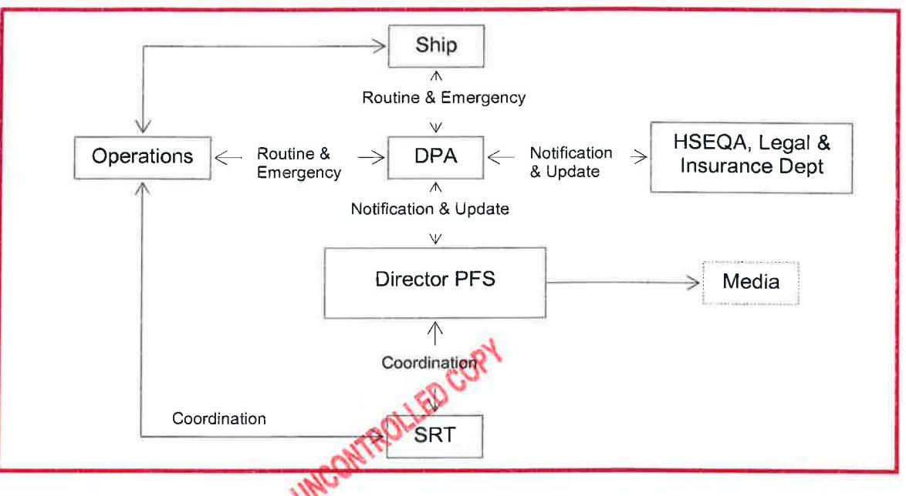

6.2. Emergency Contact List: Every vessel will be provided, thru circular, with latest Emergency Contact List from office, which will be amended as and when changes take place. The Master shall clearly display the emergency contact list on the bridge with a copy also displayed in the Engine room.

The Emergency Contact List will also be available in the Shore Response Team Coordination Centre.

As and when applicable, Vessel with Charter's emergency contact list for the current project, which shall be clearly displayed on bridge next to the SR MARINE contact list.

- 6.3. The DPA (or his designate) will be the key person ashore in handling the response operation. If necessary, he will communicate directly to and from the vessel, although keeping the appropriate Divisional Director, SR MARINE Semco informed. Where vessels are involved in project work where there is a Project ERP, the DPA will also work in liaison with the Project Director or his designate.
- 6.4. The Initial notification Checklist will be initially used in disseminating of information from the vessel to the SRT. This will provide the essential information that is required for SRT to work out a suitable plan to assist the vessel.
- 6.5. Communication with External Parties (other than media): If the nature of the emergency involves external government agencies or other assisting vessels rendering assistance to the vessel, the on-scene Commander should establish communications with the external parties.

{488}------------------------------------------------

| Issue Status  | 2nd Edition, Rev 0 |
| ------------- | ------------------ |
| Issue Date    | 1st July 2014      |
| Issued by     | DPA                |
| Authorised By | Director PFS       |

# 7. CRISIS MANAGEMENT

7.1 Communication with the Media: Depending on the nature of the emergency, it may potentially generate great interest with the general public. Contacts with the media are the responsibility of the Director PFS (or designate) in consultation with the SR MARINE Semco Divisional Director. If necessary, a Team of Company Management Personnel will be convened to address media issues, including press releases, press conferences etc. This Team may include but not be limited to appropriate representation from PFS and SR MARINE Semco.

#### 7.2 Responding to the Media

# a. Preparation of Policy Statements

When preparing policy statements, the following general principles should be considered :

- · When responding to a crisis situation, the response should be honest, timely and direct. Having a prepared, approved and distributed policy statement will help to resist the temptation to say "no comment" which may result in the company appearing to be uncooperative or secretive during a crisis situation.
- · Do the right thing, being fair to all parties to the best of your ability.

# b. Preparing Specific Responses (such as Press Releases)

After a crisis scenario has been identified, specific responses should be prepared,

Consider the following checklist when drafting press releases :

- · Define the scope of the crisis local, regional, national or international,
- · Establish a unified response one spokesperson established to distribute statements to the media, etc.
- · Keep the message simple, clear, consistent and tailored to each audience.

Understand that the media wants primarily to know three things :

- what happened? .
- . why did it happen?
- · what are you going to do to make sure that it never happens again?

In addition to the policy statements & press releases, anticipate media questions that may be asked.

List the questions with developed answers that the crisis team is comfortable with and continually update the list as new questions are identified. Team members should have immediate access to each other at all times in the event of a crisis.

Finally, the news media must be briefed on a regular basis. All phone calls from the media must be answered quickly and completely. Keep media logs listing the date and time, source, reporter, phone number and the questions asked.

Stick to your core message and deliver that message to everyone. Bear in mind that Social Media issues may also need to be similarly addressed.

{489}------------------------------------------------

| Image: SR MARINE Integrated Management System logo |
| -------------------------------------------------- |
| INTEGRATED                                         |
| MANAGEMENT SYSTEM                                  |

| Issue Status  | 2nd Edition, Rev 0 |
| ------------- | ------------------ |
| Issue Date    | 1st July 2014      |
| Issued by     | DPA                |
| Authorised By | Director PFS       |

Supportion of Corporation Corporation of Concerners of Concessional Comparison of Concessional Comparison of Concerner of Concerners of Concessional Concerners of Concessiona

{490}------------------------------------------------

# c. Post - Crisis Review

The crisis management process does not end once a crisis has occurred and been resolved.

Each situation should be carefully evaluated in terms of:

- the media coverage received .
- · the resulting image of the Company
- · the development of short and long term programmes to rebuild image
- · reviewing position statements for relevance and necessary revisions.

# 8. EXTERNAL SUPPORT SERVICES

#### 8.1 Medical Support

In addition to the standard Radio medico advice available through GMDSS, SR MARINE has a contracted support arrangement with shore-based Healthcare Service Providers in Singapore to provide medical support to all its employees, both shore-based and seagoing,

The services provided include real-time medical advice whereby the Master of a vessel can correspond or even speak directly with the Duty Medical Practitioner, especially in urgent cases of injury or illness where delay could cause further deterioration in a patient's condition.

Regular contact is maintained between the Crewing Department and the shore-based Healthcare Service Providers in Singapore to ensure the contacts remain current.

#### 8.2 Emergency Exercises

A table top exercise between Shore and Ship shall be conducted at least once a year to ensure adequate response at any time to hazards, accidents and emergency situations on board ships.

Such exercises may involve external parties (e.g. Port State, Flag State) and, on completion of the table top drill, an analysis shall be conducted and respective flag state forms completed if so required.

The exercise will be coordinated at the head office by SRT with a designated vessel.

{491}------------------------------------------------

| Issue Status  | 2nd Edition, Rev 0 |
| ------------- | ------------------ |
| Issue Date    | 1st July 2014      |
| Issued by     | DPA                |
| Authorised By | Director PFS       |

# 9. SHORE BASED EMERGENCY RESPONSE PROGEDURES

#### 9.1. Shore Response Team Organisation

9.1.1. SR MARINE Fleet Services adopts an effective and efficient Shore Response Team (SRT) structure for dealing with any major marine emergency. In the event of an emergency, the SRT will be formed under the direction of Director PFS.

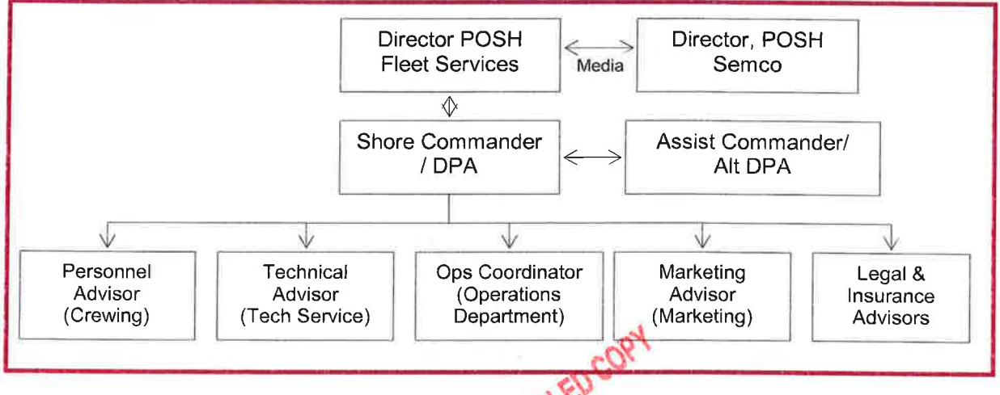

# Shore Response Team Structure

# 9.2. Criteria for Activation of Shore Response Team

- 9.2.1 During any emergency, the Director PFS will advise on the need to activate the SRT, based on these following criteria:
  - ✓ Possible escalation to serious injury / loss of life
  - Possible escalation to environmental damage
  - Possible escalation to serious damage or loss of vessel

#### 9.3. Activation Process

- 9.3.1. The following processes make up the activation and response to the emergency:
  - V Notification. DPA, in liaison with the Director PFS will notify the SRT of the emergency,
  - Activation. SRT members are first alerted by DPA of the emergency so that they can prepare and be ready to mobilise any available resources and assets. SRT members will report to Shore Response Team Coordination Centre as soon as possible.
  - · Mobilisation. Depending on the response level (2 or 3), the required resources and assets may be mobilised and deployed depending on the needs. If the situation warrants external assistance (Response Level 3), external parties will be notified accordingly.
  - · Response Action. The actual handling of the emergency onboard falls under the responsibility of the Master (or his designate). SRT will assist as necessary but should not override the authority of the Master (or designate).

{492}------------------------------------------------

#### 9.4 Responsibilities

- 9.4.1 Planning of the shore response is the responsibility of the Shore Commander but involves the participation of the Master and SRT members as necessary. As such the responsibilities of the team members are as follows:
- 9.4.2. DPA is the first line of response in SRT and responsible for the following:
  - Reviewing this plan and the relevant appendices, during management review meetings, in co-ordination with the other senior management review members.
  - V To direct and execute drills for the SRT to train members and verify the effectiveness of the Shore Emergency Response procedures.
  - > To ensure notification/assembly of the SRT members as required by the type of Emergency.
  - Preparation, maintenance and updating of the Emergency Response Plan.
  - Preparation, introduction and maintenance of a training/drills program in the tasks which form part of the plan.
  - > To ensure that the Company's Emergency Response Centre is properly equipped and ready to function as may be required in case of an emergency.
  - V Notifying all concerned parties regarding the nature of the incident and other necessary information.
  - · Ensuring that all log and record keeping is done properly,

#### Director PFS 943.

- To be available to make the necessary decisions,
- In consultation with DPA and/or Master, he will decide what level of response is warranted.
- · He is responsible for coordinating with the different departments involved at each response level.
- · He is responsible for deciding if the incident response team and/or pollution response team are to be mobilised.
- If required, he will request for external parties or Corporate assistance.
- · He is responsible for liaising with appropriate Director, SR MARINE Semco and Corporate Personnel for any press matters.

#### 9.4.4. Shore Commander

- V Usually the DPA or as otherwise nominated by the Director PFS and is the overall leader of the Shore Response Team.
- V He should be available at all times during any incidents to advise the Master.
- Allocating the necessary resources and personnel to protect the safety of the vessel and crew.
- Authorising the mobilisation of the appropriate response resources.
- Any enquires from the media should be referred to the Director, PFS and SR MARINE Semco.

{493}------------------------------------------------

#### 9.4.5. Operations Coordinator

- The Operations Manager or his designate would assume this role during an emergency,
- V The Operations Manager will co-ordinate and assist as required by the Shore Commander.

#### 946 Technical Services Advisor

- Advice on technical matters.
- Ensuring that appropriate and timely advice is given to Master / Chief Engineer.
- V Ensuring that all necessary (provisional or permanent) repairs are planned and carried out in a timely fashion.
- V Liaising with vessel's classification society.
- V Employment of Technical experts and/or repair teams.
- V Ordering and dispatching any emergency spares or stores required by the vessel. In ordering emergency spares or stores he has the authority to by-pass the Purchasing Department, although records must still be maintained.

# 9.4.7. Personnel Advisor

- GM Crewing Department or his designate would assume this role during an emergency,
- · Responsible for dealing with next-of-kin and relatives of crew involved in accidents.
- · Responsible for the hospitalisation and welfare of any crewmembers injured in an accident.
- V Responsible for seeking medical advice from the Company doctor when so requested by the Master or the Director PFS.
- Responsible for arranging medical evacuation.
- √ Responsible for informing the Flag State Administration of any accident involving crew injury.
- V Responsible for liaising with the immigration authorities for accidents involving survivors, and/or crew repatriation.
- √ Responsible for liaising with the authorities for the landing of any bodies recovered and/or bodies resulting from the fatal accident.
- Arranging relieves for any injured Seafarers and for the master in case the Barge Master is needed for formalities/interrogation by local authorities.

# 9.4.8. Marketing Advisor

- The Head of the Marketing Dept or his designate would assume this role during an emergency.
- V Responsible for dealing with contractual issues when external resources are being utilised to assist the distressed vessel.

{494}------------------------------------------------

| Issue Status  | 2nd Edition, Rev 0 |
| ------------- | ------------------ |
| Issue Date    | 1st July 2014      |
| Issued by     | DPA                |
| Authorised By | Director PFS       |

Responsible for liaising with the customers on the status vessel and tow.

# 9.4.9. Legal & Insurance Advisors

- The Heads of Legal and Insurance Dept, or their designates would assume this role during an emergency
- V Managing the legal and insurance aspects of the emergency, including informing P&I, H&M and machinery underwriters, Average adjuster as and when applicable.

# 9.5. Information to be Available to SRT:

The DPA is responsible to ensure that the following information is readily available and updated, so that it can be used by the ERT in case of emergency:

- Chart(s) covering the incident area.
- Appropriate drawings & manuals of each vessel (Technical Advisor).
- A copy of the List of Contacts (DPA).
- The telephone numbers of the various governmental offices, directorates etc. should also be at hand (National contacts of the vessel's SOPEP)
- Seafarers list, Seafarer data and next-of-kin (Crewing Manager)
- > Diplomatic missions of flag administration worldwide (DPA)
- List of contractors for technical assistance (Technical Superintendent)
- > List of P & I Club correspondents (Legal/Insurance)
- List of contacts for classification societies (Technical)
- > List of agents worldwide (Operations)
- Copy of Emergency Response Plan(DPA)
- Copy of SOPEP/SSP (DPA)

#### 96 Initial Actions of SRT:

- 9.6.1 Establish contact with vessel in emergency situation in order to verify and assess current situation and decide on appropriate course of action and to confirm following:
  - Channel of communication
  - Position of vessel
  - Details of incident
  - V Actions taken so far
- 9.6.2. Instruct vessel to transmit Initial Report, if not received, and that this report should be followed up by SITREP.
- 9.6.3. Advice the vessel to preserve and maintain the following essential documents, as apropriate:
  - V Notes of Protest
  - Statements of fact
  - > Deck log / Engine log original
  - Seafarers list

{495}------------------------------------------------

| Issue Status  | 2nd Edition, Rev 0 |
| ------------- | ------------------ |
| Issue Date    | 1st July 2014      |
| Issued by     | DPA                |
| Authorised By | Director PFS       |

- V Seafarer certificates copies
- V Photographs, if any
- > All communications with any other party during and immediately following the incident (VHF log, E-Mail / Telex Copies, GMDSS Log)
- ✓ Classification records.
- 9.6.4 Inform Company Representatives/ Agents nearest to the vessel, with an advice to establish contact with the vessel.
- 9.6.5 Inform, if and as required, following parties:
  - Salvage Association.
  - Charterer
  - Classification Society
  - Qualified Individual when vessel is in US/Panama territorial waters
  - Clean up contractor
  - ✔ Port authorities/ National contact

#### 9.6.6 Record Keeping

The ERT shall maintain a continuous record of all communications and advice relayed,

All reports, incidents, decisions, as they occur, should be recorded and attached, in chronological order, in the designated Incident Log.

Incoming and outgoing e-mails (and faxes / telexes if any) shall be reviewed as necessary, logged and subsequently filed.

Incoming and outgoing telephone calls shall be properly logged (time to be noted), preferably recorded on tape and the appropriate ERT members connected as necessary.

The following shall be retained for at least 7 years:

- < Initial communications details.
- All subsequent communications.
- > Log of events.
- / Press statements.
- Recording of important telephone conversations with vessel, if feasible,
- V SVDR data

{496}------------------------------------------------

# 10. SHIPBOARD EMERGENCY RESPONSE PROCEDURES

#### 10.1. General

10.1.1. The Master and OOW must be fully conversant with the emergency checklist and should know what initial action to take in response to emergencies. See all the emergency checklists contained in the Appendices.

#### Master Responsibility 10.2.

- 10.2.1, The Master is ultimately responsible for his crew, vessel and towltows at all times and in the event of an accident, he is in charge of the seaborne operation.
- 10.2.2. The Master has overriding authority and responsibility to make decisions, with respect to safety and pollution prevention and to request company's assistance, as may be deemed necessary.
- 10.2.3. The Master should ensure that a log of events is maintained, including any type of evidence (i.e. SVDR, photos and video where possible).
- 10.2.4. He is responsible for issuing any message to DPA, Operations Department, coast stations, coast guards, local authorities and ships in the vicinity and is to ensure that no messages are transmitted without his approval.
- 10.2.5. If necessary and in any doubt, he should seek advice from the DPA.
- 10.2.6. Any enquiries from the media should be referred to the Director PFS who will liaise with appropriate Director, SR MARINE Semco or his designate.
- 10.2.7. In the event of the Master not being able to fufil his duties and responsibilities, the next highest ranking officer shall take over the above responsibilities.
- 10.2.8. Nothing in this Manual or any other Company documentation is to be considered as a limitation of the Master's Authority to deal with emergencies.
- 10.2.9. At offshore, the responsibility for vessel emergency response rests with the Master and his operating management. Where a casualty occurs in territorial waters or port limits, the national authority / port authority and/or the client may be involved and the Master's and his operating management's freedom of action may be thereby constrained. This would be particularly so if the hazards relevant to the casualty could put third parties at risk. In these latter circumstances, contingency plans may need to be adapted quickly to take account of the requirements of the shore authorities. However, the basic considerations in these circumstances are still of the same nature as those when the vessel is offshore.

# 10.3. Initial Shipboard Response by Master

- 10.3.1. In an emergency which threatens the lives of the safety of the vessel or the marine environment (including oil spills), the Master must be aware of his responsibilities and actions to be taken to control the situation.
- 10.3.2. The Master's initial orders and the actions of the crew are vital to contain the best use of all resources and to prevent the emergency from escalating. Master's priority actions should take into consideration:
  - V Safety of life at sea;

{497}------------------------------------------------

| Issue Status  | 2nd Edition, Rev 0 |
| ------------- | ------------------ |
| Issue Date    | 1st July 2014      |
| Issued by     | DPA                |
| Authorised By | Director PFS       |

- < Avoidance of marine environmental pollution;
- Prevention of damage to the vessel:
  UNCONTRONTRONTRONTRONTRONTRON

{498}------------------------------------------------

| Issue Status  | 2nd Edition, Rev 0 |
| ------------- | ------------------ |
| Issue Date    | 1st July 2014      |
| Issued by     | DPA                |
| Authorised By | Director PFS       |

#### 10.4. Initial Notification

- 10.4.1 An immediate initial verbal notification to the DPA must be initiated at the earliest opportunity in order to enable the DPA to assist the vessel in handling the emergency.
- 10.4.2 If necessary, the Master may follow up the initial verbal notification by relaying the information to Operations Department using the Emergency Reporting forms to aid and speed up the flow of information exchange.
- 10.4.3. After the initial notification and response to the shipboard emergency, the Master must generate a formal incident/accident/near miss report and an investigation report and forward them to HSEQA Dept.

# 10.5 Shipboard Emergency Organisation

# 10.5.1 Emergency Organisation

An emergency organisation shall be established onboard for the event of an emergency. The purpose of the organisation will be to:

- 1. raise the alarm
- 2. locate and assess the incident and possible consequences
- 3. organise manpower and equipment in order to effectively deal with the various emergency situation

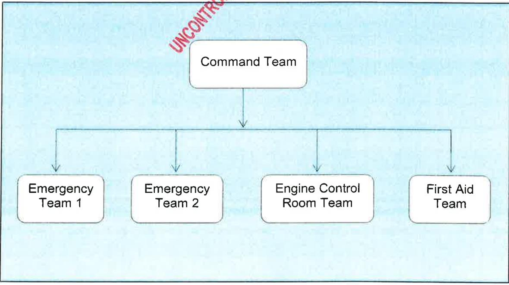

4. Guide non-crew personnel to sa

The Safety Officer must modify this organisation (Muster List) to add/delete persons in each team depending upon the manning strength and the particulars of the Muster List shall be approved by the Master and kept updated by the Safety Officer.

The vessels complement should be divided into teams. Each group in the emergency organisation should have a designated assembly point for receiving instructions and being delegated further duties.

Muster List & Emergency Instructions shall be prepared as per SOLAS Chapter III - Regulation 37.

{499}------------------------------------------------

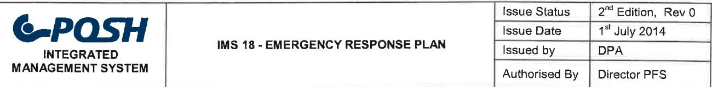

10.5.2 Emergency Teams: On board organisation may consist (where practicable) of five teams :

#### Command Team 1.

Command Team controls communications and the emergency organisation; it is directly responsible for taking mitigating action during emergency. The command centre should have means of internal and external communication, though it is preferable to have bridge as command team location but it may vary depending on nature of emergency. The Command team is headed by the Master.

#### 2. Emergency Team 1

This should be under the command of the Chief officer! Deck / Safety Officer and should assess the situation and report to the command centre, advising what action should be taken and what assistance should be provided.

#### Emergency Team 2 3.

At all times stand by to assist the emergency squad as instructed by the command centre and provide back-up services & equipment as well as preparing life-saving and fire-fighting equipment

# 4. Engine Control Room Team

This team should be under the command of the Chief Engineer and should provide emergency assistance as instructed by the command centre.

#### 5. First Aid Team

This team shall at all times on standby with stretcher and first aid kits to attend the casualties, if any, keeping the command centre informed of the condition of casualties and responsible for providing first aid treatment.

# 10.5.3 Duties of Emergency Organisation S

The Command Team is responsible for command and control of the emergency situation and for ensuring an efficient muster of personnel. They will institute search for any person not accounted for. The Command Team will establish internal and external communications,

On hearing the alarm, the Command Team will muster location (as allocated). The Master should direct the Emergency Teams to provide information relating to the emergency. The Master will assess the situation from the reports received from team leaders. The information received and directions given by the Master must be timed and recorded.

The Master will direct the Emergency Teams, on specific action to be taken. In emergencies relating to machineries, and the machinery space itself Emergency Team 2 will spearhead the emergency response actions, under the direction of the Master, and Emergency Team 1 will provide back-up. In all other emergency situations, Emergency Team 1 will be spearhead team and Emergency Team 2 will be the back-up team.

To assist the Master to formulate an action plan to tackle the emergency at hand, this manual provides handy check-lists for various emergencies.

The Emergency Teams must first muster and report to Command Team. They should prepare equipment as ordered and report readiness. The emergency team shall take all necessary steps to control the emergency under the orders of the Command Team.

The Engine Control room team should muster at a designated location and advise their readiness to the Command Team. They should also provide logistic support to the Emergency Teams, when ordered.

The Chief Engineer must advise the Master of the state of readiness of machineries needed to tackle the emergency. The Chief Engineer should establish whether the emergency has any adverse effect on the operation of the plant, and determine any action to be taken to reduce illeffects. The team should maintain essential emergency services and attend to fixed fire-fighting appliances as necessary. In fire emergencies involving the engine room, Chief Engineer must ensure remote shut-offs and fuel-oil trips are operated when directed by the Command Team.

{500}------------------------------------------------

#### 10.6 Information Availability

The following information should be readily available to any personnel directly involved with emergency situations:

- V Emergency Response Plan and other relevant manuals
- · Ballast quantity & distribution onboard
- V The location of any hazardous substances
- / General arrangement plan
- Main piping plans
- Safety plan showing locations of life saving and fire fighting equipment
- / List of persons on board
- V Damage control plan

Permanent displays of the location of fire fighting equipment, lifesaving appliances, and Muster List should be in prominent locations throughout the accommodation.

These items, for the benefit of seaboard personnel and shore fire fighting teams, should be kept available in a suitable container located outside the accommodation or near the access point when the vessel is alongside a terminal.

All the above information should be updated whenever a change has been made.

# 10.7 Internal Communication

Whenever an emergency occurs, it is important to have an efficient internal communications between the Command Team, and other teams, the following are typical examples of internal communication systems.

- Telephone
- VHF/UHF Portable Transceiver Radio (Walkie-Talkie)
- V.H.F.
- Talk-Back Systems

Every effort should be made to utilise all systems available during drills so as to familiarise all Seafarers with their use.

It must also be borne in mind that no matter how efficient the communication system is on any particular vessel there will be an occasion when there is a complete communication failure and it will be necessary to rely on messengers using word of mouth. In order that this eventuality is allowed for in the vessel emergency plans, it is recommended that an occasional drill be held where total reliance is placed on messengers for communication purposes.

# 10.8 Initial Actions by Ship's Staff

The person who discovers the emergency must raise the alarm and pass to the Master as much information as possible as to the type and location of the emergency. The Master, in turn will alert the emergency organisation. The persons first identifying the emergency should attempt immediate measures to deal with the emergency until he is relieved by the Emergency Team.

In addition to the vessels fire alarm, the signal should be supplemented by a series of long blasts on the vessels horn/bell, if the vessel is alongside a terminal.

# 10.8.1 Identification of an Emergency

An individual should respond in the following manner on discovering an emergency:

- / Raise the alarm
- Provide the Command Team with as much information as possible.
- If safe, attempt to control the emergency, otherwise retreat to Muster station

{501}------------------------------------------------

# 10.8.2 Raising the Alarm

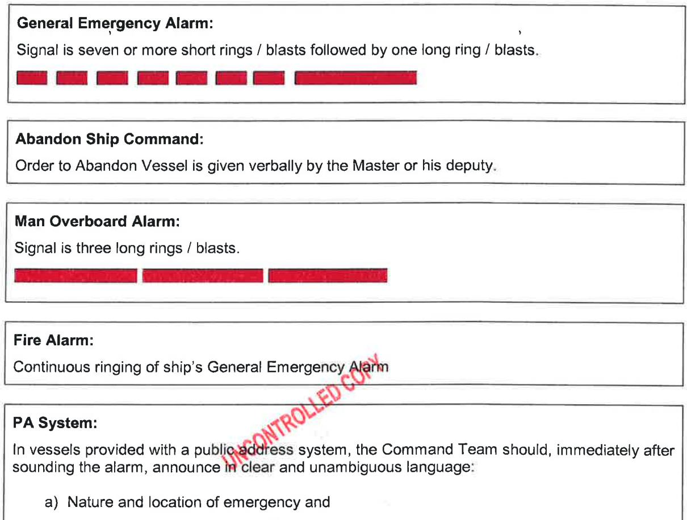

# 10.8.3 Initial Response by on board personnel

b) Instructions for emergency actions

Irrespective of whether the vessel is offshore or in port, on hearing an emergency alarm all the vessels staff should muster at the designated Muster Stations. This ensures that available resources are known and missing persons identified. A maximum state of readiness is promptly established and a standardised response to the emergency is achieved, allowing for co-ordinated and controlled remedial action.

The initial response required from all personnel on hearing the emergency alarm should be:

- ✓ Dress in coverall / long trousers with long sleeves shirt, safety shoes /normal shoes (No sandals, flip flops).
- Collect life jacket and proceed to Muster station

# 10.9 External Communication

External communication tools may include Satellite Phones, where applicable VHF and MF / HF Radio.

Any method of communication may be used when a vessel is in peril. If power supply is available satellite communication may be the most rapid way of establishing contact. At short or medium ranges person to person radio telephone contact may be the most effective. Governments and Coastal State agencies, in many parts of the world, require the use of VHF radiotelephony. If the main and reserved radio equipment is unavailable, effort should be made to relay messages through vessels or shore stations in the vicinity using, for example, battery powered emergency sets

{502}------------------------------------------------

Reports should be transmitted either:

- to the nearest Maritime Rescue Co-ordination Centre (MRCC) satellite communication system,
- v if the vessel is not within reach of an MF or VHF coast radio station, to the most appropriate HF coast radio station or relevant maritime satellite communication system; or
- When the vessel is within or near to an area where a vessel movement reporting system has been established, to the designated radio station of that system.

To obtain priority when transmitting messages by radio to stations or vessels within range, the master should use the appropriate prefix signal to indicate that his message concerns distress (MAYDAY), urgency (PANPAN) or safety (SECURITE).

# 10.9.1 Reporting to Shore Authorities

When the vessel is involved in an incident which:

- severely threatens safety of life at sea,
- < severely endangers safety of vessel,
- < involves discharge or threaten discharge of harmful substances resulting from damage to vessel or its equipment,

The Master should report details of the includent without delay to the nearest coastal state by means of the fastest communication channel available to him. In the absence of any prescribed format by the coastal state, the initial report to be sent to the government of the coastal state should be in the format provided in the appendix.

The Master is required to report the incident to the nearest coastal state(s) if any possibility of coastal pollution or danger to navigation exists or the vessel needs assistance,

# 10.9.2 Reporting to the Company

All emergencies must be reported immediately to the company DPA who will alert the Shore Response Team.

# 10.10 Record Keeping

Depending on the circumstances and seriousness of the case, authorities conducting relevant investigation may require testimony/objective evidence of onboard personnel.

Courts of inquiry, legal claims, hearings, may not take place until many months after the event, at which time the Master and some or all of the Seafarers who were on board at the time of the incident may have left the vessel, therefore, it is essential that all facts are accurately recorded at the time of the incident or shortly thereafter, including any type of evidence (i.e. SVDR, photos and video where possible).

Courts of inquiry, legal claims and hearings may not be conducted before some time (possibly several months) have elapsed and, by that time, some of personnel onboard at time of incident may have left particular vessel or company.

Entries in Log Books and other pertinent documents, whether official or not, must be accurate, factual and indisputable. All Log Books and documents are to be completed in ink and in neat and legible writing. Erasures, blanks or other incorrect entries rendered invalid through interference will not be accepted. The only acceptable method is the following:

- a) Rule through the incorrect entry by a single straight line and initial in the margin.
- b) Make the correct entry and initial again.

No entry shall be made by the Seafarers until it has been verified by Master & Chief Engineer respectively. Log Book entries relevant to either actual or suspected damage must always contain the entry "Full extent of damage to vessel: unknown".

{503}------------------------------------------------

| Issue Status  | 2nd Edition, Rev 0 |
| ------------- | ------------------ |
| Issue Date    | 1st July 2014      |
| Issued by     | DPA                |
| Authorised By | Director PFS       |

# 11. DRILLS AND EXERCISES S 1 1 1 1 1 1 1 1 1 1 1 1 1

Proper planning, preparation and training of both shore based personnel and vessel Seafarers are the tools to prevent serious incidents / accidents. Prevention is always preferable to reaction.

Nevertheless the Company must be in a position to respond at any time to hazards, accidents / incidents and emergency situations involving its vessels. In order to achieve that, both vessel and office personnel must be ready to effectively confront adversity.

Emergency preparedness procedures define how the vessel and company identify, describe and respond to potential vessel emergencies.

Vessel's personnel should be familiar with the company procedures for emergencies, their assigned duties, responsibility & authority and the use of related equipment.

Drills and exercises (meaning a simulation, to a degree, of real emergencies) are carried out to:

- Increase the standard and speed of response to potential emergency situations on board.
- Improve Seafarer's awareness of the potential hazards facing themselves and the vessel.
- / Ensure that personnel develop and retain familiarity with the equipment and company procedures.
- Identify Seafarers training needs.
- · Exercising Company's emergency plans including communication and reporting procedures.

#### 11.1. Master is responsible to:

- V Ensure that mandatory and voluntary drills are carried out as required,
- > Ensure that all personnel onboard are familiar with their assigned duties and associated equipment.

# 11.2. Designated Safety Officer is responsible to:

- Monitor participation.
- Carry out proper execution of drills.
- Train subordinates as required.
- Provide feedback to senior management onboard with comments or recommendations.

All Seafarers on board are required to actively participate in drills and exercises and be familiar with their emergency duties & location / operation of LSA / FFA.

Emergency drills should be realistic in nature and endeavor to replicate real life emergency situations, as far as practicable without endangering personnel and vessel.

# 11.3. Attendance

Drills onboard vessel shall be attended by all Seafarers that are not on watch and all passengers.

Upon reporting to stations, as assigned in "Muster List", participants shall be checked off the list of personnel on board. Unjustified non-attendance at drills constitutes grounds for disciplinary action.

# 11.4. Frequency and Planning of Drills and Exercises

Emergency drills and exercises should be carried out at intervals required by international conventions (e.g. SOLAS), and Flag State regulations.

Emergency Drills Planner is provided for guidance and compliance. Drills and exercises shall be properly recorded in Deck Log Book.

Fire and Abandon Ship drills shall take place within 24 hours of the crew arrival at mooring position or port departure, if more than 25% of the Seafarers have not participated in previous abandon

{504}------------------------------------------------

| Issue Status  | 2nd Edition, Rev 0 |
| ------------- | ------------------ |
| Issue Date    | 1st July 2014      |
| Issued by     | DPA                |
| Authorised By | Director PFS       |

ship and fire drills.

Certain types of drills and exercises relevant to oil pollution are practiced at regular intervals.

In addition to the mandatory drills, emergency drills covering all identified emergencies should be conducted to test the effectiveness and clarity of emergency plans, and to develop the confidence and competence of the personnel who may be involved in actual emergencies.

Planning of drills and exercises is the responsibility of the Master of each vessel. In doing this the Master should consider the particular Seafarer training needs, the nature of the operations carried onboard and client participation.

If a full statutory drill is not held within the appointed time, an entry shall be made in the log-book stating the circumstances and the extent of the muster, drill or training session held.

# 11.5. Unannounced Drills and Exercises

Port State, Administration, company or charterer may request the Masters to participate in unannounced (without prior notice) drill or exercise.

# 11.6. Preparation for Drill and Exercises

Preparation for drills is the responsibility of the designated Safety Officer in co-ordination with the Master.

Preparation is essential for the achievement of the required levels of readiness to respond to emergencies.

The drills should be in line with the Company's emergency response plans in order to convert these plans into practice and check whether they are effective, practical and comprehensible.

The drill scenarios in this manual do not cover every identified emergency situation. The designated Safety Officer should use these scenarios as a framework to prepare for each particular drill.

Prior to a drill the Master should convene with the Bosun and the Chief Engineer, if required, in order to identify any problem which may affect the proper execution of the drill.

# 11.7 Participation of the Company & Third Parties

Where it makes sense, the Company's shore organisation should be integrated into the drill to practice communication and collaboration between vessel and shore. In addition, certain companyinitiated drills to test the Emergency Response Team procedures and train its members shall be carried out. Such drills will be initiated by the DPA.

It is also recommended that third parties (e.g. Charterers, Authorities, Support Vessels) be requested to participate in some of the emergency drills.

The participating Company or third party personnel are to be notified well beforehand.

During an emergency drill, the Vessel Master must exercise the reporting and communication procedures, as laid down in company procedures and in the vessel's SOPEP.

In any communication to external parties, verbal or written, it must be made very clear that it is an exercise and not a real emergency.

# 11.8. Drills and Exercises Review

Following the drill, all participants get together for a review. This review shall take into account following:

- Objectives and expected competency are achieved. -
- Re-evaluate the training needs to suit the crew and job requirements. ii.
- Enable proper feedback on the adequacy of the drill to the Company. iii -

The designated Safety Officer summarises and comments on the effectiveness of the measures. Every participant must have the opportunity and be encouraged to report on bottlenecks and mistakes and to make proposals for improvements.

{505}------------------------------------------------

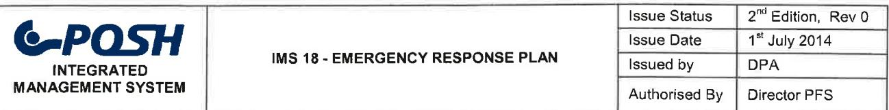

These remarks and proposals or suggestions made are recorded by the designated Safety Officer.

The results of the drills are discussed in the next safety meeting the effectiveness of the emergency response plans and the applied drill scenario shall be examined and commented. Weak or possible improvement areas, mistakes made during the drills and any Seafarers training needs should be identified. Minutes of these minutes shall be kept by the designated Safety Officer.

Any proposed modification of an emergency plan is to be recorded by the designated Safety Officer and communicated by the Vessel Master to the DPA.

#### 11.9. Training Needs

The Master shall continually assess professional capabilities of personnel. Those whose professional capabilities could be improved by supplemental training, they should be provided opportunities to learn.

# 11.10. Drills and Exercises Records and Reporting

Records of all emergency drills and exercises conducted on board should be maintained in the deck log book and DRILL REPORT.

Every month, the Master must submit to Head Office, a full list of all emergency drills carried out as per the drill planner.

Company of the contraction of the superior contraction of the superior

# 12. NOTE OF PROTEST

When another vessel or structure has caused, or may have caused, any damage to a company vessel, a "Note of Protest" may be executed,

A Note of protest shall be prepared and processed within 24 hours of Incident. It shall include extracts from Deck Log Book (being an accurate record of all conditions and occurrences experienced).

Notes of Protest shall be noted before appropriate consul or notary public as and when advised by head office.

Original copy acknowledged by the recipient shall be retained on board and copy sent to head office.

#### 12.1. Acceptance of Liability

Should the Company's vessel be involved in a collision with another vessel, the Master, the owner or the agent of the other vessel must be held responsible in writing for all damages and/or losses sustained by the parties having lawful interest in the Company's vessel.

An acknowledgement of receipt of such letter should be obtained. Receipt of a similar letter from another vessel, or from a shore installation involved in the incident should be acknowledged as follows:

# "Signed for receipt only and not as an admission of liability".

When any damage is sustained by or inflicted on another offshore installation, vessel or a shore installation, the Master should ensure, through the agent, that the Master or agent of the other vessel or the representative of the shore installation, as the case may be, is invited to attend the damage survey of his vessel and to agree to the extent of such damage.

Likewise, the Master, through the agent, should ensure that the surveyor acting on behalf of the Company should be present at the damage survey of the other offshore installation, vessel or shore installation.

# 12.2. Restriction of Information

No statement or declaration should be made to any person until advice has been received from the Company, In each and every case that the Master has no option other than to issue or provide a Port or other Authority with a statement or report, on any such statement or report he shall add the following:

# "Submitted without prejudice and not as an admission of liability"

{506}------------------------------------------------

# 13. DOWN MANNING GUIDELINES GUIDELINES GUIDE

A vessel may require down manning of non essential personnel during conditions, but not limited to:

- > LSA equipment is compromised (lost/damaged)
- V Heavy weather
- V Onboard emergencies
- V Idle, Off hire or layup period
- Involved in search and rescue or assisting others in emergency
- Involved in salvage operation
- Under security threat
- Outbreak of epidemic (disease) on board
- Limited source and stock of provisions and water

# 13.1 Identification of Non-Critical Staff

For down manning purpose, Master shall identify non critical staff for evacuation in consultation with management and charterer, Oritical staff required for safety of vessel and personnel shall be retained. Few examples of non essential personnel as below:

- / Nonessential Contractors
- Nonessential Sub Contractors
- V Local Workers
- > Family Members
- And any other persons not on the final Crew / Passenger list.

#### 13.2. Risk Assessment

A detailed risk assessment shall be conducted between all involved parties before down manning the vessel.

{507}------------------------------------------------

| Issue Status  | 2nd Edition, Rev 0 |
| ------------- | ------------------ |
| Issue Date    | 1st July 2014      |
| Issued by     | DPA                |
| Authorised By | Director PFS       |

# CONTENTS

- 1. PURPOSE
- 2. SCOPE
- 3. LOCATION OF COMPANY SHORE RESPONSE TEAM COORDINATION CENTRE
- RESPONSIBILITY 4..
- 5. EMERGENCY RESPONSE LEVELS
- 6. COMMUNICATION & REPORTING

#### 7. CRISIS MANAGEMENT

- 7.1. Communication with the the Media
- 7.2. Responding to the Media

#### 8. EXTERNAL SUPPORT SERVICES

- 8.1. Medical Support
- 8.2. Emergency Exercises

#### 9. SHORE BASED EMERGENCY RESPONSE PROCEDURES

- 9.1. Shore Response Team Organisation
- 9.2. Criteria For Activation Of Shore Response Team
- 9.3. Activation Process
- 9.4 Responsibilities

#### SHIPBOARD EMERGENCY RESPONSE PROCEDURES 10.

- 10.1. General
- 10.2. Master's Responsibility
- 10.3. Initial Shipboard Response by Master
- 10.4 Initial Notification
- 10.5. Shipboard Emergency Organisation
- 10.6. Information Availability
- 10.7. Internal Communication
- 10.8. Initial Actions by Ship's Staff
- 10.9. External Communication
- 10.10. Record Keeping

#### DRILLS 11.

- 11.1. Master's Responsibility
- 11.2. Designated Safety Officer Responsibility
- 11.3. Attendance
- 11.4. Frequency and Planning of Drills and Exercises
- 11.5. Unannounced Drills and Exercises
- 11.6. Preparation for Drills and Exercises
- 11.7. Participation of the Company and Third Parties
- 11.8. Drills and Exercises Review

{508}------------------------------------------------

11.9. Training Needs

11.10. Drills and Exercises Records and Reporting

#### 12. NOTE OF PROTEST

- 12.1. Acceptance of Liability
- 12.2. Restriction of Information

#### 13. DOWN MANNING GUIDELINES

- 13.1. Identification of Non-Critical Staff
- 13.2. Risk Assessment

# Appendices

- A. Initial response Form
- B. Sitrep Form
- C. Emergency Drill Matrix
- D. DP Drill Matrix
- E. Drill Report
- F. Abandon Ship Muster List Sample
- G. Emergency Muster List Sample
- H. Emergency Contingency Plan
- l. Note of Protest
- J. Note of Sea Protest (Notarised)
- K. Emergency Response Checklists :

| K1  | Abandon Ship                                    |
| --- | ----------------------------------------------- |
| K2  | Collision                                       |
| K3  | Grounding                                       |
| K4  | Fire and Explosion                              |
| K5  | Structural Failure                              |
| K6  | Main Engine Failure                             |
| K7  | Medevac                                         |
| K8  | Helicopter Evacuation                           |
| K9  | Spillage - Pollution                            |
| K10 | Steering Gear Failure                           |
| K11 | Gyro Failure                                    |
| K12 | Enclosed Space Rescue                           |
| K13 | Ingress of Water                                |
| K14 | Man overboard                                   |
| K15 | Search & Rescue – Survivors Requiring Attention |
| K16 | Loss of Tow                                     |
| K17 | Piracy / Terrorist Incident                     |
| K18 | Main and Emergency Electrical Power Failure     |
| K19 | Cargo Shifted                                   |
| K20 | Cargo Jettison                                  |
| K21 | Machinery Space Rescue                          |
| K22 | Serious Injury                                  |
| K23 | Hazardous Material Release                      |
| K24 | Noxious Liquid Release                          |
| K25 | H2S Release                                     |
| K26 | Helicopter crash/ditching                       |

WROLLED

{509}------------------------------------------------

| Issue Status  | 2nd Edition, Rev 0 |
| ------------- | ------------------ |
| Issue Date    | 1st July 2014      |
| Issued by     | DPA                |
| Authorised By | Director PFS       |

#### Purpose and 1 - 110

- 1.1. SR MARINE Fleet Services Pte. Ltd. has developed this Emergency Response Procedure (ERP) which is applicable to all Company vessels and provides guidance to assist the vessel's Master and operational personnel in dealing with all aspects of emergencies. This ERP Manual contains information to handle an emergency and to take the necessary actions to stop or minimise damage and to mitigate the effects of an emergency.
- 1.2. This ERP also addresses the upward notification and reporting to the Company Senior Management and other relevant Company personnel. The notification and reporting is through the DPA and/or alternate DPA.
- 1.3. This ERP is authorised by the Director SR MARINE Fleet Services (PFS) who authorises the designated DPA to act as the link on matters of safety between the Fleet and senior management.

# 2. Scope Scope I L . Scope 1 1

- 2.1 . This ERP addresses the safeguarding of life & property, the minimisation of environmental impact and ensuring as far as possible the continuous safe operation of the vessel in the event of an onboard emergency.
- 3. Location of Company Shore Based Response Team Coordination Centre and Company

The Shore Response Team Coordination Centre is located at the below-mentioned Shipyard Road address and will be convened in as and when necessary.

# SR MARINE Fleet Services Pte Ltd 59 SHIPYARD ROAD, JURONG SINGAPORE 628143

The alternate Shore Response Team Coordination Centre will be convened as and when necessary in the Head Office Meeting Room at:

# 1 KIM SENG PROMENADE #06-01 GREAT WORLD CITY SINGAPORE 237994

{510}------------------------------------------------

| Issue Status  | 2nd Edition, Rev 0 |
| ------------- | ------------------ |
| Issue Date    | 1st July 2014      |
| Issued by     | DPA                |
| Authorised By | Director PFS       |

# 4. RESPONSIBILITY

- 4.1 an event of an emergency involving a company vessel (or tow), the Master is fully in-charge of all shipboard operations. The Master's priority will focus on the safety of personnel and vessel and to take actions to prevent the escalation of the emergency. Subject to the exigencies of the incident, an immediate initial verbal notification to the DPA (or the alternate DPA) must be initiated at the earliest opportunity (within 30 minutes) in order to enable the DPA to assist the vessel in handling the emergency.
- 4.2. The DPA will inform the senior management including Corporate legal and Insurance Department. This is to ensure that the senior management are appraised of the situation and any advice from Legal and Insurance department is complied with in order to protect the vessel's and the Company's interests.
- 4.3. The ERP is for handling emergency situations using whatever resources and assets that are available. When necessary, DPA will activate the Shore Response Team (SRT). The Shore Commander (Overall in-charge of the SRT) will assess the emergency and determine the response level. Assets from the company and/or third party assets where available and applicable may then be mobilised to assist the distressed vessel depending on the response level and advice from the SRT members.
- 4.4. All company assets will fall under the control of the Shore Commander. External assets such as government vessels may not fall under the control of the Shore Commander but, where possible, a link will be established between the distressed vessel and the non-company assets.
- 4.5 On scene, the Master (or his designated or the designated On-Scene Commander will be fully incharge of the emergency response operation. Where available, all assets will assist the vessel as required.
- 4.6 Where it is necessary for personnel evacuation from a Company vessel at sea, refer to the International Aeronautical Martime Search and Rescue (IAMSAR) Manual for guidance in coordination with Maritime Rescue assets and Maritime Rescue Coordination Centre (MRCC).

# 5. EMERGENCY RESPONSE LEVELS

- 5.1. The ERP uses the concept of tiered response. The response level is divided into 3 levels of response, (level 1, 2, and 3) to classify the severity of the emergency. These response levels also provide an indication to the resources to be mobilised and deployed. However, this is subject to the availability of assets from within the company and external parties' involvement.
- 5.2. The following response levels would be used to determine the severity of the emergency and the resources to be mobilised and deployed :

Level 1: This is for an emergency where the situation is controllable and can be managed effectively by utilising the vessel's own capability and on-board resources.

Level2: This requires a combination of the vessel's own capability and the support of additional company assets, where available. At this level, the emergency may have serious consequences to lives, property, environment and assets. The situation may be contained by company assets or sub-contracted on-site resources.

Level3: This response requires a full turn-out of all resources: from own vessel, support of additional company assets (if available) and the involvement of third parties and government response organisations. In this level, the emergency is threatening to affect or has affected lives, environment or assets that may warrant evacuation of the crew.

{511}------------------------------------------------

|     | Issue Status  | 2nd Edition, Rev 0 |
| --- | ------------- | ------------------ |
|     | Issue Date    | 1st July 2014      |
|     | Issued by     | DPA                |
|     | Authorised By | Director PFS       |

# 6. COMMUNICATION & REPORTING

6.1. In'all emergencies, the DPA MUST be informed and all emails must be copied to the appropriate Operations Department Superintendent and the and the HSEQA email group (hseq@paccoffshore.com.sg) so that the senior management are fully informed of developments.

6.2. Emergency Contact List: Every vessel will be provided, thru circular, with latest Emergency Contact List from office, which will be amended as and when changes take place. The Master shall clearly display the emergency contact list on the bridge with a copy also displayed in the Engine room.

The Emergency Contact List will also be available in the Shore Response Team Coordination Centre.

As and when applicable, Vessel with Charter's emergency contact list for the current project, which shall be clearly displayed on bridge next to the SR MARINE contact list.

- 6.3. The DPA (or his designate) will be the key person ashore in handling the response operation. If necessary, he will communicate directly to and from the vessel, although keeping the appropriate Divisional Director, SR MARINE Semco informed. Where vessels are involved in project work where there is a Project ERP, the DPA will also work in liaison with the Project Director or his designate.
- 6.4. The Initial notification Checklist will be initially used in disseminating of information from the vessel to the SRT. This will provide the essential information that is required for SRT to work out a suitable plan to assist the vessel.
- 6.5. Communication with External Parties (other than media): If the nature of the emergency involves external government agencies or other assisting vessels rendering assistance to the vessel, the on-scene Commander should establish communications with the external parties.

{512}------------------------------------------------

| Issue Status  | 2nd Edition, Rev 0 |
| ------------- | ------------------ |
| Issue Date    | 1st July 2014      |
| Issued by     | DPA                |
| Authorised By | Director PFS       |

# 7. CRISIS MANAGEMENT

7.1 Communication with the Media: Depending on the nature of the emergency, it may potentially generate great interest with the general public. Contacts with the media are the responsibility of the Director PFS (or designate) in consultation with the SR MARINE Semco Divisional Director. If necessary, a Team of Company Management Personnel will be convened to address media issues, including press releases, press conferences etc. This Team may include but not be limited to appropriate representation from PFS and SR MARINE Semco.

#### 7.2 Responding to the Media

# a. Preparation of Policy Statements

When preparing policy statements, the following general principles should be considered :

- · When responding to a crisis situation, the response should be honest, timely and direct. Having a prepared, approved and distributed policy statement will help to resist the temptation to say "no comment" which may result in the company appearing to be uncooperative or secretive during a crisis situation.
- · Do the right thing, being fair to all parties to the best of your ability.

# b. Preparing Specific Responses (such as Press Releases)

After a crisis scenario has been identified, specific responses should be prepared,

Consider the following checklist when drafting press releases :

- · Define the scope of the crisis local, regional, national or international,
- · Establish a unified response one spokesperson established to distribute statements to the media, etc.
- · Keep the message simple, clear, consistent and tailored to each audience.

Understand that the media wants primarily to know three things :

- what happened? .
- . why did it happen?
- · what are you going to do to make sure that it never happens again?

In addition to the policy statements & press releases, anticipate media questions that may be asked.

List the questions with developed answers that the crisis team is comfortable with and continually update the list as new questions are identified. Team members should have immediate access to each other at all times in the event of a crisis.

Finally, the news media must be briefed on a regular basis. All phone calls from the media must be answered quickly and completely. Keep media logs listing the date and time, source, reporter, phone number and the questions asked.

Stick to your core message and deliver that message to everyone. Bear in mind that Social Media issues may also need to be similarly addressed.

{513}------------------------------------------------

| Image: SR MARINE logo |     |
| --------------------- | --- |
| INTEGRATED            |     |
| MANAGEMENT SYSTEM     |     |

| Issue Status  | 2nd Edition, Rev 0 |
| ------------- | ------------------ |
| Issue Date    | 1st July 2014      |
| Issued by     | DPA                |
| Authorised By | Director PFS       |

Supportion of Corporation Corporation of Concerners of Concessional Comparison of Concessional Comparison of Concerner of Concerners of Concessional Concerners of Concessiona

{514}------------------------------------------------

# c. Post - Crisis Review

The crisis management process does not end once a crisis has occurred and been resolved.

Each situation should be carefully evaluated in terms of:

- the media coverage received .
- · the resulting image of the Company
- · the development of short and long term programmes to rebuild image
- · reviewing position statements for relevance and necessary revisions.

# 8. EXTERNAL SUPPORT SERVICES

#### 8.1 Medical Support

In addition to the standard Radio medico advice available through GMDSS, SR MARINE has a contracted support arrangement with shore-based Healthcare Service Providers in Singapore to provide medical support to all its employees, both shore-based and seagoing,

The services provided include real-time medical advice whereby the Master of a vessel can correspond or even speak directly with the Duty Medical Practitioner, especially in urgent cases of injury or illness where delay could cause further deterioration in a patient's condition.

Regular contact is maintained between the Crewing Department and the shore-based Healthcare Service Providers in Singapore to ensure the contacts remain current.

#### 8.2 Emergency Exercises

A table top exercise between Shore and Ship shall be conducted at least once a year to ensure adequate response at any time to hazards, accidents and emergency situations on board ships.

Such exercises may involve external parties (e.g. Port State, Flag State) and, on completion of the table top drill, an analysis shall be conducted and respective flag state forms completed if so required.

The exercise will be coordinated at the head office by SRT with a designated vessel.

{515}------------------------------------------------

| Issue Status  | 2nd Edition, Rev 0 |
| ------------- | ------------------ |
| Issue Date    | 1st July 2014      |
| Issued by     | DPA                |
| Authorised By | Director PFS       |

# 9. SHORE BASED EMERGENCY RESPONSE PROGEDURES

#### 9.1. Shore Response Team Organisation

9.1.1. SR MARINE Fleet Services adopts an effective and efficient Shore Response Team (SRT) structure for dealing with any major marine emergency. In the event of an emergency, the SRT will be formed under the direction of Director PFS.

# Shore Response Team Structure

# 9.2. Criteria for Activation of Shore Response Team

- 9.2.1 During any emergency, the Director PFS will advise on the need to activate the SRT, based on these following criteria:
  - ✓ Possible escalation to serious injury / loss of life
  - Possible escalation to environmental damage
  - Possible escalation to serious damage or loss of vessel

#### 9.3. Activation Process

- 9.3.1. The following processes make up the activation and response to the emergency:
  - V Notification. DPA, in liaison with the Director PFS will notify the SRT of the emergency,
  - Activation. SRT members are first alerted by DPA of the emergency so that they can prepare and be ready to mobilise any available resources and assets. SRT members will report to Shore Response Team Coordination Centre as soon as possible.
  - · Mobilisation. Depending on the response level (2 or 3), the required resources and assets may be mobilised and deployed depending on the needs. If the situation warrants external assistance (Response Level 3), external parties will be notified accordingly.
  - · Response Action. The actual handling of the emergency onboard falls under the responsibility of the Master (or his designate). SRT will assist as necessary but should not override the authority of the Master (or designate).

{516}------------------------------------------------

#### 9.4 Responsibilities

- 9.4.1 Planning of the shore response is the responsibility of the Shore Commander but involves the participation of the Master and SRT members as necessary. As such the responsibilities of the team members are as follows:
- 9.4.2. DPA is the first line of response in SRT and responsible for the following:
  - Reviewing this plan and the relevant appendices, during management review meetings, in co-ordination with the other senior management review members.
  - V To direct and execute drills for the SRT to train members and verify the effectiveness of the Shore Emergency Response procedures.
  - > To ensure notification/assembly of the SRT members as required by the type of Emergency.
  - Preparation, maintenance and updating of the Emergency Response Plan.
  - Preparation, introduction and maintenance of a training/drills program in the tasks which form part of the plan.
  - > To ensure that the Company's Emergency Response Centre is properly equipped and ready to function as may be required in case of an emergency.
  - V Notifying all concerned parties regarding the nature of the incident and other necessary information.
  - · Ensuring that all log and record keeping is done properly,

#### Director PFS 943.

- To be available to make the necessary decisions,
- In consultation with DPA and/or Master, he will decide what level of response is warranted.
- · He is responsible for coordinating with the different departments involved at each response level.
- · He is responsible for deciding if the incident response team and/or pollution response team are to be mobilised.
- If required, he will request for external parties or Corporate assistance.
- · He is responsible for liaising with appropriate Director, SR MARINE Semco and Corporate Personnel for any press matters.

#### 9.4.4. Shore Commander

- V Usually the DPA or as otherwise nominated by the Director PFS and is the overall leader of the Shore Response Team.
- V He should be available at all times during any incidents to advise the Master.
- Allocating the necessary resources and personnel to protect the safety of the vessel and crew.
- Authorising the mobilisation of the appropriate response resources.
- Any enquires from the media should be referred to the Director, PFS and SR MARINE Semco.

{517}------------------------------------------------

#### 9.4.5. Operations Coordinator

- The Operations Manager or his designate would assume this role during an emergency,
- V The Operations Manager will co-ordinate and assist as required by the Shore Commander.

#### 946 Technical Services Advisor

- Advice on technical matters.
- Ensuring that appropriate and timely advice is given to Master / Chief Engineer.
- V Ensuring that all necessary (provisional or permanent) repairs are planned and carried out in a timely fashion.
- V Liaising with vessel's classification society.
- V Employment of Technical experts and/or repair teams.
- V Ordering and dispatching any emergency spares or stores required by the vessel. In ordering emergency spares or stores he has the authority to by-pass the Purchasing Department, although records must still be maintained.

# 9.4.7. Personnel Advisor

- GM Crewing Department or his designate would assume this role during an emergency,
- · Responsible for dealing with next-of-kin and relatives of crew involved in accidents.
- · Responsible for the hospitalisation and welfare of any crewmembers injured in an accident.
- V Responsible for seeking medical advice from the Company doctor when so requested by the Master or the Director PFS.
- Responsible for arranging medical evacuation.
- √ Responsible for informing the Flag State Administration of any accident involving crew injury.
- V Responsible for liaising with the immigration authorities for accidents involving survivors, and/or crew repatriation.
- √ Responsible for liaising with the authorities for the landing of any bodies recovered and/or bodies resulting from the fatal accident.
- Arranging relieves for any injured Seafarers and for the master in case the Barge Master is needed for formalities/interrogation by local authorities.

# 9.4.8. Marketing Advisor

- The Head of the Marketing Dept or his designate would assume this role during an emergency.
- V Responsible for dealing with contractual issues when external resources are being utilised to assist the distressed vessel.

{518}------------------------------------------------

| Issue Status  | 2nd Edition, Rev 0 |
| ------------- | ------------------ |
| Issue Date    | 1st July 2014      |
| Issued by     | DPA                |
| Authorised By | Director PFS       |

Responsible for liaising with the customers on the status vessel and tow.

# 9.4.9. Legal & Insurance Advisors

- The Heads of Legal and Insurance Dept, or their designates would assume this role during an emergency
- V Managing the legal and insurance aspects of the emergency, including informing P&I, H&M and machinery underwriters, Average adjuster as and when applicable.

# 9.5. Information to be Available to SRT:

The DPA is responsible to ensure that the following information is readily available and updated, so that it can be used by the ERT in case of emergency:

- Chart(s) covering the incident area.
- Appropriate drawings & manuals of each vessel (Technical Advisor).
- A copy of the List of Contacts (DPA).
- The telephone numbers of the various governmental offices, directorates etc. should also be at hand (National contacts of the vessel's SOPEP)
- Seafarers list, Seafarer data and next-of-kin (Crewing Manager)
- > Diplomatic missions of flag administration worldwide (DPA)
- List of contractors for technical assistance (Technical Superintendent)
- > List of P & I Club correspondents (Legal/Insurance)
- List of contacts for classification societies (Technical)
- > List of agents worldwide (Operations)
- Copy of Emergency Response Plan(DPA)
- Copy of SOPEP/SSP (DPA)

#### 96 Initial Actions of SRT:

- 9.6.1 Establish contact with vessel in emergency situation in order to verify and assess current situation and decide on appropriate course of action and to confirm following:
  - Channel of communication
  - Position of vessel
  - Details of incident
  - V Actions taken so far
- 9.6.2. Instruct vessel to transmit Initial Report, if not received, and that this report should be followed up by SITREP.
- 9.6.3. Advice the vessel to preserve and maintain the following essential documents, as apropriate:
  - V Notes of Protest
  - Statements of fact
  - > Deck log / Engine log original
  - Seafarers list

{519}------------------------------------------------

| Issue Status  | 2nd Edition, Rev 0 |
| ------------- | ------------------ |
| Issue Date    | 1st July 2014      |
| Issued by     | DPA                |
| Authorised By | Director PFS       |

- V Seafarer certificates copies
- V Photographs, if any
- > All communications with any other party during and immediately following the incident (VHF log, E-Mail / Telex Copies, GMDSS Log)
- ✓ Classification records.
- 9.6.4 Inform Company Representatives/ Agents nearest to the vessel, with an advice to establish contact with the vessel.
- 9.6.5 Inform, if and as required, following parties:
  - Salvage Association.
  - Charterer
  - Classification Society
  - Qualified Individual when vessel is in US/Panama territorial waters
  - Clean up contractor
  - ✔ Port authorities/ National contact

#### 9.6.6 Record Keeping

The ERT shall maintain a continuous record of all communications and advice relayed,

All reports, incidents, decisions, as they occur, should be recorded and attached, in chronological order, in the designated Incident Log.

Incoming and outgoing e-mails (and faxes / telexes if any) shall be reviewed as necessary, logged and subsequently filed.

Incoming and outgoing telephone calls shall be properly logged (time to be noted), preferably recorded on tape and the appropriate ERT members connected as necessary.

The following shall be retained for at least 7 years:

- < Initial communications details.
- All subsequent communications.
- > Log of events.
- / Press statements.
- Recording of important telephone conversations with vessel, if feasible,
- V SVDR data

{520}------------------------------------------------

# 10. SHIPBOARD EMERGENCY RESPONSE PROCEDURES

#### 10.1. General

10.1.1. The Master and OOW must be fully conversant with the emergency checklist and should know what initial action to take in response to emergencies. See all the emergency checklists contained in the Appendices.

#### Master Responsibility 10.2.

- 10.2.1, The Master is ultimately responsible for his crew, vessel and towltows at all times and in the event of an accident, he is in charge of the seaborne operation.
- 10.2.2. The Master has overriding authority and responsibility to make decisions, with respect to safety and pollution prevention and to request company's assistance, as may be deemed necessary.
- 10.2.3. The Master should ensure that a log of events is maintained, including any type of evidence (i.e. SVDR, photos and video where possible).
- 10.2.4. He is responsible for issuing any message to DPA, Operations Department, coast stations, coast guards, local authorities and ships in the vicinity and is to ensure that no messages are transmitted without his approval.
- 10.2.5. If necessary and in any doubt, he should seek advice from the DPA.
- 10.2.6. Any enquiries from the media should be referred to the Director PFS who will liaise with appropriate Director, SR MARINE Semco or his designate.
- 10.2.7. In the event of the Master not being able to fufil his duties and responsibilities, the next highest ranking officer shall take over the above responsibilities.
- 10.2.8. Nothing in this Manual or any other Company documentation is to be considered as a limitation of the Master's Authority to deal with emergencies.
- 10.2.9. At offshore, the responsibility for vessel emergency response rests with the Master and his operating management. Where a casualty occurs in territorial waters or port limits, the national authority / port authority and/or the client may be involved and the Master's and his operating management's freedom of action may be thereby constrained. This would be particularly so if the hazards relevant to the casualty could put third parties at risk. In these latter circumstances, contingency plans may need to be adapted quickly to take account of the requirements of the shore authorities. However, the basic considerations in these circumstances are still of the same nature as those when the vessel is offshore.

# 10.3. Initial Shipboard Response by Master

- 10.3.1. In an emergency which threatens the lives of the safety of the vessel or the marine environment (including oil spills), the Master must be aware of his responsibilities and actions to be taken to control the situation.
- 10.3.2. The Master's initial orders and the actions of the crew are vital to contain the best use of all resources and to prevent the emergency from escalating. Master's priority actions should take into consideration:
  - V Safety of life at sea;

{521}------------------------------------------------

| Issue Status  | 2nd Edition, Rev 0 |
| ------------- | ------------------ |
| Issue Date    | 1st July 2014      |
| Issued by     | DPA                |
| Authorised By | Director PFS       |

- < Avoidance of marine environmental pollution;
- Prevention of damage to the vessel:
  UNCONTRONTRONTRONTRONTRONTRON

{522}------------------------------------------------

| Issue Status  | 2nd Edition, Rev 0 |
| ------------- | ------------------ |
| Issue Date    | 1st July 2014      |
| Issued by     | DPA                |
| Authorised By | Director PFS       |

#### 10.4. Initial Notification

- 10.4.1 An immediate initial verbal notification to the DPA must be initiated at the earliest opportunity in order to enable the DPA to assist the vessel in handling the emergency.
- 10.4.2 If necessary, the Master may follow up the initial verbal notification by relaying the information to Operations Department using the Emergency Reporting forms to aid and speed up the flow of information exchange.
- 10.4.3. After the initial notification and response to the shipboard emergency, the Master must generate a formal incident/accident/near miss report and an investigation report and forward them to HSEQA Dept.

# 10.5 Shipboard Emergency Organisation

# 10.5.1 Emergency Organisation

An emergency organisation shall be established onboard for the event of an emergency. The purpose of the organisation will be to:

- 1. raise the alarm
- 2. locate and assess the incident and possible consequences
- 3. organise manpower and equipment in order to effectively deal with the various emergency situation

4. Guide non-crew personnel to sa

The Safety Officer must modify this organisation (Muster List) to add/delete persons in each team depending upon the manning strength and the particulars of the Muster List shall be approved by the Master and kept updated by the Safety Officer.

The vessels complement should be divided into teams. Each group in the emergency organisation should have a designated assembly point for receiving instructions and being delegated further duties.

Muster List & Emergency Instructions shall be prepared as per SOLAS Chapter III - Regulation 37.

{523}------------------------------------------------

10.5.2 Emergency Teams: On board organisation may consist (where practicable) of five teams :

#### Command Team 1.

Command Team controls communications and the emergency organisation; it is directly responsible for taking mitigating action during emergency. The command centre should have means of internal and external communication, though it is preferable to have bridge as command team location but it may vary depending on nature of emergency. The Command team is headed by the Master.

#### 2. Emergency Team 1

This should be under the command of the Chief officer! Deck / Safety Officer and should assess the situation and report to the command centre, advising what action should be taken and what assistance should be provided.

#### Emergency Team 2 3.

At all times stand by to assist the emergency squad as instructed by the command centre and provide back-up services & equipment as well as preparing life-saving and fire-fighting equipment

# 4. Engine Control Room Team

This team should be under the command of the Chief Engineer and should provide emergency assistance as instructed by the command centre.

#### 5. First Aid Team

This team shall at all times on standby with stretcher and first aid kits to attend the casualties, if any, keeping the command centre informed of the condition of casualties and responsible for providing first aid treatment.

# 10.5.3 Duties of Emergency Organisation S

The Command Team is responsible for command and control of the emergency situation and for ensuring an efficient muster of personnel. They will institute search for any person not accounted for. The Command Team will establish internal and external communications,

On hearing the alarm, the Command Team will muster location (as allocated). The Master should direct the Emergency Teams to provide information relating to the emergency. The Master will assess the situation from the reports received from team leaders. The information received and directions given by the Master must be timed and recorded.

The Master will direct the Emergency Teams, on specific action to be taken. In emergencies relating to machineries, and the machinery space itself Emergency Team 2 will spearhead the emergency response actions, under the direction of the Master, and Emergency Team 1 will provide back-up. In all other emergency situations, Emergency Team 1 will be spearhead team and Emergency Team 2 will be the back-up team.

To assist the Master to formulate an action plan to tackle the emergency at hand, this manual provides handy check-lists for various emergencies.

The Emergency Teams must first muster and report to Command Team. They should prepare equipment as ordered and report readiness. The emergency team shall take all necessary steps to control the emergency under the orders of the Command Team.

The Engine Control room team should muster at a designated location and advise their readiness to the Command Team. They should also provide logistic support to the Emergency Teams, when ordered.

The Chief Engineer must advise the Master of the state of readiness of machineries needed to tackle the emergency. The Chief Engineer should establish whether the emergency has any adverse effect on the operation of the plant, and determine any action to be taken to reduce illeffects. The team should maintain essential emergency services and attend to fixed fire-fighting appliances as necessary. In fire emergencies involving the engine room, Chief Engineer must ensure remote shut-offs and fuel-oil trips are operated when directed by the Command Team.

{524}------------------------------------------------

#### 10.6 Information Availability

The following information should be readily available to any personnel directly involved with emergency situations:

- V Emergency Response Plan and other relevant manuals
- · Ballast quantity & distribution onboard
- V The location of any hazardous substances
- / General arrangement plan
- Main piping plans
- Safety plan showing locations of life saving and fire fighting equipment
- / List of persons on board
- V Damage control plan

Permanent displays of the location of fire fighting equipment, lifesaving appliances, and Muster List should be in prominent locations throughout the accommodation.

These items, for the benefit of seaboard personnel and shore fire fighting teams, should be kept available in a suitable container located outside the accommodation or near the access point when the vessel is alongside a terminal.

All the above information should be updated whenever a change has been made.

# 10.7 Internal Communication

Whenever an emergency occurs, it is important to have an efficient internal communications between the Command Team, and other teams, the following are typical examples of internal communication systems.

- Telephone
- VHF/UHF Portable Transceiver Radio (Walkie-Talkie)
- V.H.F.
- Talk-Back Systems

Every effort should be made to utilise all systems available during drills so as to familiarise all Seafarers with their use.

It must also be borne in mind that no matter how efficient the communication system is on any particular vessel there will be an occasion when there is a complete communication failure and it will be necessary to rely on messengers using word of mouth. In order that this eventuality is allowed for in the vessel emergency plans, it is recommended that an occasional drill be held where total reliance is placed on messengers for communication purposes.

# 10.8 Initial Actions by Ship's Staff

The person who discovers the emergency must raise the alarm and pass to the Master as much information as possible as to the type and location of the emergency. The Master, in turn will alert the emergency organisation. The persons first identifying the emergency should attempt immediate measures to deal with the emergency until he is relieved by the Emergency Team.

In addition to the vessels fire alarm, the signal should be supplemented by a series of long blasts on the vessels horn/bell, if the vessel is alongside a terminal.

# 10.8.1 Identification of an Emergency

An individual should respond in the following manner on discovering an emergency:

- / Raise the alarm
- Provide the Command Team with as much information as possible.
- If safe, attempt to control the emergency, otherwise retreat to Muster station

{525}------------------------------------------------

# 10.8.2 Raising the Alarm

# 10.8.3 Initial Response by on board personnel

b) Instructions for emergency actions

Irrespective of whether the vessel is offshore or in port, on hearing an emergency alarm all the vessels staff should muster at the designated Muster Stations. This ensures that available resources are known and missing persons identified. A maximum state of readiness is promptly established and a standardised response to the emergency is achieved, allowing for co-ordinated and controlled remedial action.

The initial response required from all personnel on hearing the emergency alarm should be:

- ✓ Dress in coverall / long trousers with long sleeves shirt, safety shoes /normal shoes (No sandals, flip flops).
- Collect life jacket and proceed to Muster station

# 10.9 External Communication

External communication tools may include Satellite Phones, where applicable VHF and MF / HF Radio.

Any method of communication may be used when a vessel is in peril. If power supply is available satellite communication may be the most rapid way of establishing contact. At short or medium ranges person to person radio telephone contact may be the most effective. Governments and Coastal State agencies, in many parts of the world, require the use of VHF radiotelephony. If the main and reserved radio equipment is unavailable, effort should be made to relay messages through vessels or shore stations in the vicinity using, for example, battery powered emergency sets

{526}------------------------------------------------

Reports should be transmitted either:

- to the nearest Maritime Rescue Co-ordination Centre (MRCC) satellite communication system,
- v if the vessel is not within reach of an MF or VHF coast radio station, to the most appropriate HF coast radio station or relevant maritime satellite communication system; or
- When the vessel is within or near to an area where a vessel movement reporting system has been established, to the designated radio station of that system.

To obtain priority when transmitting messages by radio to stations or vessels within range, the master should use the appropriate prefix signal to indicate that his message concerns distress (MAYDAY), urgency (PANPAN) or safety (SECURITE).

# 10.9.1 Reporting to Shore Authorities

When the vessel is involved in an incident which:

- severely threatens safety of life at sea,
- < severely endangers safety of vessel,
- < involves discharge or threaten discharge of harmful substances resulting from damage to vessel or its equipment,

The Master should report details of the includent without delay to the nearest coastal state by means of the fastest communication channel available to him. In the absence of any prescribed format by the coastal state, the initial report to be sent to the government of the coastal state should be in the format provided in the appendix.

The Master is required to report the incident to the nearest coastal state(s) if any possibility of coastal pollution or danger to navigation exists or the vessel needs assistance,

# 10.9.2 Reporting to the Company

All emergencies must be reported immediately to the company DPA who will alert the Shore Response Team.

# 10.10 Record Keeping

Depending on the circumstances and seriousness of the case, authorities conducting relevant investigation may require testimony/objective evidence of onboard personnel.

Courts of inquiry, legal claims, hearings, may not take place until many months after the event, at which time the Master and some or all of the Seafarers who were on board at the time of the incident may have left the vessel, therefore, it is essential that all facts are accurately recorded at the time of the incident or shortly thereafter, including any type of evidence (i.e. SVDR, photos and video where possible).

Courts of inquiry, legal claims and hearings may not be conducted before some time (possibly several months) have elapsed and, by that time, some of personnel onboard at time of incident may have left particular vessel or company.

Entries in Log Books and other pertinent documents, whether official or not, must be accurate, factual and indisputable. All Log Books and documents are to be completed in ink and in neat and legible writing. Erasures, blanks or other incorrect entries rendered invalid through interference will not be accepted. The only acceptable method is the following:

- a) Rule through the incorrect entry by a single straight line and initial in the margin.
- b) Make the correct entry and initial again.

No entry shall be made by the Seafarers until it has been verified by Master & Chief Engineer respectively. Log Book entries relevant to either actual or suspected damage must always contain the entry "Full extent of damage to vessel: unknown".

{527}------------------------------------------------

| Issue Status  | 2nd Edition, Rev 0 |
| ------------- | ------------------ |
| Issue Date    | 1st July 2014      |
| Issued by     | DPA                |
| Authorised By | Director PFS       |

# 11. DRILLS AND EXERCISES S 1 1 1 1 1 1 1 1 1 1 1 1 1

Proper planning, preparation and training of both shore based personnel and vessel Seafarers are the tools to prevent serious incidents / accidents. Prevention is always preferable to reaction.

Nevertheless the Company must be in a position to respond at any time to hazards, accidents / incidents and emergency situations involving its vessels. In order to achieve that, both vessel and office personnel must be ready to effectively confront adversity.

Emergency preparedness procedures define how the vessel and company identify, describe and respond to potential vessel emergencies.

Vessel's personnel should be familiar with the company procedures for emergencies, their assigned duties, responsibility & authority and the use of related equipment.

Drills and exercises (meaning a simulation, to a degree, of real emergencies) are carried out to:

- Increase the standard and speed of response to potential emergency situations on board.
- Improve Seafarer's awareness of the potential hazards facing themselves and the vessel.
- / Ensure that personnel develop and retain familiarity with the equipment and company procedures.
- Identify Seafarers training needs.
- · Exercising Company's emergency plans including communication and reporting procedures.

#### 11.1. Master is responsible to:

- V Ensure that mandatory and voluntary drills are carried out as required,
- > Ensure that all personnel onboard are familiar with their assigned duties and associated equipment.

# 11.2. Designated Safety Officer is responsible to:

- Monitor participation.
- Carry out proper execution of drills.
- Train subordinates as required.
- Provide feedback to senior management onboard with comments or recommendations.

All Seafarers on board are required to actively participate in drills and exercises and be familiar with their emergency duties & location / operation of LSA / FFA.

Emergency drills should be realistic in nature and endeavor to replicate real life emergency situations, as far as practicable without endangering personnel and vessel.

# 11.3. Attendance

Drills onboard vessel shall be attended by all Seafarers that are not on watch and all passengers.

Upon reporting to stations, as assigned in "Muster List", participants shall be checked off the list of personnel on board. Unjustified non-attendance at drills constitutes grounds for disciplinary action.

# 11.4. Frequency and Planning of Drills and Exercises

Emergency drills and exercises should be carried out at intervals required by international conventions (e.g. SOLAS), and Flag State regulations.

Emergency Drills Planner is provided for guidance and compliance. Drills and exercises shall be properly recorded in Deck Log Book.

Fire and Abandon Ship drills shall take place within 24 hours of the crew arrival at mooring position or port departure, if more than 25% of the Seafarers have not participated in previous abandon

{528}------------------------------------------------

| Issue Status  | 2nd Edition, Rev 0 |
| ------------- | ------------------ |
| Issue Date    | 1st July 2014      |
| Issued by     | DPA                |
| Authorised By | Director PFS       |

ship and fire drills.

Certain types of drills and exercises relevant to oil pollution are practiced at regular intervals.

In addition to the mandatory drills, emergency drills covering all identified emergencies should be conducted to test the effectiveness and clarity of emergency plans, and to develop the confidence and competence of the personnel who may be involved in actual emergencies.

Planning of drills and exercises is the responsibility of the Master of each vessel. In doing this the Master should consider the particular Seafarer training needs, the nature of the operations carried onboard and client participation.

If a full statutory drill is not held within the appointed time, an entry shall be made in the log-book stating the circumstances and the extent of the muster, drill or training session held.

# 11.5. Unannounced Drills and Exercises

Port State, Administration, company or charterer may request the Masters to participate in unannounced (without prior notice) drill or exercise.

# 11.6. Preparation for Drill and Exercises

Preparation for drills is the responsibility of the designated Safety Officer in co-ordination with the Master.

Preparation is essential for the achievement of the required levels of readiness to respond to emergencies.

The drills should be in line with the Company's emergency response plans in order to convert these plans into practice and check whether they are effective, practical and comprehensible.

The drill scenarios in this manual do not cover every identified emergency situation. The designated Safety Officer should use these scenarios as a framework to prepare for each particular drill.

Prior to a drill the Master should convene with the Bosun and the Chief Engineer, if required, in order to identify any problem which may affect the proper execution of the drill.

# 11.7 Participation of the Company & Third Parties

Where it makes sense, the Company's shore organisation should be integrated into the drill to practice communication and collaboration between vessel and shore. In addition, certain companyinitiated drills to test the Emergency Response Team procedures and train its members shall be carried out. Such drills will be initiated by the DPA.

It is also recommended that third parties (e.g. Charterers, Authorities, Support Vessels) be requested to participate in some of the emergency drills.

The participating Company or third party personnel are to be notified well beforehand.

During an emergency drill, the Vessel Master must exercise the reporting and communication procedures, as laid down in company procedures and in the vessel's SOPEP.

In any communication to external parties, verbal or written, it must be made very clear that it is an exercise and not a real emergency.

# 11.8. Drills and Exercises Review

Following the drill, all participants get together for a review. This review shall take into account following:

- Objectives and expected competency are achieved. -
- Re-evaluate the training needs to suit the crew and job requirements. ii.
- Enable proper feedback on the adequacy of the drill to the Company. iii -

The designated Safety Officer summarises and comments on the effectiveness of the measures. Every participant must have the opportunity and be encouraged to report on bottlenecks and mistakes and to make proposals for improvements.

{529}------------------------------------------------

These remarks and proposals or suggestions made are recorded by the designated Safety Officer.

The results of the drills are discussed in the next safety meeting the effectiveness of the emergency response plans and the applied drill scenario shall be examined and commented. Weak or possible improvement areas, mistakes made during the drills and any Seafarers training needs should be identified. Minutes of these minutes shall be kept by the designated Safety Officer.

Any proposed modification of an emergency plan is to be recorded by the designated Safety Officer and communicated by the Vessel Master to the DPA.

#### 11.9. Training Needs

The Master shall continually assess professional capabilities of personnel. Those whose professional capabilities could be improved by supplemental training, they should be provided opportunities to learn.

# 11.10. Drills and Exercises Records and Reporting

Records of all emergency drills and exercises conducted on board should be maintained in the deck log book and DRILL REPORT.

Every month, the Master must submit to Head Office, a full list of all emergency drills carried out as per the drill planner.

Company of the contraction of the superior contraction of the superior

# 12. NOTE OF PROTEST

When another vessel or structure has caused, or may have caused, any damage to a company vessel, a "Note of Protest" may be executed,

A Note of protest shall be prepared and processed within 24 hours of Incident. It shall include extracts from Deck Log Book (being an accurate record of all conditions and occurrences experienced).

Notes of Protest shall be noted before appropriate consul or notary public as and when advised by head office.

Original copy acknowledged by the recipient shall be retained on board and copy sent to head office.

#### 12.1. Acceptance of Liability

Should the Company's vessel be involved in a collision with another vessel, the Master, the owner or the agent of the other vessel must be held responsible in writing for all damages and/or losses sustained by the parties having lawful interest in the Company's vessel.

An acknowledgement of receipt of such letter should be obtained. Receipt of a similar letter from another vessel, or from a shore installation involved in the incident should be acknowledged as follows:

# "Signed for receipt only and not as an admission of liability".

When any damage is sustained by or inflicted on another offshore installation, vessel or a shore installation, the Master should ensure, through the agent, that the Master or agent of the other vessel or the representative of the shore installation, as the case may be, is invited to attend the damage survey of his vessel and to agree to the extent of such damage.

Likewise, the Master, through the agent, should ensure that the surveyor acting on behalf of the Company should be present at the damage survey of the other offshore installation, vessel or shore installation.

# 12.2. Restriction of Information

No statement or declaration should be made to any person until advice has been received from the Company, In each and every case that the Master has no option other than to issue or provide a Port or other Authority with a statement or report, on any such statement or report he shall add the following:

# "Submitted without prejudice and not as an admission of liability"

{530}------------------------------------------------

# 13. DOWN MANNING GUIDELINES GUIDELINES GUIDE

A vessel may require down manning of non essential personnel during conditions, but not limited to:

- > LSA equipment is compromised (lost/damaged)
- V Heavy weather
- V Onboard emergencies
- V Idle, Off hire or layup period
- Involved in search and rescue or assisting others in emergency
- Involved in salvage operation
- Under security threat
- Outbreak of epidemic (disease) on board
- Limited source and stock of provisions and water

# 13.1 Identification of Non-Critical Staff

For down manning purpose, Master shall identify non critical staff for evacuation in consultation with management and charterer, Oritical staff required for safety of vessel and personnel shall be retained. Few examples of non essential personnel as below:

- / Nonessential Contractors
- Nonessential Sub Contractors
- V Local Workers
- > Family Members
- And any other persons not on the final Crew / Passenger list.

#### 13.2. Risk Assessment

A detailed risk assessment shall be conducted between all involved parties before down manning the vessel.

{531}------------------------------------------------

| C-SR MARINE INTEGRATED MANAGEMENT SYSTEM | IMS 18- APPENDIX A INITIAL RESPONSE INFORMATION | <table><tr><td>Issue Status</td><td>2nd Edition, Rev 0</td></tr><tr><td>Issue Date</td><td>1st July 2014</td></tr><tr><td>Issued by</td><td>DPA</td></tr><tr><td>Authorised By</td><td>Director PFS</td></tr></table> | Issue Status | 2 nd Edition, Rev 0 | Issue Date | 1 st July 2014 | Issued by | DPA | Authorised By | Director PFS |
| ---------------------------------------------- | -------------------------------------------------- | ------------------------------------------------------------------------------------------------------------------------------------------------------------------------------------------------------------------------------------------- | ------------ | ------------------------------ | ---------- | ------------------------- | --------- | --- | ------------- | ------------ |
| Issue Status                                   | 2 nd Edition, Rev 0                     |                                                                                                                                                                                                                                             |              |                                |            |                           |           |     |               |              |
| Issue Date                                     | 1 st July 2014                          |                                                                                                                                                                                                                                             |              |                                |            |                           |           |     |               |              |
| Issued by                                      | DPA                                                |                                                                                                                                                                                                                                             |              |                                |            |                           |           |     |               |              |
| Authorised By                                  | Director PFS                                       |                                                                                                                                                                                                                                             |              |                                |            |                           |           |     |               |              |

AA (Name of Vessel, Call Sign, Flag): BB (Date/Time UTC of incident): CC (Location of Vessel at time of incident): Lat/Long or Port: DD (Type of Incident i.e. Fire, Collision, Grounding, Abandoning Ship, Electrical Power Failure, Pollution by Cargo Oil/Bunkers, Man Overboard/Search and Rescue, Serious Injury, Terrorism or Piracy, Helicopter Accident, Heavy Weather Damage, Structural Failure, Others - specify.) EE (Brief Description of Incident): FF (Name of Personnel, Rank, details of Injuries sustained): 110 GG (Brief details of Defects, Loss/Damage to property/Requirement for equipment): HH (Brief details of Pollution (if any, including estimate of quantity) / Fire Risk): II (Brief details of Weather and Sea conditions): Wind direction & Force : Swell direction & height:: JJ (Other information )

{532}------------------------------------------------

|                                                                                                |                     | Issue Status  | 2nd Edition, Rev 0 |
| ---------------------------------------------------------------------------------------------- | ------------------- | ------------- | ------------------ |
| 
  
INTEGRATED
 
MANAGEMENT SYSTEM
 
 | IMS 18 - APPENDIX B | Issue Date    | 1st July 2014      |
|                                                                                                | SITREP Form         | Issued by     | DPA                |
|                                                                                                |                     | Authorised By | Director PFS       |
| AA (Name of Vessel, Call Sign, Flag):                                                          |                     |               |                    |
| BB (Date/Time UTC of incident):                                                                |                     |               |                    |
| CC (Location of Vessel at time of incident- Lat/Long or Port):                                 |                     |               |                    |
| DD (Brief Description of Incident / Emergency Situation):                                      |                     |               |                    |
| EE (Draft, Trim, and Heel Conditions after Casualty):                                          |                     |               |                    |
| Draft Fwd(p/s):                                                                                |                     |               |                    |
| Draft Aft(p/s):                                                                                |                     |               |                    |
| Draft fwd(p/s)                                                                                 |                     |               |                    |
| Roll Angle(deg)/UKC(m)/ List(deg):                                                             | UNCONTROLLED COPY   |               |                    |
| FF (Weight distribution on board prior to casualty/ Attached stability calculations):          |                     |               |                    |
| Shear Force/Bending Moment/GM(fluid)                                                           |                     |               |                    |
| GG (Structural Damage/ Longi+transverse+vertical extent and frame no of damaged area):         |                     |               |                    |
| HH (Tanks Breached/ List sounding/% remaining and ingress or outgress qty):                    |                     |               |                    |
| II (Operational Status of Key Systems):                                                        |                     |               |                    |
| Power Plants/ Mooring/Anchor Winches/ Ballast Pumps/ Others:                                   |                     |               |                    |
| JJ (Tide/Weather Prediction):                                                                  |                     |               |                    |

Issue Status

2nd Edition, Rev 0

KK (Other details in cases of grounding/collision etc):

{533}------------------------------------------------

| No  | Drill                                                                                      | Jan       | Feb                              | Mar                   | Apr                | May                              | Jun                   | Jul      | Aug                              | Sep                   | Oct       | Nov                              | Dec                   |     |
| --- | ------------------------------------------------------------------------------------------ | --------- | -------------------------------- | --------------------- | ------------------ | -------------------------------- | --------------------- | -------- | -------------------------------- | --------------------- | --------- | -------------------------------- | --------------------- | --- |
| 1   | Abandon Ship5                                                                              | ✓         | ✓                                | ✓                     | ✓                  | ✓                                | ✓                     | ✓        | ✓                                | ✓                     | ✓         | ✓                                | ✓                     |     |
| 2   | Rescue Boat/FRC launch in water3                                                           | ✓         | ✓                                | ✓                     | ✓                  | ✓                                | ✓                     | ✓        | ✓                                | ✓                     | ✓         | ✓                                | ✓                     |     |
| 3   | Fire5                                                                                      | ✓         | ✓                                | ✓                     | ✓                  | E/R                              | Acc/Galley            | Deck     | Strg Rm                          | Acc/Galley            | Deck      | B/T Rm                           | Acc/Galley            |     |
| 4   | Pollution Prevention (Oil/Hazardous cargo/noxious liquid)                               | ✓         | ✓                                | ✓                     | ✓                  | ✓                                | ✓                     | ✓        | ✓                                | ✓                     | ✓         | ✓                                | ✓                     |     |
|     |                                                                                            | OIL       | Hazardous                        | NLX                   | OIL                | Hazardous                        | NLX                   | OIL      | Hazardous                        | NLX                   | OIL       | Hazardous                        | NLX                   |     |
| 5   | Damage Control (Collision/Grounding/Flooding/Structural Failure)                        | Collision | Grounding                        | Flooding              | Structural Failure | Collision                        | Grounding             | Flooding | Structural Failure               | Collision             | Grounding | Flooding                         | Structural Failure    |     |
| 6   | Rescue (Man overboard/Assisting other vessel- Search & Rescue/Enclosed space rescue) | ✓         | ✓                                | ✓                     | ✓                  | ✓                                | ✓                     | ✓        | ✓                                | ✓                     | ✓         | ✓                                | ✓                     |     |
|     |                                                                                            | MOB       | Asst Other V/L (Search & Rescue) | Enclosed Space Rescue | MOB                | Asst Other V/L (Search & Rescue) | Enclosed Space Rescue | MOB      | Asst Other V/L (Search & Rescue) | Enclosed Space Rescue | MOB       | Asst Other V/L (Search & Rescue) | Enclosed Space Rescue |     |
| 7   | Emergency Steering                                                                         | ✓         | ✓                                | ✓                     | ✓                  | ✓                                | ✓                     | ✓        | ✓                                | ✓                     | ✓         | ✓                                | ✓                     |     |
| 8   | Main Engine Failure                                                                        | ✓         | ✓                                | ✓                     | ✓                  | ✓                                | ✓                     | ✓        | ✓                                | ✓                     | ✓         | ✓                                | ✓                     |     |
| 9   | Gyro Failure                                                                               | ✓         | ✓                                | ✓                     | ✓                  | ✓                                | ✓                     | ✓        | ✓                                | ✓                     | ✓         | ✓                                | ✓                     |     |
| 10  | Main & Emergency power failure                                                             |           |                                  |                       |                    |                                  |                       |          |                                  |                       |           |                                  |                       |     |
| 11  | H2S release                                                                                |           |                                  |                       |                    |                                  |                       |          |                                  |                       |           |                                  |                       |     |
| 12  | Helicopter Ops/Crash/Ditching                                                              |           |                                  | ✓                     |                    |                                  | ✓                     |          |                                  | ✓                     |           |                                  | ✓                     |     |
| 13  | Medical Assistance/Injury/Evacuation                                                       |           |                                  | ✓                     |                    |                                  | ✓                     |          |                                  | ✓                     |           |                                  | ✓                     |     |
| 14  | Loss of Tow                                                                                |           |                                  | ✓                     |                    |                                  | ✓                     |          |                                  | ✓                     |           |                                  | ✓                     |     |
|     | Cell with ✓ means that the particular drill has to be carried out in that month.           |           |                                  |                       |                    |                                  |                       |          |                                  |                       |           |                                  |                       |     |

This ciril record tempate to be displayed on the date in ink for monitoring, drill report file. Entries to be made in Ship's Log book. -

To utilise checklists in IMS 18/SOPEP/SMPEP while conducting above drills 3)

Rescue Boat / FRC must be launched and manoeuvred in water each month as per SOLAS Regulation 19, section 3.3.6 4)

Master should assess the emergency situation based on project requirement and conduct additional drills if required (G

Abandon ship and Fire ciril shall take place within a port if more than 25% of the crew have not participated in abandon ship and fire drills onbard hat particular ship in the previous month. 6)

Page 1

{534}------------------------------------------------

|     | SR MARINE INTEGRATED MANAGEMENT SYSTEM |
| --- | -------------------------------------------- |
| --  | -----------------------------------------    |

IMS 18 - APPENDIX D DP DRILLS MATRIX

(\_))

1

| Issue Status  | 2nd Edition, Rev 0 |
| ------------- | ------------------ |
| Issue Date    | 1st July 2014      |
| Issued by     | DPA                |
| Authorised By | Director PFS       |

| S/N | Drill Details                                                                                                                                                                          | Jan | Feb | Mar | Apr | May | Jun | Jul | Aug | Sep | Oct | Nov | Dec |
| --- | -------------------------------------------------------------------------------------------------------------------------------------------------------------------------------------- | --- | --- | --- | --- | --- | --- | --- | --- | --- | --- | --- | --- |
| 01  | Worst Case Failure                                                                                                                                                                     | ✓   |     |     |     | ✓   |     |     | ✓   |     |     | ✓   |     |
| 02  | FIFI on DP mode (Actual testing)                                                                                                                                                       |     | ✓   |     | ✓   |     |     | ✓   |     |     | ✓   |     |     |
| 03  | Loss of reference systems                                                                                                                                                              |     | ✓   |     |     |     |     |     |     |     |     |     |     |
| 04  | Action in case of DP Drift-Off (Due to Environmental forces)                                                                                                                        |     | ✓   |     |     |     |     |     | ✓   |     |     |     |     |
| 05  | Action in case of DP Drive-Off (Due to internal error)                                                                                                                              |     | ✓   |     |     |     |     |     | ✓   |     |     |     |     |
| 06  | Loss of Position, Vessel on model control                                                                                                                                              |     |     | ✓   |     |     |     |     |     | ✓   |     |     |     |
| 07  | Sudden change of PRS position                                                                                                                                                          |     |     |     | ✓   |     |     |     |     |     | ✓   |     |     |
| 08  | Action when losing all DP Control Functions                                                                                                                                         |     |     |     |     |     |     |     |     |     |     | ✓   |     |
| 09  | Partial Black-out table top exercise                                                                                                                                                   |     |     |     |     |     |     |     |     |     |     |     | ✓   |
| 10  | Total Dead-ship recovery                                                                                                                                                               |     |     |     |     |     |     | ✓   |     |     |     |     |     |
| 11  | Loss of one or more Thrusters / Propeller                                                                                                                                              |     | ✓   |     |     |     |     |     | ✓   |     |     |     |     |
| 12  | Loss of UPS                                                                                                                                                                            |     |     | ✓   |     |     |     |     |     | ✓   |     |     |     |
| 13  | Deal with sun spot activity                                                                                                                                                            |     |     |     | ✓   |     |     |     |     |     | ✓   |     |     |
| 14  | Loss of one or more gyros                                                                                                                                                              |     |     |     |     | ✓   |     |     |     |     |     | ✓   |     |
| 15  | Any local environmental factor (i.e. Angola -deal with Rip Tides)                                                                                                                   |     |     |     |     |     | ✓   |     |     |     |     |     | ✓   |
| 16  | DP Footprint plots                                                                                                                                                                     | ✓   | ✓   | ✓   | ✓   | ✓   | ✓   | ✓   | ✓   | ✓   | ✓   | ✓   | ✓   |
|     | Note: 1) Cell with ✓ means that the particular training has to be carried out in that month. 2) Station Keeping on Manual Control shall be tested after any failure in above drills |     |     |     |     |     |     |     |     |     |     |     |     |

2. Station Keeping on Manual Control shall be tested after any failure in above drills

3. Shaded box indicates drill to be carried out for that month.

{535}------------------------------------------------

# Section 1 - General Information

| Vessel name   |     | Date          |     |
| ------------- | --- | ------------- | --- |
| Place         |     | Report Number |     |
| Type of Drill |     |               |     |

# Section 2 - Chronological Event

| TIME | ------------------------------------------------------------------------------------------------------------------------------------------------------------------------------ EVENTS |     |
| ---- | ---------------------------------------------------------------------------------------------------------------------------------------------------------------------------------------- | --- |
|      |                                                                                                                                                                                          |     |
|      |                                                                                                                                                                                          |     |
|      |                                                                                                                                                                                          |     |
|      |                                                                                                                                                                                          |     |
|      |                                                                                                                                                                                          |     |
|      |                                                                                                                                                                                          |     |
|      |                                                                                                                                                                                          |     |
|      |                                                                                                                                                                                          |     |
|      |                                                                                                                                                                                          |     |
|      |                                                                                                                                                                                          |     |
|      |                                                                                                                                                                                          |     |
|      |                                                                                                                                                                                          |     |
|      |                                                                                                                                                                                          |     |

# Section 3 - LSA /FFA/Other Equipment Used and Tested

# Section 4 - Debriefing after Drill (Review Area for improvement and recommendations)

(a) Crew Competency:

(b) LSA/FFA/Equipment condition :

(c) Other Remarks:

# Section5 - \* Performance Indicators (where applicable)

| S/No. | Activity                                           | Target | Actual | Units   |
| ----- | -------------------------------------------------- | ------ | ------ | ------- |
| 1     | Time taken to launch Fast Rescue Craft             | 5      |        | minutes |
| 2     | Time taken to recover FRC                          | 5      |        | minutes |
| 3     | Time taken to muster at emergency station          | 3      |        | minutes |
| 4     | Time taken to don life jackets                     | 1      |        | minutes |
| 5     | Time taken to don Fireman outfit with SCBA         | 3      |        | minutes |
| 6     | Time taken from start of pump to deliver water at  | 1      |        | minutes |
| 7     | Minimum water pressure at hydrant                  | \*\*   |        | bar     |
| 8     | Time taken to rig 2 sets of fire hoses             | 2      |        | minutes |
| 9     | Time taken to escape from E/R via emergency escape | 5      |        | minutes |
| 10    | Minimum pressure Fi - Fi                           | \*\*   |        | bar     |
| 11    | Distance of throw of Fi - Fi                       | \*\*   |        | meter   |

\* If during a drill any of the above items are not applicable please insert "NA"

\*\* Insert Makers recommended figure

| Master/Name/Sign     |     |
| -------------------- | --- |
| C/O or CE/ Name/Sign |     |

{536}------------------------------------------------

command

| Issue Status  | 2nd Edition, Rev 0 |
| ------------- | ------------------ |
| Issue Date    | 1st July 2014      |
| Issued by     | DPA                |
| Authorised By | Director PES       |

| VESSEL:    |     |
| ---------- | --- |
| CALL SIGN: |     |

Emergency Alarm: Seven(7) or more short blast followed by one long bl

| Emergency Alarm: Seven(7) or more short blast followed by one long blast on General Alarm and Ship's Whistle |     |
| ------------------------------------------------------------------------------------------------------------ | --- |
| Abandon ship Alarm: Verbal order by Master                                                                   |     |
| 1. In event that master is incapacitated, 2nd master or C/O in his absence, to assume                        |     |

- 2. Chief Officer is in-charge of LSA/FFA with a designated deck officer assisting him
- 3. In event that team in-charge is incapacitated, the 2nd in-charge to take over

| PORT LIFERAFT |      |                                                 | STBD LIFERAFT |           |
| ------------- | ---- | ----------------------------------------------- | ------------- | --------- |
| Muster Point  |      |                                                 | Muster Point  |           |
| Rank          | Name | Duties                                          | Name          | Rank      |
| C/O           |      | Overall In charge and crew documents            | Master        |           |
|               |      | In charge of launching of Life rafts            | 2nd Off       |           |
|               |      | Stbd SART GMDSS VHF with spare battery          |               | D/C       |
| 3/O           |      | EPIRB, Port SART GMDSS VHF with spare battery   |               |           |
| C/E           |      | Assist in launching                             |               | 2/E       |
| ETO           |      | Clear Lashings, prepare embarkation ladder      |               | 3/E       |
| Bosun         |      | Prepare rescue zone if required                 |               | AB2       |
| AB1           |      | Line Throwing Apparatus/ Bridge Pyrotechnics |               | AB3       |
| Fitter        |      | flash light and batteries                       |               | Welder    |
| D/C           |      | Clear Lashings, prepare embarkation ladder      |               | E/C       |
| Cook          |      | Blanket, water and food                         |               | Steward   |
| Supry         |      | Assist as required                              |               | Supry     |
| Passenger     |      | Assist as required                              |               | Passenger |

{537}------------------------------------------------

# VESSEL:

# CALL SIGN:

Emergency Alarm: Seven(7) or more short blast followed by one long blast on General Alarm and The call of the come of Ship's Whistle

Abandon ship Alarm: Verbal order by Master

Fire Alarm: Continuous ringing of general alarm

Man Overboard: Three Long Blast

1. In event the Master is incapacitated, 2nd Master or C/O in his absence, to assume command

2. Chief Officer is in-charge of LSA/FFA with a designated deck officer assisting him

3. In event that team in-charge is incapacitated, the 2nd in-charge to take over

| Name | Rank   | Duties                        | Passenger Name | Duties                |
| ---- | ------ | ----------------------------- | -------------- | --------------------- |
|      | Master | Overall in command            |                | Assist as Required |
|      | 2/0    | Distress communication & logs |                | Assist as Required |
|      | AB     | Helmsman / Lookout            |                | Assist as Required |

| Engine Control Room Team |        | Muster Point: ECR                      |     |
| ------------------------ | ------ | -------------------------------------- | --- |
| Name                     | Rank   | Duties                                 |     |
|                          | C/E    | In charge, as instructed by Master     |     |
|                          | ETO    | 2nd I/C, Assist with Electrical system |     |
|                          | Fitter | Assist with machinery operation        |     |

| Emergency Team 1 | Muster Point: |                                    |
| ---------------- | ------------- | ---------------------------------- |
| Name             | Rank          | Duties                             |
|                  | C/O           | In Charge, as instructed by master |
|                  |               |                                    |
|                  |               |                                    |
|                  |               |                                    |
| Emergency Team 2 | Muster Point: |                                    |
| Name             | Rank          | Duties                             |
|                  | 2/E           | In Charge, assist emergency Team 1 |
|                  |               |                                    |
|                  |               |                                    |
|                  |               |                                    |
|                  |               |                                    |

| First Aid team |       | Muster Point: |     |
| -------------- | ----- | ------------- | --- |
| Name           | Rank  | Duties        |     |
|                | Medic | In Charge     |     |
|                |       |               |     |

{538}------------------------------------------------

| SR MARINE INTEGRATED MANAGEMENT SYSTEM | IMS 18 - APPENDIX H EMERGENCY CONTINGENCY PLAN                                                                                                                                                                                                                                                                                                                                                                                                                                                                           | Issue Status Issue Date Issued by Authorised by                                                                                                                   | 2nd Edition, Rev0 1st July 2014 DPA Director PFS                                                                                                                                                                                  |                                                                                                                                                                                                                                                |     |     |
| -------------------------------------------- | --------------------------------------------------------------------------------------------------------------------------------------------------------------------------------------------------------------------------------------------------------------------------------------------------------------------------------------------------------------------------------------------------------------------------------------------------------------------------------------------------------------------------- | -------------------------------------------------------------------------------------------------------------------------------------------------------------------------- | ------------------------------------------------------------------------------------------------------------------------------------------------------------------------------------------------------------------------------------------ | ---------------------------------------------------------------------------------------------------------------------------------------------------------------------------------------------------------------------------------------------- | --- | --- |
| Emergency                                    | Command Team                                                                                                                                                                                                                                                                                                                                                                                                                                                                                                                | Engine Control Room Team                                                                                                                                                   | Emergency Team-1                                                                                                                                                                                                                           | Emergency Team-2                                                                                                                                                                                                                               |     |     |
| COLLISION                                    | Stop main engine / Manouver to best navigation advantage Sound emergency alarm/Announcement on PA Swith to hand steering Turn on Deck lights (at night), Notify Eng room Safety/Urgency/Distress signal, Hoist NUC signal Record time of occurance of collision and ship's position, Keep damage control plan ready Check location and situation of collision Exchange info with other ship involved Initial info to company followed by other communication Render asistance to other vessel | a) Attend to E/R services and control. b) Report status of main engine & auxiliary equipment / Assess damage (if any) c) Assist as directed.                   | a) Inspect / assess the damage. b) Sounding all ballast tanks, bilge and cargo spaces. c) Check for oil pollution, fire and flooding d) Effect damage control & check stability criteria.                                         | a) Take fuel tanks and E/R bilge sounding. b) Assist Emergency party-1 in damage control c) Shut all watertight doors and vents. d) Stby to assist other vessel/rescue/Provide first aid                                              |     |     |
| GROUNDING/STRANDING/ FLOODING             | Stop main engine Sound emergency alarm/Announcement on PA Swith to hand steering Turn on Deck lights (at night), Notify Eng room Safety/Urgency/Distress signal, Hoist NUC signal Record time and ship's position Keep damage control plan ready Initial info to company followed by other communication                                                                                                                                                                                               | a) Attend to E/R services and control. b) Report status of main engine & auxiliary equipment / Assess damage (if any) c) Assist as directed.                   | a) Inspect / assess the damage. b) Sounding all ballast tanks, bilge and cargo holds. c) Check for oil pollution, fire and flooding d) Effect damage control & check stability criteria. e) Sound round vessel & check seabed. | a) Take fuel tanks and E/R bilge sounding. b) Assist emergency party'1' in damage control. c) Assist as directed. d) Provide first aid e) Shut all watertight doors and vents.                                                     |     |     |
| ACCOMMODATION/ DECK/GALLEY                | Sound emergency alarm/Announcement on PA Switch to hand steering Manoevure to best advantage (Smoke & Flame go downwind) Fire & Safety plan ready Record all the events Reporting/Communication (Internal & External)                                                                                                                                                                                                                                                                                        | a) Attend to E/R services and control. b) Electrical isolation of the area on fire b) Start emergency fire pump as required. c) Assist as directed.               | a) Identify / assess the source of fire / explosion b) Contain & extinguish fire. c) Prepare BA, fireman outfit & fire hose. d) Upon extinguishing the fire, assess damage and effect damage control.                             | a) Start boundary cooling. b) Shut all ventilation to area c) Assist emergency party'1' in damage control. d) Provide first aid e) Assist as directed.                                                                             |     |     |
| FIRE                                         |                                                                                                                                                                                                                                                                                                                                                                                                                                                                                                                             |                                                                                                                                                                            |                                                                                                                                                                                                                                            |                                                                                                                                                                                                                                                |     |     |
| ENGINE ROOM/ STRG GEAR ROOM               | Sound emergency alarm/Announcement on PA Switch to hand steering Manoevure to best nav advantage (Smoke & Flame go downwind) / Stop engine Fire & Safety plan ready, Decide on the use of Fix Fire fighting system if required. Record all events Reporting/Communication (Internal & External)                                                                                                                                                                                                              | a) Attend to E/R services and control. b) Report status of main engine & auxiliary equipment. c) Start emergency fire pump as required. d) Assist as directed. | a) Start boundary cooling. b) Assist emergency party'2' in fire-fighting. c) Shut all watertight doors and vents. d) Provide first aid e) Prepare liferafts for launching f) Assist as directed.                            | a) To evaluate situation at the scene of the fire and report to the Master. b) Move BA and fireman's outfit to the seat of fire. c)Commence fighting the fire d)Upon extinguishing the fire, assess damage and effect damage control. |     |     |
| OIL SPILL                                    | Sound emergency alarm/Announcement on PA Co-ordinate with emergency parties. Consult SOPEP manual and decide on the actions to be taken. Record all events Reporting/Communication (Internal & External)                                                                                                                                                                                                                                                                                                           | a) Take over E/R operation. b) Stop all bunkering/transfering operations. c)Assist as directed by command team                                                       | a) Investigate/assess the situation. b) Organise clean-up operation & contain spillage within vsl. c) Organise fire party, as required.                                                                                           | a) Stop all hot work. b) Assist E/R control. c) Assist Emergency Team-1 in clean-up operation                                                                                                                                            |     |     |
| MAN OVERBOARD                                | Wheel hard over to the side from which man fell overboard/Commence williamson turn/Start second strg motor Release MOB Marker Mark position (GPS/ARPA/ECDIS) Sound emergency alarm/Announcement on PA Alert other ships in the vicinity Reporting/Communication (Internal & External)                                                                                                                                                                                                                        | a) Keep engines ready for immediate manouvre b) Attend to E/R services and control.                                                                                     | a) Prepare & launch rescue boat. b) Rig embarkation ladder, net sling & etc. c) Assist as directed. d)Send extra hands to bridge for lookout                                                                                      | a) Assist Emergency team-1 b) Prepare to receive survivor(s). c) Provide initial first aid.                                                                                                                                              |     |     |

{539}------------------------------------------------

| Vessel Location: |     |
| ---------------- | --- |
| Date:            |     |

To:

[Name of charterer, Vessel, party who caused the loss/damage or owner of damaged
cargo/item, and/or Whom it may concern]\*

\*If vessel, insert Name/IMO no/Call Sign/Flag

On [Date], [Brief details of the loss or damage e.g. type of damage to vessel, which
parts of vessel damaged, type of cargo damaged] was/were caused by [Brief details of
the cause of the loss or damage] and hold [Name of vessel/party] responsible for the
loss or damage(s) mentioned above.

This constitutes the Owner's protest in respect of the above, and further, all of Owner's
rights in respect of the above are expressly reserved.

| Signature & Vessel's Stamp | Name/Signature/Stamp of other party |
| -------------------------- | ----------------------------------- |
| Master' name:              |                                     |
| IMO NO:                    |                                     |
| Call Sign:                 |                                     |

{540}------------------------------------------------

| Issue Status  | 2nd Edition, Rev 0 |
| ------------- | ------------------ |
| Issue Date    | 1st July 2014      |
| Issued by     | DPA                |
| Authorised By | Director PFS       |

| Vessel: |     |
| ------- | --- |
| Date:   |     |

I, [Name of the Master], Master of the [Name of vessel], of [Gross tonnage] gross and [Net tonnage] net tons, under [Nationality/Flag of vessel] flag, registered at [Port of Registry] by Official Number [Official Number] now laying at [Berth/Anchorage no.] in the port of [Name of Port] where she arrived on this day of [Date-Day and Month] in the year [Date-Year], solemnly declare that, On the [Date of departure from last port] the said vessel, being tight, staunch and substantially and sufficiently manned and furnished with everything necessary for such a vessel and intended voyage, in every respect seaworthy, her engine and machinery in good order, her loaded cargo properly stowed, sailed from the port of [Last port of departure] |aden with a cargo of [details of cargo, if any], bound for (Name of Port/Rig/Facility].

During the prosecution of the said voyage and on the date [xxxxxxx to xxxxx], the vessel encountered heavy weather with winds of force [Wind Force] and heavy seas which caused her to roll, pitch, labour and strain heavily, and waves breaking on the decks, in consideration of which fearing loss or damage to the vessel and her cargo, even though the ship's course and speed were altered to ease her according to good seamanship under the circumstances,

Whereof, I, the undersigned, hereby note my protest all losses, damages, etc., reserving the right to extend the same at time and place convenient,

At the port of of of on the date

|                        | Sworn and signed before me |
| ---------------------- | -------------------------- |
| Name of Master         |                            |
| Signature & Ship stamp |                            |
|                        | Notary Public              |

{541}------------------------------------------------

| Action                                                        | Remarks |
| ------------------------------------------------------------- | ------- |
| Sound Alarm                                                   |         |
| Muster all personnel                                          |         |
| Identify Missing Personnel                                    |         |
| All personnel with life jacket / immersion suit/warm clothing |         |
| Walkie talkies to officers                                    |         |
| Distress message                                              |         |
| Extra food / blanket / water / stores                         |         |
| Decide method of evacuation                                   |         |
| Decide port or starboard safer                                |         |
| Safer on or off the vessel?                                   |         |
| Reply to distress?                                            |         |
| Further information to rescuers                               |         |
| EPIRB/SART to evacuation point                                |         |
| Prepare Liferafts / FRC / Rescue boats & Ladders              |         |
| Launch Rafts / Boats                                          |         |
| Allow remaining personnel to board from ladder                |         |
| Try to stay dry                                               |         |
| Check all on board                                            |         |
| Start engine in boat                                          |         |
| Release / cut painters                                        |         |
| Clear vessel                                                  |         |
| Erect canopies / close doors                                  |         |
| Take seasick tablets                                          |         |
| Read survival manual                                          |         |
| Ration water / food                                           |         |
| Keep a lookout on rota basis                                  |         |
| Activate EPIRB - SART's                                       |         |
| Ensure organisation / morale good                             |         |
| Action                                                        | Remarks |
| Warn Engine room                                              |         |
| Sound alarm                                                   |         |
| Muster all personnel                                          |         |
| Reduce impact                                                 |         |
| Astern Engines                                                |         |
| Send distress                                                 |         |
| Stop engines after impact                                     |         |
| Walkie talkies to officers                                    |         |
| Survey damage - Report to Master                              |         |
| Survey damage - Report to Master                              |         |
| Prepare rescue Boats / Liferafts                              |         |
| Sound tanks                                                   |         |
| If leakage try to isolate / control                           |         |
| Contact other vessel                                          |         |
| If vessel locked safer to remain locked or separate           |         |
| Identify Pollution                                            |         |
| Means of limiting pollution                                   |         |
| Identify name - Nationality other vessel                      |         |
| If own vessel safe - does other vessel require help           |         |
| Are personnel in water                                        |         |
| Liaise with rescuers                                          |         |
| Monitor water ingress                                         |         |
| Anchor if safe and possible                                   |         |
| Launch rescue boat if required                                |         |
| Notify and report as appropriate                              |         |

{542}------------------------------------------------

{543}------------------------------------------------

| Issue Status  | 2nd Edition, Rev 0 |
| ------------- | ------------------ |
| Issue Date    | 1st July 2014      |
| Issued by     | DPA                |
| Authorised By | Director PFS       |

| Action                                                   | Remarks |
| -------------------------------------------------------- | ------- |
| Stop Engines                                             |         |
| Sound alarms & muster all personnel                      |         |
| Inform engine room - check for leakage                   |         |
| Check vessels position                                   |         |
| Display correct lights / shapes                          |         |
| Sound / Inspect vessels tanks adjacent to bottom plating |         |
| Report to Master condition of engine room                |         |
| Report to Master result of soundings / inspection        |         |
| Report to local authority / coastguard                   |         |
| Warn passing traffic                                     |         |
| Isolate any leakage                                      |         |
| Is vessel in danger                                      |         |
| Prepare rescue Boats / Liferafts                         |         |
| Send distress message if in danger                       |         |
| Determine nature of bottom                               |         |
| Calculate state of tide - Rising / Falling               |         |
| Sound round vessel                                       |         |
| Check present drafts                                     |         |
| Compare original draft with present drafts               |         |
| Estimate if vessel can be relocated on rising tide       |         |
| Balast be discharged / cargo shifted to aid refloating   |         |
| Obtain weather forecast                                  |         |
| Are tugs required / available                            |         |
| Report to Company                                        |         |
| Is lightening required                                   |         |
| Is vessel moving and causing more damage                 |         |
| Monitor bottom plate & bilge soundings                   |         |
| Keep all parties updated                                 |         |
| Is propulsion / steering damaged                         |         |

{544}------------------------------------------------

|     | Issue Status  | 2nd Edition, Rev 0 |
| --- | ------------- | ------------------ |
|     | Issue Date    | 1st July 2014      |
|     | Issued by     | DPA                |
|     | Authorised By | Director PFS       |

# Fire and Explosion Flowchart

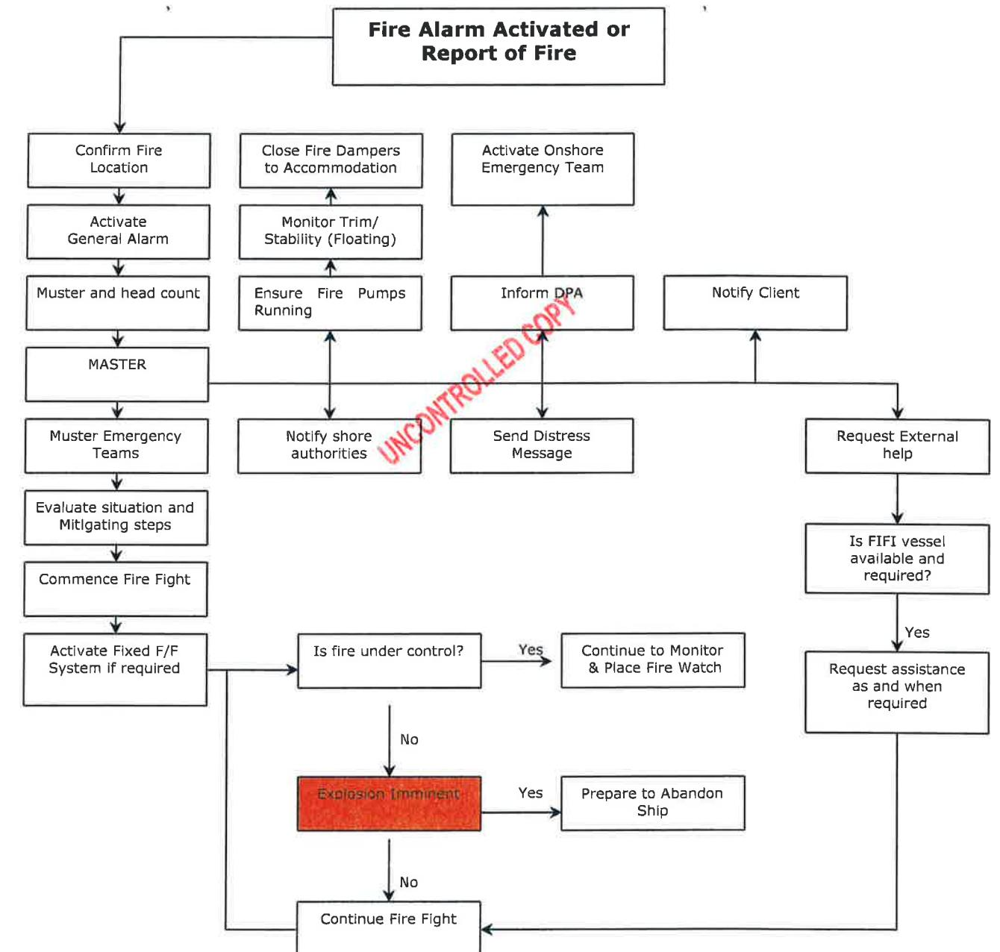

{545}------------------------------------------------

( )

1 0

Issue Status 2nd Edition, Rev 0 1st July 2014 Issue Date Issued by DPA Authorised By Director PFS

| Action                                                                                                 | Remarks |
| ------------------------------------------------------------------------------------------------------ | ------- |
| Sound alarm and announce on PA about nature of emergency                                               |         |
| Muster all personnel/ conduct head count                                                               |         |
| For small fire, witness to make decision to extinguish                                                 |         |
| Inform bridge of fire location                                                                         |         |
| Inform emergency parties of fire location and duties                                                   |         |
| Obtain vessel position                                                                                 |         |
| If applicable, NUC signals/lights should be displayed and sound signals accordingly.                   |         |
| Send distress if required                                                                              |         |
| In the case of a machinery space fire, emergency stops must be activated and fuel supplies tripped. |         |
| Start fire pump                                                                                        |         |
| Stop any bunkering/fuel transfer operations and suspend other activities.                              |         |
| Can smothering system be used? If so is space evacuated?                                               |         |
| Are persons injured? Prepare medical backup                                                            |         |
| Arrange injured person evacuation                                                                      |         |
| Manoeuvre vessel if possible to put fire to lee side                                                   |         |
| Is dangerous material in way of fire - can it be protected                                             |         |
| In port contact local authorities                                                                      |         |
| In port prepare for emergency sailing                                                                  |         |
| At sea prepare rescue boats/rafts/lifeboats                                                            |         |
| Liaise with rescuers                                                                                   |         |
| In port brief Fire Chief & provide copy 'Ships Safety Plan'                                            |         |
| Caution must be exercised regarding creation of free-surface water.                                    |         |
| If fire out of control - prepare to abandon ship                                                       |         |
| Can vessel be manoeuvred to aid / protect evacuation?                                                  |         |
| Notify and report as appropriate                                                                       |         |

{546}------------------------------------------------

| Issue Status  | 2nd Edition, Rev 0 |
| ------------- | ------------------ |
| Issue Date    | 1st July 2014      |
| Issued by     | DPA                |
| Authorised By | Director PFS       |

| Action                                      | Remarks |
| ------------------------------------------- | ------- |
| Sound alarm                                 |         |
| Muster all personnel                        |         |
| Inform engine room                          |         |
| Stop engine / dead slow                     |         |
| Manoeuvre vessel to lessen vessels movement |         |
| Is safe anchorage / port reachable?         |         |
| Obtain position                             |         |
| Send Distress                               |         |
| If time, order inspection of deck           |         |
| If time, order inspection of E.R.           |         |
| Prepare rescue boats / rafts                |         |
| Prepare extra water / food / blankets       |         |
| Is medical assistance required?             |         |
| Report findings to Master                   |         |
| Decision to abandon                         |         |
| Obtain weather forecast / sea state         |         |
| Display correct light / signals             |         |
| Notify and report as appropriate            |         |
| Liaise with rescuers                        |         |

{547}------------------------------------------------

| Issue Status  | 2nd Edition, Rev 0 |
| ------------- | ------------------ |
| Issue Date    | 1st July 2014      |
| Issued by     | DPA                |
| Authorised By | Director PFS       |

| Action                                            | Remarks |
| ------------------------------------------------- | ------- |
| Call bridge                                       |         |
| Call Chief Engineer                               |         |
| Call Master                                       |         |
| Inspect and evaluate breakdown                    |         |
| Check position                                    |         |
| Evaluate vessels danger                           |         |
| Send distress                                     |         |
| Report to Master - Is repair possible - How long? |         |
| Display correct lights / shapes                   |         |
| Can vessel anchor?                                |         |
| Inform local authorities                          |         |
| Warn passing traffic                              |         |
| Inform company                                    |         |
| Are spares on board - required?                   |         |
| Are tugs available?                               |         |
| Prepare for emergency towing                      |         |
| If time allows - can company arrange towage?      |         |
| Obtain weather forecast                           |         |
| Calculate local current / tide / rate of drift    |         |
| Monitor vessels position                          |         |

{548}------------------------------------------------

| Issue Status  | 2nd Edition, Rev 0 |
| ------------- | ------------------ |
| Issue Date    | 1st July 2014      |
| Issued by     | DPA                |
| Authorised By | Director PFS       |

#### 1.0 MEDEVAC

MEDEVAC is the Medical Evacuation for serious medical cases only in life and death situation or to reduce the impact of serious damage that might occur to a person due to either illness or injury, especially those where a risk for life or limb is emphasised and not for normal medical cases.

The Master shall carry out an assessment and the first aid treatment on the spot of accident. Based on initial assessment, he should evaluate situation and the decision to transport the patient to the nearest hospital or medical facility (offshore installation) to stabilise his condition and further evacuation, if so required, to the hospital with full medical care facilities.

The requirement of Medical evacuation of a casualty or ill person whether work related or nonwork related will be decided by the Client's doctor / medic on-board, contracted shore based medical support, DPA and the Master.

In situations where there is no Medic support available (either on board or by client), Master shall take the advice of contracted Medical support based in Singapore.

Where the client has their own Medevac procedures, the information must be readily available on the Bridge.

Following means (as and when available) shall be considered for MEDEVAC:

- a. by boat (or own fast rasque craft) transfer to shore or offshore installation, or transfer of doctor to own vessel.
- b. Ship to ship transfer of casualty where medical facility is available1,
- c. Helicopter transfer to shore or offshore installation (refer to Volume III, International Aeronautical and Maritime Search and Rescue (IAMSAR) Manual).
- d. Personnel basket / capsule transfer to Offshore Installation (refer to IMS 16 Section 13),

#### 2.0 REPORTING

Serious injury or fatality of any person onboard shall be immediately reported to Company and client to ensure immediate attention; the Master must provide full details of injury/illness to all parties for good evaluation of prevailing emergency.

A full report covering the circumstances is to be sent to the Company at the first available opportunity.

A decision to land a sick or injured person should be based on sound medical advice and supported by a medical report from the Medic / Doctor on board / Doctor ashore,

When there is no other facility or support available, the Master shall contact the nearest coast guard / coastal radio station for MEDEVAC, in co-ordination with the Company and local agents.

While the vessel is in port and faced with a medical emergency (illness or injury) the Master must use all available mean at his disposal to inform the Company, Agent and Port Authority so that immediate medical attention can be provided or if required, the injured person can be evacuated. To the above effect, Master must maintain an updated Emergency Contact Numbers for various ports of call example Ambulance, Fire Brigade, Police etc.

{549}------------------------------------------------

# MEDICAL EVACUATION FLOW CHART

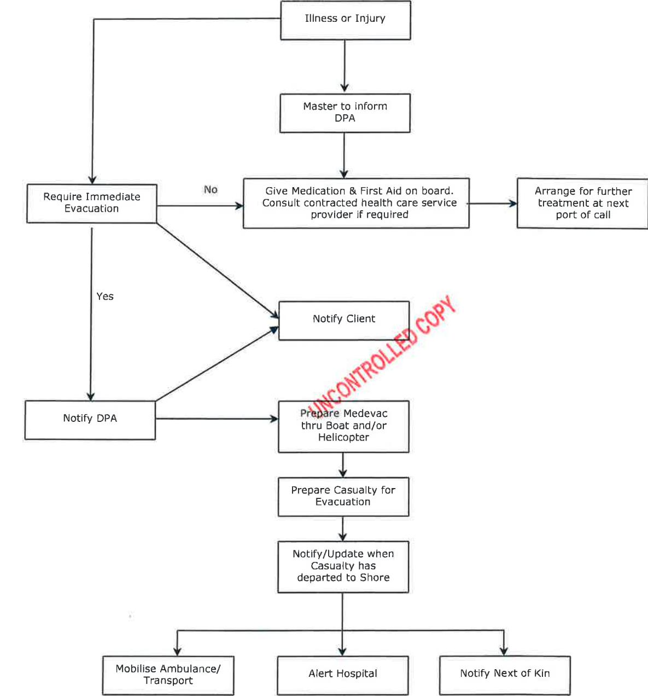

{550}------------------------------------------------

|                   |                      |               | Issue Status  | 2nd Edition, Rev 0 |
| ----------------- | -------------------- | ------------- | ------------- | ------------------ |
| C-SR MARINE       | IMS 18 - APPENDIX K7 | Issue Date    | 1st July 2014 |                    |
| INTEGRATED        | MEDEVAC              | Issued by     | DPA           |                    |
| MANAGEMENT SYSTEM |                      | Authorised By | Director PFS  |                    |

| Action                                                                                                                                      | Yes/No/NA |
| ------------------------------------------------------------------------------------------------------------------------------------------- | --------- |
| Casualty in need of urgent medical attention                                                                                                |           |
| Inform MASTER                                                                                                                               |           |
| Consult with Platform/FPSO/FSO/Terminal Medical Cover                                                                                       |           |
| If immediate evacuation is required MASTER to contact DPA and request crew boat/helicopter to be mobilised with medical assistance       |           |
| Prepare casualty for evacuation                                                                                                             |           |
| Update DPA when casualty departs vessel                                                                                                     |           |
| Onshore DPA to mobilise ambulance/transport to meet helicopter                                                                              |           |
| Onshore DPA to contact next of kin                                                                                                          |           |
| If immediate evacuation is not required, arrange transport on next scheduled flight. Casualty to be accompanied by a trained first aider |           |
| Onshore DPA to arrange transport to meet helicopter ashore                                                                                  |           |

CD

( )

{551}------------------------------------------------

|                                 | Issue Status  | 2nd Edition, Rev 0 |
| ------------------------------- | ------------- | ------------------ |
| IMS 18 – APPENDIX K8            | Issue Date    | 1st July 2014      |
| Helicopter Evacuation Checklist | Issued by     | DPA                |
|                                 | Authorised By | Director PFS       |

| Action                                                                   | Remarks |
| ------------------------------------------------------------------------ | ------- |
| Evaluate the risk                                                        |         |
| Liaise with Shore Authorities                                            |         |
| Request info for vessel preparation                                      |         |
| Consult publication on board                                             |         |
| Brief all crew                                                           |         |
| Prepare and mark winching area                                           |         |
| Clear loose equipment                                                    |         |
| Clear rigging                                                            |         |
| Ensure deck gas free, close all openings                                 |         |
| Prepare fire fighting equipments                                         |         |
| Place windsock/flag                                                      |         |
| Illuminate area, do not blind pilot                                      |         |
| Prepare and test comm.                                                   |         |
| Inform engine room                                                       |         |
| Vessel on hand steering                                                  |         |
| Manoeuvre as directed                                                    |         |
| Display correct light and shapes                                         |         |
| Monitor vessel position                                                  |         |
| Monitor traffic                                                          |         |
| Do not touch helicopter Hi Line                                          |         |
| Do not secure any lines from Helicopter                                  |         |
| Be guided by winch man                                                   |         |
| Action                                                                   | Remarks |
| Sound alarm                                                              |         |
| Muster all personnel                                                     |         |
| Ascertain cause and stop flow                                            |         |
| Emergency stop all cargo operations / close valves                       |         |
| Restrict spillage overside                                               |         |
| If overflow - drop level in tank                                         |         |
| Mop up gear to scene                                                     |         |
| Evaluate use of salvage pump / air pump                                  |         |
| Consult SOPEP (if applicable) for contact details                        |         |
| Inform local authorities                                                 |         |
| Inform government authorities                                            |         |
| Inform company                                                           |         |
| Inform agent / P&I rep                                                   |         |
| Do not spray detergents into sea without permission of local authorities |         |
| Provide drums / bags for mop up                                          |         |

{552}------------------------------------------------

#### NOTE: REFERENCE MUST ALSO BE MADE TO THE SOPEP/SMPEP MANUAL

{553}------------------------------------------------

| Action                                                      | Remarks |
| ----------------------------------------------------------- | ------- |
| Inform engine room                                          |         |
| Start alternative steering motor                            |         |
| Stop Engine                                                 |         |
| Check traffic situation                                     |         |
| Call Master                                                 |         |
| Call Chief Engineer                                         |         |
| Investigate steering gear                                   |         |
| Display correct lights / shapes                             |         |
| Monitor Position                                            |         |
| Evaluate anchoring                                          |         |
| Report to bridge                                            |         |
| If main steering not repairable – Engage emergency steering |         |
| C/O - Helmsman to steering flat                             |         |
| Check communications                                        |         |
| Engage emergency steering                                   |         |
| Test steering                                               |         |
| Proceed at safe speed                                       |         |
| Identify port of repair                                     |         |
| Inform local authorities                                    |         |
| Notify and report as appropriate                            |         |

{554}------------------------------------------------

1

| Issue Status  | 2nd Edition, Rev 0 |
| ------------- | ------------------ |
| Issue Date    | 1st July 2014      |
| Issued by     | DPA                |
| Authorised By | Director PFS       |

| Action                                       | Remarks |
| -------------------------------------------- | ------- |
| Engage manual steering                       |         |
| Helmsman on hand steering                    |         |
| Evaluate magnetic course                     |         |
| Call Master                                  |         |
| Call extra lookout                           |         |
| Call Electrician - GMDSS operator            |         |
| Proceed at safe speed                        |         |
| Investigate gyro                             |         |
| Monitor traffic and position                 |         |
| Obtain magnetic compass error                |         |
| Inform company if spares / services required |         |

{555}------------------------------------------------

-

()

| IMS 18 – APPENDIX K12    | Issue Status  | 2nd Edition, Rev C |
| ------------------------ | ------------- | ------------------ |
| ENCLOSED SPACE EMERGENCY | Issue Date    | 1st July 2014      |
|                          | Issued by     | DPA                |
|                          | Authorised By | Director PFS       |

| Action                                                             | Remarks |
| ------------------------------------------------------------------ | ------- |
| Sound alarm                                                        |         |
| Muster all personnel                                               |         |
| Do not enter space                                                 |         |
| Inform bridge                                                      |         |
| Brief C/O                                                          |         |
| Don breathing Apparatus/Lifeline                                   |         |
| Check atmosphere                                                   |         |
| Ascertain cause                                                    |         |
| Reach casualty as soon as possible                                 |         |
| Give air to casualty or get casualty to air (If atmosphere unsafe) |         |
| If atmosphere safe identify cause                                  |         |
| Do not move if badly injured and atmosphere safe                   |         |
| Arrange first aid                                                  |         |
| Get medical advise                                                 |         |
| Arrange stretcher                                                  |         |
| Place casualty on stretcher if safe                                |         |
| Continue air/first aid                                             |         |
| Notify and report as appropriate                                   |         |
| Arrange evacuation                                                 |         |
| Standby personnel with BA outside tank                             |         |

{556}------------------------------------------------

INGRESS OF WATER – EMERGENCY CHECKLIST

| Issue Status  | 2nd Edition, Rev 0 |
| ------------- | ------------------ |
| Issue Date    | 1st July 2014      |
| Issued by     | DPA                |
| Authorised By | Director PFS       |

| Action                                     | Remarks |
| ------------------------------------------ | ------- |
| Report immediately to Master / CE          |         |
| If pipe failure, shut valves if possible   |         |
| If unknown source, sound all spaces        |         |
| Consider using divers to find / plug leak  |         |
| If known source, isolate space             |         |
| Close all watertight doors                 |         |
| If space is flooding, pump out if possible |         |
| If possible, plug leak, pump out           |         |
| Consider stability - Loss of buoyancy / GM |         |
| Consider counter-flooding                  |         |
| Consider crew muster / abandon ship        |         |
| If vessel may sink, consider beaching      |         |
| Consider sending distress message          |         |
| Consider requesting assistance             |         |
| Notify and report as appropriate           |         |

{557}------------------------------------------------

MAN OVERBOARD EMERGENCY CHECKLIST

| Issue Status  | 2nd Edition, Rev 0 |
| ------------- | ------------------ |
| Issue Date    | 1st July 2014      |
| Issued by     | DPA                |
| Authorised By | Director PFS       |

| Action                                                                                 | Remarks |
| -------------------------------------------------------------------------------------- | ------- |
| Inform OOW and which side                                                              |         |
| Muster all personnel                                                                   |         |
| Wheel over to same side as manoverboard (If not towing)                                |         |
| Release manoverboard light/smoke on bridge wing                                        |         |
| Sound alarm                                                                            |         |
| Lookout to maintain watch on man                                                       |         |
| Steady course 60 deg from original (If not towing)                                     |         |
| Inform engine room                                                                     |         |
| Prepare for engine manoeuvre                                                           |         |
| Post extra lookouts                                                                    |         |
| Reliable helmsman on hand steering                                                     |         |
| Inform position to Master                                                              |         |
| Carry out Williamson turn (If not knowing)                                             |         |
| Reduce speed                                                                           |         |
| Prepare rescue boat                                                                    |         |
| Prepare communications                                                                 |         |
| Send distress                                                                          |         |
| Warn local traffic                                                                     |         |
| If man sighted prepare a lee for rescue boat                                           |         |
| Prepare medical aid / blanket                                                          |         |
| Launch rescue boat                                                                     |         |
| Maintain communications                                                                |         |
| If successful inform all parties                                                       |         |
| If manoverboard not sighted consult MERSAR manual for search pattern                   |         |
| Co-ordinate search with authorities/other vessels                                      |         |
| If manoverboard but time unknown obtain time of last sighting and other information |         |
| Relay to authorities and consult MERSAR for search pattern                             |         |
| Notify and report as appropriate                                                       |         |

{558}------------------------------------------------

|     | IMS 18 - APPENDIX K15 SEARCH & RESCUE - SURVOVORS REQUIRING ATTENTION | Issue Status  | 2nd Edition, Rev 0 |
| --- | --------------------------------------------------------------------------- | ------------- | ------------------ |
|     |                                                                             | Issue Date    | 1st July 2014      |
|     |                                                                             | Issued by     | DPA                |
|     |                                                                             | Authorised By | Director PFS       |

# When proceeding to provide assistance to a Search and Rescue Operation, the following preparations should be made :

| Action                                              | Remarks |
| --------------------------------------------------- | ------- |
| Rescue boat prepared                                |         |
| Liferafts is prepared                               |         |
| Lifejackets / survival suits prepared               |         |
| Lifebuoys prepared                                  |         |
| Walkie talkies prepared and tested                  |         |
| Line-throwing apparatus prepared                    |         |
| Buoyant lifeline prepared                           |         |
| Heaving lines prepared                              |         |
| Boat hooks / grappling hooks prepared               |         |
| Hatchets prepared                                   |         |
| Litters / stretchers prepared                       |         |
| Pilot ladders prepared                              |         |
| Scrambling nets prepared                            |         |
| Communications equipment prepared                   |         |
| Signalling equipment prepared                       |         |
| Blanket available                                   |         |
| Medical supplies and medicines available            |         |
| Spare clothing available                            |         |
| Extra food prepared                                 |         |
| Extra accommodation prepared                        |         |
| Prepare for engine manoeuvre                        |         |
| Post extra lookouts                                 |         |
| Reliable helmsman on hand steering                  |         |
| Have copy of international code of signal available |         |
| Have copy of IAMSAR vol III available               |         |
| Notify and report as appropriate                    |         |

For additional information, refer to the International Aeronautical and Maritime Search and Rescue Manual, Volume III (IAMSAR)

{559}------------------------------------------------

# In the event of loss of tow due to towline failure/power failure/adverse weather, the following preparations should be made:

| ACTION                                                                        | CHECK |
| ----------------------------------------------------------------------------- | ----- |
| Raise alarm, inform Master, Engine room                                       |       |
| Initiate ship's emergency response procedure                                  |       |
| Broadcast navigation warning                                                  |       |
| Inform other tugs if in tandem towing                                         |       |
| Recover main tow wire to check if tow line parted                             |       |
| If main tow wire unusable prepare second tow wire                             |       |
| If unable to connect to main bridle, prepare to use emergency tow line        |       |
| Send distress message if tow line is manned                                   |       |
| If power failure, then monitor set and drift of tug and tow                   |       |
| Take steps to avoid collision with other tug or tow                           |       |
| If towing jack up rig, consider jacking location depending on available depth |       |
| If heavy weather, workout the length of towline to be used                    |       |
| Check water depth and work out both tow & storm draft                         |       |
| Consider heaving to weather to prevent excessive load                         |       |
| Consider for shelter depending on weather forecast and proximity to land      |       |
| Call for assistance                                                           |       |
| Report as appropriate                                                         |       |

{560}------------------------------------------------

| Issue Status  | 2nd Edition, Rev 0 |
| ------------- | ------------------ |
| Issue Date    | 1st July 2014      |
| Issued by     | DPA                |
| Authorised By | Director PES       |

| Action                                               | Remarks |
| ---------------------------------------------------- | ------- |
| Sound alarm                                          |         |
| Inform bridge '                                      |         |
| Muster all personnel                                 |         |
| Illuminate all areas                                 |         |
| Loudspeaker warning to crew                          |         |
| If pirates not yet on board start fire pump          |         |
| Maintain watch all round deck and prepare fire hoses |         |
| Do not approach boarders                             |         |
| Give position to GMDSS operator                      |         |
| Send distress                                        |         |
| Secure all areas if possible                         |         |
| Obey attackers instructions                          |         |
| All crew to stay together                            |         |
| Warn other vessels                                   |         |
| Notify and report as appropriate                     |         |

For further information and guidance on response to Piracy / Terrorist Incidents, refer to individual Vessel ISPS Shipboard Security Plans

{561}------------------------------------------------

|     | IMS 18 – APPENDIX K18 MAIN AND EMERGENCY ELECTRICAL POWER FAILURE CHECKLIST | Issue Status  | 2nd Edition, Rev 0 |
| --- | --------------------------------------------------------------------------------- | ------------- | ------------------ |
|     |                                                                                   | Issue Date    | 1st July 2014      |
|     |                                                                                   | Issued by     | DPA                |
|     |                                                                                   | Authorised By | Director PFS       |

| Action                                            | Remarks |
| ------------------------------------------------- | ------- |
| Call bridge                                       |         |
| Call Chief Engineer                               |         |
| Call Master                                       |         |
| Inspect and evaluate breakdown                    |         |
| Check position                                    |         |
| Evaluate vessels danger                           |         |
| Send distress                                     |         |
| Report to Master - Is repair possible - How long? |         |
| Display correct light / shapes                    |         |
| Can vessel anchor?                                |         |
| Inform local authorities                          |         |
| Warn passing traffic                              |         |
| Inform company                                    |         |
| Are spares on board - required?                   |         |
| Are tugs available?                               |         |
| Prepare for emergency towing                      |         |
| If time allows - can company arrange towage?      |         |
| Obtain weather forecast                           |         |
| Calculate local current / tide / rate of drift    |         |
| Monitor vessels position                          |         |

{562}------------------------------------------------

| Action                                              | Remarks |
| --------------------------------------------------- | ------- |
| Call Master                                         |         |
| Heave to, head to weather                           |         |
| Change from shaft to diesel generators              |         |
| Check position                                      |         |
| Check weather forecast                              |         |
| Re-stow and re-lash cargo                           |         |
| Resume passage if weather permits                   |         |
| Consider returning to port to re-stow cargo         |         |
| Consider running for shelter until weather improves |         |
| Report to company                                   |         |
| Note protest at next port                           |         |

{563}------------------------------------------------

| Issue Status  | 2nd Edition, Rev 0 |
| ------------- | ------------------ |
| Issue Date    | 1st July 2014      |
| Issued by     | DPA                |
| Authorised By | Director PFS       |

| Action                                                | Remarks |
| ----------------------------------------------------- | ------- |
| Call Master                                           |         |
| Heave to, Head to weather                             |         |
| Change from shaft to diesel generators                |         |
| Check position                                        |         |
| Check weather forecast                                |         |
| Cargo to be jettisoned to be manoeuvred to stern      |         |
| Cargo jettisoned over stern using capstan and tuggers |         |
| Check for damage to vessel                            |         |
| Report to company                                     |         |
| Resume passage                                        |         |
| Note protest at next port                             |         |

{564}------------------------------------------------

| Issue Status  | 2nd Edition, Rev 0 |
| ------------- | ------------------ |
| Issue Date    | 1st July 2014      |
| Issued by     | DPA                |
| Authorised By | Director PFS       |

| Action                                                             | Remarks |
| ------------------------------------------------------------------ | ------- |
| Sound alarm                                                        |         |
| Muster all personnel                                               |         |
| Do not enter space                                                 |         |
| Inform bridge and ECR                                              |         |
| Brief C/O                                                          |         |
| Don breathing apparatus / lifeline                                 |         |
| Check atmosphere                                                   |         |
| Ascertain cause                                                    |         |
| Reach casualty as soon as possible                                 |         |
| Give air to casualty or get casualty to air (If atmosphere unsafe) |         |
| If atmosphere safe identify cause                                  |         |
| Do not move if badly injured and atmosphere safe                   |         |
| Arrange first aid                                                  |         |
| Get medical advise                                                 |         |
| Arrange stretcher                                                  |         |
| Place casualty on stretcher if safe                                |         |
| Continue air / first aid                                           |         |
| Notify and report as appropriate                                   |         |
| Arrange evacuation                                                 |         |
| Standby personnel with BA outside tank                             |         |

{565}------------------------------------------------

1-0

| Issue Status  | 2nd Edition, Rev 0 |
| ------------- | ------------------ |
| Issue Date    | 1st July 2014      |
| Issued by     | DPA                |
| Authorised By | Director PFS       |

| Action                                                                                                                                                                               | Remarks |
| ------------------------------------------------------------------------------------------------------------------------------------------------------------------------------------ | ------- |
| Obtain data casualty condition                                                                                                                                                       |         |
| Send distress for local assistance from vessel with doctor via nearest MRCC                                                                                                          |         |
| Relay details to on call company doctor by phone                                                                                                                                     |         |
| Continue to monitor patient                                                                                                                                                          |         |
| Inform company of proceedings                                                                                                                                                        |         |
| Carry out instructions from shore                                                                                                                                                    |         |
| Give update to shore                                                                                                                                                                 |         |
| Is evacuation required / possible                                                                                                                                                    |         |
| Calculate nearest port / course / ETA                                                                                                                                                |         |
| Are helicopters available?                                                                                                                                                           |         |
| Maintain communication link                                                                                                                                                          |         |
| Action                                                                                                                                                                               | Remarks |
| Sound emergency alarm, call master, inform engine room                                                                                                                               | ,       |
| Initiate ship's emergency response procedure                                                                                                                                         |         |
| Evacuate the area and deny entry                                                                                                                                                     |         |
| Identify the material involved in spillage, refer to IMDG Code chapter 3.2 to know the UN number and use this to find the appropriate schedule from IMDG Code supplement (EMS) |         |
| Shut the vents, air con and other openings for living and working spaces                                                                                                             |         |
| Stop all other work in the vessel                                                                                                                                                    |         |
| If deemed necessary, alter course and speed to keep dangerous fumes away from inlets and living spaces                                                                            |         |
| If nature of the material is not known evacuate, deny entry, request shore advise                                                                                                 |         |
| Alert the relevant shore authority                                                                                                                                                   |         |
| Clear spillage as per EMS spillage schedule                                                                                                                                          |         |
| Full PPE resistant to effect of the substance to be worn                                                                                                                             |         |
| Avoid direct contact with hazardous material regardless of PPE used                                                                                                                  |         |
| Rig fire hoses and keep the fire pumps on standby (In case the material is flammable)                                                                                             |         |
| In case of contact with material wash the substance away, refer to medical first aid guide or get radio medical assistance                                                        |         |
| If necessary call for MEDEVAC                                                                                                                                                        |         |

{566}------------------------------------------------

| Issue Status  | 2nd Edition, Rev 0 |
| ------------- | ------------------ |
| Issue Date    | 1st July 2014      |
| Issued by     | DPA                |
| Authorised By | Director PFS       |

{567}------------------------------------------------

|     | Issue Status  | 2nd Edition, Rev 0 |
| --- | ------------- | ------------------ |
|     | Issue Date    | 1st July 2014      |
|     | Issued by     | DPA                |
|     | Authorised By | Director PFS       |

| Action                                                                                                                     | Remarks |
| -------------------------------------------------------------------------------------------------------------------------- | ------- |
| Sound emergency alarm, call Master, inform Engine Room                                                                     | .       |
| Initiate ship's emergency response procedure                                                                               |         |
| Shut the vents, air con and other openings for living and working spaces                                                   |         |
| Determine the category of NLS (X/Y/Z)                                                                                      |         |
| Stop or reduce outflow of NLS                                                                                              |         |
| Assess risk of complex chemical reaction in NLS cargo                                                                      |         |
| Reduce inert gas pressure to zero (If fitted)                                                                              |         |
| Reduce liquid levels in tanks in suspect area                                                                              |         |
| Evacuate the area and deny entry                                                                                           |         |
| Close all tanks valves & pipeline master valves                                                                            |         |
| Stop all other work in the vessel                                                                                          |         |
| If nature of the material is not known, evacuate, deny entry, request shore advice                                         |         |
| Alert the relevant shore authority                                                                                         |         |
| Rig fire hoses and keep the fire pumps on standby (In case the material is flammable)                                      |         |
| Full PPE resistant to effect of the substance to be worn                                                                   |         |
| Avoid direct contact with Noxious Liquid regardless of PPE used                                                            |         |
| In case of contact with material wash the substance away, refer to medical first aid guide or get radio medical assistance |         |
| If necessary call for MEDEVAC                                                                                              |         |

{568}------------------------------------------------

| Issue Status  | 2nd Edition, Rev 0 |
| ------------- | ------------------ |
| Issue Date    | 1st July 2014      |
| Issued by     | DPA                |
| Authorised By | Director PFS       |

# 1. Properties of H2S

Sulphur is present in natural gas and crude oil as hydrogen sulphide (H2S) or as elemental sulphur. Each gas and crude oil has different amounts and types of sulphur compounds, but as a rule the proportion, stability and complexity of the compounds are greater in heavier crude oil fractions.

Crude oils and natural gases which contain appreciable quantities of hydrogen sulphide or other reactive sulphur compounds are usually called "sour", whereas those with less sulphur are usually called "sweet."

Hydrogen sulfide is colorless, transparent, and flammable, smells like "rotten eggs" at very low concentrations, and is denser than air and thus may accumulate in low places. The slightest presence of H2S in the air is normally detectable by its characteristic "rotten-egg" odor; however, it is dangerous to rely on odour as a means of detecting life-threatening concentrations because the sense of smell is lost rapidly, allowing lethal concentrations to accumulate without warning.

H₂S goes to the lungs and in to the blood stream. Higher doses of H₂S will weaken the body's defence system, which causes the H2S to settle in the blood, and the individual becomes poisoned.

H S is the combination of hydrogen and sulphur atoms. The process of combination takes place by a bio-chemical reaction, the decay, rotting down or putrefaction of dead organic material.

| Chemical symbol :      | H2S                                                    |
| ---------------------- | ------------------------------------------------------ |
| Specific Gravity :     | 1.192 (heavier than air)                               |
| Explosive limits :     | Lower: 4%, Upper: 44% volume in air                    |
| Ignition Temperature : | 500 F (260 °C)                                         |
| Solubility in water :  | 2.9 volumes of gas, per volume of water at 20°C (68 F) |

# 2. Effects of Hydrogen Sulphide

| Concentration of H2S |      | Effect of H2S                                                  |
| -------------------- | ---- | -------------------------------------------------------------- |
| %                    | ppm  |                                                                |
| 0.001                | 10   | Obvious and unpleasant odour; safe for 8 hr                    |
| 0.002                | 20   | Safe for 4 hr exposure                                         |
| 0.01                 | 100  | Kills sense of smell in 3–15 min; may sting eyes               |
| 0.02                 | 200  | Kills sense of smell; stings eyes and throat                   |
| 0.05                 | 500  | Dizziness; breathing ceases in minutes.                        |
| 0.07                 | 700  | Unconscious quickly; death will result if not rescued promptly |
| 0.1                  | 1000 | Unconscious immediately, followed by death within minutes      |

# 3. Areas where H2S may be detected

- a) In Fuel oil/Mud and other storage tanks, in vents & gauge / sample hatches.
- b) In the vicinity of oil or gas rigs, production platforms and oil fields, particularly those producing "sour" crudes or natural gases.
- c) Sewage treatment plant.
- Confined spaces. d)
- e) H2S is very soluble liquids are heated, agitated or depressurized the gas is released.
- f) H2S can be released when liquids are circulated or pumped.

{569}------------------------------------------------

# 4. Symptoms of exposure to H2S

- a) Dizziness, vomiting sensation, headache, stomach pain, blurred vision, disorientation & confusion, severe coughing, irritation in nose & throat, beginning of lost of consciousness.
- b) Nerve center in the brain paralyzed.
- Breathing Stops. c)
- d) Unconsciousness (Possible death if not rescued)

# 5. Safety Procedures

- a) Be on alert for possible detection of H2S gas,
- b) Listen for announcements (onboard and/or from the installation), voice horn, or otherwise watch visible warning system.
- c) Know location of H2S Muster point.
- d) Know location of protective breathing apparatus (SCBA)
- e) Inform your working partner (buddy) of an alert or an emergency condition.
- f) Do not panic. Remain calm and follow instructions.
- g) Familiarise yourself with nearest escape route for possible evacuation,
- h) Do not enter a suspicious area without a mask until the concentration of H2S has been checked.
- i) If an odour of H2S ('rotten agg smell') is detected while wearing a mask, go out of the contaminated area. Check the mask for leaks.
- i) Be conscious of the wind direction at all times. Crew shall move quickly and cautiously to a location upwind and away from potential H2S sources.
- k) Manoeuvre the vessel upwind from the H2S source.
- I) Close all external doors, hatches and portholes and consider closing vent flaps.

# 6. Emergency situation without Escape sets:

If H2S gas is detected by Odour (rotten eggs) or by personal gas detector (10 ppm) when vessel is in immediate proximity of an offshore installation or rig or alongside to any of these:

- a) Do not panic.
- b) Hold your breath.
- Check wind direction. C)
- d) Escape upwind or cross wind.
- e) Do not assist any person under H2S attack unless properly equipped.
- f) Proceed to Muster Station H2S (Level 5) and call for help (inform bridge).

# 7. Upon hearing the H2S alert:

- a) Ring alarm and announce via the PA system
- b) Call Master if not on bridge.
- c) All personnel to proceed immediately to Muster Station.
- d) Duty Engineer to stop all vessel's fans, air intakes and A/C.

{570}------------------------------------------------

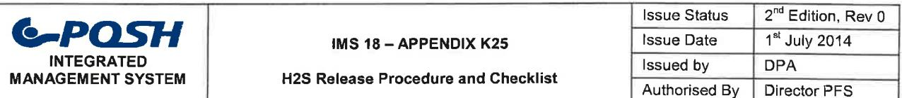

- e) Catering staff to stop all galley fans and appliances.
- f) First Aid Team to stand by to render medical assistance.
- g) Master to liaise with the Company Representative on board (if any) and prepares to move · vessel/acc vessel away from platform.
- h) Master/Company Man alerts all parties concerned in regards to Medical Evacuation or down manning if necessary.
- i) On Accommodation vessel at anchor, winch operators to remain stand by on the bridge for shifting away from location.
- Master to inform the DPA. D

# 8. First Aid for victims of H2S:

- 8.1 It is very important that help and treatment in case of accidents are affected immediately. In order to minimise the risk of exposure, it is important to remember the following:
  - Most important to the victim is fresh air or oxygen, quickly! Get the person out of the a. dangerous area, but remember to protect yourself first. Buddy system must be employed.
  - b. You cannot define the concentration of H2S as even low concentrations kill the sense of smell.
  - c. Wearing breathing equipment (self-contained breathing apparatus) when resouing a person in an area contaminated of H2S. Do not try to rescue without an SCBA.
- 8.2 The following first aid procedure will apply if a person should overcome by H2S:
  - a. H2S absorbed in the body soxidised fairly quickly whereby the acute effect on the breathing organs ceases
  - b. Therefore, it is important to remove the victim from the contaminated area to fresh air. Remember to walk into the wind with the victim if possible, rather than across the wind direction.
- 8.3 If the victim is unconscious, use the following means as appropriate:
  - a. Remove the victim from the affected area. If a person must be pulled or dragged to a safe breathing area, pull by the shoulders.
  - b. If the victim is unconscious after reaching the safe breathing area, the breathing is to be checked immediately and, in case of suspended respiration, artificial resuscitation should be administered immediately.
  - At the first opportunity, replace Cardio Pulmonary Resuscitation (CPR) efforts with C. oxygen resuscitators.
  - Continue to administer oxygen when the person begins breathing.
  - e. Treat patient for shock after reviving and keep under constant observation.
  - f. The person is to be immediately evacuated to hospital(Medevac).

{571}------------------------------------------------

| Issue Status  | 2nd Edition, Rev 0 |
| ------------- | ------------------ |
| Issue Date    | 1st July 2014      |
| Issued by     | DPA                |
| Authorised By | Director PFS       |

| Action                                                                                  | Yes/No/Na |
| --------------------------------------------------------------------------------------- | --------- |
| Sound emergency alarm, call Master, Inform Engine Room                                  |           |
| Initiate ship's emergency response procedure                                            |           |
| Make appropriate announcement on PA system (GAS, GAS, GAS)                              |           |
| Shut the vents, air con and other openings for living and working spaces                |           |
| Inform installation of gas leak                                                         |           |
| More vessel to upwind of suspected leak location                                        |           |
| Stop all other work in the vessel / cargo operations                                    |           |
| Warn all other vessels on VHF channel 16 & local channel                                |           |
| Check and continuously monitor the readings of H2S detectors                            |           |
| Alert the relevant shore authority                                                      |           |
| Prepare FRC / Rescue boat / Life boat for launch                                        |           |
| Keep First aid team ready                                                               |           |
| Rig fire hoses and keep the fire pump on standby                                        |           |
| In case of medical emergency, refer to medical guide & if necessary call for MEDEVAC |           |
| Prepare to recover personnel evacuated from platform                                    |           |

{572}------------------------------------------------

| Issue Status  | 2nd Edition, Rev 0 |
| ------------- | ------------------ |
| Issue Date    | 1st July 2014      |
| Issued by     | DPA                |
| Authorised By | Director PES       |

| ACTION                                                                               | CHECK |
| ------------------------------------------------------------------------------------ | ----- |
| Sound emergency signal & call Master                                                 |       |
| Make appropriate announcement of vessel PA system                                    |       |
| Muster & brief crew / post lookouts                                                  |       |
| Assess risk                                                                          |       |
| Initiate ship's emergency response procedure, consult IAMSAR vol III                 |       |
| Prepare rescue equipment                                                             |       |
| Assess environment condition (weather, sea, tide, visibility)                        |       |
| Stop all offshore operations, no hot work, no smoking on vessel                      |       |
| Close vents / Ports / Hatches / Doors                                                |       |
| Confirm effective communication with crew, FRC / Rescue boat                         |       |
| Establish and maintain communication with SAR facility & offshore installation       |       |
| Warn all vessel on VHF channel 16 & local area channel                               |       |
| Manoeuvre vessel clear from helicopter crash landing                                 |       |
| Confirm helicopter POB, helicopter details & call sign                               |       |
| Rig fire hoses and keep the fire pump on standby, prepare FIFI / foam monitors       |       |
| Keep portable fire fighting equipment ready                                          |       |
| Consider affect of weather on rescue & recovery operation                            |       |
| Keep rescue zone clear & ready                                                       |       |
| Keep safe area and winter gear ready for survivors (Survivors management)            |       |
| Ensure safety of crew, especially FRC & Rescue boat crew                             |       |
| Send distress relay                                                                  |       |
| Provide assistance for search and rescue if required                                 |       |
| In case of medical emergency, refer to medical guide & if necessary call for MEDEVAC |       |
