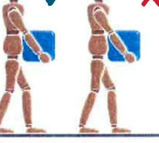
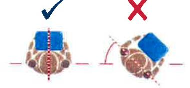
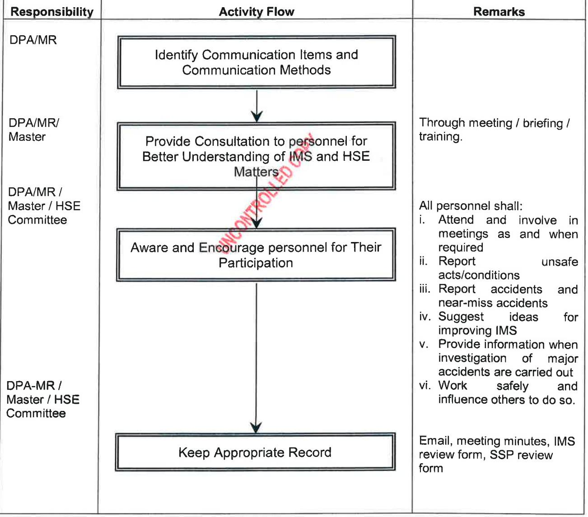
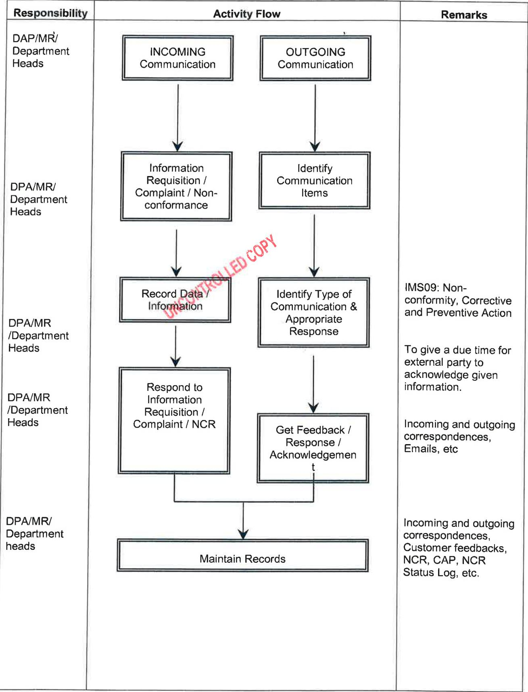

{0}------------------------------------------------

# CONTENTS

#### PERSONNEL SAFETY AND OCCUPATIONAL HEALTH 1.

- 1.1. Purpose
- 1.2. Scope

#### 2. PROCEDURE - PERSONAL PROTECTIVE EQUIPMENT (PPE)

- 2.1. PPE Requirements
- 2.2. Where and when PPE is to be used
- 23 PPF Matrix

#### 3. RISK ASSESSMENT AND TOOLBOX TALKS

- Health Risk Assessment 3.1.
- 3.2. Toolbox Talks

#### 4. CONTROL AND HANDLING OF HAZARDOUS SUBSTANCES

- 4.1. General
- 4.2. Precautions
- 4.3. Handling Liquified Gases
- 4.4. Ship's Stores
- 4.5. Cargo and Bunker Samples
- 4.6. Other Materials
- 4.7. Packaged Cargoes
- Dangerous Goods 4.8.

#### MANUAL HANDLING TECHNIQUES 5.

- 5.1. Introduction
- 5.2. Good Handling Technique for Lifting
- 5.3. Good Handling Technique for Pushing & Pulling
- 5.4. Good Handling Techniques for Twisting
- 5.5. Slips, Trips and Falls

#### FIRE PRECAUTIONS 6.

- 6.1. Smoking
- 6.2. Electrical fittings
- 6.3. Oily rags
- 6.4. Cleanliness

#### 7. GENERAL HEALTH AND WELLBIENG

- 7.1. Purpose
- 7.2. Scope
- 7.3. Personal Responsibility
- Medical Examination 7.4.
- 7.5. Malaria Prevention
- 7.6. Vaccination Requirements

{1}------------------------------------------------

- 7.7. Asbestos Hazards and Precautions
- 7.8. Rabies Prevention
- Bird Flu 7.9.
- Normal Seasonal Flu 7.10.
- 7.11. Pandemic Flu
- 7.12. Legionnaires Disease
- 7.13. AIDS
- 7.14. Skin Care
- 7.15. Heat Illness
- 7.16. Sun Light Exposure Risks
- 7.17. Eye Damage from Light Exposure
- 7.18. Noise
- 7.19. Dust Inhalation

#### 8. HYGIENE

- 8.1. Purpose
- 8.2. Scope
- 8.3. Personal Responsibility
- 8.4. Personal Hygiene
- 8.5. Caterng Procedures, including Galley and Messroom Hygiene
- 8.6. Galley Fire Protection
- 8.7. Galley Heavy Weather Precautions
- 8.8. Cookers and Fryers
- 8.9. Sharp Utensils
- Refrigerator Spaces and Store Rooms 8.10.
- Food Wastes 8.11.
- 8.12. Shower Cubicles and Toilets
- 8.13. Freshwater Tank and Supplies
- 8.14. Work Clothes
- 8.15. On-board Inspections

#### 9. PESTS - CONTROL AND PREVENTION

- 9.1. Safe Use of Pesticides
- 9.2. Vermin Infestation
- 9.3. Control of Rodents
- 9.4. Control of Insects
- 9.5. Inspection for Infestations
- 10. SLIPS, TRIPS AND FALL
- 11. GUIDELINES ON USE OF PORTABLE ELECTRICAL EQUIPMENT
- 12. PROCEDURES FOR CONTROL OF DRUGS AND ALCOHOL
- REST HOURS 13.

{2}------------------------------------------------

# 14. OHSAS OBJECTIVES AND TARGETS

# Appendices

- First Aid Kit Contents A.
- B PPE Matrix
- C Drug and Alcohol Test Record
- D Weekly Accommodation Inspection Checklist
- E Shipboard Working Hours
- F Rest Hour Log
- G OHSAS Objectives and Targets

UNCONTROLLED COPY

{3}------------------------------------------------

#### 1. PERSONNEL SAFETY AND OCCUPATIONAL HEALTH

#### 1.1 Purpose

· The purpose of this procedure is to address the safety and occupational health issues faced by all seagoing staff in the operation of the Company vessels.

#### 1.2 Scope

It is the Company's philosophy that the safety and health of its seagoing staff is paramount. This procedure and others within the IMS address that philosophy and, in doing so, meet the requirements of the ISM Code and the OHSAS 18001 standard.

The Company ensures that their entire seagoing staff is holding appropriate and verified Certificates of Competency as per statutory requirements, thereby ensuring they have undergone the appropriate training, including safety training.

Nevertheless, such safety training should be regarded as providing only a basic knowledge of personal safety, hence the need for this procedure to provide guidance in this respect.

#### 2. Procedure

# PERSONAL PROTECTIVE EQUIPMENT (PPE)

Regardless of practicalities of work or economics, safety will not be compromised. All personnel onboard POSH vessels will abide by POSH safety standards including the wearing of appropriate PPE.

#### 2.1. PPE Requirements

- a. All personnel must wear the appropriate PPE as provided by the Company when working. Even if a crew member is just 'lending a hand" to a work activity during an off duty period, appropriate PPE must still be worn.
- b. In effect, any work activity (particularly work outside the accommodation) requires the use of appropriate PPE.
	- R Safety shoes or boots must be worn in working areas where danger exists. This will be in all areas outside of the accommodation and in the galley work areas and in designated areas ashore. Safety shoes with worn or broken soles, damaged uppers or toecap protruding should be replaced. Lace-up type boots should always be worn properly tied up.
	- The Chief Officer is responsible to ensure that all PPE is in good condition and 11. properly maintained. He must ensure that is sufficient PPE onboard and requisition as required. In the event that adequate PPE has not been supplied to the vessel, the DPA/HSEQA Department must be informed accordingly.
	- iii. At the individual level, crew are responsible for checking their own PPE and highlighting any deficiencies.
	- iv. Long sleeve overalls, as provided by the Company should be worn when working onboard. As far as reasonable practicable, overalls should be clean with the Company Logos intact. Very dirty, torn or oily overalls should be disposed of and replaced.

{4}------------------------------------------------

| Issue Status  | 2nd Edition, Rev 0 |
|---------------|--------------------|
| Issue Date    | 1st July 2014      |
| Issued by     | DPA                |
| Authorised By | Director PFS       |

| 2.2. | Where and when PPE is to be used: |
|------|-----------------------------------|
|------|-----------------------------------|

| a) | Safety Helmet1                  | Where there is any danger of things falling from above or being struck on the head and at all times when working outside or in machinery spaces.               |
|----|---------------------------------|-------------------------------------------------------------------------------------------------------------------------------------------------------------------------|
| b) | Safety Footwear                 | At ALL times in working areas, whether actually working or not. This includes machinery spaces, inside/outside the accommodation and the Galley.               |
| c) | Ear Protection                  | In all machinery spaces or when undertaking noisy work e.g. chipping or when working with noisy equipment.                                                        |
| d) | Safety Harness                  | When working aloft, overside or any other occasion when working above the deck level. The use of Safety belt with lanyard is banned on company vessel.         |
| e) | Dust masks/Respirator           | When working in a dusty environment, e.g. wire brushing or any other environment where there is or is likely to be a high concentration of airborne particles. |
| f) | Goggles/Safety Glasses/Visors   | When chipping/grinding or any other work where particles could enter the eyes, when handling chemicals.                                                           |
| g) | Working Gloves                  | When working with items which could cut, scratch, pierce or abrade the hands.                                                                                        |
| h) | Chemical Resistant Gloves/Apron | When working with chemicals/batteries.                                                                                                                                  |
| i) | Lifevests/Lifejackets           | At all times when working on the main deck and any other occasion where there is a danger of falling overboard.                                                   |

### Note:

Appropriate PPE must also be worn as required when in designated areas ashore or on when on board other vessels or installations.

### 2.3

1 Writing with markers pen, stickers and painting on helmet should not be done as it can weaken the helmet.

{5}------------------------------------------------

#### 3. RISK ASSESSMENT AND TOOLBOX TALKS

#### 3.1. Health Risk Assessment

The Risk Assessment process and matrix as described in IMS 03 has been designed and developed in such a way that it can be used for assessing the health risks associated with any work to be carried out on board Company vessels, as well as for assessing safety and environmental risks

The purpose of the Risk Assessment is to highlight the risks involved in the task to be carried out and identify the mitigating steps necessary to reduce the risk to as low as reasonably practical (ALARP).

It is mandatory to carry out a Risk Assessment for all on board tasks and all personnel that will be involved must also be involved in the risk assessment process.

#### Toolbox Talks 3.2.

Toolbox Talks should be considered as a job briefing and a follow on to the Risk Assessment. They are a forum for the supervisor and/or person in charge of a job to ensure that the personnel carrying out the work fully understand the job requirements and they are reminded of the hazards involved, the procedures to be followed and the precautions to be taken, as identified in the Risk Assessment.

# CONTROL AND HANDLING OF HAZARDOUS SUBSTANCES/MATERIAL
4.

#### 4.1. General

There are a number of Hazardous Substances that may be encountered on board, either materials being transported on behalf of a customer or for use on board the vessel itself,

The Hazardous Substances may include, but not be limited to the following:

- Paint 0
- Solvents 0
- Fuel Oil
- . Lubricating Oils and Hydraulic Oils
- De-rusting Fluids .
- Cleaning Agents
- Substances being carried that are identified as dangerous under the International . Maritime Dangerous Goods (IMDG) Code

#### 4.2. Precautions

- a) Prior to handling potentially hazardous substances, read the manufacturer's safety instructions and the Material Safety Data Sheet (MSDS) and comply fully with all recommended precautions and PPE requirements. If the MSDS is not provided when the substance is delivered to the vessel, do not accept it onboard. The MSDS should, where practicable, be kept with the substance as it provides information on the material itself and what to do in the event of various types of emergencies. The manufacturer's instructions should also be read and observed.
- Protective clothing must always be worn to safeguard the person against accidental ﮯ spillage and eye and respiratory protection will be necessary in most cases of handling.
- c) completed and sent as soon as possible to Head Office and recorded onboard. A summary of the illness should be recorded in the vessel's Monthly HSE minutes.

{6}------------------------------------------------

- d) For IMDG Cargoes, the IMDG Code provides details of storage, transportation and incompatibilities as well as information on the material itself and what to do in the event of various types of emergencies.
- Paints and/or Chemicals may contain toxic or irritant substances, and with solvents may e) give rise to toxic, flammable and potentially explosive vapours.
- Associated materials such as rust removers and acids are also hazardous and skin f) contact should be avoided.
- g) All such materials, whether for use on board or being transported must be properly stored at all times.
- h) Internal / enclosed spaces should be atmosphere monitored and well ventilated at all times.
- i) Correct protective clothing should always be worn.
- i) No smoking in areas of painting or using chemicals.
- No naked lights in areas of painting or using chemicals. k)
- If paint is to be sprayed, the manufacturer's instructions for the equipment should be ﮯ read and adhered to.
- m) Paint may be sprayed at high velocity and can cause damage to the skin and eyes. Great care and supervision is required.
- n) Proper protective clothing is required such as combination suits, gloves and goggles.
- o)

#### 4.3 Handling Liquefied Gas

The following safeguards should be observed when handling packaged liquefied gas cargoes:

- a) Pressurised receptacles should be suitably protected against physical damage from other cargo, stores or equipment.
- b) Pressurised receptacles should not be over-stowed with other heavy goods or other items.
- c) Pressurised receptacles should be stowed in such a position that the safety relief device is in contact with the vapour space within the receptacle.
- d) Valves should be protected against any form of physical damage with a suitable protection cap in place at all times when the cylinder is not in use.
- e) Cylinders stowed below deck should be in compartments or holds capable of being ventilated and away from accommodation and working areas and all sources of heat
- f) Oxygen cylinders should be stowed separately from flammable gas cylinders.

{7}------------------------------------------------

#### 4.4 Ship's Stores

#### General a)

Any chemical or hazardous material placed on board a ship as stores should be accompanied by a Material Safety Data Sheet (MSDS). Where MSDS is not found or provided and the item is already taken onboard, the item should be isolated and stored in accordance with guidance provided on its container or packaging. It should not be put into use until satisfactory user information is provided.

Containers and packages should be stowed closed and the storage location kept clean and tidy.

#### b) Paint

Paint, paint thinners and associated cleaners and hardeners should be stowed in storage location protected by fixed fire extinguishing arrangements approved by the administration. (SOLAS II-2 Regulation 10 Section 6.3 as amended covers Spaces Containing Flammable Liquid.)

#### Chemicals C)

All chemicals should be stowed in designated and dedicated storage locations. Care should be taken to ensure that incompatible chemicals are stowed separately, Information on the fire-fighting medium for each chemical should be really available from the product's MSDS.

#### d) Cleaning Liquids

It is preferable to use cleaning liquids that are non-toxic and non-flammable. If flammable liquids are used, they should have a high flashpoint. High volatile liquids, such as gasoline or naphtha, should never be used in engine or boiler rooms.

Flammable cleaning liquids should be kept in closed, unbreakable, correctly labelled containers and should be stored in a suitable compartment when not in use.

Cleaning liquids should only be used in places where ventilation is adequate, taking into consideration the volatility of the liquids being used. All such liquids should be stowed and used in compliance with the manufacturer's instructions.

Direct skin contact with, or the contamination of clothing by, cleaning liquids should be avoided.

#### Spare gear Storage e)

Spare gear is not inherently hazardous. There have, however, been cases where large items of spare gear stowed on deck have broken free of their lashings with consequent damage to the vessel and risk of injury to personnel. When stowing spare gear, the following should be borne in mind:

- · It should allow safe access to, and operation of, any safety equipment.
- · It should not interfere with mooring or other operations.
- · It should be properly lashed, taking into account expected weather on the voyage.

#### 4.5 Cargo and Bunker Samples

All cargo samples should be stowed securely in lockers that have access external to accommodation. Consideration should be given to storing samples in a location protected by a fixed fire-fighting system, such as paint locker. The number of samples retained on board should be carefully managed and, when no longer required, they should be disposed in accordance with Marpol regulation.

The Company should have a policy that addresses the disposal of samples; the aim should be to minimize the period of retention after the relevant cargo has been discharged. Unless the

{8}------------------------------------------------

company advises to the contrary, it is suggested that samples are retained for a period of three months after the cargo has been discharged.

#### 4.6 Other Materials

#### Sawdust, Oil Absorbent Granules and Pads a.

The use of saw dust for cleaning up small oil spills on board ship is discouraged. If sawdust is carried on board, care should be taken to ensure that, while unused, it is stowed in a dry condition and, if possible, in a cool location. Moist sawdust is susceptible to spontaneous combustion.

When sawdust has been used to clean up a minor oil spill, the contaminated sawdust should be stowed separately, in a sealed container and in safe location, clear of the accommodation and hazardous areas.

Any oil-impregnated absorbent granules or pads should be stowed in dedicated containers on board, clear of the accommodation and hazardous areas.

Oil-impregnated sawdust and absorbent granules should be disposed of early as possible, either ashore or via the ship's waste incinerator.

#### b. Garbage

The storage locations for garbage should be carefully selected to ensure that the garbage presents no potential hazard to adjacent spaces.

Particular consideration should be given to the storage of garbage that is designated as 'special waste', such as batteries, sensors and fluorescent tubes, to ensure that only compatible materials are stowed together .

The ICS publication 'Guideline for the Preparation of Garbage Management Plans' provides information on how to comply with Annex V of MARPOL.

#### 4.7 Packaged Cargoes

### a.

Packed petroleum cargoes are usually shipped in steel drums of approximately 200 litres capacity. Product transported in this manner include gasoline, kerosene, gas oils and lubricating oil

In addition to the general safety precautions for handling bulk petroleum, the following procedures should be observed when handling packaged petroleum products.

#### b. Loading and Discharging

Packages petroleum and other flammable liquids should not be handled during the loading of volatile petroleum in bulk, except with the express permission of both the Responsible Officer and loading of bulk cargo should be suspended owing to the increased risk of spark generation.

#### C. Precautions During Handling

A responsible Officer should supervise the handling of packaged petroleum and other flammable liquids. The following precautions should be taken :

- Stevedores must comply with smoking restrictions and other safety regulations. i.
- When permanent hatch protection is not fitted, temporarily protection should be ﻨﺘ provided to avoid the risk of spark being caused by hoist striking the hatch coamings, hatch sides or hold ladders.

{9}------------------------------------------------

| Issue Status  | 2nd Edition, Rev 0 |
|---------------|--------------------|
| Issue Date    | 1st July 2014      |
| Issued by     | DPA                |
| Authorised By | Director PFS       |

- All hoists should be of a size suitable for passing through hatches with ample iii. clearance
- iv. Fibre rope slings, cargo nets, or drum hooks on wire rope or chain slings, should be used for handling loose drums.
- Goods should preferably be palleted and secured. Pallets should be lifted with pallet lifting gear with safety nets. If goods are not presented on pallets, cargo trays or fibre rope slings may be used. The use of cargo nets for packaged goods is generally to be discouraged as they are liable to cause damaged to the packaging.
- vi. Loose gas cylinders should be handled with cargo nets of a sufficiently small mesh to prevent them falling through the net. Cylinders should never be handled by the valve or protection cap. Cylinders should never be lifted on board using lifting magnets, chains, clings or strops. A cylinder trolley or other appropriate device should be used when moving cylinders, even for short distances.
- vii. Each package should be inspected for leakage or damage before being stowed, and any found defective to an extent likely to impair safety should be rejected.
- viii. Packages should be placed on dunnage on the deck.
- ix. Packages should not be dragged across the deck or hold and should not be allowed to slide or roll free.
- Cans and drums should be stowed with caps and end plugs uppermost. X. x
- When securing the cargo, each tier should be separated by dunnage. The xi. height to which cargo can be safely stowed should be related to the nature, size and strength of the packages. Advice should be obtained from the terminal or shipper, as appropriate.
- Sufficient suitable dunnage should be used to prevent possible damage during xii. the voyage.
- The cargo should be properly secured to prevent any movement during the xiii. voyage.
- xiv . During darkness, adequate approved lighting should be provided.
- xv. Empty receptacles, unless gas free, should be treated as filled receptacles.

#### 4.8 Dangerous Goods

Dangerous goods are classified in Chapter VII of the International Convention for the Safety of Life at Sea (SOLAS), 1974.

The Master should only permit aboard the ship packaged dangerous goods, which have been properly identified by the shipper of the goods and declared as being properly packaged, marked and labelled in compliance with the appropriate provisions of the International Maritime Dangerous Goods (IMDG) Code, taking into consideration, as appropriate, the IMO 'Recommendations on the Safe Transport of Dangerous Cargoes and related Activities in Port Areas'

{10}------------------------------------------------

| Issue Status  | 2nd Edition, Rev 0 |
|---------------|--------------------|
| Issue Date    | 1st July 2014      |
| Issued by     | DPA                |
| Authorised By | Director PFS       |

Before accepting the cargo, the Master should check that he has received adequate advice on any special properties of the cargo, on procedures for entering an enclosed compartment containing the cargo, and for dealing with any leak, spill, inhalation, skin contact or fire.

Attention is drawn to the advice for dealing with spillage or fire contained in the IMO guide 'Emergency Procedures for Ships Carrying Dangerous Goods - Group Emergency Schedules',

The Master should ensure that the dangerous good loaded in the ship are properly stowed and segregated as recommend in the IMDG Code, taking into consideration, as appropriate, the IMO 'Recommendations on the Safe Transport of Dangerous Cargoes and Related Activity in Port Areas'.

#### 5 MANUAL HANDLING TECHNIQUES

#### 5.1 Introduction

- i. Manual handling injuries can occur wherever people are at work. Heavy manual labour, awkward postures, manual materials handling and previous or existing injury are all risk factors implicated in the development of Musculoskeletal Disorders.
- This section will help prevent these injuries and is likely to be cost effective. However, 11. not all injuries can be prevented, so it is still essential to encourage early reporting of symptoms and make arrangements for the proper treatment and rehabilitation of anybody who is injured.

#### 5.2 Good Handling Technique for Lifting

- i. Think before lifting/handling. Plan the lift. Can handling aids be used? Where is the load going to be placed? Will help be needed with the load? Remove obstructions such as discarded wrapping materials. For a long lift, consider resting the load midway on a table or bench to change grip.
- ii. Keep the load close to the waist. Keep the load close to the body for as long as possible while lifting. Keep the heaviest side of the load next to the body. If a close approach to the load is not possible, try to slide it towards the body before attempting to lift it.
- = Adopt a stable position. The feet should be apart with one leg slightly forward to maintain balance (alongside the load, if it is on the ground). The worker should be prepared to move their feet during the lift to maintain their stability.
- iv. Get a good hold. Where possible the load should be hugged as close as possible to the body. This may be better than gripping it tightly with hands only.
- Start in a good posture. At the start of the lift, slight bending of the back, hips and knees ﺧ is preferable to fully flexing the back (stooping) or fully flexing the hips and knees (squatting).
- vi. -Don't flex the back any further while lifting. This can happen if the legs begin to straighten before starting to raise the load.
- vii. Avoid twisting the back or leaning sideways, especially while the back is bent. Shoulders should be kept level and facing in the same direction as the hips. Turning by moving the feet is better than twisting and lifting at the same time.
- viii. Keep the head up when handling. Look ahead, not down at the load, once it has been held securely.
- İX. Move smoothly. The load should not be jerked or snatched as this can make it harder to keep control and can increase the risk of injury.

{11}------------------------------------------------

| Issue Status  | 2nd Edition, Rev 0 |
|---------------|--------------------|
| Issue Date    | 1st July 2014      |
| Issued by     | DPA                |
| Authorised By | Director PFS       |

Don't lift or handle more than can be easily managed. There is a difference between X. what people can lift and what they can safely lift. If in doubt, seek advice or get help.

xi.

Put down, and then adjust. If precise positioning of the load is necessary, put it down first, and then slide it into the desired position.

Keap the head up when handling

Awaid twisting the beck or leaning sideways, aspecially while the back is bent

# Good Handling Technique for Pushing & Pulling
5.3

- រៈ Handling Device. Aids such as barrows and trolleys should have handle heights that are between the shoulder and waist. Devices should be well maintained with wheels that run smoothly (ensure equipment is maintained). When purchasing new trolleys etc. ensure they are of good quality with large diameter wheels made of suitable material and with castors, bearings etc which will last with minimum maintenance.
- ii. Force. As a rough guide the amount of force that needs to be applied to move a load over a flat, level using a well-maintained handling aid is at least 2% of the load weight. For example, if the load weight is 400 kg, then the force needed to move the load is 8 kg. The force needed will be larger, perhaps a lot larger, if conditions are not perfect (e.g. wheels not in the right position or a device that is poorly maintained). Try to push rather than pull when moving a load, provided you can see over it and control steering and stopping.
- iii. Slopes. Enlist help from others whenever necessary if you have to negotiate a slope on ramp, as pushing and pulling forces can be very high. For example, if a load is moved up a slope of 1 in 12 (about 5°), the required force is over 30 kg even in ideal conditions - good wheels and a smooth slope. This is above the guideline weight for men.
- Uneven Surfaces. Moving an object over soft or uneven surfaces requires higher forces. iv. On an uneven surface, the force needed to start the load moving could increase to 10% of the load weight, although this might be offset to some extent by using larger wheels. Soft ground may be even worse.
- Stance and Pace. To make it easier to push or pull, keep your feet well away from the load and go on faster than walking speed. This will stop you becoming too tired too quickly.

{12}------------------------------------------------

# 5.4 Good Handling Techniques for Twisting

Reduce the guidelines weights if the handler twists to the side during the operation. As a rough guide, reduce them by 10% if the handler twists beyond 45° and by 20% if the handler twists beyond 90°.

#### 5.5 Slips, Trips and Falls

- Safety shoes should be worn by all personnel (including the catering staff) at all times 1. within the designated working areas. A large numbers of injuries occur because of using unsuitable footwear which does not grip the decks properly and/or protect the feet from falling objects, burns or scalds if liquids are split.
- 11.1 Working areas should be kept clear of grease, oil, rubbish and ice, etc to avoid slipping, Any spillage should be cleaned up immediately.
- iii. Working areas should be cleared from obstructions.
- iv. In galleys and messrooms, broken glass or crockery to be cleared away immediately.

#### 6 FIRE PRECAUTIONS

#### 6.1 Smoking

Fires are often caused by burning cigarette butts. Smoking is only permitted in certain locations on-board as designated by the Master and the Company "Smoking Policy". Smoking material should be extinguished properly. Smoking in bed is strictly prohibited and is a disciplinary offence.

#### 6.1 Electrical fittings

All electrical fittings should be of an approved type. Only qualified personnel are allowed to work on electrical equipment. Electrical fittings should be correctly installed. Loose wires, makeshift plugs and sockets are not acceptable and must be rectified.

#### 6.2 Oily rags

Heat can be generated from oily rags, cloths and sawdust etc. This can lead to spontaneous combustion and fire. Such rubbish should be properly stored until it can be disposed of. In all work spaces, e.g. engine room/pump room, great care should be taken with oily rags. Proper disposal containers should be provided.

#### 6.3 Cleanliness

The general upkeep of the vessel is essential for ensuring a working and living environment that is a minimum risk from fire. All machinery spaces should be kept clean and oil free at all times. Paint and other flammable liquids should only be stored in designated 'paint lockers' provided with sprinkler systems. All paint used on a daily basis should be returned to the 'paint locker' after use. Metal swarf must not be allowed to accumulate and should be properly disposed of.

#### GENERAL HEALTH AND WELLBIENG 7

#### 7.1 Purpose

a. The purpose of this section is to acquaint all members of crew and other personnel with information for their general well-being and health.\

{13}------------------------------------------------

| Issue Status  | 2nd Edition, Rev 0 |
|---------------|--------------------|
| Issue Date    | 1st July 2014      |
| Issued by     | DPA                |
| Authorised By | Director PFS       |

b. HSEQA Dept will provide the vessels with guidelines, notices and guidance including personal health management as received and promulgated by the relevant medical authorities.

#### 7.2 Scope

The scope of this section addresses the dual topics of health and occupational hazards encountered on-board.

#### 7.3 Personal Responsibility

All personnel have an equal responsibility for their own well-being. If the vessel has a Medical Officer on board, he is responsible (reporting to the Master) for health matters on board. If the vessel does not have a Medical Officer, the Master assumes this responsibility.

#### 7.4 Medical Examination

- It is a Company policy that all Officers and crew should undergo an approved medical a. examination every two years or less.
- b. The medical examination will be carried out by the Company Medical Officer or other approved Physician at the expense of the Company.
- c. Officers and crew are responsible for ensuring their medical certificates are up to date. The officers and crew must have their original medical certificate with them onboard as required by regulations.

#### 7.5 Malaria Prevention

Precautions should be taken against the risk of contracting malaria when visiting certain countries. The Company provides anti-malaria tablets for vessels operating in malarial areas and it is the responsibility of all individuals to take these tablets as necessary. It is necessary to start taking anti-malaria precautions two weeks in advance of visiting malaria areas. Personnel appointed to ships in those areas should start taking precautions whilst on leave, in advance of travelling. The costs of malaria tablets required under these circumstances will be borne by the Company by reimbursement for out-of-pocket expenses. It should be borne in mind that some anti-malaria can have certain side effects and therefore the Company does not compulsorily require the taking of such medication.

#### 7.6 Vaccination Requirements

- a The Company may require personnel to receive Vaccinations and maintain Certificates for yellow fever and cholera. The yellow fever vaccination is valid for ten years; the cholera vaccination is valid for six months. Vaccination against typhoid, tetanus, polio, hepatitis "B" and other diseases may also be required.
- b. It must be borne in mind that some countries require that yellow fever vaccinations must be done at least 10 days before entry into that country is permitted.

#### Asbestos Hazards and Precautions 7.7

On some older Company vessels, there may still be small quantities of asbestos onboard. The subject of asbestos and its related hazards is now well documented from a multitude of industrial and inspectorate sources and which is freely available to Masters. An Asbestos Control Policy in the use of asbestos-based materials must be followed, and reliance is placed upon the Master, the Chief Engineer and the Safety Officer to maintain the safety of personnel when asbestos risks are present.

{14}------------------------------------------------

#### 77.1 Ashestos Control

- a. Materials containing asbestos will only be removed by suitably trained and qualified operatives where it is found to be hazardous and is required to be removed for maintenance purposes. By definition the hazard will be presented in the form of flaking or friable material.
- ف Any replacement, modified or new structure will not include asbestos or asbestos containing material.
- c. Only if no adequate substitutes are available will the continued use of compound materials containing white asbestos be permitted in components of plant or machinery. In this event warning notices will be posted for personnel protection and information during maintenance or breakdown periods.

Note: Some state authorities apply even more stringent measures on the control and use of asbestos. Masters are advised to check with Head Office prior to commencement of charter.

#### 779 Health Hazards of Asbestos

- a. The main hazard of asbestos stems from airborne fibres in the form of visible and invisible dust caused by work on old insulation including electrical cable protection and the dismantling of any panelling behind which dust have accumulated,
- b. Inhalation of asbestos fibres and dustican lead to asbestosis, bronchial carcinoma (lung cancer) and mesothelioma, a rare but lethal tumour
- c. Additional risk is encountered by asbestos fibres penetrating the skin,

#### 773 Action on vessels

- a. The Master and Safety Officer should acquaint themselves with the places where there is asbestos or likely risk. Sound surfaces should not be probed or disturbed to ascertain whether asbestos is present.
- Any crewmember working in the probable vicinity of asbestos should liaise with the ف Safety Officer and specifically report any defects or deterioration in the condition of such material.
- Should an adverse report be indicated, the Master and Safety Officer should inspect the C. area immediately and adopt the following strategies.
- ರ. All crew and personnel should be informed and restriction of access applied to the area.
- e. If at all possible, the hazard area should be covered or sealed in order to reduce dust emission.
- f. Consider the abandonment of all work (if non-essential) until specialist shore-based operatives are able to attend.
- Report risk of airborne asbestos to Head Office. ರ
- Any member of crew or attendant personnel who has been exposed to asbestos dust ﮯ should be advised to make a record of dates and circumstances and to inform his local medical practitioner and Medical Officer of such exposure. The Master and Safety Officer are both required to submit comprehensive reports.
- Where repairs involving the dismantling of asbestos are undertaken by shore-based operatives, the repairer must be pre-informed of the nature and extent of any asbestos

{15}------------------------------------------------

| Issue Status  | 2nd Edition, Rev 0 |
|---------------|--------------------|
| Issue Date    | 1st July 2014      |
| Issued by     | DPA                |
| Authorised By | Director PFS       |

work anticipated. It is essential that all airborne dust is contained within the work area and that fibres are not carried to other parts of the vessel by forced ventilation and extraction systems.

j. All modern new build vessels should be certified asbestos free and be issued with an Asbestos Free Certificate.

#### 77 4 Protection

- a. It is unlikely that the identification and proper monitoring of airborne asbestos can be effectively achieved onboard ship during periods of maintenance. Accordingly the following procedures should be adopted where no recourse to shore-based expertise is available.
- b. All attendant personnel must be given clear instruction in the proper use of protective clothing and equipment.
- Respiratory protective equipment and full protective clothing must be worn. The 
ပ respiratory equipment must meet the required minimum protection factor as required by International Standards. Clothing should comprise suitable footwear and pocket-less overalls, headgear and gloves, all manufactured from material capable of shedding dust. Overalls should be securely closed at the neck, ankles and wrists. Disposable overalls are acceptable provided they exclude asbestos dust.
- d. Respirators should be snug fitting to the face. Beards and spectacles will prevent most masks form fitting properly and therefore persons who cannot wear a close-fitting mask must either use a positive pressure respirator or keep away from areas of asbestos dust contamination.
- The Self Contained Breathing Apparatus (SCBA) reserved for fire-fighting emergencies e. should not be used unless the asbestos dust is being caused by fire.
- f. Once work has commenced, the protective equipment and clothing must not be worn outside the area of contamination.
- g . When work is completed and areas tidied, the clothing and equipment should be freed of as much dust as possible using a specialised vacuum cleaner and its filters. NORMAL DOMESTIC/LIGHT INDUSTRIAL VACUUM CLEANERS MUST NOT BE USED.
- h. The vacuum cleaner should be cleaned before the protective clothing is removed. Clothing which is or was dust contaminated should be carefully removed and placed in a dust tight container (e.g. strong plastic bag sealed with adhesive tape) for eventual safe disposal ashore.
- i. Parts of the body exposed during the work should be thoroughly rinsed and washed again after removal of contaminated clothing.

### 7.7.5 Additional Safeguards

- Some important safeguards are necessary to ensure minimum cross-movement of a. asbestos dust. These include :
	- i. Thorough wetting of asbestos items.
	- Careful handling and the use of hand tools instead of powered tools. =
	- Controlled ventilation and the use of portable dust extraction equipment vented III. to safe areas.
	- The barring of access to all but essential personnel. iv.

{16}------------------------------------------------

- Total enclosure of the working area by the use of plastic sheeting and adhesive v. sealing tape.
- Safe asbestos collection facilities such as a large plastic sheet which can vi. subsequently be sealed air tight.
- vii. Disposal of all contaminated items to ashore for specialist attention or laundry, all containers to be clearly labelled "Warning: Contains Asbestos" or "Asbestos Contaminated Clothing - Do Not Inhale the Dust".
- viii. The sealing of any remaining friable material by the use of suitable sealing compounds.

#### 7.8 Rabies Prevention

Rabies is a viral infection to which humans and all warm-blooded animals can succumb. The disease attacks the central nervous system to cause paralysis and convulsions (foaming at the mouth) and in humans is invariably fatal. The incubation period of human rabies is uncertain and any person exposed to rabies, normally through the bite of an animal, would be prescribed a course of unpleasant preventative injections. These injections are not always successful. The possession of shipboard pets/animals acquired overseas is absolutely forbidden due to the possible risk of rabies and other diseases. Furthermore, the importing of such animals will almost certainly be in breach of port state legislation is this respect.

#### 7.9 Bird Flu

Bird flu is a disease affecting birds that is caused by several types of flu viruses. Highly Pathogenic Bird Flu (HPAI) is a highly contagious disease affecting wild birds and poultry, and has been responsible for recent human outbreaks and deaths in Asian countries. Bird flu spreads to humans mainly through contact with infected birds, which shed the virus in their saliva, nasal secretions and faeces. Very rarely, inefficient and limited human-to-human transmission may occur.

#### Normal Seasonal Flu 7.10

Flu (Influenza) is an infection caused by a virus called the flu virus. It is usually a more severe illness than the common cold which is caused by other respiratory viruses. There are 3 main types of flu: flu A, flu B and flu C. Flu A and flu B are associated with annual outbreaks and epidemics. Flu A usually causes more severe illness than flu B and can result in pneumonia, hospitalization or even death, especially in the elderly and those with chronic illnesses. Flu A has also been responsible for all previous pandemics (worldwide epidemics of flu). Fiu C is very rarely seen and is associated with only mild sporadic illness.

#### Pandemic Flu 7.11

Pandemic flu occurs when a new flu virus emerges and starts spreading as normal flu (i.e. efficient human to-human transmission) - by coughing and sneezing. The new virus must be able to replicate in humans and cause serious illness. As the virus is new, the human immune system will have no pre-existing immunity. This makes it likely that that people who contract pandemic flu will experience more serious disease than that caused by normal flu.

### 7.12 Legionnaires Disease

The legionella bacteria lives and thrives in stagnant water or sludge or in cooling towers where wet material can be encrusted with scale or dirt or organic matter. It is considered that areas within the vessel's air conditioning system can present a breeding ground for such bacteria even with difference designs from those encountered ashore.

{17}------------------------------------------------

The main danger areas are :

- a. air inlet arrangements
- b. filters
- cooler units (dehumidifiers) C.
- d. humidifiers
- e. plenum chambers

Regular maintenance and cleaning will reduce the level of risk from legionella and close attention to drainage provisions, filter overhaul in conjunction with super-chlorinated rinsing and the examination of insulating material within plenum chambers will be necessary. Frequency of cleaning will depend on specific system design and its susceptibility to fouling but should not exceed 3 month intervals.

#### 7.13 AIDS

- a. Much has been publicised on this topical subject and information is readily available. To summarise, AIDS is caused by a virus called HIV. This virus attacks the body's natural immune system which fights infections, and thereby lays the body open to opportunistic infections. At the present time, those who develop full blown AIDS will die from their illnesses. On current evidence approximately 30% of those infected will develop AIDS in the next five years.
- b. The HIV virus is present in body fluids such as blood, semen, saliva and tears. However, no-one is recorded having caught AIDS from saliva or tears.
- Two common avenues of viral transmission are vaginal and anal sexual intercourse and blood cross-infection. The more sexual partners the individual has the higher the risk of catching the virus. In many parts of the world and especially in Africa and South America the virus is prevalent. There are obvious risks in going with a prostitute. Always use a condom which will also reduce the possibility of other sexually transmitted diseases,
- d. Infection by drug abusers is known to be a major factor in the spread of the virus, whereby such drug misuse involve the sharing of drug paraphernalia (needles, syringes, mixing bowls, etc).
- e. Never use equipment for ear-piercing, tattooing or acupuncture unless it is absolutely certain that it is unused or sterilised. Don't share a tooth brush or razor - both items could transfer the virus through infected blood.

#### 7.14 Skin Care

- a. The skin provides natural protection so long as it remains intact and undamaged. However, the opening of skin pores and hair follicles, being a normal body function experienced onboard in warm climates or work areas, do present access to skin irritants. Heavy sweating, far from giving a dilution effect to soluble irritants, will make the skin sodden and thus less resistant to chemical or irritant agent attack.
- b. equally not all skin diseases are of occupational origin.
- All personnel are cautioned in the handling of hazardous substances. Proper ن preventative measures and personal protection advice must be strictly followed.
- d. Types of chemicals which will cause skin disease include contact irritants (acids, alkalis and organic solvents), contact sensitisers or allergens (nickel, chromates and rubber additives) and photo-sensitisers which require the stimulus of sun or U.V. light (coal tar pitch).

{18}------------------------------------------------

- e Additional agents which have proved the cause of skin disease include cutting oils, inorganic and organic chemicals, de-greasing agents, tar, pitch and other products of coal tar, physical agents including heat, light, humidity and ionising radiation, horticultural agents and dermatitis causing agents such as flour, sugar, cement dust, slurry and glass fibre.
- f. Always remember to don protective clothing and equipment prior to handling hazardous substances. Choose the correct item of clothing or equipment necessary for the work e.g. cotton gloves give little protection against liquids, many organic solvents will penetrate rubber (nitrile or neoprene), heavy PVC gloves cause loss of manual dexterity.
- Never rely on so-called barrier creams to effect skin protection. They are unlikely to be g. effective against allergic contact dermatitis. Emollient creams applied after skin cleansing help to replace the natural skin grease removed by degreasants or organic solvents.
- h. Prompt treatment of all wounds is essential since once the skin is broken, chemicals can penetrate to lower dermal levels and be readily absorbed into the body. All wounds should be dressed and re-dressed whilst the individual is at work.
- Personnel should note that although occupational dermatoses are not infectious or i. contagious a high standard of personal hygiene is most important in the combating of skin diseases. Contaminated clothing should be washed regularly or safely disposed of if washing is impracticable. Persons with a pre-history of skin ailments e.g. childhood eczema, should be especially prudent.
- j. When washing clothing, care must be taken to ensure that items are properly rinsed with fresh water to avoid skin problems due to detergent remaining in the clothing. Do not use excessive quantities of detergent and ensure the ship's washing machine is operated correctly.

#### 7.15 Heat Illness

The prevention of heat illness is a matter of common sense in keeping with normal day-to-day health precautions. Such illness can be simple sunburn, severe sunburn (peeling), dehydration, giddiness, vomiting and photophobia. In extreme circumstances the person can succumb to heat exhaustion which can be serious in the extreme. Precautions involve the ample replacement of body fluids by the intake of freshwater, body protection against extremes of heat and the taking of adequate salt tablets or salt with food. Abstinence or the limited intake of alcohol is recommended in high ambient temperature areas.

#### 7.16 Sun Light Exposure Risks

The publicised risks of overexposure to sunlight (U.V.) for holidaymakers also apply to personnel working in tropical conditions on decks. Never regard the working on deck as a side benefit for the purposes of obtaining a tan. Risks such as malignant melanoma, skin cancer and changes of appearance to moles and other skin blemishes are becoming all too common. Always cover up and wear the work clothes provided.

# 7.17 Eye Damage from Light Exposure

- Optical radiation is another term for light, covering ultraviolet (UV) radiation, visible light, a. and infrared radiation. The greatest risks to health are probably posed by:
- b. JV radiation from the sun. Exposure of the eyes to UV radiation can damage the cornea and produce pain and symptoms similar to that of sand in the eye. When working in strong sunlight personnel should use approved safety glasses that also provide protection from sunlight or some other form of shading of the eyes. Never look directly at the sun with binoculars or telescope.

{19}------------------------------------------------

- The misuse of powerful lasers. High-power lasers can cause serious damage to the eye c. (including blindness) as well as producing skin burns.
- Exposure to electric Arc-welding. Unprotected exposure to arc-welding can cause "arc-Gi eye" where the retina of the eye can become permanently damaged. Never look directly at the arc without using appropriate welding eye protections.

#### 7.18 Noise

One of the most common industrial ailments is noise-induced hearing loss. In compliance with statutory codes of practice, the Company provides suitable ear protection equipment and the compulsory wearing should be strictly enforced. Admittance to engine spaces and other areas of high noise exposure is to be denied to persons not equipped with ear protection.

#### 7.19 Dust Inhalation

All precautions against the inhalation of dust e.g. whilst cleaning bulk tanks, should be taken. Dust or respirator masks must be worn. Filter elements should be changed regularly and masks cleaned at the end of each working cycle. Damaged or unserviceable equipment should be brought to the attention of the Safety Officer for immediate replacement.

#### 8 HYGIENE

#### 8.1 Purpose

The purpose of this section is to amplify basic procedures in regard to the maintenance of hygiene standards in excess of minimum standards.

#### 8.2 Scope

This section covers guidance on basic hygiene matters required for the preservation and wellbeing of work conditions and personnel onboard.

#### 8.3 Personal Responsibility

Everyone on board is responsible for their own personal hygiene and the Master is responsible for the overall hygiene of the vessel.

#### 8.4 Personal Hygiene

- a. HSE Policy Statement includes the recognition of ensuring the good health of all employees, charterers' personnel and other persons with whom the company has contact at the work place.
- b. This policy however recognises that important steps in achieving the principle of good health are the provision of hygienic working conditions and the education of personnel to care for themselves.

### 8.5 Catering Procedures, including Galley and Messroom Hygiene

- a. Galley and Messroom hygiene and well organised catering facilities are paramount for the welfare of the personnel on-board and an important factor in the performance of duties at work.
- b. The Cook is responsible for the Galley procedure including ensuring that all personnel on board are provided with good quality food that takes account of varying nationalities, customs and tastes and for ensuring that the ships budget for provisions is complied

{20}------------------------------------------------

| Issue Status  | 2nd Edition, Rev 0 |
|---------------|--------------------|
| Issue Date    | 1st July 2014      |
| Issued by     | DPA                |
| Authorised By | Director PFS       |

with. He shall ensure that food inventory contains expiry dates. The expiry dates shall be updated after each supply of fresh provisions.

- c. Catering staff should be properly trained and have a thorough knowledge of food safety and hygiene as they are responsible for ensuring high standards of personal hygiene and for ensuring the cleanliness of the galley, pantries, messrooms, refrigerated rooms and storerooms is always maintained.
- di Only properly trained Galley personnel should be used for the preparation of food in the Galley. Untrained personnel should not be tasked with the preparation of food.
- Non catering crew using the galley facilities should also comply fully with this procedure. e.
- f.. f... f... f... f... f... The Master must undertake regular inspections of the galley, messrooms, pantries and food storage areas and record the results of such inspections in the Log Book. Any remedial action in regard to inadequacies found should also be recorded.
- All catering staff have responsibility for the maintenance of hygienic conditions within the Galley and other food preparation areas, store rooms and cupboards, refrigerated spaces and mess rooms.
- Regular cleaning activities will include but will not limited to the frequent cleaning of all h. working and eating surfaces, the disinfection of galley floors and scuppers, the removal of accumulated grease and fats on extraction hoods, trunks and screens and applying daily cleaning routines as directed by the Master. Cleaning cloths and other items used for cleaning surfaces must be thoroughly washed and dried after use,
- The galley staff and all other personnel onboard must take great care to avoid leaving i. food scraps lying around, as doing so can result in rodents, cockroaches and other vermin proliferating onboard.
- j. Personal hygiene when dealing with foodstuff includes:
	- Hands and Fingernails should be washed and cleaned before food is handled, This is most important after visiting the toilet.
	- All cuts, however small, should be reported immediately and receive first aid attention to prevent infection. An open cut, burn or abrasion should be covered with a waterproof dressing.
	- Illness, Rashes or Spots should be reported immediately the symptoms appear.
	- A Person Suffering from Dysentery or Diarrhorrea MUST NOT work in the galley, . pantry or other food handling areas.
	- Catering Staff should wear clean clothing when handling food and preparing . meals. A supply of clean, hot, running water, clean towels and soap should be available.
	- Cleanliness of all food, crockery, cutlery, linen, utensils, equipment and storage . is vital. Cracked or chipped crockery and glassware should be destroyed.
	- Prepared food should be kept covered as far as possible. Foodstuffs which may . have come into contact with broken glass or broken crockery should be thrown away.
	- There will be no smoking in galleys, pantries, store rooms or other places where . food is prepared.

{21}------------------------------------------------

- . Separate work surfaces, colour coded chopping boards and utensils should be used for preparation of raw food and cooked food.
- Food items that have passed their expiry date should be disposed of in accordance with the requirements of the Garbage Management Plan.
- Food waste, empty food containers and other garbage are major sources of pollution and should be placed in proper storage areas away from foodstuffs.
- k. Personnel using the catering facilities during unattended hours are required to follow the above procedures as well as maintain cleanliness to working surfaces and equipment use. ANY UTENSILS, DISHES, PLATES, CUTLERY ETC MUST BE WASHED AND PROPERLY RESTOWED.

#### 8.6 Galley Fire Protection

- a. Galley staff must always bear in mind that they are often working with hot surfaces that can be a source of ignition of fires, so great care must be taken to avoid flammable materials coming into contact with hot surfaces.
- In the event of fire in the galley, the flames should be smothered using a fire blanket if practicable, the container removed from the source of heat and the power supply isolated. A suitable fire extinguisher should be used. In no circumstances should water be used.
- c. Water should never be poured into hot oil; the water turns to steam, throwing the oil a considerable distance. This may cause severe burns to personnel and may well start a fire.
- All electrical appliances in use should never be left unattended. They should be ರ. switched off immediately after use.
- e. Access to emergency equipment should never be obstructed.
- f. f.
 f.
 f.
 f.
 f.
 Alleyways and doorways should not be blocked with stored items, such as cases of mineral water or other stores.

#### 8.7 Galley Heavy Weather Precautions

- In rough weather, extra care should be taken and range guards should be fitted. a.
- ﻓ Minimise the cutting of bulk foodstuff etc.
- Enforce the use of anti-slip mats to prevent slippage of cookery and utensils, ပံ
- d. Bear in mind that hot other hot liquids can slop about in heavy weather which may result in spillages and possibly burns to Galley staff.

#### 8.8 Cookers and Fryers

- The need for care when using or when using such equipment should be obvious. a. 
ច
- b Particular care must be taken when working with hot oils and any other hot liquids, especially when moving them from one place to another or transferring them from one utensil to another.
- c. Thermostatically controlled deep fryers with lids must be used for deep frying, never open saucepans or other open utensils or containers.

{22}------------------------------------------------

| Issue Status  | 2nd Edition, Rev 0 |
|---------------|--------------------|
| Issue Date    | 1st July 2014      |
| Issued by     | DPA                |
| Authorised By | Director PFS       |

- d. Galley staff should bear in mind that cooking oil, when heated to high temperatures, can suddenly burst into flames without any additional source of ignition, hence the requirement for thermostatically controlled deep fryers with lids.
- Any malfunction of galley equipment that is defective in its parts, guards or safety e. e. devices should be reported to the Chief Engineer and taken out of service with power disconnected until properly repaired. The malfunctioning equipment should also be locked/tagged out indicating the unserviceable condition.

#### 8.9 Sharp Utensils

- a. Sharp utensils should not be left lying around where someone may accidentally cut themselves. They should not be mixed in with other items for washing up but cleaned individually and should be stored in secured racks or sheaths when not in use.
- b. Chopping foodstuffs requires undivided attention. The chopping board must be firm, the cutting area of the foodstuff well on the chopping block and hands and body clear of the line of strike. There must be adequate room for movement and no obstructions in to the cutting stroke. Particular care is required when the vessel in underway and/or when other personnel are in the vicinity.
- c. When chopping or cutting foodstuffs during preparation, personnel must wear protective cut resistant gloves.

### 8.10 Refrigerator Spaces and Store Rooms

- a. Refrigerator spaces are to be the subject of regular inspection and cleaning. The periods of defrosting will be assessed by pre-planning according to ice development and storage rotation determined by vessel movements and food quality, condition and shelf life.
- All refrigerated room doors are fitted with means of opening the door and of sounding the alarm from the inside. A routine testing of the alarm bell and checking of the door clasps and inside release should be carried out regularly, at least at weekly intervals.
- All stores and crates should be stowed securely so that they do not shift or move at sea. င့္မွ
- d. All refrigerated room doors should be able to be secured open while stores are being handled. The doors are extremely heavy and can cause serious injury to a person caught between the door and the door frame.
- All stores and crates should be stowed securely so that they do not shift or move in e. seaway.
- f. When stores are received onboard, as far as possible cartons and other packaging should not be brought inside the accommodation as cockroaches can be living in the packaging materials. The contents should be unpacked on deck and the individual items brought inside for storage.
- g In the event of vermin infestation becoming apparent on board, the Master must be advised immediately and he will arrange with the Technical Superintendent to arrange for pest control measures to be taken as soon as possible.

#### 8.11 Food Wastes

a Garbage or food wastes should not be allowed to build up in the galley and/or messrooms.

{23}------------------------------------------------

- ف Proper garbage containers and bags should be provided so that garbage can be stored hygienically and segregated in accordance with their contents and the requirements of the Garbage Management Plan. The containers should clearly indicate the content of the garbage.
- Garbage should be regularly transferred to a designated location outside the ن accommodation where it can be segregated and safely stored. Means shall be provided to cover the garbage to prevent it from being disturbed.
- d. As far as possible, garbage awaiting disposal should be securely stored outside of ship's accommodation well away from vents and blower suctions.
- e. Garbage, including food waste, must be disposed of in accordance with the requirements of the Garbage Management Plan.

#### 8.12 Shower Cubicles and Toilets

- a. It is each individual's responsibility to ensure the showers are rinsed and toilets flushed after use. All shower cubicles and toilets are to be the subject of regular cleaning and disinfection. Shower screens or curtains must be regularly wiped down. Shower roses must be regularly dismantled and cleaned.
- b. Toilet bowls and seats including the hinge mechanisms must be cleaned with disinfectant solution at least once a week.
- c. Shower heads and flexible hoses, where fitted, should be thoroughly cleaned in 50ppm chlorine solution routinely every 3 months.

#### 8.13 Freshwater Tank and Supplies

In order to reduce the possibility of bacterial infection or toxic ingestion the following procedures should be closely followed:

- a Loading and Supply Arrangements. Only hoses designated for freshwater purposes shall be used and marked as such. They are to be flushed through before use and discharged to waste. Hoses must be drained after use and properly stored in clean areas.
- b. Treatment. When taking in fresh water in some parts of the world, bear in mind that treatment of the water may be necessary.
- c. Freshwater from Evaporators or Reverse Osmosis Plant. The output from such water producing plants must only be stored when the vessel is at least 20 miles from land or away from estuarial pollution risk which can extend well in excess of 20 miles.
- d. Storage Tanks. All freshwater tanks should be emptied, opened up, ventilated and inspected at regular intervals. The tanks should be thoroughly cleaned and recoated as necessary. PTW for confined space must be carried out and enforced prior to entry.
- Fresh Water Distribution System. The various elements of freshwater distribution should e. be the subject of inspection and maintenance according to the vessel's Planned Maintenance System requirements.
- f. Water Filtration System. Most of the Company Fleet has been or will be fitted with water purification systems.
- g. In order to maintain their effectiveness, such systems need to be regularly maintained as required in the Planned Maintenance System.

{24}------------------------------------------------

#### 8.14 Work Clothes

- Frequent washing of work clothes is a major factor in the reduction of cross-infections a. and skin ailments. Never allow the work clothes to be saturated by industrial dirt, oils, greases or hazardous substances. Always remove such clothing immediately should contamination occur, wash using washing powder (NOT solvents, dispersants, degreasers, diesel, etc) and fully rinsed using fresh water. When washing work clothes in washing machines and drying using tumble dryers, ensure the manufacturer's instructions are properly followed and the machines are not overloaded.
- b. If the work clothes cannot be properly cleaned or are in poor condition, they should be properly disposed of and replaced.
- c. The Company maintains a policy in excess of statutory requirements for the provision of protective clothing and equipment and therefore does not condone the wearing or usage of sub-standard or dirty protective clothing. All crew members have a responsibility to maintain such clothing to normal industrial cleanliness standards.

### 8.15 On-board Inspections

The Master has the full authority of management to inspect all parts of the vessel at least weekly, as required by MLC '06. This inspection will include all working, storage, recreational, living, sleeping, laundry and lavatory spaces occupied by the vessel's complement, the ship's hospital and any facilities used/occupied by other temporary personnel (including Charter's personnel), No one person has the right for objection since the Master, as Owners representative, is required by both International and Flag State legislation to ensure hygienic facilities are afforded to the welfare of all.

#### Pests - Control and Prevention 9.0

#### 9.1 Safe Use of Pesticides

- a. The Master's attention is drawn to the fact that the development of new pesticides has lead to increasing concern with regard to pest-control operations onboard ships in general. These concerns have necessitated the issue of revised recommendations.
- b. In particular, some of the gases and agents in common use for fumigation are flammable and must only be used strictly in accordance with manufacturer's instructions. All recommended fumigants are highly toxic and must only be applied by qualified operatives.
- The Master must ensure all safeguards are taken to minimise risk to on-board personnel ن during pest control and fumigation operations.

#### 9.2 Vermin Infestation

In the event of vermin infestation becoming apparent on board, the Master must be advised immediately and he will arrange with the Technical Superintendent to arrange for pest control measures to be taken as soon as possible.

#### 9.3 Control of Rodents:

9.3.1 Rats on ships are a menace to health and a nuisance; they cause extensive damage to cargo and food and are carrier to diseases. As rats usually roam around galley and food storage areas, they can introduce disease organism into food and water supplies. Rats also carry fleas, which can transmit plague and typhus fever. Vessels infested with rats must be fumigated, though it can be avoided through preventive anti rat measures including proper cleanliness and frequent inspection.

{25}------------------------------------------------

- 9.3.2 Despite precautions, by the ship personnel and port authorities, some rats may still be able to find their way on board either through cargo or ship stores. However, they can eliminate them by ensuring that they do not have access to food and that there are no suitable nesting place for them and also by placing rat traps.
- 9.3.3 To keep a ship relatively free of rats, following steps should be taken :
	- a. Prevent them on getting onboard by placing and maintaining rat guards on all mooring lines and keeping the gangway well lit and guarded.
	- b. The stores and cargo received shall be checked and accommodation doors closed to prevent their entry where it is known that rats exist.
	- Rat proof the ship by eliminating hidden and dead spaces where they can hide, keeping the ship in good shape, preventing garbage area, cargo, boxes, dunnage and other movable equipments from providing temporary shelter.
	- d. Do not provide the survival food to rats by keeping all food and garbage stored in metal containers with tightly fitted metal covers.
	- e. Avoid the accumulation of food scraps and clean up spilled food or edible waste on regular interval.
- 9.3.4 To eliminate rats, take following steps:
	- Set snap traps, cages along the route used as rat runs. a.
	- Use baits i.e. meat, bacon, cheese, apple, pears, dates, ﻋ
	- Use rat poison, note that these chemicals are poisonous to man too, keep them in ပ original containers with label and store away from food.
	- d. Use bait trays for poison as it will not get scattered and can be removed easily, crew handling rat poisons should wear gloves and wash their hands carefully after laying baits.
	- If the ship is badly infested, then fumigation is the best method to eliminate rats. The e. operations should be carried out by experts from authorised agencies. The gases used for fumigation are hydrogen cyanide and carbon monoxide; they are extremely poisonous to human.
- 9.3.5 If the fumigation is carried out on board then following procedures are to be carried out:
	- a. Before fumigation, the vessel has to be tied up at a distance from other vessels.
	- ﻀ Ensure crew removed and only fumigation team on board.
	- c. After fumigation ventilate accommodation thoroughly.
	- ರ. Beds and clothing to be thoroughly aired on deck for at least 2 hours.
	- Destroy any food that has been exposed to fumigation. e.
	- f Test for gas after an hour of ventilation.
	- Do not enter fumigated area until certified by officer in charge of fumigation. g.

#### 9 4 Control of Insects.

9.4.1 Flies and mosquitoes may board the vessel at wharves or in the harbour or in offshore locations. Bedbugs, fleas, lice may be brought on the bodies, clothing or personal gear of crew or passenger, fleas may also be carried by rats. Cockroaches may be present in provisions or in cargo brought aboard ship. Insects occasionally transmit bacterial infection when germs on their bodies come in contact with food or other articles. The suppression of insect infestation requires

{26}------------------------------------------------

coordination between ship and shore personnel. Unless control efforts are continued at sea, the efforts to eliminate them in port will fail. It is easier and less costly to maintain constant controls onboard than to apply intensive cleaning measures only in port, continual control measures at sea will have long lasting effects and will also improve living and working condition on board.

- 9.4.2 Knowledge of habits on each type of insect is essential for prevention, control and elimination:
	- a. Body lice live on the human body and clothing; personal cleanliness will reduce the risk of infestation
	- b. Bedbugs seek shelter in cracks in walls and floors around beds, cleanliness and frequent inspection are essential.
	- c. Cockroaches breed wherever food is available, so strict cleanliness is essential wherever food is stored, prepared and/or eaten.
	- d. Flies are attracted to unprotected food and refuse, avoid unnecessary exposure of food and place refuse in clean, tightly covered cans for prompt disposal.
- 9.4.3 Personal cleanliness and cleanliness of the living and working environment are vital to keeping insect population to a minimum. Insecticides provide short term relief and are of little long term value if unsanitary conditions persist. Insecticides also contaminate drink, food, or surfaces used for food preparation and some of them are flammable in nature. Only properly trained staff should be allowed to use insecticides, which must be stored in such a way as to prevent the insecticides from being stolen or picked up by accident.
- 9.4.4 Housefies are a nuisance and may transmit disease if they have access to faeces and food. The following guidelines are useful to eliminate flies and prevent any disease:
	- a. Store all refuse in durable cans with tight lids.
	- b. Use chemical sprays sparingly (i.e. fly kill aerosols).
	- C. Screen windows and doors if possible.
	- ಕ Scheduled disinfection of garbage storage areas and drums, preferably on weekly basis
- 9.4.5 Several species of mosquito bite humans and may transmit malaria, dengue, yellow fever, and other diseases, following steps should be taken to prevent and eliminate them :
	- Remove all potential receptacles or containers of standing water. a.
	- Keep insect screen on windows and doors if possible. b.
	- Use insect repellent lotion on exposed skin when working in mosquito infested areas or C. ports.
- 9.4.6 Cockroaches are often a indication of sub standard cleaning and food storage but do not normally transmit disease. The below steps shall be carried out to control cockroaches :
	- a. Eliminate cracks, crevices, and dead spaces.
	- Eliminate sources of moisture by repairing leaking taps and covering plug holes, ﻘ
	- Store food and garbage properly. C.
	- ರ. Keep the entire vessel clean.

{27}------------------------------------------------

| Issue Status  | 2nd Edition, Rev 0 |
|---------------|--------------------|
| Issue Date    | 1st July 2014      |
| Issued by     | DPA                |
| Authorised By | Director PFS       |

- Watch for and destroy all cockroaches and their egg cases, especially those introduced e. with luggage, food stores and furniture.
- f -Where practicable, unpack cardboard boxes and cartons out on deck and transfer the 'items to the provision stores as soon as possible, thereby avoiding bringing the boxes / cartons inside the accommodation.
- Use enclosed bait stations or gels, traps in food storage and preparation areas. ಧ.
- h. In other areas use the appropriate spray to eliminate cockroaches.
- 9.4.7 Bedbugs are common throughout the world, especially in tropical and sub tropical areas and in economically weaker countries. They do not live in beds but in cracks and crevices around walls and roofs. They bite humans while asleep, most often just before dawn, and are rarely seen by humans. The bite cause itching, swelling, redness of skin, and can become infected. The following steps should be taken to prevent bedbugs on vessels :
	- Hot wash or dry clean bedclothes, or place them in plastic bag and then in a freezer for a. 24 hours.
	- b. Early in the day use a insecticide to spray on cracks in bulkhead and floors, bed bases, mattresses and furniture.
	- Dry insecticide treated mattresses and cover them with sheets before re-use C.

Note that bedbugs do not usually transmit diseases and, to relieve itching if bitten, apply the appropriate cream

#### 9.5 Inspection for Infestations

- Regular inspections are necessary to detect early signs of infestation and so that action a. can be taken accordingly. Master's must check the vessel for any of the above infestations during the weekly inspection.
- b. Frequent reminders and awareness training to ship staff will keep them aware of the need to maintain the vessel in clean condition.
- c. Master's are reminded to request for shore assistance if the infestation is beyond their control and specialist support is needed.

#### 10. SLIPS, TRIPS AND FALLS

- 10.1 Suitable footwear, preferably with slip-resistant soles, should be worn at all times. A large proportion of injuries to crews arise because they wear unsuitable footwear such as sandals, plimsolls or flip-flops, which do not grip greasy decks or protect the feet from burns or scalds if hot or boiling liquids are spilt.
- 10.2 Decks, and particularly stairs, should be regularly maintained so that cracks and worn areas do not cause a trip hazard.
- 10.3 Decks and gratings should be kept clear from grease, rubbish and unused tools etc to avoid slipping. Any spillage should be cleared up immediately.
- 10.4 The area of deck immediately outside the entrance to accommodation should have an anti-slip surface.
- 10.5 Care should always be taken when using stairs and companionways; one hand should always be kept free to grasp the handrail.

{28}------------------------------------------------

- 10.6 Trays, crates, cartons etc should not be carried in such fashion that sills, storm steps or other obstructions in the path are obscured from view.
- 10.7 Lifts that involve reaching up too high or too low should be avoided. Personnel should not stand on unsecured objects to reach articles which are out of reach.
- 10.8 Personnel are reminded to take care as they move about the ship. In particular, the following points, though obvious, are all too often overlooked :
	- Personnel should watch out for tripping hazards, and protrusions such as pipes, framing of a. etc:
	- The possibility of a sudden or heavy roll of the ship should always be borne in mind; 0.
	- Suitable footwear should be worn which will protect toes against accidental stubbing and ن falling loads, and will afford a good hold on deck and give firm support while using ladders; extra care should be taken when using ladders whilst wearing sea boots;
	- d. It is dangerous to swing on or vault over stair rails, guard-rails or pipes;
	- Injuries are often caused by jumping off hatches etc; e.
	- Manholes and other deck accesses should be kept closed when not being used; guardf. rails should be erected and warning signs posted when they are open;
	- Spillage of oil, grease, soapy water etc, should be cleaned up as soon as practicable; g. 
	တွေ
	- Areas made slippery by snow lice or water should be treated with sand or some other h. suitable substance;
	- i. The presence of temporary obstacles should be indicated by appropriate warning signs;
	- j. Litter and loose objects, e.g. tools, should be cleared up;
	- k. Wires and ropes should be coiled and stowed;
	- ـــــــــــــــــــــــــــــــــــــــــــــــــــــــــــــــــــــــــــــــــــــــــــــــــــــــــــــــــــــــــــــــــــــــــــــــــــــــــــــــــــــــــــــ Lifelines should be rigged securely across open decks in rough weather;
	- Ladders should be secured and ladder steps kept in good condition; care should be m. taken when using ladders and gangways providing access to or about the vessel, particularly when wearing gloves;
	- Means of access to fire fighting equipment, emergency escape routes and watertight n. doors should never be obstructed.
- 10.9 All deck surfaces used for transit about the ship and all passageways, walkways and stairs must be properly maintained and kept free from substances liable to cause a person to slip or fall.
- 10.10 Suitable hand-holds should be provided at the top and at any intermediate landing place of all fixed ladders.
- 10.11 Protection from falls
	- a. All personnel who are working aloft, outboard or below decks or in any other area where there is a risk of falling more than two metres, should wear a safety harness attached to a lifeline.

{29}------------------------------------------------

- b. Permit to work system and risk assessment should be carried out before working aloft.
- C. If a vessel is shipping frequent seas, nobody should be required to work on deck unless absolutely necessary.
- - However, where this is unavoidable, persons on deck should wear a harness and, where d. practicable, should be secured by lifeline as a protection from falls and from being washed overboard or against the ship's structure.

#### 11. GUIDELINES ON USE OF PORTABLE ELECTRICAL EQUIPMENT

#### 11.1 General

Power operated equipment may be dangerous unless properly maintained, handled and used and should only be used by competent persons.

The flexible cables of electric tools should comply with the relevant International standard. Before work begins, personnel should ensure that power supply leads are in good condition laid safely & do not obstruct passage.

The risk of electric shock is increased by perspiration and locations which are damp, humid or have large conductive surfaces.

Accessories and tool pieces should be absolutely secure in the tool. They should not be changed when the tool is connected to a source of power.

Grinding discs and rotary brushes must be of the correct type and must only be fitted by competent personnel.

Correct safety guards should be securely fixed to appliances requiring them and should be checked for security before starting any operation. Such guards should only be removed when the equipment is not operating and isolated from the power source.

During temporary interruptions to work and on completion of tasks, equipment should be isolated from power sources and left safely or stowed away correctly.

Electrical tools should not be used on open decks which can cause spark and lead to fire when working near a platform or FPSO or in area where flammable vapour and gases might be present.

Personal protective equipment should be worn as appropriate (e.g. eye, face and hearing protection).

Since ships are largely made of metal, which conducts electricity, great care should be taken in the use of electrical equipment. Permit to work system to be followed as applicable on the nature of operation.

#### Guidelines 11.2

### INSTRUCTIONS

Read and follow all labels and the Owner's Manual carefully before installing, operating, or servicing unit. Read the safety information at the beginning of the manual and in each section.

Use only genuine replacement parts from the manufacturer.

Perform maintenance and service according to the Owner's Manuals, industry standards.

{30}------------------------------------------------

# ELECTRIC SHOCK

Touching live electrical parts can cause fatal shocks or severe burns. The input power circuit and machine internal circuits are live when power is on. Do not touch live electrical parts.

Do not use equipment in damp areas, if movement is confined, or if there is a danger of falling.

Additional safety precautions are required when any of the following electrically hazardous conditions are present:

- l. in damp locations or while wearing wet clothing;
- II. on metal structures such as floors, gratings, or scaffolds;
- III. when in cramped positions such as sitting, kneeling, or lying;
- IV. When there is a high risk of unavoidable or accidental contact with the equipment.
- V. Do not work alone!

Disconnect input power before installing or servicing this equipment.

Properly install, ground, and operate this equipment according to its Owner's Manual.

Always verify the supply ground - check and be sure that input power cord ground wire is properly connected to ground terminal.

Do not touch grounded surfaces when using this equipment (metal pipes, enclosures, structures, etc.).

Keep cords dry, free of oil and grease, and protected from hot metal and sparks.

Frequently inspect input power cord for damage or bare wiring -replace cord immediately if damaged - bare wiring can kill.

# HOT PARTS

Do not touch the hot parts bare handed.

Allow cooling period before working on equipment.

To handle hot parts, use proper tools and/or wear heavy, insulated welding gloves and clothing to prevent burns.

### FUMES, GASES, AND PARTICLES

Using this equipment with certain materials may produce fumes, gases, and particles. Breathing these fumes, gases, and particles can be hazardous to your health.

Keep your head out of the fumes, gases, and particles, do not breathe them.

If inside, ventilate the area and/or use local forced ventilation to remove fumes, gases and particles.

Read and understand the Material Safety Data Sheets (MSDSs) and the manufacturer's instructions for metals, consumables, coatings, cleaners, and degreasers.

{31}------------------------------------------------

| Issue Status  | 2nd Edition, Rev 0 |
|---------------|--------------------|
| Issue Date    | 1st July 2014      |
| Issued by     | DPA                |
| Authorised By | Director PFS       |

Work in a confined space only if it is well ventilated. Always have a trained watchperson nearby, Fumes, gases, and particles can displace air and lower the oxygen level causing injury or death. Be sure the breathing air is safe.

Do not work in locations near degreasing, cleaning, or spraying operations.

Do not work on materials that may contain hazardous substances, including items with leadbased paint. Coatings and any materials containing these elements can give off toxic fumes, gases, and particles when worked on.

### SPARKS can cause fire or explosions

Check and be sure the area is safe before doing any work.

Sparks can fly off from the equipment. The flying sparks, hot work piece, and hot equipment can cause fires and burns. Accidental contact with metal objects can cause sparks, explosion, overheating, or fire.

Remove all flammables within 10 m of the equipment. If this is not possible, tightly cover them with approved covers.

Do not work on containers that have held combustibles or on closed containers such as tanks, drums, or pipes unless they are properly inspected for residuals.

Do not work where flying sparks can strike flammable material. Protect yourself and others from flying sparks and hot metal.

Be alert that sparks and hot materials can easily go through small cracks and openings to adjacent areas.

Watch for fire, and keep a fire extinguisher nearby.

Do not work where the atmosphere may contain flammable dust, gas, or liquid vapour, within 500 mtrs of offshore platform or near FPSO

Wear oil-free protective garments such as boiler suits, safety shoes, and helmet.

Remove any combustibles, such as butane lighter or matches, from your pockets before doing any work.

After completion of work, inspect area to ensure it is free of sparks, glowing embers, and flames.

Use only correct fuses or circuit breakers. Do not oversize or bypass them.

Follow requirements for hot work (permit/Risk Assessment) and have a fire watcher and extinguisher nearby.

### Flying metal-dirt-sparks can injure eyes

Welding, chipping, wire brushing and grinding cause sparks and flying metal. As welds cool, they can throw off slag. Wear approved safety glasses with side shields even under your welding helmet.

Wear a face shield to protect eyes and face. Operate equipment with proper guards, and in a safe location while wearing proper face, and body protection.

Sparks can cause fires - keep flammables away.

{32}------------------------------------------------

### NOISE can damage hearing

Noise from some processes or equipment can damage hearing. Wear approved ear protection if noise level is high.

### MOVING PARTS can cause injury

Keep away from moving parts, Keep all doors, panels, covers, and guards closed and securely in place.

Have only qualified persons remove doors, panels, covers, or guards for maintenance and troubleshooting as necessary.

Reinstall doors, panels, covers, or guards when maintenance is finished and before reconnecting input power.

Do not wear clothing, gloves, or jewellery, or other items that may be caught in moving parts. Wear a hat or other covering to contain long hair.

Do not make adjustments on moving equipment. Remove adjusting tools (keys, wrenches) before using equipment.

Verify the switch is in the off position before plugging in the equipment.

Use the equipment only for the recommended application and at the specified rate. Do not use the equipment for tasks for which it is not intended.

Do not hold work piece in your hand when using equipment. Use a vice or clamp to hold work piece.

# 12. PROCEDURES FOR CONTROL OF DRUGS AND ALCOHOL

All vessels are to strictly comply with the IMS Drug and Alcohol policy (see IMS 01) and to be aware that Posh Management has implemented zero tolerance policy towards alcohol and drugs on board our fleet.

The Company's Drug and Alcohol Abuse Policy applies to all personnel who may work ashore, sail on, or visit the Company's vessels and embraces the principles set forth in the Oil Companies International Marine Forum (OCIMF) "Guideline for the control of drugs and alcohol aboard ships".

The Company recognises that alcohol, illicit, prescription and other drugs, and controlled substances can cause impairment and affect an individual's performance, safety and productivity. The Company is committed to a workplace that is free from impairment induced by any substance, which includes but is not limited to drugs and alcohol.

Drug and Alcohol is strictly forbidden on all Company vessels. It is an offence for anyone, be they seagoing staff, shore staff or contractors, to take drug and alcohol onboard any of the Company's vessels

Seagoing and/or shore-based staff may be subject to drug and alcohol testing during preemployment, periodical medical assessments, post-incident testing, for cause, random or blanket testing, and failing of such tests may lead to disciplinary action.

A positive test result or refusal to submit to a drug/or alcohol test shall be grounds for disciplinary action and the staff concerned is liable to be prosecuted by local law and dismissal from the company.

{33}------------------------------------------------

# 12.1 Routine and Random Drug and Alcohol Search

During the weekly inspection of crew quarters, the Master shall perform a drug and alcohol search and make a log entry to the effect.

The drug and alcohol search shall also include other spaces, like decklengine/electrical stores, mast houses, steering gear room, machinery spaces, etc.

Apart from the routine searches, random unannounced drug and alcohol search should be carried out periodically.

### 12.2 Drug and Alcohol Testing Procedures

- 12.2.1 All staff shall submit to drug and alcohol testing in the following cases:
	- a. Where cause exists to suspect drug or alcohol abuse;
	- c If it is required by law; and
	- Post incident and accident involving 3td party ﻥ ﻧ
	- Admission by crew member of drug or alcohol abuse d.
	- Reports by 30 party of alcohol abuse on board where there is reason to believe that the e. reports to be true
	- f. Individuals who have failed the test previously
- 12.2.2 In addition, the following shall be conducted:
	- Drug and alcohol test for all sea staff prior to assignment to vessel, subject to validity of a. one year.
	- Unannounced random drug testing for all crew at least once a year per vessel ﻘ
	- Unannounced random alcohol testing of min 50% of ship staff every month c.
	- In case of any injury/ incident/accident on board where no third parties are involved, the ं Master shall conduct an alcohol test on the staff involved.
	- e. Master shall carry out alcohol/drug test for personnel who are suspected to be under influence of alcohol/drug at any time, at his discretion.

### 12.2.3 Unannounced Random Drug testing procedures

- a. Drug test kits will be provided on board for this purpose.
- b. All tests shall be witnessed by another senior officer. The Chief Officer will carry out the testing of the Master in the presence of the Chief Engineer.
- c. Crewing Department will inform the Master on who and when to conduct the Random Drug Test. The Master shall report the results of the Random Drug Test using the using the appendix A and include it in the HSE minutes:
- रं The minimum number of Drug Test Kits equal to one full complement.
- e. Master is to indent the Drug Test Kits through the Crewing Department.
- f. Masters shall ensure that the Drug Test Kits on board are with the expiry date of not less than 3 months.

{34}------------------------------------------------

#### 13 HOURS OF WORK AND REST

- a. The normal working hours shall satisfy the following in conditions: 8 hour day and they are not more than 14 hours in any 24-hour period or 72 hours in any 7 day period.
- b. The normal hours of rest shall satisfy the minimum requirement of not less than 10 hours in any 24-hour period or 77 hours in any 7 day period.
- c. The Hours of rest shall comply with the requirement that they may be divided into no more than two periods, one of which shall be at least 6 hours in length, and the interval between consecutive periods of rest shall not exceed 14 hours.
- d. All Musters, fire fighting and lifeboat drills (and drills prescribed by the national law) shall be conducted in such a manner so as to minimise the disturbance of rest periods and not to induce fatigue. The drill and training period shall be counted as work hour and reflected in rest hour log accordingly.
- e. Complementary rests shall be provided for call-outs during the normal hours of rest.
- f. A table (Appendix E) containing the following information for every position on board the ship provided in English and the working language of the ship and displayed in an accessible place:
	- (a) The schedule of service at sea and service in port and (b) The maximum hours of work or the minimum hours of rest
- g. Records shall be maintained in the Company's Form showing the seafarers' daily hours of work and their daily hours of rest (Appendix F).
- h. Seafarers shall receive a copy of their rest hour record.
- i. Master may require a seafarer to perform extra hours of work necessary for the immediate safety of the ship, persons on board or cargo, or for the purpose of giving assistance to other ships or persons in distress at sea. As soon as practicable after the normal situation has been restored, the Master shall ensure that seafarers are provided with an adequate period of rest.
- j. Any non compliance of rest hour shall be reported to office immediately.

#### 14. OHSAS OBJECTIVES AND TARGETS

In line with policies, HSE department has developed objectives and targets for the prevention of injury and ill health. Typically, they identify the responsible personnel, benchmarks, milestones and time lines, and measurements of success. Objectives and targets should be "S M A R T" i.e., Simple, Measurable, Relevant, and Time-bound. The template of OHSAS objectives and target is as per Appendix G.

{35}------------------------------------------------

n and o

{36}------------------------------------------------

| Issue Status  | 2nd Edition, Rev 0 |
|---------------|--------------------|
| Issue Date    | 1st July 2014      |
| Issued by     | DPA                |
| Authorised By | Director PFS       |

| Item No. | Contents                                                                | For every 25 persons employed or less |
|----------|-------------------------------------------------------------------------|------------------------------------------|
| 1        | Assorted elastic adhesive dressings medicated                           | 20                                       |
| 2        | Triangular bandages '                                                   | 4                                        |
| 3        | Medium sterile bandages with un-medicated dressings                     | 6                                        |
| 4        | Large sterile bandages with un-medicated dressings                      | 2                                        |
| 5        | Extra large sterile bandages with un-medicated dressings                | 2                                        |
| 6        | Sterile eye pads                                                        | 2                                        |
| 7        | Package of sterile gauge swabs                                          | 2                                        |
| 8        | Disposable gloves (pairs)                                               | 5                                        |
| 9        | Scissors                                                                | 1                                        |
| 10       | Safety pins(medium)                                                     | 6                                        |
| 11       | Sterile eye wash in eye wash bottle                                     | 500 ml                                   |
| 12       | Antiseptic solutions or wipes for cleaning skin wounds and disinfection | 250g                                     |

{37}------------------------------------------------

### IMS 04 - APPENDIX B PPE MATRIX

Issue Status 2nd Edition, Rev 0 18 July 2014 Issue Date Issued by DPA Authorised By Director PFS

PPE Matrix - this is a generic minimum required PPE matrix. Any additional requirements shall be identified during tool box and RA. Customer's additional requirement should be complied with. Winter gear shall be used in cold climates. Damaged PPE should be discarded immediately.

|                                              | Long Sleeve Boiler Suit | Safety Boots/Shoes | Hard Hat with chin strap | Ear Defenders (Sound barrier) | Safety Glasses/Goggles / Visor | Impact Resistant Face Shield | Chemical Resistant Face Shield | Welding Visor | Oxy-Acetylene Goggles | Safety Harness | Working Life Vest | General Purpose Work Gloves | leather Work Gloves | Welding Gauntlets | PVC Gloves | Electrical Insulating Gloves | Oven Gloves | Butchers Glove | Dust Mask | Air- Fed Hood | Welding Apron | Fireman Outfit | High Visibility Waist Coat |
|----------------------------------------------|-------------------------|--------------------|--------------------------|-------------------------------|--------------------------------|------------------------------|--------------------------------|---------------|-----------------------|----------------|-------------------|-----------------------------|---------------------|-------------------|------------|------------------------------|-------------|----------------|-----------|---------------|---------------|----------------|----------------------------|
| General work on Deck                         | X                       | X                  | X                        |                               | X                              |                              |                                |               |                       |                |                   | X                           |                     |                   |            |                              |             |                |           |               |               |                |                            |
| Mooring operations                           | X                       | X                  | X                        |                               | X                              |                              |                                |               |                       |                |                   | X                           |                     |                   |            |                              |             |                |           |               |               |                |                            |
| Anchoring Operations                         | X                       | X                  | X                        |                               | X                              |                              |                                |               |                       |                |                   | X                           |                     |                   |            |                              |             |                |           |               |               |                |                            |
| Towing Operations                            | X                       | X                  | X                        |                               | X                              |                              |                                |               |                       |                | X                 | X                           |                     |                   |            |                              |             |                |           |               |               |                |                            |
| Work in Machinery Spaces                     | X                       | X                  | X                        | X                             | X                              |                              |                                |               |                       |                |                   |                             |                     |                   |            |                              |             |                |           |               |               |                |                            |
| Work in Galley and Store Rooms               |                         | X                  |                          |                               | X                              |                              |                                |               |                       |                |                   |                             |                     |                   |            |                              | X           | X              |           |               |               |                |                            |
| Work Alongside Rigs/Barges /Installations    | X                       | X                  | X                        |                               | X                              |                              |                                |               |                       |                |                   | X                           |                     |                   |            |                              |             |                |           |               |               |                |                            |
| Anchor Handling                              | X                       | X                  | X                        |                               | X                              |                              |                                |               |                       |                | X                 | X                           |                     |                   |            |                              |             |                |           |               |               |                |                            |
| Connecting/Disconnecting Tow's               | X                       | X                  | X                        |                               | X                              |                              |                                |               |                       |                | X                 | X                           |                     |                   |            |                              |             |                |           |               |               |                |                            |
| Snatch Lifting Cargo                         | X                       | X                  | X                        |                               | X                              |                              |                                |               |                       | X              | X                 | X                           |                     |                   |            |                              |             |                |           |               |               |                |                            |
| Connecting/Disconnecting Cargo Hoses         | X                       | X                  | X                        |                               | X                              |                              |                                |               | X                     | X              | X                 | X                           |                     |                   |            |                              |             |                |           |               |               |                |                            |
| Deck Work In Heavy Weather                   | X                       | X                  | X                        |                               | X                              |                              |                                |               |                       | X              | X                 | X                           |                     |                   |            |                              |             |                |           |               |               |                |                            |
| Working in Ships Boats/FRC                   | X                       | X                  | X                        |                               | X                              |                              |                                |               |                       | X              | X                 | X                           |                     |                   |            |                              |             |                |           |               |               |                |                            |
| Personnel Basket Transfers                   | X                       | X                  | X                        |                               | X                              |                              |                                |               | X                     | X              | X                 | X                           |                     |                   |            |                              |             |                |           |               |               |                |                            |
| Ship to Ship Transfer                        | X                       | X                  | X                        |                               | X                              |                              |                                |               | X                     | X              | X                 | X                           |                     |                   |            |                              |             |                |           |               |               |                |                            |
| Helicopter Operations (Helideck)             | X                       | X                  | X                        | X                             | X                              | X                            |                                |               |                       |                |                   |                             |                     |                   |            |                              |             |                |           |               | X             | X              |                            |
| Bunkering & Fuel Transfer                    | X                       | X                  | X                        |                               | X                              |                              |                                |               |                       | X              | X                 | X                           |                     |                   |            |                              |             |                |           |               |               |                |                            |
| Working Outboard                             | X                       | X                  | X                        |                               | X                              |                              |                                |               | X                     | X              | X                 | X                           |                     |                   |            |                              |             |                |           |               |               |                |                            |
| Working Aloft                                | X                       | X                  | X                        |                               | X                              |                              |                                |               | X                     |                |                   |                             |                     |                   |            |                              |             |                |           |               |               |                |                            |
| Working at Height                            | X                       | X                  | X                        |                               | X                              |                              |                                |               | X                     | X              | X                 | X                           |                     |                   |            |                              |             |                |           |               |               |                |                            |
| Enclosed Space Entry                         | X                       | X                  |                          |                               | X                              |                              |                                |               |                       |                |                   |                             |                     |                   |            |                              |             |                |           |               |               |                |                            |
| Using Grinders/Cutting discs                 | X                       | X                  | X                        | X                             | X                              | X                            |                                |               |                       |                |                   | X                           |                     |                   |            |                              |             |                |           |               |               |                |                            |
| Using Chipping Hammers/Scaling Machines      | X                       | X                  | X                        | X                             | X                              | X                            |                                |               |                       |                |                   | X                           |                     |                   |            |                              |             |                |           |               |               |                |                            |
| Using Hammers and Cold Metal Cutting Tools   | X                       | X                  | X                        |                               | X                              |                              |                                |               |                       |                |                   | X                           |                     |                   |            |                              |             |                |           |               |               |                |                            |
| Cleaning Bulk Tanks                          | X                       | X                  |                          |                               | X                              |                              |                                |               |                       |                |                   | X                           |                     |                   |            |                              |             |                | X         | X             |               |                |                            |
| Painting Inside Tanks                        | X                       | X                  |                          |                               | X                              |                              |                                |               |                       |                |                   | X                           |                     |                   |            |                              |             |                | X         | X             |               |                |                            |
| Electric Arc Welding                         | X                       | X                  |                          |                               |                                |                              |                                | X             |                       |                |                   |                             |                     | X                 |            |                              |             |                |           |               | X             |                |                            |
| Oxy-Acetylene Cutting                        | X                       | X                  |                          |                               |                                |                              |                                |               | X                     |                |                   |                             |                     | X                 |            |                              |             |                |           |               | X             |                |                            |
| Gas Welding                                  | X                       | X                  |                          |                               |                                |                              |                                | X             |                       |                |                   |                             |                     |                   |            |                              |             |                |           | X             |               |                |                            |
| Cleaning OBM Tanks                           | X                       | X                  |                          |                               | X                              |                              |                                |               |                       |                |                   |                             |                     | X                 |            |                              |             |                |           |               | X             |                |                            |
| Handling Wires                               | X                       | X                  | X                        |                               | X                              |                              |                                |               |                       |                |                   | X                           |                     |                   |            |                              |             |                |           |               |               |                |                            |
| Handling of Chemicals                        | X                       | X                  |                          |                               |                                |                              | X                              |               |                       |                |                   |                             |                     | X                 |            |                              |             |                |           |               |               |                |                            |
| Checking and Topping -up Batteries           | X                       | X                  |                          |                               |                                |                              | X                              |               |                       |                |                   |                             |                     | X                 |            |                              |             |                |           |               |               |                |                            |
| Using Oven Cleaner & Household Chemicals     |                         | X                  |                          |                               | X                              |                              |                                |               |                       |                |                   |                             |                     | X                 |            |                              |             |                |           |               |               |                |                            |
| Using Machine Tools/Lathe/Pedestal Drill etc | X                       | X                  |                          |                               | X                              |                              |                                |               |                       |                |                   |                             |                     |                   |            |                              |             |                |           |               |               |                |                            |
| Mixing and Applying Paint                    | X                       | X                  |                          |                               | X                              |                              |                                |               |                       |                | X                 |                             |                     |                   |            |                              |             |                |           |               |               |                |                            |
| Working With/Near Cranes                     | X                       | X                  | X                        |                               | X                              |                              |                                |               |                       |                |                   |                             |                     |                   |            |                              |             |                |           |               |               |                | X                          |

{38}------------------------------------------------

| Issue Status  | 2nd Edition, Rev 0 |
|---------------|--------------------|
| Issue Date    | 1st July 2014      |
| Issued by     | DPA                |
| Authorised By | Director PFS       |

UNCONTROLLED COPY

{39}------------------------------------------------

| <b>POSH</b> INTEGRATED MANAGEMENT SYSTEM |      | IMS 04 - APPENDIX C DRUG AND ALCOHOL TEST RECORD |             | Issue Status  | 2nd Edition, Rev 0 |
|----------------------------------------------------------------------------------------|------|-----------------------------------------------------|-------------|---------------|--------------------|
|                                                                                        |      |                                                     |             | Issue Date    | 1st July 2014      |
|                                                                                        |      |                                                     |             | Issued by     | DPA                |
|                                                                                        |      |                                                     |             | Authorised By | Director PFS       |
| Vessel:                                                                                |      | Date:                                               |             | Time :        |                    |
| No.                                                                                    | Name | Rank                                                | Test Result | Signature     |                    |
|                                                                                        |      |                                                     |             |               |                    |
|                                                                                        |      |                                                     |             |               |                    |
|                                                                                        |      |                                                     |             |               |                    |
|                                                                                        |      |                                                     |             |               |                    |
|                                                                                        |      |                                                     |             |               |                    |
|                                                                                        |      |                                                     |             |               |                    |
|                                                                                        |      |                                                     |             |               |                    |
|                                                                                        |      |                                                     |             |               |                    |
|                                                                                        |      |                                                     |             |               |                    |
|                                                                                        |      |                                                     |             |               |                    |
|                                                                                        |      |                                                     |             |               |                    |
| Conducted by :                                                                         |      |                                                     | Witness by: |               |                    |
| Name/Rank                                                                              |      |                                                     | Name/rank   |               |                    |
| Signature                                                                              |      |                                                     | Signature   |               |                    |

{40}------------------------------------------------

| Issue Status  | 2nd Edition, Rev 0 |
|---------------|--------------------|
| Issue Date    | 1st July 2014      |
| Issued by     | DPA                |
| Authorised By | Director PFS       |

WEEKLY ACCOMMODATION INSPECTION CHECKLIST

Inspection to be conducted on weekly basis using this checklist as guidance and entries shall be made in official log book upon completion.

# Bridge Area:

| Items                                                                                       | Yes/No |
|---------------------------------------------------------------------------------------------|--------|
| Are Curtains in good condition?                                                             |        |
| Toilet: clean/flush working/tiles intact/toilet paper, towel, hand soap available           |        |
| Toilet floors not to be covered with mats completely, only door mats/anti slip mats allowed |        |
| Bridge floor: regularly cleaned and polished                                                |        |
| No loose items with potential to cause damage and harm                                      |        |
| Chart table clean and tidy                                                                  |        |
| Coffee area clean and loose items secured                                                   |        |
| Any traces of pest/cockroaches                                                              |        |
| Other Remarks:                                                                              |        |

# Cabins:

| Items                                                                                       | Yes/No |
|---------------------------------------------------------------------------------------------|--------|
| Condition of Mattress and pillow                                                            |        |
| Bed sheet and pillow case in clean condition                                                |        |
| Toilet: clean/flush working/tiles intact/toilet paper, soap available                       |        |
| Toilet floors not to be covered with mats completely, only door mats/anti slip mats allowed |        |
| Table/Chair/drawer/cupboard in good condition                                               |        |
| Lifejacket and immersion suit available/neatly stored and ready for use                     |        |
| Smoke detectors not covered                                                                 |        |
| Any traces/proof of smoking in the cabin found                                              |        |
| Shower and tap fittings in good condition                                                   |        |
| Floor regularly cleaned and polished                                                        |        |
| Garbage drum available for storage                                                          |        |
| AC vents not blocked, cleaned regularly                                                     |        |
| Passenger cabins cleaned and ready for use, linen and toiletries provided                   |        |
| Sports room/tv room/recreation rooms cleaned regularly                                      |        |
| Any traces of pest/cockroaches                                                              |        |
| Other Remarks:                                                                              |        |

# Alleyways and Lockers:

| Items                                                                         | Yes/No |
|-------------------------------------------------------------------------------|--------|
| Alleyway floor cleaned and polished                                           |        |
| Smoke detectors in good condition and not covered                             |        |
| Lockers kept clean and arranged                                               |        |
| LSA/FFE lockers cleaned and inspected regularly, no other items allowed to be |        |
| stored-in                                                                     |        |
| Any traces of pest/cockroaches                                                |        |
| Other Remarks:                                                                |        |

# Mess room/Pantry:

| ltems                                                              | Yes/No |
|--------------------------------------------------------------------|--------|
| Mess room floor clean and waxed                                    |        |
| Table top items secured and well arranged                          |        |
| Training Manuals kept in visible location                          |        |
| Adequate no of garbage drums provided in all areas with proper lid |        |
| Garbage segregation carried out as per Garbage Management Plan     |        |
| Leftover food not kept in open place                               |        |
| Food warmer in working condition, water changed frequently         |        |

{41}------------------------------------------------

# IMS 04 - APPENDIX D

| Issue Status  | 2nd Edition, Rev 0 |
|---------------|--------------------|
| Issue Date    | 1st July 2014      |
| Issued by     | DPA                |
| Authorised By | Director PFS       |

WEEKLY ACCOMMODATION INSPECTION CHECKLIST

| Pantry floors cleaned and washed regularly                          |  |
|---------------------------------------------------------------------|--|
| Cupboards are cleaned and arranged properly, no unwanted items kept |  |
| Any traces of pest/cockroaches(control should be in place)          |  |
| AC in good condition, vents are cleaned regularly                   |  |
| Enough lightings provided in mess room                              |  |
| Fridge working and kept clean, no expired items stored inside       |  |
| Pantry wash basin clean, drain pipes clear of blockages             |  |
| Any traces of pest/cockroaches                                      |  |
| Other Remarks:                                                      |  |
|                                                                     |  |

# Galley/provision stores

| Items                                                                                  | Yes/No |
|----------------------------------------------------------------------------------------|--------|
| High standard of cleaning and maintenance maintained in Galley                         |        |
| Adequate no of garbage drums provided in all areas with proper lid                     |        |
| Any traces of pest/cockroaches                                                         |        |
| Galley fridge cleaned regularly and food items stored neatly, no expired items kept    |        |
| Cooks provided with proper working gear including safety boots/aprons and skull cap    |        |
| Cooks awareness on health and hygiene adequate?                                        |        |
| Cooks to keep clean fingernails and short hair, long hair to be covered with skull cap |        |
| Cooks wearing clean uniform and safety shoe                                            |        |
| Hand towel and cloths in galley to be washed frequently and kept clean                 |        |
| Hand wash station working and appropriate soap available                               |        |
| Utensils are kept clean and washed before reuse                                        |        |
| Galley cooking range exhaust filter cleaned regularly and free of oil                  |        |
| Galley wash basin clean, drain pipes clear of blockages                                |        |
| Galley fire fighting equipments inspected regularly(fire blanket/fire extinguisher)    |        |
| Dry store clean and arranged, no expired foods in the store                            |        |
| Vegetable room cleaned and properly arranged, no expired/rotten items inside           |        |
| Vegetable room floor cleaned regularly                                                 |        |
| Vegetable room lock-in alarm tested and working                                        |        |
| Vegetable room average temp:                                                           |        |
| No meat stored in Vegetable room                                                       |        |
| Freezer room cleaned and properly arranged, no expired/rotten items inside             |        |
| Freezer room average temp:                                                             |        |
| Freezer room floor cleaned regularly                                                   |        |
| Any defects with freezer room fan and cooling units                                    |        |
| Freezer room lock-in alarm tested and working                                          |        |
| Other Remarks:                                                                         |        |
|                                                                                        |        |

# Medical Store:

- 0

| Items                                                                 | Yes/No |
|-----------------------------------------------------------------------|--------|
| Medical store cleaned on regular interval                             |        |
| Inventory updated and medicines replenished                           |        |
| Expired medicines removed from locker                                 |        |
| Emergency oxygen in ready condition and instruction to use available  |        |
| Toilet: clean/flush working/tiles intact/toilet paper, soap available |        |
| Bed sheets and pillow cases in clean and hygienic condition           |        |
| Other Remarks:                                                        |        |

{42}------------------------------------------------

|                                                                                                                                                                                                                                                                      |                                    |                                        | IMS 04 – APPENDIX E SHIPBOARD WORKING HOURS |                                        |          | Issue Status -                 | 2nd Edition, Rev 0 |
|----------------------------------------------------------------------------------------------------------------------------------------------------------------------------------------------------------------------------------------------------------------------|------------------------------------|----------------------------------------|------------------------------------------------|----------------------------------------|----------|--------------------------------|--------------------|
|                                                                                                                                                                                                                                                                      |                                    |                                        |                                                |                                        |          | Issue Date                     | 1st July 2014      |
|                                                                                                                                                                                                                                                                      |                                    |                                        |                                                |                                        |          | Issued by                      | DPA                |
|                                                                                                                                                                                                                                                                      |                                    |                                        |                                                |                                        |          | Authorised By                  | Director PFS       |
| Ship name:                                                                                                                                                                                                                                                           |                                    | Flag of Ship:                          |                                                | IMO No:                                |          | Latest update :                |                    |
| The maximum hours of work / minimum hours of rest are applicable in accordance with Flag State Regulations issued in conformance with ILO's Seafarers Hours of Work and the Manning of Ships Convention, 1996 (No. 180). Minimum Hours of Rest: 77 hours per week |                                    |                                        |                                                |                                        |          |                                |                    |
| Position/Rank                                                                                                                                                                                                                                                        | Scheduled Daily Work Hours at Sea  |                                        | Scheduled Daily Work Hours in Port             |                                        | Comments | Total Daily Work / Rest3 Hours |                    |
|                                                                                                                                                                                                                                                                      | Watchkeeping Duties (from - to) | Non-Watchkeeping Duties (from - to) | Watchkeeping Duties (from - to)             | Non-Watchkeeping Duties (from - to) |          | At Sea                         | In Port            |
|                                                                                                                                                                                                                                                                      |                                    |                                        |                                                |                                        |          |                                |                    |
|                                                                                                                                                                                                                                                                      |                                    |                                        |                                                |                                        |          |                                |                    |
|                                                                                                                                                                                                                                                                      |                                    |                                        |                                                |                                        |          |                                |                    |
|                                                                                                                                                                                                                                                                      |                                    |                                        |                                                |                                        |          |                                |                    |
|                                                                                                                                                                                                                                                                      |                                    |                                        |                                                |                                        |          |                                |                    |
|                                                                                                                                                                                                                                                                      |                                    |                                        |                                                |                                        |          |                                |                    |
|                                                                                                                                                                                                                                                                      |                                    |                                        |                                                |                                        |          |                                |                    |
|                                                                                                                                                                                                                                                                      |                                    |                                        |                                                |                                        |          |                                |                    |
|                                                                                                                                                                                                                                                                      |                                    |                                        |                                                |                                        |          |                                |                    |
|                                                                                                                                                                                                                                                                      |                                    |                                        |                                                |                                        |          |                                |                    |
|                                                                                                                                                                                                                                                                      |                                    |                                        |                                                |                                        |          |                                |                    |
|                                                                                                                                                                                                                                                                      |                                    |                                        |                                                |                                        |          |                                |                    |
|                                                                                                                                                                                                                                                                      |                                    |                                        |                                                |                                        |          |                                |                    |
|                                                                                                                                                                                                                                                                      |                                    |                                        |                                                |                                        |          |                                |                    |
|                                                                                                                                                                                                                                                                      |                                    |                                        |                                                |                                        |          |                                |                    |
| 1) The terms used in this model table are to appear in the working language or languages of the ship and in English.                                                                                                                                                 |                                    |                                        |                                                |                                        |          | Master's Signature             |                    |

2) See overleaf for selected extracts from ILO Convention 180 and the STCW Convention.

3) Delete as applicable

4) For those positions/ranks that are also listed in the ship's safe manning document, the terminology used should be the same as in that document.

5) For watch ieening personnel, the comments section may be afficipated number of hours to be devoted to unscheduled work and any such hours should be induded in the appropriate total daily work hours column.

{43}------------------------------------------------

|                                                                                                                                                    |    |    |    |    |        |    |    |    |    |    |       |    |    | IMS 04-APPENDIX F    |    |       |    |    |    |    |    |                         |                                   |                                      | Issue Status                          | 2nd Edition, Rev0                        |
|----------------------------------------------------------------------------------------------------------------------------------------------------|----|----|----|----|--------|----|----|----|----|----|-------|----|----|----------------------|----|-------|----|----|----|----|----|-------------------------|-----------------------------------|--------------------------------------|---------------------------------------|------------------------------------------|
|                                                                                                                                                    |    |    |    |    |        |    |    |    |    |    |       |    |    | REST HOURS LOG SHEET |    |       |    |    |    |    |    |                         |                                   |                                      | Issue Date                            | 1st July 2014                            |
| O-POSH                                                                                                                                             |    |    |    |    |        |    |    |    |    |    |       |    |    |                      |    |       |    |    |    |    |    |                         |                                   |                                      | Issued By                             | DPA                                      |
| INTEGRATED MANAGEMENT SYSTEM                                                                                                                    |    |    |    |    |        |    |    |    |    |    |       |    |    |                      |    |       |    |    |    |    |    |                         |                                   |                                      | Authorised By                         | Director PFS                             |
| VESSEL:                                                                                                                                            |    |    |    |    | MONTH: |    |    |    |    |    |       |    |    |                      |    |       |    |    |    |    |    |                         |                                   |                                      |                                       |                                          |
|                                                                                                                                                    |    |    |    |    |        |    |    |    |    |    | RANK: |    |    |                      |    | NAME: |    |    |    |    |    |                         |                                   |                                      |                                       |                                          |
|                                                                                                                                                    | 00 | 01 | 02 | 03 | 04     | 05 | 06 | 07 | 08 | 09 | 10    | 11 | 12 | 13                   | 14 | 15    | 16 | 17 | 18 | 19 | 20 | 21                      | 22                                | 23                                   | 24                                    | To be completed by head of department |
| Date/Hr                                                                                                                                            |    |    |    |    |        |    |    |    |    |    |       |    |    |                      |    |       |    |    |    |    |    |                         | Hours of Rest In 24 hrs period | Hour of rest in any 24 hrs period | Hours of rest in any 7 days period |                                          |
| 1                                                                                                                                                  |    |    |    |    |        |    |    |    |    |    |       |    |    |                      |    |       |    |    |    |    |    |                         |                                   |                                      |                                       |                                          |
| 2                                                                                                                                                  |    |    |    |    |        |    |    |    |    |    |       |    |    |                      |    |       |    |    |    |    |    |                         |                                   |                                      |                                       |                                          |
| 3                                                                                                                                                  |    |    |    |    |        |    |    |    |    |    |       |    |    |                      |    |       |    |    |    |    |    |                         |                                   |                                      |                                       |                                          |
| 4                                                                                                                                                  |    |    |    |    |        |    |    |    |    |    |       |    |    |                      |    |       |    |    |    |    |    |                         |                                   |                                      |                                       |                                          |
| 5                                                                                                                                                  |    |    |    |    |        |    |    |    |    |    |       |    |    |                      |    |       |    |    |    |    |    |                         |                                   |                                      |                                       |                                          |
| 6                                                                                                                                                  |    |    |    |    |        |    |    |    |    |    |       |    |    |                      |    |       |    |    |    |    |    |                         |                                   |                                      |                                       |                                          |
| 7                                                                                                                                                  |    |    |    |    |        |    |    |    |    |    |       |    |    |                      |    |       |    |    |    |    |    |                         |                                   |                                      |                                       |                                          |
| 8                                                                                                                                                  |    |    |    |    |        |    |    |    |    |    |       |    |    |                      |    |       |    |    |    |    |    |                         |                                   |                                      |                                       |                                          |
| 9                                                                                                                                                  |    |    |    |    |        |    |    |    |    |    |       |    |    |                      |    |       |    |    |    |    |    |                         |                                   |                                      |                                       |                                          |
| 10                                                                                                                                                 |    |    |    |    |        |    |    |    |    |    |       |    |    |                      |    |       |    |    |    |    |    |                         |                                   |                                      |                                       |                                          |
| 11                                                                                                                                                 |    |    |    |    |        |    |    |    |    |    |       |    |    |                      |    |       |    |    |    |    |    |                         |                                   |                                      |                                       |                                          |
| 12                                                                                                                                                 |    |    |    |    |        |    |    |    |    |    |       |    |    |                      |    |       |    |    |    |    |    |                         |                                   |                                      |                                       |                                          |
| 13                                                                                                                                                 |    |    |    |    |        |    |    |    |    |    |       |    |    |                      |    |       |    |    |    |    |    |                         |                                   |                                      |                                       |                                          |
| 14                                                                                                                                                 |    |    |    |    |        |    |    |    |    |    |       |    |    |                      |    |       |    |    |    |    |    |                         |                                   |                                      |                                       |                                          |
| 15                                                                                                                                                 |    |    |    |    |        |    |    |    |    |    |       |    |    |                      |    |       |    |    |    |    |    |                         |                                   |                                      |                                       |                                          |
| 16                                                                                                                                                 |    |    |    |    |        |    |    |    |    |    |       |    |    |                      |    |       |    |    |    |    |    |                         |                                   |                                      |                                       |                                          |
| 17                                                                                                                                                 |    |    |    |    |        |    |    |    |    |    |       |    |    |                      |    |       |    |    |    |    |    |                         |                                   |                                      |                                       |                                          |
| 18                                                                                                                                                 |    |    |    |    |        |    |    |    |    |    |       |    |    |                      |    |       |    |    |    |    |    |                         |                                   |                                      |                                       |                                          |
| 19                                                                                                                                                 |    |    |    |    |        |    |    |    |    |    |       |    |    |                      |    |       |    |    |    |    |    |                         |                                   |                                      |                                       |                                          |
| 20                                                                                                                                                 |    |    |    |    |        |    |    |    |    |    |       |    |    |                      |    |       |    |    |    |    |    |                         |                                   |                                      |                                       |                                          |
| 21                                                                                                                                                 |    |    |    |    |        |    |    |    |    |    |       |    |    |                      |    |       |    |    |    |    |    |                         |                                   |                                      |                                       |                                          |
| 22                                                                                                                                                 |    |    |    |    |        |    |    |    |    |    |       |    |    |                      |    |       |    |    |    |    |    |                         |                                   |                                      |                                       |                                          |
| 23                                                                                                                                                 |    |    |    |    |        |    |    |    |    |    |       |    |    |                      |    |       |    |    |    |    |    |                         |                                   |                                      |                                       |                                          |
| 24                                                                                                                                                 |    |    |    |    |        |    |    |    |    |    |       |    |    |                      |    |       |    |    |    |    |    |                         |                                   |                                      |                                       |                                          |
| 25                                                                                                                                                 |    |    |    |    |        |    |    |    |    |    |       |    |    |                      |    |       |    |    |    |    |    |                         |                                   |                                      |                                       |                                          |
| 26                                                                                                                                                 |    |    |    |    |        |    |    |    |    |    |       |    |    |                      |    |       |    |    |    |    |    |                         |                                   |                                      |                                       |                                          |
| 27                                                                                                                                                 |    |    |    |    |        |    |    |    |    |    |       |    |    |                      |    |       |    |    |    |    |    |                         |                                   |                                      |                                       |                                          |
| 28                                                                                                                                                 |    |    |    |    |        |    |    |    |    |    |       |    |    |                      |    |       |    |    |    |    |    |                         |                                   |                                      |                                       |                                          |
| 29                                                                                                                                                 |    |    |    |    |        |    |    |    |    |    |       |    |    |                      |    |       |    |    |    |    |    |                         |                                   |                                      |                                       |                                          |
| 30                                                                                                                                                 |    |    |    |    |        |    |    |    |    |    |       |    |    |                      |    |       |    |    |    |    |    |                         |                                   |                                      |                                       |                                          |
| 31                                                                                                                                                 |    |    |    |    |        |    |    |    |    |    |       |    |    |                      |    |       |    |    |    |    |    | Signature of Ship Staff |                                   |                                      |                                       |                                          |
| Notes:                                                                                                                                             |    |    |    |    |        |    |    |    |    |    |       |    |    |                      |    |       |    |    |    |    |    |                         |                                   |                                      |                                       |                                          |
| 1. Please mark period of rest, as applicable, with an (X)                                                                                          |    |    |    |    |        |    |    |    |    |    |       |    |    |                      |    |       |    |    |    |    |    |                         |                                   |                                      |                                       |                                          |
| 2. All staff shall be provided with a minimum 10 hrs of rest in any 24 hr period, 77 hrs of rest in 7 days period                                  |    |    |    |    |        |    |    |    |    |    |       |    |    |                      |    |       |    |    |    |    |    |                         |                                   |                                      |                                       |                                          |
| 3. The hours of rest may be divided into no more than 2 periods, one of which shall be intervals between consecutive periods of                    |    |    |    |    |        |    |    |    |    |    |       |    |    |                      |    |       |    |    |    |    |    |                         |                                   |                                      |                                       |                                          |
| rest shall not exceed 14 hours                                                                                                                     |    |    |    |    |        |    |    |    |    |    |       |    |    |                      |    |       |    |    |    |    |    |                         |                                   |                                      |                                       |                                          |
|                                                                                                                                                    |    |    |    |    |        |    |    |    |    |    |       |    |    |                      |    |       |    |    |    |    |    | Verified by Master/CE   |                                   |                                      |                                       |                                          |
| 4. All Musters, Training and lifeboat drills (and drills prescribed by the national law) shall be conducted in such a manner so as to minimise the |    |    |    |    |        |    |    |    |    |    |       |    |    |                      |    |       |    |    |    |    |    |                         |                                   |                                      |                                       |                                          |
| disturbance of rest periods and not to induce fatigue. Complementary rests shall be provided for call-outs of rest.                                |    |    |    |    |        |    |    |    |    |    |       |    |    |                      |    |       |    |    |    |    |    |                         |                                   |                                      |                                       |                                          |
| 5. Training and drills shall be considered as working hour                                                                                         |    |    |    |    |        |    |    |    |    |    |       |    |    |                      |    |       |    |    |    |    |    |                         |                                   |                                      |                                       |                                          |
| 6. Individual staff to complete their log and handover to head of Dept at month end & retained for staff tenure on board                           |    |    |    |    |        |    |    |    |    |    |       |    |    |                      |    |       |    |    |    |    |    |                         |                                   |                                      |                                       |                                          |

{44}------------------------------------------------

| Issue Status | Issue Date | Issued by   | Authorised By |                   | 2nd Edition, Rev 0 | 1st July 2014 |
|--------------|------------|-------------|---------------|-------------------|--------------------|---------------|
|              |            |             |               | Responsible Staff | DPA                | Director PFS  |
| No.          | Hazard     | Consequence | Objective     | Action Plan       | Target             |               |
|              |            |             |               |                   |                    |               |
|              |            |             |               |                   |                    |               |
|              |            |             |               |                   |                    |               |
|              |            |             |               |                   |                    |               |

Note: The OHSAS objectives and targets will be communicated through circular.

{45}------------------------------------------------

# CONTENTS

- 1. PURPOSE
- 2. SCOPE

#### RESPONSIBILITY 3.

- 3.1. Shore Personnel
- 3.2. Ship Personnel

#### 4. PROCEDURE

- Shore Personnel 4.1.
- 4.2. Seagoing Personnel (Manning)
- 4.3. Selection and Recruitment
- 4.4. Crew Administration
- 4.5. Travel and Visas

#### 5.0 SHORE LIBERTY AND PASSENGER CARRAIGE

- 5.1 General
- 5.2 Guidelines on Requesting Shore Liberty
- 5.3 Crew on Shore Liberty
- Recall from Shore Liberty 5.4
- Vessel on Salvage or other Emergency Standby 5.5
- Operation Superintendent / Executive's Duties 5.6

17

- 5.7 Crew Passports
- 5.8 Carriage of Passengers on Board

# Appendices

- A. POSH Fleet Services Pte. Ltd. Instructions to Manning Agent
- B. Joining Checklist for Officers and Crew
- C. Visitor Indemnity Letter

{46}------------------------------------------------

#### 1 PURPOSE

This procedure describes the activities and controls necessary to ensure that:-

- Suitably qualified, competent, experienced and medically fit personnel are employed by a) POSH Fleet Services Pte. Ltd. (PFS) to operate the vessels.
- b) That vessels are adequately manned with suitably qualified, competent, trained and medically fit personnel in line with STCW and Flag State requirements.

#### 2 SCOPE

The Procedure covers recruitment, selection and appointment of shore and ship personnel and the regular appraisal of both groups to meet PFS safe operating requirements and objectives.

#### 3 RESPONSIBILITY

#### 3.1 Shore Personnel

- 3.1.1. The Director, PFS, through the Corporate HR Department is responsible for the recruitment. selection and appointment of qualified and competent personnel ashore,
- 3.1.2. The Corporate HR Department is responsible for maintaining personnel records (Qualifications, Experience/Competency) of shore personnel.

#### Ship Personnel 3.2

- 3.2.1. The Crewing Department is responsible for the appointment of competent, qualified and medically fit personnel to work aboard vessels in accordance with Company requirements and instructions. The "Approved Manning Agent" appointed by Crewing Department is charged with carrying out this procedure as instructed and for maintaining all necessary records.
- 3.2.2. The Crewing Department is responsible for ensuring the Company has sufficient suitably qualified and competent sea going personnel available to adequately man the vessels in accordance with STCW and Flag State requirements.
- 3.2.3. The Crewing Department will ensure the following records are maintained and available for audit:
	- a) Sea going personnel records.
	- b) Officers' and Ratings' Professional Certifications.
	- P & I related claim incidents. C)
- 3.2.4. The Master is responsible for :
	- a) Ensuring his vessel is manned according to STCW and Flag State requirements.
	- That his officers have valid STCW certifications of a level equal or superior to their rank. ﻘ
	- Keeping the Company informed in a timely manner of the vessel's crewing needs. c)
	- d) Organising onboard induction and familiarisation of any personnel joining the vessel.

#### বা PROCEDURE

#### 4.1 Shore Personnel

4.1.1. The Company recognises the importance of employing competent, trained, experienced personnel at all levels of Management to ensure the safe and efficient operation of the fleet.

{47}------------------------------------------------

- 4.1.2. Whenever a vacancy occurs or a new workload is identified by Senior Management, the Director, PFS and the Departmental Head will, after taking all the facts into account, may make one or more of the following decisions :-
	- Promote from within. a)
	- b) Re-allocate responsibilities within the Company to cover the vacancy or new workload,
	- Recruit from outside c)
- 4.1.3. Once a decision has been made to recruit a new member of staff, the Director, PFS will :
	- a) Group Recruitment Form to be completed.
	- Review the existing file of previous applicants. b)
	- Decide whether to use an employment agency or advertise. C)
- 4.1.4. The Director, PFS and the responsible Head of Department will interview and select the candidate that best fits the requirements of the position.
- 4.1.5. The candidate selected will be subject to a reference check where applicable and a pre-employment medical examination.
- 4.1.6. Once acceptable references and assessment (where applicable) results have been obtained, the candidate's appointment and salary details are arranged.
- 4.1.7 The successful candidate will be formally offered the position by letter, which includes details of .
	- a)
	- Terms and conditions of employment. b)
	- c) A duplicate letter which must be signed/dated and returned by the candidate to indicate acceptance.
- 4.1.8. All new employees will :-
	- Undergo an induction into the Company including being made aware of the Company's a) Policies and requirements.
	- Be shown the Company IMS Manual as well as other relevant manuals and systems. b)
- 4.1.9. Staff are evaluated in the following manner :
	- a) All new employees are evaluated by the Head of Department after the first six months service. Period of probation may be further extended subject to the performance of the new employee.
	- All employees' performance is evaluated by their Department Manager. b)

# 4.2 Sea Going Personnel (Manning)

- 4.2.1. The Crewing Department uses appointed "Approved Manning Agents" which are approved by the Director, PFS. All crews supplied by Manning Agents are closely monitored to ensure that the Manning Agent follows the PFS instructions.
- 4.2.2. The manning of vessels is in compliance with National regulations and in accordance with STCW and Flag State requirements.
- 4.2.3. Details of all sea going personnel are kept by the Crewing Department and record:-

{48}------------------------------------------------

- a) Name, Rank, D of B., Nationality
- b) Marital status, Next of Kin, Dependants
- Crew Professional Certifications C)
- Latest Medical and other Medical info d)
- e) Qualification and experience details
- f) Sea Service records
- 4.2.4. The Approved Manning Agents are directed to supply qualified, trained, competent, experienced and medically fit personnel to crew the vessels and be able to speak and understand the common working language onboard, which is the English Language.
- 4.2.5. Before commencing the journey to join the vessel, each seafarer must sign a "Contract of Employment" between himself and PFS. In very rare cases when the seafarer joins the vessel without having signed the agreement, the Manning Agent will forward a duly filled standard Performa Contract of Employment to the vessel. The Master will ensure the seafarer concerned fully understands and agrees with all terms and conditions laid down in the Contract of Employment. He is to sign and forward the original to the PFS Head Office.
- 4.2.6. An undertaking agreeing to transfer from one vessel to another is included in the contract.

#### Selection and Recruitment 4.3

- 4.3.1. The Company recognises the employment of competent seagoing personnel is vital for the safe, efficient and economic operation of the vessels. To this end, Masters and Chief Engineers are selected with great care.
	- a) Where possible, Masters and Chief Engineers are promoted from within the Company following continuous appraisal.
	- If Senior Officers join the Company before doing so reference checks from previous b) employers are obtained.
- 4.3.2. Before sending a new Master or Chief Engineer to a vessel, every effort is made to arrange for the Master/Chief Engineer to visit the PFS Head Office in Singapore, if practicable, for a familiarisation and orientation to PFS requirements.
- 4.3.3. The source of recruitment of Officers and Ratings is either direct or via Approved Manning Agent who works to defined Company instructions.
- 4.3.4. Each seafarer must provide a medical fitness certificate issued within the last year to the Approved Manning Agent which is filed, in the individual's personal file.
- 4.3.5 Masters and Officers are required to have an adequate command of the English Language. The Company will endeavour to ensure there is a common language between Officers and Ratings on board all vessels in accordance with IMO - ISM Code requirements, Section 6.6.
- 4.3.6. The Crewing Department retains copies of all crew documentation in accordance with STCW and Flag State requirements.

#### Crew Administration 4.4

- 4.4.1% Records are kept by the Crewing Department on all seagoing personnel both current and past as detailed in para 4.2.3 of this procedure.
- 4.4.2. All sea-going personnel must have their original professional certifications and medical records with them at all times.

{49}------------------------------------------------

- 4.4.3. Masters are to ensure that all sea-going personnel are in compliance with para 4.4.2, and if not, to immediately report to the Company.
- 4.4.4. Additional crew training is carried out by the "Approved Manning Agent" and PFS, where required.
- 4.4.5. Further instructions on crew administration and discipline are to be found in HSEQA Integrated Management System.

#### 4.5 Travel and Visas

- 4.5.1 Travel and visa arrangements of crew are arranged by the Approved Manning Agent as required.
- 4.5.2 Crew members do not have the facility to change their travel arrangements. This can only be done via PFS Head Office or by an approved local agent.

#### Shore Liberty and Passenger carriage 5

#### General 5.1

This section aims to standardize the criteria for requesting of Shore Liberty across the fleet.

This section is applicable to all company's vessels. Vessel must check if there are any regional / local guidelines or restrictions that must be taken into consideration when crews are ashore.

Master of the vessel is to request for Shore diberty through their respective Operations Superintendent / Executive, who will evaluate and obtain the approval of the crew Shore Liberty.

Master must ensure that the vessel is always manned with sufficient and competent crew, should there be a need for shifting the vessel, relocate the vessel, or a unforeseen situation/emergency occur. There should never be less than 50% of the crew remaining on board, separately for the deck & engine departments.

As a general Posh Semco policy requirement, one senior officer in each department must be onboard at all times, e.g. Master + 200 Engineer or CE + CM.

The Master & Chief Engineer cannot be on shore liberty at the same time, as a company policy, unless the vessel has a 2nd master on her articles.

Master of vessel must fully adhere to the guidelines listed in this section, as well as international and local regulations/guidelines, and ensure that records are maintained accordingly.

Crew that are going for shore liberty are to read and fully understand the contents of this section and comply accordingly.

### 5.2 Guidelines for Requesting Shore Liberty

Upon vessel's arrival at Port / Anchorage, Master may request for their Shore Liberty taking consideration of the following:

- a) No outstanding major repairs and maintenance to be done onboard
- b) No immediate upcoming charters that requires the crew to remain onboard to prepare the vessel
- c) No immediate internal or external audits, surveys and inspections scheduled for the vessel

In the event that vessel stay in Port / Anchorage for a prolong period, Master may request for subsequent shore liberty with an interval of 3 weeks. Master should inform their respective

{50}------------------------------------------------

Operations Superintendent / Executive of the date of their last granted shore liberty when.

Master requesting for Shore Liberty are required to send an email to their respective Operations Superintendent / Executive, as mentioned in section 5.1 above.

#### Crew on Shore Liberty 5.3

Upon approval of Shore Liberty, Operations Superintendent / Executive will make the necessary arrangements for the launch to ferry the crew from vessel to shore and back.

Crew on Shore Liberty must bring along their Passport (where applicable) and Landing Pass and to be ready to board the launch at the arranged timing. For vessel located outside Singapore, crew on Shore Liberty must carry along the agent's contact details with them.

All crew are to abide with Law and Regulation of the country and reminded that no contraband items are to be brought to shore. Any crew found violating the Law will face immediate dismissal. Company also reserves the right to report the case to Police.

All crew to remain sober and watch for individual behavior when ashore. All crew are reminded that they represent the Company and be mindful of their doings so as not to bring bad reputation to Company.

If there's any crew who arrives late for the launch back to the vessel, he has to make his own arrangement and bear all related transportation costs or other expenses that may arise. Master to report such arrangement to Operations Superintendent / Executive immediately and crew may be subjected to disciplinary actions.

# All crew are reminded that they are strictly not allowed to stay overnight ashore.

Before the crew proceeds for Shore Liberty, they must fill in the ISPS crew log (kept with personnel doing gangway duties). Ji

#### 5.4 Recall from Shore liberty

Only when deemed necessary, Operations Superintendent / Executive will recall the crew from Shore Liberty for operation or sailing. All crew are to remain contactable at all times with the vessel. In the event of being recalled, all crew must report back to vessel and ready for operation within 2 hours. Operintendent / Executive will inform Master / Chief Officer regarding the recall and will make necessary arrangement for the crew back to vessel.

### 5.5 Vessel on Salvage or other Emergency Standby

When there is more than one vessel in Singapore, the Operations Department will appoint one vessel for Salvage or other emergency Standby. When a vessel is appointed to be on salvage/emergency standby, NO SHORE LIBERTY will be allowed, excluding crew that needs to seek emergency medical attention ashore.

The Operations Department will rotate the duties for vessel on Salvage/emergency Standby to ensure that all vessels get a fair chance for going on Shore Liberty.

### 5.6 Operation Superintendent / Executive's Duties

Operations Superintendent / Executive will keep Crewing, HSEQA and Technical Departments in the loop of the approved Shore Liberty.

For vessel requesting for shore liberty outside Singapore, Operations Superintendent / Executive will liaise with the agent for the costs of hiring a launch as the arrangement for ferrying the crew.

{51}------------------------------------------------

| Issue Status  | 2nd Edition, Rev 0 |
|---------------|--------------------|
| Issue Date    | 1st July 2014      |
| Issued by     | DPA                |
| Authorised By | Director PFS       |

#### 5.7 Crew Passports

The handling of Crew Passports must be very stringently controlled when there are requests from Agents asking to take these documents ashore. If possible, it is preferable that these documents remain on board at all times, but if they have to be sent ashore, the landing Form in IMS 11A Appendix B, shall be used and the purpose of landing is clearly identified. A signed acknowledgement shall be taken from the Agent before they are handed over .This Form is also to be used to advise the Operations department that these documents have been handed over, thereby ensuring that the Office can also keep track as well as assist, if the need arises. In cases where the Master does not feel comfortable to hand over the Passports he should withhold them and immediately inform and take direction from Office.

#### 5.8 Carriage of Passengers on Board

Carriage of passengers onboard our fleet vessels are only after master's consideration and appraisal of the following:-

- a) Total complement of crew and passengers does not go beyond the vessel's LSA/FFA capacity as stated on the vessel's Safety Equipment certification
- b) There is sufficient accommodation space for all crew and intended passengers, prior to departure from the port or installation
- c) Total number of passengers onboard the vessel does not exceed 12; else the vessel is in serious contravention of SOLAS regulations, not being a passenger vessel.
- d) Vessel with SPS (Special Purpose Ship) code notation may exceed 12 passengers in line with their class certification.

Posh Semco Crewing, Technical, HSEQA and Operations departments must always be kept advised on the carriage of passengers, with full passenger details of name / nationality and passport numbers. This is besides date & port / installation of embarkation and disembarkation. These passenger details must be sent as a separate email, to ensure that this is properly highlighted.

These services are chargeable to charterers, and accurate records must be maintained and sent to the Operations Department so that necessary invoicing can be raised to the charterers.

This may be a chargeable service, therefore it is necessary for the Master to ensure the following: -

- a) A clean cabin and serviceable toilet is provided to the passengers
- b) Clean linen, towel & soap is provided
- c) Any other essentials must be carried by the passengers & can be declined if requested,

The Chief Officer is responsible, under the Master's guidance, to ensure and monitor cleanliness standards of the cabins provided to the passengers, and is to utilise the services of the catering department, with very clear instructions on the cleanliness standards required for the carriage.

The POSH Visitor Indemnity Form must be signed by all passengers being carried onboard the vessel, a scanned copy of which must be forwarded to the Operations Department.

{52}------------------------------------------------

ි පිහිටා し

{53}------------------------------------------------

| Issue Status  | 2nd Edition, Rev 0 |
|---------------|--------------------|
| Issue Date    | 1st July 2014      |
| Issued by     | DPA                |
| Authorised By | Director PFS       |

### POSH FLEET SERVICES PTE. LTD. INSTRUCTIONS TO MANNING AGENT

To : Manning Agent

Date

### Re : POSH FLEET SERVICES REQUIREMENTS

Dear

POSH FLEET SERVICES PTE. LTD. (PFS) is an ISMISO/OHSAS certificated Company and, in accordance with our procedures, it is necessary for instructions to be issued to our Manning Agent.

In addition to the contractual requirements as stipulated in our Agreement, we are bound by National and International manning laws and conventions, paramount of which is the International Convention on Standards of Training, Certification and Watch keeping for Seafarers, 1995 as amended (STCW). This convention categorises and stipulates minimum requirements applicable to Deck, Engine and Radio Department personnel, and that ships be manned with trained, experienced, medically fit and where necessary, appropriately Certificated / Licensed personnel.

Therefore, all personnel hired to work aboard our ships must be

- > Suitably qualified with all required certificates of competencies (COC) and watch keeping certificates endorsed in accordance with the STCW requirements.
- > Certificate of Endorsements as may be required by Flag States
- > Medically fit and in possession of a medical certificate.
- > Sufficiently trained and experienced to safely carry out their assigned duties.
- > Sufficiently proficient in English to be able to safely carry out their duties.

To assist in keeping track of what is required a checklist has been compiled (see attached),

### THIS CHECKLIST MUST BE COMPLETED FOR EVERY SEAFARER PRIOR TO JOINING THE SHIP.

On completion, the original is to be passed to the seafarer for handing in to PFS office on his way to joining the ship, or (in the case of seafarers joining the ship direct) sent to PFS office. In addition a copy should be kept and filed by you.

The above clearly states our requirements and your obligations but should you have any questions please do not hesitate to ask.

Yours sincerely,

# POSH FLEET SERVICES PTE. LTD

{54}------------------------------------------------

| Issue Status  | 2nd Edition, Rev 0 |
|---------------|--------------------|
| Issue Date    | 1st July 2014      |
| Issued by     | DPA                |
| Authorised By | Director PFS       |

The purpose of this checklist is to assist in ensuring that all seafarers joining the Company vessels are adequately qualified, certificated and medically fit in accordance with National and International requirements. (ISM Code Clause 6.2) A copy of this checklist must be completed / updated and recorded for all personnel before they join Company vessels.

ALL PERSONNEL JOINING COMPANY VESSELS MUST BE HOLDING THEIR ORIGINAL CERTIFICATES.

Each "Box" should be completed :

"v" for Yes, "X" for No "NA" for Not Applicable "NR" for Not Required or the appropriate details inserted

| NAME                                               |       |        | DATE OF BIRTH |         |
|----------------------------------------------------|-------|--------|---------------|---------|
| JOINING RANK                                       |       |        | VESSEL NAME   |         |
| DATE & PORT OF JOINING                          |       |        | VESSEL FLAG   |         |
| DOCUMENT                                           | GRADE | ISSUED | EXPIRY        | REMARKS |
| Passport                                           |       |        |               |         |
| Seaman's Book                                      |       |        |               |         |
| Joining Port Visa (if required)                 |       |        |               |         |
| Contract                                           |       |        |               |         |
| Pre-Employment Medical Certificate              |       |        |               |         |
| Certificate of Competency/License               |       |        |               |         |
| STCW Endorsement 1/2 (5 Years)                  |       |        |               |         |
| Firefighting STCW VI/1 IMO 1.20                 |       |        |               |         |
| Pers. Survival Techniques STCW VI/1 IMO 1.19 |       |        |               |         |
| Elementary 1st Aid STCW VI/1 IMO 1.13           |       |        |               |         |
| Prof. In Survival Craft STCW VI/2 IMO 1.23      |       |        |               |         |
| GMDSS/GOC STCW IV/2                             |       |        |               |         |
| Certificate of Endorsement (COE)                |       |        |               |         |
| SSO Certification STCW VI/5                     |       |        |               |         |
| Told to bring originals of ALL Certs/Docs?      |       |        |               |         |
| Allotment                                          |       |        |               |         |

| Checked By |  |
|------------|--|
| Date       |  |

{55}------------------------------------------------

| Vessel:      |  | Date:            |  |
|--------------|--|------------------|--|
| Port:        |  | Name of Visitor: |  |
| Passport No: |  | Designation:     |  |

To: Owners of Vessel and/or her Managers, Agents and/or Insurers

In consideration of your allowing me to board the above named vessel and to remain on board
the Vessel up to the date of my disembarkation, I hereby agree and undertake as follows:-

1. That I am boarding the Vessel at my sole risk and expense and that you shall not be held
 responsible, whether under any statute or common law or otherwise, for any loss of life or
 any personal injury which I may suffer, howsoever caused, or for any loss of or damage to
 any baggage or effects belonging to me, howsoever caused. Without limiting the
 generality of the foregoing, I agree that this clause shall apply to any loss of life or
 personal injury and/or loss of or damage to baggage or effects caused by the negligence
 of the Owners, or their managers, operators, servants, or agents.
2. That the Vessel is not a passenger ship and no warranty of sea worthiness expressed or
 implied, shall be deemed to have been given to me by the Owners at any time.
3. That this Indemnity shall be governed by Singapore Law and that the High Court of
 Singapore alone shall have jurisdiction in any dispute arising out of this Indemnity.
4. That I will indemnify you and hold you harmless in respect of any and all liability, loss,
 damage or expense incurred as a consequence of actions taken in protecting and/or
 defending the Vessel in accordance with the terms of the Client Services Agreement
5. That all rights, exemptions from liability, and immunities of whatsoever kind referred to in
 this Indemnity shall also inure for the benefit of the servants and agents of the Owners
 acting in pursuance of their employment, and for the purpose of this Indemnity any such
 person shall be deemed to be a party hereto.
6. That in the event that you are held liable for any claim notwithstanding the above, you
 shall be entitled to rely on the defences and/or limits of liability set out in the 1974 Athens
 Convention relating to the Carriage of Passengers and their Luggage by Sea.
7. That for purposes of the Maritime Labour Convention 2006 ("MLC 2006"), I am a person
 falling within the definition of "Charterers' Personnel" set out in MLC 2006.

| Signature of Visitor | Vessel Stamp |
|----------------------|--------------|
|----------------------|--------------|

{56}------------------------------------------------

| Issue Status  | 2nd Edition, Rev 0 |
|---------------|--------------------|
| Issue Date    | 1st July 2014      |
| Issued by     | DPA                |
| Authorised By | Director PFS       |

# CONTENTS

1. PURPOSE & SCOPE

#### 2. PROCEDURE

- 2.1 Internal Communication
- 2.2 External Communication
- 2.3 Communication Process
- VESSEL REPORTS 3.
- A. ROUTINE REPORTING
- B. NON-ROUTINE REPORTING
- C. EMERGENCY COMMUNICATIONS
- D. CONTROL OF COMMUNICATION & ACKNOWLEDGEMENT RECEIPT

# Appendices

- A "ON Hire / OFF Hire" Delivery Statement
- в Landing Form

{57}------------------------------------------------

| Issue Status  | 2nd Edition, Rev 0 |
|---------------|--------------------|
| Issue Date    | 1st July 2014      |
| Issued by     | DPA                |
| Authorised By | Director PFS       |

#### 1. PURPOSE & SCOPE

- 1.1. In order to ensure the efficient conduct of Company operations, the ships and office need to interact frequently and smoothly. The purpose of this procedure is to establish the guidelines for the internal and external communications. ,
- 1.2. This procedure contains the type of information required to be communicated internally and externally for sustaining the IMS and the communication techniques used for transmitting to the appropriate audience.

#### 2. PROCEDURE

#### 2.1 Internal Communication

{58}------------------------------------------------

| Issue Status  | 2nd Edition, Rev 0 |
|---------------|--------------------|
| Issue Date    | 1st July 2014      |
| Issued by     | DPA                |
| Authorised By | Director PFS       |

# 2.2 External Communication

{59}------------------------------------------------

| Issue Status  | 2nd Edition, Rev 0 |
|---------------|--------------------|
| Issue Date    | 1st July 2014      |
| Issued by     | DPA                |
| Authorised By | Director PES       |

| Responsibility    | Activity Flow                                                                                                                       | Remarks                                                                                                |
|-------------------|-------------------------------------------------------------------------------------------------------------------------------------|--------------------------------------------------------------------------------------------------------|
| Top Management | Communicating Significant Environment / Performance to External Interested Parties  Decision Made During Management Review | Record the decision in Management Review Meeting Minutes.                                        |
|                   | YES                                                                                                                                 |                                                                                                        |
| DPA/MR            | Decide Method of Communication                                                                                                      | Organization does not wish to communicate to the external party about significant aspects. |

# 2.3 Communication Process

# A. INTERNAL COMMUNICATION

| No. | Subject Matter                                                                   | Channel of Communication                              | Frequency                                                                | Responsible Person                     | Information Receiver             |
|-----|----------------------------------------------------------------------------------|----------------------------------------------------------|--------------------------------------------------------------------------|-------------------------------------------|-------------------------------------|
| 1.  | HSE Policy                                                                       | Publicly displayed                                       | At all time                                                              | DPA/MR                                    | Every Employee                   |
| 2.  | HSE Objectives, Targets and Program, HSE Legal and Other Requirement | • Meeting • Memo • Emails • Training            | As and when required                                                  | DPA/MR                                    | Every Employee                   |
|     |                                                                                  |                                                          | • Induction training for new employee • Refreshment training | DPA/MR/Respecti ve Department Heads | Every Employee                   |
| 3.  | Relevant Significant Aspects and Impacts OH&S Risk                   | • Briefing                                               | As and when required                                                  | DPA/MR/Respecti ve Department Heads | Every Employee                   |
| 4.  | HSE Performance                                                               | • HSE Meeting • Management Review Meeting          | • Monthly • At least every 12 months                               | • DPA/MR • Div.Head/DPA/M R         | • Every Employee • Management |
| 5.  | Emergency Response Procedure (Office)                                   | • Emergency Response Training • Memo • Email | • Every 6 months • Occasionally                                       | MR/Div.Head                               | All Employees                       |

{60}------------------------------------------------

| 6. | Emergency Response Procedure (Shipboard)  | • Drills                                                | Monthly (as per drill schedule) | Master        | All ship staff |
|----|----------------------------------------------------|---------------------------------------------------------|------------------------------------|---------------|----------------|
| 7. | Changes that may affect HSE matters on board | • Meeting • Consultation / Briefing • Training | As and when required            | Master/DPA/MR | All ship staff |

# B. EXTERNAL COMMUNICATION

| No. | Subject Matter                                                                                  | Channel of Communication                    | Frequency               | Responsible Person                 | Information Receiver                          |
|-----|-------------------------------------------------------------------------------------------------|------------------------------------------------|-------------------------|---------------------------------------|--------------------------------------------------|
| 1.  | • HSE Policy • HSE Objectives, Targets and Program • Legal and Other Requirement | • Letter • Email • Briefing / Meeting | As and when required | MR                                    | Clients/Suppliers / Subcontractors            |
| 2.  | Client Complaint / Non-conformance Report (Incoming)                                      | • Verbal or written                            | As and when received | Client's Representative            | Management                                       |
| 3.  | Non-conformance Report (Outgoing)                                                            | Non-Conformance Report                      | As and when required | Management                            | Suppliers / Subcontractor's Representative |
| 4.  | Emergency Response Procedure                                                              | • Letter • Email • Briefing / Meeting | As and when required | DPA/MR (Office) Master (Vessel) | Clients/ Suppliers / Subcontractors        |

#### 3. VESSEL REPORTS

#### A. ROUTINE REPORTING

- 3.1. There are a number of standard reports initiated and sent by the ship and include but are not limited to the following:
- 3.2. Operational Reports
	- a. Noon Position Report (NPR)
	- b. Situation Report (SITREP)
	- C. Arrival/Departure Report
	- d. "0800 Hrs Report (Singapore Time)" – Usually for vessels on long tows
	- Fuel Oil (FO) and Lub. Oil (LO) Returns e.
	- f. Radio Returns
	- Issuing of Notice of Readiness (NOR's) ପ୍ର.
	- h. Issuing of Certificate of Delivery
	- i. Imprest Statement

{61}------------------------------------------------

| Issue Status  | 2nd Edition, Rev 0 |
|---------------|--------------------|
| Issue Date    | 1st July 2014      |
| Issued by     | DPA                |
| Authorised By | Director PFS       |

- J. Requisitions & Delivery Notes
- k. Project Specific Reports
- 1. On Hire/Off Hire ROB Report (see Appendix A)
- m. Items landed ashore (See Appendix B)

#### 3.3. Vessel Maintenance Reports

- a. Deck Maintenance Reports
- b. Planned Maintenance System (PMS) Reports
- Defect Reports C.
- d. Rectification Reports
- e. Machinery Running Reports

# 3.4. HSEQA Matters - Refer to Chapter 3 - HSEQA Regime

3.5. Crewing Matters - Refer to Chapter 4 - Shipboard Personnel Matters, Chapter 3 -HSEQA Regime and Crewing Manual.

#### NON-ROUTINE REPORTING B.

These are non-standard reports initiated and sent by the ship which may not have a defined reporting format. For example:

- Route Deviation due to weather or other causes a.
- Notes of Protest b.
- C. Rendering assistance to vessels in distress
- ರ. Salvage Report

#### C. EMERGENCY COMMUNICATIONS

These are reports related to emergencies onboard or involving the tow. These are initiated and sent using the format as described in the Emergency Reponses Procedures and/or the SOPEP/SMPEP.

#### D. CONTROL OF COMMUNICATION & ACKNOWLEDGEMENT RECEIPT

- Vessels must maintain records of all outgoing documents, either in soft or hard copy. a.
- Records of incoming documents should also be maintained. ﻘ
- Where official documents are received onboard that require acknowledgement of a. receipt, the vessel must send an acknowledgement as soon as practicable.

{62}------------------------------------------------

| Issue Status  | 2nd Edition, Rev 0 |
|---------------|--------------------|
| Issue Date    | 1st July 2014      |
| Issued by     | DPA                |
| Authorised By | Director PFS       |

| Vessel:    |  |
|------------|--|
| Date/Time: |  |
| Location:  |  |
| Draft:     |  |
| Fwd:       |  |
| Aft:       |  |

# This is to certify the quantities of liquid consumables presently onboard as follows:

| Type of Fuel     | Quantity M3 | SG | Quantity MT |
|------------------|-------------|----|-------------|
| 1.Heavy Fuel     |             |    |             |
| 2.Marine Gas Oil |             |    |             |
| 3. Other         |             |    |             |

| Type of MARINE LUBRICANTS | Total Qty in Liters |
|---------------------------|---------------------|
| 1.                        |                     |
| 2.                        |                     |
| 3.                        |                     |
| 4.                        |                     |
| 5.                        |                     |
| 6.                        |                     |
| 7.                        |                     |
| 8.                        |                     |
| 9.                        |                     |
| 10.                       |                     |
| 11.                       |                     |
| 12.                       |                     |
| 13.                       |                     |
| 14.                       |                     |
| 15.                       |                     |

| Type of WATER   | Total Qty (MT) |
|-----------------|----------------|
| 1.Potable Water |                |
| 2.Drill Water   |                |
| 3. Other        |                |

### Remarks:

This Declaration is issued without prejudice to any of the concerned parties, with reservations as to information not made available or hidden at the time of the survey, and neither the Company nor the undersigned shall be held liable whatsoever for any act, error, omission or default in connection therewith.

| Master/Name/Sign            |            |
|-----------------------------|------------|
| Chief Engineer/Name/Sign    |            |
| Surveyor Name /Sign/Company | Ship Stamp |

{63}------------------------------------------------

| Vessel: |  | Location : |  |
|---------|--|------------|--|
| Date:   |  | Report No: |  |

| Description of Item/s Landed ashore | Qty | Destination | Reason for landing |         |        |                 |       |                 | Summary of Weights |
|----------------------------------------|-----|-------------|--------------------|---------|--------|-----------------|-------|-----------------|-----------------------|
|                                        |     |             | Transfer           | Service | Repair | Safe storage | Scrap | Wrong Supply |                       |
|                                        |     |             |                    |         |        |                 |       |                 |                       |
|                                        |     |             |                    |         |        |                 |       |                 |                       |
|                                        |     |             |                    |         |        |                 |       |                 |                       |
|                                        |     |             |                    |         |        |                 |       |                 |                       |
|                                        |     |             |                    |         |        |                 |       |                 |                       |
|                                        |     |             |                    |         |        |                 |       |                 |                       |
|                                        |     |             |                    |         |        |                 |       |                 |                       |
|                                        |     |             |                    |         |        |                 |       |                 |                       |
|                                        |     |             |                    |         |        |                 |       |                 |                       |

| Remarks: |  |
|----------|--|
|          |  |
|          |  |
|          |  |
|          |  |
|          |  |
|          |  |

Handed over by: (Name/Rank/Signature)

Received by: (Name/Rank/Signature)

Items Returned Onboard ( Where applicable )

| Description of Item/s received onboard | Date Received | Port / Position | Received By | Remarks |
|-------------------------------------------|---------------|-----------------|-------------|---------|
|                                           |               |                 |             |         |
|                                           |               |                 |             |         |
|                                           |               |                 |             |         |
|                                           |               |                 |             |         |
|                                           |               |                 |             |         |
|                                           |               |                 |             |         |
|                                           |               |                 |             |         |

| Head of Dept (Name/Rank/Signature) | MASTER/CE (Name/Signature) |
|------------------------------------|----------------------------|
|                                    |                            |